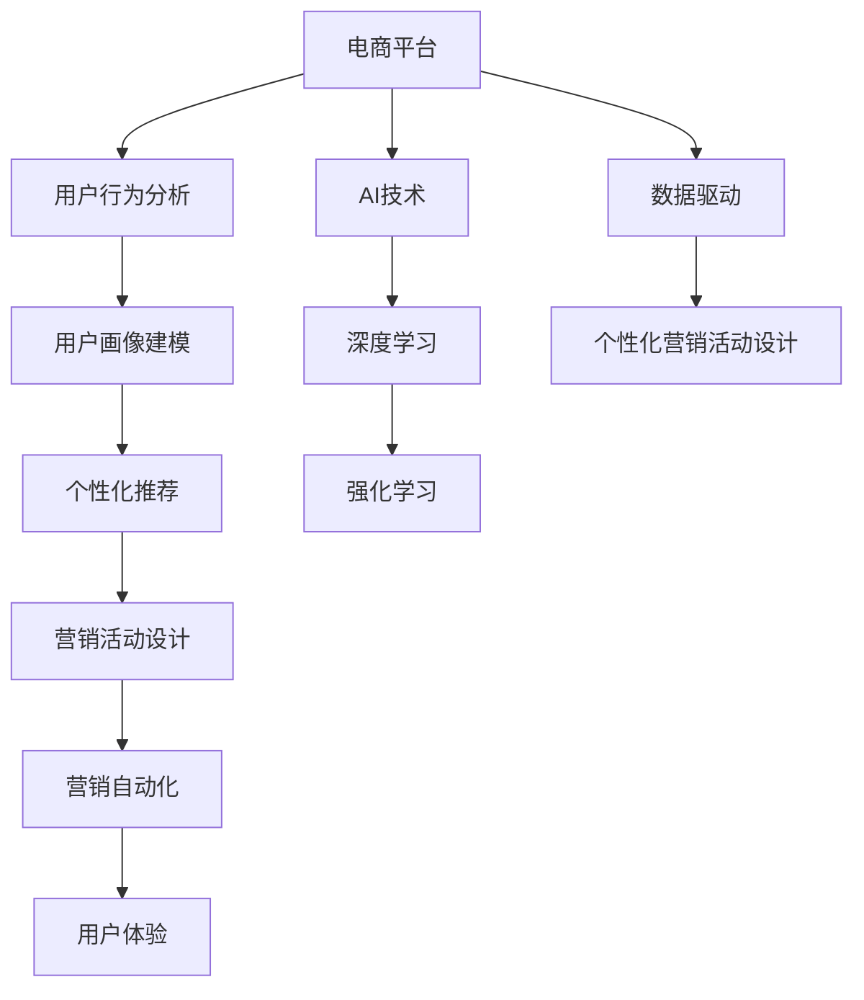

                 

# AI驱动的电商平台个性化营销活动设计

> 关键词：人工智能,电商平台,个性化推荐,营销活动,用户体验,用户行为分析,机器学习,深度学习,强化学习,营销自动化,数据驱动

## 1. 背景介绍

### 1.1 问题由来

随着电子商务市场的蓬勃发展，电商平台之间的竞争日益激烈。如何在海量用户和复杂商品中精准地定位用户，实现个性化推荐，提升用户体验和转化率，成为了各大电商平台关注的焦点。传统的推荐系统往往依赖于简单的协同过滤算法，难以处理大规模多维度的数据，且缺乏对用户行为和上下文环境的理解。为了解决这些问题，AI技术特别是机器学习和深度学习开始进入电商推荐领域，推动了个性化营销活动的兴起。

### 1.2 问题核心关键点

AI驱动的个性化营销活动，本质上是基于用户行为数据和商品属性特征，通过机器学习模型对用户进行精准画像，并设计个性化的推荐策略和营销活动，提升用户购买意愿和平台转化率。核心关键点包括：

- 用户画像建模：利用机器学习模型对用户行为数据进行分析，建立用户兴趣和行为模型，精准定位用户需求。
- 商品推荐算法：通过深度学习模型挖掘商品之间的关联和相似性，生成个性化推荐列表，满足用户多样化需求。
- 营销活动设计：结合用户画像和商品推荐结果，设计多样化、高效的营销活动，提升用户转化率和平台收益。

## 2. 核心概念与联系

### 2.1 核心概念概述

为了更好地理解AI驱动的个性化营销活动设计，本节将介绍几个关键概念及其之间的关系：

- 人工智能(Artificial Intelligence, AI)：利用算法和计算模型，使机器能够模拟人类智能行为的技术。
- 电商平台(e-Commerce Platform)：以互联网为媒介，提供商品展示、购买、支付等服务的在线平台。
- 个性化推荐(Personalized Recommendation)：根据用户行为数据和偏好，提供量身定制的推荐服务。
- 营销活动(Marketing Campaign)：旨在提升用户参与度和购买意愿，实现平台目标的一系列活动。
- 用户体验(User Experience, UX)：用户在使用平台服务时的主观感受和体验。
- 用户行为分析(User Behavior Analysis)：通过数据分析技术，识别用户行为模式和偏好。
- 机器学习(Machine Learning)：利用数据训练模型，自动提升算法性能。
- 深度学习(Deep Learning)：在多层神经网络基础上，深度学习可以自动提取和表示高层次抽象特征。
- 强化学习(Reinforcement Learning)：通过试错和奖励机制，优化智能体行为以实现目标。
- 营销自动化(Marketing Automation)：利用技术手段实现营销活动的自动化和智能化。
- 数据驱动(Data-Driven)：通过数据分析和技术手段，驱动业务决策和流程优化。

这些核心概念之间的逻辑关系可以通过以下Mermaid流程图来展示：



这个流程图展示了从电商平台到个性化营销活动设计的整体流程和关键技术环节：

1. 电商平台收集用户行为数据。
2. 通过用户行为分析建立用户画像。
3. 利用深度学习模型进行个性化推荐。
4. 结合用户画像和推荐结果设计营销活动。
5. 实现营销活动的自动化。
6. 优化用户体验，提升用户满意度。
7. 通过AI技术提升整个流程的智能化水平。

## 3. 核心算法原理 & 具体操作步骤
### 3.1 算法原理概述

基于用户行为数据和商品属性特征的个性化营销活动设计，主要依赖于机器学习算法，特别是深度学习和强化学习技术。

**深度学习模型**：通过多层神经网络自动提取特征，能够处理高维稀疏数据，发现数据中的复杂模式和规律。电商推荐常用的深度学习模型包括循环神经网络(RNN)、长短时记忆网络(LSTM)、卷积神经网络(CNN)和自编码器(Encoder-Decoder)等。

**强化学习模型**：通过试错和奖励机制，强化学习模型能够在模拟环境中优化智能体行为，从而实现动态调整推荐策略和营销活动的设计。

**推荐算法**：推荐算法主要包括基于协同过滤的算法、基于内容的算法和混合推荐算法等。其中，协同过滤算法利用用户和商品的相似性进行推荐，基于内容的算法结合商品属性和用户兴趣进行推荐，混合推荐算法则是二者的结合。

**营销活动设计**：营销活动设计通常包括优惠活动、优惠券、限时折扣、推荐商品等形式。基于深度学习模型的推荐结果，设计个性化的营销活动，能够更精准地吸引用户，提升转化率。

### 3.2 算法步骤详解

基于AI驱动的电商平台个性化营销活动设计，主要包括以下几个关键步骤：

**Step 1: 数据收集与预处理**

1. **用户行为数据**：从平台日志、交易记录、搜索历史、浏览行为等渠道，收集用户的点击、浏览、购买、评价等行为数据。

2. **商品属性数据**：收集商品的类别、价格、品牌、描述等信息。

3. **数据清洗与标准化**：对收集的数据进行去重、去噪、填充缺失值等预处理步骤，确保数据的质量。

**Step 2: 用户画像建模**

1. **用户特征提取**：从用户行为数据中提取关键特征，如浏览时长、购买频率、收藏商品、兴趣标签等。

2. **特征工程**：通过统计分析、特征选择、降维等方法，构建用户画像的特征向量。

3. **用户画像建模**：利用深度学习模型(如TensorFlow、PyTorch)，建立用户画像的表示模型。常用的模型包括用户兴趣网络、用户行为序列模型等。

**Step 3: 商品推荐算法**

1. **商品特征嵌入**：将商品的类别、价格、品牌等属性特征，通过词嵌入、神经网络等方法，转化为高维稠密向量表示。

2. **相似度计算**：基于商品向量表示，计算商品之间的相似度，生成推荐列表。

3. **推荐模型训练**：利用用户行为数据和商品特征向量，训练深度学习推荐模型，提升推荐效果。

**Step 4: 营销活动设计**

1. **活动策略设计**：根据用户画像和推荐结果，设计个性化的营销活动策略，如折扣力度、活动时间、推荐商品组合等。

2. **活动参数优化**：利用强化学习模型，对营销活动策略进行优化，提升活动效果。

3. **活动执行与监控**：将营销活动策略应用到平台，实时监控活动效果，及时调整策略。

**Step 5: 用户体验优化**

1. **用户反馈收集**：通过问卷调查、评价反馈等方式，收集用户对推荐和营销活动的评价。

2. **用户体验评估**：利用NPS、转化率等指标，评估用户对推荐和营销活动的满意度。

3. **持续改进**：根据用户反馈和评估结果，持续改进推荐模型和营销活动策略。

### 3.3 算法优缺点

基于AI驱动的个性化营销活动设计具有以下优点：

- **提升转化率**：通过精准的用户画像和个性化推荐，能够显著提升用户的购买意愿和转化率。
- **优化用户体验**：个性化的推荐和营销活动，能够提供更符合用户需求的服务，提升用户满意度和忠诚度。
- **数据驱动决策**：利用数据和算法，驱动营销活动的自动化和智能化，提高决策效率和准确性。
- **市场响应快**：通过快速调整推荐和营销策略，能够迅速响应市场变化，保持竞争优势。

同时，该方法也存在一些局限性：

- **数据隐私问题**：用户行为数据的收集和处理可能涉及隐私问题，需要严格的法律法规和技术保护。
- **模型复杂度**：深度学习模型和强化学习模型的训练和优化需要大量的计算资源和时间。
- **模型可解释性**：复杂模型的不透明性可能导致其行为难以解释，影响用户信任和接受度。
- **模型泛化能力**：模型在不同用户和商品之间的泛化能力有待提升，避免过拟合现象。
- **多模态数据融合**：如何将文本、图片、音频等多模态数据进行融合，提供更全面的用户画像，仍需深入研究。

### 3.4 算法应用领域

基于AI驱动的个性化营销活动设计，广泛应用于电商平台、社交媒体、在线教育等多个领域。例如：

- **电商平台**：利用推荐算法和营销活动，提升用户购买转化率和平台收益。
- **社交媒体**：通过个性化推荐和活动设计，增加用户互动和平台粘性。
- **在线教育**：根据用户学习行为和兴趣，推荐个性化课程和学习资源。

此外，AI驱动的个性化营销活动设计还适用于智慧医疗、智能客服、金融理财等场景，帮助各类企业提升用户价值和服务水平。

## 4. 数学模型和公式 & 详细讲解 & 举例说明

### 4.1 数学模型构建

本节将使用数学语言对AI驱动的电商平台个性化营销活动设计的核心模型进行详细构建和解释。

**用户画像模型**：

用户画像模型的构建分为两个阶段：特征提取和表示建模。特征提取是从用户行为数据中提取关键特征，表示建模则是通过深度学习模型将特征向量映射为高维空间的用户表示。

假设用户 $i$ 的特征向量为 $x_i \in \mathbb{R}^n$，深度学习模型的参数为 $\theta$，用户画像模型 $f$ 的输出为 $u_i \in \mathbb{R}^d$。则用户画像模型可以表示为：

$$
u_i = f(x_i, \theta)
$$

其中 $f$ 可以是任意深度神经网络，如多层感知器(MLP)、卷积神经网络(CNN)、循环神经网络(RNN)等。

**推荐模型**：

推荐模型通常使用协同过滤算法、基于内容的算法或混合推荐算法。这里以基于内容的推荐算法为例，假设商品 $j$ 的特征向量为 $v_j \in \mathbb{R}^d$，推荐模型 $p$ 的输出为 $r_{ij} \in \mathbb{R}$，则推荐模型可以表示为：

$$
r_{ij} = p(u_i, v_j, \phi)
$$

其中 $\phi$ 为推荐模型的参数。推荐模型的目标是最小化预测误差，常用的损失函数为均方误差损失函数：

$$
\mathcal{L}_{rec}(\phi) = \frac{1}{N}\sum_{i=1}^N \sum_{j=1}^M (r_{ij} - \hat{y}_{ij})^2
$$

其中 $N$ 为用户的数量，$M$ 为商品的种类，$\hat{y}_{ij}$ 为推荐模型的预测值。

**强化学习模型**：

强化学习模型通常使用深度强化学习模型，如深度Q网络(DQN)、深度确定性策略梯度(DDPG)等。以DQN为例，假设当前状态为 $s$，动作为 $a$，即时奖励为 $r$，下一状态为 $s'$，则强化学习模型的目标是最小化即时奖励的方差，即：

$$
\mathcal{L}_{RL}(\theta) = \frac{1}{N}\sum_{i=1}^N \mathbb{E}_{s \sim D, a \sim \pi(\cdot | s)} [(r + \gamma \max_a Q^\pi(s', a))^2]
$$

其中 $D$ 为状态分布，$\pi$ 为动作策略，$Q^\pi$ 为Q函数，$\gamma$ 为折扣因子。

### 4.2 公式推导过程

以下我们以基于内容的推荐算法为例，推导推荐模型的预测公式及其梯度计算过程。

**基于内容的推荐算法**：

假设商品 $j$ 的特征向量为 $v_j \in \mathbb{R}^d$，用户 $i$ 的特征向量为 $u_i \in \mathbb{R}^d$，则基于内容的推荐算法可以表示为：

$$
r_{ij} = u_i \cdot v_j
$$

其中 $\cdot$ 表示向量点积。

假设模型参数为 $\phi$，则推荐模型可以表示为：

$$
r_{ij} = \langle \phi u_i, v_j \rangle
$$

其中 $\langle \cdot, \cdot \rangle$ 表示向量内积。

利用均方误差损失函数，推荐模型的损失函数可以表示为：

$$
\mathcal{L}_{rec}(\phi) = \frac{1}{N}\sum_{i=1}^N \sum_{j=1}^M (r_{ij} - \hat{y}_{ij})^2
$$

其中 $\hat{y}_{ij}$ 为推荐模型的预测值，可以通过以下公式计算：

$$
\hat{y}_{ij} = \langle \phi u_i, v_j \rangle
$$

根据链式法则，推荐模型参数 $\phi$ 的梯度为：

$$
\frac{\partial \mathcal{L}_{rec}(\phi)}{\partial \phi} = \frac{1}{N}\sum_{i=1}^N \sum_{j=1}^M 2(r_{ij} - \hat{y}_{ij}) u_i v_j
$$

### 4.3 案例分析与讲解

**案例：电商平台个性化推荐系统**

假设一个电商平台的推荐系统，用户 $i$ 浏览了商品 $j_1, j_2, j_3$，购买了商品 $j_4$。利用基于内容的推荐算法，对用户 $i$ 进行推荐。

首先，将用户行为数据 $(j_1, j_2, j_3, j_4)$ 进行特征提取，得到用户画像 $u_i \in \mathbb{R}^d$。然后，将商品特征向量 $v_{j_1}, v_{j_2}, v_{j_3}, v_{j_4}$ 输入推荐模型 $p$，计算推荐结果 $r_{ij_1}, r_{ij_2}, r_{ij_3}, r_{ij_4}$。最后，根据预测结果，选择推荐商品 $j_5, j_6, j_7$。

## 5. 项目实践：代码实例和详细解释说明

### 5.1 开发环境搭建

在进行AI驱动的电商平台个性化营销活动设计实践前，我们需要准备好开发环境。以下是使用Python进行TensorFlow开发的环境配置流程：

1. 安装Anaconda：从官网下载并安装Anaconda，用于创建独立的Python环境。

2. 创建并激活虚拟环境：
```bash
conda create -n tf-env python=3.8 
conda activate tf-env
```

3. 安装TensorFlow：
```bash
pip install tensorflow
```

4. 安装相关库：
```bash
pip install numpy pandas scikit-learn jupyter notebook ipython
```

完成上述步骤后，即可在`tf-env`环境中开始实践。

### 5.2 源代码详细实现

这里我们以推荐系统为例，给出使用TensorFlow构建的基于内容的推荐算法的PyTorch代码实现。

首先，定义用户和商品的数据结构：

```python
class User:
    def __init__(self, features):
        self.id = 0
        self.features = features
        
class Item:
    def __init__(self, features):
        self.id = 0
        self.features = features
```

然后，定义深度学习模型：

```python
from tensorflow.keras.layers import Dense
from tensorflow.keras.models import Model

class Model:
    def __init__(self, input_dim, output_dim):
        self.input_dim = input_dim
        self.output_dim = output_dim
        self.model = self.build_model()
        
    def build_model(self):
        input = Dense(128, activation='relu', input_shape=(self.input_dim,))(input)
        output = Dense(self.output_dim, activation='sigmoid')(input)
        model = Model(inputs=input, outputs=output)
        return model
```

接着，定义训练函数：

```python
import numpy as np
from tensorflow.keras.optimizers import Adam

def train_model(model, data):
    model.compile(optimizer=Adam(lr=0.001), loss='mse')
    history = model.fit(x=data['user_features'], y=data['item_features'], epochs=10, batch_size=16, validation_split=0.2)
    return history
```

最后，启动训练流程：

```python
user_data = [User([1, 0, 1]), User([0, 1, 0]), User([1, 0, 0])]
item_data = [Item([1, 0, 0]), Item([0, 1, 0]), Item([0, 0, 1])]

user_features = np.array([x.features for x in user_data])
item_features = np.array([x.features for x in item_data])

model = Model(input_dim=3, output_dim=1)
history = train_model(model, {'user_features': user_features, 'item_features': item_features})
```

以上就是使用TensorFlow构建基于内容的推荐算法的完整代码实现。可以看到，TensorFlow提供了强大的深度学习框架，能够方便地构建和训练推荐模型。

### 5.3 代码解读与分析

让我们再详细解读一下关键代码的实现细节：

**User和Item类**：
- `__init__`方法：初始化用户和商品的特征向量。
- `id`属性：唯一标识用户和商品的ID。

**Model类**：
- `__init__`方法：初始化模型，构建深度神经网络。
- `build_model`方法：定义网络结构，包括输入层、隐藏层和输出层。
- `Model`类：将定义好的模型封装为可调用对象。

**train_model函数**：
- `compile`方法：配置优化器和损失函数。
- `fit`方法：训练模型，输出训练过程中的指标记录。
- `input`层：指定模型的输入维度。
- `Dense`层：定义全连接层，激活函数为ReLU和Sigmoid。
- `Adam`优化器：使用Adam优化器进行模型训练。
- `mse`损失函数：均方误差损失函数，适合回归问题。

**训练流程**：
- 定义用户和商品的数据。
- 使用Numpy将特征向量转换为NumPy数组。
- 创建Model实例，构建推荐模型。
- 调用train_model函数进行模型训练。
- 输出训练历史，包括损失值和验证集的准确率。

可以看到，TensorFlow提供了强大的深度学习框架，能够方便地构建和训练推荐模型。开发者可以将更多精力放在模型优化和超参数调优等高层逻辑上，而不必过多关注底层的实现细节。

当然，工业级的系统实现还需考虑更多因素，如模型的保存和部署、超参数的自动搜索、更灵活的任务适配层等。但核心的推荐算法基本与此类似。

## 6. 实际应用场景

### 6.1 智能客服系统

基于AI驱动的个性化营销活动设计，可以在智能客服系统中发挥重要作用。智能客服系统能够自动分析用户咨询内容，匹配最佳回答，提升客服效率和用户满意度。

在技术实现上，可以收集历史客服对话记录，将其作为训练数据，对预训练的语言模型进行微调，使其能够理解用户意图并提供最佳答复。通过微调后的模型，智能客服系统能够在任何时间回答用户问题，提升用户体验。

### 6.2 金融舆情监测

金融市场瞬息万变，准确把握市场舆情对于投资者和金融机构至关重要。基于AI驱动的个性化营销活动设计，可以实时监测金融市场的舆情变化，及时预警市场风险。

具体而言，可以通过自然语言处理技术对金融新闻、评论、社交媒体内容进行情感分析，预测市场走势。将情感分析结果作为输入，结合市场历史数据，利用深度学习模型进行预测。微调后的模型能够实时更新预测结果，帮助投资者和金融机构做出更明智的决策。

### 6.3 个性化推荐系统

当前的推荐系统往往只依赖于简单的协同过滤算法，难以处理大规模多维度的数据，且缺乏对用户行为和上下文环境的理解。基于AI驱动的个性化营销活动设计，可以提升推荐系统的智能化水平，更好地满足用户需求。

在实践上，可以收集用户浏览、点击、评价等行为数据，利用深度学习模型挖掘用户兴趣和商品关联，生成个性化推荐列表。通过微调后的模型，推荐系统能够提供更精准、更符合用户需求的推荐内容，提升用户满意度。

### 6.4 未来应用展望

随着AI技术的不断进步，基于AI驱动的个性化营销活动设计将迎来更多应用场景和更大潜力。

在智慧医疗领域，通过个性化推荐系统，可以推荐最适合用户的医疗方案和专家，提升医疗服务的质量和效率。

在智能教育领域，通过个性化推荐系统，可以推荐最适合用户的学习资源和课程，提升学习效果和用户体验。

在智慧城市治理中，通过个性化推荐系统，可以推荐最适合用户的公共服务和城市设施，提升城市管理和公共服务水平。

此外，在企业生产、社会治理、文娱传媒等众多领域，基于AI驱动的个性化营销活动设计将不断涌现，为传统行业数字化转型升级提供新的技术路径。相信随着技术的日益成熟，AI驱动的个性化营销活动设计必将在更广阔的应用领域大放异彩，深刻影响人类的生产生活方式。

## 7. 工具和资源推荐

### 7.1 学习资源推荐

为了帮助开发者系统掌握AI驱动的电商平台个性化营销活动设计的理论基础和实践技巧，这里推荐一些优质的学习资源：

1. 《深度学习》书籍：由Ian Goodfellow等著，系统介绍了深度学习的基本原理和应用，是深度学习领域的经典教材。

2. 《强化学习》书籍：由Richard Sutton和Andrew Barto著，详细讲解了强化学习的基本概念和算法，是强化学习领域的经典教材。

3. 《自然语言处理》课程：由斯坦福大学开设的Coursera课程，介绍了自然语言处理的基本概念和技术，适合入门学习。

4. 《Python深度学习》书籍：由Francois Chollet著，全面介绍了深度学习在TensorFlow和Keras中的实现，适合实战学习。

5. 《TensorFlow官方文档》：TensorFlow的官方文档，提供了丰富的教程、模型和工具，是TensorFlow学习的必备资料。

通过对这些资源的学习实践，相信你一定能够快速掌握AI驱动的电商平台个性化营销活动设计的精髓，并用于解决实际的NLP问题。

### 7.2 开发工具推荐

高效的开发离不开优秀的工具支持。以下是几款用于AI驱动的电商平台个性化营销活动设计开发的常用工具：

1. TensorFlow：由Google主导开发的开源深度学习框架，生产部署方便，适合大规模工程应用。

2. PyTorch：基于Python的开源深度学习框架，灵活动态的计算图，适合快速迭代研究。

3. Jupyter Notebook：轻量级的交互式编程环境，支持多种编程语言和可视化工具，适合数据科学和机器学习开发。

4. Weights & Biases：模型训练的实验跟踪工具，可以记录和可视化模型训练过程中的各项指标，方便对比和调优。

5. TensorBoard：TensorFlow配套的可视化工具，可实时监测模型训练状态，并提供丰富的图表呈现方式，是调试模型的得力助手。

6. Kaggle：数据科学竞赛平台，提供大量公开数据集和代码示例，适合实战学习和竞赛。

合理利用这些工具，可以显著提升AI驱动的电商平台个性化营销活动设计任务的开发效率，加快创新迭代的步伐。

### 7.3 相关论文推荐

AI驱动的电商平台个性化营销活动设计的研究源于学界的持续研究。以下是几篇奠基性的相关论文，推荐阅读：

1. "A Survey on Recommendation Algorithms for E-Commerce Platforms"：概述了电商推荐算法的研究现状，推荐系统构建和优化方法。

2. "Adaptive Deep Learning for Recommendation"：提出了基于深度学习推荐模型的自适应优化方法，提升推荐效果。

3. "Deep Reinforcement Learning for Recommendation"：探讨了强化学习在推荐系统中的应用，利用Q网络进行推荐策略优化。

4. "Neural Collaborative Filtering"：利用神经网络进行协同过滤推荐，提升了推荐模型的表现。

5. "Model-Based Deep Reinforcement Learning for Dynamic Recommendation"：将深度强化学习与推荐模型结合，动态调整推荐策略。

这些论文代表了大语言模型微调技术的发展脉络。通过学习这些前沿成果，可以帮助研究者把握学科前进方向，激发更多的创新灵感。

## 8. 总结：未来发展趋势与挑战

### 8.1 研究成果总结

本文对基于AI驱动的电商平台个性化营销活动设计进行了全面系统的介绍。首先阐述了AI技术在电商平台个性化推荐中的应用背景和意义，明确了AI驱动的个性化推荐的核心关键点。其次，从原理到实践，详细讲解了推荐算法的数学模型和具体操作步骤，给出了推荐系统开发的完整代码实例。同时，本文还广泛探讨了AI驱动的个性化营销活动设计在智能客服、金融舆情、个性化推荐等多个行业领域的应用前景，展示了AI驱动的个性化推荐范式的巨大潜力。此外，本文精选了推荐技术的各类学习资源，力求为读者提供全方位的技术指引。

通过本文的系统梳理，可以看到，基于AI驱动的电商平台个性化营销活动设计，在提升用户购买意愿和平台收益、优化用户体验等方面具有重要作用。借助深度学习和强化学习等技术，推荐系统能够从海量数据中挖掘用户行为规律，生成个性化推荐列表，提升推荐精度。未来，随着AI技术的不断进步，推荐系统将在更多领域得到应用，为各行各业带来变革性影响。

### 8.2 未来发展趋势

展望未来，基于AI驱动的电商平台个性化营销活动设计将呈现以下几个发展趋势：

1. 推荐系统智能化水平提升。随着深度学习和强化学习技术的进步，推荐系统将更加智能化，能够根据用户行为和上下文环境进行动态调整和优化。

2. 多模态数据融合。推荐系统将结合文本、图片、视频等多种模态数据，提供更全面、精准的用户画像，提升推荐效果。

3. 推荐策略多样化。推荐系统将引入更多元化的推荐策略，如基于内容的推荐、基于协同过滤的推荐、混合推荐等，实现更个性化的推荐服务。

4. 个性化推荐体系化。推荐系统将构建更加体系化的推荐架构，包括用户画像、推荐算法、营销活动等多个环节，实现闭环优化。

5. 实时推荐技术进步。推荐系统将利用流式计算和实时数据处理技术，实现实时推荐，满足用户即时需求。

6. 推荐系统的可解释性增强。推荐系统将引入更多可解释性方法，帮助用户理解推荐结果的来源和逻辑，提升用户信任和满意度。

以上趋势凸显了基于AI驱动的电商平台个性化营销活动设计的广阔前景。这些方向的探索发展，必将进一步提升推荐系统的性能和应用范围，为各行各业带来更大价值。

### 8.3 面临的挑战

尽管基于AI驱动的电商平台个性化营销活动设计已经取得了瞩目成就，但在迈向更加智能化、普适化应用的过程中，它仍面临诸多挑战：

1. 数据隐私问题。用户行为数据的收集和处理可能涉及隐私问题，需要严格的法律法规和技术保护。

2. 推荐系统的泛化能力。推荐系统在不同用户和商品之间的泛化能力有待提升，避免过拟合现象。

3. 推荐系统的可解释性。复杂推荐系统的行为难以解释，影响用户信任和接受度。

4. 实时推荐技术挑战。实时推荐需要高效率的计算和存储能力，需要进一步优化。

5. 多模态数据的融合。如何将文本、图片、视频等多种模态数据进行有效融合，仍需深入研究。

6. 推荐系统的可扩展性。随着数据量的增加和用户规模的扩大，推荐系统的可扩展性面临挑战。

正视推荐系统面临的这些挑战，积极应对并寻求突破，将是大规模推荐系统不断进步的关键。相信随着学界和产业界的共同努力，这些挑战终将一一被克服，推荐系统必将在更广泛的应用领域大放异彩。

### 8.4 研究展望

面对基于AI驱动的电商平台个性化营销活动设计所面临的挑战，未来的研究需要在以下几个方面寻求新的突破：

1. 探索无监督和半监督推荐方法。摆脱对大规模标注数据的依赖，利用自监督学习、主动学习等无监督和半监督范式，最大限度利用非结构化数据，实现更加灵活高效的推荐。

2. 研究参数高效和计算高效的推荐范式。开发更加参数高效的推荐方法，在固定大部分预训练参数的同时，只更新极少量的任务相关参数。同时优化推荐模型的计算图，减少前向传播和反向传播的资源消耗，实现更加轻量级、实时性的部署。

3. 引入更多先验知识。将符号化的先验知识，如知识图谱、逻辑规则等，与神经网络模型进行巧妙融合，引导推荐过程学习更准确、合理的商品关联。

4. 结合因果分析和博弈论工具。将因果分析方法引入推荐模型，识别出推荐决策的关键特征，增强推荐结果的因果性和逻辑性。借助博弈论工具刻画用户和推荐系统之间的交互过程，主动探索并规避推荐系统的脆弱点，提高系统稳定性。

5. 纳入伦理道德约束。在推荐系统设计中引入伦理导向的评估指标，过滤和惩罚有偏见、有害的输出倾向。同时加强人工干预和审核，建立推荐系统的监管机制，确保输出符合人类价值观和伦理道德。

这些研究方向的探索，必将引领基于AI驱动的电商平台个性化营销活动设计技术迈向更高的台阶，为构建安全、可靠、可解释、可控的智能推荐系统铺平道路。面向未来，基于AI驱动的电商平台个性化营销活动设计需要与其他人工智能技术进行更深入的融合，如知识表示、因果推理、强化学习等，多路径协同发力，共同推动推荐系统的进步。只有勇于创新、敢于突破，才能不断拓展推荐系统的边界，让智能技术更好地服务于用户和社会。

## 9. 附录：常见问题与解答

**Q1：基于AI驱动的电商平台个性化营销活动设计是否适用于所有电商业务场景？**

A: 基于AI驱动的电商平台个性化营销活动设计，在大部分电商业务场景中都具有应用价值。但是，对于某些特定类型的电商业务，如B2B、B2G等，由于其业务模式和用户需求与B2C电商业务存在较大差异，可能需要针对性地设计个性化的推荐和营销策略。

**Q2：如何确保推荐系统的公平性和公正性？**

A: 确保推荐系统的公平性和公正性，需要在设计阶段引入公平性指标和公正性评估方法。具体措施包括：
1. 数据采集与处理：确保数据采集和处理过程中的公平性，避免数据偏差。
2. 推荐算法设计：在设计推荐算法时，考虑不同用户群体的公平性问题，避免对某些群体的歧视。
3. 推荐结果审查：对推荐结果进行定期审查，识别和纠正可能的偏见。
4. 用户反馈机制：建立用户反馈机制，及时收集和处理用户投诉和建议。

**Q3：推荐系统如何应对推荐结果的变动和更新？**

A: 推荐系统需要设计灵活的推荐策略和数据更新机制，以应对推荐结果的变动和更新。具体措施包括：
1. 动态调整推荐策略：根据用户行为和市场变化，动态调整推荐策略和参数。
2. 实时数据处理：利用流式计算和实时数据处理技术，实现推荐结果的实时更新。
3. 推荐策略迭代：通过A/B测试等方法，不断迭代和优化推荐策略。

**Q4：如何评估推荐系统的推荐效果？**

A: 推荐系统的推荐效果可以通过多种指标进行评估，包括：
1. 准确率：推荐系统准确推荐的商品数量占总推荐数量的比例。
2. 召回率：推荐系统中包含真实购买商品的比例。
3. 点击率：用户点击推荐商品的概率。
4. 转化率：用户购买推荐商品的比例。
5. NDCG（Normalized Discounted Cumulative Gain）：衡量推荐系统排序效果的指标。
6. HR（Hit Rate）：推荐列表中包含真实购买商品的比例。

通过这些指标的评估，可以全面了解推荐系统的表现，并针对性地优化推荐策略。

**Q5：推荐系统如何应对用户隐私保护的需求？**

A: 推荐系统需要设计用户隐私保护机制，以确保用户数据的安全和隐私。具体措施包括：
1. 数据匿名化：对用户数据进行匿名化处理，防止个人隐私泄露。
2. 数据加密：在数据传输和存储过程中，使用加密技术保护数据安全。
3. 用户控制：提供用户数据访问和删除的权利，增强用户对数据控制的能力。
4. 隐私政策：制定明确的隐私政策，告知用户数据使用的范围和目的。

通过这些措施，可以有效保护用户隐私，增强用户对推荐系统的信任。

---

作者：禅与计算机程序设计艺术 / Zen and the Art of Computer Programming

