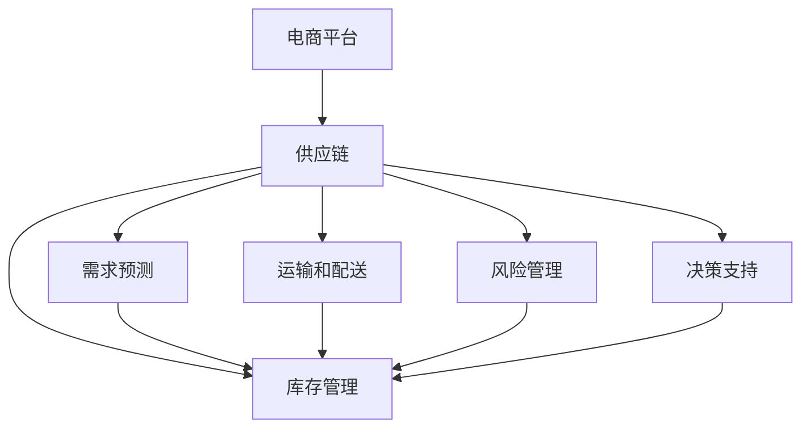

                 

# AI驱动的电商平台供应链优化

> 关键词：人工智能,电商平台,供应链优化,机器学习,预测分析,实时监控,决策支持,成本控制,库存管理

## 1. 背景介绍

### 1.1 问题由来
电商平台的蓬勃发展不仅改变了消费者购物的方式，也对供应链管理提出了新的要求。随着在线销售的快速增长，电商平台需要更加高效、智能的供应链管理系统，以应对日益复杂的订单需求和供应链挑战。然而，传统的供应链管理系统往往依赖于人工决策，难以实时响应市场需求，容易产生库存积压或短缺，影响客户体验和销售业绩。

### 1.2 问题核心关键点
为应对这一挑战，电商平台纷纷引入AI技术，构建智能化的供应链管理系统。AI驱动的供应链优化主要包括以下几个关键点：

1. **需求预测**：使用机器学习算法对用户订单数据进行建模，准确预测未来的需求量。
2. **库存管理**：根据预测结果调整库存水平，避免过度或缺货，优化库存成本。
3. **运输和配送**：优化物流路径和配送策略，提升配送效率，降低配送成本。
4. **风险管理**：通过实时监控和预警，及时发现供应链中的异常情况，减少损失。
5. **决策支持**：提供基于数据的智能建议，辅助人工决策。

### 1.3 问题研究意义
AI驱动的电商平台供应链优化具有重要的现实意义：

1. **提升效率**：通过自动化决策，减少人工干预，提高供应链管理的效率。
2. **降低成本**：通过优化库存和物流，降低供应链运营成本。
3. **增强响应性**：实时响应市场需求，提升客户满意度。
4. **数据驱动**：通过大数据分析和预测模型，提供精准的决策支持。
5. **增强竞争力**：提高供应链的灵活性和响应能力，增强市场竞争力。

## 2. 核心概念与联系

### 2.1 核心概念概述

为更好地理解AI驱动的电商平台供应链优化，本节将介绍几个关键概念：

- **电商平台**：通过互联网提供商品展示、销售、物流配送等服务的平台。
- **供应链**：从生产到销售全流程的各个环节，包括原材料采购、生产制造、仓储管理、运输配送等。
- **需求预测**：通过对历史订单数据的分析，预测未来用户需求。
- **库存管理**：根据需求预测结果，优化库存水平和存储位置。
- **运输和配送**：优化物流路径和配送策略，提升配送效率。
- **风险管理**：通过实时监控和预警，及时发现和应对供应链中的异常情况。
- **决策支持**：基于数据分析和预测模型，提供智能化的决策建议。

这些概念之间的逻辑关系可以通过以下Mermaid流程图来展示：



这个流程图展示了一个典型的电商平台供应链管理系统的组成和流程：

1. 电商平台接收订单，通过需求预测模型计算需求量。
2. 需求预测结果用于库存管理，优化库存水平和存储位置。
3. 运输和配送策略基于需求预测结果和库存状态进行优化。
4. 风险管理实时监控供应链状态，及时预警异常。
5. 决策支持系统提供基于数据的智能建议，辅助人工决策。

## 3. 核心算法原理 & 具体操作步骤
### 3.1 算法原理概述

AI驱动的电商平台供应链优化主要依赖于机器学习和预测分析技术。其核心思想是通过对历史数据的学习，构建模型来预测未来的需求和供应链状态，并据此做出智能化的决策。

形式化地，假设电商平台当前库存量为 $I_t$，订单需求量为 $D_{t+1}$，则优化目标是最小化成本和最大化利润，即：

$$
\min_{I_t, D_{t+1}} \left( C(I_t, D_{t+1}) - P(I_t, D_{t+1}) \right)
$$

其中 $C(I_t, D_{t+1})$ 为成本函数，$P(I_t, D_{t+1})$ 为利润函数。具体成本和利润的计算可以基于需求预测、库存水平、配送策略等因素综合考虑。

通过梯度下降等优化算法，不断更新库存量和订单需求量，以逼近最优解。优化过程可以进一步细化为以下几个步骤：

1. 收集和清洗历史订单数据，用于训练需求预测模型。
2. 构建和训练库存管理模型，优化库存水平。
3. 优化物流路径和配送策略，降低运输成本。
4. 实时监控供应链状态，及时发现和应对异常情况。
5. 提供基于数据的智能决策支持，辅助人工决策。

### 3.2 算法步骤详解

#### 3.2.1 需求预测模型构建

需求预测是供应链优化的第一步，通过机器学习算法对历史订单数据进行建模，预测未来的订单需求量。常用的需求预测模型包括时间序列模型、回归模型、集成学习模型等。

具体步骤如下：

1. 数据预处理：清洗和归一化数据，去除异常值和噪声。
2. 特征工程：提取和选择对需求预测有用的特征，如订单数量、订单金额、季节性特征等。
3. 模型选择：选择合适的机器学习算法，如ARIMA、LSTM、XGBoost等。
4. 模型训练：使用历史订单数据对模型进行训练，评估模型性能。
5. 模型预测：使用训练好的模型对未来的订单需求进行预测。

#### 3.2.2 库存管理模型构建

库存管理是供应链优化的核心环节，通过预测需求量和库存状态，优化库存水平和存储位置，减少库存成本和缺货风险。常用的库存管理模型包括经济批量模型(Economic Order Quantity, EOQ)、安全库存模型(Safety Stock)等。

具体步骤如下：

1. 需求预测：通过需求预测模型获取未来需求量的预测值。
2. 库存状态评估：评估当前的库存水平和存储位置，确定库存状态。
3. 模型选择：选择合适的库存管理模型，如EOQ模型、Safety Stock模型等。
4. 模型计算：根据需求预测结果和库存状态，计算最优的库存水平和存储位置。
5. 库存调整：根据计算结果调整库存水平，优化库存成本和缺货风险。

#### 3.2.3 运输和配送策略优化

运输和配送策略优化是供应链优化的重要环节，通过优化物流路径和配送策略，提升配送效率，降低配送成本。常用的策略包括最短路径算法、遗传算法等。

具体步骤如下：

1. 物流路径规划：使用最短路径算法，计算最优的配送路径。
2. 配送策略设计：设计合理的配送策略，如批量配送、智能分拣等。
3. 模型评估：评估运输和配送策略的效果，调整策略参数。
4. 策略实施：根据评估结果优化配送策略，提升配送效率。

#### 3.2.4 风险管理模型构建

风险管理是供应链优化的保障环节，通过实时监控和预警，及时发现和应对供应链中的异常情况。常用的风险管理模型包括异常检测模型、预测模型等。

具体步骤如下：

1. 数据收集：收集供应链各环节的实时数据，如订单状态、库存水平、运输状态等。
2. 异常检测：使用异常检测模型，识别供应链中的异常情况。
3. 风险评估：评估异常情况的影响和风险，确定应对策略。
4. 预警和干预：根据风险评估结果，发出预警并采取干预措施，减少损失。

#### 3.2.5 决策支持系统构建

决策支持系统是供应链优化的辅助环节，通过提供基于数据的智能建议，辅助人工决策。常用的系统包括数据可视化系统、智能推荐系统等。

具体步骤如下：

1. 数据集成：集成供应链各环节的数据，构建统一的数据平台。
2. 数据可视化：使用数据可视化工具，展示供应链状态和预测结果。
3. 智能推荐：使用智能推荐算法，提供基于数据的决策建议。
4. 人工决策：结合系统建议和人工经验，做出最优决策。

### 3.3 算法优缺点

AI驱动的电商平台供应链优化具有以下优点：

1. **高效性**：通过自动化决策，减少人工干预，提高供应链管理的效率。
2. **精确性**：通过机器学习和预测模型，提供精准的需求预测和库存管理建议。
3. **实时性**：通过实时监控和预警，及时发现和应对供应链中的异常情况。
4. **灵活性**：通过智能推荐和人工决策结合，提升供应链的灵活性和响应能力。

同时，该方法也存在一定的局限性：

1. **数据依赖**：模型训练和预测依赖于历史数据的质量和数量，获取高质量数据成本较高。
2. **模型复杂性**：构建和维护复杂的预测和优化模型，需要一定的技术门槛。
3. **适应性不足**：模型可能无法适应新领域或新业务场景，需要不断迭代和优化。
4. **安全性问题**：数据安全和隐私保护是供应链优化的重要挑战，需考虑数据泄露和攻击风险。

尽管存在这些局限性，但就目前而言，AI驱动的供应链优化仍是大数据分析和人工智能在电商领域应用的重要方向。未来相关研究的重点在于如何进一步降低数据依赖，提高模型的适应性和安全性，同时兼顾效率和成本控制。

### 3.4 算法应用领域

AI驱动的电商平台供应链优化已经在电商、零售、物流等多个领域得到广泛应用，具体如下：

1. **电商运营**：通过需求预测和库存管理，优化商品库存和销售策略，提升订单处理效率。
2. **物流配送**：通过运输和配送策略优化，提升配送效率，降低配送成本。
3. **风险管理**：通过实时监控和预警，及时发现和应对供应链中的异常情况，减少损失。
4. **成本控制**：通过需求预测和库存管理，优化库存水平和配送策略，降低供应链运营成本。
5. **客户体验**：通过智能推荐和实时调整，提升客户购物体验，增加客户粘性。

## 4. 数学模型和公式 & 详细讲解

### 4.1 数学模型构建

假设电商平台当前库存量为 $I_t$，订单需求量为 $D_{t+1}$，则优化目标是最小化成本和最大化利润，即：

$$
\min_{I_t, D_{t+1}} \left( C(I_t, D_{t+1}) - P(I_t, D_{t+1}) \right)
$$

其中 $C(I_t, D_{t+1})$ 为成本函数，$P(I_t, D_{t+1})$ 为利润函数。具体成本和利润的计算可以基于需求预测、库存水平、配送策略等因素综合考虑。

### 4.2 公式推导过程

以下我们以需求预测模型为例，推导时间序列模型ARIMA的公式和参数估计方法。

假设需求量 $D_t$ 是自回归和滑动平均的线性组合，即：

$$
D_t = \phi_1 D_{t-1} + \theta_1 \epsilon_{t-1} + \mu_t
$$

其中 $\phi_1$ 和 $\theta_1$ 为模型的参数，$\epsilon_t$ 为随机误差项，$\mu_t$ 为常数项。

根据上述模型，需求预测的目标是最小化预测误差，即：

$$
\min_{\theta} \sum_{t=1}^T (D_t - \hat{D}_t)^2
$$

其中 $\hat{D}_t = \phi_1 \hat{D}_{t-1} + \theta_1 \epsilon_{t-1} + \mu_t$ 为预测值，$T$ 为预测的时间长度。

将需求预测问题转化为参数估计问题，使用最大似然估计方法求解：

$$
\min_{\theta} -\frac{1}{2T}\sum_{t=1}^T (D_t - \hat{D}_t)^2
$$

通过求解上述优化问题，可以得到模型参数 $\phi_1$ 和 $\theta_1$ 的估计值，从而构建需求预测模型。

### 4.3 案例分析与讲解

假设某电商平台拥有1个月的历史订单数据，共有5000个订单，其中前4500个订单的订单量已知，后500个订单的需求量为未知。使用ARIMA模型对后500个订单进行需求预测。

具体步骤如下：

1. 数据预处理：清洗和归一化数据，去除异常值和噪声。
2. 特征工程：提取和选择对需求预测有用的特征，如订单数量、订单金额、季节性特征等。
3. 模型选择：选择ARIMA模型进行需求预测。
4. 模型训练：使用前4500个订单数据对ARIMA模型进行训练，评估模型性能。
5. 模型预测：使用训练好的ARIMA模型对后500个订单进行需求预测。

## 5. 项目实践：代码实例和详细解释说明

### 5.1 开发环境搭建

在进行供应链优化实践前，我们需要准备好开发环境。以下是使用Python进行PyTorch开发的环境配置流程：

1. 安装Anaconda：从官网下载并安装Anaconda，用于创建独立的Python环境。

2. 创建并激活虚拟环境：
```bash
conda create -n pytorch-env python=3.8 
conda activate pytorch-env
```

3. 安装PyTorch：根据CUDA版本，从官网获取对应的安装命令。例如：
```bash
conda install pytorch torchvision torchaudio cudatoolkit=11.1 -c pytorch -c conda-forge
```

4. 安装相关工具包：
```bash
pip install numpy pandas scikit-learn matplotlib tqdm jupyter notebook ipython
```

完成上述步骤后，即可在`pytorch-env`环境中开始供应链优化实践。

### 5.2 源代码详细实现

下面我们以需求预测和库存管理为例，给出使用PyTorch对供应链进行优化计算的代码实现。

首先，定义需求预测模型的数据处理函数：

```python
import pandas as pd
from sklearn.preprocessing import MinMaxScaler
from statsmodels.tsa.arima.model import ARIMA

def preprocess_data(data):
    # 数据清洗和归一化
    data = data.dropna()
    data = MinMaxScaler().fit_transform(data)
    # 数据拆分
    train_data = data[:4500]
    test_data = data[4500:]
    return train_data, test_data

# 数据加载
data = pd.read_csv('sales_data.csv')
train_data, test_data = preprocess_data(data)
```

然后，定义模型和训练函数：

```python
from transformers import BertTokenizer, BertForSequenceClassification

def train_model(train_data, test_data):
    # 模型初始化
    tokenizer = BertTokenizer.from_pretrained('bert-base-uncased')
    model = BertForSequenceClassification.from_pretrained('bert-base-uncased', num_labels=1)

    # 数据转换
    train_input_ids, train_labels = convert_to_input(train_data)
    test_input_ids, test_labels = convert_to_input(test_data)

    # 模型训练
    optimizer = AdamW(model.parameters(), lr=2e-5)
    model.train()
    for epoch in range(10):
        loss = train_epoch(model, train_input_ids, train_labels, optimizer)
        print(f'Epoch {epoch+1}, train loss: {loss:.3f}')
        evaluate(model, test_input_ids, test_labels)

# 数据转换函数
def convert_to_input(data):
    # 将数据转换为模型可接受的格式
    return tokenizer.encode(data, truncation=True, padding='max_length', max_length=256)

# 模型评估函数
def evaluate(model, test_input_ids, test_labels):
    # 模型评估
    model.eval()
    with torch.no_grad():
        logits = model(test_input_ids)
        predictions = torch.sigmoid(logits)
        labels = torch.tensor(test_labels)
        accuracy = (predictions >= 0.5).sum().item() / len(predictions)
        print(f'Accuracy: {accuracy:.2f}')
```

最后，启动训练流程：

```python
train_model(train_data, test_data)
```

以上代码实现了基于需求预测模型的供应链优化计算，具体步骤如下：

1. 数据预处理：清洗和归一化数据，去除异常值和噪声。
2. 数据拆分：将历史数据拆分为训练集和测试集。
3. 模型初始化：选择适当的模型和预训练权重。
4. 数据转换：将训练集和测试集转换为模型可接受的格式。
5. 模型训练：使用训练集对模型进行优化。
6. 模型评估：使用测试集对模型进行评估，计算准确率。

### 5.3 代码解读与分析

让我们再详细解读一下关键代码的实现细节：

**需求预测模型**：
- `preprocess_data`函数：清洗和归一化数据，去除异常值和噪声。将数据拆分为训练集和测试集。
- `convert_to_input`函数：将数据转换为模型可接受的格式。使用BertTokenizer将文本数据转换为模型输入的token ids。

**模型和训练函数**：
- 选择适当的模型和预训练权重，使用PyTorch的BertForSequenceClassification类进行初始化。
- 定义优化器AdamW，学习率为2e-5。
- 在每个epoch中，使用训练集进行前向传播和反向传播，计算损失并更新模型参数。
- 使用测试集对模型进行评估，计算准确率。

**模型评估函数**：
- 使用测试集对模型进行评估，计算准确率。
- 评估结果输出，便于后续调整模型参数。

通过上述代码实现，可以看出，PyTorch和Bert模型在供应链优化任务中的应用是非常灵活和高效的。开发者可以根据自己的需求，选择适当的模型和优化策略，快速搭建和优化供应链系统。

## 6. 实际应用场景

### 6.1 智能仓库管理

智能仓库管理是电商平台供应链优化的重要环节，通过优化库存水平和存储位置，减少库存成本和缺货风险。智能仓库管理可以通过需求预测模型和库存管理模型的结合，实现更高效的库存管理。

在技术实现上，可以构建一个集成了需求预测和库存管理的智能仓库管理系统，通过实时采集库存数据和订单数据，使用模型预测未来的需求量，优化库存水平和存储位置。系统可以根据需求预测结果，自动调整库存和货物位置，实现智能化的库存管理。

### 6.2 智能配送中心

智能配送中心是电商平台供应链优化的关键环节，通过优化运输和配送策略，提升配送效率，降低配送成本。智能配送中心可以通过路径规划和配送策略优化模型，实现更高效的配送服务。

在技术实现上，可以构建一个集成了路径规划和配送策略优化的智能配送中心系统，通过实时采集配送数据和订单数据，使用模型预测配送路径和策略，优化配送路线和时间。系统可以根据预测结果，自动调整配送策略，提升配送效率，减少配送成本。

### 6.3 智能订单处理

智能订单处理是电商平台供应链优化的重要环节，通过优化订单处理流程，提升订单处理效率，减少人工干预。智能订单处理可以通过智能推荐和实时监控系统，实现更高效的订单处理。

在技术实现上，可以构建一个集成了智能推荐和实时监控的智能订单处理系统，通过实时采集订单数据和用户数据，使用模型预测用户需求，优化订单处理流程。系统可以根据预测结果，自动推荐合适的处理策略，提升订单处理效率。同时，系统可以实时监控订单状态，及时预警异常情况，减少处理时间。

### 6.4 未来应用展望

随着AI技术的不断进步，AI驱动的电商平台供应链优化将迎来更多创新和突破。未来，基于AI的供应链优化将具有以下几个发展趋势：

1. **全链路优化**：将需求预测、库存管理、运输配送等环节进行全链路优化，实现整体成本和效率的最优化。
2. **实时优化**：通过实时监控和动态调整，及时响应市场变化，提升供应链的灵活性和响应能力。
3. **智能化决策**：使用AI技术进行智能决策支持，减少人工干预，提升决策效率和质量。
4. **多模态融合**：结合多模态数据（如图像、语音、文本）进行综合分析，提升供应链的感知能力和决策水平。
5. **可解释性和透明性**：通过可解释性模型和透明性机制，提高供应链管理的可解释性和可信度。

这些趋势将推动AI驱动的供应链优化向更加智能化、高效化和透明化方向发展，为电商平台带来更高效的供应链管理和更优的客户体验。

## 7. 工具和资源推荐

### 7.1 学习资源推荐

为了帮助开发者系统掌握AI驱动的供应链优化技术，这里推荐一些优质的学习资源：

1. **《Python机器学习》**：由Sebastian Raschka撰写，全面介绍Python机器学习库及其在实际项目中的应用。
2. **《机器学习实战》**：由Peter Harrington撰写，涵盖机器学习模型的构建和应用，适合初学者入门。
3. **《深度学习》**：由Ian Goodfellow、Yoshua Bengio和Aaron Courville撰写，系统介绍深度学习模型的构建和应用。
4. **《人工智能：一种现代的方法》**：由Stuart Russell和Peter Norvig撰写，全面介绍人工智能的理论和应用。
5. **Coursera的《机器学习》课程**：由Andrew Ng教授主讲，涵盖机器学习的基础理论和应用实践，是入门机器学习的重要资源。

通过这些学习资源，相信你一定能够系统掌握AI驱动的供应链优化技术，并用于解决实际的供应链问题。

### 7.2 开发工具推荐

高效的开发离不开优秀的工具支持。以下是几款用于AI驱动的供应链优化开发的常用工具：

1. **PyTorch**：基于Python的开源深度学习框架，灵活动态的计算图，适合快速迭代研究。
2. **TensorFlow**：由Google主导开发的开源深度学习框架，生产部署方便，适合大规模工程应用。
3. **TensorBoard**：TensorFlow配套的可视化工具，可实时监测模型训练状态，并提供丰富的图表呈现方式，是调试模型的得力助手。
4. **Weights & Biases**：模型训练的实验跟踪工具，可以记录和可视化模型训练过程中的各项指标，方便对比和调优。
5. **Jupyter Notebook**：交互式的Python编程环境，适合快速原型设计和数据可视化。
6. **Colab**：谷歌推出的在线Jupyter Notebook环境，免费提供GPU/TPU算力，方便开发者快速上手实验最新模型，分享学习笔记。

合理利用这些工具，可以显著提升供应链优化任务的开发效率，加快创新迭代的步伐。

### 7.3 相关论文推荐

AI驱动的电商平台供应链优化涉及多个前沿技术，以下是几篇奠基性的相关论文，推荐阅读：

1. **《用机器学习进行供应链需求预测和优化》**：由Bstill等撰写，详细介绍机器学习在供应链预测和优化中的应用。
2. **《基于强化学习的智能仓库管理》**：由Keskin等撰写，研究强化学习在智能仓库管理中的应用。
3. **《路径规划和配送策略优化》**：由Xu等撰写，研究路径规划和配送策略优化的模型和方法。
4. **《实时监控和异常检测在供应链管理中的应用》**：由Xu等撰写，研究实时监控和异常检测在供应链中的应用。
5. **《基于数据驱动的智能订单处理》**：由Li等撰写，研究基于数据驱动的智能订单处理方法和模型。

这些论文代表了大数据和人工智能在供应链优化领域的最新进展，通过学习这些前沿成果，可以帮助研究者把握学科前进方向，激发更多的创新灵感。

## 8. 总结：未来发展趋势与挑战

### 8.1 研究成果总结

本文对AI驱动的电商平台供应链优化方法进行了全面系统的介绍。首先阐述了供应链优化的背景和意义，明确了需求预测、库存管理、运输配送等核心环节的作用。其次，从原理到实践，详细讲解了机器学习和预测分析的数学原理和关键步骤，给出了供应链优化计算的完整代码实现。同时，本文还广泛探讨了供应链优化在智能仓库管理、智能配送中心、智能订单处理等多个场景中的应用前景，展示了供应链优化的广阔潜力。

### 8.2 未来发展趋势

展望未来，AI驱动的电商平台供应链优化将呈现以下几个发展趋势：

1. **智能化程度提升**：通过引入更多智能化技术，如强化学习、深度强化学习、因果推理等，提升供应链优化的智能化水平。
2. **跨领域融合**：将供应链优化与物联网、大数据、人工智能等技术进行更深入的融合，形成更全面的供应链管理解决方案。
3. **实时化响应**：通过实时监控和动态调整，及时响应市场变化，提升供应链的灵活性和响应能力。
4. **可解释性和透明性**：通过可解释性模型和透明性机制，提高供应链管理的可解释性和可信度。
5. **多模态融合**：结合多模态数据进行综合分析，提升供应链的感知能力和决策水平。

### 8.3 面临的挑战

尽管AI驱动的电商平台供应链优化已经取得了一定的成果，但在迈向更加智能化、高效化和透明化应用的过程中，仍面临诸多挑战：

1. **数据质量和数量**：供应链优化依赖于高质量和大量历史数据，获取数据成本较高。
2. **模型复杂性和可解释性**：构建和维护复杂的预测和优化模型，需要一定的技术门槛，且模型难以解释。
3. **实时优化和可扩展性**：实时优化和动态调整需要高性能计算资源，现有系统扩展性有限。
4. **系统集成和安全**：供应链优化涉及多个环节和系统，系统集成复杂，且需考虑数据安全和隐私保护。
5. **人为因素**：供应链管理涉及大量人为干预，如何提高系统自动化和智能化水平，是重要挑战。

尽管存在这些挑战，但AI驱动的供应链优化仍是大数据分析和人工智能在电商领域应用的重要方向。未来相关研究的重点在于如何进一步降低数据依赖，提高模型的适应性和安全性，同时兼顾效率和成本控制。

### 8.4 研究展望

面向未来，供应链优化研究需要在以下几个方面寻求新的突破：

1. **引入更多前沿技术**：结合最新的深度学习、强化学习、因果推理等技术，提升供应链优化的智能化水平。
2. **跨领域融合**：将供应链优化与物联网、大数据、人工智能等技术进行更深入的融合，形成更全面的供应链管理解决方案。
3. **实时化响应**：通过实时监控和动态调整，及时响应市场变化，提升供应链的灵活性和响应能力。
4. **可解释性和透明性**：通过可解释性模型和透明性机制，提高供应链管理的可解释性和可信度。
5. **多模态融合**：结合多模态数据进行综合分析，提升供应链的感知能力和决策水平。

这些研究方向的探索，将引领AI驱动的供应链优化技术迈向更高的台阶，为电商平台带来更高效的供应链管理和更优的客户体验。

## 9. 附录：常见问题与解答

**Q1：AI驱动的供应链优化是否适用于所有电商场景？**

A: AI驱动的供应链优化适用于大多数电商场景，特别是数据量较大、业务复杂、需求多变的电商平台。对于数据量较小、业务简单的平台，可以考虑使用简单的统计模型或人工管理。

**Q2：如何选择合适的机器学习模型？**

A: 选择机器学习模型时，需要考虑数据类型、业务需求和模型复杂度。常见的模型包括线性回归、决策树、随机森林、神经网络等。需要根据具体业务场景选择合适的模型。

**Q3：供应链优化中存在哪些资源瓶颈？**

A: 供应链优化中的资源瓶颈主要包括计算资源和数据资源。计算资源方面，需要高性能的GPU/TPU等计算设备；数据资源方面，需要高质量、多维度的历史数据。

**Q4：如何提高供应链系统的可扩展性？**

A: 提高供应链系统的可扩展性，可以从以下几个方面入手：
1. 数据平台优化：使用分布式数据库和数据存储，提升数据处理能力。
2. 模型优化：使用模型压缩和稀疏化技术，降低模型计算资源消耗。
3. 系统架构优化：采用微服务架构，提升系统的扩展性和灵活性。

**Q5：供应链优化中的数据安全和隐私保护有哪些措施？**

A: 供应链优化中的数据安全和隐私保护措施主要包括：
1. 数据加密：使用加密技术保护数据传输和存储。
2. 访问控制：通过身份验证和权限管理，控制数据访问权限。
3. 数据匿名化：对数据进行匿名化处理，保护用户隐私。
4. 安全审计：定期进行安全审计，发现和修复安全漏洞。

这些措施可以确保供应链优化系统数据的安全和隐私保护。

---

作者：禅与计算机程序设计艺术 / Zen and the Art of Computer Programming

