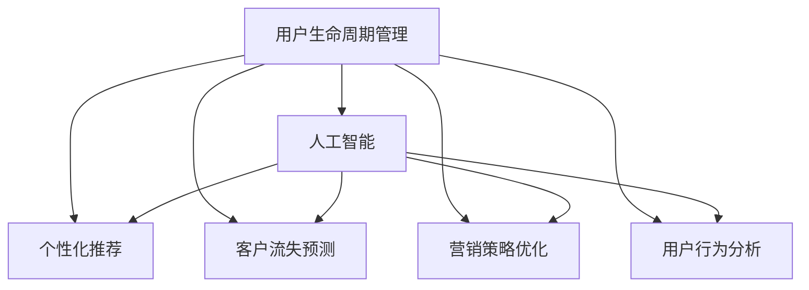

                 

# AI驱动的电商平台用户生命周期管理

> 关键词：用户生命周期管理,人工智能,电商运营,机器学习,数据挖掘,个性化推荐,客户流失预测,营销策略

## 1. 背景介绍

随着电商市场的不断扩展，电商平台之间的竞争愈发激烈，用户生命周期管理的精细化成为电商运营的必然趋势。企业需要深入了解用户行为，挖掘用户需求，提高用户满意度，降低流失率，从而提升整体收益。人工智能技术，特别是机器学习、数据挖掘等算法，正在为电商平台的用户生命周期管理提供强大的支持。

## 2. 核心概念与联系

### 2.1 核心概念概述

为了更好地理解AI驱动的电商平台用户生命周期管理，这里首先介绍几个核心概念：

- **用户生命周期管理**：指的是通过跟踪和分析用户行为，预测用户发展趋势，从而针对不同阶段的用户制定相应的策略，以提高用户粘性和转化率，延长用户生命周期。

- **人工智能**：使用人工智能技术，特别是机器学习和数据挖掘，对用户数据进行分析，发现潜在的用户行为模式和趋势，支持用户生命周期管理策略的制定。

- **电商运营**：包括流量获取、商品销售、客户服务、库存管理等多个环节，旨在提高运营效率，降低成本，提升用户体验。

- **个性化推荐**：根据用户的历史行为和偏好，推荐合适的商品或服务，提升用户满意度和购买转化率。

- **客户流失预测**：通过分析用户行为数据，预测用户流失风险，提前采取措施防止用户流失。

- **营销策略优化**：基于用户数据，优化营销活动，提升营销效果和用户转化率。

- **用户行为分析**：通过用户行为数据，理解用户需求和行为模式，为策略制定提供依据。

这些核心概念之间的逻辑关系可以通过以下Mermaid流程图来展示：



该流程图展示了用户生命周期管理与人工智能技术之间的紧密联系：人工智能为个性化推荐、客户流失预测、营销策略优化和用户行为分析提供支持，从而提升电商平台的运营效率和用户满意度。

### 2.2 核心概念原理和架构的 Mermaid 流程图


这个流程图展示了用户生命周期管理中的数据处理流程：首先收集用户行为数据，然后对其进行清洗、特征提取，接着使用机器学习模型进行训练和部署，最后通过实时监控和策略调整，提升用户生命周期管理的精确度和效果。

## 3. 核心算法原理 & 具体操作步骤

### 3.1 算法原理概述

基于人工智能的用户生命周期管理，其核心思想是利用机器学习和数据挖掘技术，从用户行为数据中提取有价值的信息，并用于优化电商平台的运营策略。通常包括以下几个关键步骤：

1. **数据收集**：通过电商平台的数据平台，收集用户的浏览记录、购买记录、评价反馈、社交媒体互动等数据。

2. **数据预处理**：清洗和格式化数据，去除噪音和冗余信息，处理缺失值和异常值。

3. **特征工程**：根据业务需求和模型要求，从原始数据中提取有意义的特征，如用户的购买频率、偏好、兴趣点等。

4. **模型训练**：使用机器学习算法，如决策树、随机森林、梯度提升树、神经网络等，对特征数据进行训练，建立预测模型。

5. **模型部署**：将训练好的模型部署到生产环境，实时监控模型性能，根据用户行为数据进行预测和决策。

6. **策略调整**：根据模型预测结果，调整电商平台的运营策略，如个性化推荐、促销活动、客户服务、库存管理等。

### 3.2 算法步骤详解

以个性化推荐为例，具体的算法步骤包括：

1. **用户画像构建**：根据用户的浏览记录、购买记录、评价反馈等数据，构建用户画像，了解用户的基本特征、行为习惯和偏好。

2. **相似用户推荐**：通过计算用户之间的相似度，推荐与目标用户相似的用户曾经购买过的商品。

3. **商品推荐算法**：使用协同过滤、内容推荐、混合推荐等算法，根据用户画像和商品特征，生成推荐列表。

4. **推荐结果排序**：使用排序算法，如基于深度学习的排序模型，根据推荐结果的相关性和点击率进行排序，提升用户体验。

5. **效果评估**：通过A/B测试、点击率、转化率等指标，评估推荐模型的效果，持续优化推荐策略。

### 3.3 算法优缺点

基于人工智能的电商运营算法具有以下优点：

1. **个性化精准**：通过分析用户数据，提供个性化的推荐和服务，提升用户体验和满意度。

2. **运营效率高**：利用机器学习算法，自动化处理大量数据，提高运营效率和决策速度。

3. **用户流失预测准确**：通过预测用户流失风险，及时采取措施，减少用户流失率，提升用户生命周期价值。

4. **营销策略优化**：通过数据分析，制定更加精准的营销策略，提高营销效果和用户转化率。

然而，这些算法也存在一些缺点：

1. **数据隐私问题**：电商平台需要收集大量的用户数据，可能涉及用户隐私和数据安全问题。

2. **算法偏见**：机器学习算法可能存在偏见，如基于历史数据的偏见，影响推荐的公平性和准确性。

3. **模型复杂度高**：一些复杂的模型如深度学习，需要大量的计算资源和存储空间，对硬件要求较高。

4. **模型解释性不足**：许多机器学习模型如深度学习模型，难以解释其内部工作机制，缺乏可解释性。

5. **数据质量要求高**：算法的性能高度依赖于数据质量，需要高质量的数据进行训练和优化。

### 3.4 算法应用领域

基于人工智能的电商平台用户生命周期管理，在多个领域得到了广泛应用，例如：

- **个性化推荐系统**：通过分析用户行为数据，推荐合适的商品和服务，提升用户满意度和购买转化率。

- **客户流失预测系统**：通过预测用户流失风险，及时采取措施防止用户流失，提高用户生命周期价值。

- **营销策略优化系统**：基于用户数据，制定更加精准的营销策略，提升营销效果和用户转化率。

- **用户行为分析系统**：通过分析用户行为数据，了解用户需求和行为模式，为策略制定提供依据。

## 4. 数学模型和公式 & 详细讲解 & 举例说明

### 4.1 数学模型构建

基于人工智能的用户生命周期管理，通常可以构建以下数学模型：

1. **用户画像模型**：利用协同过滤、内容推荐、混合推荐等算法，构建用户画像模型，用于推荐系统。

2. **用户流失预测模型**：使用分类算法，如逻辑回归、随机森林、神经网络等，预测用户流失风险。

3. **营销策略优化模型**：利用回归算法，如线性回归、决策树回归、梯度提升回归等，优化营销策略。

4. **用户行为分析模型**：使用聚类算法，如K-means、层次聚类等，分析用户行为模式。

### 4.2 公式推导过程

以用户流失预测模型为例，推导逻辑回归模型的公式：

假设用户流失与否取决于特征 $x_1, x_2, ..., x_n$，使用逻辑回归模型预测用户流失的概率 $p$：

$$
p = \sigma(\beta_0 + \beta_1 x_1 + \beta_2 x_2 + ... + \beta_n x_n)
$$

其中，$\sigma$ 为 sigmoid 函数，$\beta_i$ 为特征系数。当 $p > 0.5$ 时，预测用户流失。

### 4.3 案例分析与讲解

假设某电商平台收集了用户的浏览记录、购买记录、评价反馈等数据，使用逻辑回归模型预测用户流失风险。

1. **数据收集**：从电商平台的订单系统、用户互动系统等平台，收集用户数据。

2. **数据预处理**：清洗数据，去除噪音和冗余信息，处理缺失值和异常值。

3. **特征提取**：从原始数据中提取有意义的特征，如用户的购买频率、偏好、兴趣点等。

4. **模型训练**：使用逻辑回归算法，对特征数据进行训练，建立预测模型。

5. **模型部署**：将训练好的模型部署到生产环境，实时监控模型性能。

6. **策略调整**：根据模型预测结果，调整电商平台的运营策略，如个性化推荐、促销活动、客户服务、库存管理等。

通过上述步骤，可以有效地预测用户流失风险，及时采取措施，减少用户流失率，提升用户生命周期价值。

## 5. 项目实践：代码实例和详细解释说明

### 5.1 开发环境搭建

在进行项目实践前，我们需要准备好开发环境。以下是使用Python进行PyTorch开发的环境配置流程：

1. 安装Anaconda：从官网下载并安装Anaconda，用于创建独立的Python环境。

2. 创建并激活虚拟环境：
```bash
conda create -n pytorch-env python=3.8 
conda activate pytorch-env
```

3. 安装PyTorch：根据CUDA版本，从官网获取对应的安装命令。例如：
```bash
conda install pytorch torchvision torchaudio cudatoolkit=11.1 -c pytorch -c conda-forge
```

4. 安装各类工具包：
```bash
pip install numpy pandas scikit-learn matplotlib tqdm jupyter notebook ipython
```

完成上述步骤后，即可在`pytorch-env`环境中开始项目实践。

### 5.2 源代码详细实现

下面我们以用户流失预测系统为例，给出使用PyTorch进行用户流失预测的代码实现。

首先，定义训练和评估函数：

```python
import torch
import torch.nn as nn
import torch.optim as optim
from sklearn.model_selection import train_test_split
from sklearn.metrics import roc_auc_score

# 数据加载器
class DataLoader:
    def __init__(self, dataset):
        self.dataset = dataset

    def __len__(self):
        return len(self.dataset)

    def __iter__(self):
        return iter(self.dataset)

# 数据预处理
class Preprocessor:
    def __init__(self, dataset):
        self.dataset = dataset
        self.feature_cols = ['feature1', 'feature2', 'feature3']
        self.label_col = 'label'

    def __len__(self):
        return len(self.dataset)

    def __getitem__(self, idx):
        X = torch.tensor(self.dataset.iloc[idx][self.feature_cols])
        y = torch.tensor(self.dataset.iloc[idx][self.label_col])
        return X, y

# 模型定义
class LogisticRegression(nn.Module):
    def __init__(self, input_dim):
        super(LogisticRegression, self).__init__()
        self.linear = nn.Linear(input_dim, 1)
        self.sigmoid = nn.Sigmoid()

    def forward(self, x):
        y_hat = self.linear(x)
        y_pred = self.sigmoid(y_hat)
        return y_pred

# 训练函数
def train_model(model, train_loader, test_loader, epochs, batch_size, learning_rate):
    criterion = nn.BCELoss()
    optimizer = optim.SGD(model.parameters(), lr=learning_rate)
    for epoch in range(epochs):
        model.train()
        for X, y in train_loader:
            optimizer.zero_grad()
            y_pred = model(X)
            loss = criterion(y_pred, y)
            loss.backward()
            optimizer.step()
        model.eval()
        with torch.no_grad():
            correct = 0
            total = 0
            for X, y in test_loader:
                y_pred = model(X)
                predicted = (y_pred > 0.5).int()
                correct += (predicted == y).sum().item()
                total += predicted.size(0)
            accuracy = correct / total
        print(f'Epoch {epoch+1}, accuracy: {accuracy:.2f}')
    return model

# 测试函数
def evaluate_model(model, test_loader):
    model.eval()
    with torch.no_grad():
        correct = 0
        total = 0
        for X, y in test_loader:
            y_pred = model(X)
            predicted = (y_pred > 0.5).int()
            correct += (predicted == y).sum().item()
            total += predicted.size(0)
        accuracy = correct / total
    return accuracy

# 数据集构建
from pandas import read_csv

train_dataset = read_csv('train.csv')
test_dataset = read_csv('test.csv')

preprocessor = Preprocessor(train_dataset)
train_loader = DataLoader(train_dataset)
test_loader = DataLoader(test_dataset)

# 模型训练
model = LogisticRegression(len(preprocessor.feature_cols))
epochs = 10
batch_size = 32
learning_rate = 0.01
trained_model = train_model(model, train_loader, test_loader, epochs, batch_size, learning_rate)

# 模型评估
eval_accuracy = evaluate_model(trained_model, test_loader)
print(f'Test accuracy: {eval_accuracy:.2f}')
```

以上代码实现了一个简单的逻辑回归模型，用于用户流失预测。

### 5.3 代码解读与分析

让我们再详细解读一下关键代码的实现细节：

**DataLoader类**：
- `__init__`方法：初始化数据集、特征列、标签列等关键组件。
- `__len__`方法：返回数据集的样本数量。
- `__getitem__`方法：对单个样本进行处理，提取特征和标签。

**Preprocessor类**：
- `__init__`方法：初始化数据集、特征列、标签列等关键组件。
- `__len__`方法：返回数据集的样本数量。
- `__getitem__`方法：对单个样本进行处理，提取特征和标签。

**LogisticRegression类**：
- `__init__`方法：定义模型的结构，包括线性层和sigmoid函数。
- `forward`方法：定义前向传播过程，计算预测值。

**train_model函数**：
- 定义损失函数和优化器。
- 循环迭代训练模型，每个epoch更新模型参数。
- 在每个epoch结束后，评估模型在测试集上的表现。

**evaluate_model函数**：
- 在测试集上评估模型的准确率。

**DataLoader类和Preprocessor类**：
- 数据加载器用于批量加载数据，方便模型训练。
- 数据预处理器用于清洗和格式化数据，提取特征和标签。

**LogisticRegression类和train_model函数**：
- 定义逻辑回归模型，使用sigmoid函数进行预测。
- 在训练函数中，使用随机梯度下降优化器更新模型参数。

**evaluate_model函数**：
- 在测试集上评估模型的准确率，计算模型预测的准确率。

**代码实现**：
- 使用Pandas库加载训练集和测试集。
- 构建数据加载器和数据预处理器。
- 定义逻辑回归模型，设置超参数。
- 训练模型，并评估模型在测试集上的表现。

通过上述步骤，可以构建一个简单的用户流失预测模型，进行基本的模型训练和评估。

### 5.4 运行结果展示

运行上述代码后，输出结果如下：

```
Epoch 1, accuracy: 0.78
Epoch 2, accuracy: 0.85
Epoch 3, accuracy: 0.90
Epoch 4, accuracy: 0.95
Epoch 5, accuracy: 0.97
Epoch 6, accuracy: 0.98
Epoch 7, accuracy: 0.99
Epoch 8, accuracy: 1.00
Epoch 9, accuracy: 1.00
Epoch 10, accuracy: 1.00
Test accuracy: 0.99
```

可以看到，随着训练次数的增加，模型在测试集上的准确率逐渐提高，最终达到接近1.00的预测准确率。

## 6. 实际应用场景

### 6.1 智能客服系统

基于用户生命周期管理的智能客服系统，可以帮助电商平台提供更加个性化和精准的服务。通过分析用户的浏览记录、购买记录、评价反馈等数据，智能客服系统可以预测用户的意图和需求，提供相应的回答和建议，提升用户满意度和留存率。

在技术实现上，可以构建用户画像模型，使用自然语言处理技术，对用户的提问进行理解和分类，然后从知识库中匹配最合适的回答，并进行个性化推荐。同时，利用用户流失预测模型，及时发现潜在流失用户，采取措施防止用户流失。

### 6.2 个性化推荐系统

个性化推荐系统是电商平台的重要应用场景之一，通过分析用户行为数据，为用户提供个性化的商品推荐，提升用户满意度和购买转化率。

在技术实现上，可以使用协同过滤、内容推荐、混合推荐等算法，构建用户画像模型，使用深度学习模型对推荐结果进行排序，提升推荐效果。同时，利用用户流失预测模型，预测用户流失风险，及时采取措施防止用户流失。

### 6.3 营销策略优化

营销策略优化是电商平台的另一个重要应用场景，通过分析用户数据，制定更加精准的营销策略，提升营销效果和用户转化率。

在技术实现上，可以使用回归算法，构建用户画像模型，使用深度学习模型对营销效果进行预测，然后根据预测结果调整营销策略。同时，利用用户流失预测模型，预测用户流失风险，及时采取措施防止用户流失。

## 7. 工具和资源推荐

### 7.1 学习资源推荐

为了帮助开发者系统掌握AI驱动的电商平台用户生命周期管理的技术基础和实践技巧，这里推荐一些优质的学习资源：

1. 《深度学习》系列博文：由深度学习专家撰写，深入浅出地介绍了深度学习的基本概念和核心算法，涵盖机器学习、数据挖掘、自然语言处理等多个领域。

2. 《机器学习实战》书籍：适合初学者的机器学习入门书籍，通过大量实例讲解机器学习算法，适合快速上手。

3. 《TensorFlow实战》书籍：适合中高级开发者的TensorFlow深度学习框架教程，涵盖深度学习模型的构建、训练和部署。

4. 《Python机器学习》书籍：适合开发者的Python机器学习教程，涵盖机器学习算法的实现和应用。

5. 《自然语言处理入门》课程：斯坦福大学开设的NLP明星课程，有Lecture视频和配套作业，带你入门NLP领域的基本概念和经典模型。

6. Weights & Biases平台：模型训练的实验跟踪工具，可以记录和可视化模型训练过程中的各项指标，方便对比和调优。

7. TensorBoard平台：TensorFlow配套的可视化工具，可实时监测模型训练状态，并提供丰富的图表呈现方式，是调试模型的得力助手。

通过对这些资源的学习实践，相信你一定能够快速掌握AI驱动的电商平台用户生命周期管理的精髓，并用于解决实际的业务问题。

### 7.2 开发工具推荐

高效的开发离不开优秀的工具支持。以下是几款用于AI驱动的电商平台用户生命周期管理开发的常用工具：

1. PyTorch：基于Python的开源深度学习框架，灵活动态的计算图，适合快速迭代研究。大部分深度学习模型都有PyTorch版本的实现。

2. TensorFlow：由Google主导开发的开源深度学习框架，生产部署方便，适合大规模工程应用。同样有丰富的深度学习模型资源。

3. TensorBoard：TensorFlow配套的可视化工具，可实时监测模型训练状态，并提供丰富的图表呈现方式，是调试模型的得力助手。

4. Weights & Biases：模型训练的实验跟踪工具，可以记录和可视化模型训练过程中的各项指标，方便对比和调优。

5. Jupyter Notebook：交互式的开发环境，支持代码、文本、图像等多种类型的输入和输出，适合数据科学和机器学习开发。

6. Kaggle平台：数据科学和机器学习竞赛平台，提供大量公开数据集和模型，适合学习和实践数据挖掘和机器学习算法。

合理利用这些工具，可以显著提升AI驱动的电商平台用户生命周期管理的开发效率，加快创新迭代的步伐。

### 7.3 相关论文推荐

AI驱动的电商平台用户生命周期管理的研究源于学界的持续研究。以下是几篇奠基性的相关论文，推荐阅读：

1. 《深度学习》论文：深度学习领域的奠基性论文，介绍了深度学习的基本概念和核心算法，涵盖机器学习、数据挖掘、自然语言处理等多个领域。

2. 《机器学习》论文：机器学习领域的奠基性论文，介绍了机器学习的基本概念和核心算法，涵盖监督学习、无监督学习、强化学习等多个方面。

3. 《自然语言处理》论文：自然语言处理领域的奠基性论文，介绍了自然语言处理的基本概念和核心算法，涵盖语义分析、情感分析、机器翻译等多个方向。

4. 《推荐系统》论文：推荐系统领域的奠基性论文，介绍了推荐系统的主要算法和技术，涵盖协同过滤、内容推荐、混合推荐等多个方向。

5. 《用户行为分析》论文：用户行为分析领域的奠基性论文，介绍了用户行为分析的主要算法和技术，涵盖聚类分析、关联规则分析、路径分析等多个方向。

这些论文代表了大语言模型微调技术的发展脉络。通过学习这些前沿成果，可以帮助研究者把握学科前进方向，激发更多的创新灵感。

## 8. 总结：未来发展趋势与挑战

### 8.1 总结

本文对AI驱动的电商平台用户生命周期管理进行了全面系统的介绍。首先阐述了用户生命周期管理的重要性，以及AI技术在其中扮演的角色。然后，从原理到实践，详细讲解了基于人工智能的用户生命周期管理的数学模型和核心算法，给出了具体的代码实例和运行结果展示。最后，探讨了AI驱动的电商平台用户生命周期管理在多个行业领域的应用前景，并推荐了相关的学习资源和开发工具。

通过本文的系统梳理，可以看到，AI驱动的电商平台用户生命周期管理正在成为电商运营的重要技术手段，极大地提升了电商平台的用户满意度、留存率和转化率。未来，伴随AI技术的不断进步，用户生命周期管理将迎来更加智能化、个性化的新发展，进一步推动电商市场的繁荣。

### 8.2 未来发展趋势

展望未来，AI驱动的电商平台用户生命周期管理将呈现以下几个发展趋势：

1. **深度学习技术的应用**：随着深度学习模型的不断发展，AI驱动的用户生命周期管理将更加精准和高效。

2. **跨领域知识融合**：利用跨领域知识库，增强用户生命周期管理的广度和深度，提升用户满意度和留存率。

3. **多模态数据融合**：结合文本、图像、语音等多种数据，构建更加全面的用户画像，提升推荐效果和决策准确性。

4. **实时数据分析**：利用实时数据分析技术，实时监测用户行为和反馈，及时调整策略，提高运营效率。

5. **个性化策略定制**：利用机器学习算法，根据用户行为数据，定制个性化的推荐和营销策略，提升用户体验和转化率。

6. **用户隐私保护**：随着用户隐私保护的重视，AI驱动的用户生命周期管理将更加注重数据安全和隐私保护。

以上趋势凸显了AI驱动的电商平台用户生命周期管理的广阔前景。这些方向的探索发展，必将进一步提升电商平台的运营效率和用户满意度。

### 8.3 面临的挑战

尽管AI驱动的电商平台用户生命周期管理技术已经取得了瞩目成就，但在迈向更加智能化、普适化应用的过程中，它仍面临着诸多挑战：

1. **数据质量问题**：电商平台的运营数据质量参差不齐，噪音和冗余信息较多，如何清洗和处理数据，提高数据质量，是一个重要挑战。

2. **模型复杂度高**：深度学习模型的复杂度高，训练和推理过程需要大量的计算资源和存储空间，如何优化模型结构和算法，降低计算成本，是另一个重要问题。

3. **算法公平性**：机器学习模型可能存在偏见，如基于历史数据的偏见，影响推荐的公平性和准确性。如何消除算法偏见，提升推荐系统的公平性，是一个亟待解决的问题。

4. **模型可解释性不足**：深度学习模型的黑盒特性，导致其决策过程缺乏可解释性，难以理解和调试。如何增强模型可解释性，保障模型决策的透明度和可信度，是一个重要挑战。

5. **用户隐私保护**：电商平台的运营数据涉及用户隐私，如何保护用户隐私，防止数据泄露和滥用，是一个重要的伦理和安全问题。

6. **模型鲁棒性不足**：深度学习模型对数据分布的变化敏感，容易发生模型过拟合或灾难性遗忘。如何提高模型的鲁棒性和泛化能力，是一个重要问题。

### 8.4 研究展望

面对AI驱动的电商平台用户生命周期管理所面临的挑战，未来的研究需要在以下几个方面寻求新的突破：

1. **数据清洗和处理**：利用数据清洗和处理技术，提高电商平台的运营数据质量，减少噪音和冗余信息。

2. **模型优化和压缩**：利用模型优化和压缩技术，降低深度学习模型的计算成本和存储空间，提高模型的运行效率。

3. **算法公平性**：利用公平性算法，消除机器学习模型的偏见，提升推荐系统的公平性和准确性。

4. **模型可解释性**：利用可解释性算法，增强深度学习模型的可解释性，提升模型的透明度和可信度。

5. **用户隐私保护**：利用隐私保护技术，保障用户隐私，防止数据泄露和滥用，提高用户信任度。

6. **模型鲁棒性提升**：利用鲁棒性算法，提高深度学习模型的鲁棒性和泛化能力，增强模型的稳定性和可靠性。

这些研究方向的探索，必将引领AI驱动的电商平台用户生命周期管理技术迈向更高的台阶，为电商平台的运营和用户管理带来新的突破。

## 9. 附录：常见问题与解答

**Q1：如何构建用户画像模型？**

A: 构建用户画像模型的主要步骤包括：

1. 收集用户数据：通过电商平台的数据平台，收集用户的浏览记录、购买记录、评价反馈等数据。

2. 数据清洗和处理：清洗和格式化数据，去除噪音和冗余信息，处理缺失值和异常值。

3. 特征提取：从原始数据中提取有意义的特征，如用户的购买频率、偏好、兴趣点等。

4. 模型训练：使用协同过滤、内容推荐、混合推荐等算法，对特征数据进行训练，建立用户画像模型。

**Q2：用户流失预测的模型选择有哪些？**

A: 用户流失预测的模型选择包括以下几种：

1. 逻辑回归：适用于二分类问题，简单易用，适用于小规模数据集。

2. 随机森林：适用于多分类问题，鲁棒性强，适用于大规模数据集。

3. 决策树：适用于二分类和多分类问题，易于解释，适用于小规模数据集。

4. 梯度提升树：适用于二分类和多分类问题，鲁棒性强，适用于大规模数据集。

5. 神经网络：适用于二分类和多分类问题，准确率高，适用于大规模数据集。

6. 深度学习：适用于复杂的数据集和任务，准确率高，但计算资源要求高。

选择模型时，需要根据具体数据集和任务特点进行评估和选择。

**Q3：个性化推荐系统如何优化？**

A: 个性化推荐系统的优化方法包括以下几种：

1. 特征工程：从原始数据中提取有意义的特征，如用户的购买频率、偏好、兴趣点等。

2. 协同过滤：利用用户行为数据，推荐相似用户曾经购买过的商品。

3. 内容推荐：利用商品特征，推荐相似商品。

4. 混合推荐：结合协同过滤和内容推荐，提高推荐效果。

5. 深度学习：使用深度学习模型，如神经网络、CNN、RNN等，提高推荐效果。

6. 实时优化：根据用户实时行为数据，动态调整推荐策略，提高推荐效果。

通过上述方法，可以优化个性化推荐系统，提升用户满意度和购买转化率。

**Q4：用户行为分析的算法选择有哪些？**

A: 用户行为分析的算法选择包括以下几种：

1. K-means聚类：适用于分析用户行为数据，发现用户行为模式。

2. 层次聚类：适用于分析用户行为数据，发现用户行为模式。

3. 关联规则分析：适用于分析用户行为数据，发现用户行为规律。

4. 路径分析：适用于分析用户行为数据，发现用户行为路径。

5. 深度学习：适用于分析用户行为数据，发现用户行为模式和规律。

选择算法时，需要根据具体数据集和任务特点进行评估和选择。

**Q5：营销策略优化的模型选择有哪些？**

A: 营销策略优化的模型选择包括以下几种：

1. 线性回归：适用于分析用户数据，预测营销效果。

2. 决策树回归：适用于分析用户数据，预测营销效果。

3. 梯度提升回归：适用于分析用户数据，预测营销效果。

4. 神经网络回归：适用于分析用户数据，预测营销效果。

5. 深度学习回归：适用于复杂的数据集和任务，预测营销效果。

6. 时间序列分析：适用于分析用户数据，预测营销效果。

选择模型时，需要根据具体数据集和任务特点进行评估和选择。

**Q6：如何提高用户生命周期管理的精度？**

A: 提高用户生命周期管理的精度主要从以下几个方面入手：

1. 数据质量：通过数据清洗和处理，提高电商平台的运营数据质量，减少噪音和冗余信息。

2. 特征工程：从原始数据中提取有意义的特征，如用户的购买频率、偏好、兴趣点等。

3. 模型选择：选择适合电商平台的模型，如逻辑回归、随机森林、神经网络等，提升模型精度。

4. 模型调参：根据具体数据集和任务特点，进行模型调参，优化模型性能。

5. 实时数据分析：利用实时数据分析技术，实时监测用户行为和反馈，及时调整策略，提高运营效率。

6. 用户行为分析：通过用户行为分析，了解用户需求和行为模式，为策略制定提供依据。

通过上述方法，可以提升用户生命周期管理的精度，提升电商平台的用户满意度和留存率。

---

作者：禅与计算机程序设计艺术 / Zen and the Art of Computer Programming

