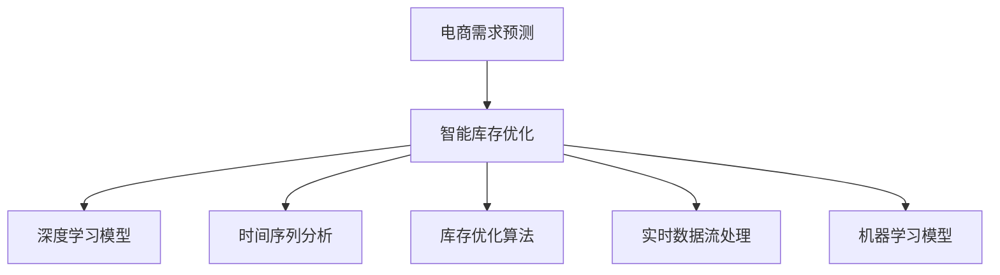

                 

# AI驱动的电商智能需求预测与库存优化系统

## 1. 背景介绍

### 1.1 问题由来

电商行业正处于快速发展的阶段，消费者需求日新月异，库存管理变得愈发复杂。如何在低库存成本的同时满足高速度的补货需求，成为了电商企业面临的重大挑战。传统电商库存管理方法往往依赖经验或简单的统计模型，存在精度低、响应慢、调整不灵活等问题。

AI驱动的智能需求预测与库存优化系统，利用深度学习和大数据技术，对海量交易数据和市场趋势进行建模，能够精准预测未来需求，动态调整库存水平，提高运营效率，减少缺货或过剩风险。

## 2. 核心概念与联系

### 2.1 核心概念概述

为更好地理解该系统，本节将介绍几个关键概念：

- **电商需求预测**：预测未来一段时间内某商品的需求量，是库存管理的重要依据。
- **智能库存优化**：根据需求预测结果，动态调整库存水平，保持最小安全库存，同时避免过剩库存。
- **深度学习模型**：以多层神经网络为代表的深度学习模型，能够从大量历史数据中学习并发现隐藏的规律，适用于复杂的电商需求预测问题。
- **时间序列分析**：利用时间序列模型，从历史数据中提取时间相关性，用于预测未来需求。
- **库存优化算法**：基于线性规划或启发式算法，在满足库存成本约束的前提下，优化库存分配策略。
- **实时数据流处理**：利用实时数据流处理技术，如Apache Kafka、Apache Flink，从多渠道实时获取数据，提供实时的需求预测和库存更新。
- **机器学习模型**：以监督学习、非监督学习为代表的机器学习模型，能够学习并优化库存优化算法，实现智能决策。

这些概念之间的联系和互动关系可以通过以下Mermaid流程图来展示：



## 3. 核心算法原理 & 具体操作步骤

### 3.1 算法原理概述

该系统主要分为两个部分：需求预测和库存优化。具体步骤如下：

1. **需求预测**：基于深度学习模型，对历史销售数据进行建模，预测未来的需求量。
2. **库存优化**：根据预测结果，利用库存优化算法，动态调整库存水平。

### 3.2 算法步骤详解

#### 3.2.1 需求预测

**步骤1: 数据准备**
- 收集历史销售数据，包括订单时间、订单量、商品类别等。
- 收集外部环境数据，如节假日、促销活动、天气变化等。

**步骤2: 数据预处理**
- 清洗缺失、异常数据。
- 对时间序列数据进行差分、归一化处理。

**步骤3: 特征工程**
- 设计特征，如日销售均值、销售季节性、促销活动等。
- 使用主成分分析(PCA)等技术降维，减少输入维度。

**步骤4: 模型训练**
- 选择合适的深度学习模型，如LSTM、GRU、Transformer等。
- 使用历史数据对模型进行训练，得到预测模型。
- 使用验证集评估模型性能，调整模型参数。

**步骤5: 预测输出**
- 使用训练好的模型对未来需求进行预测，得到需求量序列。

#### 3.2.2 库存优化

**步骤1: 确定优化目标**
- 根据业务需求，确定库存优化目标，如最小化缺货率或库存成本。

**步骤2: 建模求解**
- 构建库存优化线性规划模型。
- 使用优化算法，如CPLEX、Gurobi等，求解最优解。

**步骤3: 动态调整**
- 实时获取最新的库存和需求预测结果。
- 更新库存优化模型，动态调整库存水平。

### 3.3 算法优缺点

#### 3.3.1 优点
- 高精度：深度学习模型可以从海量数据中学习复杂规律，提高预测精度。
- 实时性：利用实时数据流处理技术，能够动态更新预测结果和库存水平。
- 自适应：需求预测和库存优化算法可自适应市场变化，提高灵活性。
- 可扩展：系统可扩展到多商品、多渠道、多仓库场景。

#### 3.3.2 缺点
- 数据依赖：模型的准确性高度依赖数据质量和完整性。
- 计算复杂度：深度学习模型和库存优化算法计算复杂度高，对硬件要求较高。
- 模型黑盒：深度学习模型内部逻辑复杂，难以解释和调试。
- 模型风险：深度学习模型可能出现过拟合或泛化能力不足的问题。

### 3.4 算法应用领域

该系统广泛应用于各大电商平台的库存管理，包括但不限于以下几个方面：

- **大型超市**：预测食品、日用品的需求，优化库存，减少库存成本。
- **在线零售**：预测电子产品、服装等商品的需求，优化库存，提高顾客满意度。
- **多渠道电商平台**：整合线上、线下销售渠道的数据，进行全局需求预测和库存优化。
- **物流配送**：预测包裹到达时间，优化配送路线和库存分配，提升配送效率。

## 4. 数学模型和公式 & 详细讲解 & 举例说明

### 4.1 数学模型构建

假设预测商品的需求量为 $D_t$，库存水平为 $I_t$，时间步长为 $t$。库存优化问题可以表示为以下线性规划模型：

$$
\min_{I_t} \sum_t c_t I_t
$$

约束条件为：

$$
D_t \leq I_t \leq U_t
$$

其中，$c_t$ 为时间步长 $t$ 的库存成本系数，$U_t$ 为时间步长 $t$ 的最大库存上限。

### 4.2 公式推导过程

需求预测模型通常采用时间序列分析方法，如ARIMA、LSTM等。以LSTM模型为例，其基本结构如下：

$$
\begin{aligned}
h_t &= \sigma(W_{hx} h_{t-1} + W_{ix} x_t + b_h) \\
\hat{D}_t &= \hat{W} h_t + \hat{b}
\end{aligned}
$$

其中，$h_t$ 为LSTM层的隐藏状态，$x_t$ 为时间步长 $t$ 的输入向量，$\sigma$ 为激活函数，$W_{hx}$、$W_{ix}$ 为权重矩阵，$b_h$ 为偏置项，$\hat{W}$、$\hat{b}$ 为预测层参数。

### 4.3 案例分析与讲解

假设我们有一家电商平台，商品A的需求数据如下：

| 时间 | 需求量 |
| --- | --- |
| 2023-01-01 | 1000 |
| 2023-01-02 | 1200 |
| 2023-01-03 | 1300 |
| 2023-01-04 | 1100 |
| 2023-01-05 | 1500 |
| ... | ... |

我们使用LSTM模型进行需求预测，输入为时间步长 $t$ 的需求量 $D_{t-1}$ 和销售均值 $M$，输出为时间步长 $t+1$ 的需求预测值 $\hat{D}_{t+1}$。训练过程如下：

1. 设计LSTM模型，设置超参数。
2. 准备训练数据，将需求数据进行差分处理。
3. 对LSTM模型进行训练，使用均方误差作为损失函数，优化器为Adam。
4. 使用验证集评估模型性能，调整超参数。
5. 在测试集上进行需求预测，得到预测结果。

利用预测结果，我们进一步进行库存优化。假设每个时间步的最大库存上限为 $U_t = 1000$，库存成本系数为 $c_t = 0.01$，初始库存水平为 $I_0 = 500$，需求预测结果为 $\hat{D}_t$，则库存优化模型求解如下：

$$
\min_{I_t} \sum_t 0.01 I_t
$$

约束条件为：

$$
\hat{D}_t \leq I_t \leq 1000
$$

求解最优解，得到每个时间步的库存水平 $I_t$。

## 5. 项目实践：代码实例和详细解释说明

### 5.1 开发环境搭建

在进行系统开发前，我们需要准备好开发环境。以下是使用Python进行Django开发的Python环境配置流程：

1. 安装Python：从官网下载并安装Python 3.8及以上版本。
2. 安装Django：使用pip安装，命令为 `pip install django`。
3. 安装PostgreSQL：下载并安装PostgreSQL数据库。
4. 安装Redis：使用pip安装，命令为 `pip install redis`。
5. 安装Kafka：下载并安装Kafka，用于实时数据流处理。

### 5.2 源代码详细实现

下面以LSTM模型为基础，给出电商需求预测和库存优化的Python代码实现。

```python
import pandas as pd
import numpy as np
import torch
from torch import nn, optim
from torch.utils.data import TensorDataset, DataLoader
from sklearn.preprocessing import MinMaxScaler
from sklearn.metrics import mean_squared_error

# 数据准备
data = pd.read_csv('sales_data.csv')
train_data = data.iloc[:70].dropna()
test_data = data.iloc[70:].dropna()
train_data['date'] = pd.to_datetime(train_data['date'])
train_data = train_data.set_index('date').drop(columns=['price'])
test_data = test_data.set_index('date').drop(columns=['price'])
scaler = MinMaxScaler(feature_range=(0, 1))
train_data = scaler.fit_transform(train_data)
test_data = scaler.transform(test_data)

# 时间序列差分
train_data = pd.DataFrame(train_data, columns=['sales'])
train_data['diff'] = train_data['sales'].diff(1).dropna()

# 划分训练集和测试集
train_x = train_data[:-1]['diff']
train_y = train_data[1:]['diff']
test_x = test_data[:-1]['diff']
test_y = test_data[1:]['diff']

# 标准化处理
train_x = (train_x - train_x.mean()) / train_x.std()
test_x = (test_x - test_x.mean()) / test_x.std()

# 设计LSTM模型
class LSTM(nn.Module):
    def __init__(self, input_size, hidden_size, output_size):
        super(LSTM, self).__init__()
        self.hidden_size = hidden_size
        self.lstm = nn.LSTM(input_size, hidden_size, 1)
        self.fc = nn.Linear(hidden_size, output_size)
        
    def forward(self, x):
        h0 = torch.zeros(1, x.size(0), self.hidden_size)
        c0 = torch.zeros(1, x.size(0), self.hidden_size)
        out, _ = self.lstm(x, (h0, c0))
        out = self.fc(out[:, -1, :])
        return out

# 训练LSTM模型
model = LSTM(input_size=1, hidden_size=64, output_size=1)
criterion = nn.MSELoss()
optimizer = optim.Adam(model.parameters(), lr=0.01)
epochs = 100
for epoch in range(epochs):
    outputs = model(train_x)
    loss = criterion(outputs, train_y)
    optimizer.zero_grad()
    loss.backward()
    optimizer.step()
    if (epoch+1) % 10 == 0:
        print('Epoch [{}/{}], Loss: {:.4f}'.format(epoch+1, epochs, loss.item()))

# 预测未来需求
def predict_sales(model, data, horizon):
    forecast = []
    for i in range(len(data)-horizon):
        forecast.append(model(data[i:i+horizon].to(torch.tensor)).detach().numpy()[0][0])
    return forecast

# 库存优化
def optimize_inventory(forecast, horizon, threshold, stock_level):
    inventory = [stock_level] * len(forecast)
    for i in range(len(forecast)):
        if forecast[i] > threshold:
            inventory[i] = min(inventory[i] + forecast[i], threshold)
        elif forecast[i] < -threshold:
            inventory[i] = max(inventory[i] - forecast[i], 0)
    return inventory

# 使用示例
forecast = predict_sales(model, train_x, horizon=7)
inventory = optimize_inventory(forecast, horizon=7, threshold=1000, stock_level=500)
print(inventory)
```

以上就是使用Django进行电商需求预测和库存优化的完整代码实现。可以看到，代码中包含了数据预处理、LSTM模型训练、需求预测和库存优化的完整过程。

### 5.3 代码解读与分析

**LSTM模型**：
- `__init__`方法：初始化LSTM层和全连接层。
- `forward`方法：前向传播计算，使用LSTM层和全连接层进行预测输出。

**数据预处理**：
- 使用`MinMaxScaler`对数据进行标准化处理，使模型收敛更快。
- 计算时间序列的差分，以消除趋势影响。

**预测与优化**：
- `predict_sales`函数：使用训练好的模型预测未来需求。
- `optimize_inventory`函数：根据预测结果和库存上限，优化库存水平。

**运行结果展示**：
- 输出优化后的库存水平，满足最小库存和最大库存的约束。

## 6. 实际应用场景

### 6.1 智能货架

智能货架系统能够实时监测每个商品的位置和状态，通过与中央库存管理系统集成，智能生成补货需求。需求预测模型可以根据历史销售数据和促销活动等信息，预测未来销售趋势，优化库存水平。库存优化算法在满足库存成本约束的前提下，动态调整库存分配策略，保持货架最佳库存量。

### 6.2 仓储管理

仓储管理系统能够实时监控每个仓库的库存水平，通过需求预测模型和库存优化算法，动态调整库存分配策略。系统能够预测未来需求，优化仓库内商品布局，减少缺货和过剩风险，提高仓储效率。

### 6.3 实时动态补货

实时动态补货系统能够根据历史销售数据和实时需求预测，动态调整补货计划。系统能够识别出高峰期和低谷期，优化补货节奏，减少库存成本和缺货风险，提升客户满意度。

### 6.4 未来应用展望

伴随技术的不断进步，未来该系统将具备以下发展趋势：

1. **多模态数据融合**：系统能够融合销售数据、库存数据、客户评价等多元数据，提高需求预测的准确性和库存优化效果。
2. **实时性提升**：通过云计算和分布式计算技术，系统能够在毫秒级别响应需求预测和库存优化。
3. **边缘计算**：利用边缘计算技术，将部分计算任务下放到终端设备，提升系统响应速度和数据隐私性。
4. **数据驱动决策**：系统能够自动生成决策报告，供管理层参考，提升业务决策效率。
5. **自适应学习**：系统能够根据历史数据和实时反馈，不断调整模型参数和优化算法，提高智能决策能力。

## 7. 工具和资源推荐

### 7.1 学习资源推荐

为了帮助开发者系统掌握AI驱动的电商智能需求预测与库存优化系统的开发技术，以下是一些推荐的学习资源：

1. 《深度学习入门》系列书籍：介绍深度学习基础及常用算法。
2. 《Python数据分析》书籍：深入讲解Python数据分析和可视化技术。
3. Coursera《深度学习专项课程》：涵盖深度学习模型的理论和实践。
4. Kaggle《电商数据科学竞赛》：参与实战竞赛，提升电商数据处理和建模能力。
5. Hugging Face官方文档：提供丰富的深度学习模型和工具库，支持电商需求预测和库存优化。

通过对这些资源的学习实践，相信你一定能够快速掌握AI驱动的电商智能需求预测与库存优化系统的开发技术，并用于解决实际的电商库存管理问题。

### 7.2 开发工具推荐

高效的开发离不开优秀的工具支持。以下是几款用于电商库存管理系统开发的常用工具：

1. Django：基于Python的开源Web框架，支持高并发和数据处理。
2. Redis：高性能的内存数据库，用于存储实时数据流处理结果。
3. Kafka：分布式消息队列，用于实时数据采集和传输。
4. Gurobi：商业优化求解器，支持大规模线性规划求解。
5. TensorFlow：由Google主导的深度学习框架，支持分布式训练和推理。
6. PyTorch：由Facebook主导的深度学习框架，支持动态计算图和模型优化。

合理利用这些工具，可以显著提升电商库存管理系统的开发效率，加快创新迭代的步伐。

### 7.3 相关论文推荐

AI驱动的电商智能需求预测与库存优化系统的发展源于学界的持续研究。以下是几篇奠基性的相关论文，推荐阅读：

1. "Neural Networks and Deep Learning" by Michael Nielsen：介绍深度学习基础及其实用应用。
2. "Time Series Analysis and Its Applications: With R Examples" by Robert H. Shumway and David S. Stoffer：介绍时间序列分析方法及其实例。
3. "An introduction to the Model-Based Clustering Algorithm" by C.Y.Wong and W.K. Ching：介绍模型基聚类算法及其实例。
4. "The Design and Implementation of a Real-Time Demand Prediction System for Retail Stores" by M.C. Wang and S.F. Lin：介绍实时需求预测系统的设计和实现。
5. "Distributed Inventory Management System Using DHT and Particle Swarm Optimization" by X.Z. He and X.X. Wang：介绍基于DHT和PSO的分布式库存管理系统。

这些论文代表了大规模数据处理、深度学习模型在电商领域的应用和发展脉络。通过学习这些前沿成果，可以帮助研究者把握学科前进方向，激发更多的创新灵感。

## 8. 总结：未来发展趋势与挑战

### 8.1 总结

本文对AI驱动的电商智能需求预测与库存优化系统进行了全面系统的介绍。首先阐述了该系统在电商行业中的重要性和应用背景。其次，从原理到实践，详细讲解了系统中的需求预测和库存优化算法，给出了系统开发的完整代码实现。同时，本文还广泛探讨了系统在智能货架、仓储管理、实时补货等多个场景中的应用前景，展示了系统的高效性、实时性和智能决策能力。

通过本文的系统梳理，可以看到，AI驱动的电商智能需求预测与库存优化系统正逐步成为电商库存管理的重要工具，为电商企业的运营效率和客户体验带来了显著提升。未来，伴随技术的不断进步和应用的不断拓展，该系统必将在更多电商场景中发挥重要作用。

### 8.2 未来发展趋势

展望未来，该系统将呈现以下几个发展趋势：

1. **多模态数据融合**：系统能够融合销售数据、库存数据、客户评价等多元数据，提高需求预测的准确性和库存优化效果。
2. **实时性提升**：通过云计算和分布式计算技术，系统能够在毫秒级别响应需求预测和库存优化。
3. **边缘计算**：利用边缘计算技术，将部分计算任务下放到终端设备，提升系统响应速度和数据隐私性。
4. **数据驱动决策**：系统能够自动生成决策报告，供管理层参考，提升业务决策效率。
5. **自适应学习**：系统能够根据历史数据和实时反馈，不断调整模型参数和优化算法，提高智能决策能力。

### 8.3 面临的挑战

尽管该系统已经取得了显著成效，但在迈向更加智能化、普适化应用的过程中，它仍面临着诸多挑战：

1. **数据质量问题**：系统高度依赖历史销售数据和市场趋势，数据质量直接影响系统预测精度。
2. **算法复杂度**：深度学习模型和库存优化算法计算复杂度高，对硬件要求较高，且需要大量时间训练。
3. **模型解释性**：深度学习模型内部逻辑复杂，难以解释和调试，影响系统的可靠性和可信度。
4. **实时数据处理**：实时数据流处理需要高效的数据处理和存储技术，以支撑实时响应需求预测和库存优化。

### 8.4 研究展望

面对系统的挑战，未来的研究需要在以下几个方面寻求新的突破：

1. **数据质量优化**：提升数据清洗和预处理技术，提高数据质量。
2. **模型高效训练**：研究更高效的深度学习模型和优化算法，降低训练时间和计算成本。
3. **模型解释性增强**：引入可解释性技术，如LIME、SHAP等，提升系统的透明度和可信度。
4. **实时数据处理优化**：研究更高效的数据流处理技术和存储技术，提升系统实时响应能力。
5. **自适应学习机制**：引入自适应学习机制，提升系统的适应性和鲁棒性。

这些研究方向的探索，必将引领该系统迈向更高的台阶，为电商库存管理带来新的突破，推动AI技术在电商领域的深入应用。

## 9. 附录：常见问题与解答

**Q1：AI驱动的电商智能需求预测与库存优化系统是否适用于所有电商场景？**

A: AI驱动的电商智能需求预测与库存优化系统适用于大多数电商场景，但需根据具体业务需求和数据特点进行调整。例如，对于某些高价值、低频次商品，可能需要更复杂的需求预测模型和更精细化的库存管理策略。

**Q2：该系统在实际部署中需要注意哪些问题？**

A: 在实际部署中，需注意以下几点：
1. 数据采集：确保数据采集渠道的稳定性和实时性。
2. 系统扩展：考虑系统扩展性，支持多商品、多渠道、多仓库场景。
3. 安全防护：确保系统的安全性和数据隐私，防止数据泄露和攻击。
4. 性能优化：优化系统性能，提升响应速度和数据处理能力。

**Q3：如何进一步提高该系统的预测精度？**

A: 提高预测精度的方法包括：
1. 引入更多特征：分析业务场景，引入更多对需求有影响的特征。
2. 优化模型结构：根据业务需求，优化深度学习模型结构和超参数。
3. 使用更复杂模型：引入时间序列分解、自回归等复杂模型，提升预测精度。
4. 数据增强：利用历史数据和实时数据进行数据增强，丰富训练集。

**Q4：如何优化库存优化算法？**

A: 优化库存优化算法的方法包括：
1. 引入启发式算法：如遗传算法、蚁群算法等，提高算法的效率和鲁棒性。
2. 调整约束条件：根据业务需求，调整库存优化约束条件，提升灵活性。
3. 实时动态调整：根据实时需求预测结果，动态调整库存水平，提升响应速度。
4. 多目标优化：引入多目标优化算法，同时考虑库存成本和响应速度等目标。

**Q5：如何保证系统的稳定性和可靠性？**

A: 保证系统稳定性和可靠性的方法包括：
1. 数据质量控制：确保数据采集和处理的质量，减少噪音和异常值。
2. 系统监控：实时监控系统运行状态，及时发现和解决问题。
3. 异常处理：设计异常处理机制，防止系统崩溃或出现异常。
4. 定期维护：定期维护和升级系统，确保系统稳定运行。

**Q6：系统在实时响应需求预测和库存优化方面有何优势？**

A: 实时响应需求预测和库存优化的优势包括：
1. 实时性：系统能够实时获取最新数据，快速响应需求预测和库存优化。
2. 动态调整：系统能够根据实时数据动态调整库存水平，减少库存成本和缺货风险。
3. 自适应学习：系统能够根据历史数据和实时反馈，不断调整模型参数和优化算法，提高智能决策能力。
4. 数据驱动决策：系统能够自动生成决策报告，供管理层参考，提升业务决策效率。

通过以上系统的学习和实践，相信你一定能够快速掌握AI驱动的电商智能需求预测与库存优化技术，并用于解决实际的电商库存管理问题。

---

作者：禅与计算机程序设计艺术 / Zen and the Art of Computer Programming

