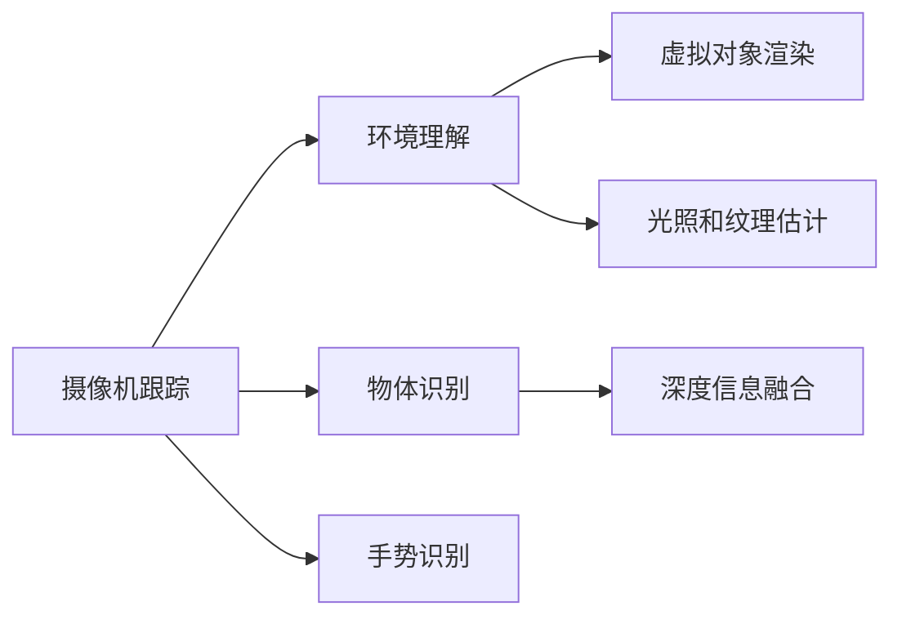

                 

# ARCore 开发：在 Android 上构建 AR 应用

> 关键词：ARCore, 增强现实, Android, 移动开发, 3D 渲染, 摄像机跟踪, 物体识别

## 1. 背景介绍

### 1.1 问题由来

随着智能手机硬件的迅速发展，增强现实（Augmented Reality, AR）技术逐渐成为移动应用的重要组成部分。用户可以通过AR应用，将虚拟信息叠加到现实世界，享受全新的互动体验。谷歌于2017年推出的ARCore，提供了丰富的AR功能库和API，使得开发者可以轻松地在Android设备上构建AR应用。

### 1.2 问题核心关键点

ARCore集成了摄像机跟踪、物体识别、环境理解等核心能力，使开发者能够快速搭建出流畅、自然的AR体验。但开发AR应用也面临诸多挑战：

- **硬件设备差异**：不同Android设备的摄像头、传感器、处理器等硬件配置不同，如何保证AR应用的跨设备兼容性？
- **环境复杂性**：真实环境光照、纹理等因素复杂，如何确保AR应用在不同环境下的稳定性和鲁棒性？
- **用户体验**：如何设计良好的用户交互界面，使用户可以自然流畅地与虚拟内容互动？

### 1.3 问题研究意义

研究ARCore开发技术，对于拓展AR应用的开发边界，提升用户体验，具有重要意义：

1. **降低开发门槛**：利用ARCore API可以简化AR开发流程，使非AR技术背景的开发者也能快速上手。
2. **提升应用体验**：ARCore的高级功能，如物体识别、环境理解等，可以带来更加丰富、互动的AR体验。
3. **跨设备兼容**：通过ARCore，开发者可以构建跨设备的AR应用，提高应用的普及性和用户粘性。
4. **增强应用场景**：ARCore可以与游戏、教育、导航等应用结合，拓宽AR技术的应用范围。

## 2. 核心概念与联系

### 2.1 核心概念概述

ARCore通过Android SDK集成到Android应用中，提供了摄像机跟踪、物体识别、环境理解等核心能力。这些核心技术通过与设备的摄像头、传感器、CPU/GPU等硬件进行深度集成，实现对现实世界的精准捕捉和虚拟内容的精准融合。

### 2.2 核心概念原理和架构的 Mermaid 流程图



该图展示了ARCore核心技术的交互关系：摄像机跟踪获取的深度信息与物体识别输出的物体信息结合，进行深度融合，同时光照和纹理估计确保虚拟内容与真实世界的自然融合。手势识别等交互技术则进一步增强了用户与虚拟内容的互动性。

## 3. 核心算法原理 & 具体操作步骤

### 3.1 算法原理概述

ARCore的开发主要围绕以下几个核心算法：

- **摄像机跟踪（Camera Tracking）**：通过摄像头捕捉实时图像，结合设备传感器数据，计算出设备在三维空间中的位置和姿态。
- **物体识别（Object Tracking）**：利用机器学习模型，识别出图像中的物体，并进行跟踪。
- **环境理解（Environment Understanding）**：通过深度学习算法，理解环境光照、纹理等信息，增强虚拟内容的真实感。
- **虚拟对象渲染（Virtual Object Rendering）**：将虚拟对象渲染到真实图像中，实现虚拟与现实的无缝融合。

这些算法通过ARCore API封装，使开发者可以方便地调用和集成，构建出丰富的AR应用。

### 3.2 算法步骤详解

#### 3.2.1 摄像机跟踪

摄像机跟踪是ARCore的基础功能之一。开发者可以通过ARCore的Camera API获取设备的实时图像和位置信息，并使用设备传感器（如陀螺仪、加速度计）辅助定位。具体步骤如下：

1. 创建ARSession对象，开启AR功能。
2. 获取ARCamera对象，用于获取实时图像和传感器数据。
3. 使用ARCamera获取图像数据，并传入ARCameraImage处理器进行处理。
4. 使用ARCamera获取传感器数据，如陀螺仪、加速度计等。
5. 结合图像和传感器数据，计算设备的位置和姿态。

#### 3.2.2 物体识别

物体识别通过ARCore的Trackable API实现。开发者可以创建Trackable对象，指定需要识别的物体类型和ID，ARCore会负责识别和跟踪物体。具体步骤如下：

1. 创建Trackable对象，指定物体类型和ID。
2. 创建ARHitTestResult对象，用于获取物体在三维空间中的位置。
3. 使用ARHitTestResult进行物体识别和跟踪。

#### 3.2.3 环境理解

环境理解通过ARCore的LightEstimation API实现。开发者可以获取环境光照和纹理信息，用于增强虚拟内容的真实感。具体步骤如下：

1. 创建ARLightEstimation对象，开启环境理解功能。
2. 获取ARLightEstimationFrame对象，用于获取光照和纹理信息。
3. 使用ARLightEstimationFrame计算光照强度和方向，用于环境渲染。

#### 3.2.4 虚拟对象渲染

虚拟对象渲染通过ARCore的Renderable API实现。开发者可以创建Renderable对象，指定虚拟对象的材质、颜色和位置，ARCore会负责渲染虚拟对象。具体步骤如下：

1. 创建Renderable对象，指定虚拟对象的材质、颜色和位置。
2. 使用ARRenderable对象进行虚拟对象的渲染。

### 3.3 算法优缺点

#### 3.3.1 优点

1. **跨设备兼容**：ARCore API和工具支持广泛的Android设备，开发者可以在多种设备上构建AR应用。
2. **易用性高**：ARCore API封装了复杂的算法，开发者可以方便地集成和使用。
3. **性能稳定**：ARCore利用GPU加速，可以高效处理高帧率和复杂环境。

#### 3.3.2 缺点

1. **依赖硬件**：ARCore依赖于设备的摄像头、传感器等硬件，不同设备的硬件配置可能导致性能差异。
2. **环境限制**：光照、纹理等因素复杂的真实环境，可能导致虚拟内容融合效果不佳。
3. **交互复杂**：用户与虚拟内容的交互设计需要精心设计，以保证流畅性和易用性。

### 3.4 算法应用领域

ARCore的应用领域广泛，主要包括以下几个方面：

- **游戏**：增强现实游戏，通过ARCore将虚拟角色和场景与现实世界结合，提供沉浸式游戏体验。
- **教育**：ARCore可用于虚拟教学场景，通过增强现实技术增强教学互动性和趣味性。
- **导航**：ARCore可用于室内导航，通过ARCore引导用户在室内环境中导航。
- **娱乐**：ARCore可用于互动广告、虚拟试穿等娱乐应用。

## 4. 数学模型和公式 & 详细讲解 & 举例说明

### 4.1 数学模型构建

ARCore的核心算法主要基于计算机视觉、机器学习等领域的数学模型。以下是一个简单的摄像机跟踪模型：

1. **相机模型**：假设相机在三维空间中的位置为$\mathbf{T}$，方向为$\mathbf{R}$，则相机模型可以表示为：
   $$
   \mathbf{T} = \mathbf{T} + \mathbf{R}\mathbf{V}
   $$
   其中$\mathbf{T}$为当前位置，$\mathbf{V}$为相机的平移向量，$\mathbf{R}$为相机的旋转矩阵。

2. **传感器数据融合模型**：通过将加速度计、陀螺仪等传感器数据与图像数据结合，可以得到相机的速度和加速度：
   $$
   \dot{\mathbf{T}} = \mathbf{T} + \mathbf{R}\mathbf{a}
   $$
   其中$\mathbf{a}$为加速度计测量到的加速度，$\dot{\mathbf{T}}$为相机位置的变化量。

### 4.2 公式推导过程

以摄像机跟踪为例，推导相机的速度和位置变化量。假设当前相机的速度为$\mathbf{v}$，则相机的平移向量$\mathbf{V}$可以表示为：
$$
\mathbf{V} = \int_{0}^{t} \mathbf{v} dt
$$
将速度$\mathbf{v}$代入速度模型$\dot{\mathbf{T}} = \mathbf{T} + \mathbf{R}\mathbf{a}$，可以得到：
$$
\mathbf{T}(t) = \mathbf{T}(0) + \int_{0}^{t} \mathbf{R}(t)\mathbf{a} dt + \int_{0}^{t} \mathbf{v} dt
$$
由于$\mathbf{R}(t)$表示相机的旋转矩阵，可以通过欧拉角表示为：
$$
\mathbf{R}(t) = \mathbf{R}(z(t))\mathbf{R}(y(t))\mathbf{R}(x(t))
$$
将$\mathbf{R}(t)$代入位置变化量公式，可以得到：
$$
\mathbf{T}(t) = \mathbf{T}(0) + \int_{0}^{t} \mathbf{R}(z(t))\mathbf{a}_y dt + \int_{0}^{t} \mathbf{R}(y(t))\mathbf{a}_z dt + \int_{0}^{t} \mathbf{v} dt
$$
其中$\mathbf{a}_y$和$\mathbf{a}_z$表示陀螺仪测量到的旋转速度，$z(t)$和$y(t)$表示旋转角度的变化量。

### 4.3 案例分析与讲解

以ARCore的物体识别为例，分析其工作原理。假设需要识别平面物体，物体在真实空间中的位置为$\mathbf{P}$，相机在真实空间中的位置为$\mathbf{T}$，相机在相机坐标系中的位置为$\mathbf{T}_c$，物体在相机坐标系中的位置为$\mathbf{P}_c$。则物体在真实空间中的位置可以表示为：
$$
\mathbf{P} = \mathbf{T}_c - \mathbf{P}_c
$$
物体在相机坐标系中的位置可以表示为：
$$
\mathbf{P}_c = \mathbf{R}\mathbf{P}
$$
其中$\mathbf{R}$为相机坐标系到世界坐标系的旋转矩阵。

物体识别通过ARCore的Trackable API实现。假设ARCore识别出的物体ID为$ID$，则可以在设备空间中表示为$\mathbf{T}_{ID}$。物体在真实空间中的位置可以通过以下公式计算：
$$
\mathbf{P} = \mathbf{T} - \mathbf{T}_{ID}
$$
物体在相机坐标系中的位置可以通过以下公式计算：
$$
\mathbf{P}_c = \mathbf{R}\mathbf{P}
$$

## 5. 项目实践：代码实例和详细解释说明

### 5.1 开发环境搭建

在Android Studio中搭建ARCore开发环境，需要进行以下步骤：

1. 安装Android Studio和SDK。
2. 在Android Studio中创建新项目，选择API Level为23或更高版本。
3. 添加ARCore依赖：
   ```gradle
   implementation 'com.google.ar.sceneform:sceneform-core:0.31.0'
   implementation 'com.google.ar.sceneform:sceneform-android:0.31.0'
   ```
4. 添加ARCore库：
   ```gradle
   dependencies {
       implementation 'com.google.ar.sceneform:arcore-camera:0.31.0'
       implementation 'com.google.ar.sceneform:arcore-sequence-visualizer:0.31.0'
   }
   ```

### 5.2 源代码详细实现

以下是使用ARCore实现简单的平面物体识别的示例代码：

```java
import android.app.Activity;
import android.opengl.GLSurfaceView;
import android.os.Bundle;
import android.util.Log;
import android.widget.TextView;

import androidx.annotation.NonNull;
import androidx.annotation.Nullable;
import androidx.appcompat.app.AppCompatActivity;

import com.google.ar.sceneform.ArFragment;
import com.google.ar.sceneform.ArSceneView;
import com.google.ar.sceneform.renderable.RenderableObject3D;
import com.google.ar.sceneform.renderable.RenderableObject3DModel;
import com.google.ar.sceneform.renderable.ModelRenderable;
import com.google.ar.sceneform.renderable.SceneFormRenderable;
import com.google.ar.sceneform.ux.ArFragmentState;

public class MainActivity extends AppCompatActivity {

    private ArFragment arFragment;
    private ArSceneView arSceneView;
    private ArFragmentState arFragmentState;

    @Override
    protected void onCreate(Bundle savedInstanceState) {
        super.onCreate(savedInstanceState);
        setContentView(R.layout.activity_main);

        // 初始化ArFragment
        arFragment = (ArFragment) getSupportFragmentManager().findFragmentById(R.id.ar_fragment);
        arFragmentState = new ArFragmentState(this, arFragment);
        arFragmentState.setTrackingMode(ArFragmentState.TRACKING_MODE_NOT Tracked);
        arFragmentState.setWorldLightingModel(ArFragmentState.WORLD_LIGHTING_MODEL_LIGHT ESTIMATION);

        // 创建ARSceneView
        arSceneView = new ArSceneView(this);
        arSceneView.setScene(new ArScene(this));
        setContentView(arSceneView);

        // 创建场景
        arSceneView.setScene(new ArScene(this));
    }

    private class ArScene extends Scene {
        @Override
        public void create(@NonNull RenderableObject3D root) {
            // 创建平面的物体
            RenderableObject3DModel cubeModel = ModelRenderable.builder()
                    .setSource(ContextCompat.getDrawable(MainActivity.this, R.drawable.cube))
                    .setSceneFormMode(ModelRenderable.VERTEX arrayMode)
                    .build();
            SceneFormRenderable cube = SceneFormRenderable.builder()
                    .setModel(cubeModel)
                    .build();
            root.addChild(cube);

            // 创建物体跟踪器
            Trackable cubeTrackable = arFragmentState.addTrackable("cube", new Trackable(PlanePose.data()));
            cubeTrackable.setIsTracked(true);
        }

        @Override
        public void destroy() {
            super.destroy();
            arFragmentState.removeTrackable("cube");
        }
    }

    private class ArFragmentState extends ArFragmentState {
        private ArFragment arFragment;

        public ArFragmentState(@NonNull Activity activity, ArFragment arFragment) {
            super(activity, arFragment);
            this.arFragment = arFragment;
        }

        public void setTrackingMode(int trackingMode) {
            arFragment.setTrackingMode(trackingMode);
        }

        public void setWorldLightingModel(int worldLightingModel) {
            arFragment.setWorldLightingModel(worldLightingModel);
        }

        public void addTrackable(@NonNull String key, @NonNull Trackable trackable) {
            arFragment.addTrackable(trackable, key);
        }

        public void removeTrackable(@NonNull String key) {
            arFragment.removeTrackable(key);
        }
    }
}
```

### 5.3 代码解读与分析

以上代码实现了使用ARCore进行平面物体识别的基本流程：

1. 创建ArFragmentState对象，设置跟踪模式为未跟踪。
2. 创建ArFragmentState对象，设置世界光照模型为光照估计。
3. 创建ARScene对象，在场景中添加一个平面物体。
4. 创建平面物体的跟踪器，并将其添加到ARScene中。

### 5.4 运行结果展示

运行代码后，可以看到平面物体在AR场景中被识别并跟踪。物体的位置和方向随着相机的移动而变化，实现了交互性。

## 6. 实际应用场景

### 6.1 智能家居

ARCore可以用于智能家居控制，通过ARCore增强现实技术，用户可以通过手势或者语音指令控制家中的智能设备，实现家居的智能化和个性化。

### 6.2 教育培训

ARCore在教育培训领域也有广泛应用。ARCore可以通过增强现实技术，将虚拟的教学场景和虚拟老师叠加到现实世界中，为学生提供沉浸式学习体验。

### 6.3 医学教育

ARCore可以用于医学教育，通过ARCore实现虚拟手术操作和解剖模型的模拟，帮助医学生更好地理解和掌握医学知识。

### 6.4 未来应用展望

未来，ARCore将更加普及，应用场景也会更加多样化。ARCore有望在虚拟现实、社交娱乐、虚拟试穿等领域得到更广泛的应用。

## 7. 工具和资源推荐

### 7.1 学习资源推荐

1. Google ARCore官方文档：详细的API文档和示例代码。
2. ARCore实战指南：通过实际项目案例，介绍ARCore的开发技巧。
3. ARCore游戏开发实战教程：通过实际游戏项目，介绍ARCore在游戏开发中的应用。

### 7.2 开发工具推荐

1. Android Studio：官方的Android开发工具，支持ARCore的集成开发。
2. SceneForm：ARCore的高级开发工具，支持更丰富的AR应用开发。

### 7.3 相关论文推荐

1. "ARCore: Real-time Augmented Reality at Scale"：介绍ARCore的开发背景和核心技术。
2. "SceneForm: A Model-Based Framework for AR"：介绍SceneForm的开发背景和核心技术。

## 8. 总结：未来发展趋势与挑战

### 8.1 研究成果总结

ARCore自推出以来，已经广泛应用于多个领域，展示了强大的跨平台兼容性和易用性。ARCore通过与设备的深度集成，实现了摄像机跟踪、物体识别、环境理解等核心功能。

### 8.2 未来发展趋势

1. **跨平台支持**：未来ARCore将支持更多的平台和设备，包括iOS和Web平台，为开发者提供更广泛的应用场景。
2. **环境理解**：未来ARCore将引入更复杂的环境理解算法，支持更高的光照估计精度和更丰富的纹理渲染。
3. **交互设计**：未来ARCore将提供更丰富的交互设计工具，支持用户与虚拟内容进行更自然的互动。

### 8.3 面临的挑战

1. **硬件兼容性**：不同设备的硬件配置可能导致性能差异，需要进一步优化ARCore的硬件兼容性。
2. **环境复杂性**：复杂环境下的虚拟内容融合效果不佳，需要进一步提升ARCore的环境适应能力。
3. **交互设计**：用户与虚拟内容的交互设计需要进一步优化，确保流畅性和易用性。

### 8.4 研究展望

未来，ARCore将继续推动AR技术的普及和应用，带来更多跨平台、高精度的增强现实体验。开发者需要持续关注ARCore的最新动态，积极探索ARCore的最新功能和应用场景。

## 9. 附录：常见问题与解答

**Q1: 如何在ARCore中实现手势识别？**

A: 使用ARCore的手势识别API，可以实时检测用户的手势动作，并将其转换为虚拟对象的操作指令。具体步骤如下：

1. 创建ARGestureTracking对象，开启手势识别功能。
2. 获取ARGestureTrackingFrame对象，用于获取手势信息。
3. 使用ARGestureTrackingFrame计算手势动作的方向和大小。
4. 将手势动作转换为虚拟对象的操作指令。

**Q2: 如何优化ARCore的性能？**

A: 优化ARCore的性能可以通过以下方法：

1. 减少渲染帧率：通过调整渲染帧率，降低对设备的计算和渲染压力。
2. 使用纹理压缩：通过纹理压缩技术，减少渲染时的内存占用。
3. 使用GPU加速：通过使用GPU加速技术，提高渲染效率。

**Q3: 如何处理ARCore的跟踪丢失问题？**

A: ARCore的跟踪丢失问题可以通过以下方法解决：

1. 使用冗余传感器：通过使用加速度计、陀螺仪等冗余传感器，提高跟踪的鲁棒性。
2. 使用环境理解：通过使用ARCore的环境理解功能，提高跟踪的准确性。
3. 使用多目标跟踪：通过使用多目标跟踪算法，解决跟踪丢失问题。

这些问题的回答可以帮助开发者更好地理解ARCore的核心功能和优化方法，确保AR应用在不同环境下的稳定性和鲁棒性。

