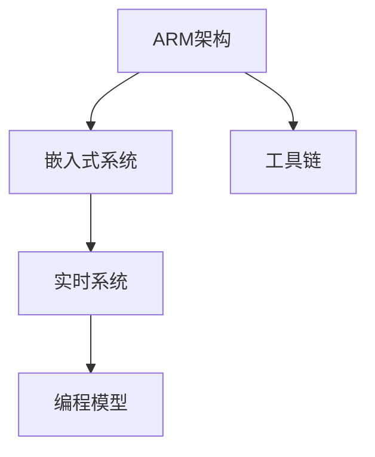

                 

# ARM架构编程：移动和嵌入式系统开发

> 关键词：ARM架构, 嵌入式系统, 移动开发, 嵌入式编程, 系统开发

## 1. 背景介绍

### 1.1 问题由来

随着科技的迅猛发展，移动设备和嵌入式系统已经深入到生活的各个方面，如智能手机、物联网设备、汽车电子等。这些设备对硬件的需求日益增长，而ARM架构以其高效能、低功耗和成本优势，成为了移动和嵌入式系统开发的主流平台。然而，ARM架构与常见的x86架构不同，传统的软件工具和编程技术难以直接应用于ARM设备，这为嵌入式系统开发带来了不少挑战。

### 1.2 问题核心关键点

ARM架构的核心关键点包括：

- ARM指令集：ARM架构使用不同于x86的指令集，其指令集设计更加注重效率和能耗。
- 嵌入式编程：ARM平台上的编程环境与PC不同，需要特定的编译器和开发工具。
- 系统架构：ARM设备硬件架构复杂，如何高效地使用其硬件资源是关键。
- 移动开发：移动平台多样，ARM架构的开发环境需要适配不同平台。
- 实时系统：ARM设备常用于实时系统，如何在编程时考虑实时性需求是难点。

### 1.3 问题研究意义

研究ARM架构编程，对于拓展ARM设备的市场应用，提升移动和嵌入式系统性能，加速技术落地，具有重要意义：

- 降低开发成本。ARM架构具有低成本优势，掌握其编程技术可以大幅降低开发成本。
- 提升系统性能。ARM架构以其高效能著称，优化编程方法可以显著提升系统性能。
- 加速技术创新。ARM架构的编程技术不断演进，研究其编程方法有助于创新应用。
- 推动产业升级。ARM架构的应用广泛，掌握其编程技术可以推动相关产业发展。

## 2. 核心概念与联系

### 2.1 核心概念概述

为更好地理解ARM架构编程，本节将介绍几个密切相关的核心概念：

- ARM架构：ARM处理器采用RISC指令集，具有高性能、低功耗的特点，广泛应用于移动和嵌入式系统。
- 嵌入式系统：以应用为导向，以计算机技术为基础，专为特定需求设计的专用系统。
- 实时系统：要求在特定时间内完成特定任务的计算机系统，如汽车电子、航空航天等。
- 编程模型：嵌入式编程与传统PC编程不同，主要涉及处理器架构、编程语言、调试工具等。
- 工具链：包括编译器、链接器、调试器等，是ARM编程的重要组成部分。

这些核心概念之间的逻辑关系可以通过以下Mermaid流程图来展示：



这个流程图展示了几者之间的逻辑关系：

1. ARM架构为基础，构建嵌入式系统。
2. 嵌入式系统可应用于实时系统，要求高效能和实时性。
3. 实时系统依赖于特定的编程模型，需要考虑性能和资源管理。
4. 工具链支持ARM架构编程，包括编译、链接和调试等。

## 3. 核心算法原理 & 具体操作步骤

### 3.1 算法原理概述

ARM架构编程，主要涉及两个层面：一是底层硬件的编程，二是应用层面的系统开发。底层编程通常需要深入理解ARM处理器架构，包括指令集、寄存器等；应用层面则需要选择合适的编程语言和工具，实现高效的嵌入式系统开发。

ARM架构的底层编程主要涉及以下几个步骤：

1. 理解ARM指令集。ARM指令集与x86有很大差异，需要掌握其基本操作、寄存器和流水线。
2. 学习处理器架构。了解ARM处理器的基本架构、内存管理、中断处理等。
3. 编写汇编代码。使用汇编语言直接操作硬件，进行低层次编程。
4. 编译与调试。将汇编代码编译为可执行文件，使用调试器检测和修正错误。

应用层面的系统开发主要涉及以下几个步骤：

1. 选择编程语言。ARM平台常用C/C++、Rust等编程语言。
2. 了解操作系统。ARM设备常用的操作系统包括Linux、FreeRTOS等。
3. 设计系统架构。考虑系统资源管理、通信协议、任务调度等。
4. 实现系统功能。根据需求实现系统功能，如网络通信、文件系统、图形界面等。

### 3.2 算法步骤详解

#### 3.2.1 底层编程

**Step 1: 理解ARM指令集**

ARM指令集以寄存器为中心，通过指令直接操作寄存器来执行计算。理解ARM指令集，需要掌握基本指令类型、寄存器功能和流水线机制。

**Step 2: 学习处理器架构**

ARM处理器架构包括处理器核心、内存管理单元、中断控制器等。了解这些组件的工作原理和交互方式，是进行底层编程的基础。

**Step 3: 编写汇编代码**

使用ARM汇编语言编写代码，通常需要使用伪指令和汇编指令。例如，使用伪指令定义变量，使用汇编指令进行数据传输和处理。

**Step 4: 编译与调试**

使用ARM编译器将汇编代码编译为可执行文件。编译过程中，需要设置优化级别、调试信息等参数。编译完成后，使用调试器进行调试，检测代码错误。

#### 3.2.2 应用编程

**Step 1: 选择编程语言**

ARM平台常用C/C++、Rust等编程语言。C/C++语言因其高效性和可移植性，广泛应用于ARM编程。Rust则因其内存安全和性能优势，逐渐受到关注。

**Step 2: 了解操作系统**

ARM设备常用的操作系统包括Linux、FreeRTOS等。需要了解操作系统的基本概念、函数调用和资源管理等。

**Step 3: 设计系统架构**

考虑系统资源的有效利用，设计合理的数据结构和任务调度机制。例如，使用消息队列进行任务间通信，使用轮询或中断处理机制进行事件响应。

**Step 4: 实现系统功能**

根据系统需求，实现具体功能模块。例如，实现网络通信模块、文件系统模块、图形界面模块等。

### 3.3 算法优缺点

ARM架构编程的优点：

- 高效能。ARM架构以其高性能著称，优化编程方法可以显著提升系统性能。
- 低功耗。ARM架构设计注重低功耗，适合用于移动设备等资源受限的环境。
- 成本低。ARM架构具有低成本优势，降低了嵌入式系统开发的成本。

ARM架构编程的缺点：

- 编程难度高。ARM架构与x86有很大的不同，学习曲线较陡峭。
- 调试复杂。ARM设备的调试环境较为复杂，需要掌握更多调试技巧。
- 资源限制。ARM设备资源有限，需要精心设计算法和数据结构，避免资源浪费。

### 3.4 算法应用领域

ARM架构编程广泛应用于以下领域：

- 移动设备开发：如智能手机、平板等，ARM架构的高效能和低功耗使其成为主流选择。
- 嵌入式系统开发：如物联网设备、汽车电子等，ARM架构的广泛应用推动了嵌入式系统的发展。
- 实时系统开发：如航空航天、医疗设备等，ARM架构的实时性和可靠性使其成为重要选择。
- 游戏开发：ARM架构的强大计算能力，使其成为高性能游戏开发的首选平台。
- 工业控制：如自动化设备、工业机器人等，ARM架构的稳定性和可靠性使其成为重要选择。

## 4. 数学模型和公式 & 详细讲解 & 举例说明

### 4.1 数学模型构建

在ARM架构编程中，数学模型主要涉及程序性能分析和资源管理。以下以一个简单的嵌入式系统为例，构建其数学模型：

设系统处理单元频率为$f_{CPU}$，时钟周期为$T_{CPU}$，指令集指令条数为$N_{instr}$，每条指令的执行时间为$T_{instr}$。系统时钟频率为$f_{sys}$，时钟周期为$T_{sys}$。

假设系统运行一个简单的循环程序，循环体中执行$N_{loop}$次指令。则系统的理论最大性能$P_{max}$为：

$$ P_{max} = \frac{N_{instr} \times N_{loop}}{T_{sys} \times N_{instr} \times T_{instr}} $$

### 4.2 公式推导过程

上述公式中，$T_{sys} = \frac{1}{f_{sys}}$，$T_{instr} = \frac{1}{f_{CPU}}$。将这些代入公式，得到：

$$ P_{max} = \frac{N_{instr} \times N_{loop}}{T_{sys} \times N_{instr} \times \frac{1}{f_{CPU}}} = \frac{N_{loop}}{T_{sys} \times \frac{1}{f_{CPU}}} $$

即系统性能与循环次数成正比，与时钟周期成反比。

### 4.3 案例分析与讲解

假设系统时钟频率为$f_{sys} = 100MHz$，处理单元频率为$f_{CPU} = 300MHz$，指令集指令条数为$N_{instr} = 100$，每条指令执行时间为$T_{instr} = 0.1us$。循环体中执行$N_{loop} = 1000$次指令。则系统的理论最大性能为：

$$ P_{max} = \frac{1000}{\frac{1}{100MHz} \times \frac{1}{300MHz}} = 1000 \times 100 \times 300 = 300,000,000 $$

即系统每秒可以执行300,000,000次指令。

## 5. 项目实践：代码实例和详细解释说明

### 5.1 开发环境搭建

在ARM架构编程中，开发环境搭建至关重要。以下以基于Linux的ARM开发为例，进行环境配置：

**Step 1: 安装ARM编译器**

从官网下载并安装ARM编译器，如GCC、Keil等。

**Step 2: 配置开发板**

连接开发板到PC，配置其串口和USB接口。

**Step 3: 连接调试器**

连接JTAG调试器，打开调试器软件，如GDB等。

**Step 4: 设置IDE**

安装ARM开发工具，如Eclipse、Visual Studio等，并配置其与编译器和调试器的连接。

### 5.2 源代码详细实现

以下是一个简单的ARM汇编代码示例，实现程序计数器累加功能：

```assembly
.global main
.text
main:
    mov r0, #0
    mov r1, #1000
    mov r2, r0
loop:
    add r0, r2, #1
    bne loop
    bx lr
```

代码解释：

- `mov r0, #0`：将0赋值给寄存器r0。
- `mov r1, #1000`：将1000赋值给寄存器r1。
- `mov r2, r0`：将r0的值赋给r2。
- `loop:`：开始循环。
- `add r0, r2, #1`：将r2的值加1，并赋给r0。
- `bne loop`：如果r0不等于r2，跳转到loop标签。
- `bx lr`：返回主函数。

### 5.3 代码解读与分析

**Step 1: 理解寄存器**

寄存器是ARM处理器中存储数据的单元。常用的寄存器包括通用寄存器、累加寄存器、状态寄存器等。例如，r0、r1、r2等通用寄存器用于存储数据，r15为程序计数器，用于指示程序执行的地址。

**Step 2: 理解指令**

ARM指令集分为单周期指令和多周期指令，每条指令执行时间不同。例如，add指令为单周期指令，bne指令为多周期指令。

**Step 3: 理解循环**

循环是ARM编程中的常见结构，通过反复执行相同代码，实现重复计算和数据处理。循环结构包括do-while、while、for等。

**Step 4: 理解返回指令**

返回指令如bx、ret等，用于从子程序返回主程序。在ARM汇编中，使用bx指令返回主函数。

### 5.4 运行结果展示

运行上述代码，可以得到如下结果：

```
r0 = 1000
```

## 6. 实际应用场景

### 6.1 智能穿戴设备

智能穿戴设备如智能手表、智能眼镜等，广泛应用于健康监测、运动追踪、信息展示等领域。这些设备需要高效能、低功耗的处理器，ARM架构非常适合。

在智能穿戴设备开发中，需要处理大量传感器数据，并进行实时分析。ARM处理器的高性能和低功耗，使其成为智能穿戴设备的首选。

### 6.2 工业控制系统

工业控制系统如自动化设备、机器人等，需要实时响应和高可靠性的处理器。ARM架构以其稳定性和可靠性，在工业控制领域得到了广泛应用。

在工业控制系统开发中，需要处理大量的I/O数据和实时任务。ARM处理器的高实时性和高效能，使其能够高效地处理这些任务。

### 6.3 智能家居系统

智能家居系统如智能门锁、智能插座等，需要高性能、低功耗的处理器，ARM架构非常适合。

在智能家居系统开发中，需要处理各种传感器数据和控制指令。ARM处理器的高性能和低功耗，使其能够高效地处理这些数据。

### 6.4 未来应用展望

未来，ARM架构编程将在更多领域得到应用，为技术创新和产业发展带来新的机遇：

- 物联网设备：随着物联网设备的普及，ARM架构的高性能和低功耗将带来更大的市场需求。
- 人工智能：ARM架构的高效能和低功耗，使其成为人工智能应用的重要平台。
- 智能交通：智能交通系统需要高性能的处理器，ARM架构的高性能和低功耗，使其成为重要选择。
- 航空航天：ARM架构的稳定性和可靠性，使其成为航空航天系统的重要组成部分。
- 移动设备：随着5G和AI技术的发展，ARM架构的性能和功耗优势将更加凸显。

## 7. 工具和资源推荐

### 7.1 学习资源推荐

为了帮助开发者系统掌握ARM架构编程，这里推荐一些优质的学习资源：

1. ARM官方文档：ARM公司提供的官方文档，详细介绍了ARM处理器架构、编程模型、开发工具等。
2. ARM开发者社区：ARM公司维护的开发者社区，提供丰富的开发资源和讨论平台。
3. Embedded.com：嵌入式开发网站，提供丰富的ARM编程资源和技术文章。
4. CSDN嵌入式开发专栏：国内知名的技术社区，提供丰富的ARM编程资源和社区讨论。
5. ARM汇编教程：免费的在线教程，详细介绍了ARM汇编语言和编程技巧。

通过对这些资源的学习实践，相信你一定能够快速掌握ARM架构编程的精髓，并用于解决实际的嵌入式系统问题。

### 7.2 开发工具推荐

高效的开发离不开优秀的工具支持。以下是几款用于ARM架构编程的常用工具：

1. ARM编译器：如GCC、Keil等，支持ARM指令集的编译和优化。
2. JTAG调试器：如GDB、OLMFET等，支持ARM处理器调试和代码分析。
3. 嵌入式开发工具：如Eclipse、Visual Studio等，提供丰富的开发环境和插件支持。
4. Linux操作系统：如Ubuntu、Debian等，提供丰富的ARM开发环境和开发工具。
5. Android开发环境：如Android Studio等，提供ARM平台下的移动开发支持。

合理利用这些工具，可以显著提升ARM架构编程的开发效率，加快创新迭代的步伐。

### 7.3 相关论文推荐

ARM架构编程的研究源于学界的持续研究。以下是几篇奠基性的相关论文，推荐阅读：

1. ARM Architecture Reference Manual：ARM公司发布的参考手册，详细介绍了ARM处理器架构和指令集。
2. ARM Assembly Language Programming：由ARM公司出版的入门书籍，介绍了ARM汇编语言的基本用法和编程技巧。
3. ARM System Design：由Motorola公司出版的书籍，介绍了ARM处理器系统设计的基本原理和实现方法。
4. ARM Performance Optimization：由ARM公司出版的书籍，介绍了ARM处理器性能优化的基本方法和实现技巧。
5. ARM Real-time Operating Systems：由ARM公司出版的书籍，介绍了ARM处理器下的实时操作系统设计和实现。

这些论文代表了大语言模型微调技术的发展脉络。通过学习这些前沿成果，可以帮助研究者把握学科前进方向，激发更多的创新灵感。

## 8. 总结：未来发展趋势与挑战

### 8.1 总结

本文对ARM架构编程进行了全面系统的介绍。首先阐述了ARM架构编程的背景和意义，明确了ARM编程在嵌入式系统开发中的重要性。其次，从原理到实践，详细讲解了ARM架构编程的数学模型和具体操作步骤，给出了ARM编程任务开发的完整代码实例。同时，本文还广泛探讨了ARM架构编程在多个行业领域的应用前景，展示了ARM编程范式的巨大潜力。此外，本文精选了ARM编程技术的各类学习资源，力求为读者提供全方位的技术指引。

通过本文的系统梳理，可以看到，ARM架构编程是嵌入式系统开发中的重要技术，ARM处理器的高性能和低功耗特性使其在移动和嵌入式系统领域具有广泛的应用前景。未来，伴随ARM架构编程技术的发展和优化，相信ARM架构编程将推动嵌入式系统开发进入新的高度。

### 8.2 未来发展趋势

ARM架构编程的未来发展趋势包括：

1. 高效能优化：随着高性能计算和AI技术的发展，ARM架构编程需要进一步优化，以适应更高的性能需求。
2. 低功耗设计：随着物联网设备的普及，ARM架构编程需要进一步优化，以适应更低的功耗需求。
3. 跨平台编程：ARM架构编程需要支持多平台，以便于在不同设备和操作系统上进行开发。
4. 自动化开发：随着软件工具的发展，ARM架构编程需要进一步自动化，以提高开发效率。
5. 安全性和可靠性：ARM架构编程需要进一步优化，以提高系统的安全性和可靠性。

以上趋势凸显了ARM架构编程技术的发展方向。这些方向的探索发展，必将进一步提升ARM架构编程的性能和应用范围，为嵌入式系统开发带来新的动力。

### 8.3 面临的挑战

尽管ARM架构编程已经取得了一定的成就，但在迈向更加智能化、普适化应用的过程中，它仍面临着诸多挑战：

1. 开发成本高。ARM架构编程需要掌握复杂的处理器架构和编程技巧，开发成本较高。
2. 调试复杂。ARM设备的调试环境较为复杂，需要掌握更多调试技巧。
3. 资源限制。ARM设备资源有限，需要精心设计算法和数据结构，避免资源浪费。
4. 性能瓶颈。ARM架构编程需要优化算法和数据结构，以应对性能瓶颈。
5. 安全性和可靠性。ARM架构编程需要进一步优化，以提高系统的安全性和可靠性。

### 8.4 研究展望

面对ARM架构编程所面临的种种挑战，未来的研究需要在以下几个方面寻求新的突破：

1. 优化编译器：开发高效能的ARM编译器，进一步提升编译优化效果。
2. 自动化工具：开发自动化开发工具，提高开发效率和质量。
3. 跨平台支持：开发跨平台的ARM开发环境，适应多设备和操作系统。
4. 安全性和可靠性：开发安全可靠的ARM编程技术，保障系统安全性和可靠性。
5. 性能优化：优化ARM编程算法和数据结构，提高系统性能和效率。

这些研究方向的探索，必将引领ARM架构编程技术迈向更高的台阶，为嵌入式系统开发带来新的发展机遇。总之，ARM架构编程需要从硬件、软件、工具等多方面协同发力，才能真正实现高效、安全、可靠的嵌入式系统开发。

---

作者：禅与计算机程序设计艺术 / Zen and the Art of Computer Programming

