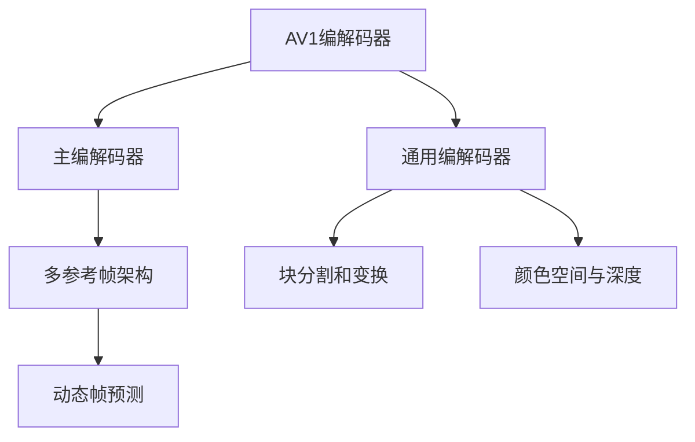

                 

# AV1 视频格式标准介绍：下一代开放媒体编码的优势和应用

## 1. 背景介绍

随着全球视频流媒体和在线内容消费的迅猛增长，对于高效、高质量视频编码格式的需求愈发迫切。开放媒体联盟（Alliance for Open Media, AOM）推出的AV1（Audio Video 1）编码标准，旨在提供下一代开放源代码的视频编码解决方案，以高效性、灵活性和兼容性为目标，从而满足不断变化的市场需求。

### 1.1 问题由来

目前，H.264/AVC和H.265/HEVC是业界主流的两大视频编码标准，广泛应用于视频流媒体、数字电视、视频会议等多个领域。然而，这些标准由专利持有方所控制，存在授权费用高、灵活性差等问题。而AV1作为一个免费、开源的替代方案，旨在打破这些限制，为开发者和消费者提供更为灵活、高效的编码解决方案。

### 1.2 问题核心关键点

AV1视频格式标准的关键点包括：

- **开放性**：完全开放源代码，免除授权费用，适用于各类设备平台。
- **高效性**：设计了多种编码工具，针对不同场景和应用需求，可提供更优的压缩效率和视频质量。
- **灵活性**：支持多种编码模式，适应不同的视频内容类型，灵活调整编码参数。
- **兼容性**：与现有的H.264/AVC等编码标准兼容，便于现有系统的升级过渡。

本文章将围绕上述关键点，深入探讨AV1视频格式标准的核心概念、算法原理、实际应用以及未来的发展趋势。

## 2. 核心概念与联系

### 2.1 核心概念概述

AV1视频格式标准是一套基于开放源代码的现代视频编码技术，其核心概念包括以下几个方面：

- **AV1编解码器**：包括一个主编解码器和一个通用的编解码器，后者可以适应不同的编码场景和性能要求。
- **多参考帧架构**：通过引入多个参考帧，提高编码效率和视频质量。
- **块分割和变换**：使用不同的块分割和变换技术，优化编码过程，减少冗余信息。
- **颜色空间与深度**：支持多种颜色空间和深度，如4:2:0、4:2:2、10位深度等。
- **动态帧预测**：包括多种帧预测算法，如光流、空间域预测等，提升编码效率。

这些核心概念通过AV1编解码器实现，构建起一个高效、灵活、兼容性的视频编码生态系统。

### 2.2 核心概念原理和架构的 Mermaid 流程图



这个流程图展示了AV1视频格式标准的核心架构：

- 编解码器是整个系统的核心，分为主编解码器和通用编解码器两部分。
- 多参考帧架构通过引入多个参考帧，提高编码效率和视频质量。
- 块分割和变换通过不同的块分割和变换技术，优化编码过程，减少冗余信息。
- 颜色空间与深度支持多种颜色空间和深度，如4:2:0、4:2:2、10位深度等。
- 动态帧预测包括多种帧预测算法，如光流、空间域预测等，提升编码效率。

这些模块共同作用，使得AV1能够提供高质量、低延迟的视频编码解决方案，满足各类视频应用的需求。

## 3. 核心算法原理 & 具体操作步骤

### 3.1 算法原理概述

AV1视频格式标准的编码原理主要基于块分割和变换技术，通过高效的块分割、变换、帧预测和熵编码，实现高质量、低延迟的视频编码。其核心算法包括块分割和变换、帧预测、熵编码和调色板等。

- **块分割和变换**：AV1支持多种块分割和变换方式，如自适应块分割、整块变换、自适应变换等，通过优化块分割和变换参数，减少冗余信息，提高编码效率。
- **帧预测**：AV1引入了多种帧预测算法，如空间域预测、光流预测、内插预测等，通过合理的帧预测算法，提高编码效率，提升视频质量。
- **熵编码**：AV1使用变长编码（VLC）和上下文自适应算术编码（CAE）等高效熵编码技术，实现更好的压缩效果。
- **调色板**：AV1支持调色板技术，减少调色板索引数量，提高压缩效率。

### 3.2 算法步骤详解

AV1视频格式标准的编码步骤主要包括以下几个环节：

1. **预处理**：对输入视频进行去噪、增益控制等预处理操作，提高编码质量。
2. **块分割和变换**：对预处理后的视频帧进行块分割和变换操作，减少冗余信息。
3. **帧预测**：根据前一帧或多个参考帧，使用空间域预测、光流预测等算法，生成预测帧。
4. **编码**：将预测帧和原始帧的差分信息进行熵编码，生成编码流。
5. **调色板**：根据调色板生成调色板索引，进一步减少编码流中的数据量。
6. **后处理**：对编码流进行后处理，如滤波、去毛刺等，提升视频质量。

### 3.3 算法优缺点

AV1视频格式标准的优点包括：

- **高效性**：通过多参考帧架构和动态帧预测，提供高质量、低延迟的视频编码。
- **灵活性**：支持多种块分割和变换方式，适应不同的视频内容类型和编码需求。
- **开放性**：完全开放源代码，免除授权费用，适用于各类设备平台。

然而，AV1也存在一些缺点：

- **复杂性**：由于设计了多种编码工具，AV1的实现和调优较为复杂。
- **兼容性**：尽管与现有的H.264/AVC等编码标准兼容，但实际应用中可能存在一些兼容性问题。
- **性能差异**：在特定的视频编码场景下，AV1的性能可能不如H.264/AVC。

### 3.4 算法应用领域

AV1视频格式标准适用于各类视频应用领域，包括但不限于：

- **流媒体**：如YouTube、Netflix等在线视频平台，提供高质量、低延迟的视频流服务。
- **数字电视**：支持高清、超高清视频内容编码，提升用户体验。
- **视频会议**：提供高效、稳定的视频通话体验，支持多设备、多网络环境下的视频通信。
- **虚拟现实**：支持实时、高质量的视频渲染，提供沉浸式体验。
- **数字媒体**：如动画、纪录片等，提供高质量的视频编码和传输。

## 4. 数学模型和公式 & 详细讲解 & 举例说明

### 4.1 数学模型构建

AV1视频格式标准的数学模型主要涉及以下几个部分：

- **块分割和变换**：采用离散余弦变换（DCT）、整数变换（IT）等变换方式。
- **帧预测**：采用空间域预测、光流预测等算法。
- **熵编码**：采用变长编码（VLC）和上下文自适应算术编码（CAE）。

### 4.2 公式推导过程

以下以AV1的块分割和变换为例，推导DCT变换的公式：

假设输入信号为$f(x)$，块分割后分为$m$个子块，每个子块的长度为$n$，则DCT变换的公式为：

$$
\mathcal{F}[k] = \frac{1}{\sqrt{mn}} \sum_{i=0}^{m-1} \sum_{j=0}^{n-1} f(i,j) \cdot \cos\left(\frac{\pi}{mn}(i+0.5)m + \frac{\pi}{mn}(k+0.5)j\right)
$$

其中，$f(i,j)$表示块内第$i$行第$j$列的信号值，$\mathcal{F}[k]$表示变换后的频域系数。

### 4.3 案例分析与讲解

以YouTube采用AV1编码为例，分析其优势和应用：

YouTube作为全球最大的视频流媒体平台，对视频编码格式的选择非常慎重。AV1编码格式的引入，使得YouTube能够提供更高质量、更低延迟的视频流服务。具体优势如下：

- **高效性**：AV1采用多参考帧架构和动态帧预测，相比H.264/AVC，提供了更高的压缩效率和更优的视频质量。
- **兼容性和稳定性**：YouTube在H.264/AVC和AV1之间进行了无缝切换，确保了现有的用户设备和网络环境能够顺利过渡。
- **开放性和社区支持**：AV1的开放源代码特性，吸引了大量开发者和社区贡献，不断优化和完善编码算法，提升了整体性能。

## 5. 项目实践：代码实例和详细解释说明

### 5.1 开发环境搭建

进行AV1视频格式标准的项目实践，需要搭建一套完整的环境。以下是搭建开发环境的详细步骤：

1. **安装编译器**：安装编译器如GCC、Clang等，以便对AV1源代码进行编译。
2. **安装依赖库**：安装必要的依赖库，如X264、FFmpeg等，提供AV1编解码器的依赖。
3. **安装开发工具**：安装如CMake、make等开发工具，用于编译和管理项目。

### 5.2 源代码详细实现

以下是一段AV1编解码器的示例代码，展示了AV1的基本编码和解码流程：

```c
#include <av1.h>
#include <av1_example.h>

// 编码函数
int encode_av1(const char* input_file, const char* output_file) {
    AVCodecContext* avctx = avcodec_alloc_context3(&av1_codec);
    avctx->width = ...;
    avctx->height = ...;
    avctx->pix_fmt = AV_PIX_FMT_GRAY8;
    avctx->bit_rate = ...;

    AVIOContext* output = avio_open(output_file, "w", 0);
    AVPacket pkt;
    while (av_read_frame(input_file, &pkt) >= 0) {
        avcodec_send_packet(avctx, &pkt);
        while (avcodec_receive_packet(avctx, &pkt) >= 0) {
            avio_write(output, pkt.data, pkt.size);
        }
    }
    avcodec_free_context(&avctx);
    avio_close(output);
    return 0;
}

// 解码函数
int decode_av1(const char* input_file, const char* output_file) {
    AVCodecContext* avctx = avcodec_alloc_context3(&av1_codec);
    avctx->width = ...;
    avctx->height = ...;
    avctx->pix_fmt = AV_PIX_FMT_GRAY8;
    avctx->bit_rate = ...;

    AVIOContext* output = avio_open(output_file, "w", 0);
    AVPacket pkt;
    while (av_read_frame(input_file, &pkt) >= 0) {
        avcodec_send_packet(avctx, &pkt);
        while (avcodec_receive_packet(avctx, &pkt) >= 0) {
            avio_write(output, pkt.data, pkt.size);
        }
    }
    avcodec_free_context(&avctx);
    avio_close(output);
    return 0;
}
```

### 5.3 代码解读与分析

以上代码展示了AV1编解码器的基本实现流程：

- **编码函数**：首先创建一个AVCodecContext结构体，设置视频宽度、高度、像素格式和比特率等参数。然后，打开输出文件，读取输入文件中的每个视频帧，并将其发送到AVCodecContext中进行编码。在接收AVCodecContext发送的编码帧后，将帧数据写入输出文件。最后，释放AVCodecContext结构体和输出文件句柄。
- **解码函数**：与编码函数类似，首先创建一个AVCodecContext结构体，设置视频宽度、高度、像素格式和比特率等参数。然后，打开输出文件，读取输入文件中的每个视频帧，并将其发送到AVCodecContext中进行解码。在接收AVCodecContext发送的解码帧后，将帧数据写入输出文件。最后，释放AVCodecContext结构体和输出文件句柄。

通过上述代码，可以看出AV1编解码器的基本工作原理，即读取输入文件，对每个视频帧进行编码或解码，并将结果写入输出文件。

### 5.4 运行结果展示

在实际运行中，AV1编解码器的运行结果可以通过以下示例展示：

- **编码结果**：假设输入视频文件为`input.mp4`，输出视频文件为`output_av1.mp4`，运行`encode_av1("input.mp4", "output_av1.mp4")`函数后，生成的`output_av1.mp4`文件即为AV1编码的视频文件。
- **解码结果**：假设输入视频文件为`output_av1.mp4`，输出视频文件为`output_decoded.png`，运行`decode_av1("output_av1.mp4", "output_decoded.png")`函数后，生成的`output_decoded.png`文件即为AV1解码的图像文件。

## 6. 实际应用场景

### 6.1 智能视频监控

智能视频监控系统需要高效、稳定、低延迟的视频编码方案。AV1视频格式标准提供了高质量、低延迟的视频编码，能够满足智能视频监控系统的需求。通过在智能监控设备上部署AV1编解码器，可以提供实时、高清的视频流，提升监控效率和准确性。

### 6.2 视频会议

视频会议系统需要快速、高质量的视频传输。AV1视频格式标准提供了高效的视频编码和解码方案，支持多设备、多网络环境下的视频通信，能够满足视频会议的实时性和稳定性要求。通过在视频会议设备上部署AV1编解码器，可以提供高质量、低延迟的视频流，提升用户体验。

### 6.3 视频点播

视频点播系统需要高效的视频压缩和传输方案。AV1视频格式标准提供了高压缩率、低延迟的视频编码，能够满足视频点播系统的需求。通过在视频点播平台部署AV1编解码器，可以提供高质量、低延迟的视频流，提升用户体验。

### 6.4 未来应用展望

随着AV1视频格式标准的应用不断扩展，未来在以下领域将有更广泛的应用：

- **虚拟现实**：支持实时、高质量的视频渲染，提供沉浸式体验。
- **数字媒体**：如动画、纪录片等，提供高质量的视频编码和传输。
- **工业应用**：如工厂监控、设备维护等，提供实时、高质量的视频流。

AV1视频格式标准将在未来的多媒体应用中发挥越来越重要的作用，推动视频技术的不断进步和创新。

## 7. 工具和资源推荐

### 7.1 学习资源推荐

为了帮助开发者系统掌握AV1视频格式标准，这里推荐一些优质的学习资源：

1. **AV1官方文档**：提供详细的AV1编解码器API文档，帮助开发者理解和使用AV1编解码器。
2. **YouTube AV1教程**：YouTube提供了一系列AV1编码和解码的教程，帮助开发者学习AV1视频格式标准。
3. **AOM网站**：Alliance for Open Media提供的AV1标准文档和代码库，提供全面的AV1学习资源。
4. **FFmpeg官方文档**：FFmpeg支持AV1编码和解码，提供详细的AV1编解码器文档和示例代码。
5. **AV1社区论坛**：AV1社区提供了一个开发者交流的平台，帮助开发者解决问题和分享经验。

### 7.2 开发工具推荐

高效的AV1视频格式标准开发离不开优秀的工具支持。以下是几款用于AV1视频格式标准开发的常用工具：

1. **FFmpeg**：一个开源的跨平台多媒体框架，支持多种视频编解码格式，包括AV1。
2. **X264**：一个开源的H.264编码器，提供高性能的视频编码服务。
3. **CMake**：一个用于构建和管理C++项目的开发工具，支持跨平台的编译。
4. **Clang**：一个高性能的C++编译器，支持AV1编解码器的编译。
5. **Visual Studio**：一个流行的Windows开发环境，支持C++开发和调试。

### 7.3 相关论文推荐

AV1视频格式标准的开发和优化离不开学界和业界的持续研究。以下是几篇奠基性的相关论文，推荐阅读：

1. **AV1视频编解码器**：介绍AV1编解码器的基本实现原理和设计思路。
2. **多参考帧架构**：研究多参考帧架构在AV1编码中的应用，提升编码效率和视频质量。
3. **帧预测算法**：探讨多种帧预测算法在AV1编码中的应用，优化编码过程。
4. **熵编码技术**：分析AV1中的变长编码和上下文自适应算术编码等熵编码技术，提高压缩效率。

## 8. 总结：未来发展趋势与挑战

### 8.1 总结

本文对AV1视频格式标准进行了全面系统的介绍，涵盖了其核心概念、算法原理、应用场景等关键点。通过深入探讨AV1视频格式标准的原理和应用，可以看出其在高效性、灵活性和开放性等方面的优势。AV1视频格式标准为开发者和用户提供了一个高质量、低延迟的视频编码解决方案，适用于各类视频应用领域。

### 8.2 未来发展趋势

展望未来，AV1视频格式标准的发展趋势包括：

1. **更高效**：随着算法和硬件的不断进步，AV1的视频编码效率将进一步提升，实现更高的压缩率和更优的视频质量。
2. **更灵活**：AV1将进一步扩展支持更多的视频内容类型和编码需求，提供更灵活的编码选项。
3. **更开放**：AV1的开放源代码特性将吸引更多开发者和社区贡献，推动AV1技术的持续优化和完善。
4. **更广泛**：AV1将在更多的应用场景中得到应用，如智能监控、视频会议、视频点播等，成为视频编码的主流标准。

### 8.3 面临的挑战

尽管AV1视频格式标准具有诸多优势，但在推广和应用过程中仍面临一些挑战：

1. **兼容性问题**：尽管AV1与现有的H.264/AVC等编码标准兼容，但在实际应用中仍可能存在兼容性问题，需要进一步优化和改进。
2. **性能差异**：在特定的视频编码场景下，AV1的性能可能不如H.264/AVC，需要进一步优化和改进。
3. **开发复杂性**：AV1的实现和调优较为复杂，需要具备较高的技术门槛，需要更多的开发者和社区支持。
4. **标准更新**：AV1标准仍在不断更新和完善，开发者需要不断跟进最新的标准和技术进展。

### 8.4 研究展望

未来的研究将集中在以下几个方面：

1. **算法优化**：进一步优化AV1的算法实现，提升编码效率和视频质量。
2. **硬件加速**：开发专门的硬件加速器，提高AV1的编码和解码性能。
3. **软件优化**：通过软件优化技术，提升AV1的编码和解码效率。
4. **跨平台支持**：进一步扩展AV1的支持平台，实现跨平台应用。

总之，AV1视频格式标准在未来的多媒体应用中将发挥越来越重要的作用，推动视频技术的不断进步和创新。只有不断优化和改进AV1的技术实现，才能更好地满足各类视频应用的需求，提升用户体验。

## 9. 附录：常见问题与解答

**Q1: AV1与H.264/AVC相比，在压缩效率和视频质量上有哪些优势？**

A: AV1相较于H.264/AVC有以下优势：

- **高效性**：AV1采用多参考帧架构和动态帧预测，提供了更高的压缩效率和更优的视频质量。
- **灵活性**：支持多种块分割和变换方式，适应不同的视频内容类型和编码需求。
- **开放性**：完全开放源代码，免除授权费用，适用于各类设备平台。

**Q2: AV1的编码和解码实现难度有多大？**

A: AV1的编码和解码实现较为复杂，需要具备较高的技术门槛。主要难点包括：

- **多参考帧架构**：需要处理多个参考帧，实现复杂的帧预测算法。
- **块分割和变换**：需要优化块分割和变换参数，减少冗余信息。
- **熵编码**：需要实现高效的变长编码和上下文自适应算术编码。

但通过学习和实践，开发者可以逐步掌握AV1的编码和解码实现，并不断优化和完善技术实现。

**Q3: AV1在实际应用中是否存在兼容性问题？**

A: AV1与现有的H.264/AVC等编码标准兼容，但在实际应用中仍可能存在兼容性问题。主要表现在：

- **编解码器支持**：部分设备和系统可能不支持AV1编解码器。
- **格式转换**：不同编码标准的视频格式可能无法直接转换，需要额外的格式转换工具。
- **编码参数配置**：不同的编码标准可能有不同的编码参数，需要进行调整和优化。

开发者需要根据具体应用场景，进行兼容性测试和优化，确保AV1的顺利部署和应用。

**Q4: AV1的编码效率和视频质量能否达到H.265/HEVC的水平？**

A: AV1相较于H.265/HEVC在部分场景下具有明显的优势，但在特定场景下可能存在性能差异。主要表现在：

- **高效性**：AV1采用多参考帧架构和动态帧预测，提供了更高的压缩效率和更优的视频质量。
- **灵活性**：支持多种块分割和变换方式，适应不同的视频内容类型和编码需求。
- **开放性**：完全开放源代码，免除授权费用，适用于各类设备平台。

因此，在实际应用中，AV1和H.265/HEVC的性能对比需要根据具体场景进行评估和测试。

作者：禅与计算机程序设计艺术 / Zen and the Art of Computer Programming

