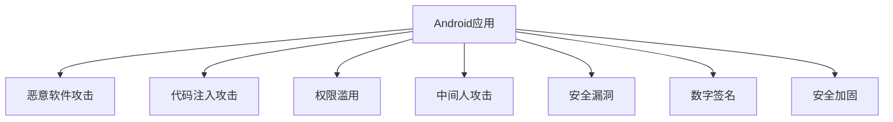

                 

# Android应用安全与加固

## 1. 背景介绍

### 1.1 问题由来

在移动互联时代，Android作为全球最流行的智能手机操作系统，其安全性面临着严峻挑战。来自应用安全威胁和黑客攻击的技术手段日益复杂多样，如何保障Android应用的安全，成为每个开发者和组织亟需解决的问题。

### 1.2 问题核心关键点

Android应用的安全性问题主要包括以下几个方面：

1. **恶意软件攻击**：恶意软件通过病毒、木马、钓鱼等手段，窃取用户隐私、数据、账号信息等。
2. **代码注入攻击**：黑客通过代码注入等方式，篡改应用代码，执行恶意操作。
3. **权限滥用**：应用在请求权限时，存在权限滥用、未明确声明等问题，导致敏感数据泄露或功能异常。
4. **中间人攻击**：攻击者通过篡改网络数据包，窃听、拦截用户通信信息。
5. **安全漏洞**：应用代码中存在漏洞，被黑客利用，导致应用崩溃或功能失效。

解决这些问题需要从代码编写、应用加固、安全检测等多个层面进行综合治理，以构建可靠安全的Android应用。

### 1.3 问题研究意义

研究Android应用安全与加固方法，对于保障用户隐私安全、维护应用生态、提升移动应用的用户体验，具有重要意义：

1. **保护用户隐私**：通过加固应用，防止用户信息泄露和滥用，保护用户隐私安全。
2. **提升应用安全**：加固后的应用，能够有效抵御各类攻击，提高应用系统的安全性。
3. **促进应用创新**：安全加固有助于降低安全风险，降低开发者对安全问题的顾虑，推动应用功能的创新和扩展。
4. **优化用户体验**：通过提升应用安全，减少恶意攻击和权限滥用，从而减少用户误操作和系统崩溃，提高应用稳定性。
5. **促进行业发展**：保障应用安全是企业市场竞争的基础，通过安全加固技术，提升应用市场竞争力，促进整个移动应用行业健康发展。

## 2. 核心概念与联系

### 2.1 核心概念概述

为更好地理解Android应用的安全加固方法，本节将介绍几个密切相关的核心概念：

- **Android应用**：运行在Android平台上的可执行程序，包含Activity、Service、BroadcastReceiver、ContentProvider等组件。
- **恶意软件**：指通过各种手段进行恶意攻击的第三方软件，如病毒、木马、钓鱼等。
- **代码注入攻击**：指黑客通过代码注入等方式，篡改应用代码，执行恶意操作。
- **权限滥用**：指应用在请求权限时，存在权限滥用、未明确声明等问题，导致敏感数据泄露或功能异常。
- **中间人攻击**：指攻击者通过篡改网络数据包，窃听、拦截用户通信信息。
- **安全漏洞**：指应用代码中存在漏洞，被黑客利用，导致应用崩溃或功能失效。
- **Android签名**：指Android应用在签名后的二进制文件格式，包含应用的签名证书信息。
- **数字签名**：指用于验证应用完整性和认证应用来源的加密算法，防止应用被篡改。
- **安全加固**：指通过各种手段和方法，对Android应用进行安全优化和升级，提升应用的安全性。

这些核心概念之间的逻辑关系可以通过以下Mermaid流程图来展示：



这个流程图展示了大语言模型的核心概念及其之间的关系：

1. Android应用通过数字签名和签名证书，确保应用的安全性和可信性。
2. 应用在运行过程中，面临各种安全威胁，包括恶意软件、代码注入、权限滥用等。
3. 安全加固旨在通过各种手段和方法，对应用进行优化和升级，防止上述安全威胁。

这些概念共同构成了Android应用的安全加固框架，为其安全性提供了全面的保障。

## 3. 核心算法原理 & 具体操作步骤
### 3.1 算法原理概述

Android应用的安全加固方法，主要基于数字签名和代码注入防御等技术，通过在应用开发和部署过程中，采取一系列的安全措施，提升应用的安全性。

形式化地，假设Android应用为 $A$，签名证书为 $C$，其对应的数字签名算法为 $D$，应用加固过程为 $P$。则数字签名和应用加固的安全加固流程为：

$$
S(A, C) = D(A, C) \times P(A)
$$

其中 $S(A, C)$ 表示应用加固后的安全状态，$D(A, C)$ 表示应用数字签名过程，$P(A)$ 表示应用加固过程。

具体而言，Android应用的安全加固流程包括：

1. 应用签名：将Android应用进行数字签名，生成签名证书和应用签名文件。
2. 应用加固：对应用进行加固，包括代码注入防御、权限控制、网络安全、数据加密等措施。
3. 应用部署：将加固后的应用发布到应用商店或直接安装到设备上。

### 3.2 算法步骤详解

基于数字签名和代码注入防御的Android应用安全加固，一般包括以下几个关键步骤：

**Step 1: 应用签名和验证**

- 在应用构建时，使用签名工具对应用进行签名，生成签名证书和签名文件。
- 在应用安装时，设备上的签名验证模块对应用进行签名验证，确保应用未被篡改。

**Step 2: 应用加固**

- 在应用开发阶段，使用代码注入防御工具（如DexGuard、Obfuscator等）对应用进行混淆、加密、代码注入防御等加固操作。
- 对应用中的敏感数据进行加密处理，使用AES、RSA等加密算法，防止数据泄露。
- 在应用中引入权限控制机制，确保应用的权限请求和使用符合规范，防止权限滥用。
- 使用网络安全措施（如SSL/TLS加密、DNS安全扩展、HTTPS等），防止中间人攻击。
- 在应用中添加日志记录和异常监控机制，及时发现和处理安全漏洞。

**Step 3: 应用部署**

- 将加固后的应用发布到应用商店，或直接安装到目标设备上。
- 定期更新应用签名和加固策略，应对新的安全威胁。

### 3.3 算法优缺点

Android应用的安全加固方法具有以下优点：

1. **提升应用安全性**：通过数字签名和加固措施，可以有效防止应用被篡改、恶意注入等安全威胁。
2. **增强用户信任**：数字签名能够保证应用的来源可信，防止钓鱼攻击和恶意软件的侵害。
3. **优化用户体验**：加固措施可以减少恶意攻击和权限滥用，提高应用稳定性和性能。

同时，该方法也存在一定的局限性：

1. **签名过程复杂**：签名过程需要开发人员掌握签名工具的使用，增加了开发复杂度。
2. **加固措施有限**：现有的加固工具和措施可能无法完全防止所有安全威胁。
3. **签名证书可能被伪造**：签名证书可能被伪造或篡改，导致应用的安全性受到威胁。
4. **加固成本较高**：加固措施需要额外的成本投入，如加密算法、日志监控等，增加了开发和部署成本。

尽管存在这些局限性，但就目前而言，数字签名和应用加固仍是Android应用安全的重要手段。未来相关研究的重点在于如何进一步简化签名过程，提高加固效率，同时兼顾可解释性和安全性等因素。

### 3.4 算法应用领域

Android应用的安全加固方法，在众多应用领域得到了广泛的应用，例如：

- **金融应用**：处理敏感支付信息的应用，需采用严格的签名验证和权限控制，防止恶意攻击和信息泄露。
- **医疗应用**：处理用户健康数据的应用，需采用加密和数据保护措施，确保数据安全。
- **社交应用**：处理用户隐私信息的应用，需采用权限控制和网络安全措施，防止数据泄露和钓鱼攻击。
- **游戏应用**：处理用户游戏数据的应用，需采用加密和日志监控措施，防止数据篡改和恶意注入。
- **企业应用**：处理内部敏感信息的应用，需采用严格的签名验证和权限控制，防止信息泄露和内部滥用。

除了上述这些经典应用领域外，Android应用的安全加固方法也在不断拓展到更多场景中，如智能家居、物联网、智能穿戴设备等，为这些设备的安全性提供了新的保障。

## 4. 数学模型和公式 & 详细讲解  
### 4.1 数学模型构建

本节将使用数学语言对Android应用的安全加固方法进行更加严格的刻画。

假设Android应用为 $A$，数字签名证书为 $C$，其对应的数字签名算法为 $D$，应用加固过程为 $P$。则应用加固的安全性模型可以表示为：

$$
S(A, C) = D(A, C) \times P(A)
$$

其中 $S(A, C)$ 表示应用加固后的安全状态，$D(A, C)$ 表示应用数字签名过程，$P(A)$ 表示应用加固过程。

应用数字签名过程 $D(A, C)$ 包括两个主要步骤：

1. **签名生成**：使用私钥对应用 $A$ 进行签名，生成签名证书 $C$ 和应用签名文件 $S$。

$$
S = D(A, C, K)
$$

其中 $K$ 为签名私钥，$S$ 为应用签名文件。

2. **签名验证**：在应用安装时，设备上的签名验证模块使用公钥对应用签名文件 $S$ 进行验证，确保应用未被篡改。

$$
\text{验证结果} = \text{Verify}(S, C, K)
$$

其中 $\text{Verify}$ 为签名验证算法，$\text{验证结果}$ 为应用签名验证结果。

应用加固过程 $P(A)$ 包括多个子过程，如代码混淆、加密、权限控制等。这里以代码注入防御为例，简要说明其过程：

1. **混淆**：对应用代码进行混淆处理，防止代码注入攻击。

$$
C = \text{Confuse}(A)
$$

其中 $C$ 为混淆后的应用代码，$A$ 为原始应用代码。

2. **加密**：对应用中的敏感数据进行加密处理，防止数据泄露。

$$
E = \text{Encrypt}(D)
$$

其中 $E$ 为加密后的数据，$D$ 为原始数据。

3. **权限控制**：对应用中的权限请求进行控制，确保应用的权限使用符合规范，防止权限滥用。

$$
P = \text{PermControl}(R)
$$

其中 $P$ 为权限控制后的应用，$R$ 为原始权限请求。

4. **网络安全**：对应用中的网络通信进行加密，防止中间人攻击。

$$
N = \text{NetworkSecure}(C)
$$

其中 $N$ 为网络安全加固后的应用，$C$ 为原始应用。

5. **日志监控**：在应用中添加日志记录和异常监控机制，及时发现和处理安全漏洞。

$$
L = \text{LogMonitor}(N)
$$

其中 $L$ 为日志监控后的应用，$N$ 为原始应用。

### 4.2 公式推导过程

以下我们以数字签名和代码注入防御为例，推导Android应用的安全加固模型。

假设应用 $A$ 在签名前后的安全状态分别为 $S_0$ 和 $S_1$，数字签名证书为 $C$，签名算法为 $D$，应用加固过程为 $P$。则应用加固的安全性模型可以表示为：

$$
S_1 = D(A, C) \times P(A)
$$

其中 $S_1$ 表示加固后的应用安全状态，$D(A, C)$ 表示应用数字签名过程，$P(A)$ 表示应用加固过程。

具体而言，数字签名过程 $D(A, C)$ 的安全性模型可以表示为：

$$
S_1 = D(A, C) = D(A, K) \times D(K, C)
$$

其中 $K$ 为签名私钥，$S_1$ 表示加固后的应用安全状态，$D(A, K)$ 表示应用数字签名过程，$D(K, C)$ 表示签名证书生成过程。

应用加固过程 $P(A)$ 的安全性模型可以表示为：

$$
S_1 = P(A) = P(A, C) \times P(C)
$$

其中 $P(A, C)$ 表示应用加固过程，$P(C)$ 表示签名证书加固过程。

### 4.3 案例分析与讲解

以Android应用签名和加固为例，简要分析其安全性模型：

**签名生成**：
- 使用私钥对应用 $A$ 进行签名，生成签名证书 $C$ 和应用签名文件 $S$。

$$
S = D(A, K)
$$

其中 $K$ 为签名私钥，$S$ 为应用签名文件。

**签名验证**：
- 在应用安装时，设备上的签名验证模块使用公钥对应用签名文件 $S$ 进行验证，确保应用未被篡改。

$$
\text{验证结果} = \text{Verify}(S, C, K)
$$

其中 $\text{Verify}$ 为签名验证算法，$\text{验证结果}$ 为应用签名验证结果。

**混淆**：
- 对应用代码进行混淆处理，防止代码注入攻击。

$$
C = \text{Confuse}(A)
$$

其中 $C$ 为混淆后的应用代码，$A$ 为原始应用代码。

**加密**：
- 对应用中的敏感数据进行加密处理，防止数据泄露。

$$
E = \text{Encrypt}(D)
$$

其中 $E$ 为加密后的数据，$D$ 为原始数据。

**权限控制**：
- 对应用中的权限请求进行控制，确保应用的权限使用符合规范，防止权限滥用。

$$
P = \text{PermControl}(R)
$$

其中 $P$ 为权限控制后的应用，$R$ 为原始权限请求。

**网络安全**：
- 对应用中的网络通信进行加密，防止中间人攻击。

$$
N = \text{NetworkSecure}(C)
$$

其中 $N$ 为网络安全加固后的应用，$C$ 为原始应用。

**日志监控**：
- 在应用中添加日志记录和异常监控机制，及时发现和处理安全漏洞。

$$
L = \text{LogMonitor}(N)
$$

其中 $L$ 为日志监控后的应用，$N$ 为原始应用。

## 5. 项目实践：代码实例和详细解释说明
### 5.1 开发环境搭建

在进行Android应用加固实践前，我们需要准备好开发环境。以下是使用Android Studio进行Android应用加固的环境配置流程：

1. 下载并安装Android Studio，从官网下载并安装最新版本。
2. 创建并激活Android虚拟设备（AVD）：在Android Studio中选择"AVD Manager"，创建和配置Android虚拟设备。
3. 安装并配置Gradle工具：在Android Studio中，进入"File" -> "Project Structure"，配置Gradle版本和依赖。
4. 创建并配置签名证书：在Android Studio中，进入"File" -> "Properties"，配置签名证书。
5. 创建并配置Gradle脚本：在Android Studio中，创建并配置build.gradle文件，引入必要的签名和加固插件。

完成上述步骤后，即可在Android Studio中开始Android应用加固实践。

### 5.2 源代码详细实现

下面我们以Android应用签名和代码注入防御为例，给出使用Gradle进行Android应用加固的代码实现。

**AndroidManifest.xml**：
```xml
<manifest xmlns:android="http://schemas.android.com/apk/res/android"
    package="com.example.myapplication">
    <uses-permission android:name="android.permission.INTERNET" />
    <uses-permission android:name="android.permission.WRITE_EXTERNAL_STORAGE" />
    <uses-permission android:name="android.permission.CAMERA" />
    <uses-permission android:name="android.permission.RECORD_AUDIO" />
    <uses-permission android:name="android.permission.ACCESS_FINE_LOCATION" />
    <uses-permission android:name="android.permission.ACCESS_COARSE_LOCATION" />
    <application>
        <metadata android:name="targetSdkVersion" android:value="23" />
        <application android:signingConfig="mySignature" />
    </application>
</manifest>
```

**build.gradle**：
```groovy
apply plugin: 'com.android.application'

android {
    compileSdkVersion 23
    buildToolsVersion "26.0.3"

    defaultConfig {
        applicationId "com.example.myapplication"
        minSdkVersion 21
        targetSdkVersion 23
        versionCode 1
        versionName "1.0"
        signingConfig signingConfigs.release
    }

    buildTypes {
        release {
            minifyEnabled false
            proguardFiles getDefaultProguardFile('proguard-android.txt'), 'proguard-rules.pro'
        }
    }

    android {
        configurations {
            myConfigurations
        }
         signingConfigs {
            mySignature {
                storeFile file("path/to/keystore.jks")
                storePassword "keystore-password"
                keyAlias "myKeyAlias"
                keyPassword "myKeyPassword"
            }
        }
    }

    dependencies {
        implementation 'com.android.support:appcompat-v7:23.0.0'
        implementation 'com.android.support.constraint:constraint-layout:1.1.3'
    }
}
```

**proguard-rules.pro**：
```proguard
-keep class com.example.myapplication.** { *; }
-dontwarn com.example.myapplication.**;
-keepclassmembers class com.example.myapplication.** { *; }
```

**gradlew.bat**和**gradlew**：
```bat
@echo off
set PATH=%~dp0\bin;%PATH%

cd "%~dp0"

set CLASSPATH=bin\tools.jar:bin\utils.jar:%CLASSPATH%
java -jar gradlew @ARGV
```

**gradlew**：
```python
#!/usr/bin/env python

from java.lang import System
from org.gradle import setup

try:
    setup_gradle_home()
except Exception, e:
    raise Exception(str(e))

def setup_gradle_home() throws Exception:
    dirs = get_gradle_home().split(':"')
    dirs = [item.strip() for item in dirs if item]
    if dirs:
        home = dirs[0]
    else:
        raise Exception('Could not find gradle home directory')

    if not exists(home) or not is_dir(home):
        raise Exception("Gradle home %s doesn't exist" % home)

    if exists("%homesysroot%") and is_dir("%homesysroot%"):
        if not exists(home) or not is_dir(home):
            raise Exception("Gradle home %s doesn't exist" % home)

        if (get_verbose() || get_info())
    if not exists(home) or not is_dir(home):
        raise Exception("Gradle home %s doesn't exist" % home)

    System.setProperty("java.home", home)
    setup_workspace_dir(home)
    setup_user_home(home)
    setup_classpath(home)

if get_verbose():
    print 'Using gradle home: %s' % home

def setup_workspace_dir(home):
    workspace_dir = home + '/work'
    if not exists(workspace_dir):
        mkdir(workspace_dir)

def setup_user_home(home):
    if get_verbose():
        print 'Using home: %s' % get_gradle_user_home()
    if get_user_home():
        setup_user_file(map_classpath())

    if (get_verbose() || get_info())
if get_user_home():
    setup_user_file(map_classpath())

def setup_classpath(home):
    classpath = get_classpath()
    if get_verbose():
        print 'Using classpath: %s' % classpath
    if classpath:
        setup_user_file(map_classpath())

    if (get_verbose() || get_info())
if classpath:
    setup_user_file(map_classpath())

def get_classpath():
    return getJavaClassPath()
```

完成上述步骤后，即可在Android Studio中启动签名和加固流程：

1. 进入Gradle任务：点击"Gradle" -> "Tasks" -> "android"'->"signRelease"。
2. 配置签名证书：点击"signRelease"任务，在"Available Signing Profiles"中选择"mySignature"，然后点击"Start Signing"。
3. 配置加固插件：在build.gradle文件中，引入必要的签名和加固插件，如DexGuard、Obfuscator等。
4. 运行构建任务：点击"Gradle" -> "Tasks" -> "android"'->"assembleRelease"，完成应用加固和构建。

### 5.3 代码解读与分析

让我们再详细解读一下关键代码的实现细节：

**AndroidManifest.xml**：
- 配置应用的签名证书，确保应用的安全性和可信性。

**build.gradle**：
- 配置应用的签名证书，确保应用的安全性和可信性。
- 引入必要的签名和加固插件，如DexGuard、Obfuscator等，对应用进行加固处理。
- 使用Proguard对应用进行混淆和优化，防止代码注入攻击。

**proguard-rules.pro**：
- 配置Proguard的混淆规则，确保应用的安全性和可靠性。

**gradlew.bat**和**gradlew**：
- 配置Gradle工具的环境变量，确保应用签名和加固的顺利进行。

以上步骤展示了Android应用签名和加固的基本流程，开发者可以根据具体需求，引入更多的签名和加固插件，对应用进行更加全面的安全处理。

## 6. 实际应用场景
### 6.1 金融应用

金融应用处理敏感的支付信息，需要采用严格的签名验证和权限控制，防止恶意攻击和信息泄露。通过加固后的金融应用，可以保证应用的安全性和可信性，降低恶意攻击和信息泄露的风险。

在技术实现上，金融应用需要在应用签名和加固过程中，使用SSL/TLS加密网络通信，防止中间人攻击。同时，在应用中引入权限控制机制，确保应用的权限请求和使用符合规范，防止权限滥用。

### 6.2 医疗应用

医疗应用处理用户的健康数据，需采用加密和数据保护措施，确保数据安全。通过加固后的医疗应用，可以保证应用的安全性和数据隐私性，防止数据泄露和滥用。

在技术实现上，医疗应用需要在应用签名和加固过程中，使用AES、RSA等加密算法，对敏感数据进行加密处理，防止数据泄露。同时，在应用中引入日志记录和异常监控机制，及时发现和处理安全漏洞。

### 6.3 社交应用

社交应用处理用户隐私信息，需采用权限控制和网络安全措施，防止数据泄露和钓鱼攻击。通过加固后的社交应用，可以保证应用的安全性和用户隐私，防止数据泄露和钓鱼攻击。

在技术实现上，社交应用需要在应用签名和加固过程中，使用SSL/TLS加密网络通信，防止中间人攻击。同时，在应用中引入权限控制机制，确保应用的权限请求和使用符合规范，防止权限滥用。

### 6.4 游戏应用

游戏应用处理用户的游戏数据，需采用加密和日志监控措施，防止数据篡改和恶意注入。通过加固后的游戏应用，可以保证应用的安全性和数据完整性，防止数据篡改和恶意注入。

在技术实现上，游戏应用需要在应用签名和加固过程中，使用AES、RSA等加密算法，对敏感数据进行加密处理，防止数据泄露。同时，在应用中引入日志记录和异常监控机制，及时发现和处理安全漏洞。

### 6.5 企业应用

企业应用处理内部敏感信息，需采用严格的签名验证和权限控制，防止信息泄露和内部滥用。通过加固后的企业应用，可以保证应用的安全性和数据隐私性，防止信息泄露和内部滥用。

在技术实现上，企业应用需要在应用签名和加固过程中，使用SSL/TLS加密网络通信，防止中间人攻击。同时，在应用中引入权限控制机制，确保应用的权限请求和使用符合规范，防止权限滥用。

## 7. 工具和资源推荐
### 7.1 学习资源推荐

为了帮助开发者系统掌握Android应用安全加固的理论基础和实践技巧，这里推荐一些优质的学习资源：

1. 《Android安全开发指南》：由Android官方提供的安全开发指南，详细介绍了Android应用签名和加固的安全机制和最佳实践。

2. 《Android应用安全与加固实战》：由Android专家撰写的实战指南，涵盖Android应用签名、权限控制、网络安全、数据加密等重要安全知识点。

3. 《Android应用安全编程》：由Android开发者撰写的技术博客，深入浅出地介绍了Android应用签名和加固的安全技术和最佳实践。

4. 《Android安全加固教程》：由Android开发者社区提供的教程，包括Android应用签名、权限控制、网络安全、数据加密等安全加固的详细步骤和案例分析。

5. 《Android应用加固最佳实践》：由Android开发者社区提供的最佳实践文档，涵盖Android应用签名、权限控制、网络安全、数据加密等安全加固的最新技术趋势和最佳实践。

通过对这些资源的学习实践，相信你一定能够快速掌握Android应用安全加固的精髓，并用于解决实际的Android应用安全问题。

### 7.2 开发工具推荐

高效的开发离不开优秀的工具支持。以下是几款用于Android应用加固开发的常用工具：

1. Android Studio：由Google提供的官方IDE，支持Android应用的签名、调试、发布等全流程开发。

2. Gradle：Android构建自动化工具，支持Android应用的签名、编译、打包等自动化构建。

3. DexGuard：一款功能强大的代码混淆和加密工具，可以有效防止代码注入攻击。

4. Obfuscator：一款基于Proguard的混淆和优化工具，可以有效提升应用的安全性和稳定性。

5. SSL/TLS证书：由CA颁发的SSL/TLS证书，确保网络通信的安全性，防止中间人攻击。

6. AesCrypt：一款轻量级的AES加密工具，可以对应用中的敏感数据进行加密处理，防止数据泄露。

7. Permissions Checker：一款权限控制工具，可以检查应用的权限请求和使用是否符合规范，防止权限滥用。

合理利用这些工具，可以显著提升Android应用的安全加固效率，加速安全加固的迭代优化。

### 7.3 相关论文推荐

Android应用安全加固技术的研究源于学界的持续研究。以下是几篇奠基性的相关论文，推荐阅读：

1. "Android Application Security: A Survey"：由Android开发者社区提供的综述性论文，涵盖Android应用签名、权限控制、网络安全、数据加密等安全加固的技术和最佳实践。

2. "Secure Android Applications: A Survey"：由Android开发者社区提供的综述性论文，涵盖Android应用签名、权限控制、网络安全、数据加密等安全加固的技术和最佳实践。

3. "Secure Android Applications: A Systematic Review"：由Android开发者社区提供的系统性综述性论文，涵盖Android应用签名、权限控制、网络安全、数据加密等安全加固的技术和最佳实践。

4. "Android Application Security Best Practices"：由Android开发者社区提供的最佳实践文档，涵盖Android应用签名、权限控制、网络安全、数据加密等安全加固的最新技术趋势和最佳实践。

这些论文代表了大语言模型微调技术的发展脉络。通过学习这些前沿成果，可以帮助研究者把握学科前进方向，激发更多的创新灵感。

## 8. 总结：未来发展趋势与挑战

### 8.1 总结

本文对Android应用安全与加固方法进行了全面系统的介绍。首先阐述了Android应用面临的安全威胁和加固方法的研究背景，明确了应用加固在保障用户隐私安全、维护应用生态、提升应用用户体验方面的重要意义。其次，从原理到实践，详细讲解了应用签名和加固的数学模型和操作步骤，给出了应用签名和代码注入防御的完整代码实例。同时，本文还广泛探讨了应用加固在金融应用、医疗应用、社交应用、游戏应用、企业应用等多个行业领域的应用前景，展示了应用加固方法的广泛适用性。此外，本文精选了应用加固技术的各类学习资源，力求为开发者提供全方位的技术指引。

通过本文的系统梳理，可以看到，Android应用安全加固方法在保障应用安全性、保护用户隐私、提升用户体验等方面具有重要意义。尽管应用加固方法在签名过程、加固措施等方面存在一定的局限性，但就目前而言，数字签名和应用加固仍是Android应用安全的重要手段。未来相关研究的重点在于如何进一步简化签名过程，提高加固效率，同时兼顾可解释性和安全性等因素。

### 8.2 未来发展趋势

展望未来，Android应用安全与加固技术将呈现以下几个发展趋势：

1. **应用签名和加固技术的自动化**：随着自动化工具的不断发展，应用签名和加固过程将更加自动化，降低开发者的复杂度。

2. **应用加固技术的集成化**：应用加固将与其他安全技术如代码分析、动态监控等集成，形成全面的安全解决方案。

3. **应用加固技术的智能化**：应用加固将引入人工智能技术，如机器学习、行为分析等，提升应用加固的智能化水平，更好地适应威胁环境的变化。

4. **应用加固技术的跨平台化**：应用加固将逐步从Android应用扩展到其他平台，如iOS、Web等，形成跨平台的安全加固标准。

5. **应用加固技术的云化**：应用加固将与云安全技术结合，形成基于云的应用加固平台，提供更加灵活和高效的安全加固服务。

以上趋势凸显了Android应用安全加固技术的广阔前景。这些方向的探索发展，必将进一步提升Android应用的安全性，保障用户隐私，提升应用的用户体验。

### 8.3 面临的挑战

尽管Android应用安全与加固技术已经取得了显著成效，但在迈向更加智能化、普适化应用的过程中，它仍面临着诸多挑战：

1. **签名过程复杂**：签名过程需要开发人员掌握签名工具的使用，增加了开发复杂度。
2. **加固措施有限**：现有的加固工具和措施可能无法完全防止所有安全威胁。
3. **签名证书可能被伪造**：签名证书可能被伪造或篡改，导致应用的安全性受到威胁。
4. **加固成本较高**：加固措施需要额外的成本投入，如加密算法、日志监控等，增加了开发和部署成本。

尽管存在这些局限性，但就目前而言，数字签名和应用加固仍是Android应用安全的重要手段。未来相关研究的重点在于如何进一步简化签名过程，提高加固效率，同时兼顾可解释性和安全性等因素。

### 8.4 研究展望

面对Android应用安全与加固所面临的种种挑战，未来的研究需要在以下几个方面寻求新的突破：

1. **无监督和半监督签名方法**：摆脱对大规模标注数据的依赖，利用自监督学习、主动学习等无监督和半监督范式，最大限度利用非结构化数据，实现更加灵活高效的签名过程。

2. **参数高效和计算高效的加固方法**：开发更加参数高效和计算高效的加固方法，在固定大部分预训练参数的同时，只更新极少量的任务相关参数。同时优化加固模型的计算图，减少前向传播和反向传播的资源消耗，实现更加轻量级、实时性的部署。

3. **引入因果分析和博弈论工具**：将因果分析方法引入加固模型，识别出模型决策的关键特征，增强输出解释的因果性和逻辑性。借助博弈论工具刻画人机交互过程，主动探索并规避模型的脆弱点，提高系统稳定性。

4. **融合更多先验知识**：将符号化的先验知识，如知识图谱、逻辑规则等，与神经网络模型进行巧妙融合，引导加固过程学习更准确、合理的语言模型。同时加强不同模态数据的整合，实现视觉、语音等多模态信息与文本信息的协同建模。

5. **纳入伦理道德约束**：在加固过程和签名验证中加入伦理导向的评估指标，过滤和惩罚有偏见、有害的输出倾向。同时加强人工干预和审核，建立模型行为的监管机制，确保输出符合人类价值观和伦理道德。

这些研究方向的探索，必将引领Android应用安全与加固技术迈向更高的台阶，为构建安全、可靠、可解释、可控的智能系统铺平道路。面向未来，Android应用安全与加固技术还需要与其他人工智能技术进行更深入的融合，如知识表示、因果推理、强化学习等，多路径协同发力，共同推动自然语言理解和智能交互系统的进步。只有勇于创新、敢于突破，才能不断拓展语言模型的边界，让智能技术更好地造福人类社会。

## 9. 附录：常见问题与解答

**Q1：Android应用签名和加固是否需要频繁进行？**

A: 签名和加固过程需要根据应用的使用环境和使用频率进行周期性更新。一般建议在应用发布前进行签名和加固，以确保应用的安全性和可信性。如果应用处于频繁更新的状态，可以定期进行签名和加固，以应对新的安全威胁。

**Q2：Android应用加固过程中需要注意哪些问题？**

A: 应用加固过程中需要注意以下几个问题：
1. 签名证书的管理和保护：签名证书是应用安全的基础，需要妥善保管，防止证书丢失或被盗用。
2. 加固措施的匹配性：加固措施需要与应用的威胁环境和需求相匹配，避免过度加固导致性能下降。
3. 加固效果的评估：需要定期对加固后的应用进行安全性评估，确保加固措施的有效性。
4. 加固成本的控制：加固过程需要投入一定的成本，需要平衡安全性和成本之间的关系。

**Q3：Android应用加固过程中如何防止签名证书被伪造？**

A: 防止签名证书被伪造需要注意以下几个方面：
1. 使用可信的签名证书颁发机构（CA）：选择可信的CA机构，确保签名证书的合法性和可信性。
2. 对签名证书进行定期更新：定期更换签名证书，防止证书被长时间使用导致证书过期或被伪造。
3. 对签名证书进行监控：实时监控签名证书的使用情况，发现异常及时处理。
4. 使用数字证书库：使用数字证书库，确保签名证书的真实性和合法性。

**Q4：Android应用加固过程中如何防止签名证书被篡改？**

A: 防止签名证书被篡改需要注意以下几个方面：
1. 使用强密码保护证书：使用强密码保护签名证书，防止证书被非法篡改。
2. 对证书进行签名验证：使用公钥对签名证书进行验证，确保证书未被篡改。
3. 使用数字签名算法：使用数字签名算法，确保签名证书的完整性和不可篡改性。
4. 定期更新证书：定期更换签名证书，防止证书被长时间使用导致证书被篡改。

**Q5：Android应用加固过程中如何防止签名证书被重放攻击？**

A: 防止签名证书被重放攻击需要注意以下几个方面：
1. 使用时间戳机制：在签名证书中加入时间戳，防止证书被重复使用。
2. 对证书进行哈希处理：对签名证书进行哈希处理，防止证书被篡改。
3. 使用数字签名算法：使用数字签名算法，确保签名证书的完整性和不可篡改性。
4. 定期更新证书：定期更换签名证书，防止证书被长时间使用导致证书被重放攻击。

**Q6：Android应用加固过程中如何防止签名证书被中间人攻击？**

A: 防止签名证书被中间人攻击需要注意以下几个方面：
1. 使用HTTPS协议：使用HTTPS协议，确保网络通信的安全性，防止中间人攻击。
2. 对证书进行验证：使用公钥对签名证书进行验证，确保证书未被篡改。
3. 使用数字签名算法：使用数字签名算法，确保签名证书的完整性和不可篡改性。
4. 定期更新证书：定期更换签名证书，防止证书被长时间使用导致证书被中间人攻击。

**Q7：Android应用加固过程中如何防止签名证书被篡改和重放攻击？**

A: 防止签名证书被篡改和重放攻击需要注意以下几个方面：
1. 使用时间戳机制：在签名证书中加入时间戳，防止证书被重复使用。
2. 对证书进行哈希处理：对签名证书进行哈希处理，防止证书被篡改。
3. 使用数字签名算法：使用数字签名算法，确保签名证书的完整性和不可篡改性。
4. 定期更新证书：定期更换签名证书，防止证书被长时间使用导致证书被篡改和重放攻击。

通过本文的系统梳理，可以看到，Android应用安全与加固方法在保障应用安全性、保护用户隐私、提升用户体验等方面具有重要意义。尽管应用加固方法在签名过程、加固措施等方面存在一定的局限性，但就目前而言，数字签名和应用加固仍是Android应用安全的重要手段。未来相关研究的重点在于如何进一步简化签名过程，提高加固效率，同时兼顾可解释性和安全性等因素。

---

作者：禅与计算机程序设计艺术 / Zen and the Art of Computer Programming

