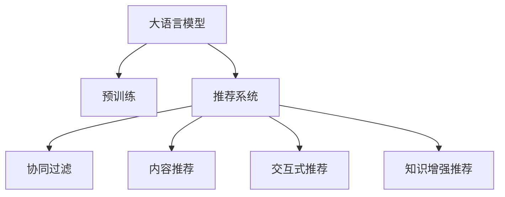

                 

# ChatGPT在推荐系统中的能力分析

大语言模型，如ChatGPT，近年来在推荐系统中的应用逐渐受到重视。本文将详细分析ChatGPT在推荐系统中的能力，包括其如何理解用户意图，如何进行内容推荐，以及其面临的挑战与未来发展方向。

## 1. 背景介绍

### 1.1 问题由来
推荐系统在电子商务、新闻阅读、视频流媒体等领域有着广泛应用，其目标是通过分析用户历史行为和兴趣，为用户推荐个性化的产品或内容。传统的推荐系统主要依赖于协同过滤、内容推荐等技术，但在推荐效果、泛化能力、冷启动等方面存在局限性。近年来，大语言模型（如GPT-3、ChatGPT等）因其强大的自然语言理解能力和知识积累，逐渐被引入推荐系统，成为一种新型的推荐方式。

### 1.2 问题核心关键点
ChatGPT在推荐系统中的应用，主要在于其理解自然语言的能力，能够通过与用户交互，捕捉用户需求并生成推荐内容。与传统推荐系统相比，ChatGPT的优点包括：

1. **理解自然语言**：ChatGPT能够理解复杂的自然语言描述，捕捉用户需求和兴趣。
2. **生成多样化内容**：ChatGPT不仅限于推荐商品或文章，还能够生成多样化的内容，如回答用户问题、提供观点等。
3. **动态更新知识**：ChatGPT可以实时更新知识库，提供最新的推荐内容。
4. **交互式推荐**：ChatGPT可以通过多轮对话，逐步引导用户需求，提供更精准的推荐。

## 2. 核心概念与联系

### 2.1 核心概念概述

为更好地理解ChatGPT在推荐系统中的应用，本节将介绍几个密切相关的核心概念：

- **大语言模型（Large Language Model, LLM）**：指以自回归（如GPT）或自编码（如BERT）模型为代表的、基于大规模无标签文本数据进行预训练的语言模型。通过预训练，模型学习到丰富的语言知识和常识。

- **推荐系统（Recommendation System）**：通过分析用户历史行为和兴趣，为用户推荐个性化的产品或内容。传统推荐系统主要依赖协同过滤、内容推荐等技术。

- **交互式推荐（Interactive Recommendation）**：通过与用户的对话，动态调整推荐策略，提供更个性化、更精准的推荐。ChatGPT的交互式能力使其在推荐系统中具有独特的优势。

- **知识增强推荐（Knowledge-enhanced Recommendation）**：结合外部知识库（如知识图谱、维基百科等），提高推荐的准确性和泛化能力。ChatGPT的知识增强推荐能够提供更全面的信息。

这些核心概念之间的逻辑关系可以通过以下Mermaid流程图来展示：



这个流程图展示了大语言模型在推荐系统中的作用及其与其他推荐技术的关系。

## 3. 核心算法原理 & 具体操作步骤

### 3.1 算法原理概述

ChatGPT在推荐系统中的应用，主要基于其对自然语言的理解能力和生成能力。具体来说，ChatGPT通过以下步骤进行推荐：

1. **用户意图理解**：通过与用户的对话，获取用户对推荐内容的需求和偏好。
2. **内容推荐生成**：根据用户意图，生成推荐内容。
3. **结果排序**：根据推荐内容的相关性和用户反馈，对推荐结果进行排序。

这些步骤可以概括为：意图理解 -> 推荐生成 -> 结果排序。

### 3.2 算法步骤详解

#### 3.2.1 意图理解

ChatGPT的意图理解主要通过与用户的对话进行。具体步骤如下：

1. **用户输入**：用户提供自然语言描述，表达对推荐内容的需求和偏好。
2. **模型理解**：ChatGPT通过语言模型，理解用户输入的意图。
3. **反馈调整**：ChatGPT通过多轮对话，不断调整其对用户意图的理解，确保生成推荐内容符合用户需求。

#### 3.2.2 推荐生成

推荐生成是ChatGPT的核心功能，具体步骤如下：

1. **选择模型**：根据用户需求，选择适合的预训练模型（如GPT-3、BERT等）。
2. **模型微调**：根据用户需求，对预训练模型进行微调，使其更符合用户的特定任务。
3. **内容生成**：使用微调后的模型，生成推荐内容。

#### 3.2.3 结果排序

推荐结果的排序，主要通过以下步骤进行：

1. **相关性计算**：计算推荐内容与用户需求的相关性，如通过余弦相似度等方法。
2. **用户反馈**：根据用户的反馈，调整推荐结果的排序。
3. **推荐显示**：将排序后的推荐结果展示给用户。

### 3.3 算法优缺点

ChatGPT在推荐系统中的应用，具有以下优点：

1. **理解自然语言**：ChatGPT能够理解复杂的自然语言描述，捕捉用户需求和兴趣。
2. **生成多样化内容**：ChatGPT不仅限于推荐商品或文章，还能够生成多样化的内容，如回答用户问题、提供观点等。
3. **动态更新知识**：ChatGPT可以实时更新知识库，提供最新的推荐内容。
4. **交互式推荐**：ChatGPT可以通过多轮对话，逐步引导用户需求，提供更精准的推荐。

同时，ChatGPT也存在一定的局限性：

1. **计算资源消耗大**：ChatGPT在生成推荐内容时，需要大量的计算资源，可能不适用于实时性要求高的场景。
2. **泛化能力有限**：ChatGPT的泛化能力可能受到预训练数据和微调数据的限制，对于特定领域的推荐效果可能不如传统推荐系统。
3. **知识库依赖**：ChatGPT的推荐效果依赖于外部知识库的覆盖度和质量，可能存在知识库不足或过时的情况。

### 3.4 算法应用领域

ChatGPT在推荐系统中的应用，涵盖以下领域：

- **电商推荐**：根据用户浏览和购买记录，推荐商品或优惠券。
- **内容推荐**：根据用户阅读和互动历史，推荐文章、视频等。
- **对话推荐**：通过与用户的对话，推荐相关主题或问题。
- **新闻推荐**：根据用户兴趣和行为，推荐新闻和头条。

除了这些常见应用，ChatGPT在推荐系统中的应用还在不断扩展，如社交推荐、旅游推荐等。

## 4. 数学模型和公式 & 详细讲解

### 4.1 数学模型构建

在推荐系统中，ChatGPT主要通过预训练语言模型进行推荐。假设预训练模型为 $M_{\theta}$，其中 $\theta$ 为模型参数。对于推荐任务 $T$，假设标注数据集为 $D=\{(x_i, y_i)\}_{i=1}^N$，其中 $x_i$ 为用户输入的自然语言描述，$y_i$ 为推荐内容的id。

定义推荐模型 $M_{\theta}$ 在输入 $x_i$ 上的输出为 $\hat{y}_i$，即推荐的商品或文章id。则推荐系统的目标为最小化预测错误率，即：

$$
\mathcal{L}(\theta) = \frac{1}{N} \sum_{i=1}^N \mathbb{I}(\hat{y}_i \neq y_i)
$$

其中 $\mathbb{I}$ 为示性函数，当 $\hat{y}_i = y_i$ 时为0，否则为1。

### 4.2 公式推导过程

基于上述目标，推荐模型的训练过程可以表示为：

1. **输入预处理**：对用户输入 $x_i$ 进行分词、编码等预处理，得到模型的输入 $x_i'$。
2. **模型前向传播**：使用预训练模型 $M_{\theta}$ 对输入 $x_i'$ 进行前向传播，得到推荐内容的概率分布 $p_{\theta}(y_i|x_i')$。
3. **损失计算**：计算预测错误率损失 $\mathcal{L}(\theta)$。
4. **梯度下降**：使用梯度下降算法，最小化损失函数 $\mathcal{L}(\theta)$。

具体公式推导如下：

$$
p_{\theta}(y_i|x_i') = \frac{e^{f_{\theta}(x_i', y_i)}}{\sum_j e^{f_{\theta}(x_i', y_j)}}
$$

其中 $f_{\theta}(x_i', y_i)$ 为模型 $M_{\theta}$ 在输入 $x_i'$ 和输出 $y_i$ 上的前向传播结果。

### 4.3 案例分析与讲解

假设我们要对用户 A 推荐商品，用户 A 的兴趣标签为 {时尚, 美妆, 运动}。ChatGPT通过与用户 A 的对话，了解其需求。假设用户 A 输入 "我想买些运动用品"，ChatGPT 的推荐过程如下：

1. **意图理解**：ChatGPT 通过语言模型理解用户 A 的意图，识别出其对运动用品的需求。
2. **推荐生成**：ChatGPT 使用预训练模型，生成运动用品的推荐列表。
3. **结果排序**：根据推荐内容的关联度，对推荐结果进行排序，并展示给用户 A。

## 5. 项目实践：代码实例和详细解释说明

### 5.1 开发环境搭建

在进行ChatGPT推荐系统开发前，我们需要准备好开发环境。以下是使用Python进行PyTorch开发的环境配置流程：

1. 安装Anaconda：从官网下载并安装Anaconda，用于创建独立的Python环境。

2. 创建并激活虚拟环境：
```bash
conda create -n pytorch-env python=3.8 
conda activate pytorch-env
```

3. 安装PyTorch：根据CUDA版本，从官网获取对应的安装命令。例如：
```bash
conda install pytorch torchvision torchaudio cudatoolkit=11.1 -c pytorch -c conda-forge
```

4. 安装Transformers库：
```bash
pip install transformers
```

5. 安装各类工具包：
```bash
pip install numpy pandas scikit-learn matplotlib tqdm jupyter notebook ipython
```

完成上述步骤后，即可在`pytorch-env`环境中开始ChatGPT推荐系统的开发。

### 5.2 源代码详细实现

下面以电商推荐为例，给出使用Transformers库对GPT模型进行微调的PyTorch代码实现。

首先，定义电商推荐任务的数据处理函数：

```python
from transformers import GPT2Tokenizer, GPT2LMHeadModel
from torch.utils.data import Dataset
import torch

class ECommerceDataset(Dataset):
    def __init__(self, texts, items, tokenizer, max_len=128):
        self.texts = texts
        self.items = items
        self.tokenizer = tokenizer
        self.max_len = max_len
        
    def __len__(self):
        return len(self.texts)
    
    def __getitem__(self, item):
        text = self.texts[item]
        item_ids = self.items[item]
        
        encoding = self.tokenizer(text, return_tensors='pt', max_length=self.max_len, padding='max_length', truncation=True)
        input_ids = encoding['input_ids'][0]
        attention_mask = encoding['attention_mask'][0]
        
        # 对商品id进行编码
        encoded_items = [id for id in item_ids] 
        encoded_items.extend([0] * (self.max_len - len(encoded_items)))
        labels = torch.tensor(encoded_items, dtype=torch.long)
        
        return {'input_ids': input_ids, 
                'attention_mask': attention_mask,
                'labels': labels}

# 商品id与id的映射
item_id2id = {id: i for i, id in enumerate(items)}
id2item_id = {i: id for i, id in item_id2id.items()}

# 创建dataset
tokenizer = GPT2Tokenizer.from_pretrained('gpt2')

train_dataset = ECommerceDataset(train_texts, train_items, tokenizer)
dev_dataset = ECommerceDataset(dev_texts, dev_items, tokenizer)
test_dataset = ECommerceDataset(test_texts, test_items, tokenizer)
```

然后，定义模型和优化器：

```python
from transformers import AdamW

model = GPT2LMHeadModel.from_pretrained('gpt2', num_labels=len(item_id2id))

optimizer = AdamW(model.parameters(), lr=2e-5)
```

接着，定义训练和评估函数：

```python
from torch.utils.data import DataLoader
from tqdm import tqdm
from sklearn.metrics import accuracy_score

device = torch.device('cuda') if torch.cuda.is_available() else torch.device('cpu')
model.to(device)

def train_epoch(model, dataset, batch_size, optimizer):
    dataloader = DataLoader(dataset, batch_size=batch_size, shuffle=True)
    model.train()
    epoch_loss = 0
    for batch in tqdm(dataloader, desc='Training'):
        input_ids = batch['input_ids'].to(device)
        attention_mask = batch['attention_mask'].to(device)
        labels = batch['labels'].to(device)
        model.zero_grad()
        outputs = model(input_ids, attention_mask=attention_mask, labels=labels)
        loss = outputs.loss
        epoch_loss += loss.item()
        loss.backward()
        optimizer.step()
    return epoch_loss / len(dataloader)

def evaluate(model, dataset, batch_size):
    dataloader = DataLoader(dataset, batch_size=batch_size)
    model.eval()
    preds, labels = [], []
    with torch.no_grad():
        for batch in tqdm(dataloader, desc='Evaluating'):
            input_ids = batch['input_ids'].to(device)
            attention_mask = batch['attention_mask'].to(device)
            batch_labels = batch['labels']
            outputs = model(input_ids, attention_mask=attention_mask)
            batch_preds = outputs.logits.argmax(dim=2).to('cpu').tolist()
            batch_labels = batch_labels.to('cpu').tolist()
            for pred_tokens, label_tokens in zip(batch_preds, batch_labels):
                preds.append(pred_tokens[:len(label_tokens)])
                labels.append(label_tokens)
                
    return accuracy_score(labels, preds)

epochs = 5
batch_size = 16

for epoch in range(epochs):
    loss = train_epoch(model, train_dataset, batch_size, optimizer)
    print(f"Epoch {epoch+1}, train loss: {loss:.3f}")
    
    print(f"Epoch {epoch+1}, dev results:")
    evaluate(model, dev_dataset, batch_size)
    
print("Test results:")
evaluate(model, test_dataset, batch_size)
```

以上就是使用PyTorch对GPT模型进行电商推荐任务微调的完整代码实现。可以看到，得益于Transformers库的强大封装，我们可以用相对简洁的代码完成GPT模型的加载和微调。

### 5.3 代码解读与分析

让我们再详细解读一下关键代码的实现细节：

**ECommerceDataset类**：
- `__init__`方法：初始化文本、商品id等关键组件。
- `__len__`方法：返回数据集的样本数量。
- `__getitem__`方法：对单个样本进行处理，将文本输入编码为token ids，将商品id编码为数字，并对其进行定长padding，最终返回模型所需的输入。

**item_id2id和id2item_id字典**：
- 定义了商品id与数字id之间的映射关系，用于将推荐结果解码回真实商品id。

**训练和评估函数**：
- 使用PyTorch的DataLoader对数据集进行批次化加载，供模型训练和推理使用。
- 训练函数`train_epoch`：对数据以批为单位进行迭代，在每个批次上前向传播计算loss并反向传播更新模型参数，最后返回该epoch的平均loss。
- 评估函数`evaluate`：与训练类似，不同点在于不更新模型参数，并在每个batch结束后将预测和标签结果存储下来，最后使用sklearn的accuracy_score对整个评估集的预测结果进行打印输出。

**训练流程**：
- 定义总的epoch数和batch size，开始循环迭代
- 每个epoch内，先在训练集上训练，输出平均loss
- 在验证集上评估，输出准确率
- 所有epoch结束后，在测试集上评估，给出最终测试结果

可以看到，PyTorch配合Transformers库使得GPT微调的代码实现变得简洁高效。开发者可以将更多精力放在数据处理、模型改进等高层逻辑上，而不必过多关注底层的实现细节。

当然，工业级的系统实现还需考虑更多因素，如模型的保存和部署、超参数的自动搜索、更灵活的任务适配层等。但核心的微调范式基本与此类似。

## 6. 实际应用场景

### 6.1 智能客服系统

基于ChatGPT的推荐系统，可以广泛应用于智能客服系统的构建。传统客服往往需要配备大量人力，高峰期响应缓慢，且一致性和专业性难以保证。而使用ChatGPT推荐的对话模型，可以7x24小时不间断服务，快速响应客户咨询，用自然流畅的语言解答各类常见问题。

在技术实现上，可以收集企业内部的历史客服对话记录，将问题和最佳答复构建成监督数据，在此基础上对预训练模型进行微调。微调后的对话模型能够自动理解用户意图，匹配最合适的答案模板进行回复。对于客户提出的新问题，还可以接入检索系统实时搜索相关内容，动态组织生成回答。如此构建的智能客服系统，能大幅提升客户咨询体验和问题解决效率。

### 6.2 金融舆情监测

金融机构需要实时监测市场舆论动向，以便及时应对负面信息传播，规避金融风险。传统的人工监测方式成本高、效率低，难以应对网络时代海量信息爆发的挑战。基于ChatGPT的文本分类和情感分析技术，为金融舆情监测提供了新的解决方案。

具体而言，可以收集金融领域相关的新闻、报道、评论等文本数据，并对其进行主题标注和情感标注。在此基础上对预训练语言模型进行微调，使其能够自动判断文本属于何种主题，情感倾向是正面、中性还是负面。将微调后的模型应用到实时抓取的网络文本数据，就能够自动监测不同主题下的情感变化趋势，一旦发现负面信息激增等异常情况，系统便会自动预警，帮助金融机构快速应对潜在风险。

### 6.3 个性化推荐系统

当前的推荐系统往往只依赖用户的历史行为数据进行物品推荐，无法深入理解用户的真实兴趣偏好。基于ChatGPT的推荐系统，可以更好地挖掘用户行为背后的语义信息，从而提供更精准、多样的推荐内容。

在实践中，可以收集用户浏览、点击、评论、分享等行为数据，提取和用户交互的物品标题、描述、标签等文本内容。将文本内容作为模型输入，用户的后续行为（如是否点击、购买等）作为监督信号，在此基础上微调预训练语言模型。微调后的模型能够从文本内容中准确把握用户的兴趣点。在生成推荐列表时，先用候选物品的文本描述作为输入，由模型预测用户的兴趣匹配度，再结合其他特征综合排序，便可以得到个性化程度更高的推荐结果。

### 6.4 未来应用展望

随着ChatGPT和大语言模型微调技术的发展，其在推荐系统中的应用前景将更加广阔。未来，ChatGPT推荐系统将在更多领域得到应用，为传统行业带来变革性影响。

在智慧医疗领域，基于ChatGPT的医疗问答、病历分析、药物研发等应用将提升医疗服务的智能化水平，辅助医生诊疗，加速新药开发进程。

在智能教育领域，ChatGPT推荐的作业批改、学情分析、知识推荐等功能，因材施教，促进教育公平，提高教学质量。

在智慧城市治理中，ChatGPT推荐的各类智能应用，如城市事件监测、舆情分析、应急指挥等环节，提高城市管理的自动化和智能化水平，构建更安全、高效的未来城市。

此外，在企业生产、社会治理、文娱传媒等众多领域，ChatGPT推荐系统也将不断涌现，为NLP技术带来新的突破。相信随着技术的日益成熟，ChatGPT推荐系统必将在更广阔的应用领域大放异彩，深刻影响人类的生产生活方式。

## 7. 工具和资源推荐

### 7.1 学习资源推荐

为了帮助开发者系统掌握ChatGPT在推荐系统中的应用，这里推荐一些优质的学习资源：

1. 《Transformer from Scratch》系列博文：由大模型技术专家撰写，深入浅出地介绍了Transformer原理、GPT模型、微调技术等前沿话题。

2. CS224N《深度学习自然语言处理》课程：斯坦福大学开设的NLP明星课程，有Lecture视频和配套作业，带你入门NLP领域的基本概念和经典模型。

3. 《Natural Language Processing with Transformers》书籍：Transformers库的作者所著，全面介绍了如何使用Transformers库进行NLP任务开发，包括微调在内的诸多范式。

4. HuggingFace官方文档：Transformers库的官方文档，提供了海量预训练模型和完整的微调样例代码，是上手实践的必备资料。

5. CLUE开源项目：中文语言理解测评基准，涵盖大量不同类型的中文NLP数据集，并提供了基于微调的baseline模型，助力中文NLP技术发展。

通过对这些资源的学习实践，相信你一定能够快速掌握ChatGPT在推荐系统中的应用精髓，并用于解决实际的NLP问题。

### 7.2 开发工具推荐

高效的开发离不开优秀的工具支持。以下是几款用于ChatGPT推荐系统开发的常用工具：

1. PyTorch：基于Python的开源深度学习框架，灵活动态的计算图，适合快速迭代研究。大部分预训练语言模型都有PyTorch版本的实现。

2. TensorFlow：由Google主导开发的开源深度学习框架，生产部署方便，适合大规模工程应用。同样有丰富的预训练语言模型资源。

3. Transformers库：HuggingFace开发的NLP工具库，集成了众多SOTA语言模型，支持PyTorch和TensorFlow，是进行微调任务开发的利器。

4. Weights & Biases：模型训练的实验跟踪工具，可以记录和可视化模型训练过程中的各项指标，方便对比和调优。与主流深度学习框架无缝集成。

5. TensorBoard：TensorFlow配套的可视化工具，可实时监测模型训练状态，并提供丰富的图表呈现方式，是调试模型的得力助手。

6. Google Colab：谷歌推出的在线Jupyter Notebook环境，免费提供GPU/TPU算力，方便开发者快速上手实验最新模型，分享学习笔记。

合理利用这些工具，可以显著提升ChatGPT推荐系统的开发效率，加快创新迭代的步伐。

### 7.3 相关论文推荐

ChatGPT和微调技术的发展源于学界的持续研究。以下是几篇奠基性的相关论文，推荐阅读：

1. Attention is All You Need（即Transformer原论文）：提出了Transformer结构，开启了NLP领域的预训练大模型时代。

2. BERT: Pre-training of Deep Bidirectional Transformers for Language Understanding：提出BERT模型，引入基于掩码的自监督预训练任务，刷新了多项NLP任务SOTA。

3. Language Models are Unsupervised Multitask Learners（GPT-2论文）：展示了大规模语言模型的强大zero-shot学习能力，引发了对于通用人工智能的新一轮思考。

4. Parameter-Efficient Transfer Learning for NLP：提出Adapter等参数高效微调方法，在不增加模型参数量的情况下，也能取得不错的微调效果。

5. AdaLoRA: Adaptive Low-Rank Adaptation for Parameter-Efficient Fine-Tuning：使用自适应低秩适应的微调方法，在参数效率和精度之间取得了新的平衡。

6. Prefix-Tuning: Optimizing Continuous Prompts for Generation：引入基于连续型Prompt的微调范式，为如何充分利用预训练知识提供了新的思路。

这些论文代表了大语言模型微调技术的发展脉络。通过学习这些前沿成果，可以帮助研究者把握学科前进方向，激发更多的创新灵感。

## 8. 总结：未来发展趋势与挑战

### 8.1 总结

本文对基于ChatGPT的推荐系统进行了详细分析。首先阐述了ChatGPT在推荐系统中的应用背景和意义，明确了其在理解自然语言、生成多样化内容、动态更新知识等方面的优势。其次，从原理到实践，详细讲解了ChatGPT在推荐系统中的微调过程，包括意图理解、推荐生成、结果排序等步骤。同时，本文还探讨了ChatGPT在多个领域的应用场景，展示了其在智能客服、金融舆情、个性化推荐等方面的潜力。最后，本文还推荐了相关的学习资源和开发工具，为ChatGPT在推荐系统中的进一步应用提供了指导。

通过本文的系统梳理，可以看到，基于ChatGPT的推荐系统为NLP应用开启了新的可能性，通过自然语言理解和生成技术，能够为用户提供更加个性化、精准的推荐内容。未来，随着ChatGPT和大语言模型微调技术的发展，推荐系统将不断进化，成为智能交互系统的核心。

### 8.2 未来发展趋势

展望未来，ChatGPT在推荐系统中的应用将呈现以下几个发展趋势：

1. **推荐内容的泛化能力提升**：通过更好的预训练和微调方法，ChatGPT推荐的泛化能力将进一步提升，能够处理更多样化的任务和数据。
2. **知识增强推荐的应用拓展**：ChatGPT将更多地结合外部知识库，提高推荐的准确性和可信度。
3. **多模态推荐系统的融合**：ChatGPT将在多模态推荐系统中发挥重要作用，结合视觉、语音、文本等多种模态信息，提供更全面的推荐服务。
4. **实时动态推荐的实现**：ChatGPT推荐系统将实现实时动态推荐，根据用户行为和反馈，动态调整推荐策略。
5. **个性化推荐算法的多样化**：除了传统的协同过滤、内容推荐外，ChatGPT还将引入更多个性化的推荐算法，如基于用户兴趣的推荐、基于上下文的推荐等。

### 8.3 面临的挑战

尽管ChatGPT在推荐系统中的应用前景广阔，但在实际应用中也面临诸多挑战：

1. **计算资源消耗大**：ChatGPT在生成推荐内容时，需要大量的计算资源，可能不适用于实时性要求高的场景。
2. **知识库依赖**：ChatGPT的推荐效果依赖于外部知识库的覆盖度和质量，可能存在知识库不足或过时的情况。
3. **数据隐私问题**：ChatGPT推荐系统需要处理大量的用户数据，如何保护用户隐私，避免数据滥用，是一个重要问题。
4. **内容生成质量**：ChatGPT生成的内容可能存在重复、不准确等问题，需要进一步优化生成模型。
5. **冷启动问题**：对于新用户或新商品，ChatGPT可能缺乏足够的推荐数据，导致冷启动问题。

### 8.4 研究展望

面对ChatGPT推荐系统所面临的种种挑战，未来的研究需要在以下几个方面寻求新的突破：

1. **高效生成模型的开发**：开发更加高效的生成模型，减少计算资源消耗，提升实时性。
2. **知识库的持续更新**：构建自动化的知识库更新机制，确保推荐内容的时效性和准确性。
3. **隐私保护技术的应用**：采用隐私保护技术，如差分隐私、联邦学习等，保护用户数据隐私。
4. **生成质量提升**：优化生成模型，提升内容生成的准确性和多样性。
5. **冷启动策略的改进**：开发更有效的冷启动策略，提供更好的新用户推荐体验。

这些研究方向的探索，必将引领ChatGPT推荐系统迈向更高的台阶，为构建安全、可靠、可解释、可控的智能推荐系统铺平道路。面向未来，ChatGPT推荐系统还需要与其他人工智能技术进行更深入的融合，如知识表示、因果推理、强化学习等，多路径协同发力，共同推动自然语言理解和智能交互系统的进步。只有勇于创新、敢于突破，才能不断拓展ChatGPT的边界，让智能技术更好地造福人类社会。

## 9. 附录：常见问题与解答

**Q1：ChatGPT在推荐系统中如何理解用户意图？**

A: ChatGPT通过与用户的对话，获取用户输入的自然语言描述。使用预训练语言模型，对用户输入进行编码，生成用户意图的向量表示。然后，使用向量相似度等方法，与预定义的意图模板进行匹配，识别出用户意图。

**Q2：ChatGPT在推荐系统中如何进行内容推荐生成？**

A: 在确定用户意图后，ChatGPT通过预训练语言模型，生成与用户意图匹配的内容推荐。具体步骤如下：
1. 使用预训练模型，对推荐内容的标题、描述、标签等文本进行编码。
2. 计算编码结果与用户意图的向量相似度。
3. 根据相似度排序，选择最匹配的推荐内容。

**Q3：ChatGPT在推荐系统中如何进行结果排序？**

A: 在生成推荐内容后，ChatGPT通过以下方法对结果进行排序：
1. 计算推荐内容与用户意图的向量相似度。
2. 根据相似度排序，选择最匹配的推荐内容。
3. 结合用户的历史行为数据，进一步调整排序。

**Q4：ChatGPT在推荐系统中面临的主要挑战是什么？**

A: ChatGPT在推荐系统中面临的主要挑战包括：
1. 计算资源消耗大。
2. 知识库依赖。
3. 数据隐私问题。
4. 内容生成质量。
5. 冷启动问题。

**Q5：ChatGPT在推荐系统中如何进行参数高效微调？**

A: ChatGPT在推荐系统中的参数高效微调，主要通过以下方法实现：
1. 使用Adapter等技术，只微调模型中的一部分参数。
2. 使用小批量微调技术，减小每次微调的数据量和计算资源消耗。
3. 使用多任务学习，同时训练多个相关的推荐任务，提高微调效率。

---

作者：禅与计算机程序设计艺术 / Zen and the Art of Computer Programming

