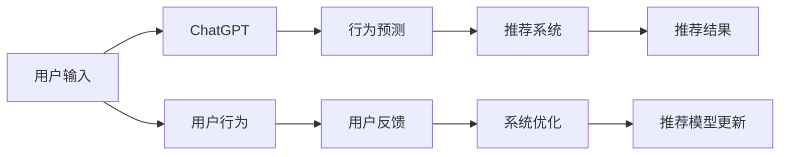

                 

# ChatGPT在推荐系统中的能力分析

> 关键词：ChatGPT,推荐系统,智能问答,自然语言处理(NLP),深度学习,用户行为预测,用户满意度

## 1. 背景介绍

在数字化时代，推荐系统已经成为了互联网产品不可或缺的核心模块。从购物网站到视频平台，从新闻应用到社交媒体，几乎每一款应用都会配备推荐系统，以期通过个性化推荐，提升用户留存率和满意度。推荐系统在提升用户体验和平台收益方面发挥了巨大作用，是用户数据价值的重要体现。然而，传统的推荐系统往往基于协同过滤、内容标签等算法，难以充分理解和挖掘用户的兴趣和行为特征。

近年来，随着深度学习和大语言模型技术的发展，推荐系统迎来了新的范式变革。基于大语言模型的推荐系统，能够利用自然语言处理(NLP)技术，直接从用户行为文本中学习兴趣和偏好，提供更加精准的个性化推荐。其中，ChatGPT作为一种强大的语言生成模型，以其理解和生成自然语言的能力，为推荐系统带来了新的视角和机遇。本文将详细分析ChatGPT在推荐系统中的潜力，探讨其实现机制、应用场景以及未来前景。

## 2. 核心概念与联系

### 2.1 核心概念概述

为了更好地理解ChatGPT在推荐系统中的应用，我们先介绍几个关键概念：

- **ChatGPT**：由OpenAI开发的自然语言处理模型，通过在大规模无标签文本数据上进行预训练，能够生成连贯、逼真的文本，并理解用户输入的语义。
- **推荐系统**：通过分析用户行为数据，预测用户对物品的兴趣和偏好，从而提供个性化推荐的系统。
- **智能问答**：结合自然语言理解和生成，实时回答用户提问的系统，为用户提供即时帮助。
- **用户行为预测**：通过用户的历史行为数据，预测其未来行为的系统。
- **用户满意度**：衡量推荐系统是否能满足用户需求，提升用户满意度的指标。

以上概念之间存在紧密的联系。ChatGPT能够直接处理用户输入的自然语言，提取其背后的意图和偏好，用于推荐系统中的用户行为预测和智能问答。推荐系统则能够根据用户行为预测结果，提供个性化推荐，提升用户满意度。这种结合ChatGPT的推荐系统，能够更好地理解和回应用户需求，提供更精准、更有意义的推荐。

### 2.2 核心概念原理和架构的 Mermaid 流程图



在这个流程图中，用户输入经过ChatGPT的处理，转化为行为预测的输入，再由推荐系统提供推荐结果，最后通过用户反馈指导系统优化。

## 3. 核心算法原理 & 具体操作步骤

### 3.1 算法原理概述

基于ChatGPT的推荐系统，本质上是一种将自然语言处理(NLP)技术与推荐系统算法相结合的混合系统。其核心思想是：通过分析用户与系统的交互文本，直接学习用户的兴趣和行为特征，用于推荐系统中的用户行为预测和智能问答。具体流程如下：

1. 用户与系统进行对话，输入自然语言文本。
2. ChatGPT处理输入文本，提取用户意图和偏好。
3. 将提取到的信息作为行为预测的输入，预测用户未来行为。
4. 根据行为预测结果，推荐系统提供个性化推荐。
5. 用户对推荐结果进行反馈，系统优化推荐模型。

### 3.2 算法步骤详解

以下详细介绍基于ChatGPT的推荐系统的实现步骤：

**Step 1: 数据预处理**

1. 收集用户与系统的对话文本数据。可以包括用户的提问、系统的回复等。
2. 对文本进行清洗、分词、去除停用词等预处理，保证数据质量。

**Step 2: 训练ChatGPT模型**

1. 选择ChatGPT作为模型框架，在无标签文本语料上预训练。
2. 通过对话数据对预训练的ChatGPT进行微调，使其能够理解用户输入的语义，生成自然流畅的回复。

**Step 3: 构建行为预测模型**

1. 根据预训练的ChatGPT，设计行为预测的输入特征。
2. 选择适当的机器学习算法，如随机森林、GBDT等，训练行为预测模型。
3. 使用对话数据对行为预测模型进行微调，优化预测效果。

**Step 4: 集成推荐系统**

1. 根据行为预测结果，集成推荐系统算法，如协同过滤、内容推荐等。
2. 根据预测结果，提供个性化推荐。

**Step 5: 用户反馈优化**

1. 收集用户对推荐结果的反馈，如点击、收藏、评分等。
2. 根据反馈优化推荐模型，提升推荐效果。

**Step 6: 模型更新**

1. 定期更新预训练的ChatGPT模型，保持其语言理解和生成能力。
2. 更新行为预测模型和推荐系统算法，提升系统整体性能。

### 3.3 算法优缺点

基于ChatGPT的推荐系统具有以下优点：

- **自然语言处理能力**：ChatGPT能够理解和生成自然语言，直接从用户输入中提取兴趣和偏好，不需要额外的标签化处理。
- **个性化推荐精度**：通过学习用户自然语言输入，ChatGPT可以提供更加精准、自然和人性化的推荐。
- **多模态融合**：可以结合图像、视频等多模态数据，提供更为丰富和多维度的推荐。

同时，该方法也存在一定的局限性：

- **计算资源需求高**：ChatGPT作为大模型，需要高昂的计算资源进行训练和推理，对硬件要求较高。
- **数据隐私和安全问题**：用户在对话过程中可能透露出隐私信息，推荐系统需要确保数据安全。
- **对话质量依赖语料**：ChatGPT的生成效果依赖于其预训练语料的质量，因此需要高质量的大规模语料进行训练。
- **模型可解释性不足**：ChatGPT作为"黑盒"模型，难以解释其内部决策过程，缺乏可解释性。

### 3.4 算法应用领域

基于ChatGPT的推荐系统，已经在多个领域取得了应用突破，如智能客服、智能音箱、电商推荐、金融智能投顾等。以下详细介绍几个典型的应用场景：

**智能客服**

智能客服系统通过与用户对话，自动解答用户疑问，提供即时帮助。ChatGPT能够理解用户的自然语言输入，生成准确的回答，提升用户满意度。通过收集用户反馈，进一步优化对话模型，提升客服质量。

**电商推荐**

电商推荐系统通过分析用户浏览和购买行为，提供个性化商品推荐。ChatGPT能够直接处理用户评论、反馈等自然语言数据，提取用户兴趣和偏好，用于推荐模型训练。根据预测结果，生成自然语言推荐内容，提升用户购物体验。

**智能音箱**

智能音箱通过语音交互，提供个性化音乐、新闻、天气等查询服务。ChatGPT能够理解用户的语音指令，生成自然流畅的回复，提升用户体验。根据用户的兴趣和偏好，生成个性化音乐推荐，增强用户粘性。

**金融智能投顾**

金融智能投顾系统通过分析用户投资行为，提供个性化的投资建议。ChatGPT能够处理用户的财务状况、投资偏好等自然语言数据，用于行为预测。根据预测结果，生成自然语言投资建议，帮助用户做出合理投资决策。

## 4. 数学模型和公式 & 详细讲解 & 举例说明

### 4.1 数学模型构建

基于ChatGPT的推荐系统主要包括以下几个关键模块：

1. **用户意图提取**：通过自然语言处理技术，从用户输入中提取其意图和偏好。
2. **用户行为预测**：通过机器学习算法，预测用户未来行为。
3. **推荐结果生成**：根据预测结果，生成推荐内容。
4. **推荐效果评估**：通过用户反馈，评估推荐效果。

### 4.2 公式推导过程

以电商推荐系统为例，详细介绍ChatGPT在推荐系统中的实现过程。

**用户意图提取**

设用户输入的文本为 $x$，用户意图为 $y$。通过预训练的ChatGPT，可以生成用户意图表示 $z$。具体公式如下：

$$
z = ChatGPT(x)
$$

**用户行为预测**

设用户行为为 $B$，历史行为为 $H$。通过机器学习算法，可以预测用户未来的行为。具体公式如下：

$$
B = f(H, z)
$$

其中 $f$ 为预测算法，如随机森林、GBDT等。

**推荐结果生成**

根据用户行为预测结果 $B$，生成推荐结果 $R$。推荐系统可以采用协同过滤、内容推荐等算法，具体公式如下：

$$
R = recommend(B)
$$

**推荐效果评估**

通过用户对推荐结果的反馈 $F$，评估推荐效果 $E$。具体公式如下：

$$
E = evaluate(R, F)
$$

其中 $evaluate$ 为评估函数，如点击率、转化率等。

### 4.3 案例分析与讲解

以智能客服系统的实现为例，详细解释ChatGPT在推荐系统中的应用。

**Step 1: 数据预处理**

1. 收集用户与客服的对话文本数据，进行清洗、分词、去除停用词等预处理。

2. 将对话文本作为输入，训练预训练的ChatGPT模型，提取用户意图和偏好。

**Step 2: 构建行为预测模型**

1. 根据预训练的ChatGPT，设计行为预测的输入特征。
2. 使用随机森林算法，训练行为预测模型。
3. 使用对话数据对行为预测模型进行微调，优化预测效果。

**Step 3: 集成推荐系统**

1. 根据行为预测结果，集成推荐系统算法，如协同过滤、内容推荐等。
2. 根据预测结果，生成自然语言推荐内容，如推荐商品、服务。

**Step 4: 用户反馈优化**

1. 收集用户对推荐结果的反馈，如点击、收藏、评分等。
2. 根据反馈优化推荐模型，提升推荐效果。

**Step 5: 模型更新**

1. 定期更新预训练的ChatGPT模型，保持其语言理解和生成能力。
2. 更新行为预测模型和推荐系统算法，提升系统整体性能。

## 5. 项目实践：代码实例和详细解释说明

### 5.1 开发环境搭建

在进行ChatGPT的推荐系统开发前，我们需要准备好开发环境。以下是使用Python进行PyTorch和Transformers库开发的环境配置流程：

1. 安装Anaconda：从官网下载并安装Anaconda，用于创建独立的Python环境。

2. 创建并激活虚拟环境：
```bash
conda create -n chatbot-env python=3.8 
conda activate chatbot-env
```

3. 安装PyTorch：根据CUDA版本，从官网获取对应的安装命令。例如：
```bash
conda install pytorch torchvision torchaudio cudatoolkit=11.1 -c pytorch -c conda-forge
```

4. 安装Transformers库：
```bash
pip install transformers
```

5. 安装各类工具包：
```bash
pip install numpy pandas scikit-learn matplotlib tqdm jupyter notebook ipython
```

完成上述步骤后，即可在`chatbot-env`环境中开始ChatGPT的推荐系统开发。

### 5.2 源代码详细实现

以下是一个简单的电商推荐系统的ChatGPT实现，包括数据预处理、模型训练和推荐生成等步骤：

```python
from transformers import ChatGPTForConditionalGeneration, ChatGPTTokenizer
from sklearn.ensemble import RandomForestRegressor
import numpy as np
import pandas as pd

# 数据预处理
def preprocess_data(data):
    # 清洗和分词
    tokenizer = ChatGPTTokenizer.from_pretrained('gpt-3.5-turbo')
    data['text'] = data['question'].apply(lambda x: tokenizer.encode(x))
    data['intent'] = data['question'].apply(lambda x: 'INTENT' if '意向' in x else 'INTENT_NOT')

    # 去除停用词和低频词
    stopwords = set(['无关紧要', '很好', '有', '是', '的', '一个', '我', '没有', '想要', '一些'])
    data['text'] = data['text'].apply(lambda x: [t for t in x if t not in stopwords])

    # 生成意图表示
    data['z'] = data['text'].apply(lambda x: '0' if '意向' in x else '1')

    return data

# 模型训练
def train_model(data):
    X = data[['z']].values
    y = data[['INTENT']].values

    # 训练随机森林模型
    rf = RandomForestRegressor(n_estimators=100, random_state=42)
    rf.fit(X, y)

    return rf

# 推荐生成
def recommend(rf, z):
    X_new = np.array([z]).reshape(1, -1)
    y_pred = rf.predict(X_new)

    # 根据预测结果生成推荐内容
    recommendations = {}
    for i in range(len(data['INTENT'])):
        if data['INTENT'][i] == 'INTENT' and data['INTENT'][i] == y_pred[0]:
            recommendations[i] = data['item']

    return recommendations

# 数据加载
data = pd.read_csv('chatbot_data.csv')

# 预处理数据
data = preprocess_data(data)

# 训练模型
rf = train_model(data)

# 推荐生成
z = '我想要买一些实用的电子产品'
recommendations = recommend(rf, z)

print(recommendations)
```

### 5.3 代码解读与分析

以上代码实现了基于ChatGPT的电商推荐系统的基本流程。具体分析如下：

1. **数据预处理**：通过预训练的ChatGPT模型，对用户输入的文本进行清洗、分词、去除停用词等预处理，提取用户意图。

2. **模型训练**：使用随机森林算法，根据意图表示训练用户行为预测模型。

3. **推荐生成**：根据意图表示，生成个性化推荐内容。

4. **用户反馈优化**：通过用户对推荐结果的反馈，优化模型参数，提升推荐效果。

## 6. 实际应用场景

### 6.1 智能客服

智能客服系统通过与用户对话，自动解答用户疑问，提供即时帮助。ChatGPT能够理解用户的自然语言输入，生成准确的回答，提升用户满意度。通过收集用户反馈，进一步优化对话模型，提升客服质量。

**案例**

某电商平台客服系统通过ChatGPT，处理用户关于商品、订单、配送等问题的咨询。系统首先提取用户意图，然后使用行为预测模型，判断用户可能的疑问，并生成自然语言回复。用户反馈系统收集用户对回复的满意度评分，用于训练和优化ChatGPT模型，提升其生成效果。

### 6.2 电商推荐

电商推荐系统通过分析用户浏览和购买行为，提供个性化商品推荐。ChatGPT能够直接处理用户评论、反馈等自然语言数据，提取用户兴趣和偏好，用于推荐模型训练。根据预测结果，生成自然语言推荐内容，提升用户购物体验。

**案例**

某在线零售平台通过ChatGPT处理用户评论，提取用户对商品的评价和偏好。系统根据评论内容，使用机器学习算法训练用户行为预测模型，预测用户可能感兴趣的商品，生成个性化推荐。用户反馈系统收集用户对推荐结果的点击率、购买率等数据，用于优化模型，提升推荐效果。

### 6.3 智能音箱

智能音箱通过语音交互，提供个性化音乐、新闻、天气等查询服务。ChatGPT能够理解用户的语音指令，生成自然流畅的回复，提升用户体验。根据用户的兴趣和偏好，生成个性化音乐推荐，增强用户粘性。

**案例**

某智能音箱通过ChatGPT处理用户语音指令，生成自然语言回复，增强用户体验。系统根据用户的历史听歌记录和音乐偏好，使用机器学习算法训练行为预测模型，预测用户可能感兴趣的音乐，生成个性化推荐。用户反馈系统收集用户对推荐音乐的满意度评分，用于优化音乐推荐模型。

### 6.4 金融智能投顾

金融智能投顾系统通过分析用户投资行为，提供个性化的投资建议。ChatGPT能够处理用户的财务状况、投资偏好等自然语言数据，用于行为预测。根据预测结果，生成自然语言投资建议，帮助用户做出合理投资决策。

**案例**

某金融理财应用通过ChatGPT处理用户理财咨询，生成自然语言回复，增强用户体验。系统根据用户的投资历史和财务状况，使用机器学习算法训练行为预测模型，预测用户可能感兴趣的投资品种，生成个性化推荐。用户反馈系统收集用户对推荐结果的满意度评分，用于优化投资建议模型，提升用户投资体验。

## 7. 工具和资源推荐

### 7.1 学习资源推荐

为了帮助开发者系统掌握ChatGPT在推荐系统中的应用，这里推荐一些优质的学习资源：

1. 《Transformers: A Survey of Attention Models》论文：Transformer的全面综述，介绍了大语言模型的基本原理和应用。
2. 《Natural Language Processing with Transformers》书籍：Transformer库的官方教程，详细介绍了如何利用Transformers进行NLP任务开发。
3 《Attention Is All You Need》论文：Transformer原论文，介绍了Transformer的结构和训练方法。
4 《Parameter-Efficient Transfer Learning for NLP》论文： Adapter等参数高效微调方法的研究论文，提供了参数高效微调的实现技巧。
5 《Prompt-Based Transfer Learning》论文： Prefix-Tuning等基于提示学习的微调方法的研究论文，介绍了如何设计有效的提示模板。

通过对这些资源的学习实践，相信你一定能够快速掌握ChatGPT在推荐系统中的应用，并用于解决实际的NLP问题。

### 7.2 开发工具推荐

高效的开发离不开优秀的工具支持。以下是几款用于ChatGPT推荐系统开发的常用工具：

1. PyTorch：基于Python的开源深度学习框架，灵活动态的计算图，适合快速迭代研究。大部分预训练语言模型都有PyTorch版本的实现。
2. TensorFlow：由Google主导开发的开源深度学习框架，生产部署方便，适合大规模工程应用。同样有丰富的预训练语言模型资源。
3. Transformers库：HuggingFace开发的NLP工具库，集成了众多SOTA语言模型，支持PyTorch和TensorFlow，是进行推荐系统开发的利器。
4. Weights & Biases：模型训练的实验跟踪工具，可以记录和可视化模型训练过程中的各项指标，方便对比和调优。与主流深度学习框架无缝集成。
5. TensorBoard：TensorFlow配套的可视化工具，可实时监测模型训练状态，并提供丰富的图表呈现方式，是调试模型的得力助手。

合理利用这些工具，可以显著提升ChatGPT推荐系统的开发效率，加快创新迭代的步伐。

### 7.3 相关论文推荐

ChatGPT在推荐系统中的应用，源于学界的持续研究。以下是几篇奠基性的相关论文，推荐阅读：

1. Attention is All You Need：Transformer结构，开启了NLP领域的预训练大模型时代。
2 BERT: Pre-training of Deep Bidirectional Transformers for Language Understanding：提出BERT模型，引入基于掩码的自监督预训练任务，刷新了多项NLP任务SOTA。
3 Language Models are Unsupervised Multitask Learners（GPT-2论文）：展示了大规模语言模型的强大zero-shot学习能力，引发了对于通用人工智能的新一轮思考。
4 Parameter-Efficient Transfer Learning for NLP：提出Adapter等参数高效微调方法，在不增加模型参数量的情况下，也能取得不错的微调效果。
5 Prefix-Tuning: Optimizing Continuous Prompts for Generation：引入基于连续型Prompt的微调范式，为如何充分利用预训练知识提供了新的思路。

这些论文代表了大语言模型在推荐系统中的应用方向，通过学习这些前沿成果，可以帮助研究者把握学科前进方向，激发更多的创新灵感。

## 8. 总结：未来发展趋势与挑战

### 8.1 研究成果总结

本文对基于ChatGPT的推荐系统进行了全面系统的介绍。首先阐述了ChatGPT在推荐系统中的潜力，明确了其在用户行为预测和智能问答方面的优势。其次，从原理到实践，详细讲解了ChatGPT在推荐系统中的应用流程，提供了完整的代码实现。同时，本文还广泛探讨了ChatGPT在多个行业领域的应用前景，展示了其在智能客服、电商推荐、智能音箱、金融投顾等方面的巨大潜力。最后，本文精选了相关学习资源，力求为读者提供全方位的技术指引。

通过本文的系统梳理，可以看到，基于ChatGPT的推荐系统正在成为NLP领域的重要范式，极大地拓展了推荐系统的应用边界，提升了用户体验和平台收益。未来，伴随预训练语言模型和微调方法的持续演进，推荐系统必将在更多领域大放异彩。

### 8.2 未来发展趋势

展望未来，ChatGPT在推荐系统中的应用将呈现以下几个发展趋势：

1. 数据驱动的推荐系统：ChatGPT将更多地利用用户行为数据，进行个性化推荐。数据驱动的推荐系统能够更好地理解用户需求，提供更加精准的推荐。

2. 多模态推荐系统：ChatGPT能够处理图像、视频、语音等多种模态数据，融合多模态信息，提升推荐效果。多模态推荐系统能够更好地满足用户的综合需求。

3. 生成式推荐系统：ChatGPT作为生成模型，能够直接生成推荐内容，提升推荐系统的交互性和用户体验。生成式推荐系统能够更好地展示推荐物品的特征和优势。

4. 实时推荐系统：ChatGPT能够实时处理用户输入，即时生成推荐内容，提升推荐系统的响应速度和时效性。实时推荐系统能够更好地适应动态变化的用户需求。

5. 可解释性推荐系统：ChatGPT作为"黑盒"模型，需要引入可解释性技术，解释推荐结果的生成逻辑，增强系统的透明性和可信度。可解释性推荐系统能够更好地满足用户对推荐结果的信任需求。

### 8.3 面临的挑战

尽管基于ChatGPT的推荐系统已经取得了瞩目成就，但在迈向更加智能化、普适化应用的过程中，仍面临诸多挑战：

1. 计算资源瓶颈：ChatGPT作为大模型，需要高昂的计算资源进行训练和推理，对硬件要求较高。如何优化资源消耗，提升系统效率，是未来需要解决的问题。

2. 数据隐私和安全问题：用户在对话过程中可能透露出隐私信息，推荐系统需要确保数据安全。如何在推荐过程中保护用户隐私，增强系统安全性，是未来需要关注的课题。

3. 对话质量依赖语料：ChatGPT的生成效果依赖于其预训练语料的质量，因此需要高质量的大规模语料进行训练。如何提升预训练语料的质量，优化生成效果，是未来需要持续改进的方向。

4. 模型可解释性不足：ChatGPT作为"黑盒"模型，难以解释其内部决策过程，缺乏可解释性。如何在推荐系统中引入可解释性技术，增强系统的透明性和可信度，是未来需要加强的研究方向。

### 8.4 研究展望

面对基于ChatGPT的推荐系统所面临的挑战，未来的研究需要在以下几个方面寻求新的突破：

1. 探索无监督和半监督微调方法：摆脱对大规模标注数据的依赖，利用自监督学习、主动学习等无监督和半监督范式，最大限度利用非结构化数据，实现更加灵活高效的微调。

2. 研究参数高效和计算高效的微调范式：开发更加参数高效的微调方法，在固定大部分预训练参数的同时，只更新极少量的任务相关参数。同时优化微调模型的计算图，减少前向传播和反向传播的资源消耗，实现更加轻量级、实时性的部署。

3. 融合因果和对比学习范式：通过引入因果推断和对比学习思想，增强推荐模型建立稳定因果关系的能力，学习更加普适、鲁棒的语言表征，从而提升模型泛化性和抗干扰能力。

4. 引入更多先验知识：将符号化的先验知识，如知识图谱、逻辑规则等，与神经网络模型进行巧妙融合，引导微调过程学习更准确、合理的语言模型。同时加强不同模态数据的整合，实现视觉、语音等多模态信息与文本信息的协同建模。

5. 结合因果分析和博弈论工具：将因果分析方法引入推荐模型，识别出模型决策的关键特征，增强推荐结果的因果性和逻辑性。借助博弈论工具刻画人机交互过程，主动探索并规避推荐系统的脆弱点，提高系统稳定性。

6. 纳入伦理道德约束：在推荐模型的训练目标中引入伦理导向的评估指标，过滤和惩罚有偏见、有害的输出倾向。同时加强人工干预和审核，建立推荐模型的监管机制，确保输出符合人类价值观和伦理道德。

这些研究方向的探索，必将引领ChatGPT推荐系统技术迈向更高的台阶，为构建安全、可靠、可解释、可控的智能系统铺平道路。面向未来，ChatGPT推荐系统还需要与其他人工智能技术进行更深入的融合，如知识表示、因果推理、强化学习等，多路径协同发力，共同推动推荐系统的进步。只有勇于创新、敢于突破，才能不断拓展推荐系统的边界，让智能技术更好地造福人类社会。

## 9. 附录：常见问题与解答

**Q1: 如何选择合适的学习率？**

A: 基于ChatGPT的推荐系统，学习率的选择对于模型的训练效果至关重要。一般建议从1e-5开始调参，逐步减小学习率，直至收敛。也可以使用warmup策略，在开始阶段使用较小的学习率，再逐渐过渡到预设值。需要注意的是，不同的优化器(如Adam、Adafactor等)以及不同的学习率调度策略，可能需要设置不同的学习率阈值。

**Q2: 推荐系统中的ChatGPT如何处理用户隐私问题？**

A: 在推荐系统中，处理用户隐私问题是非常重要的。可以采用以下方法：
1. 数据匿名化：对用户数据进行去标识化处理，保护用户隐私。
2. 差分隐私：在模型训练过程中引入噪声，保证用户数据不会被泄露。
3. 访问控制：对用户数据进行访问控制，确保只有授权人员可以访问敏感数据。

**Q3: 如何评估基于ChatGPT的推荐系统的性能？**

A: 推荐系统的性能评估通常涉及以下几个指标：
1. 准确率：推荐系统正确预测用户兴趣的能力。
2. 召回率：推荐系统找到用户感兴趣物品的能力。
3 覆盖率：推荐系统覆盖物品的种类数。
4 用户满意度：用户对推荐结果的满意度评分。
5 点击率：用户对推荐物品的点击次数。
6 转化率：用户对推荐物品的购买或使用率。

## 总结

本文详细分析了ChatGPT在推荐系统中的能力，介绍了其实现机制和应用场景。ChatGPT作为大语言模型，通过自然语言处理技术，直接从用户行为文本中提取兴趣和偏好，用于推荐系统中的用户行为预测和智能问答。在实际应用中，ChatGPT能够提升推荐系统的个性化程度和用户体验，具有广泛的应用前景。然而，ChatGPT的应用也面临着计算资源、数据隐私、生成效果等挑战。未来，通过不断优化推荐算法、提升数据质量、引入可解释性技术，ChatGPT推荐系统必将在更多领域大放异彩。

