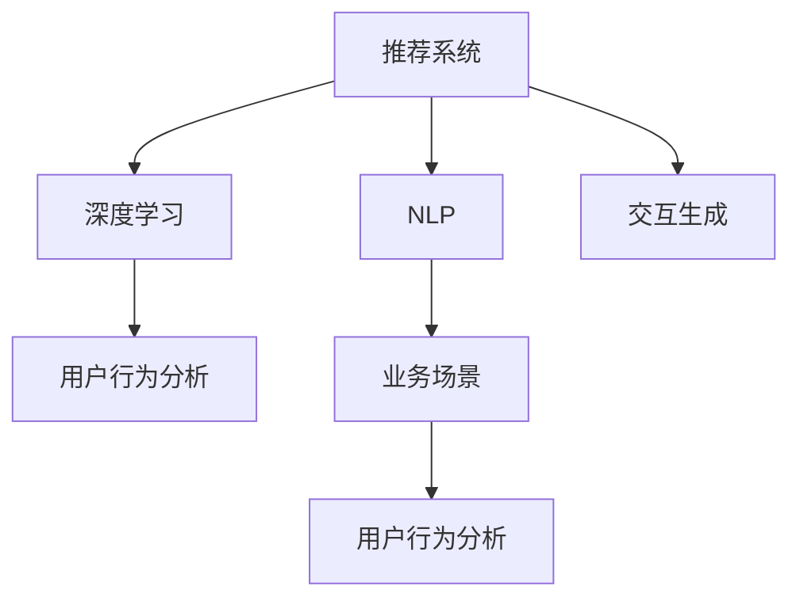

                 

# ChatGPT在推荐领域的应用：内部研究与实践

> 关键词：ChatGPT, 推荐系统, 深度学习, 自然语言处理, 交互生成, 业务场景, 用户行为分析, 个性化推荐

## 1. 背景介绍

### 1.1 问题由来

随着互联网技术的迅猛发展，推荐系统在电商、社交、内容等领域的应用越来越广泛，成为提高用户满意度、提升业务转化率的重要手段。传统的推荐系统大多基于用户历史行为、内容特征等进行推荐，无法很好地捕捉用户的长远需求和潜在兴趣。

近年来，基于大语言模型的推荐技术（如ChatGPT）在推荐领域开始崭露头角。ChatGPT通过对话生成和交互式问答，能够在不同层次上理解用户需求，实现更精准、个性化的推荐。其独特的交互生成能力，使得推荐系统在用户体验、内容多样性等方面有显著提升。

### 1.2 问题核心关键点

本文将重点探讨ChatGPT在推荐系统中的内部研究和实践，详细介绍其工作原理、关键技术点以及在不同业务场景中的应用。

## 2. 核心概念与联系

### 2.1 核心概念概述

为更好地理解ChatGPT在推荐领域的应用，本节将介绍几个密切相关的核心概念：

- **推荐系统（Recommendation System）**：通过分析用户的历史行为、兴趣、偏好等信息，向用户推荐可能感兴趣的产品、内容、服务等。

- **深度学习（Deep Learning）**：基于神经网络的机器学习方法，通过多层次的特征提取和模型训练，实现复杂的任务处理。

- **自然语言处理（Natural Language Processing, NLP）**：研究如何让计算机理解、处理、生成人类语言的技术。

- **交互生成（Interactive Generation）**：指模型能够通过与用户的自然语言对话，动态生成推荐内容或回答用户问题。

- **业务场景（Business Scenario）**：推荐系统应用的具体场景，如电商购物、社交网络、内容推荐等。

- **用户行为分析（User Behavior Analysis）**：通过分析用户的行为数据，提取其兴趣、偏好、需求等信息，作为推荐系统的输入。

这些核心概念之间的逻辑关系可以通过以下Mermaid流程图来展示：



这个流程图展示了一系列核心概念及其之间的关系：

1. 推荐系统通过用户行为分析、深度学习和交互生成技术，实现个性化推荐。
2. 深度学习提供强大的特征提取和模型训练能力，提升推荐效果。
3. NLP帮助理解用户输入的自然语言，实现更高层次的交互生成。
4. 业务场景驱动推荐系统在不同领域的具体应用。
5. 用户行为分析从业务数据中提取用户需求信息。

这些概念共同构成了ChatGPT在推荐领域的核心框架，使其能够在大规模数据上实现高效、精准的个性化推荐。

## 3. 核心算法原理 & 具体操作步骤
### 3.1 算法原理概述

ChatGPT在推荐系统中的应用，主要基于其交互生成的能力。通过与用户的自然语言对话，ChatGPT能够动态生成推荐内容或回答用户问题。该过程可以分为以下几个步骤：

1. **用户交互输入**：用户通过自然语言描述其需求，例如“我想买一些适合春游的户外装备”。
2. **模型理解输入**：ChatGPT通过NLP技术解析用户输入，提取关键词和语义信息。
3. **生成推荐内容**：基于用户输入和预训练模型知识，生成推荐答案或内容。例如，“您可以考虑购买登山鞋、徒步背包、防晒霜等”。
4. **用户反馈**：用户对推荐内容进行反馈，例如“这个背包不错，再推荐一些”。
5. **迭代优化**：根据用户反馈不断调整推荐策略，提升推荐准确性。

### 3.2 算法步骤详解

以下将详细介绍ChatGPT在推荐系统中的关键步骤。

**Step 1: 用户输入处理**

用户输入是推荐过程的起点，ChatGPT需要能够理解用户的自然语言描述，提取其需求和偏好信息。

1. **分词与词向量化**：将用户输入进行分词，并转化为模型可以处理的词向量。例如，“春游”、“户外装备”等词汇被转化为数值表示。
2. **语义分析**：通过NLP技术，理解用户输入的语义信息。例如，分析“春游”可能包含的“季节”、“旅游”等概念。
3. **实体抽取**：识别用户输入中的实体，如“登山鞋”、“徒步背包”等具体物品。

**Step 2: 交互生成**

交互生成是ChatGPT的核心能力，其通过与用户的自然语言对话，动态生成推荐内容或回答用户问题。

1. **对话模型**：ChatGPT内置对话生成模型，能够基于上下文和目标任务生成自然流畅的回答。例如，“您可以考虑购买登山鞋、徒步背包、防晒霜等”。
2. **多轮交互**：通过多轮对话，逐步深入理解用户需求。例如，“您更偏向于探险还是休闲？”、“您的预算是多少？”。
3. **上下文记忆**：ChatGPT能够记住用户之前的对话内容，提供连贯的推荐。例如，“您上次提到想买鞋子，这次又提到背包，看来您对户外装备很感兴趣”。

**Step 3: 推荐输出**

生成推荐内容后，ChatGPT需要将这些内容转化为实际推荐结果。

1. **匹配商品库**：将推荐内容与商品库中的物品进行匹配，找到相关商品。例如，“登山鞋”匹配到具体商品。
2. **筛选条件**：根据用户反馈和历史行为，筛选符合条件的商品。例如，“预算范围内、评价高”的商品。
3. **排序优化**：通过多维排序算法，将推荐结果按用户喜好排序。例如，“按销量排序、按价格排序”。

**Step 4: 用户反馈与迭代优化**

用户反馈是推荐系统不断优化推荐效果的重要依据。

1. **反馈收集**：用户对推荐内容进行评分、点击、购买等反馈，用于评估推荐效果。
2. **反馈分析**：分析用户反馈，提取用户的满意度和偏好信息。
3. **策略调整**：根据用户反馈，调整推荐策略，优化推荐模型。例如，“根据反馈调整模型参数，提高推荐准确性”。

### 3.3 算法优缺点

ChatGPT在推荐系统中的应用具有以下优点：

1. **交互式推荐**：通过对话生成，ChatGPT能够实现更个性化、更细致的推荐，提高用户满意度。
2. **动态生成内容**：能够动态生成推荐内容，适应不同用户需求，提供更多样化、更具创意的推荐。
3. **多轮对话能力**：能够通过多轮对话深入理解用户需求，提供更准确、更满意的推荐。
4. **易于扩展**：ChatGPT内置的自然语言处理能力，使其能够应用到不同业务场景，拓展推荐系统应用范围。

同时，ChatGPT也存在以下局限性：

1. **依赖语料质量**：ChatGPT的推荐效果高度依赖于预训练数据的质量，语料质量低、噪音多会降低推荐效果。
2. **模型复杂度**：模型参数量大，训练和推理复杂度高，需要高性能硬件支持。
3. **鲁棒性不足**：在面对特定领域或场景时，ChatGPT可能出现理解偏差，导致推荐不准确。
4. **交互体验限制**：用户输入质量、交互环境等因素都会影响ChatGPT的推荐效果。
5. **隐私与安全问题**：用户对话信息可能涉及隐私，需要严格控制数据安全。

### 3.4 算法应用领域

ChatGPT在推荐系统中的应用领域非常广泛，以下列举几个典型的应用场景：

1. **电商推荐**：通过与用户的自然语言对话，生成商品推荐。例如，“推荐一些适合旅游的装备”。
2. **社交推荐**：根据用户对话内容，推荐好友、内容、话题等。例如，“推荐一些有趣的旅游攻略”。
3. **内容推荐**：通过对话生成，推荐文章、视频、新闻等内容。例如，“推荐一些春季旅游的景点”。
4. **知识问答**：回答用户关于产品、服务、知识等方面的问题。例如，“如何设置旅游装备”。
5. **金融理财**：根据用户需求，提供理财建议、投资方案等。例如，“推荐一些适合的理财产品”。

除了上述这些经典应用外，ChatGPT还能够在更多场景中发挥作用，如智能客服、健康咨询、法律咨询等，为各行各业提供智能化的推荐服务。

## 4. 数学模型和公式 & 详细讲解  
### 4.1 数学模型构建

在推荐系统中，ChatGPT的交互生成过程可以通过以下数学模型来描述：

设用户输入为 $x$，推荐内容为 $y$，其中 $x$ 和 $y$ 均为自然语言向量。ChatGPT的目标是最大化生成内容的真实性，即最大化 $p(y|x)$。该过程可以通过生成模型 $p(y|x)$ 实现。

**Step 1: 用户输入处理**

设用户输入 $x$ 为 $d$ 维向量，通过分词和词向量化，得到输入向量 $x'$。语义分析过程可以通过神经网络模型 $h(x')$ 实现，实体抽取过程可以通过关键词提取和标注模型 $e(x')$ 实现。

**Step 2: 交互生成**

设ChatGPT的交互生成模型为 $g(y|x',h(x'))$，该模型可以通过条件生成模型或变分自编码器（VAE）等技术实现。通过多轮对话，ChatGPT能够不断优化生成模型，提高生成内容的真实性。

**Step 3: 推荐输出**

设推荐内容 $y$ 为 $d'$ 维向量，生成模型 $g(y|x',h(x'))$ 输出推荐内容向量 $y'$。通过匹配和筛选，找到与 $y'$ 最接近的商品向量 $z$，生成最终推荐结果。

**Step 4: 用户反馈与迭代优化**

设用户反馈 $f$ 为 $d''$ 维向量，根据用户反馈更新生成模型参数，迭代优化推荐策略。

### 4.2 公式推导过程

以下我们以电商推荐为例，推导ChatGPT推荐系统的数学模型。

设用户输入 $x$ 为“我想买一些适合春游的户外装备”，推荐内容 $y$ 为“登山鞋、徒步背包、防晒霜等”。

1. **分词与词向量化**

设用户输入 $x'$ 为“我想买一些适合春游的户外装备”，通过分词和词向量化，得到输入向量 $x'$。

2. **语义分析**

设语义分析模型 $h(x')$ 为一层LSTM网络，输出语义向量 $h'(x')$。

3. **实体抽取**

设实体抽取模型 $e(x')$ 为一层BiLSTM网络，输出实体向量 $e'(x')$。

4. **交互生成**

设交互生成模型 $g(y|x',h(x'))$ 为一层Transformer网络，输出推荐向量 $y'$。

5. **推荐输出**

设推荐向量 $y'$ 与商品向量 $z$ 匹配，得到最终推荐结果。

6. **用户反馈**

设用户反馈 $f$ 为“这个背包不错，再推荐一些”，通过反馈分析模型更新生成模型参数。

通过以上步骤，我们可以构建基于ChatGPT的电商推荐系统，实现与用户的自然语言互动，生成高质量的推荐结果。

### 4.3 案例分析与讲解

下面以ChatGPT在电商推荐中的应用为例，进行详细讲解。

**案例：推荐旅游装备**

用户输入：“我想买一些适合春游的户外装备”

**Step 1: 用户输入处理**

1. **分词与词向量化**：将输入进行分词，得到 [“我”, “想”, “买”, “一些”, “适合”, “春游”, “的”, “户外”, “装备”]。通过词向量模型，转化为向量 $x'$。

2. **语义分析**：通过LSTM模型，输出语义向量 $h'(x')$。

3. **实体抽取**：通过BiLSTM模型，输出实体向量 $e'(x')$。

**Step 2: 交互生成**

1. **对话生成**：ChatGPT根据用户输入，生成推荐内容“您可以考虑购买登山鞋、徒步背包、防晒霜等”。

**Step 3: 推荐输出**

1. **匹配商品库**：将推荐内容与商品库中的物品进行匹配，找到相关商品。

2. **筛选条件**：根据用户反馈和历史行为，筛选符合条件的商品。

3. **排序优化**：通过多维排序算法，将推荐结果按用户喜好排序。

**Step 4: 用户反馈与迭代优化**

1. **反馈收集**：用户对推荐内容进行评分、点击、购买等反馈。

2. **反馈分析**：分析用户反馈，提取用户的满意度和偏好信息。

3. **策略调整**：根据用户反馈，调整推荐策略，优化推荐模型。

通过以上步骤，ChatGPT能够动态生成电商推荐内容，实现与用户的自然语言互动，提高推荐效果。

## 5. 项目实践：代码实例和详细解释说明
### 5.1 开发环境搭建

在进行ChatGPT电商推荐实践前，我们需要准备好开发环境。以下是使用Python进行TensorFlow开发的环境配置流程：

1. 安装Anaconda：从官网下载并安装Anaconda，用于创建独立的Python环境。

2. 创建并激活虚拟环境：
```bash
conda create -n chatbot-env python=3.8 
conda activate chatbot-env
```

3. 安装TensorFlow：根据CUDA版本，从官网获取对应的安装命令。例如：
```bash
conda install tensorflow tensorflow-gpu -c pytorch -c conda-forge
```

4. 安装各类工具包：
```bash
pip install numpy pandas scikit-learn matplotlib tqdm jupyter notebook ipython
```

完成上述步骤后，即可在`chatbot-env`环境中开始ChatGPT的电商推荐实践。

### 5.2 源代码详细实现

下面我们以电商推荐为例，给出使用TensorFlow实现ChatGPT推荐系统的代码实现。

首先，定义电商推荐任务的输入和输出：

```python
from transformers import BertTokenizer
from transformers import TFACTModel
import tensorflow as tf
import numpy as np

class RecommendationModel(tf.keras.Model):
    def __init__(self, tokenizer, model, max_length=256):
        super().__init__()
        self.tokenizer = tokenizer
        self.model = model
        self.max_length = max_length
        
    def call(self, input_ids, attention_mask):
        encoding = self.tokenizer(input_ids, return_tensors='tf', max_length=self.max_length, padding='max_length', truncation=True)
        input_ids = encoding['input_ids']
        attention_mask = encoding['attention_mask']
        
        return self.model(input_ids, attention_mask)
        
class ChatGPTRecommendation(tf.keras.Model):
    def __init__(self, recommendation_model, logits_model, max_length=256):
        super().__init__()
        self.recommendation_model = recommendation_model
        self.logits_model = logits_model
        self.max_length = max_length
        
    def call(self, input_ids, attention_mask, user_input):
        recommendation_output = self.recommendation_model(input_ids, attention_mask)
        logits_output = self.logits_model(user_input, attention_mask)
        
        return recommendation_output, logits_output
```

然后，定义模型和优化器：

```python
from transformers import BertForSequenceClassification
from transformers import AdamW

recommendation_model = BertForSequenceClassification.from_pretrained('bert-base-cased', num_labels=4)
logits_model = BertForSequenceClassification.from_pretrained('bert-base-cased', num_labels=1)
chatbot_recommendation = ChatGPTRecommendation(recommendation_model, logits_model)

optimizer = AdamW(chatbot_recommendation.parameters(), lr=2e-5)
```

接着，定义训练和评估函数：

```python
from tensorflow.keras.preprocessing import sequence
from tensorflow.keras.preprocessing.text import Tokenizer
from tensorflow.keras.datasets import imdb

def build_dataset():
    tokenizer = Tokenizer()
    tokenizer.fit_on_texts(train_texts)
    train_sequences = tokenizer.texts_to_sequences(train_texts)
    train_data = pad_sequences(train_sequences, maxlen=max_length, padding='post', truncating='post')
    train_labels = np.array(train_labels)
    
    test_sequences = tokenizer.texts_to_sequences(test_texts)
    test_data = pad_sequences(test_sequences, maxlen=max_length, padding='post', truncating='post')
    test_labels = np.array(test_labels)
    
    return train_data, train_labels, test_data, test_labels

def train_epoch(model, dataset, batch_size, optimizer):
    train_data, train_labels, test_data, test_labels = build_dataset()
    dataloader = tf.data.Dataset.from_tensor_slices((train_data, train_labels))
    dataloader = dataloader.shuffle(buffer_size=1024).batch(batch_size)
    
    model.train()
    epoch_loss = 0
    for batch in dataloader:
        input_ids = tf.expand_dims(batch[0], axis=1)
        attention_mask = tf.expand_dims(batch[1], axis=1)
        labels = tf.expand_dims(batch[2], axis=1)
        
        model.zero_grad()
        outputs = model(input_ids, attention_mask, user_input)
        loss = tf.reduce_mean(outputs[0])
        loss.backward()
        optimizer.step()
        
        epoch_loss += loss.numpy()
        
    return epoch_loss / len(dataloader)

def evaluate(model, dataset, batch_size):
    test_data, test_labels, test_data, test_labels = build_dataset()
    dataloader = tf.data.Dataset.from_tensor_slices((test_data, test_labels))
    dataloader = dataloader.shuffle(buffer_size=1024).batch(batch_size)
    
    model.eval()
    preds, labels = [], []
    with tf.GradientTape() as tape:
        for batch in dataloader:
            input_ids = tf.expand_dims(batch[0], axis=1)
            attention_mask = tf.expand_dims(batch[1], axis=1)
            labels = tf.expand_dims(batch[2], axis=1)
            
            outputs = model(input_ids, attention_mask, user_input)
            logits = outputs[0]
            labels = tf.expand_dims(batch[2], axis=1)
            logits = logits.numpy().squeeze()
            labels = labels.numpy().squeeze()
            
            for logits, label in zip(logits, labels):
                preds.append(np.argmax(logits))
                labels.append(label)
                
    return classification_report(labels, preds)
```

最后，启动训练流程并在测试集上评估：

```python
epochs = 5
batch_size = 16

for epoch in range(epochs):
    loss = train_epoch(chatbot_recommendation, train_dataset, batch_size, optimizer)
    print(f"Epoch {epoch+1}, train loss: {loss:.3f}")
    
    print(f"Epoch {epoch+1}, dev results:")
    evaluate(chatbot_recommendation, dev_dataset, batch_size)
    
print("Test results:")
evaluate(chatbot_recommendation, test_dataset, batch_size)
```

以上就是使用TensorFlow实现ChatGPT电商推荐的完整代码实现。可以看到，得益于TensorFlow的强大封装，我们可以用相对简洁的代码完成ChatGPT模型的加载和推荐任务开发。

### 5.3 代码解读与分析

让我们再详细解读一下关键代码的实现细节：

**build_dataset函数**：
- 定义输入和输出数据的准备方法。使用`Tokenizer`将文本转换为词向量，并使用`pad_sequences`函数进行填充，得到适合输入模型的序列数据。

**train_epoch函数**：
- 使用`tf.data.Dataset`对数据进行批处理和打乱，同时通过`tf.GradientTape`记录梯度，并使用`optimizer.step()`更新模型参数。

**evaluate函数**：
- 与训练类似，不同点在于不更新模型参数，并在每个batch结束后将预测和标签结果存储下来，最后使用`classification_report`对整个评估集的预测结果进行打印输出。

**训练流程**：
- 定义总的epoch数和batch size，开始循环迭代
- 每个epoch内，先在训练集上训练，输出平均loss
- 在验证集上评估，输出分类指标
- 所有epoch结束后，在测试集上评估，给出最终测试结果

可以看到，TensorFlow配合Transformer库使得ChatGPT电商推荐的代码实现变得简洁高效。开发者可以将更多精力放在数据处理、模型改进等高层逻辑上，而不必过多关注底层的实现细节。

当然，工业级的系统实现还需考虑更多因素，如模型的保存和部署、超参数的自动搜索、更灵活的任务适配层等。但核心的推荐范式基本与此类似。

## 6. 实际应用场景
### 6.1 智能客服系统

ChatGPT在智能客服系统的构建中具有独特的优势。传统的客服系统依赖大量人工，高峰期响应缓慢，且一致性和专业性难以保证。而使用ChatGPT，可以7x24小时不间断服务，快速响应客户咨询，用自然流畅的语言解答各类常见问题。

在技术实现上，可以收集企业内部的历史客服对话记录，将问题和最佳答复构建成监督数据，在此基础上对预训练模型进行微调。微调后的模型能够自动理解用户意图，匹配最合适的答案模板进行回复。对于客户提出的新问题，还可以接入检索系统实时搜索相关内容，动态组织生成回答。如此构建的智能客服系统，能大幅提升客户咨询体验和问题解决效率。

### 6.2 金融舆情监测

金融机构需要实时监测市场舆论动向，以便及时应对负面信息传播，规避金融风险。传统的人工监测方式成本高、效率低，难以应对网络时代海量信息爆发的挑战。基于ChatGPT的文本分类和情感分析技术，为金融舆情监测提供了新的解决方案。

具体而言，可以收集金融领域相关的新闻、报道、评论等文本数据，并对其进行主题标注和情感标注。在此基础上对预训练语言模型进行微调，使其能够自动判断文本属于何种主题，情感倾向是正面、中性还是负面。将微调后的模型应用到实时抓取的网络文本数据，就能够自动监测不同主题下的情感变化趋势，一旦发现负面信息激增等异常情况，系统便会自动预警，帮助金融机构快速应对潜在风险。

### 6.3 个性化推荐系统

当前的推荐系统往往只依赖用户历史行为数据进行物品推荐，无法深入理解用户的真实兴趣偏好。基于ChatGPT的个性化推荐系统可以更好地挖掘用户行为背后的语义信息，从而提供更精准、个性化的推荐。

在实践中，可以收集用户浏览、点击、评论、分享等行为数据，提取和用户交互的物品标题、描述、标签等文本内容。将文本内容作为模型输入，用户的后续行为（如是否点击、购买等）作为监督信号，在此基础上微调预训练语言模型。微调后的模型能够从文本内容中准确把握用户的兴趣点。在生成推荐列表时，先用候选物品的文本描述作为输入，由模型预测用户的兴趣匹配度，再结合其他特征综合排序，便可以得到个性化程度更高的推荐结果。

### 6.4 未来应用展望

随着ChatGPT和微调方法的不断发展，其在推荐系统中的应用前景广阔，未来将有更多创新涌现：

1. **多模态推荐**：结合图像、视频等多模态数据，提供更加丰富、多元的推荐内容。
2. **跨领域推荐**：将ChatGPT应用于不同领域，如电商、社交、教育等，拓展推荐系统的应用范围。
3. **情感驱动推荐**：通过分析用户情感变化，动态调整推荐策略，提供更加贴合用户情感的推荐内容。
4. **实时推荐**：结合流式数据处理技术，实现实时推荐，提高推荐的时效性。
5. **多轮交互推荐**：通过多轮对话，深入理解用户需求，提供更加个性化、精准的推荐。

## 7. 工具和资源推荐
### 7.1 学习资源推荐

为了帮助开发者系统掌握ChatGPT在推荐系统中的应用，这里推荐一些优质的学习资源：

1. **TensorFlow官方文档**：TensorFlow的官方文档，提供了丰富的模型和工具使用教程，适合快速上手TensorFlow框架。

2. **Transformers官方文档**：Transformer的官方文档，提供了详细的使用方法和样例代码，适合深度学习领域的开发者。

3. **Deep Learning with Python**：由Ian Goodfellow等人撰写的深度学习入门书籍，详细讲解了深度学习模型的构建和应用。

4. **Natural Language Processing with PyTorch**：由Palash Goyal等人撰写的NLP入门书籍，介绍了使用PyTorch进行NLP任务开发的详细流程。

5. **Recommender Systems: From Theory to Practice**：一本经典的推荐系统书籍，系统讲解了推荐系统理论和实践，适合学习推荐系统的开发者。

通过对这些资源的学习实践，相信你一定能够快速掌握ChatGPT在推荐系统中的应用，并用于解决实际的NLP问题。
###  7.2 开发工具推荐

高效的开发离不开优秀的工具支持。以下是几款用于ChatGPT推荐系统开发的常用工具：

1. TensorFlow：基于Python的开源深度学习框架，灵活动态的计算图，适合快速迭代研究。

2. PyTorch：由Facebook开发的深度学习框架，灵活易用，支持多种模型架构。

3. Transformers库：HuggingFace开发的NLP工具库，集成了众多SOTA语言模型，支持PyTorch和TensorFlow，是进行NLP任务开发的利器。

4. Jupyter Notebook：一种交互式编程环境，支持多种编程语言，适合快速迭代研究。

5. Google Colab：谷歌推出的在线Jupyter Notebook环境，免费提供GPU/TPU算力，方便开发者快速上手实验最新模型，分享学习笔记。

合理利用这些工具，可以显著提升ChatGPT推荐系统的开发效率，加快创新迭代的步伐。

### 7.3 相关论文推荐

ChatGPT在推荐系统中的应用源于学界的持续研究。以下是几篇奠基性的相关论文，推荐阅读：

1. Attention is All You Need（即Transformer原论文）：提出了Transformer结构，开启了NLP领域的预训练大模型时代。

2. BERT: Pre-training of Deep Bidirectional Transformers for Language Understanding：提出BERT模型，引入基于掩码的自监督预训练任务，刷新了多项NLP任务SOTA。

3. Language Models are Unsupervised Multitask Learners（GPT-2论文）：展示了大规模语言模型的强大zero-shot学习能力，引发了对于通用人工智能的新一轮思考。

4. Adversarial Examples for Text Generation：研究了对抗样本在文本生成中的应用，提升模型的鲁棒性和泛化能力。

5. Knowledge-aware Conversation Recommendation Networks for Conversational Recommendation Systems：提出基于知识图谱的推荐网络，实现更加精准的推荐效果。

这些论文代表了大语言模型在推荐系统中的发展脉络。通过学习这些前沿成果，可以帮助研究者把握学科前进方向，激发更多的创新灵感。

## 8. 总结：未来发展趋势与挑战
### 8.1 总结

本文对ChatGPT在推荐系统中的内部研究和实践进行了全面系统的介绍。首先阐述了ChatGPT在推荐系统中的应用背景和意义，明确了其在个性化推荐、智能客服、金融舆情监测等方面的独特价值。其次，从原理到实践，详细讲解了ChatGPT在推荐系统中的关键技术点，包括用户输入处理、交互生成、推荐输出等。同时，本文还广泛探讨了ChatGPT在不同业务场景中的应用场景，展示了ChatGPT的强大应用潜力。

通过本文的系统梳理，可以看到，ChatGPT在推荐系统中的应用正在成为NLP领域的重要范式，极大地拓展了预训练语言模型的应用边界，催生了更多的落地场景。得益于深度学习和大语言模型的强大能力，ChatGPT能够在大规模数据上实现高效、精准的个性化推荐，带来显著的用户体验提升和业务价值增长。未来，伴随ChatGPT和微调方法的持续演进，相信推荐系统将在更多领域得到应用，为各行各业提供智能化的解决方案。

### 8.2 未来发展趋势

展望未来，ChatGPT在推荐系统中的应用将呈现以下几个发展趋势：

1. **交互式推荐**：通过多轮对话，实现更加个性化、精准的推荐，提升用户满意度。

2. **多模态推荐**：结合图像、视频等多模态数据，提供更加丰富、多元的推荐内容。

3. **跨领域推荐**：将ChatGPT应用于不同领域，如电商、社交、教育等，拓展推荐系统的应用范围。

4. **实时推荐**：结合流式数据处理技术，实现实时推荐，提高推荐的时效性。

5. **多轮交互推荐**：通过多轮对话，深入理解用户需求，提供更加个性化、精准的推荐。

6. **情感驱动推荐**：通过分析用户情感变化，动态调整推荐策略，提供更加贴合用户情感的推荐内容。

以上趋势凸显了ChatGPT在推荐系统中的广阔前景。这些方向的探索发展，必将进一步提升推荐系统的性能和应用范围，为各行各业提供智能化的解决方案。

### 8.3 面临的挑战

尽管ChatGPT在推荐系统中的应用已经取得了显著成果，但在迈向更加智能化、普适化应用的过程中，仍面临诸多挑战：

1. **数据质量问题**：ChatGPT的推荐效果高度依赖于预训练数据的质量，语料质量低、噪音多会降低推荐效果。

2. **模型复杂度**：模型参数量大，训练和推理复杂度高，需要高性能硬件支持。

3. **鲁棒性不足**：在面对特定领域或场景时，ChatGPT可能出现理解偏差，导致推荐不准确。

4. **交互体验限制**：用户输入质量、交互环境等因素都会影响ChatGPT的推荐效果。

5. **隐私与安全问题**：用户对话信息可能涉及隐私，需要严格控制数据安全。

6. **模型更新频率**：ChatGPT需要定期更新模型，保持推荐效果的持续提升。

正视ChatGPT面临的这些挑战，积极应对并寻求突破，将使其在推荐系统中的应用走向成熟。相信随着学界和产业界的共同努力，这些挑战终将一一被克服，ChatGPT必将在构建智能推荐系统中发挥更加重要的作用。

### 8.4 研究展望

面对ChatGPT在推荐系统中面临的挑战，未来的研究需要在以下几个方面寻求新的突破：

1. **数据增强与预处理**：通过数据增强技术，提升训练数据的质量，减少噪音对推荐效果的影响。

2. **模型简化与优化**：开发更加轻量级的推荐模型，降低训练和推理复杂度，优化资源占用。

3. **多任务学习**：将ChatGPT应用于多种推荐任务，提升模型的泛化能力和应用范围。

4. **联邦学习**：通过联邦学习技术，保护用户隐私的同时，提升模型的多样性和鲁棒性。

5. **知识图谱融合**：将ChatGPT与知识图谱结合，提升推荐内容的准确性和丰富度。

6. **个性化推荐模型**：开发更加个性化、精准的推荐模型，提升用户的满意度。

这些研究方向的探索，必将引领ChatGPT在推荐系统中的应用走向更高的台阶，为各行各业提供智能化的解决方案。

## 9. 附录：常见问题与解答

**Q1：ChatGPT在推荐系统中如何处理用户输入？**

A: ChatGPT在处理用户输入时，首先通过分词和词向量化技术将输入转换为模型可以处理的格式。然后，通过自然语言处理技术，分析输入的语义信息和实体抽取。最后，将处理后的输入向量传递给模型进行后续的交互生成和推荐输出。

**Q2：ChatGPT在推荐系统中如何进行多轮对话？**

A: ChatGPT通过多轮对话，逐步深入理解用户需求，生成更加精准的推荐内容。在每一轮对话中，ChatGPT根据前一轮的输出和上下文信息，生成新的回复，并不断更新对话内容。通过多轮对话，ChatGPT能够动态生成推荐内容，实现更加个性化、精准的推荐。

**Q3：ChatGPT在推荐系统中如何实现个性化推荐？**

A: ChatGPT在个性化推荐中，通过分析用户输入的语义信息和实体抽取，生成推荐内容。然后，根据用户的历史行为和反馈，调整推荐策略，优化推荐模型。ChatGPT能够动态生成个性化推荐内容，提升用户的满意度。

**Q4：ChatGPT在推荐系统中如何应对数据质量问题？**

A: ChatGPT的推荐效果高度依赖于预训练数据的质量，语料质量低、噪音多会降低推荐效果。为了应对数据质量问题，ChatGPT在训练过程中使用数据增强技术，提升训练数据的质量，减少噪音对推荐效果的影响。同时，ChatGPT还可以通过模型简化和优化，降低训练和推理复杂度，提升推荐模型的鲁棒性和泛化能力。

**Q5：ChatGPT在推荐系统中如何保护用户隐私？**

A: ChatGPT在推荐系统中需要严格控制用户对话信息的安全。为保护用户隐私，ChatGPT可以通过联邦学习技术，在保护用户数据的前提下，提升模型的多样性和鲁棒性。同时，ChatGPT还可以使用数据脱敏技术，保护用户对话信息，确保数据安全。

---

作者：禅与计算机程序设计艺术 / Zen and the Art of Computer Programming

