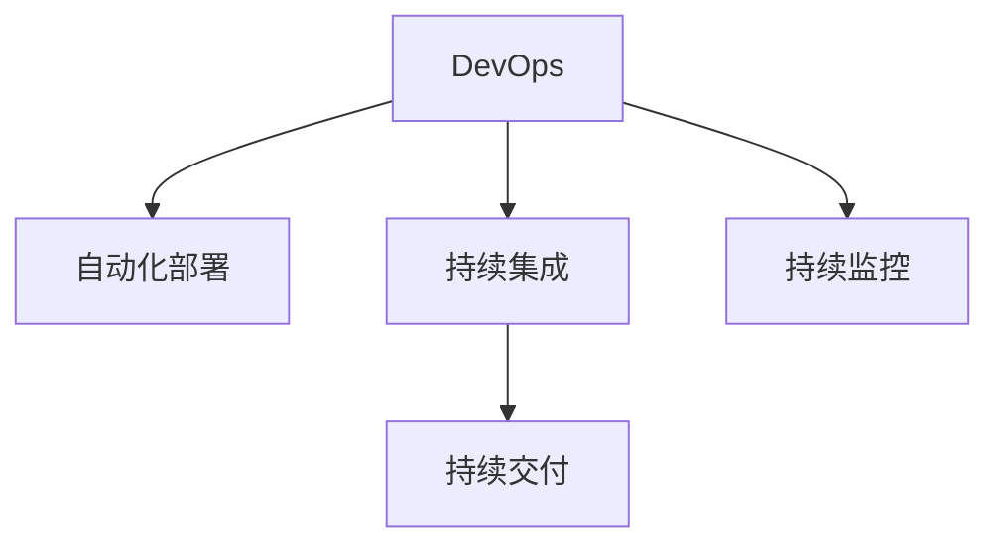

                 

# DevOps实践：自动化部署和持续集成

> 关键词：DevOps, 自动化部署, 持续集成, 持续交付, 自动化测试, 持续监控

## 1. 背景介绍

### 1.1 问题由来
随着软件项目的规模和复杂性不断增加，传统的“瀑布”式开发模式已无法满足快速迭代和响应市场变化的需求。软件交付周期长、成本高、错误率高，成为阻碍企业竞争力的主要因素。

为了应对这一挑战，DevOps（Development Operations）应运而生。DevOps通过自动化和持续集成（CI）、持续交付（CD）和持续监控（CM）等实践，将开发和运维环节紧密结合，实现了软件快速交付、高效协作和质量保障的目标。

## 2. 核心概念与联系

### 2.1 核心概念概述

为了更好地理解DevOps实践中的自动化部署和持续集成，本节将介绍几个密切相关的核心概念：

- **DevOps**：一种通过集成软件开发和运维，实现快速交付、持续改进和高效协作的实践方法。DevOps理念强调自动化、持续集成和持续交付，以提升软件交付效率和质量。

- **自动化部署**：通过脚本或工具，自动化软件从开发环境到测试环境再到生产环境的部署流程，减少人为操作错误，提升部署效率。

- **持续集成（CI）**：一种通过自动化构建和测试，将开发代码频繁集成到共享代码库，实现代码质量和稳定性的一种开发实践。

- **持续交付（CD）**：一种在开发、测试和部署环节进行连续自动化，确保软件产品能够快速、频繁、安全地交付给用户的实践方法。

- **持续监控（CM）**：通过自动化工具和系统，对软件交付和运维过程中的各个环节进行实时监控和反馈，确保系统稳定运行，快速响应问题。

这些核心概念之间的逻辑关系可以通过以下Mermaid流程图来展示：



这个流程图展示出DevOps实践中的各个关键流程，以及它们之间的联系：

1. 自动化部署是DevOps流程的起点和终点，负责将软件从开发环境部署到生产环境。
2. 持续集成在每次代码变更时，自动构建、测试和合并代码，确保代码质量。
3. 持续交付将持续集成的成果以增量形式快速部署到生产环境，确保软件快速交付。
4. 持续监控在部署和运维过程中实时监控系统状态，确保系统稳定。

## 3. 核心算法原理 & 具体操作步骤

### 3.1 算法原理概述

DevOps实践中的自动化部署和持续集成，本质上是一种通过自动化工具和技术，将软件开发和运维流程紧密结合，实现持续改进和高效协作的方法。

其核心思想是：通过自动化工具和脚本，将手动的、反复的、易出错的软件交付和运维流程转换为可重复、可测试、可优化、可监控的自动化流程。自动化不仅提高了交付效率和质量，还能大大降低人为错误和运维成本。

### 3.2 算法步骤详解

以下是DevOps实践中的自动化部署和持续集成的一般步骤：

**Step 1: 自动化构建**
- 编写自动化构建脚本，如Jenkins、Travis CI等工具，自动执行编译、打包和测试。
- 配置版本控制系统，如Git，确保每次构建都能从最新的代码库中获取最新代码。
- 设置持续集成触发器，如代码提交、定时任务等，确保每次代码变更都能触发自动化构建。

**Step 2: 自动化测试**
- 在自动化构建中集成测试脚本，如单元测试、集成测试、性能测试等，确保代码质量。
- 使用覆盖率工具，如 JaCoCo，分析测试覆盖率，确保测试的全面性和准确性。
- 集成断言工具，如TestNG，实现自动化的断言和测试结果记录。

**Step 3: 自动化部署**
- 编写自动化部署脚本，如Ansible、Chef、Puppet等工具，自动化执行服务器配置、应用程序安装和配置。
- 使用容器化技术，如Docker，实现应用的快速部署和迁移。
- 集成配置管理工具，如Jenkins Pipeline，实现持续集成的自动化部署流程。

**Step 4: 持续监控**
- 集成监控工具，如Prometheus、ELK Stack等，实时监控系统性能和日志。
- 使用可视化工具，如Grafana、Kibana，呈现监控数据，便于快速发现和解决问题。
- 集成报警工具，如PagerDuty、New Relic，设置异常报警机制，及时通知运维团队。

### 3.3 算法优缺点

DevOps实践中的自动化部署和持续集成方法具有以下优点：
1. 提高交付效率：自动化流程减少了手动操作，提升了软件交付速度和频率。
2. 增强代码质量：持续集成的自动化测试确保了代码的稳定性和可维护性。
3. 降低人为错误：自动化脚本减少了人为操作，降低了出错率。
4. 降低运维成本：自动化部署和监控减少了手动操作的复杂性和成本。
5. 提升协作效率：持续集成和持续交付使得团队成员能够快速共享代码和反馈，实现高效协作。

同时，该方法也存在一定的局限性：
1. 对工具和脚本的依赖：自动化流程的成功依赖于工具和脚本的稳定性和可靠性。
2. 需要持续维护：自动化流程的持续改进和优化需要持续的维护和更新。
3. 学习曲线陡峭：初学者可能需要一定时间学习和适应自动化工具和脚本的使用。
4. 复杂度增加：过度自动化的流程可能增加系统复杂性，导致难以调试和维护。
5. 缺乏灵活性：过度自动化可能导致灵活性不足，难以应对突发的需求和问题。

尽管存在这些局限性，但就目前而言，自动化部署和持续集成仍是DevOps实践中的主流范式。未来相关研究的重点在于如何进一步优化自动化流程，提高其灵活性和可扩展性，同时兼顾系统的稳定性和维护性。

### 3.4 算法应用领域

自动化部署和持续集成方法在软件开发和运维领域已经得到了广泛的应用，覆盖了几乎所有常见场景，例如：

- Web应用程序：通过持续集成和持续交付，快速构建、测试和部署Web应用程序，提升用户体验。
- 移动应用：使用自动化测试和自动化部署工具，快速迭代和交付移动应用，实现跨平台覆盖。
- 容器化应用：通过Docker等容器化技术，实现应用的快速部署和迁移，简化运维管理。
- 微服务架构：利用自动化部署和持续集成工具，快速构建、测试和部署微服务，提升系统可扩展性和灵活性。
- 数据分析：使用自动化流程，构建和部署数据管道，提升数据处理效率和质量。

除了上述这些经典应用外，自动化部署和持续集成还被创新性地应用到更多场景中，如DevSecOps、DevOps在区块链中的应用、DevOps在IaaS云平台中的应用等，为软件工程带来了全新的突破。随着DevOps理念的深入人心和技术的持续演进，相信自动化部署和持续集成方法将在更广阔的应用领域大放异彩。

## 4. 数学模型和公式 & 详细讲解  
### 4.1 数学模型构建

为了更好地理解DevOps实践中的自动化部署和持续集成方法，本节将介绍几个密切相关的数学模型：

- **任务并行模型**：在DevOps实践中，自动化流程常常涉及多个并行任务。我们可以使用任务调度模型来描述并行任务之间的关系和调度策略。

- **依赖关系模型**：在自动化部署中，不同任务之间常常存在依赖关系。我们可以使用有向无环图（DAG）来描述任务之间的依赖关系，确保任务顺序正确。

- **容错性模型**：在持续交付和持续监控中，我们需要考虑系统的容错性。我们可以使用容错性模型来评估系统的可靠性，确保在部分任务失败时，系统仍能正常运行。

这些数学模型通常采用线性代数、图论和概率论等数学工具来描述和计算。

### 4.2 公式推导过程

以下我们以任务并行模型为例，推导任务调度的数学公式。

假设有一组任务需要依次执行，任务集合为 $T=\{t_1, t_2, \cdots, t_n\}$，每个任务 $t_i$ 的执行时间为 $c_i$，任务之间的依赖关系为 $D=\{(t_j, t_i)\}$，其中 $t_j$ 依赖于 $t_i$。

定义任务 $t_i$ 的等待时间 $w_i$，即 $t_i$ 在开始执行前需要等待的时间。根据任务依赖关系，我们有：

$$
w_i = \max_{j}(c_j \cdot \mathbf{1}_{\{t_j \in D_i\}})
$$

其中 $\mathbf{1}_{\{t_j \in D_i\}}$ 表示 $t_j$ 是否依赖于 $t_i$。

定义系统的总执行时间为 $C$，即所有任务执行完毕的时间。根据任务执行时间和等待时间，我们有：

$$
C = \sum_{i=1}^{n} (c_i + w_i)
$$

通过上述公式，我们可以计算出系统的总执行时间和每个任务的等待时间，从而优化任务调度策略，提高系统效率。

### 4.3 案例分析与讲解

考虑一个简单的任务调度问题：有 $n=5$ 个任务需要依次执行，每个任务的执行时间分别为 $c_1=2, c_2=4, c_3=3, c_4=2, c_5=4$。任务 $t_1$ 依赖于任务 $t_3$，任务 $t_2$ 依赖于任务 $t_1$ 和 $t_3$，任务 $t_3$ 依赖于任务 $t_1$，任务 $t_4$ 依赖于任务 $t_2$，任务 $t_5$ 依赖于任务 $t_3$。

通过计算，我们有：

$$
\begin{align*}
w_1 &= \max(0, 0) = 0 \\
w_2 &= \max(3, 3) = 3 \\
w_3 &= \max(4, 2, 4) = 4 \\
w_4 &= \max(0, 0) = 0 \\
w_5 &= \max(4, 0) = 4 \\
C &= 2 + 7 + 3 + 2 + 4 = 16
\end{align*}
$$

通过任务并行模型，我们可以发现任务 $t_2$ 和 $t_5$ 的执行时间较长，需要优化调度策略，以提升系统效率。

## 5. 项目实践：代码实例和详细解释说明
### 5.1 开发环境搭建

在进行自动化部署和持续集成实践前，我们需要准备好开发环境。以下是使用Jenkins进行自动化部署和持续集成的环境配置流程：

1. 安装Jenkins：从官网下载并安装Jenkins，选择合适的安装路径。

2. 安装插件：从Jenkins插件管理页面，安装必要的插件，如Pipeline、Git、Docker等。

3. 配置Jenkins环境：设置Jenkins的服务器地址、用户账户等参数，配置SMTP等邮件通知机制。

4. 安装Docker：根据操作系统，安装Docker引擎，确保Jenkins可以与Docker进行交互。

完成上述步骤后，即可在Jenkins上启动自动化流程。

### 5.2 源代码详细实现

下面我们以构建和部署一个Web应用程序为例，给出使用Jenkins进行自动化部署和持续集成的PyTorch代码实现。

首先，在Jenkins上配置Pipeline脚本：

```groovy
pipeline {
    agent any
    stages {
        stage('Build') {
            steps {
                withGithub() {
                    steps {
                        sh 'git clone https://github.com/<REPO>/<APP>.git'
                        withDocker() {
                            steps {
                                sh 'docker build -t <IMAGE> .'
                            }
                        }
                    }
                }
            }
        }
        stage('Test') {
            steps {
                withGithub() {
                    steps {
                        sh 'echo "Testing..."'
                    }
                }
            }
        }
        stage('Deploy') {
            steps {
                withGithub() {
                    steps {
                        sh 'echo "Deploying..."'
                        sh 'docker push <IMAGE>'
                    }
                }
            }
        }
    }
}
```

以上代码定义了一个包含构建、测试和部署三个阶段的Pipeline。在每个阶段，使用不同的命令和插件，实现了自动化的构建和部署流程。

具体步骤如下：

1. **构建**：通过Git克隆代码，构建Docker镜像。
2. **测试**：在构建完成后，执行简单的测试任务，如打印日志。
3. **部署**：将构建好的Docker镜像推送到Docker Hub，准备部署。

接下来，在Jenkins上创建并配置Pipeline：

1. 在Jenkins首页，点击"New Item"，创建一个新的Pipeline项目。
2. 配置项目名称和描述，选择Pipeline类型。
3. 配置Pipeline脚本，将上述Groovy脚本保存并应用。
4. 配置触发器，如Git事件、定时任务等。

完成上述步骤后，即可启动自动化构建和部署流程。

### 5.3 代码解读与分析

让我们再详细解读一下关键代码的实现细节：

**Pipeline脚本**：
- `pipeline`：定义整个Pipeline。
- `agent any`：使用任何可用的代理，Jenkins可以选择本地机器或远程节点。
- `stages`：定义Pipeline的多个阶段。
- `stage('Build')`：定义构建阶段。
- `steps`：在每个阶段中定义具体的步骤。
- `withGithub()`：在构建和测试阶段使用GitHub作为代码仓库。
- `withDocker()`：在构建阶段使用Docker进行镜像构建。
- `sh`：定义具体的命令执行操作。

**构建步骤**：
- `sh 'git clone https://github.com/<REPO>/<APP>.git'`：通过Git克隆代码仓库。
- `withDocker()`：在构建阶段使用Docker进行镜像构建。
- `sh 'docker build -t <IMAGE> .'`：构建Docker镜像，其中 `<IMAGE>` 为镜像名称。

**测试步骤**：
- `sh 'echo "Testing..."'`：执行简单的测试任务，如打印日志。

**部署步骤**：
- `sh 'echo "Deploying..."'`：执行简单的部署任务，如打印日志。
- `sh 'docker push <IMAGE>'`：将构建好的Docker镜像推送到Docker Hub。

以上代码展示了如何使用Jenkins实现简单的自动化构建和部署流程。开发者可以根据具体需求，进一步优化Pipeline脚本和触发器配置，实现更加复杂和高效的自动化流程。

## 6. 实际应用场景
### 6.1 软件开发

在软件开发中，自动化部署和持续集成方法的应用非常广泛。开发者可以频繁地进行代码提交和集成，通过持续集成的自动化测试和构建，确保代码质量和稳定性。同时，通过持续交付和持续监控，可以快速构建、测试和部署应用，确保软件能够快速、频繁、安全地交付给用户。

在实践中，开发者可以使用Jenkins、Travis CI等持续集成工具，自动化执行构建、测试和部署任务。同时，可以使用Docker等容器化技术，实现应用的快速部署和迁移，简化运维管理。

### 6.2 移动应用开发

移动应用开发中，自动化部署和持续集成方法同样至关重要。移动应用的开发和部署过程往往涉及多个平台和多个团队，如何协调和高效交付成为一大挑战。

通过使用Jenkins、GitLab CI等持续集成工具，移动应用开发者可以实现跨平台、跨团队的自动化构建和部署。同时，通过持续监控工具，实时监测应用性能和用户反馈，及时优化和迭代，提升应用质量。

### 6.3 DevSecOps

DevSecOps（Development Security Operations）是DevOps和信息安全（Security）的结合。在DevSecOps实践中，自动化部署和持续集成方法同样发挥着重要作用。

通过集成静态和动态安全测试工具，如SonarQube、OWASP ZAP等，开发者可以在持续集成过程中进行安全测试，确保代码和应用的安全性。同时，通过自动化部署和持续监控，及时发现和修复安全漏洞，提升应用安全性。

### 6.4 未来应用展望

随着DevOps理念的不断深入和技术的持续演进，自动化部署和持续集成方法将在更多领域得到应用，为软件工程带来全新的突破。

在智慧医疗领域，自动化部署和持续集成方法可以用于构建和部署医疗管理系统，提升医疗服务的智能化水平。在智能制造领域，自动化部署和持续集成方法可以用于自动化生产线的构建和维护，提升生产效率和质量。

在金融科技领域，自动化部署和持续集成方法可以用于构建和部署金融交易系统，提升交易速度和稳定性。在智能交通领域，自动化部署和持续集成方法可以用于构建和部署智能交通管理系统，提升交通管理和运营效率。

此外，在智慧城市治理、社会治理、智能供应链等众多领域，自动化部署和持续集成方法也将不断涌现，为各行各业带来全新的变革。

## 7. 工具和资源推荐
### 7.1 学习资源推荐

为了帮助开发者系统掌握DevOps实践中的自动化部署和持续集成方法，这里推荐一些优质的学习资源：

1. **《DevOps实践指南》**：介绍DevOps的核心理念、实践方法和工具栈，适合初学者快速入门。

2. **Kubernetes官方文档**：Kubernetes是DevOps实践中的重要组件，官方文档详细介绍了Kubernetes的安装、配置和部署方法。

3. **Jenkins官方文档**：Jenkins是持续集成和持续交付的主要工具，官方文档提供了丰富的示例和教程。

4. **Docker官方文档**：Docker是容器化技术的代表，官方文档提供了详细的容器构建和部署指南。

5. **Google Cloud DevOps最佳实践**：Google Cloud提供的DevOps最佳实践，涵盖DevOps的各个方面，包括自动化构建、测试、部署、监控等。

通过学习这些资源，相信你一定能够快速掌握DevOps实践中的自动化部署和持续集成方法，并用于解决实际的开发和运维问题。

### 7.2 开发工具推荐

高效的开发离不开优秀的工具支持。以下是几款用于自动化部署和持续集成开发的常用工具：

1. **Jenkins**：开源的持续集成工具，支持丰富的插件和扩展，适合构建和部署各种类型的应用。

2. **Travis CI**：基于GitHub的持续集成工具，支持多种编程语言和框架，适合小型项目和快速迭代。

3. **GitLab CI/CD**：GitLab提供的持续集成和持续交付工具，支持多种构建和测试工具，适合中大型项目。

4. **CircleCI**：基于Cloud的持续集成工具，支持分布式构建和测试，适合分布式项目和远程协作。

5. **Docker**：开源的容器化平台，支持快速构建、测试和部署应用，适合微服务架构和容器化应用。

6. **Kubernetes**：开源的容器编排平台，支持大规模、高可用的应用部署和运维，适合云原生应用。

合理利用这些工具，可以显著提升DevOps实践中的自动化部署和持续集成任务的开发效率，加快创新迭代的步伐。

### 7.3 相关论文推荐

DevOps实践中的自动化部署和持续集成方法在软件开发和运维领域已经得到了广泛的应用，相关研究也在不断进展。以下是几篇奠基性的相关论文，推荐阅读：

1. **《CloudOps: Making DevOps Your Foundation for Cloud-Native Operations》**：介绍云原生DevOps的实践方法和工具栈，适合了解云原生领域的DevOps实践。

2. **《Pipeline-as-Code for Continuous Integration and Continuous Deployment》**：介绍Pipeline-as-Code的概念和实现方法，适合了解DevOps中的自动化部署和持续集成。

3. **《Continuous Delivery and Continuous Deployment in a Large Scale Global Cloud Platform》**：介绍在云平台上的DevOps实践，适合了解云环境下的自动化部署和持续集成。

4. **《Agile Software Development, Principles, Patterns, and Practices》**：介绍敏捷开发的方法和实践，适合了解DevOps的核心理念和方法。

5. **《DevSecOps: Integrating DevOps and Information Security》**：介绍DevSecOps的实践方法和工具栈，适合了解DevOps和信息安全的结合。

这些论文代表了大规模DevOps实践中的最新研究方向，通过学习这些前沿成果，可以帮助研究者把握学科前进方向，激发更多的创新灵感。

## 8. 总结：未来发展趋势与挑战

### 8.1 总结

本文对DevOps实践中的自动化部署和持续集成方法进行了全面系统的介绍。首先阐述了DevOps实践的核心理念和自动化部署、持续集成等关键概念，明确了自动化流程在提升软件交付效率和质量方面的独特价值。其次，从原理到实践，详细讲解了DevOps实践中的自动化部署和持续集成的数学模型和具体操作步骤，给出了自动化部署和持续集成任务开发的完整代码实例。同时，本文还广泛探讨了自动化部署和持续集成方法在软件开发、移动应用开发、DevSecOps等多个领域的应用前景，展示了其广阔的应用空间。此外，本文精选了自动化部署和持续集成技术的各类学习资源，力求为读者提供全方位的技术指引。

通过本文的系统梳理，可以看到，自动化部署和持续集成方法已经成为DevOps实践中的重要范式，极大地提升了软件交付的效率和质量。未来，伴随DevOps理念的深入人心和技术的持续演进，自动化部署和持续集成方法将在更多领域得到应用，为软件工程带来新的突破。

### 8.2 未来发展趋势

展望未来，自动化部署和持续集成方法将呈现以下几个发展趋势：

1. **微服务架构**：微服务架构的普及将带来更多的自动化部署和持续集成需求。通过容器化和微服务自动化，可以实现更灵活、高效的部署和运维。

2. **无服务器架构**：无服务器架构的兴起将带来更轻量级、更高效的自动化部署和持续集成方法。通过函数即服务（FaaS）的部署方式，可以减少运维复杂性和成本。

3. **持续交付和持续监控**：持续交付和持续监控的进一步发展，将使得软件交付更加快速、稳定、可控。通过自动化测试和监控，可以及时发现和修复问题，确保系统稳定运行。

4. **DevSecOps的融合**：DevSecOps的融合将带来更加全面、安全和高效的自动化流程。通过集成安全测试和监控，可以确保软件交付的安全性和稳定性。

5. **云原生应用**：云原生应用的普及将带来更多的自动化部署和持续集成需求。通过云平台提供的自动化服务，可以实现更高效的部署和运维。

以上趋势凸显了自动化部署和持续集成方法的广阔前景。这些方向的探索发展，必将进一步提升软件交付的效率和质量，为软件工程带来新的变革。

### 8.3 面临的挑战

尽管自动化部署和持续集成方法已经取得了瞩目成就，但在迈向更加智能化、普适化应用的过程中，它仍面临着诸多挑战：

1. **复杂度增加**：随着系统的规模和复杂性不断增加，自动化部署和持续集成流程的复杂度也在不断增加，如何简化流程、提高效率，需要进一步研究。

2. **稳定性问题**：自动化部署和持续集成流程的稳定性问题仍然存在，如依赖关系混乱、任务调度错误等，如何提高流程的稳定性和可靠性，需要更多技术支持。

3. **资源消耗**：自动化流程对资源消耗较大，特别是在构建、测试和部署过程中，如何优化资源使用，降低成本，是未来的重要研究方向。

4. **学习成本高**：自动化部署和持续集成流程的学习成本较高，特别是在跨领域协作时，如何提高团队成员的技能水平，降低学习成本，需要更多培训和教育。

5. **安全性风险**：自动化流程的引入可能带来新的安全风险，如CI管道中的恶意代码注入等，如何确保流程的安全性，避免安全风险，需要更多的技术保障。

尽管存在这些挑战，但随着DevOps理念的不断深入和技术的持续演进，自动化部署和持续集成方法将继续优化和发展，为软件工程带来更大的进步。

### 8.4 研究展望

面对自动化部署和持续集成方法所面临的种种挑战，未来的研究需要在以下几个方面寻求新的突破：

1. **自动化流程优化**：通过优化自动化流程，减少不必要的步骤，提高流程的效率和稳定性。

2. **多级自动化设计**：设计多级自动化流程，实现不同粒度的自动化部署和持续集成，满足不同场景的需求。

3. **云平台支持**：利用云平台的自动化服务，实现更快速、更稳定的自动化部署和持续集成。

4. **容器化和微服务**：利用容器化和微服务技术，实现更灵活、更高效的自动化部署和持续集成。

5. **安全性和合规性**：加强自动化流程的安全性和合规性，确保流程的稳定性和合法性。

这些研究方向的探索，必将引领自动化部署和持续集成方法走向更高的台阶，为软件工程带来新的突破。面向未来，自动化部署和持续集成技术还需要与其他人工智能技术进行更深入的融合，如自然语言处理、机器学习等，多路径协同发力，共同推动软件工程的发展。只有勇于创新、敢于突破，才能不断拓展自动化部署和持续集成方法的边界，让软件工程更具竞争力和创新力。

## 9. 附录：常见问题与解答

**Q1：自动化部署和持续集成方法是否适用于所有项目？**

A: 自动化部署和持续集成方法适用于大多数软件开发项目，特别是中大型项目。但对于一些小型项目或需要频繁手动操作的项目，自动化部署和持续集成可能不太适合。需要根据项目的特点和需求，选择适合的自动化部署和持续集成方法。

**Q2：自动化部署和持续集成方法如何提高交付效率？**

A: 自动化部署和持续集成方法通过自动化构建、测试和部署流程，减少了手动操作和重复性任务，提高了软件的交付效率和频率。同时，通过持续集成和持续监控，可以快速发现和修复问题，进一步提升交付质量。

**Q3：自动化部署和持续集成方法如何降低人为错误？**

A: 自动化部署和持续集成方法通过脚本和工具，减少了人为操作，降低了出错率。同时，通过自动化测试和持续监控，及时发现和修复问题，确保交付质量。

**Q4：自动化部署和持续集成方法如何降低运维成本？**

A: 自动化部署和持续集成方法通过自动化构建、测试和部署流程，减少了手动操作和重复性任务，降低了运维成本。同时，通过持续监控和自动化故障恢复，减少了手动干预，进一步降低运维成本。

**Q5：自动化部署和持续集成方法如何提升协作效率？**

A: 自动化部署和持续集成方法通过自动化流程，使得团队成员可以快速共享代码和反馈，实现高效协作。同时，通过持续集成和持续监控，及时发现和解决问题，进一步提升协作效率。

**Q6：自动化部署和持续集成方法在DevSecOps中的应用？**

A: 自动化部署和持续集成方法在DevSecOps中的应用非常重要。通过集成静态和动态安全测试工具，如SonarQube、OWASP ZAP等，可以在持续集成过程中进行安全测试，确保代码和应用的安全性。同时，通过自动化部署和持续监控，及时发现和修复安全漏洞，提升应用安全性。

---

作者：禅与计算机程序设计艺术 / Zen and the Art of Computer Programming

