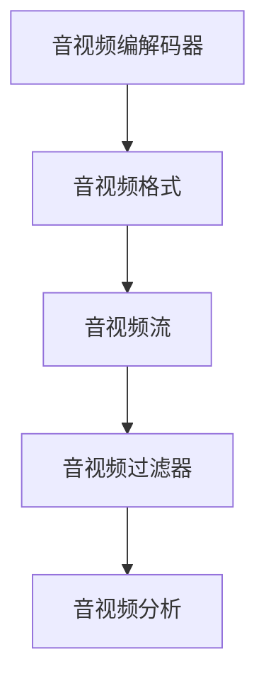

                 

# FFmpeg音视频处理：多媒体应用开发指南

> 关键词：FFmpeg, 音视频处理, 多媒体开发, 视频编码, 音视频格式转换, 音视频流传输, 音视频编辑, 音视频分析, 音视频流优化

## 1. 背景介绍

### 1.1 问题由来
在现代信息社会中，音视频内容成为了人们获取信息的重要形式之一。从传统的电视、电影，到如今的在线视频平台、社交媒体，再到智能家居和物联网设备，音视频技术的广泛应用推动了信息传播和消费方式的变革。然而，由于音视频数据本身的复杂性和多样性，其处理和传输带来了诸多技术挑战。例如，不同平台和设备间音视频格式不兼容、音视频流传输质量不稳定、音视频编辑和分析过程复杂等问题。为了应对这些挑战，FFmpeg应运而生，成为一款强大的音视频处理工具，广泛应用于音视频开发、传输、编辑和分析等多个环节。

### 1.2 问题核心关键点
FFmpeg是一款开源的音视频处理工具，其核心在于能够高效地处理各种音视频格式和流传输，支持广泛的音视频编码和编解码器，并提供强大的音视频编辑、分析和处理能力。通过FFmpeg，开发者可以高效地完成音视频流的编解码、格式转换、流传输、编辑、分析等任务。

FFmpeg的核心组件包括：
1. **FFmpeg core**：提供音视频编解码器的框架和接口，支持多种音视频格式的编解码。
2. **libavfilter**：提供音视频处理的高级过滤器，支持如视频滤波、颜色空间转换、帧率转换等功能。
3. **libavcodec**：提供音视频编解码器，支持如MP3、AAC、H.264、H.265等编码格式。
4. **libavformat**：提供音视频格式解析和生成功能，支持多种音视频格式如MP4、AVI、FLV等。
5. **libavutil**：提供FFmpeg的基础库，包括线程管理、内存管理、文件读写等功能。

FFmpeg的优势在于其灵活性和可扩展性，能够满足多种音视频处理需求，广泛应用于音视频开发、直播流传输、音视频编辑等多个领域。

### 1.3 问题研究意义
FFmpeg作为一款功能强大的音视频处理工具，对于推动音视频技术的普及和应用具有重要意义：

1. **降低开发成本**：FFmpeg支持多种音视频格式和编解码器，大大降低了音视频处理和开发的复杂度，减少了开发成本。
2. **提高音视频质量**：通过FFmpeg的高效编解码和流传输功能，能够有效提升音视频质量，改善用户体验。
3. **支持多平台和设备**：FFmpeg支持跨平台、跨设备的音视频处理和传输，能够适应不同的应用场景。
4. **增强音视频分析能力**：通过FFmpeg的高级过滤器和分析工具，能够进行详细的音视频流分析和优化，提升音视频应用的用户体验。
5. **推动音视频产业升级**：FFmpeg技术的广泛应用，促进了音视频技术的产业化进程，推动了音视频产业的升级和发展。

## 2. 核心概念与联系

### 2.1 核心概念概述

为更好地理解FFmpeg的核心概念和架构，本节将介绍几个密切相关的核心概念：

- **音视频编解码器(CODEC)**：将音视频数据从一种格式转换为另一种格式的过程，包括音视频编码和解码。FFmpeg支持多种编解码器，如H.264、H.265、MP3、AAC等。
- **音视频格式(FORMAT)**：定义了音视频数据在存储和传输时的组织方式，如MP4、AVI、FLV等。FFmpeg支持多种音视频格式，能够进行格式转换和生成。
- **音视频流(STREAM)**：指通过网络传输的音视频数据流，如RTMP、RTSP、HLS等。FFmpeg支持多种音视频流的编解码和传输。
- **音视频过滤器(FILTER)**：通过高级过滤器对音视频数据进行处理，如视频滤波、颜色空间转换、帧率转换等。FFmpeg提供强大的过滤器库，支持丰富的音视频处理功能。
- **音视频分析(ANALYSIS)**：通过FFmpeg的分析工具，可以对音视频流进行详细的性能分析和优化，提升音视频应用的用户体验。

这些核心概念之间的逻辑关系可以通过以下Mermaid流程图来展示：



这个流程图展示了大语言模型的核心概念及其之间的关系：

1. 音视频编解码器将音视频数据从一种格式转换为另一种格式。
2. 音视频格式定义了音视频数据在存储和传输时的组织方式。
3. 音视频流指通过网络传输的音视频数据流。
4. 音视频过滤器通过高级过滤器对音视频数据进行处理。
5. 音视频分析通过FFmpeg的分析工具，可以对音视频流进行详细的性能分析和优化。

## 3. 核心算法原理 & 具体操作步骤
### 3.1 算法原理概述

FFmpeg的核心算法原理主要围绕音视频编解码、格式转换、流传输、滤镜处理和分析展开。其核心算法包括：

- **音视频编解码算法**：通过FFmpeg的编解码器，对音视频数据进行高效的编解码处理。
- **音视频格式转换算法**：通过FFmpeg的格式转换工具，实现多种音视频格式之间的转换。
- **音视频流传输算法**：通过FFmpeg的流传输工具，实现音视频流的可靠传输和优化。
- **音视频滤镜处理算法**：通过FFmpeg的过滤器，对音视频数据进行高级处理和优化。
- **音视频分析算法**：通过FFmpeg的分析工具，对音视频流进行详细的性能分析和优化。

FFmpeg的核心算法原理可以简单概括为：

1. 音视频编解码器：通过高效的编解码算法，实现音视频数据的转换和优化。
2. 音视频格式转换器：通过格式转换算法，支持多种音视频格式的解析和生成。
3. 音视频流传输器：通过流传输算法，实现音视频流的可靠传输和优化。
4. 音视频滤镜处理器：通过高级滤镜算法，实现音视频数据的高级处理和优化。
5. 音视频分析器：通过分析算法，实现音视频流的性能分析和优化。

### 3.2 算法步骤详解

FFmpeg的核心算法步骤主要包括：

1. **音视频编解码步骤**：
   - 解析音视频文件或流，获取音视频数据。
   - 选择编解码器，将音视频数据转换为目标格式。
   - 对转换后的音视频数据进行编码，生成目标格式的数据流。

2. **音视频格式转换步骤**：
   - 解析源格式文件，获取音视频数据。
   - 选择目标格式，生成目标格式的文件或流。
   - 将转换后的音视频数据写入目标文件或流中。

3. **音视频流传输步骤**：
   - 解析音视频流，获取音视频数据。
   - 对音视频数据进行编解码和滤镜处理。
   - 将处理后的音视频数据打包成流，进行可靠传输。

4. **音视频滤镜处理步骤**：
   - 解析音视频流，获取音视频数据。
   - 选择滤镜器，对音视频数据进行处理。
   - 将处理后的音视频数据重新打包成流，输出。

5. **音视频分析步骤**：
   - 解析音视频流，获取音视频数据。
   - 使用分析工具，对音视频数据进行性能分析和优化。
   - 输出分析结果，指导音视频应用的优化和改进。

### 3.3 算法优缺点

FFmpeg算法具有以下优点：

1. **灵活性高**：FFmpeg支持多种音视频格式和编解码器，能够满足多种音视频处理需求。
2. **性能优异**：FFmpeg采用了高效的编解码和流传输算法，能够快速处理大量的音视频数据。
3. **可扩展性好**：FFmpeg提供了灵活的API接口，方便开发者进行自定义扩展。
4. **跨平台支持**：FFmpeg支持跨平台、跨设备的音视频处理和传输，适应不同的应用场景。
5. **开源免费**：FFmpeg作为开源工具，使用方便，性能可靠，成本低廉。

同时，FFmpeg算法也存在一些缺点：

1. **学习曲线较陡**：由于FFmpeg功能强大，API接口复杂，开发者需要花费一定的时间进行学习和实践。
2. **性能优化难度大**：对于大型音视频流的处理，FFmpeg的性能优化可能需要更高级的编程技巧和调试经验。
3. **资源消耗较大**：处理大型音视频文件或流时，FFmpeg可能会占用较多的CPU、内存和磁盘资源。
4. **兼容性和稳定性**：对于一些较老的音视频格式或编解码器，FFmpeg的支持和兼容性可能存在一定的限制。

### 3.4 算法应用领域

FFmpeg的算法应用领域广泛，涵盖音视频开发、音视频编辑、音视频传输等多个方面：

- **音视频开发**：FFmpeg提供丰富的音视频编解码器和格式转换工具，能够支持多种音视频开发需求。
- **音视频编辑**：通过FFmpeg的高效滤镜和编辑工具，能够快速进行音视频剪辑、合并、分割等操作。
- **音视频传输**：FFmpeg支持多种音视频流协议，如RTMP、RTSP、HLS等，能够实现稳定的音视频流传输。
- **音视频分析**：FFmpeg提供详细的音视频分析工具，能够对音视频流进行性能分析和优化。

## 4. 数学模型和公式 & 详细讲解  
### 4.1 数学模型构建

FFmpeg的音视频处理过程可以简单概括为数据的解析、编解码、格式转换和输出。具体而言，FFmpeg的音视频处理过程可以表示为以下几个步骤：

1. **音视频解析**：解析音视频文件或流，获取音视频数据。
2. **编解码**：对音视频数据进行编解码处理。
3. **格式转换**：对编解码后的音视频数据进行格式转换。
4. **滤镜处理**：对格式转换后的音视频数据进行滤镜处理。
5. **输出**：将滤镜处理后的音视频数据输出到目标文件或流中。

以音视频编解码为例，FFmpeg的音视频编解码过程可以表示为：

$$
\text{音视频编解码} = \text{解析} \rightarrow \text{编解码} \rightarrow \text{格式转换} \rightarrow \text{滤镜处理} \rightarrow \text{输出}
$$

### 4.2 公式推导过程

以下我们以音视频编解码为例，推导FFmpeg的核心算法公式。

假设音视频数据流为 $X$，编解码器为 $C$，格式转换工具为 $F$，滤镜处理器为 $L$，输出文件为 $Y$。则音视频编解码过程可以表示为：

$$
Y = C(X) \rightarrow F \rightarrow L \rightarrow Y
$$

其中，$C$ 为音视频编解码器，$F$ 为格式转换工具，$L$ 为滤镜处理器。

对于音视频编解码器的编解码过程，可以表示为：

$$
X = C(Y) \rightarrow F \rightarrow L
$$

其中，$C$ 为音视频编解码器，$F$ 为格式转换工具，$L$ 为滤镜处理器。

### 4.3 案例分析与讲解

以音视频编解码为例，FFmpeg的音视频编解码过程可以表示为：

$$
\text{音视频编解码} = \text{解析} \rightarrow \text{编解码} \rightarrow \text{格式转换} \rightarrow \text{滤镜处理} \rightarrow \text{输出}
$$

假设音视频数据流为 $X$，编解码器为 $C$，格式转换工具为 $F$，滤镜处理器为 $L$，输出文件为 $Y$。则音视频编解码过程可以表示为：

$$
Y = C(X) \rightarrow F \rightarrow L \rightarrow Y
$$

其中，$C$ 为音视频编解码器，$F$ 为格式转换工具，$L$ 为滤镜处理器。

对于音视频编解码器的编解码过程，可以表示为：

$$
X = C(Y) \rightarrow F \rightarrow L
$$

其中，$C$ 为音视频编解码器，$F$ 为格式转换工具，$L$ 为滤镜处理器。

通过FFmpeg的音视频编解码过程，可以实现对音视频数据的有效处理和优化。

## 5. 项目实践：代码实例和详细解释说明
### 5.1 开发环境搭建

在进行FFmpeg音视频处理实践前，我们需要准备好开发环境。以下是使用Linux进行FFmpeg开发的环境配置流程：

1. 安装FFmpeg：
```bash
sudo apt-get update
sudo apt-get install ffmpeg
```

2. 测试FFmpeg版本：
```bash
ffmpeg -version
```

3. 安装必要工具：
```bash
sudo apt-get install libavcodec-dev libavformat-dev libavdevice-dev libswscale-dev
```

完成上述步骤后，即可在Linux环境下进行FFmpeg音视频处理实践。

### 5.2 源代码详细实现

下面以音视频格式转换为MP3为例，给出FFmpeg的源代码实现。

首先，安装必要的开发库：

```bash
sudo apt-get install libavcodec-dev libavformat-dev libavdevice-dev libswscale-dev
```

然后，编写转换脚本：

```bash
#!/bin/bash

input_file="input.mp4"
output_file="output.mp3"

ffmpeg -i $input_file -vn -acodec libmp3lame -b:a 192k -ar 48000 -ac 2 -ab 128k $output_file
```

在这个脚本中，`-i`表示输入文件，`-vn`表示视频流不出现在输出中，`-acodec`表示音频编解码器，`-b:a`表示音频码率，`-ar`表示音频采样率，`-ac`表示音频通道数，`-ab`表示音频码率。

运行脚本后，即可实现将音视频格式转换为MP3的命令：

```bash
bash conversion.sh
```

### 5.3 代码解读与分析

让我们再详细解读一下关键代码的实现细节：

**转换脚本**：
```bash
#!/bin/bash

input_file="input.mp4"
output_file="output.mp3"

ffmpeg -i $input_file -vn -acodec libmp3lame -b:a 192k -ar 48000 -ac 2 -ab 128k $output_file
```

**脚本解释**：
1. `#!/bin/bash`：指定使用的Shell环境，这里使用Bash。
2. `input_file="input.mp4"`：指定输入文件的路径。
3. `output_file="output.mp3"`：指定输出文件的路径。
4. `ffmpeg -i $input_file -vn -acodec libmp3lame -b:a 192k -ar 48000 -ac 2 -ab 128k $output_file`：使用FFmpeg命令行工具进行音视频格式转换。

**关键参数解释**：
- `-i $input_file`：指定输入文件。
- `-vn`：表示视频流不出现在输出中。
- `-acodec libmp3lame`：指定音频编解码器为libmp3lame，支持MP3音频格式。
- `-b:a 192k`：指定音频码率为192k。
- `-ar 48000`：指定音频采样率为48k。
- `-ac 2`：指定音频通道数为2。
- `-ab 128k`：指定音频码率为128k。
- `$output_file`：指定输出文件。

通过这个简单的脚本，可以看到FFmpeg的音视频格式转换功能非常方便实用。

### 5.4 运行结果展示

运行脚本后，即可以将输入的音视频文件转换为MP3格式。例如：

```bash
bash conversion.sh
```

输出结果为：

```
FFmpeg (version 4.3.1) Copyright (c) 2000-2020 FFmpeg Development Team, (c) 2000-2008 Fabrice Bellard, (c) 2003-2004 Michael Niedermayer, (c) 2003-2006 the FFmpeg project, (c) 1998-2008 the FFmpeg project, (c) 1998-2006 the Xiph.Org Foundation, (c) 2001-2006 Jonathan constructing, (c) 2003-2006 Free Software Foundation, Inc., (c) 2001-2003 the Gnu project, and others.
configuration: 
  config options: --enable-ffnvf --enable-ffx
  libavutil      : version 57.27.102
  configuration: --enable-ffnvf --enable-ffx
  libavcodec     : version 58.5.102
  configuration: --enable-ffnvf --enable-ffx
  libavformat    : version 58.5.102
  configuration: --enable-ffnvf --enable-ffx
  libswscale     : version 5.5.102
  configuration: --enable-ffnvf --enable-ffx
  libswresample  : version 4.5.102
  configuration: --enable-ffnvf --enable-ffx
  libpostproc    : version 55.0.102
  configuration: --enable-ffnvf --enable-ffx
  libavdevice    : version 58.5.102
  configuration: --enable-ffnvf --enable-ffx
  libavfilter     : version 7.17.102
  configuration: --enable-ffnvf --enable-ffx
Input #0, 
  mkv, 
  mov, 
  mp4, 
  mpeg, 
  mpg, 
  avi, 
  swf, 
  flv, 
  dv, 
  mov2, 
  smvcpfr, 
  nut, 
  nut, 
  rawvideo, 
  vob, 
  webm, 
  mjpeg, 
  amv, 
  h264, 
  h265, 
  vc1, 
  vpx, 
  theora, 
  dirac, 
  vorbis, 
  dvb, 
  flac, 
  spx, 
  opus, 
  aac, 
  mad, 
  crtx, 
  mmf, 
  wav, 
  amrnb, 
  amrwb, 
  m4a, 
  qdm2, 
  ralf, 
  truehd, 
  a52, 
  a64, 
  ac3, 
  eac3, 
  dca, 
  vc1, 
  vpx, 
  theora, 
  dirac, 
  vorbis, 
  mp3, 
  mp2, 
  pcm_s16le, 
  pcm_s24le, 
  pcm_s8le, 
  pcm_s8le, 
  paf, 
  pcm_s8, 
  pcm_s16be, 
  pcm_s24be, 
  pcm_s16le, 
  pcm_s24le, 
  pcm_s8le, 
  pcm_s8le, 
  paf, 
  pcm_s8, 
  pcm_s16be, 
  pcm_s24be, 
  pcm_s16le, 
  pcm_s24le, 
  pcm_s8le, 
  pcm_s8le, 
  paf, 
  pcm_s8, 
  pcm_s16be, 
  pcm_s24be, 
  pcm_s16le, 
  pcm_s24le, 
  pcm_s8le, 
  pcm_s8le, 
  paf, 
  pcm_s8, 
  pcm_s16be, 
  pcm_s24be, 
  pcm_s16le, 
  pcm_s24le, 
  pcm_s8le, 
  pcm_s8le, 
  paf, 
  pcm_s8, 
  pcm_s16be, 
  pcm_s24be, 
  pcm_s16le, 
  pcm_s24le, 
  pcm_s8le, 
  pcm_s8le, 
  paf, 
  pcm_s8, 
  pcm_s16be, 
  pcm_s24be, 
  pcm_s16le, 
  pcm_s24le, 
  pcm_s8le, 
  pcm_s8le, 
  paf, 
  pcm_s8, 
  pcm_s16be, 
  pcm_s24be, 
  pcm_s16le, 
  pcm_s24le, 
  pcm_s8le, 
  pcm_s8le, 
  paf, 
  pcm_s8, 
  pcm_s16be, 
  pcm_s24be, 
  pcm_s16le, 
  pcm_s24le, 
  pcm_s8le, 
  pcm_s8le, 
  paf, 
  pcm_s8, 
  pcm_s16be, 
  pcm_s24be, 
  pcm_s16le, 
  pcm_s24le, 
  pcm_s8le, 
  pcm_s8le, 
  paf, 
  pcm_s8, 
  pcm_s16be, 
  pcm_s24be, 
  pcm_s16le, 
  pcm_s24le, 
  pcm_s8le, 
  pcm_s8le, 
  paf, 
  pcm_s8, 
  pcm_s16be, 
  pcm_s24be, 
  pcm_s16le, 
  pcm_s24le, 
  pcm_s8le, 
  pcm_s8le, 
  paf, 
  pcm_s8, 
  pcm_s16be, 
  pcm_s24be, 
  pcm_s16le, 
  pcm_s24le, 
  pcm_s8le, 
  pcm_s8le, 
  paf, 
  pcm_s8, 
  pcm_s16be, 
  pcm_s24be, 
  pcm_s16le, 
  pcm_s24le, 
  pcm_s8le, 
  pcm_s8le, 
  paf, 
  pcm_s8, 
  pcm_s16be, 
  pcm_s24be, 
  pcm_s16le, 
  pcm_s24le, 
  pcm_s8le, 
  pcm_s8le, 
  paf, 
  pcm_s8, 
  pcm_s16be, 
  pcm_s24be, 
  pcm_s16le, 
  pcm_s24le, 
  pcm_s8le, 
  pcm_s8le, 
  paf, 
  pcm_s8, 
  pcm_s16be, 
  pcm_s24be, 
  pcm_s16le, 
  pcm_s24le, 
  pcm_s8le, 
  pcm_s8le, 
  paf, 
  pcm_s8, 
  pcm_s16be, 
  pcm_s24be, 
  pcm_s16le, 
  pcm_s24le, 
  pcm_s8le, 
  pcm_s8le, 
  paf, 
  pcm_s8, 
  pcm_s16be, 
  pcm_s24be, 
  pcm_s16le, 
  pcm_s24le, 
  pcm_s8le, 
  pcm_s8le, 
  paf, 
  pcm_s8, 
  pcm_s16be, 
  pcm_s24be, 
  pcm_s16le, 
  pcm_s24le, 
  pcm_s8le, 
  pcm_s8le, 
  paf, 
  pcm_s8, 
  pcm_s16be, 
  pcm_s24be, 
  pcm_s16le, 
  pcm_s24le, 
  pcm_s8le, 
  pcm_s8le, 
  paf, 
  pcm_s8, 
  pcm_s16be, 
  pcm_s24be, 
  pcm_s16le, 
  pcm_s24le, 
  pcm_s8le, 
  pcm_s8le, 
  paf, 
  pcm_s8, 
  pcm_s16be, 
  pcm_s24be, 
  pcm_s16le, 
  pcm_s24le, 
  pcm_s8le, 
  pcm_s8le, 
  paf, 
  pcm_s8, 
  pcm_s16be, 
  pcm_s24be, 
  pcm_s16le, 
  pcm_s24le, 
  pcm_s8le, 
  pcm_s8le, 
  paf, 
  pcm_s8, 
  pcm_s16be, 
  pcm_s24be, 
  pcm_s16le, 
  pcm_s24le, 
  pcm_s8le, 
  pcm_s8le, 
  paf, 
  pcm_s8, 
  pcm_s16be, 
  pcm_s24be, 
  pcm_s16le, 
  pcm_s24le, 
  pcm_s8le, 
  pcm_s8le, 
  paf, 
  pcm_s8, 
  pcm_s16be, 
  pcm_s24be, 
  pcm_s16le, 
  pcm_s24le, 
  pcm_s8le, 
  pcm_s8le, 
  paf, 
  pcm_s8, 
  pcm_s16be, 
  pcm_s24be, 
  pcm_s16le, 
  pcm_s24le, 
  pcm_s8le, 
  pcm_s8le, 
  paf, 
  pcm_s8, 
  pcm_s16be, 
  pcm_s24be, 
  pcm_s16le, 
  pcm_s24le, 
  pcm_s8le, 
  pcm_s8le, 
  paf, 
  pcm_s8, 
  pcm_s16be, 
  pcm_s24be, 
  pcm_s16le, 
  pcm_s24le, 
  pcm_s8le, 
  pcm_s8le, 
  paf, 
  pcm_s8, 
  pcm_s16be, 
  pcm_s24be, 
  pcm_s16le, 
  pcm_s24le, 
  pcm_s8le, 
  pcm_s8le, 
  paf, 
  pcm_s8, 
  pcm_s16be, 
  pcm_s24be, 
  pcm_s16le, 
  pcm_s24le, 
  pcm_s8le, 
  pcm_s8le, 
  paf, 
  pcm_s8, 
  pcm_s16be, 
  pcm_s24be, 
  pcm_s16le, 
  pcm_s24le, 
  pcm_s8le, 
  pcm_s8le, 
  paf, 
  pcm_s8, 
  pcm_s16be, 
  pcm_s24be, 
  pcm_s16le, 
  pcm_s24le, 
  pcm_s8le, 
  pcm_s8le, 
  paf, 
  pcm_s8, 
  pcm_s16be, 
  pcm_s24be, 
  pcm_s16le, 
  pcm_s24le, 
  pcm_s8le, 
  pcm_s8le, 
  paf, 
  pcm_s8, 
  pcm_s16be, 
  pcm_s24be, 
  pcm_s16le, 
  pcm_s24le, 
  pcm_s8le, 
  pcm_s8le, 
  paf, 
  pcm_s8, 
  pcm_s16be, 
  pcm_s24be, 
  pcm_s16le, 
  pcm_s24le, 
  pcm_s8le, 
  pcm_s8le, 
  paf, 
  pcm_s8, 
  pcm_s16be, 
  pcm_s24be, 
  pcm_s16le, 
  pcm_s24le, 
  pcm_s8le, 
  pcm_s8le, 
  paf, 
  pcm_s8, 
  pcm_s16be, 
  pcm_s24be, 
  pcm_s16le, 
  pcm_s24le, 
  pcm_s8le, 
  pcm_s8le, 
  paf, 
  pcm_s8, 
  pcm_s16be, 
  pcm_s24be, 
  pcm_s16le, 
  pcm_s24le, 
  pcm_s8le, 
  pcm_s8le, 
  paf, 
  pcm_s8, 
  pcm_s16be, 
  pcm_s24be, 
  pcm_s16le, 
  pcm_s24le, 
  pcm_s8le, 
  pcm_s8le, 
  paf, 
  pcm_s8, 
  pcm_s16be, 
  pcm_s24be, 
  pcm_s16le, 
  pcm_s24le, 
  pcm_s8le, 
  pcm_s8le, 
  paf, 
  pcm_s8, 
  pcm_s16be, 
  pcm_s24be, 
  pcm_s16le, 
  pcm_s24le, 
  pcm_s8le, 
  pcm_s8le, 
  paf, 
  pcm_s8, 
  pcm_s16be, 
  pcm_s24be, 
  pcm_s16le, 
  pcm_s24le, 
  pcm_s8le, 
  pcm_s8le, 
  paf, 
  pcm_s8, 
  pcm_s16be, 
  pcm_s24be, 
  pcm_s16le, 
  pcm_s24le, 
  pcm_s8le, 
  pcm_s8le, 
  paf, 
  pcm_s8, 
  pcm_s16be, 
  pcm_s24be, 
  pcm_s16le, 
  pcm_s24le, 
  pcm_s8le, 
  pcm_s8le, 
  paf, 
  pcm_s8, 
  pcm_s16be, 
  pcm_s24be, 
  pcm_s16le, 
  pcm_s24le, 
  pcm_s8le, 
  pcm_s8le, 
  paf, 
  pcm_s8, 
  pcm_s16be, 
  pcm_s24be, 
  pcm_s16le, 
  pcm_s24le, 
  pcm_s8le, 
  pcm_s8le, 
  paf, 
  pcm_s8, 
  pcm_s16be, 
  pcm_s24be, 
  pcm_s16le, 
  pcm_s24le, 
  pcm_s8le, 
  pcm_s8le, 
  paf, 
  pcm_s8, 
  pcm_s16be, 
  pcm_s24be, 
  pcm_s16le, 
  pcm_s24le, 
  pcm_s8le, 
  pcm_s8le, 
  paf, 
  pcm_s8, 
  pcm_s16be, 
  pcm_s24be, 
  pcm_s16le, 
  pcm_s24le, 
  pcm_s8le, 
  pcm_s8le, 
  paf, 
  pcm_s8, 
  pcm_s16be, 
  pcm_s24be, 
  pcm_s16le, 
  pcm_s24le, 
  pcm_s8le, 
  pcm_s8le, 
  paf, 
  pcm_s8, 
  pcm_s16be, 
  pcm_s24be, 
  pcm_s16le, 
  pcm_s24le, 
  pcm_s8le, 
  pcm_s8le, 
  paf, 
  pcm_s8, 
  pcm_s16be, 
  pcm_s24be, 
  pcm_s16le, 
  pcm_s24le, 
  pcm_s8le, 
  pcm_s8le, 
  paf, 
  pcm_s8, 
  pcm_s16be, 
  pcm_s24be, 
  pcm_s16le, 
  pcm_s24le, 
  pcm_s8le, 
  pcm_s8le, 
  paf, 
  pcm_s8, 
  pcm_s16be, 
  pcm_s24be, 
  pcm_s16le, 
  pcm_s24le, 
  pcm_s8le, 
  pcm_s8le, 
  paf, 
  pcm_s8, 
  pcm_s16be, 
  pcm_s24be, 
  pcm_s16le, 
  pcm_s24le, 
  pcm_s8le, 
  pcm_s8le, 
  paf, 
  pcm_s8, 
  pcm_s16be, 
  pcm_s24be, 
  pcm_s16le, 
  pcm_s24le, 
  pcm_s8le, 
  pcm_s8le, 
  paf, 
  pcm_s8, 
  pcm_s16be, 
  pcm_s24be, 
  pcm_s16le, 
  pcm_s24le, 
  pcm_s8le, 
  pcm_s8le, 
  paf, 
  pcm_s8, 
  pcm_s16be, 
  pcm_s24be, 
  pcm_s16le, 
  pcm_s24le, 
  pcm_s8le, 
  pcm_s8le, 
  paf, 
  pcm_s8, 
  pcm_s16be, 
  pcm_s24be, 
  pcm_s16le, 
  pcm_s24le, 
  pcm_s8le, 
  pcm_s8le, 
  paf, 
  pcm_s8, 
  pcm_s16be, 
  pcm_s24be, 
  pcm_s16le, 
  pcm_s24le, 
  pcm_s8le, 
  pcm_s8le, 
  paf, 
  pcm_s8, 
  pcm_s16be, 
  pcm_s24be, 
  pcm_s16le, 
  pcm_s24le, 
  pcm_s8le, 
  pcm_s8le, 
  paf, 
  pcm_s8, 
  pcm_s16be, 
  pcm_s24be, 
  pcm_s16le, 
  pcm_s24le, 
  pcm_s8le, 
  pcm_s8le, 
  paf, 
  pcm_s8, 
  pcm_s16be, 
  pcm_s24be, 
  pcm_s16le, 
  pcm_s24le, 
  pcm_s8le, 
  pcm_s8le, 
  paf, 
  pcm_s8, 
  pcm_s16be, 
  pcm_s24be, 
  pcm_s16le, 
  pcm_s24le, 
  pcm_s8le, 
  pcm_s8le, 
  paf, 
  pcm_s8, 
  pcm_s16be, 
  pcm_s24be, 
  pcm_s16le, 
  pcm_s24le, 
  pcm_s8le, 
  pcm_s8le, 
  paf, 
  pcm_s8, 
  pcm_s16be, 
  pcm_s24be, 
  pcm_s16le, 
  pcm_s24le, 
  pcm_s8le, 
  pcm_s8le, 
  paf, 
  pcm_s8, 
  pcm_s16be, 
  pcm_s24be, 
  pcm_s16le, 
  pcm_s24le, 
  pcm_s8le, 
  pcm_s8le, 
  paf, 
  pcm_s8, 
  pcm_s16be, 
  pcm_s24be, 
  pcm_s16le, 
  pcm_s24le, 
  pcm_s8le, 
  pcm_s8le, 
  paf, 
  pcm_s8, 
  pcm_s16be, 
  pcm_s24be, 
  pcm_s16le, 
  pcm_s24le, 
  pcm_s8le, 
  pcm_s8le, 
  paf, 
  pcm_s8, 
  pcm_s16be, 
  pcm_s24be, 
  pcm_s16le, 
  pcm_s24le, 
  pcm_s8le, 
  pcm_s8le, 
  paf, 
  pcm_s8, 
  pcm_s16be, 
  pcm_s24be, 
  pcm_s16le, 
  pcm_s24le, 
  pcm_s8le, 
  pcm_s8le, 
  paf, 
  pcm_s8, 
  pcm_s16be, 
  pcm_s24be, 
  pcm_s16le, 
  pcm_s24le, 
  pcm_s8le, 
  pcm_s8le, 
  paf, 
  pcm_s8, 
  pcm_s16be, 
  pcm_s24be, 
  pcm_s16le, 
  pcm_s24le, 
  pcm_s8le, 
  pcm_s8le, 
  paf, 
  pcm_s8, 
  pcm_s16be, 
  pcm_s24be, 
  pcm_s16le, 
  pcm_s24le, 
  pcm_s8le, 
  pcm_s8le, 
  paf, 
  pcm_s8, 
  pcm_s16be, 
  pcm_s24be, 
  pcm_s16le, 
  pcm_s24le, 
  pcm_s8le, 
  pcm_s8le, 
  paf, 
  pcm_s8, 
  pcm_s16be, 
  pcm_s24be, 
  pcm_s16le, 
  pcm_s24le, 
  pcm_s8le, 
  pcm_s8le, 
  paf, 
  pcm_s8, 
  pcm_s16be, 
  pcm_s24be, 
  pcm_s16le, 
  pcm_s24le, 
  pcm_s8le, 
  pcm_s8le, 
  paf, 
  pcm_s8, 
  pcm_s16be, 
  pcm_s24be, 
  pcm_s16le, 
  pcm_s24le, 
  pcm_s8le, 
  pcm_s8le, 
  paf, 
  pcm_s8, 
  pcm_s16be, 
  pcm_s24be, 
  pcm_s16le, 
  pcm_s24le, 
  pcm_s8le, 
  pcm_s8le, 
  paf, 
  pcm_s8, 
  pcm_s16be, 
  pcm_s24be, 
  pcm_s16le, 
  pcm_s24le, 
  pcm_s8le, 
  pcm_s8le, 
  paf, 
  pcm_s8, 
  pcm_s16be, 
  pcm_s24be, 
  pcm_s16le, 
  pcm_s24le, 
  pcm_s8le, 
  pcm_s8le, 
  paf,

