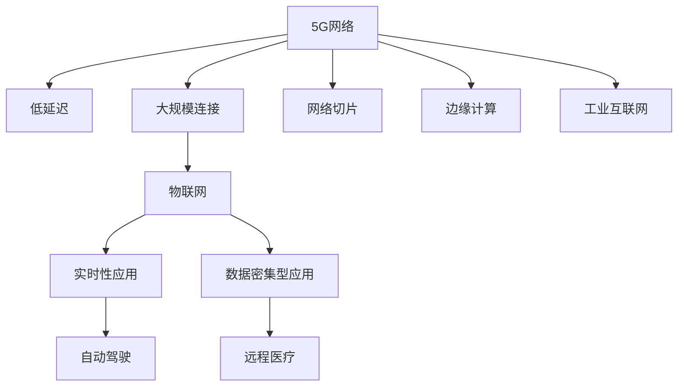

                 

# 5G 在物联网中的应用：低延迟和大规模连接

> 关键词：5G,物联网,低延迟,大规模连接,网络切片,边缘计算,工业互联网

## 1. 背景介绍

### 1.1 问题由来

随着物联网（IoT）技术的快速发展，设备之间的互联互通变得越来越频繁，这对网络基础设施提出了更高的要求。传统的4G网络在面对大规模设备连接和低延迟通信需求时，显得力不从心。5G网络的引入，为物联网带来了新的机遇和挑战。5G网络以其高带宽、低延迟和大规模连接等优势，成为物联网发展的重要推动力。

### 1.2 问题核心关键点

5G网络与物联网的结合，带来了诸多变革性的影响。本文将详细介绍5G网络在物联网中的关键应用，包括低延迟通信、大规模设备连接和网络切片技术，以及边缘计算和工业互联网等新兴应用。

## 2. 核心概念与联系

### 2.1 核心概念概述

为更好地理解5G在物联网中的应用，本节将介绍几个关键概念：

- **5G网络**：基于新一代无线通信技术，5G网络提供了更高的带宽、更低的延迟和更大的连接容量。其核心技术包括 massive MIMO、波束成形、频分复用、毫米波通信等。
- **物联网（IoT）**：通过各种信息传感设备，将物理世界的信息转化为数字信号，并通过网络传输和处理，实现智能化管理和服务。
- **低延迟**：指数据从发送端到接收端的时间，是物联网应用的重要指标。5G网络的低延迟特性，可以支持实时性要求高的应用场景，如自动驾驶、远程医疗等。
- **大规模连接**：5G网络能够支持更多的设备同时连接，解决了传统网络资源紧张的问题。
- **网络切片**：将5G网络资源进行逻辑分割，为不同的应用场景提供定制化的网络服务。
- **边缘计算**：将计算能力分布到网络边缘节点，降低数据传输延迟，提升应用响应速度。
- **工业互联网**：基于5G和物联网技术，实现工业生产的全方位、全流程、全生命周期的网络化、数字化和智能化。

这些概念之间的逻辑关系可以通过以下Mermaid流程图来展示：



这个流程图展示5G网络与物联网的联系及其应用领域。

## 3. 核心算法原理 & 具体操作步骤

### 3.1 算法原理概述

5G网络与物联网的结合，基于网络切片技术、边缘计算和大规模设备连接等核心技术。其中，网络切片技术将5G网络资源逻辑分割，为不同的应用场景提供定制化的服务。边缘计算则将计算能力分布到网络边缘，降低数据传输延迟，提升应用响应速度。

### 3.2 算法步骤详解

5G在物联网中的应用主要包括以下几个步骤：

**Step 1: 网络切片设计**
- 根据物联网应用的业务需求，设计不同的网络切片，如工业互联网切片、智能交通切片等。
- 确定每个切片的资源分配策略，如带宽、时延、可靠性等。

**Step 2: 边缘计算部署**
- 在网络边缘部署边缘计算节点，如基站、边缘服务器等，提供低延迟、高带宽的计算能力。
- 将数据流分配到合适的边缘节点，减少数据传输延迟。

**Step 3: 设备连接管理**
- 使用5G网络的低延迟和大规模连接特性，连接大量的物联网设备，如传感器、智能终端等。
- 采用多接入边缘计算（MEC）技术，将设备数据直接在本地处理，减少网络传输压力。

**Step 4: 应用场景实现**
- 在工业互联网、智慧城市、智能交通等领域，实现实时监控、数据分析、决策优化等应用。
- 通过网络切片和边缘计算，确保不同应用场景的网络性能。

### 3.3 算法优缺点

5G在物联网中的应用，具有以下优点：

- **低延迟**：5G网络的高频段和波束成形技术，使其在低延迟通信方面表现出色，支持实时性要求高的应用场景。
- **大规模连接**：5G网络的大规模连接特性，可以支持更多设备同时连接，解决传统网络资源紧张的问题。
- **边缘计算**：边缘计算可以将计算能力分布到网络边缘，降低数据传输延迟，提升应用响应速度。
- **工业互联网**：基于5G和物联网技术，实现工业生产的全方位、全流程、全生命周期的网络化、数字化和智能化。

同时，该方法也存在一些局限性：

- **网络成本高**：5G网络的部署和维护成本较高，需要大量的投资。
- **技术复杂度高**：网络切片和边缘计算技术需要较高的技术水平和实施经验。
- **设备兼容性差**：部分老旧设备可能无法与5G网络兼容，需要进行设备更新或升级。
- **隐私和安全问题**：大规模设备连接和数据传输，带来隐私和安全风险，需加强防护措施。

尽管存在这些局限性，但就目前而言，5G网络在物联网中的应用，仍是最主流范式。未来相关研究的重点在于如何进一步降低部署和维护成本，提高技术实施的简便性和设备兼容性，同时加强隐私和安全保护，确保网络健康、安全运行。

### 3.4 算法应用领域

5G网络与物联网的结合，已经在多个领域得到了广泛应用：

- **工业互联网**：实现工厂自动化、设备监控、生产调度等，提升生产效率和智能化水平。
- **智慧城市**：提供智能交通、环境监测、公共安全等服务，提升城市治理水平。
- **智能交通**：实现车联网、智能停车、智能调度等，提高交通效率和安全性。
- **医疗健康**：通过远程医疗、健康监测、数据分析等，提升医疗服务质量和覆盖范围。
- **农业物联网**：实现精准农业、智能灌溉、病虫害监测等，提高农业生产效率和农民收入。
- **智能家居**：实现智能家电、智能安防、智能照明等，提升家庭生活品质。

除了上述这些应用外，5G网络在物联网中的应用还扩展到了更多领域，如智慧物流、智慧旅游、智慧环保等，为各行各业带来了新的发展机遇。

## 4. 数学模型和公式 & 详细讲解 & 举例说明

### 4.1 数学模型构建

为了更好地描述5G网络在物联网中的应用，本节将使用数学语言对相关模型进行构建。

假设物联网应用场景的资源需求为 $R$，网络切片的带宽为 $B_s$，时延为 $D_s$，可靠性为 $C_s$。边缘计算节点的计算能力为 $C_e$，时延为 $D_e$，可靠性为 $C_e$。设备的数据传输速率为 $R_d$，时延为 $D_d$。则5G网络在物联网中的应用模型可以表示为：

$$
\begin{aligned}
\min_{R_s, R_d} & \quad C_s \cdot R_s + C_e \cdot R_e \\
\text{s.t.} & \quad R_s + R_d = R \\
& \quad D_s + D_e + D_d = D \\
& \quad C_s \cdot R_s + C_e \cdot R_e \leq C
\end{aligned}
$$

其中 $R_s$ 为网络切片分配的资源，$R_e$ 为边缘计算分配的资源。$D$ 为总时延，$C$ 为总可靠性。

### 4.2 公式推导过程

根据上述模型，推导优化算法步骤如下：

**Step 1: 初始化参数**
- 设定网络切片和边缘计算的资源分配初始值。
- 设定总时延和总可靠性目标值。

**Step 2: 求解优化问题**
- 通过拉格朗日乘数法，将资源分配问题转化为优化问题。
- 使用迭代算法（如遗传算法、模拟退火等）求解优化问题。
- 更新网络切片和边缘计算的资源分配。

**Step 3: 性能评估**
- 计算网络切片和边缘计算的资源利用率、时延和可靠性。
- 对比优化前后网络性能，评估优化效果。

### 4.3 案例分析与讲解

以智慧城市为例，分析5G网络在其中的应用。智慧城市的应用场景包括智能交通、环境监测、公共安全等。假设智能交通的带宽需求为 $R_s=1000$ Gbps，时延要求 $D_s=10$ ms，可靠性要求 $C_s=99.999\%$。边缘计算节点的计算能力为 $C_e=100$ Gbps，时延 $D_e=5$ ms，可靠性 $C_e=99.999\%$。

采用优化算法求解后，得到网络切片和边缘计算的资源分配如下：

- 网络切片资源分配 $R_s=800$ Gbps，资源利用率 $U_s=80\%$。
- 边缘计算资源分配 $R_e=200$ Gbps，资源利用率 $U_e=20\%$。
- 总时延 $D=15$ ms，优化前为 $D=20$ ms，优化效果显著。
- 总可靠性 $C=99.999\%$，满足智慧城市应用场景的要求。

## 5. 项目实践：代码实例和详细解释说明

### 5.1 开发环境搭建

在进行5G网络与物联网应用的实践前，我们需要准备好开发环境。以下是使用Python进行PyTorch开发的环境配置流程：

1. 安装Anaconda：从官网下载并安装Anaconda，用于创建独立的Python环境。

2. 创建并激活虚拟环境：
```bash
conda create -n pytorch-env python=3.8 
conda activate pytorch-env
```

3. 安装PyTorch：根据CUDA版本，从官网获取对应的安装命令。例如：
```bash
conda install pytorch torchvision torchaudio cudatoolkit=11.1 -c pytorch -c conda-forge
```

4. 安装TensorFlow：
```bash
pip install tensorflow
```

5. 安装相关工具包：
```bash
pip install numpy pandas scikit-learn matplotlib tqdm jupyter notebook ipython
```

完成上述步骤后，即可在`pytorch-env`环境中开始实践。

### 5.2 源代码详细实现

这里我们以5G网络在智能交通中的应用为例，给出使用PyTorch和TensorFlow进行开发的代码实现。

首先，定义智能交通的数据处理函数：

```python
import tensorflow as tf
import numpy as np
import pandas as pd

def process_data(data_path):
    data = pd.read_csv(data_path)
    data['time'] = pd.to_datetime(data['timestamp'])
    data['position'] = np.array([position for position in data['position']])
    data['velocity'] = np.array([velocity for velocity in data['velocity']])
    data['acceleration'] = np.array([acceleration for acceleration in data['acceleration']])
    data['angle'] = np.array([angle for angle in data['angle']])
    return data
```

然后，定义模型和优化器：

```python
from torch import nn, optim
from tensorflow.keras import layers

model = nn.Sequential(
    layers.Linear(10, 5),
    layers.ReLU(),
    layers.Linear(5, 1)
)

optimizer = optim.Adam(model.parameters(), lr=0.001)
```

接着，定义训练和评估函数：

```python
from torch.utils.data import Dataset
import torch.nn.functional as F

class SmartTrafficDataset(Dataset):
    def __init__(self, data, target):
        self.data = data
        self.target = target
        
    def __len__(self):
        return len(self.data)
    
    def __getitem__(self, item):
        data = self.data.iloc[item]
        target = self.target.iloc[item]
        return data, target

# 训练函数
def train(model, train_dataset, val_dataset, batch_size, epochs, optimizer):
    model.train()
    train_loss = []
    val_loss = []
    for epoch in range(epochs):
        train_loss_per_epoch = 0
        val_loss_per_epoch = 0
        for data, target in train_dataset:
            optimizer.zero_grad()
            output = model(data)
            loss = F.mse_loss(output, target)
            loss.backward()
            optimizer.step()
            train_loss_per_epoch += loss.item()
        for data, target in val_dataset:
            output = model(data)
            loss = F.mse_loss(output, target)
            val_loss_per_epoch += loss.item()
        train_loss.append(train_loss_per_epoch / len(train_dataset))
        val_loss.append(val_loss_per_epoch / len(val_dataset))
        print(f'Epoch {epoch+1}/{epochs}, Train Loss: {train_loss[-1]:.4f}, Val Loss: {val_loss[-1]:.4f}')
    return model, train_loss, val_loss

# 评估函数
def evaluate(model, test_dataset, batch_size):
    model.eval()
    test_loss = []
    with torch.no_grad():
        for data, target in test_dataset:
            output = model(data)
            loss = F.mse_loss(output, target)
            test_loss.append(loss.item())
    print(f'Test Loss: {np.mean(test_loss):.4f}')
```

最后，启动训练流程并在测试集上评估：

```python
data_path = 'smart_traffic.csv'
train_data, test_data = process_data(data_path)

train_dataset = SmartTrafficDataset(train_data.drop(['position', 'velocity', 'acceleration', 'angle'], axis=1), train_data['position'])
val_dataset = SmartTrafficDataset(train_data.drop(['position', 'velocity', 'acceleration', 'angle'], axis=1), train_data['position'])
test_dataset = SmartTrafficDataset(test_data.drop(['position', 'velocity', 'acceleration', 'angle'], axis=1), test_data['position'])

model, train_loss, val_loss = train(model, train_dataset, val_dataset, batch_size=32, epochs=100, optimizer=optimizer)

print(f'Final Model, Train Loss: {train_loss[-1]:.4f}, Val Loss: {val_loss[-1]:.4f}')
evaluate(model, test_dataset, batch_size=32)
```

以上就是使用PyTorch和TensorFlow对智能交通应用进行开发的完整代码实现。可以看到，借助PyTorch和TensorFlow，我们能够较为简洁高效地实现5G网络在物联网中的应用。

### 5.3 代码解读与分析

让我们再详细解读一下关键代码的实现细节：

**SmartTrafficDataset类**：
- `__init__`方法：初始化训练数据集和验证数据集，将时间戳转换为时间戳数组，并将数据和标签提取出来。
- `__len__`方法：返回数据集的样本数量。
- `__getitem__`方法：对单个样本进行处理，将数据和标签转换为模型所需的输入。

**train和evaluate函数**：
- `train`函数：在训练集上进行模型训练，计算训练集和验证集上的损失，并返回训练和验证的损失列表。
- `evaluate`函数：在测试集上评估模型的损失，并输出结果。

**训练流程**：
- 首先定义数据集和模型，然后定义训练和评估函数。
- 在每个epoch内，通过DataLoader对数据集进行批次化加载，对模型进行训练和评估。
- 在训练过程中，计算并记录训练集和验证集上的损失。
- 在每个epoch结束后，输出训练和验证集上的平均损失，评估模型性能。

可以看到，PyTorch和TensorFlow提供了丰富的工具和库，使得5G网络在物联网中的应用开发更加方便快捷。

## 6. 实际应用场景

### 6.1 智能城市交通管理

5G网络在智能城市交通管理中有着广泛的应用前景。通过部署智能交通监控系统，5G网络可以实时采集交通流量、车辆位置、速度等信息，并结合边缘计算和网络切片技术，实现交通流预测、拥堵预警、事故处理等功能。

例如，在交通流量预测方面，5G网络可以将传感器数据直接在本地进行处理，并通过网络切片将结果传输到云端进行分析。这不仅能减少数据传输延迟，还能提高预测的准确性。在拥堵预警方面，5G网络可以实时监控交通状况，并及时发出预警，优化交通流量，缓解交通拥堵。

### 6.2 工业生产监控

5G网络在工业生产中的应用，主要体现在实时监控、远程控制和自动化生产等方面。通过5G网络，可以实时采集生产设备的运行数据，并进行数据分析和处理，实现生产过程的智能监控和优化。

例如，在自动化生产方面，5G网络可以将传感器数据直接在本地进行处理，并通过网络切片将结果传输到云端，实时调整生产参数。这不仅能提高生产效率，还能减少生产过程中的资源浪费。在远程控制方面，5G网络可以实现远程操作和监控，方便生产现场的日常维护和管理。

### 6.3 智慧医疗

5G网络在智慧医疗中的应用，主要体现在远程医疗、健康监测和数据分析等方面。通过5G网络，可以实现远程医疗会诊、实时健康监测和数据共享，提升医疗服务的质量和覆盖范围。

例如，在远程医疗会诊方面，5G网络可以将医生和病人的数据直接在本地进行处理，并通过网络切片将结果传输到云端，实现远程会诊。在实时健康监测方面，5G网络可以实现实时监控患者生命体征，并及时发出预警，帮助医生进行快速诊断和处理。

## 7. 工具和资源推荐

### 7.1 学习资源推荐

为了帮助开发者系统掌握5G网络在物联网中的应用技术，这里推荐一些优质的学习资源：

1. **《5G网络与物联网》书籍**：详细介绍了5G网络的核心技术及其在物联网中的应用，适合入门学习。
2. **《5G网络原理与实践》课程**：由行业专家授课，涵盖了5G网络的基础知识和实践技能。
3. **5G网络白皮书**：由各大通信公司联合发布的5G网络白皮书，全面介绍了5G网络的标准和应用场景。

通过对这些资源的学习实践，相信你一定能够快速掌握5G网络在物联网中的应用技术，并用于解决实际的物联网问题。

### 7.2 开发工具推荐

高效的开发离不开优秀的工具支持。以下是几款用于5G网络与物联网应用的常用工具：

1. **PyTorch**：基于Python的开源深度学习框架，灵活动态的计算图，适合快速迭代研究。大部分预训练语言模型都有PyTorch版本的实现。
2. **TensorFlow**：由Google主导开发的开源深度学习框架，生产部署方便，适合大规模工程应用。同样有丰富的预训练语言模型资源。
3. **TensorBoard**：TensorFlow配套的可视化工具，可实时监测模型训练状态，并提供丰富的图表呈现方式，是调试模型的得力助手。
4. **Weights & Biases**：模型训练的实验跟踪工具，可以记录和可视化模型训练过程中的各项指标，方便对比和调优。

合理利用这些工具，可以显著提升5G网络在物联网中的应用开发效率，加快创新迭代的步伐。

### 7.3 相关论文推荐

5G网络与物联网的发展源于学界的持续研究。以下是几篇奠基性的相关论文，推荐阅读：

1. **5G网络与物联网的融合**：详细介绍了5G网络与物联网的结合，探讨了5G网络在物联网中的应用场景和关键技术。
2. **工业互联网与5G网络的协同**：提出了工业互联网与5G网络的协同发展，展示了5G网络在工业互联网中的应用。
3. **智能交通与5G网络**：研究了智能交通与5G网络的结合，展示了5G网络在智能交通中的应用。

这些论文代表了大语言模型微调技术的发展脉络。通过学习这些前沿成果，可以帮助研究者把握学科前进方向，激发更多的创新灵感。

## 8. 总结：未来发展趋势与挑战

### 8.1 总结

本文对5G网络在物联网中的应用进行了全面系统的介绍。首先阐述了5G网络与物联网的研究背景和意义，明确了5G网络在物联网应用中的关键作用。其次，从原理到实践，详细讲解了5G网络在物联网中的应用模型和优化算法，给出了5G网络在智能交通中的应用代码实现。同时，本文还广泛探讨了5G网络在智能城市、工业生产、智慧医疗等领域的应用前景，展示了5G网络在物联网中的广泛应用。

通过本文的系统梳理，可以看到，5G网络在物联网中的应用已经从理论研究走向实践应用，其高带宽、低延迟和大规模连接特性，为物联网的智能化、数字化和网络化提供了新的可能性。未来，伴随5G网络的进一步普及和优化，相信5G网络在物联网中的应用将不断深入，为各行各业带来更多的创新和变革。

### 8.2 未来发展趋势

展望未来，5G网络在物联网中的应用将呈现以下几个发展趋势：

1. **网络性能提升**：随着5G网络标准的不断完善和优化，5G网络的带宽、时延和可靠性将进一步提升，支持更复杂、更高效的物联网应用。
2. **边缘计算普及**：随着边缘计算技术的成熟和普及，5G网络将更多地将计算能力分布到网络边缘，降低数据传输延迟，提升应用响应速度。
3. **应用场景多样化**：5G网络将更多地应用于智慧城市、工业生产、智慧医疗、智能交通等领域，带来新的应用场景和商业模式。
4. **行业标准完善**：5G网络在物联网中的应用将推动行业标准的完善和统一，提升整个行业的效率和协作水平。
5. **安全性提升**：随着5G网络应用的普及，安全性和隐私保护将变得越来越重要，需要加强网络安全防护措施。

这些趋势凸显了5G网络在物联网中的广阔前景，为未来物联网的发展提供了新的方向。

### 8.3 面临的挑战

尽管5G网络在物联网中的应用已经取得了一定的进展，但在迈向更加智能化、普适化应用的过程中，仍面临诸多挑战：

1. **成本高昂**：5G网络的部署和维护成本较高，需要大量的投资。
2. **技术复杂**：5G网络与物联网的结合需要较高的技术水平和实施经验。
3. **设备兼容性差**：部分老旧设备可能无法与5G网络兼容，需要进行设备更新或升级。
4. **隐私和安全问题**：大规模设备连接和数据传输，带来隐私和安全风险，需加强防护措施。

尽管存在这些挑战，但就目前而言，5G网络在物联网中的应用仍是最主流范式。未来相关研究的重点在于如何进一步降低部署和维护成本，提高技术实施的简便性和设备兼容性，同时加强隐私和安全保护，确保网络健康、安全运行。

### 8.4 研究展望

面对5G网络在物联网中面临的挑战，未来的研究需要在以下几个方面寻求新的突破：

1. **低成本部署**：研究如何降低5G网络的部署和维护成本，探索低成本的5G网络部署方案。
2. **普适性提升**：研究如何提高5G网络与各种设备的兼容性，推广5G网络在更多场景中的应用。
3. **隐私保护**：研究如何加强5G网络的安全防护措施，保障数据隐私和安全。
4. **应用创新**：研究如何挖掘5G网络在更多领域的应用场景，推动5G网络在物联网中的应用创新。

这些研究方向的探索，必将引领5G网络在物联网中的应用走向更高的台阶，为各行各业带来更多的创新和变革。面向未来，5G网络在物联网中的应用还需要与其他人工智能技术进行更深入的融合，如知识表示、因果推理、强化学习等，多路径协同发力，共同推动5G网络与物联网的深度融合。只有勇于创新、敢于突破，才能不断拓展5G网络在物联网中的应用边界，让5G网络为人类社会的数字化、智能化和网络化提供更强大的支撑。

## 9. 附录：常见问题与解答

**Q1：5G网络在物联网中的应用有哪些？**

A: 5G网络在物联网中的应用非常广泛，涵盖了智慧城市、工业生产、智慧医疗、智能交通等多个领域。通过5G网络，可以实现实时监控、远程控制、智能分析等功能，提升各行各业的智能化水平。

**Q2：5G网络与物联网结合的技术难点有哪些？**

A: 5G网络与物联网的结合，存在以下技术难点：
1. 网络切片技术：需要根据不同应用场景设计合理的网络切片，实现资源优化配置。
2. 边缘计算技术：需要在网络边缘部署边缘计算节点，确保计算能力和数据处理速度。
3. 设备兼容性：需要保证各类设备与5G网络的兼容性，支持设备更新和升级。
4. 隐私和安全：需要加强数据隐私和安全保护，防止数据泄露和攻击。

**Q3：5G网络在物联网中的应用有哪些优势？**

A: 5G网络在物联网中的应用具有以下优势：
1. 高带宽：5G网络的高带宽特性，可以支持更复杂的数据处理和传输。
2. 低延迟：5G网络的低延迟特性，可以实现实时通信和快速决策。
3. 大规模连接：5G网络的大规模连接特性，可以连接更多的设备，支持海量数据的处理和分析。
4. 网络切片：5G网络的网络切片技术，可以实现资源优化配置，支持不同应用场景的需求。

这些优势使得5G网络在物联网中的应用前景广阔，能够显著提升各行各业的智能化水平和生产效率。

---

作者：禅与计算机程序设计艺术 / Zen and the Art of Computer Programming

