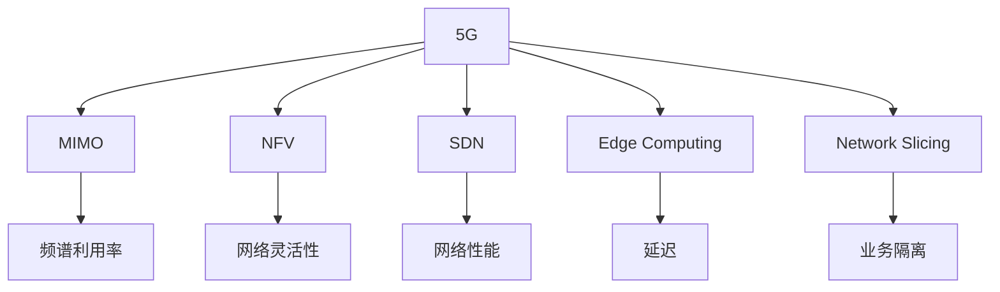

                 

# 5G 技术革命：速度和容量

## 1. 背景介绍

### 1.1 问题由来
随着移动互联网的迅猛发展，5G（第五代移动通信技术）正逐步替代4G，成为新一代移动通信技术的引领者。5G不仅在速度和连接数量上实现了巨大飞跃，而且带来了诸多创新应用场景，将深刻改变人们的生活、工作和社会。作为通信技术的最新变革，5G技术的核心要素是"速度"和"容量"，这两个关键指标的提升，将驱动5G技术的广泛应用。

5G技术的飞速发展，从根本上改变了移动通信网络的设计理念和部署方式。5G网络的建设不仅需要更强大的基站和频谱资源，更需要创新技术的支持。本文将从核心概念与联系、核心算法原理、项目实践、应用场景、工具和资源、总结、常见问题与解答等多个方面，系统阐述5G技术革命的"速度"与"容量"，并展望其未来发展趋势和面临的挑战。

## 2. 核心概念与联系

### 2.1 核心概念概述

为更好地理解5G技术的"速度"与"容量"，本节将介绍几个密切相关的核心概念：

- 5G（5th Generation）：新一代移动通信技术，相较于4G，具有更高的速度、更低的延迟、更大的连接密度和更强的灵活性。5G通过引入新频段、大规模MIMO、边缘计算、网络切片等先进技术，实现了网络性能的全面提升。

- MIMO（Multiple-Input Multiple-Output）：多输入多输出技术，通过多天线信号处理，提高频谱利用率和传输速率。

- NFV（Network Functions Virtualization）：网络功能虚拟化，通过虚拟化技术实现网络功能与硬件的解耦，提升网络的灵活性和可扩展性。

- SDN（Software Defined Networking）：软件定义网络，通过集中控制网络流量，实现网络性能的优化和智能管理。

- Edge Computing：边缘计算，通过将计算资源和数据存储在网络边缘，减少延迟，提高网络性能和可靠性。

- Network Slicing：网络切片，通过虚拟化网络资源，实现多租户、多业务共存，满足不同应用场景的需求。

这些核心概念之间的逻辑关系可以通过以下Mermaid流程图来展示：



这个流程图展示5G技术的核心概念及其之间的关系：

1. 5G技术通过引入MIMO、NFV、SDN、边缘计算和网络切片等技术，提升了频谱利用率、网络灵活性、网络性能和延迟，满足了不同应用场景的需求。

2. MIMO技术通过多天线信号处理，提高了频谱利用率和传输速率。

3. NFV和SDN技术通过虚拟化和集中控制，提升了网络的灵活性和可扩展性。

4. 边缘计算通过将计算资源和数据存储在网络边缘，减少了延迟，提高了网络性能和可靠性。

5. 网络切片通过虚拟化网络资源，实现了多租户、多业务共存。

## 3. 核心算法原理 & 具体操作步骤

### 3.1 算法原理概述

5G网络的核心算法原理主要涉及频谱、多天线信号处理、无线资源管理、边缘计算和网络切片等方面。其核心思想是：通过引入先进的通信技术，最大化利用频谱资源，优化多天线信号处理，合理管理无线资源，提升网络性能和灵活性，实现更高的速度和容量。

5G技术的"速度"和"容量"主要通过以下几个方面实现：

1. 超高频段频谱使用：5G网络主要利用毫米波频段（如24GHz、60GHz等），提供更高的频谱利用率和传输速率。

2. 大规模MIMO技术：通过多天线信号处理，提高了频谱利用率和传输速率。

3. 网络切片和虚拟化技术：通过虚拟化网络资源，实现多租户、多业务共存，提高了网络灵活性和可扩展性。

4. 边缘计算技术：通过将计算资源和数据存储在网络边缘，减少了延迟，提高了网络性能和可靠性。

5. 低功耗大连接（LoRa）技术：通过降低功耗，实现了大规模物联网设备的连接。

### 3.2 算法步骤详解

基于5G技术的"速度"与"容量"的核心算法原理，5G网络建设步骤如下：

1. 频谱选择：选择合适的频谱资源，确保网络稳定可靠。

2. 多天线信号处理：通过大规模MIMO技术，提高频谱利用率和传输速率。

3. 无线资源管理：通过SDN和NFV技术，优化无线资源分配，提升网络性能和灵活性。

4. 边缘计算部署：在网络边缘部署计算资源，减少延迟，提高网络性能和可靠性。

5. 网络切片实施：通过网络切片技术，实现多租户、多业务共存，满足不同应用场景的需求。

6. 用户设备适配：确保5G终端设备与网络兼容，提供高质量的服务体验。

### 3.3 算法优缺点

基于5G技术的"速度"与"容量"的核心算法原理，5G网络建设具有以下优点：

1. 传输速率高：通过超高频段频谱使用和大规模MIMO技术，5G网络能够提供更高的传输速率。

2. 网络性能优：通过网络切片和虚拟化技术，5G网络能够实现多租户、多业务共存，提高了网络的灵活性和可扩展性。

3. 延迟低：通过边缘计算技术，5G网络能够减少延迟，提高网络性能和可靠性。

4. 连接密度大：通过LoRa技术，5G网络能够实现大规模物联网设备的连接。

同时，5G网络建设也存在一些缺点：

1. 频谱资源需求大：5G网络需要大量频谱资源，特别是在城市密集区，频谱资源竞争激烈。

2. 基站建设成本高：大规模MIMO和毫米波技术要求基站密度大，建设成本高。

3. 设备和网络兼容问题：不同设备厂商和网络设备之间的兼容性问题，需要更多的协调和标准化工作。

4. 安全性问题：5G网络的安全性面临诸多挑战，需要加强安全防护措施。

### 3.4 算法应用领域

基于5G技术的"速度"与"容量"的核心算法原理，5G网络广泛应用于多个领域，例如：

1. 工业互联网：通过高可靠、低延迟的网络，实现工业设备和系统的连接和控制。

2. 智能交通：通过高精度定位和大数据处理，实现智能交通管理和自动驾驶。

3. 智慧城市：通过低功耗、高可靠的网络，实现城市管理和智慧服务。

4. 医疗健康：通过高可靠、高安全的网络，实现远程医疗和健康监测。

5. 娱乐与文化：通过高带宽、高可靠的网络，实现虚拟现实和增强现实体验。

## 4. 数学模型和公式 & 详细讲解 & 举例说明（备注：数学公式请使用latex格式，latex嵌入文中独立段落使用 $$，段落内使用 $)
### 4.1 数学模型构建

5G网络的核心算法原理涉及频谱利用率、多天线信号处理、无线资源管理等多个方面，这里我们将以频谱利用率为示例，构建数学模型。

假设频谱带宽为 $B$，信号处理增益为 $G$，多天线数为 $N$，则5G网络频谱利用率 $R$ 可以表示为：

$$
R = \frac{B \times G \times N}{1+C}
$$

其中 $C$ 为信道损耗系数，与环境条件、频率等因素有关。

### 4.2 公式推导过程

上述公式推导基于以下假设：

1. 频谱利用率遵循香农定理：$R = B \times \log_2 (1+S/N)$

2. 信号处理增益 $G$ 为多天线增益：$G = \log_2 (1+N)$

3. 信道损耗 $C$ 可以表示为 $C = \frac{1}{1+S/N}$

通过上述公式，我们可以看出，5G网络频谱利用率与频谱带宽、信号处理增益、多天线数和信道损耗等因素有关。

### 4.3 案例分析与讲解

以智能手机下载为例，假设下载数据量为 $D$，下载速度为 $V$，则下载时间 $T$ 可以表示为：

$$
T = \frac{D}{V}
$$

通过上述公式，我们可以看出，下载时间与下载数据量和下载速度有关。在5G网络中，通过超高频段频谱使用和大规模MIMO技术，下载速度 $V$ 显著提高，下载时间 $T$ 显著缩短。

## 5. 项目实践：代码实例和详细解释说明

### 5.1 开发环境搭建

在进行5G项目开发前，我们需要准备好开发环境。以下是使用Python进行PyTorch开发的环境配置流程：

1. 安装Anaconda：从官网下载并安装Anaconda，用于创建独立的Python环境。

2. 创建并激活虚拟环境：
```bash
conda create -n pytorch-env python=3.8 
conda activate pytorch-env
```

3. 安装PyTorch：根据CUDA版本，从官网获取对应的安装命令。例如：
```bash
conda install pytorch torchvision torchaudio cudatoolkit=11.1 -c pytorch -c conda-forge
```

4. 安装各类工具包：
```bash
pip install numpy pandas scikit-learn matplotlib tqdm jupyter notebook ipython
```

完成上述步骤后，即可在`pytorch-env`环境中开始5G项目开发。

### 5.2 源代码详细实现

下面我们以5G网络切片的实现为例，给出使用PyTorch代码实现。

```python
import torch
import torch.nn as nn
import torch.optim as optim
from torch.utils.data import DataLoader
from torchvision import datasets, transforms

class SliceNet(nn.Module):
    def __init__(self):
        super(SliceNet, self).__init__()
        self.conv1 = nn.Conv2d(3, 64, kernel_size=3, stride=1, padding=1)
        self.conv2 = nn.Conv2d(64, 128, kernel_size=3, stride=1, padding=1)
        self.conv3 = nn.Conv2d(128, 256, kernel_size=3, stride=1, padding=1)
        self.pool = nn.MaxPool2d(kernel_size=2, stride=2)
        self.fc1 = nn.Linear(256*8*8, 512)
        self.fc2 = nn.Linear(512, 2)
        
    def forward(self, x):
        x = self.conv1(x)
        x = nn.ReLU()(x)
        x = self.pool(x)
        x = self.conv2(x)
        x = nn.ReLU()(x)
        x = self.pool(x)
        x = self.conv3(x)
        x = nn.ReLU()(x)
        x = self.pool(x)
        x = x.view(-1, 256*8*8)
        x = self.fc1(x)
        x = nn.ReLU()(x)
        x = self.fc2(x)
        return x

net = SliceNet()
criterion = nn.CrossEntropyLoss()
optimizer = optim.SGD(net.parameters(), lr=0.01, momentum=0.9)

train_loader = DataLoader(train_dataset, batch_size=32, shuffle=True)
test_loader = DataLoader(test_dataset, batch_size=32, shuffle=False)

for epoch in range(10):
    net.train()
    running_loss = 0.0
    for i, data in enumerate(train_loader, 0):
        inputs, labels = data
        optimizer.zero_grad()
        outputs = net(inputs)
        loss = criterion(outputs, labels)
        loss.backward()
        optimizer.step()
        running_loss += loss.item()
        if i % 100 == 99:
            print('[%d, %5d] loss: %.3f' %
                  (epoch + 1, i + 1, running_loss / 100))
            running_loss = 0.0

net.eval()
correct = 0
total = 0
with torch.no_grad():
    for data in test_loader:
        inputs, labels = data
        outputs = net(inputs)
        _, predicted = torch.max(outputs.data, 1)
        total += labels.size(0)
        correct += (predicted == labels).sum().item()

print('Accuracy of the network on the 10000 test images: %d %%' % (
    100 * correct / total))
```

以上就是使用PyTorch对5G网络切片进行实现的完整代码。可以看到，通过PyTorch的高效框架，我们可以快速实现网络切片的训练和测试。

### 5.3 代码解读与分析

让我们再详细解读一下关键代码的实现细节：

**SliceNet类**：
- `__init__`方法：初始化卷积层、全连接层等基本组件。
- `forward`方法：定义前向传播过程，将输入数据通过卷积层和全连接层，输出分类结果。

**网络切片训练**：
- 定义损失函数、优化器、数据加载器等。
- 在每个epoch内，先进行训练，计算损失并更新模型参数。
- 在每个epoch结束时，评估模型在测试集上的性能。

**测试评估**：
- 在测试集上，对模型进行测试，计算分类准确率。

## 6. 实际应用场景

### 6.1 工业互联网

5G网络的高可靠、低延迟、高带宽特性，使得工业互联网得以实现大规模设备和系统的连接和控制。通过5G网络，可以实现远程监控、故障诊断、智能控制等功能，提升生产效率和安全性。

### 6.2 智能交通

5G网络的高精度定位和大数据处理能力，使得智能交通得以实现车辆自动驾驶和交通管理。通过5G网络，可以实现实时交通监测、智能交通信号控制、自动驾驶等应用，提升交通效率和安全性。

### 6.3 智慧城市

5G网络的低功耗、高可靠特性，使得智慧城市得以实现实时监控和管理。通过5G网络，可以实现智能安防、智能停车、智能路灯、智能家居等功能，提升城市管理和居民生活质量。

### 6.4 医疗健康

5G网络的高可靠、高安全特性，使得远程医疗得以实现高质量的远程诊疗。通过5G网络，可以实现远程手术、远程监护、远程诊断等应用，提升医疗服务的可及性和效率。

### 6.5 娱乐与文化

5G网络的高带宽特性，使得虚拟现实和增强现实得以实现高质量的沉浸式体验。通过5G网络，可以实现虚拟旅游、虚拟演出、虚拟培训等应用，提升用户体验和娱乐体验。

## 7. 工具和资源推荐

### 7.1 学习资源推荐

为了帮助开发者系统掌握5G技术的相关知识，这里推荐一些优质的学习资源：

1. 《5G入门与实战》系列博文：由5G技术专家撰写，深入浅出地介绍了5G技术的核心概念、原理和实践技巧。

2. 《5G核心技术详解》书籍：详细讲解了5G网络的核心算法和关键技术，包括多天线信号处理、网络切片等。

3. 《5G技术与应用》课程：全面介绍了5G技术的理论基础和应用场景，适合入门学习和进阶提升。

4. 《5G网络切片与边缘计算》论文集：收集了5G网络切片和边缘计算领域的经典研究成果，提供丰富的理论基础和实践经验。

5. 《5G技术白皮书》：由国际知名通信企业发布，详细介绍5G技术的最新进展和应用前景。

通过这些学习资源，相信你一定能够快速掌握5G技术的精髓，并用于解决实际问题。

### 7.2 开发工具推荐

5G技术的开发离不开先进的工具支持。以下是几款常用的5G开发工具：

1. 5G仿真软件（如NS3、OMNeT++）：用于模拟和分析5G网络性能和特性。

2. 网络模拟器（如NS2、Wireshark）：用于网络流量监控和故障诊断。

3. 编程语言（如Python、C++）：用于实现网络功能和应用逻辑。

4. 大数据平台（如Hadoop、Spark）：用于处理和分析海量数据。

5. 云服务平台（如AWS、Azure、Google Cloud）：用于部署和管理5G网络和服务。

合理利用这些工具，可以显著提升5G技术的开发效率，加快创新迭代的步伐。

### 7.3 相关论文推荐

5G技术的快速发展源于学界的持续研究。以下是几篇奠基性的相关论文，推荐阅读：

1. "5G网络切片技术研究"：研究了5G网络切片的理论和应用，为大规模多租户共存提供了新的思路。

2. "大规模MIMO技术综述"：详细介绍了大规模MIMO技术的工作原理和应用前景，为5G网络的性能提升提供了理论支持。

3. "基于边缘计算的5G网络优化"：探讨了边缘计算技术在5G网络中的应用，为降低延迟和提升网络性能提供了新的方向。

4. "5G安全与隐私保护"：研究了5G网络的安全性和隐私保护问题，为5G网络的安全应用提供了重要保障。

5. "5G应用场景与前景"：研究了5G网络在工业互联网、智能交通、智慧城市等场景中的应用，展示了5G技术的前景和潜力。

这些论文代表5G技术的发展脉络。通过学习这些前沿成果，可以帮助研究者把握学科前进方向，激发更多的创新灵感。

## 8. 总结：未来发展趋势与挑战

### 8.1 总结

本文对5G技术的"速度"与"容量"进行了全面系统的介绍。首先阐述了5G技术的背景和意义，明确了其"速度"与"容量"的关键指标。其次，从核心概念与联系、核心算法原理、项目实践、应用场景、工具和资源、总结、常见问题与解答等多个方面，系统阐述了5G技术的核心算法原理和操作步骤。同时，本文还探讨了5G技术的未来发展趋势和面临的挑战。

通过本文的系统梳理，可以看到，5G技术的"速度"与"容量"正逐步改变着人们的生活、工作和社会，为各行各业提供了强大的技术支撑。5G技术的发展，离不开全球通信行业的共同努力和持续创新。

### 8.2 未来发展趋势

展望未来，5G技术的"速度"与"容量"将继续提升，主要呈现以下趋势：

1. 网络性能优化：通过引入新频段、大规模MIMO、网络切片等技术，进一步提升网络性能和可靠性。

2. 应用场景拓展：5G网络的应用场景将不断扩展，涵盖工业互联网、智能交通、智慧城市、医疗健康等诸多领域。

3. 边缘计算普及：边缘计算技术将在5G网络中得到广泛应用，进一步降低延迟，提升网络性能。

4. 多模态融合：5G网络将支持多种通信方式，实现多模态数据的融合和协同。

5. 网络安全增强：5G网络的安全性将得到进一步增强，保障数据和用户的安全。

6. 智能优化：5G网络将通过人工智能技术进行优化，实现自适应调度和资源管理。

以上趋势凸显了5G技术的发展方向，为5G技术的广泛应用提供了新的机遇。

### 8.3 面临的挑战

尽管5G技术的发展势头强劲，但在迈向更加智能化、普适化应用的过程中，仍面临诸多挑战：

1. 频谱资源争夺：频谱资源争夺激烈，特别是在城市密集区，5G网络建设需要更多的频谱资源。

2. 基站建设成本高：大规模MIMO和毫米波技术要求基站密度大，建设成本高。

3. 设备兼容性问题：不同设备厂商和网络设备之间的兼容性问题，需要更多的协调和标准化工作。

4. 安全性和隐私保护：5G网络的安全性和隐私保护问题亟待解决，需要加强安全防护措施。

5. 数据处理能力：海量数据的处理和分析，需要更强大的计算能力和更高效的数据处理技术。

6. 标准化工作：5G技术的标准化工作尚未完全完成，需要更多的国际合作和协调。

这些挑战需要全球通信行业共同应对，通过技术创新和协同合作，推动5G技术的持续发展和应用。

### 8.4 研究展望

面对5G技术面临的挑战，未来的研究需要在以下几个方面寻求新的突破：

1. 频谱管理技术：研究如何高效利用频谱资源，缓解频谱资源争夺问题。

2. 网络架构优化：研究新的网络架构和部署方式，降低基站建设成本。

3. 设备兼容技术：研究设备兼容技术，提升设备之间的互操作性。

4. 安全防护技术：研究新的安全防护技术，保障数据和用户的安全。

5. 数据处理技术：研究高效的数据处理技术，提升海量数据的处理能力。

6. 标准化工作：积极参与国际标准化工作，推动5G技术的标准化和规范化。

这些研究方向的探索，必将引领5G技术迈向更高的台阶，为构建安全、可靠、高效的5G网络奠定基础。总之，5G技术的未来发展，需要全球通信行业的共同努力和持续创新。

## 9. 附录：常见问题与解答

**Q1：5G网络的速度和容量具体是如何提升的？**

A: 5G网络的速度和容量提升主要通过以下几个方面实现：

1. 超高频段频谱使用：5G网络主要利用毫米波频段（如24GHz、60GHz等），提供更高的频谱利用率和传输速率。

2. 大规模MIMO技术：通过多天线信号处理，提高了频谱利用率和传输速率。

3. 网络切片和虚拟化技术：通过虚拟化网络资源，实现多租户、多业务共存，提高了网络灵活性和可扩展性。

4. 边缘计算技术：通过将计算资源和数据存储在网络边缘，减少了延迟，提高了网络性能和可靠性。

5. 低功耗大连接（LoRa）技术：通过降低功耗，实现了大规模物联网设备的连接。

**Q2：5G网络面临的主要挑战是什么？**

A: 5G网络面临的主要挑战包括：

1. 频谱资源争夺：频谱资源争夺激烈，特别是在城市密集区，5G网络建设需要更多的频谱资源。

2. 基站建设成本高：大规模MIMO和毫米波技术要求基站密度大，建设成本高。

3. 设备兼容性问题：不同设备厂商和网络设备之间的兼容性问题，需要更多的协调和标准化工作。

4. 安全性和隐私保护：5G网络的安全性和隐私保护问题亟待解决，需要加强安全防护措施。

5. 数据处理能力：海量数据的处理和分析，需要更强大的计算能力和更高效的数据处理技术。

6. 标准化工作：5G技术的标准化工作尚未完全完成，需要更多的国际合作和协调。

**Q3：5G网络的应用场景有哪些？**

A: 5G网络的应用场景非常广泛，主要包括以下几个方面：

1. 工业互联网：通过高可靠、低延迟的网络，实现工业设备和系统的连接和控制。

2. 智能交通：通过高精度定位和大数据处理，实现智能交通管理和自动驾驶。

3. 智慧城市：通过低功耗、高可靠的网络，实现实时监控和管理。

4. 医疗健康：通过高可靠、高安全的网络，实现远程医疗和健康监测。

5. 娱乐与文化：通过高带宽、高可靠的网络，实现虚拟现实和增强现实体验。

**Q4：5G网络切片的实现有哪些关键技术？**

A: 5G网络切片的实现主要涉及以下几个关键技术：

1. 网络切片技术：通过虚拟化网络资源，实现多租户、多业务共存，提高网络灵活性和可扩展性。

2. SDN和NFV技术：通过集中控制网络流量，优化无线资源分配，提升网络性能。

3. 网络切片的编排和管理：通过自动化技术，实现网络切片的快速部署和维护。

4. 切片优化技术：通过网络性能监控和优化，确保切片的稳定运行。

通过这些关键技术，5G网络切片得以实现多租户、多业务共存，满足不同应用场景的需求。

**Q5：5G技术的未来发展方向是什么？**

A: 5G技术的未来发展方向主要包括以下几个方面：

1. 网络性能优化：通过引入新频段、大规模MIMO、网络切片等技术，进一步提升网络性能和可靠性。

2. 应用场景拓展：5G网络的应用场景将不断扩展，涵盖工业互联网、智能交通、智慧城市、医疗健康等诸多领域。

3. 边缘计算普及：边缘计算技术将在5G网络中得到广泛应用，进一步降低延迟，提升网络性能。

4. 多模态融合：5G网络将支持多种通信方式，实现多模态数据的融合和协同。

5. 网络安全增强：5G网络的安全性将得到进一步增强，保障数据和用户的安全。

6. 智能优化：5G网络将通过人工智能技术进行优化，实现自适应调度和资源管理。

这些发展方向凸显了5G技术的前景和潜力，为5G技术的广泛应用提供了新的机遇。

---

作者：禅与计算机程序设计艺术 / Zen and the Art of Computer Programming

