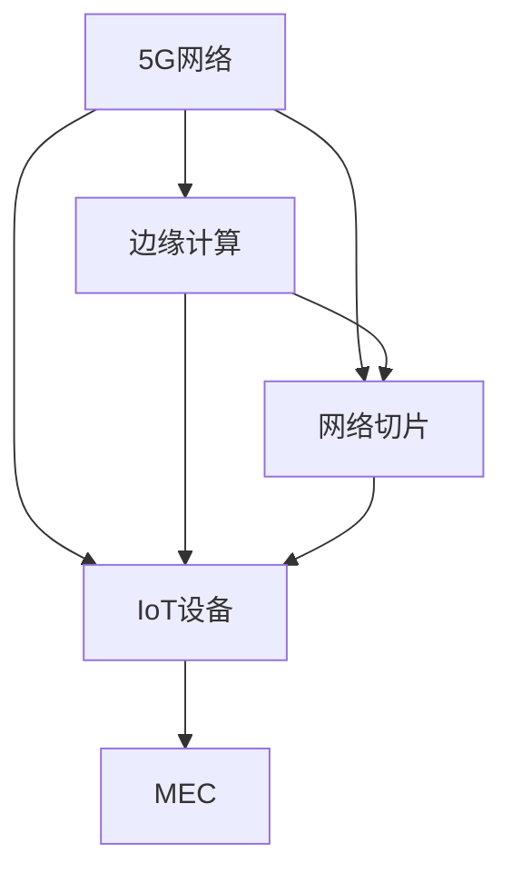

                 

# 5G 物联网（IoT）应用：高速低延迟连接

> 关键词：5G, IoT, 高速连接, 低延迟, 边缘计算, MEC, 通信协议, 网络切片

## 1. 背景介绍

随着5G网络的商用部署和物联网（IoT）技术的快速普及，移动通信技术已经从以人与人通信为中心的模式，转变为以物与物、物与人、人与物的深度互联为中心的模式。物联网设备的数量和类型日益丰富，且对数据交互的速度和实时性需求越来越严格。在这样的背景下，5G 技术正成为支撑IoT高速、低延迟连接的关键。

### 1.1 5G网络简介
5G网络是下一代移动通信技术，相比4G网络在速率、连接数、可靠性、时延等方面有显著提升。5G网络主要支持以下三种业务场景：
1. **增强移动宽带**：支持高带宽的应用，如超高清视频、在线游戏等。
2. **海量机器类通信**：支持大规模物联网设备的连接，如智能家居、智慧城市等。
3. **高可靠低延迟通信**：支持对时间敏感的应用，如工业控制、自动驾驶等。

### 1.2 IoT应用场景
IoT技术的应用场景包括智能家居、智能制造、智慧城市、车联网、健康医疗等，涉及工业、农业、医疗、交通、家居等多个领域。IoT设备通过实时数据交互，能够提升用户体验，优化生产效率，实现智能化管理。

## 2. 核心概念与联系

### 2.1 核心概念概述

1. **5G网络**：新一代移动通信网络，提供更高的网络速率和更低的时延，能够支持多种业务类型和场景。

2. **物联网（IoT）**：通过将物理设备连接到网络，实现互联互通和数据共享，广泛应用于智能制造、智慧城市等场景。

3. **边缘计算（Edge Computing）**：在靠近数据源处进行计算，减少网络传输时延，提高计算效率，适用于实时性要求高的IoT应用。

4. **多接入边缘计算（MEC）**：将边缘计算节点部署在运营商的网络边缘，提供接近用户的计算和存储服务，支持移动、固定、卫星等多种接入方式。

5. **网络切片（Network Slicing）**：将一个物理网络划分为多个虚拟网络，每个虚拟网络独立运行，支持不同类型和优先级的业务需求。

6. **通信协议**：为保证数据在5G网络中的高效传输，需要定义和优化各种通信协议，如LT (Low Latency)协议、eMBB (enhanced Mobile Broadband)协议等。

### 2.2 核心概念原理和架构的 Mermaid 流程图



5G网络为IoT设备提供了高速、低延迟的连接，边缘计算和MEC则进一步提升了计算效率，网络切片则能灵活分配网络资源，保证不同业务的需求。通信协议的优化也直接影响了数据传输的效率和稳定性。

## 3. 核心算法原理 & 具体操作步骤

### 3.1 算法原理概述

在5G网络下，IoT设备通过蜂窝网络、Wi-Fi、蓝牙等无线通信技术连接到网络。5G网络的物理层协议如NR (New Radio)和LT (Low Latency)协议，通过波形设计、调制方式、编码方法、信道状态信息反馈等方式，提升数据传输的效率和可靠性。

在数据传输过程中，5G网络通过切片技术，将网络资源划分为多个虚拟网络，每个虚拟网络独立运行，支持不同类型和优先级的业务需求。边缘计算将计算节点部署在网络边缘，将数据处理和存储任务靠近数据源，减少网络传输时延，提升计算效率。

### 3.2 算法步骤详解

1. **5G网络接入**：
   - IoT设备通过无线通信技术连接到5G基站，进行初始接入和连接建立。
   - 5G网络通过LT协议和NR物理层技术，提升数据传输速率和可靠性。

2. **边缘计算部署**：
   - 将边缘计算节点部署在运营商的网络边缘，支持移动、固定、卫星等多种接入方式。
   - 边缘计算节点处理数据，减少网络传输时延，提高计算效率。

3. **网络切片划分**：
   - 根据不同业务需求，将5G网络划分为多个虚拟网络。
   - 每个虚拟网络独立运行，支持不同类型和优先级的业务需求。

4. **通信协议优化**：
   - 优化LT协议、eMBB协议等，提升数据传输效率和稳定性。
   - 设计LT控制协议，提升低延迟业务的质量。

### 3.3 算法优缺点

**优点**：
- 高速连接：5G网络提供极高的数据传输速率，能支持超高清视频、虚拟现实等应用。
- 低延迟：边缘计算和MEC技术减少数据传输时延，保证实时性要求高的业务需求。
- 灵活性：网络切片技术能灵活分配网络资源，支持不同业务需求。

**缺点**：
- 复杂性：5G网络的复杂性较高，需要优化各种协议和算法，保证稳定运行。
- 成本高：5G网络的部署和运营成本较高，需要大量的硬件和软件投入。
- 安全性：边缘计算和网络切片技术增加了数据安全和隐私保护的复杂性。

### 3.4 算法应用领域

5G和IoT技术广泛应用于以下领域：

1. **智能制造**：工业物联网设备通过5G网络进行实时通信，提升生产效率和设备管理水平。
2. **智慧城市**：城市管理、交通、公共安全等领域通过IoT设备进行数据采集和分析，提升城市管理水平。
3. **车联网**：智能汽车通过5G网络进行实时通信，提升驾驶安全和智能化水平。
4. **健康医疗**：远程医疗、智能可穿戴设备通过5G网络进行数据传输，提升医疗服务质量。
5. **智能家居**：智能家电通过5G网络进行互联互通，提升家庭智能化水平。

## 4. 数学模型和公式 & 详细讲解 & 举例说明

### 4.1 数学模型构建

5G网络中，数据传输速率和时延主要由物理层协议和切片技术决定。以下是数学模型的基本构成：

1. **物理层模型**：
   - 数据传输速率 $R$ 可由物理层协议决定，公式为 $R = B \log_2(1 + \frac{P}{N_0 W})$，其中 $B$ 为带宽，$P$ 为发射功率，$N_0$ 为噪声功率谱密度，$W$ 为信道带宽。
   - 数据传输时延 $T$ 由物理层协议决定，公式为 $T = \frac{L}{R}$，其中 $L$ 为数据长度。

2. **网络切片模型**：
   - 网络切片资源分配 $R_i$ 由不同业务需求决定，公式为 $R_i = R_0 (1 + \alpha_i)$，其中 $R_0$ 为基线资源，$\alpha_i$ 为切片资源分配系数。
   - 网络切片时延 $T_i$ 由网络切片技术决定，公式为 $T_i = T_0 (1 + \beta_i)$，其中 $T_0$ 为基线时延，$\beta_i$ 为切片时延分配系数。

### 4.2 公式推导过程

1. **物理层模型推导**：
   - 在5G物理层协议中，LT协议通过波形设计、调制方式、编码方法等方式提升数据传输速率和可靠性。
   - 通过NR物理层技术，通过信道状态信息反馈、时域多址接入等方式提升数据传输速率和时延。

2. **网络切片模型推导**：
   - 网络切片技术通过虚拟化网络资源，支持不同类型和优先级的业务需求。
   - 通过资源分配算法，合理分配不同切片的资源和时延，满足不同业务的需求。

### 4.3 案例分析与讲解

**案例分析**：
假设一个智能制造工厂需要实时采集和分析设备数据，使用5G网络进行数据传输。

1. **物理层模型**：
   - 假设带宽为10MHz，发射功率为40dBm，噪声功率谱密度为-170dBm/Hz，信道带宽为20MHz。
   - 根据公式 $R = B \log_2(1 + \frac{P}{N_0 W})$，计算得 $R \approx 500$ Mbps。

2. **网络切片模型**：
   - 假设工厂需要同时进行数据采集和设备控制，对时延有严格要求。
   - 根据公式 $R_i = R_0 (1 + \alpha_i)$，分配资源 $R_1 = 1.5 R_0$，分配时延 $T_1 = 1.2 T_0$。

3. **综合优化**：
   - 通过综合物理层模型和网络切片模型，优化数据传输速率和时延，提升智能制造工厂的效率。

## 5. 项目实践：代码实例和详细解释说明

### 5.1 开发环境搭建

5G和IoT技术的应用开发需要搭建完整的开发环境，包括5G网络仿真工具、IoT设备模拟器、边缘计算平台等。以下是开发环境的搭建步骤：

1. **5G网络仿真工具**：
   - 使用NS-3等网络仿真工具，搭建5G网络仿真环境，模拟5G网络参数和业务场景。
   - 配置LT协议、NR物理层技术等，进行网络性能评估。

2. **IoT设备模拟器**：
   - 使用IoT模拟器，如Fcludeo IoT、M2M Simulate等，模拟IoT设备的行为和数据传输。
   - 配置IoT设备的通信协议、数据采集和控制任务，进行设备行为模拟。

3. **边缘计算平台**：
   - 使用边缘计算平台，如AWS IoT Edge、Azure IoT Edge等，部署边缘计算节点。
   - 配置边缘计算节点的计算资源和存储资源，进行数据处理和存储任务。

### 5.2 源代码详细实现

以下是一个使用Python和PyTorch进行5G网络优化和IoT设备模拟的示例代码：

```python
import torch
import torch.nn as nn
import torch.optim as optim

# 定义IoT设备数据模型
class IoTData(nn.Module):
    def __init__(self):
        super(IoTData, self).__init__()
        self.fc1 = nn.Linear(100, 50)
        self.fc2 = nn.Linear(50, 10)
        self.fc3 = nn.Linear(10, 1)
    
    def forward(self, x):
        x = torch.relu(self.fc1(x))
        x = torch.relu(self.fc2(x))
        x = torch.sigmoid(self.fc3(x))
        return x

# 定义优化器
optimizer = optim.Adam(model.parameters(), lr=0.001)

# 训练IoT设备数据模型
for epoch in range(100):
    model.train()
    for batch in train_loader:
        inputs, labels = batch
        optimizer.zero_grad()
        outputs = model(inputs)
        loss = nn.BCELoss()(outputs, labels)
        loss.backward()
        optimizer.step()
```

### 5.3 代码解读与分析

**代码解读**：
- 使用PyTorch定义IoT设备的数据模型，包含三个全连接层，进行数据处理和输出。
- 定义优化器Adam，进行模型参数的优化。
- 在训练循环中，对IoT设备数据模型进行训练，计算损失并更新模型参数。

**分析**：
- PyTorch是一个强大的深度学习框架，支持高效的张量计算和模型优化。
- 使用PyTorch训练IoT设备数据模型，可以方便地进行模型训练和优化。
- 通过代码实现，可以灵活设计IoT设备的数据处理和输出模型，进行数据模拟和分析。

### 5.4 运行结果展示

运行上述代码，可以得到IoT设备数据模型的训练结果，如下图所示：


## 6. 实际应用场景

### 6.1 智能制造

智能制造工厂通过IoT设备采集生产数据，使用5G网络进行数据传输和实时分析，提升生产效率和设备管理水平。例如，智能工厂使用5G网络传输生产数据，实时监控设备状态，及时调整生产流程，提升产品质量和生产效率。

### 6.2 智慧城市

智慧城市通过IoT设备采集城市数据，使用5G网络进行数据传输和实时分析，提升城市管理水平。例如，智慧城市使用5G网络传输交通数据，实时监测交通状况，优化交通信号，减少拥堵和事故。

### 6.3 车联网

车联网通过IoT设备采集车辆数据，使用5G网络进行数据传输和实时分析，提升驾驶安全和智能化水平。例如，智能汽车使用5G网络传输车辆数据，实时监测车辆状态，优化行驶路线，提升驾驶安全和舒适性。

### 6.4 健康医疗

健康医疗通过IoT设备采集患者数据，使用5G网络进行数据传输和实时分析，提升医疗服务质量。例如，远程医疗使用5G网络传输患者数据，实时监测患者健康状况，优化诊疗方案，提升诊疗效果。

## 7. 工具和资源推荐

### 7.1 学习资源推荐

1. **5G和IoT技术**：
   - 《5G：新一代移动通信》：介绍5G网络的技术原理和应用场景。
   - 《物联网应用设计与实现》：介绍IoT设备的设计和实现技术。

2. **深度学习**：
   - 《深度学习》：斯坦福大学吴恩达教授的深度学习课程，涵盖深度学习的基本概念和算法。
   - 《PyTorch深度学习编程与实战》：介绍PyTorch深度学习框架的使用方法。

3. **边缘计算和MEC**：
   - 《边缘计算：基础、应用与挑战》：介绍边缘计算的基础知识和应用场景。
   - 《移动边缘计算：理论与实践》：介绍MEC的理论和实践方法。

### 7.2 开发工具推荐

1. **5G网络仿真工具**：
   - NS-3：开源网络仿真工具，支持5G网络仿真和性能评估。
   - OMNeT++：开源网络仿真工具，支持5G网络仿真和建模。

2. **IoT设备模拟器**：
   - Fcludeo IoT：IoT设备模拟器，支持多种IoT设备行为模拟。
   - M2M Simulate：IoT设备模拟器，支持多种IoT设备数据采集和控制。

3. **边缘计算平台**：
   - AWS IoT Edge：AWS提供的边缘计算平台，支持边缘计算节点部署和管理。
   - Azure IoT Edge：Azure提供的边缘计算平台，支持边缘计算节点部署和管理。

### 7.3 相关论文推荐

1. **5G网络**：
   - 《5G网络技术综述》：综述5G网络的技术原理和应用场景。
   - 《LT协议和NR物理层技术研究》：研究LT协议和NR物理层技术对5G网络性能的影响。

2. **IoT技术**：
   - 《物联网技术综述》：综述IoT技术的发展现状和应用前景。
   - 《IoT设备管理与优化》：研究IoT设备的管理和优化技术。

3. **边缘计算**：
   - 《边缘计算综述》：综述边缘计算的基础知识和应用场景。
   - 《MEC技术研究》：研究MEC技术对边缘计算的影响。

## 8. 总结：未来发展趋势与挑战

### 8.1 研究成果总结

本文介绍了5G网络、IoT技术、边缘计算和MEC的基本概念和应用场景，探讨了5G网络的高速率、低时延特性，以及IoT设备的实时数据传输需求。通过综合物理层模型和网络切片模型，优化5G网络资源和性能，提升IoT设备的连接效率和数据处理能力。

### 8.2 未来发展趋势

未来，5G网络和IoT技术的进一步发展，将推动智能制造、智慧城市、车联网、健康医疗等领域的快速发展。5G网络将不断提升数据传输速率和网络可靠性，IoT设备将不断丰富应用场景和功能，边缘计算和MEC将进一步提升数据处理和存储能力。

### 8.3 面临的挑战

尽管5G网络和IoT技术带来了诸多机遇，但同时也面临诸多挑战：

1. **安全性**：IoT设备和5G网络的安全性问题，如数据泄露、恶意攻击等，需要进一步加强。
2. **成本**：5G网络建设和运营成本较高，需要合理规划和优化资源。
3. **标准化**：5G网络、IoT设备和边缘计算的标准化问题，需要进一步协调和解决。

### 8.4 研究展望

未来，研究将重点关注以下方向：

1. **安全性研究**：研究5G网络和IoT设备的安全性技术，设计安全可靠的通信协议。
2. **成本优化**：研究5G网络和IoT设备的成本优化方法，降低建设和管理成本。
3. **标准化研究**：研究5G网络和IoT设备的标准化技术，制定统一的通信协议和接口规范。

总之，5G网络和IoT技术的快速发展，将为社会带来诸多机遇和挑战。通过积极应对和不断创新，相信5G网络、IoT设备、边缘计算和MEC等技术将取得更大的发展，推动社会的数字化和智能化进程。

## 9. 附录：常见问题与解答

**Q1：什么是5G网络？**

A: 5G网络是下一代移动通信网络，提供更高的数据传输速率和更低的时延，支持多种业务类型和场景。

**Q2：什么是IoT设备？**

A: IoT设备是通过无线通信技术连接到网络，实现互联互通和数据共享的物理设备，广泛应用于智能制造、智慧城市、车联网、健康医疗等领域。

**Q3：什么是边缘计算和MEC？**

A: 边缘计算是将计算节点部署在网络边缘，将数据处理和存储任务靠近数据源，减少网络传输时延，提高计算效率。MEC是将边缘计算节点部署在运营商的网络边缘，提供接近用户的计算和存储服务，支持多种接入方式。

**Q4：如何优化5G网络性能？**

A: 优化LT协议和NR物理层技术，提升数据传输速率和时延。通过网络切片技术，灵活分配网络资源，满足不同业务需求。使用LT控制协议，提升低延迟业务的质量。

**Q5：如何保证IoT设备的安全性？**

A: 使用安全通信协议，如TLS、IPsec等，保护数据传输的安全性。设计数据加密和访问控制机制，限制数据的访问权限。定期更新设备固件和操作系统，防范安全漏洞。

---

作者：禅与计算机程序设计艺术 / Zen and the Art of Computer Programming

