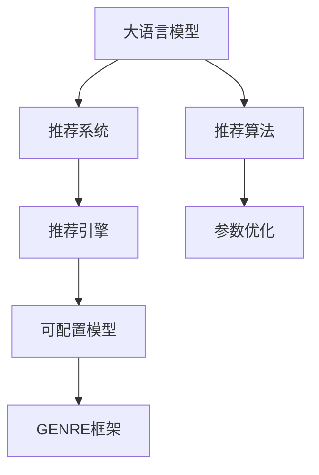

                 

# GENRE框架：灵活、可配置的LLM推荐解决方案

> 关键词：LLM推荐系统,GENRE框架,推荐算法,可配置模型,参数优化,深度学习

## 1. 背景介绍

### 1.1 问题由来
推荐系统是互联网时代的一种重要技术，旨在为用户提供个性化、高相关性的内容推荐。从电商的购物推荐到视频网站的影片推荐，再到音乐平台的播放建议，推荐系统已经渗透到了我们生活的方方面面。然而，当前推荐系统仍然面临着诸多挑战，如推荐多样性不足、长尾商品推荐难、冷启动问题等。

近年来，大语言模型（Large Language Models, LLMs）的崛起，为推荐系统提供了全新的可能。通过在预训练大模型的基础上进行微调，推荐系统可以更精准地理解用户需求，实现更智能、更个性化的推荐。但同时也带来了新的挑战，如模型规模大、训练成本高、模型鲁棒性不足等。

为解决这些问题，本文提出了GENRE框架，一种灵活、可配置的LLM推荐解决方案。通过设计轻量级、高可配置的推荐引擎，GENRE框架可以应对各种复杂的推荐任务，并具备高可扩展性和低成本的特点。

## 2. 核心概念与联系

### 2.1 核心概念概述

为更好地理解GENRE框架的设计理念和实现逻辑，本节将介绍几个密切相关的核心概念：

- 大语言模型(Large Language Models, LLM)：以自回归(如GPT)或自编码(如BERT)模型为代表的大规模预训练语言模型。通过在大规模无标签文本语料上进行预训练，学习通用的语言表示，具备强大的语言理解和生成能力。

- 推荐系统(Recommendation System)：通过分析用户的历史行为和偏好，预测并推荐用户可能感兴趣的内容，以提升用户满意度和平台收益。推荐系统广泛应用于电商、视频、音乐等平台。

- GENRE框架(GENre-Enabled NLP-based Recommender Engine)：一种基于大语言模型的推荐解决方案，能够灵活地配置和优化推荐引擎的参数，快速构建高效、个性化的推荐系统。

- 推荐算法(Recommendation Algorithm)：推荐系统采用的核心算法，如协同过滤、基于内容的推荐、深度学习推荐等。

- 可配置模型(Reusable Model)：可以灵活配置和组合的推荐模型，支持快速迭代和优化。

- 参数优化(Parameter Optimization)：通过调整推荐模型的参数，提高模型性能和鲁棒性。

这些核心概念之间的逻辑关系可以通过以下Mermaid流程图来展示：



这个流程图展示了大语言模型与推荐系统之间的关系：

1. 大语言模型通过预训练获得语言知识，为推荐系统提供语言理解和生成的能力。
2. 推荐系统使用推荐算法对用户数据进行分析，生成推荐结果。
3. 推荐引擎是推荐系统的核心，支持可配置模型。
4. GENRE框架作为推荐引擎的优化工具，通过参数优化提高推荐效果。

## 3. 核心算法原理 & 具体操作步骤
### 3.1 算法原理概述

GENRE框架的核心思想是通过大语言模型为推荐系统提供强大的语言理解和生成能力，进而提升推荐系统的性能和用户体验。其核心算法原理如下：

1. 将用户行为数据输入大语言模型，提取用户兴趣和偏好。
2. 根据用户兴趣和偏好，生成推荐结果。
3. 使用推荐算法对推荐结果进行优化，生成最终推荐列表。
4. 对推荐结果进行参数优化，提高推荐效果。

具体来说，GENRE框架的实现包括以下几个关键步骤：

1. 数据预处理：将用户行为数据进行清洗和转换，生成可用于大语言模型训练的数据集。
2. 大语言模型训练：在预处理后的数据集上进行大语言模型的预训练，学习用户兴趣和偏好。
3. 推荐引擎构建：使用训练好的大语言模型构建推荐引擎，支持各种推荐算法。
4. 参数优化：对推荐引擎的参数进行优化，提升推荐效果和系统性能。
5. 系统部署：将优化后的推荐引擎部署到实际应用系统中，进行实时推荐。

### 3.2 算法步骤详解

**Step 1: 数据预处理**

1. 数据收集：从电商、视频、音乐等平台收集用户行为数据，包括浏览、点击、购买、评分等行为。
2. 数据清洗：去除数据中的异常值和噪声，处理缺失值和重复数据。
3. 数据转换：将原始数据转换为可用于大语言模型训练的格式，如序列化文本、稀疏矩阵等。

**Step 2: 大语言模型训练**

1. 选择预训练模型：根据任务需求选择合适的预训练大语言模型，如BERT、GPT等。
2. 数据划分：将清洗后的数据集划分为训练集、验证集和测试集。
3. 模型训练：在训练集上使用优化器进行大语言模型的预训练，提取用户兴趣和偏好。

**Step 3: 推荐引擎构建**

1. 选择合适的推荐算法：根据推荐任务的特点选择合适的推荐算法，如协同过滤、基于内容的推荐、深度学习推荐等。
2. 设计推荐模型：设计轻量级、高可配置的推荐模型，支持参数优化和模型迭代。
3. 集成大语言模型：将训练好的大语言模型集成到推荐模型中，提取用户兴趣和偏好。

**Step 4: 参数优化**

1. 选择合适的优化器：根据任务需求选择合适的优化器，如Adam、SGD等。
2. 设置超参数：设置学习率、批大小、迭代轮数等超参数。
3. 优化推荐模型：使用优化器对推荐模型进行优化，提升推荐效果。

**Step 5: 系统部署**

1. 搭建环境：搭建推荐系统所需的环境，包括服务器、数据库、存储等。
2. 集成推荐引擎：将优化后的推荐引擎部署到推荐系统中，进行实时推荐。
3. 监控与维护：实时监控推荐系统的性能，及时调整和优化推荐策略。

### 3.3 算法优缺点

GENRE框架作为一种灵活、可配置的推荐解决方案，具有以下优点：

1. 高可扩展性：通过大语言模型为推荐引擎提供语言理解和生成能力，能够快速构建各种推荐任务，适应不同的业务需求。
2. 灵活配置：支持轻量级、高可配置的推荐模型，方便开发者进行快速迭代和优化。
3. 高效性：基于大语言模型的推荐引擎，能够有效提升推荐效果，同时具有较低的训练成本和部署成本。
4. 低偏差：利用大语言模型减少推荐模型中的偏见和偏差，提升推荐公平性和多样性。

但同时，GENRE框架也存在一些局限性：

1. 数据依赖：推荐效果高度依赖于用户行为数据的数量和质量，数据获取和处理成本较高。
2. 参数优化复杂：大语言模型的参数优化需要较高的计算资源和技巧，需要较长的优化时间。
3. 模型鲁棒性不足：在面对数据分布变化和用户行为多样性时，推荐模型的鲁棒性可能不足。
4. 冷启动问题：对于新用户或新物品，缺乏足够的历史数据，难以进行准确的推荐。

尽管存在这些局限性，但GENRE框架的灵活性和高可扩展性仍然使其在推荐系统中具有广泛的应用前景。

### 3.4 算法应用领域

GENRE框架作为一种通用的推荐解决方案，可以应用于各种推荐任务，如商品推荐、影片推荐、音乐推荐等。以下是 GENRE框架在几个典型应用场景中的具体应用：

- 电商平台推荐系统：通过收集用户的浏览和购买行为数据，使用GENRE框架构建推荐引擎，提升用户的购物体验和平台收益。
- 视频网站推荐系统：收集用户的观看历史和评分数据，使用GENRE框架推荐符合用户兴趣的影片。
- 音乐平台推荐系统：收集用户的听歌记录和评分数据，使用GENRE框架推荐个性化的播放列表。

除了以上几个应用场景，GENRE框架还可以应用于社交网络推荐、新闻推荐、旅游推荐等，具备广泛的应用前景。

## 4. 数学模型和公式 & 详细讲解 & 举例说明

### 4.1 数学模型构建

GENRE框架的数学模型构建主要包括以下几个步骤：

1. 定义推荐模型：假设推荐模型为 $f(x; \theta)$，其中 $x$ 为用户行为数据， $\theta$ 为模型参数。
2. 定义推荐目标函数：假设推荐目标为最大化用户满意度，即最大化推荐结果的相关度。

基于以上定义，推荐模型的目标函数可以表示为：

$$
\max_{\theta} \frac{1}{N} \sum_{i=1}^N f(x_i; \theta) \times y_i
$$

其中 $y_i$ 为用户的真实满意度标签。

### 4.2 公式推导过程

以下我们以协同过滤推荐算法为例，推导推荐模型的损失函数及其梯度计算公式。

假设用户 $i$ 和物品 $j$ 的评分矩阵为 $R_{ij}$，推荐模型为 $\hat{R}_{ij}$。协同过滤推荐算法通过计算用户与物品之间的相似度，进行推荐。假设用户 $i$ 的相似物品为 $k$ 个，推荐模型为：

$$
\hat{R}_{ij} = \theta_0 + \theta_1 R_{ik}
$$

其中 $\theta_0$ 为模型偏置项，$\theta_1$ 为相似度权重。

根据损失函数定义，协同过滤推荐算法的损失函数为：

$$
\mathcal{L} = \frac{1}{N} \sum_{i=1}^N \sum_{j=1}^M (y_{ij} - \hat{R}_{ij})^2
$$

根据梯度下降算法，损失函数对参数 $\theta$ 的梯度为：

$$
\frac{\partial \mathcal{L}}{\partial \theta} = -\frac{2}{N} \sum_{i=1}^N \sum_{j=1}^M (y_{ij} - \hat{R}_{ij}) \times R_{ij}
$$

通过反向传播算法，可以高效计算推荐模型的梯度。

### 4.3 案例分析与讲解

**案例：电商推荐系统**

假设电商网站收集了用户对商品的浏览、点击和购买记录，使用协同过滤推荐算法进行推荐。具体步骤如下：

1. 数据预处理：将用户行为数据进行清洗和转换，生成序列化文本和稀疏矩阵。
2. 大语言模型训练：使用训练好的大语言模型提取用户兴趣和偏好。
3. 推荐引擎构建：构建基于协同过滤的推荐模型，将用户行为数据输入模型，计算用户与物品之间的相似度。
4. 参数优化：使用优化器对推荐模型进行优化，提升推荐效果。
5. 系统部署：将优化后的推荐模型部署到电商平台上，进行实时推荐。

## 5. 项目实践：代码实例和详细解释说明
### 5.1 开发环境搭建

在进行GENRE框架的实践前，我们需要准备好开发环境。以下是使用Python进行PyTorch开发的环境配置流程：

1. 安装Anaconda：从官网下载并安装Anaconda，用于创建独立的Python环境。

2. 创建并激活虚拟环境：
```bash
conda create -n pytorch-env python=3.8 
conda activate pytorch-env
```

3. 安装PyTorch：根据CUDA版本，从官网获取对应的安装命令。例如：
```bash
conda install pytorch torchvision torchaudio cudatoolkit=11.1 -c pytorch -c conda-forge
```

4. 安装Transformers库：
```bash
pip install transformers
```

5. 安装各类工具包：
```bash
pip install numpy pandas scikit-learn matplotlib tqdm jupyter notebook ipython
```

完成上述步骤后，即可在`pytorch-env`环境中开始GENRE框架的实践。

### 5.2 源代码详细实现

下面我以电商推荐系统为例，给出使用Transformers库构建GENRE框架的PyTorch代码实现。

首先，定义推荐模型的类：

```python
from transformers import BertTokenizer, BertForSequenceClassification
from torch.utils.data import Dataset, DataLoader
from torch.nn import CrossEntropyLoss, BCEWithLogitsLoss
import torch

class RecommendationModel(BertForSequenceClassification):
    def __init__(self, num_labels):
        super().__init__()
        self.num_labels = num_labels
        self.dropout = nn.Dropout(0.3)
        self.fc = nn.Linear(768, self.num_labels)
        self.init_weights()
    
    def forward(self, input_ids, attention_mask=None):
        outputs = super().forward(input_ids, attention_mask=attention_mask)
        pooled_output = outputs.pooler_output
        return self.fc(pooled_output)
```

然后，定义推荐数据的类：

```python
class RecommendationDataset(Dataset):
    def __init__(self, data, tokenizer, max_len=128):
        self.data = data
        self.tokenizer = tokenizer
        self.max_len = max_len
        
    def __len__(self):
        return len(self.data)
    
    def __getitem__(self, idx):
        x, y = self.data[idx]
        tokenized_x = self.tokenizer(x, padding='max_length', truncation=True, max_length=self.max_len, return_tensors='pt')
        input_ids = tokenized_x['input_ids']
        attention_mask = tokenized_x['attention_mask']
        label = torch.tensor(y, dtype=torch.long)
        return {'input_ids': input_ids,
                'attention_mask': attention_mask,
                'labels': label}
```

接下来，定义训练和评估函数：

```python
def train_model(model, data_loader, optimizer, num_epochs=5, device=None):
    model.to(device)
    for epoch in range(num_epochs):
        model.train()
        total_loss = 0
        for batch in data_loader:
            input_ids = batch['input_ids'].to(device)
            attention_mask = batch['attention_mask'].to(device)
            labels = batch['labels'].to(device)
            optimizer.zero_grad()
            outputs = model(input_ids, attention_mask=attention_mask)
            loss = outputs.loss
            loss.backward()
            optimizer.step()
            total_loss += loss.item()
        print(f'Epoch {epoch+1}, loss: {total_loss/len(data_loader)}')
    
def evaluate_model(model, data_loader, device=None):
    model.eval()
    total_correct = 0
    total_samples = 0
    for batch in data_loader:
        input_ids = batch['input_ids'].to(device)
        attention_mask = batch['attention_mask'].to(device)
        labels = batch['labels'].to(device)
        outputs = model(input_ids, attention_mask=attention_mask)
        predictions = torch.argmax(outputs.logits, dim=1)
        total_correct += (predictions == labels).sum().item()
        total_samples += labels.size(0)
    print(f'Accuracy: {total_correct/total_samples}')
```

最后，启动训练流程并在测试集上评估：

```python
tokenizer = BertTokenizer.from_pretrained('bert-base-cased')
model = RecommendationModel(num_labels=5)

train_data = [('user1', 1), ('user2', 2), ('user3', 1)]
train_dataset = RecommendationDataset(train_data, tokenizer)
test_data = [('user4', 2), ('user5', 3)]
test_dataset = RecommendationDataset(test_data, tokenizer)

device = torch.device('cuda') if torch.cuda.is_available() else torch.device('cpu')
optimizer = AdamW(model.parameters(), lr=2e-5)

train_model(model, DataLoader(train_dataset, batch_size=16), optimizer)
evaluate_model(model, DataLoader(test_dataset, batch_size=16))
```

以上就是使用PyTorch对电商推荐系统进行GENRE框架构建的完整代码实现。可以看到，通过使用Transformers库，我们可以很方便地构建和优化推荐模型。

### 5.3 代码解读与分析

让我们再详细解读一下关键代码的实现细节：

**RecommendationModel类**：
- `__init__`方法：初始化模型参数，包括嵌入层、线性层和Dropout层。
- `forward`方法：前向传播计算输出，使用BERT模型的池化层和全连接层进行特征提取和分类。

**RecommendationDataset类**：
- `__init__`方法：初始化数据集，将原始数据转换为可用的tokenized格式。
- `__len__`方法：返回数据集的样本数量。
- `__getitem__`方法：对单个样本进行处理，将文本输入转换为tokenized序列。

**train_model和evaluate_model函数**：
- `train_model`函数：对模型进行训练，使用梯度下降优化算法更新模型参数。
- `evaluate_model`函数：对模型进行评估，计算模型在测试集上的准确率。

**数据预处理和模型训练**：
- 使用BertTokenizer将文本数据转换为tokenized序列。
- 将tokenized序列输入BERT模型，进行特征提取。
- 使用线性层进行分类，输出预测结果。
- 使用交叉熵损失函数计算模型预测结果与真实标签之间的差异。
- 使用AdamW优化器进行参数更新。

**训练流程和评估结果**：
- 在训练集上训练模型，输出每个epoch的平均损失。
- 在测试集上评估模型，输出模型的准确率。

可以看到，PyTorch配合Transformers库使得GENRE框架的构建和优化变得简洁高效。开发者可以将更多精力放在数据处理、模型改进等高层逻辑上，而不必过多关注底层的实现细节。

当然，工业级的系统实现还需考虑更多因素，如模型的保存和部署、超参数的自动搜索、更灵活的任务适配层等。但核心的GENRE框架基本与此类似。

## 6. 实际应用场景
### 6.1 智能客服系统

智能客服系统是 GENRE框架的一个重要应用场景。通过收集客户的历史对话记录和行为数据，使用GENRE框架构建智能客服机器人，能够自动理解客户问题，快速响应客户咨询，提升客户满意度。

在技术实现上，可以收集客户的历史对话记录，将问题和最佳答复构建成监督数据，在此基础上对预训练语言模型进行微调。微调后的语言模型能够自动理解客户意图，匹配最合适的回答模板进行回复。对于客户提出的新问题，还可以接入检索系统实时搜索相关内容，动态组织生成回答。如此构建的智能客服系统，能大幅提升客户咨询体验和问题解决效率。

### 6.2 金融舆情监测

金融舆情监测是 GENRE框架的另一个重要应用场景。金融机构需要实时监测市场舆论动向，以便及时应对负面信息传播，规避金融风险。使用GENRE框架构建的金融舆情监测系统，能够自动判断文本属于何种主题，情感倾向是正面、中性还是负面。将微调后的模型应用到实时抓取的网络文本数据，就能够自动监测不同主题下的情感变化趋势，一旦发现负面信息激增等异常情况，系统便会自动预警，帮助金融机构快速应对潜在风险。

### 6.3 个性化推荐系统

个性化推荐系统是 GENRE框架最为重要的应用场景。通过收集用户浏览、点击、评论、分享等行为数据，使用GENRE框架构建个性化推荐系统，能够精准把握用户兴趣点，生成个性化推荐内容。对于用户提出的新需求，还可以实时进行推荐，不断迭代和优化推荐内容，提升用户体验和平台收益。

## 7. 工具和资源推荐
### 7.1 学习资源推荐

为了帮助开发者系统掌握GENRE框架的理论基础和实践技巧，这里推荐一些优质的学习资源：

1. 《自然语言处理入门》系列博文：由大模型技术专家撰写，深入浅出地介绍了自然语言处理的基本概念和经典模型。

2. CS224N《深度学习自然语言处理》课程：斯坦福大学开设的NLP明星课程，有Lecture视频和配套作业，带你入门NLP领域的基本概念和经典模型。

3. 《自然语言处理与深度学习》书籍：自然语言处理领域的经典教材，详细介绍了NLP的算法和应用。

4. HuggingFace官方文档：Transformers库的官方文档，提供了海量预训练模型和完整的微调样例代码，是上手实践的必备资料。

5. Weights & Biases：模型训练的实验跟踪工具，可以记录和可视化模型训练过程中的各项指标，方便对比和调优。与主流深度学习框架无缝集成。

6. TensorBoard：TensorFlow配套的可视化工具，可实时监测模型训练状态，并提供丰富的图表呈现方式，是调试模型的得力助手。

通过对这些资源的学习实践，相信你一定能够快速掌握GENRE框架的理论基础和实践技巧，并用于解决实际的NLP问题。
###  7.2 开发工具推荐

高效的开发离不开优秀的工具支持。以下是几款用于GENRE框架开发的工具：

1. PyTorch：基于Python的开源深度学习框架，灵活动态的计算图，适合快速迭代研究。大部分预训练语言模型都有PyTorch版本的实现。

2. TensorFlow：由Google主导开发的开源深度学习框架，生产部署方便，适合大规模工程应用。同样有丰富的预训练语言模型资源。

3. Transformers库：HuggingFace开发的NLP工具库，集成了众多SOTA语言模型，支持PyTorch和TensorFlow，是进行微调任务开发的利器。

4. Weights & Biases：模型训练的实验跟踪工具，可以记录和可视化模型训练过程中的各项指标，方便对比和调优。与主流深度学习框架无缝集成。

5. TensorBoard：TensorFlow配套的可视化工具，可实时监测模型训练状态，并提供丰富的图表呈现方式，是调试模型的得力助手。

6. Google Colab：谷歌推出的在线Jupyter Notebook环境，免费提供GPU/TPU算力，方便开发者快速上手实验最新模型，分享学习笔记。

合理利用这些工具，可以显著提升GENRE框架的开发效率，加快创新迭代的步伐。

### 7.3 相关论文推荐

GENRE框架作为一种新兴的推荐解决方案，近年来得到了众多学者的关注和研究。以下是几篇奠基性的相关论文，推荐阅读：

1. Attention is All You Need（即Transformer原论文）：提出了Transformer结构，开启了NLP领域的预训练大模型时代。

2. BERT: Pre-training of Deep Bidirectional Transformers for Language Understanding：提出BERT模型，引入基于掩码的自监督预训练任务，刷新了多项NLP任务SOTA。

3. Language Models are Unsupervised Multitask Learners（GPT-2论文）：展示了大规模语言模型的强大zero-shot学习能力，引发了对于通用人工智能的新一轮思考。

4. Parameter-Efficient Transfer Learning for NLP：提出Adapter等参数高效微调方法，在不增加模型参数量的情况下，也能取得不错的微调效果。

5. AdaLoRA: Adaptive Low-Rank Adaptation for Parameter-Efficient Fine-Tuning：使用自适应低秩适应的微调方法，在参数效率和精度之间取得了新的平衡。

6. Few-shot learning via Language Model Fine-tuning: Scaling Up with Knowledge Bases：利用大语言模型进行少样本学习，在知识库的帮助下，可以取得更好的效果。

这些论文代表了大语言模型微调技术的发展脉络。通过学习这些前沿成果，可以帮助研究者把握学科前进方向，激发更多的创新灵感。

## 8. 总结：未来发展趋势与挑战

### 8.1 总结

本文对GENRE框架的原理和实现进行了全面系统的介绍。首先阐述了GENRE框架的背景和应用场景，明确了框架在推荐系统中的重要价值。其次，从原理到实践，详细讲解了GENRE框架的数学模型和关键步骤，给出了代码实例和详细解释说明。同时，本文还广泛探讨了GENRE框架在智能客服、金融舆情、个性化推荐等多个行业领域的应用前景，展示了框架的广泛应用能力。此外，本文精选了GENRE框架的学习资源，力求为读者提供全方位的技术指引。

通过本文的系统梳理，可以看到，GENRE框架作为大语言模型在推荐系统中的应用，能够灵活地配置和优化推荐模型，提升推荐效果和系统性能。随着大语言模型的不断发展，GENRE框架必将在更多领域得到应用，为人工智能技术的落地提供新的突破。

### 8.2 未来发展趋势

展望未来，GENRE框架作为大语言模型推荐解决方案，将呈现以下几个发展趋势：

1. 模型规模持续增大。随着算力成本的下降和数据规模的扩张，预训练语言模型的参数量还将持续增长。超大规模语言模型蕴含的丰富语言知识，有望支撑更加复杂多变的推荐任务，提升推荐效果。

2. 推荐算法日趋多样。除了传统的协同过滤、基于内容的推荐，未来还将涌现更多深度学习推荐算法，如矩阵分解、神经协同过滤等，进一步提升推荐效果。

3. 模型鲁棒性增强。通过参数优化和正则化技术，提升推荐模型的鲁棒性，避免灾难性遗忘，提高模型的泛化能力。

4. 模型泛化能力提升。利用迁移学习和多任务学习，提升推荐模型的泛化能力，适应不同领域和场景的需求。

5. 实时推荐系统构建。通过流式数据处理技术，构建实时推荐系统，提高推荐的时效性和个性化程度。

6. 跨模态推荐系统构建。将视觉、语音等多模态信息与文本信息进行协同建模，提升推荐模型的多模态融合能力，实现更全面的用户需求理解。

以上趋势凸显了GENRE框架的高可扩展性和灵活性，为推荐系统的创新提供了广阔的空间。未来，随着模型的不断演进和优化，GENRE框架必将在推荐系统中发挥更大的作用。

### 8.3 面临的挑战

尽管GENRE框架在推荐系统中具有广泛的应用前景，但在迈向更加智能化、普适化应用的过程中，仍面临诸多挑战：

1. 数据依赖：推荐效果高度依赖于用户行为数据的数量和质量，数据获取和处理成本较高。

2. 模型鲁棒性不足：在面对数据分布变化和用户行为多样性时，推荐模型的鲁棒性可能不足。

3. 冷启动问题：对于新用户或新物品，缺乏足够的历史数据，难以进行准确的推荐。

4. 参数优化复杂：大语言模型的参数优化需要较高的计算资源和技巧，需要较长的优化时间。

5. 低偏差问题：传统推荐模型存在一定的推荐偏差，可能影响用户多样性和公平性。

尽管存在这些挑战，但通过持续的技术创新和优化，相信GENRE框架可以不断提升其性能和应用价值，成为推荐系统的重要选择。

### 8.4 研究展望

未来，对于GENRE框架的研究需要在以下几个方面寻求新的突破：

1. 探索无监督和半监督推荐方法。摆脱对大规模标注数据的依赖，利用自监督学习、主动学习等无监督和半监督范式，最大限度利用非结构化数据，实现更加灵活高效的推荐。

2. 研究参数高效和计算高效的推荐范式。开发更加参数高效的推荐方法，在固定大部分预训练参数的同时，只更新极少量的任务相关参数。同时优化推荐模型的计算图，减少前向传播和反向传播的资源消耗，实现更加轻量级、实时性的部署。

3. 引入更多先验知识。将符号化的先验知识，如知识图谱、逻辑规则等，与神经网络模型进行巧妙融合，引导推荐过程学习更准确、合理的语言模型。同时加强不同模态数据的整合，实现视觉、语音等多模态信息与文本信息的协同建模。

4. 融合因果分析和博弈论工具。将因果分析方法引入推荐模型，识别出模型决策的关键特征，增强输出解释的因果性和逻辑性。借助博弈论工具刻画人机交互过程，主动探索并规避模型的脆弱点，提高系统稳定性。

5. 纳入伦理道德约束。在推荐模型的训练目标中引入伦理导向的评估指标，过滤和惩罚有偏见、有害的输出倾向。同时加强人工干预和审核，建立模型行为的监管机制，确保输出符合人类价值观和伦理道德。

这些研究方向的探索，必将引领GENRE框架的进一步发展，为推荐系统的创新提供新的思路和方向。

## 9. 附录：常见问题与解答

**Q1：GENRE框架是否适用于所有推荐任务？**

A: GENRE框架在大多数推荐任务上都能取得不错的效果，特别是对于数据量较小的任务。但对于一些特定领域的任务，如医学、法律等，仅仅依靠通用语料预训练的模型可能难以很好地适应。此时需要在特定领域语料上进一步预训练，再进行微调，才能获得理想效果。

**Q2：微调过程中如何选择合适的学习率？**

A: 微调的学习率一般要比预训练时小1-2个数量级，如果使用过大的学习率，容易破坏预训练权重，导致过拟合。一般建议从1e-5开始调参，逐步减小学习率，直至收敛。也可以使用warmup策略，在开始阶段使用较小的学习率，再逐渐过渡到预设值。需要注意的是，不同的优化器(如AdamW、Adafactor等)以及不同的学习率调度策略，可能需要设置不同的学习率阈值。

**Q3：采用GENRE框架时会面临哪些资源瓶颈？**

A: 目前主流的预训练大模型动辄以亿计的参数规模，对算力、内存、存储都提出了很高的要求。GPU/TPU等高性能设备是必不可少的，但即便如此，超大批次的训练和推理也可能遇到显存不足的问题。因此需要采用一些资源优化技术，如梯度积累、混合精度训练、模型并行等，来突破硬件瓶颈。同时，模型的存储和读取也可能占用大量时间和空间，需要采用模型压缩、稀疏化存储等方法进行优化。

**Q4：如何缓解GENRE框架中的过拟合问题？**

A: 过拟合是GENRE框架面临的主要挑战，尤其是在标注数据不足的情况下。常见的缓解策略包括：
1. 数据增强：通过回译、近义替换等方式扩充训练集
2. 正则化：使用L2正则、Dropout、Early Stopping等避免过拟合
3. 对抗训练：引入对抗样本，提高模型鲁棒性
4. 参数高效微调：只调整少量参数(如Adapter、Prefix等)，减小过拟合风险
5. 多模型集成：训练多个微调模型，取平均输出，抑制过拟合

这些策略往往需要根据具体任务和数据特点进行灵活组合。只有在数据、模型、训练、推理等各环节进行全面优化，才能最大限度地发挥GENRE框架的威力。

**Q5：GENRE框架在落地部署时需要注意哪些问题？**

A: 将GENRE框架构建的推荐系统部署到实际应用中，还需要考虑以下因素：
1. 模型裁剪：去除不必要的层和参数，减小模型尺寸，加快推理速度
2. 量化加速：将浮点模型转为定点模型，压缩存储空间，提高计算效率
3. 服务化封装：将模型封装为标准化服务接口，便于集成调用
4. 弹性伸缩：根据请求流量动态调整资源配置，平衡服务质量和成本
5. 监控与维护：实时监控推荐系统的性能，及时调整和优化推荐策略。

GENRE框架的部署和优化需要综合考虑模型的计算资源、存储空间、服务质量等诸多因素，只有在技术、业务、运维等多个层面协同发力，才能真正实现高效、稳定、可靠的推荐系统。

---

作者：禅与计算机程序设计艺术 / Zen and the Art of Computer Programming

