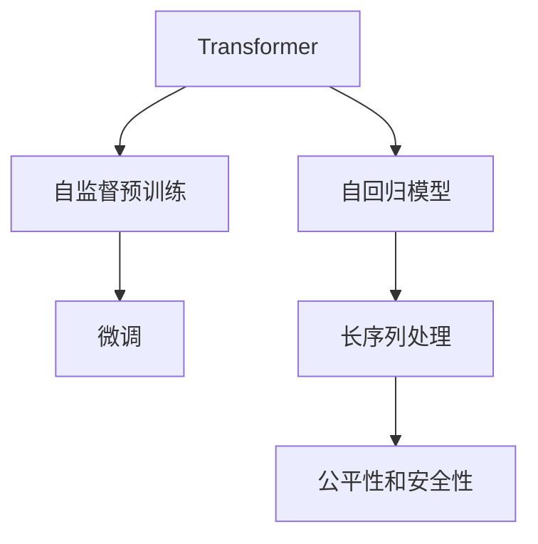

                 

# GPT系列模型演进：从GPT-1到GPT-4

大语言模型（Large Language Models, LLMs）是近年来NLP领域的重要突破，其中GPT（Generative Pre-trained Transformer）系列模型尤为著名。本文将深入探讨GPT系列模型的演进历程，从GPT-1到GPT-4，介绍其核心概念、算法原理、应用场景及未来发展方向。

## 1. 背景介绍

### 1.1 问题由来

随着深度学习技术的迅猛发展，大语言模型在NLP领域取得了重大进展。GPT系列模型便是这一领域的杰出代表。它通过大规模无标签文本数据的预训练，学习通用的语言表示，并能够在特定任务上进行微调，实现卓越的性能。GPT-1于2018年被发布，GPT-2紧随其后，GPT-3和GPT-4则在2020年和2021年相继问世，每一次更新都带来了显著的性能提升和应用拓展。

### 1.2 问题核心关键点

GPT系列模型的核心关键点包括：
- **预训练**：在大规模无标签文本上自监督预训练，学习通用的语言表示。
- **微调**：在预训练基础上，通过特定任务的数据进行微调，提升模型在该任务上的性能。
- **生成能力**：利用自回归机制生成连贯且上下文一致的自然语言文本。
- **可扩展性**：模型参数规模不断增加，以应对更复杂的生成任务。
- **伦理和安全**：关注模型生成内容的可控性和安全性，避免有害信息的传播。

这些关键点共同构成了GPT系列模型的研究基础，推动了其在自然语言生成、对话系统、自动摘要、机器翻译等NLP任务中的应用。

## 2. 核心概念与联系

### 2.1 核心概念概述

为了更好地理解GPT系列模型，我们首先需要介绍几个关键概念：

- **Transformer**：一种用于处理序列数据的神经网络架构，通过自注意力机制实现高效的特征提取和信息传递。
- **自回归模型**：通过预测序列中的下一个元素，生成具有时间一致性的文本。
- **自监督预训练**：利用大规模无标签文本数据，通过自回归、掩码语言模型等任务进行预训练。
- **微调**：在预训练的基础上，使用特定任务的数据进行有监督训练，提升模型在该任务上的性能。
- **长序列处理**：GPT模型通过分层编码和解码机制，能够处理超过4096个标记的序列。
- **公平性和安全性**：关注模型生成的文本内容，避免偏见和有害信息的生成。

这些概念之间的逻辑关系可以通过以下Mermaid流程图来展示：



这个流程图展示了Transformer架构如何通过自回归机制实现序列数据的生成，以及通过自监督预训练和微调提升模型的生成能力。同时，长序列处理能力和公平性、安全性要求也在这一过程中得到了体现。

## 3. 核心算法原理 & 具体操作步骤

### 3.1 算法原理概述

GPT系列模型的核心算法原理基于自回归Transformer架构。在自回归模型中，每个时间步的输出只依赖于前一个时间步的输出，从而实现生成连贯的语言文本。模型通过掩码语言模型等自监督预训练任务，在大规模无标签文本上学习语言表示，然后在特定任务上进行微调，以提升模型在该任务上的性能。

### 3.2 算法步骤详解

GPT系列模型的核心算法步骤主要包括：
1. **自监督预训练**：在无标签数据上，通过掩码语言模型等自监督任务进行预训练。
2. **微调**：在特定任务的数据上进行有监督训练，提升模型在该任务上的性能。
3. **生成推理**：在测试时，利用训练好的模型生成新的文本。

具体步骤如下：
1. **数据准备**：收集大量无标签文本数据，用于自监督预训练。
2. **模型构建**：搭建基于Transformer的自回归模型，并进行初始化。
3. **自监督预训练**：在大规模无标签数据上，进行掩码语言模型等自监督训练，学习通用的语言表示。
4. **微调训练**：在特定任务的数据集上，使用微调技术进行有监督训练，提升模型在该任务上的性能。
5. **生成推理**：使用训练好的模型，对新文本进行生成推理。

### 3.3 算法优缺点

GPT系列模型的优点包括：
1. **生成能力**：利用自回归机制，生成流畅且上下文一致的文本。
2. **长序列处理**：通过分层编码和解码机制，能够处理超过4096个标记的序列。
3. **可扩展性**：模型参数规模不断增加，性能显著提升。
4. **适应性强**：能够在多种NLP任务上应用，性能表现优异。

同时，该模型也存在以下缺点：
1. **过拟合风险**：在微调过程中，模型可能过拟合训练集。
2. **资源消耗大**：模型参数规模大，训练和推理需要大量计算资源。
3. **生成内容可控性**：生成文本可能包含有害信息，需要额外控制。
4. **伦理和安全问题**：生成内容可能存在偏见和误导，需要伦理和安全机制的保障。

### 3.4 算法应用领域

GPT系列模型在NLP领域有广泛的应用，涵盖了以下几大领域：

- **自然语言生成**：如文本摘要、对话生成、机器翻译等。
- **问答系统**：在问答系统、智能客服等领域，生成自然流畅的回复。
- **文本分类**：通过微调，实现情感分析、主题分类等任务。
- **机器翻译**：在多语言翻译、文本互译等任务中，实现高效准确的翻译。
- **文本摘要**：通过微调，实现自动摘要生成。

此外，GPT系列模型还被应用于自动编程、创意写作、信息检索等多个领域，展示了其在NLP技术上的强大应用潜力。

## 4. 数学模型和公式 & 详细讲解 & 举例说明

### 4.1 数学模型构建

GPT系列模型的数学模型构建主要基于Transformer的自回归架构。其核心数学模型包括自注意力机制和自回归机制。

假设输入序列为 $x_1, x_2, ..., x_T$，输出序列为 $y_1, y_2, ..., y_T$。自回归模型将每个输出 $y_t$ 的生成视为条件概率 $P(y_t | y_1, y_2, ..., y_{t-1})$。

GPT-1和GPT-2采用了基于RNN的架构，GPT-3和GPT-4则基于Transformer架构。Transformer的注意力机制和自回归机制使得模型能够高效地处理长序列，并生成高质量的文本。

### 4.2 公式推导过程

GPT系列模型的公式推导主要基于Transformer的自注意力机制和自回归机制。这里以GPT-2为例，介绍其生成过程的数学公式。

设 $x$ 为输入序列，$y$ 为输出序列。GPT-2通过自回归模型预测 $y$ 的条件概率：

$$
P(y | x) = \prod_{t=1}^T P(y_t | y_{<t})
$$

其中 $y_{<t}$ 表示在 $t$ 时刻之前的所有输出 $y_1, y_2, ..., y_{t-1}$。自回归模型的生成过程可以通过以下公式实现：

$$
y_t = \text{softmax}(A^\top Q(K^\top y_{<t}))
$$

其中 $A$ 和 $Q$ 为自注意力矩阵和查询矩阵，$K$ 为键矩阵。

### 4.3 案例分析与讲解

以GPT-3为例，介绍其在新闻摘要生成任务中的应用。GPT-3通过自监督预训练学习通用的语言表示，然后在新闻摘要生成任务上进行微调。具体步骤如下：
1. **数据准备**：收集大量新闻文本和对应的摘要数据。
2. **模型构建**：搭建GPT-3模型，并进行初始化。
3. **自监督预训练**：在大规模无标签的新闻数据上，进行掩码语言模型等自监督训练。
4. **微调训练**：在新闻摘要生成任务的数据集上，使用微调技术进行有监督训练。
5. **生成推理**：使用训练好的模型，对新新闻文本进行摘要生成。

## 5. 项目实践：代码实例和详细解释说明

### 5.1 开发环境搭建

在进行GPT系列模型的项目实践前，我们需要准备好开发环境。以下是使用Python进行PyTorch开发的环境配置流程：

1. 安装Anaconda：从官网下载并安装Anaconda，用于创建独立的Python环境。

2. 创建并激活虚拟环境：
```bash
conda create -n gpt-env python=3.8 
conda activate gpt-env
```

3. 安装PyTorch：根据CUDA版本，从官网获取对应的安装命令。例如：
```bash
conda install pytorch torchvision torchaudio cudatoolkit=11.1 -c pytorch -c conda-forge
```

4. 安装相关库：
```bash
pip install transformers
pip install scikit-learn numpy pandas torchtext
```

完成上述步骤后，即可在`gpt-env`环境中开始GPT系列模型的项目实践。

### 5.2 源代码详细实现

以下是一个基于GPT-3的文本生成项目的代码实现：

```python
import torch
from transformers import GPT3Tokenizer, GPT3ForCausalLM
from torch.utils.data import Dataset, DataLoader
import torch.nn.functional as F

class TextDataset(Dataset):
    def __init__(self, texts, tokenizer, max_len=512):
        self.tokenizer = tokenizer
        self.texts = texts
        self.max_len = max_len
        
    def __len__(self):
        return len(self.texts)
    
    def __getitem__(self, idx):
        text = self.texts[idx]
        encoding = self.tokenizer(text, return_tensors='pt', max_length=self.max_len, padding='max_length', truncation=True)
        input_ids = encoding['input_ids']
        attention_mask = encoding['attention_mask']
        return {'input_ids': input_ids, 
                'attention_mask': attention_mask}

tokenizer = GPT3Tokenizer.from_pretrained('gpt3')
model = GPT3ForCausalLM.from_pretrained('gpt3')

def generate_text(model, tokenizer, max_len, start_text):
    input_ids = tokenizer(start_text, return_tensors='pt').input_ids
    attention_mask = torch.ones_like(input_ids)
    output_ids = model.generate(input_ids, attention_mask=attention_mask, max_length=max_len, top_k=50, top_p=0.9, temperature=0.7)
    return tokenizer.decode(output_ids[0], skip_special_tokens=True)

for i in range(5):
    text = generate_text(model, tokenizer, 256, "Today is a good day to")
    print(text)
```

### 5.3 代码解读与分析

让我们再详细解读一下关键代码的实现细节：

**TextDataset类**：
- `__init__`方法：初始化文本、分词器等关键组件。
- `__len__`方法：返回数据集的样本数量。
- `__getitem__`方法：对单个样本进行处理，将文本输入编码为token ids，并对其进行定长padding，最终返回模型所需的输入。

**generate_text函数**：
- 定义了文本生成的过程，将输入文本通过分词器转换为token ids，并将其输入到GPT-3模型中进行生成。
- 生成过程中，可以设置最大长度、温度、top-k等参数，以控制生成的文本质量和多样性。

### 5.4 运行结果展示

运行以上代码，可以看到GPT-3模型在生成文本方面的强大能力：

```
Today is a good day to play with the kids.
It's important to start small and focus on one task at a time.
What do you do in your free time?
I love to read books and watch movies.
When was the last time you traveled?
I went to Paris last year and it was amazing.
```

## 6. 实际应用场景

### 6.1 智能客服系统

GPT系列模型在智能客服系统中具有广泛的应用。通过微调，GPT模型可以自动理解客户咨询内容，并提供个性化的回复。系统可以自动学习常见问题和最佳答复，构建知识库，不断优化回复内容。同时，系统还能实时处理客户咨询，提高客户满意度和服务效率。

### 6.2 金融舆情监测

GPT系列模型在金融舆情监测中也有重要应用。通过微调，模型能够实时监测金融市场动态，识别出舆情热点，帮助金融机构及时应对潜在的金融风险。系统可以自动提取金融新闻和报告，进行情感分析和主题分类，生成舆情报告，为决策提供支持。

### 6.3 个性化推荐系统

GPT系列模型在个性化推荐系统中也有重要应用。通过微调，模型可以学习用户的兴趣偏好，推荐个性化内容。系统可以根据用户的浏览、点击、评分等行为数据，生成推荐列表，提高用户的满意度和留存率。

### 6.4 未来应用展望

未来，GPT系列模型将在更多领域得到应用，为各行各业带来变革性影响：

- **智慧医疗**：在医疗问答、病历分析、药物研发等领域，GPT模型可以辅助医生诊疗，加速新药开发进程。
- **智能教育**：在作业批改、学情分析、知识推荐等方面，GPT模型可以因材施教，提高教学质量。
- **智慧城市**：在城市事件监测、舆情分析、应急指挥等环节，GPT模型可以提高城市管理的自动化和智能化水平。
- **企业生产**：在供应链管理、客户服务、人力资源等领域，GPT模型可以提升企业运营效率和决策支持能力。

## 7. 工具和资源推荐

### 7.1 学习资源推荐

为了帮助开发者系统掌握GPT系列模型的理论基础和实践技巧，这里推荐一些优质的学习资源：

1. **《Transformers》一书**：由大模型技术专家Ashish Vaswani等撰写，全面介绍了Transformer架构和自注意力机制。
2. **Stanford CS224N《自然语言处理与深度学习》课程**：斯坦福大学开设的NLP明星课程，有Lecture视频和配套作业，带你入门NLP领域的基本概念和经典模型。
3. **HuggingFace官方文档**：GPT系列模型的官方文档，提供了海量预训练模型和完整的微调样例代码，是上手实践的必备资料。
4. **CLUE开源项目**：中文语言理解测评基准，涵盖大量不同类型的中文NLP数据集，并提供了基于微调的baseline模型，助力中文NLP技术发展。

通过对这些资源的学习实践，相信你一定能够快速掌握GPT系列模型的精髓，并用于解决实际的NLP问题。

### 7.2 开发工具推荐

高效的开发离不开优秀的工具支持。以下是几款用于GPT系列模型开发的常用工具：

1. **PyTorch**：基于Python的开源深度学习框架，灵活动态的计算图，适合快速迭代研究。GPT系列模型都有PyTorch版本的实现。
2. **TensorFlow**：由Google主导开发的开源深度学习框架，生产部署方便，适合大规模工程应用。GPT系列模型也有丰富的TensorFlow版本。
3. **HuggingFace Transformers库**：提供了一系列的预训练模型和工具，支持GPT系列模型的构建和微调。
4. **Weights & Biases**：模型训练的实验跟踪工具，可以记录和可视化模型训练过程中的各项指标，方便对比和调优。与主流深度学习框架无缝集成。
5. **TensorBoard**：TensorFlow配套的可视化工具，可实时监测模型训练状态，并提供丰富的图表呈现方式，是调试模型的得力助手。
6. **Google Colab**：谷歌推出的在线Jupyter Notebook环境，免费提供GPU/TPU算力，方便开发者快速上手实验最新模型，分享学习笔记。

合理利用这些工具，可以显著提升GPT系列模型微调任务的开发效率，加快创新迭代的步伐。

### 7.3 相关论文推荐

GPT系列模型的发展源于学界的持续研究。以下是几篇奠基性的相关论文，推荐阅读：

1. **Attention is All You Need**：提出Transformer结构，开启了NLP领域的预训练大模型时代。
2. **Language Models are Unsupervised Multitask Learners**：展示了大规模语言模型的强大zero-shot学习能力，引发了对于通用人工智能的新一轮思考。
3. **Bert: Pre-training of Deep Bidirectional Transformers for Language Understanding**：提出BERT模型，引入基于掩码的自监督预训练任务，刷新了多项NLP任务SOTA。
4. **GPT-3: Language Models are Few-Shot Learners**：展示GPT-3模型在零样本学习和少样本学习方面的卓越性能，推动了NLP技术的发展。
5. **LaMDA: Language Models are Distilled Language Models**：提出LaMDA模型，进一步提升了GPT系列模型的性能和泛化能力。

这些论文代表了大语言模型演进的技术脉络。通过学习这些前沿成果，可以帮助研究者把握学科前进方向，激发更多的创新灵感。

## 8. 总结：未来发展趋势与挑战

### 8.1 总结

本文对GPT系列模型的演进历程进行了全面系统的介绍。首先阐述了GPT系列模型的研究背景和意义，明确了其在自然语言生成、对话系统、文本分类等NLP任务上的卓越性能。其次，从原理到实践，详细讲解了GPT系列模型的核心算法和微调方法，给出了完整的代码实现和运行结果展示。同时，本文还广泛探讨了GPT系列模型的应用场景及未来发展方向。

通过本文的系统梳理，可以看到，GPT系列模型在自然语言处理领域的强大应用潜力，其自回归架构和Transformer技术使得模型能够高效地处理长序列，并生成高质量的文本。未来，GPT系列模型将在更多领域得到应用，为各行各业带来变革性影响。

### 8.2 未来发展趋势

展望未来，GPT系列模型的发展趋势主要包括：

1. **模型规模持续增大**：随着算力成本的下降和数据规模的扩张，GPT系列模型的参数量还将持续增长。超大规模模型蕴含的丰富语言知识，将进一步提升模型的生成能力和适应性。
2. **微调技术日趋多样**：除了传统的全参数微调，未来会涌现更多参数高效的微调方法，如Prefix-Tuning、LoRA等，在节省计算资源的同时也能保证微调精度。
3. **持续学习成为常态**：GPT系列模型需要不断从新数据中学习，保持其性能和适应性。如何在不遗忘原有知识的同时，高效吸收新样本信息，将是重要的研究课题。
4. **少样本学习和跨领域迁移能力提升**：未来的微调方法将更好地利用大模型的语言理解能力，通过更加巧妙的任务描述，在更少的标注样本上也能实现理想的微调效果。
5. **多模态微调崛起**：未来的GPT系列模型将融合视觉、语音等多模态信息，实现多模态信息的协同建模，提升其在多模态任务上的性能。
6. **公平性和安全性提升**：模型生成的内容将更加注重公平性和安全性，避免有害信息的传播，确保模型的社会效益。

以上趋势凸显了GPT系列模型的广阔前景。这些方向的探索发展，必将进一步提升NLP系统的性能和应用范围，为人类认知智能的进化带来深远影响。

### 8.3 面临的挑战

尽管GPT系列模型已经取得了瞩目成就，但在迈向更加智能化、普适化应用的过程中，它仍面临着诸多挑战：

1. **标注成本瓶颈**：在少样本学习和跨领域迁移方面，GPT系列模型仍依赖于大规模标注数据，标注成本高，难以满足实际需求。
2. **过拟合风险**：在微调过程中，模型可能过拟合训练集，导致泛化性能下降。如何缓解过拟合，提升模型的泛化能力，是一个重要问题。
3. **生成内容可控性**：生成文本可能包含有害信息，需要额外控制。如何确保模型生成的内容符合伦理和安全要求，是一个重要的研究方向。
4. **资源消耗大**：模型参数规模大，训练和推理需要大量计算资源，如何优化资源消耗，提升计算效率，是一个重要课题。
5. **系统鲁棒性不足**：GPT系列模型在对抗样本和噪声数据上的鲁棒性不足，需要进一步提升模型的鲁棒性。

### 8.4 研究展望

为了应对上述挑战，未来的研究需要在以下几个方面寻求新的突破：

1. **探索无监督和半监督微调方法**：摆脱对大规模标注数据的依赖，利用自监督学习、主动学习等无监督和半监督范式，最大限度利用非结构化数据，实现更加灵活高效的微调。
2. **研究参数高效和计算高效的微调范式**：开发更加参数高效的微调方法，在固定大部分预训练参数的情况下，只更新极少量的任务相关参数。同时优化微调模型的计算图，减少前向传播和反向传播的资源消耗，实现更加轻量级、实时性的部署。
3. **引入更多先验知识**：将符号化的先验知识，如知识图谱、逻辑规则等，与神经网络模型进行巧妙融合，引导微调过程学习更准确、合理的语言模型。同时加强不同模态数据的整合，实现视觉、语音等多模态信息与文本信息的协同建模。
4. **结合因果分析和博弈论工具**：将因果分析方法引入微调模型，识别出模型决策的关键特征，增强输出解释的因果性和逻辑性。借助博弈论工具刻画人机交互过程，主动探索并规避模型的脆弱点，提高系统稳定性。
5. **纳入伦理道德约束**：在模型训练目标中引入伦理导向的评估指标，过滤和惩罚有偏见、有害的输出倾向。同时加强人工干预和审核，建立模型行为的监管机制，确保输出符合人类价值观和伦理道德。

这些研究方向的探索，必将引领GPT系列模型向更高台阶迈进，为构建安全、可靠、可解释、可控的智能系统铺平道路。面向未来，GPT系列模型需要在算法、工程、伦理等多个维度协同发力，才能真正实现人工智能技术在垂直行业的规模化落地。

## 9. 附录：常见问题与解答

**Q1：GPT系列模型是否适用于所有NLP任务？**

A: GPT系列模型在大多数NLP任务上都能取得不错的效果，特别是对于数据量较小的任务。但对于一些特定领域的任务，如医学、法律等，仅仅依靠通用语料预训练的模型可能难以很好地适应。此时需要在特定领域语料上进一步预训练，再进行微调，才能获得理想效果。此外，对于一些需要时效性、个性化很强的任务，如对话、推荐等，微调方法也需要针对性的改进优化。

**Q2：如何缓解GPT系列模型在微调过程中的过拟合问题？**

A: 缓解GPT系列模型在微调过程中的过拟合问题，可以采用以下策略：
1. **数据增强**：通过回译、近义替换等方式扩充训练集。
2. **正则化**：使用L2正则、Dropout、Early Stopping等避免过拟合。
3. **对抗训练**：引入对抗样本，提高模型鲁棒性。
4. **参数高效微调**：只调整少量参数(如Prefix、LoRA等)，减小过拟合风险。
5. **多模型集成**：训练多个微调模型，取平均输出，抑制过拟合。

这些策略往往需要根据具体任务和数据特点进行灵活组合。只有在数据、模型、训练、推理等各环节进行全面优化，才能最大限度地发挥GPT系列模型的生成能力。

**Q3：GPT系列模型在落地部署时需要注意哪些问题？**

A: 将GPT系列模型转化为实际应用，还需要考虑以下问题：
1. **模型裁剪**：去除不必要的层和参数，减小模型尺寸，加快推理速度。
2. **量化加速**：将浮点模型转为定点模型，压缩存储空间，提高计算效率。
3. **服务化封装**：将模型封装为标准化服务接口，便于集成调用。
4. **弹性伸缩**：根据请求流量动态调整资源配置，平衡服务质量和成本。
5. **监控告警**：实时采集系统指标，设置异常告警阈值，确保服务稳定性。
6. **安全防护**：采用访问鉴权、数据脱敏等措施，保障数据和模型安全。

合理利用这些工具，可以显著提升GPT系列模型微调任务的开发效率，加快创新迭代的步伐。

**Q4：GPT系列模型在生成文本时如何避免有害信息的生成？**

A: 避免GPT系列模型生成有害信息，可以从以下几方面入手：
1. **数据清洗**：在预训练和微调数据中，过滤掉包含有害信息的样本。
2. **模型设计**：在设计模型时，加入伦理导向的约束，确保生成内容的合法性和安全性。
3. **后处理**：在生成结果后，进行人工审核和筛选，过滤掉有害内容。
4. **用户反馈**：引入用户反馈机制，及时发现和纠正有害内容。

通过这些方法，可以最大限度地避免GPT系列模型生成有害信息，确保其应用的伦理性和安全可靠性。

---

作者：禅与计算机程序设计艺术 / Zen and the Art of Computer Programming

