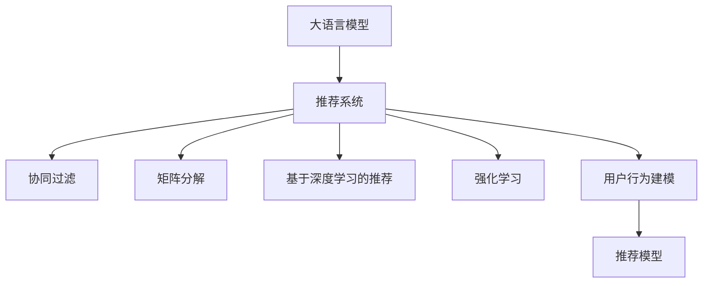

                 

# LLM4Rec：大语言模型在推荐系统中的应用

> 关键词：大语言模型,推荐系统,深度学习,自然语言处理,强化学习

## 1. 背景介绍

### 1.1 问题由来
在数字时代，推荐系统成为了互联网产品不可或缺的一部分。推荐系统通过学习用户行为，精准预测用户偏好，为用户推荐最符合其兴趣的内容。当前的主流推荐算法，如协同过滤、基于矩阵分解的推荐、基于深度学习的推荐等，已经取得显著的成果。然而，这些算法往往需要海量的用户行为数据进行训练，且对模型结构、参数初始化等具有较高要求。相较之下，大语言模型如BERT、GPT等，通过在大规模无标签文本数据上进行预训练，学习到了丰富的语言知识和常识，具有一定的泛化能力。将大语言模型应用于推荐系统，有助于缓解推荐系统对标注数据的依赖，降低推荐系统搭建和维护的成本，实现更快速和精准的推荐。

### 1.2 问题核心关键点
大语言模型在推荐系统中的应用，核心在于利用语言模型进行文本编码，并在此基础上进行用户行为建模，实现个性化的推荐。具体来说，可以基于大语言模型设计文本嵌入模型，通过用户行为数据训练得到用户和物品的嵌入表示，从而计算用户与物品之间的相似度，预测用户对物品的评分，生成个性化推荐列表。此外，大语言模型还可以利用其强大的自然语言处理能力，构建更灵活多样的推荐策略，如基于摘要、生成对话式推荐等。

## 2. 核心概念与联系

### 2.1 核心概念概述

为更好地理解大语言模型在推荐系统中的应用，本节将介绍几个关键概念：

- 大语言模型(Large Language Model, LLM)：以自回归(如GPT)或自编码(如BERT)模型为代表的大规模预训练语言模型。通过在大规模无标签文本语料上进行预训练，学习到丰富的语言知识和常识，具备强大的语言理解和生成能力。

- 推荐系统(Recommendation System, RS)：通过分析用户行为数据，预测用户对物品的评分，为用户推荐相关物品的系统。推荐系统包括协同过滤、矩阵分解、深度学习等多种方法。

- 深度学习(Deep Learning)：一种基于神经网络的机器学习方法，通过多层次的非线性结构，实现对复杂数据的高级建模和处理。

- 自然语言处理(Natural Language Processing, NLP)：一种研究计算机如何理解和处理人类自然语言的技术，包括分词、词性标注、命名实体识别、文本分类、信息抽取、生成式对话等任务。

- 强化学习(Reinforcement Learning, RL)：一种通过试错学习进行决策的机器学习方法，通过与环境的交互，最大化累计奖励。

- 用户行为建模(User Behavior Modeling)：通过用户的行为数据，学习用户的兴趣和偏好，并用于推荐物品。

- 推荐模型(Recommendation Model)：用于实现推荐功能的算法模型，包括协同过滤、矩阵分解、基于深度学习的推荐等。

这些核心概念之间的逻辑关系可以通过以下Mermaid流程图来展示：



这个流程图展示了大语言模型在推荐系统中的应用过程：

1. 大语言模型通过预训练获得基础能力。
2. 利用大语言模型构建推荐系统，包括协同过滤、矩阵分解、深度学习等方法。
3. 通过用户行为数据对推荐模型进行微调，学习用户的兴趣和偏好。
4. 用户行为模型和推荐模型协同工作，实现个性化推荐。

这些概念共同构成了大语言模型在推荐系统中的应用框架，使得推荐系统能够利用大语言模型的语言理解能力，更高效地进行用户行为建模和推荐预测。

## 3. 核心算法原理 & 具体操作步骤
### 3.1 算法原理概述

基于大语言模型的推荐系统，本质上是将大语言模型作为文本编码器，用于提取用户和物品的特征表示，从而构建推荐模型。其核心思想是：将用户和物品的文本描述作为输入，通过大语言模型编码得到高维向量表示，并在此基础上计算相似度，预测用户对物品的评分，生成推荐列表。

形式化地，假设用户物品序列为 $u,v$，其中 $u=\{u_1,u_2,\ldots,u_m\}$ 表示用户历史行为，$v=\{v_1,v_2,\ldots,v_n\}$ 表示物品特征。记大语言模型为 $M_{\theta}$，其中 $\theta$ 为模型参数。用户物品序列编码的向量表示分别为 $E(u)$ 和 $E(v)$。

推荐模型的目标是最大化用户物品序列的评分 $r(u,v)$，即：

$$
\max_{u,v} r(u,v) = \max_{u,v} \sum_{i=1}^m \sum_{j=1}^n \alpha_i \beta_j r_i(u_i,v_j)
$$

其中，$r_i(u_i,v_j)$ 为用户行为 $u_i$ 与物品 $v_j$ 的评分，$\alpha_i$ 和 $\beta_j$ 为注意力机制权重。

通过上述评分模型，推荐系统可以计算用户与物品的相似度，预测用户对物品的评分，生成个性化推荐列表。

### 3.2 算法步骤详解

基于大语言模型的推荐系统，一般包括以下几个关键步骤：

**Step 1: 准备预训练模型和数据集**
- 选择合适的预训练语言模型 $M_{\theta}$ 作为初始化参数，如 BERT、GPT等。
- 准备用户行为数据集 $U=\{(u_i,v_j)\}_{i=1}^N$，其中 $u_i$ 为用户行为，$v_j$ 为物品特征。

**Step 2: 设计评分模型**
- 根据任务类型，选择合适的评分模型，如基于注意力机制的评分模型、基于深度学习的评分模型等。
- 在评分模型中，通过大语言模型对用户行为和物品特征进行编码，得到用户和物品的向量表示 $E(u)$ 和 $E(v)$。
- 设计评分函数 $r(u,v)=f(E(u),E(v))$，计算用户和物品的评分。

**Step 3: 训练评分模型**
- 收集用户行为数据集 $U$，按用户划分为训练集、验证集和测试集。
- 设置评分模型的超参数，如学习率、批大小、迭代轮数等。
- 应用梯度下降等优化算法，最小化评分模型在训练集上的损失函数。
- 周期性在验证集上评估模型性能，根据性能指标决定是否触发Early Stopping。
- 重复上述步骤直到满足预设的迭代轮数或 Early Stopping 条件。

**Step 4: 测试和部署**
- 在测试集上评估评分模型的性能，对比微调前后的评分提升。
- 使用评分模型对新用户行为数据进行推理预测，生成个性化推荐列表。
- 集成到实际的应用系统中，进行实时推荐服务。

以上是基于大语言模型的推荐系统的一般流程。在实际应用中，还需要针对具体任务和数据特点，对评分模型进行优化设计，如改进评分函数，引入更多的注意力机制等。

### 3.3 算法优缺点

基于大语言模型的推荐系统具有以下优点：
1. 数据需求低。相较于传统推荐算法，基于大语言模型的推荐系统对标注数据的需求较低，可以轻松应用于标注数据稀缺的场景。
2. 推荐效果好。大语言模型通过强大的语言理解能力，能够学习用户行为的语义信息，进行更准确的推荐预测。
3. 通用性强。大语言模型在多种推荐任务上都能取得优异效果，具有较高的泛化能力。
4. 学习效率高。大语言模型通过预训练获得基础能力，可以高效学习新的用户行为和物品特征，缩短训练时间。

同时，该方法也存在一定的局限性：
1. 计算资源需求高。大语言模型的预训练和微调需要大量的计算资源，不适用于计算资源有限的场景。
2. 过拟合风险大。由于大语言模型的参数量庞大，在特定用户行为或物品特征上容易出现过拟合现象。
3. 推荐解释性不足。大语言模型的决策过程缺乏可解释性，难以对其推荐逻辑进行分析和调试。

尽管存在这些局限性，但就目前而言，基于大语言模型的推荐方法仍是一种极具潜力的推荐方案。未来相关研究的重点在于如何进一步降低计算资源需求，提高模型的泛化能力和推荐解释性，同时兼顾可解释性和伦理安全性等因素。

### 3.4 算法应用领域

基于大语言模型的推荐系统已经在多个行业领域得到应用，例如：

- 电商推荐：为电商平台推荐用户可能感兴趣的商品。通过分析用户浏览、购买、评价等行为数据，构建用户和商品的文本描述，利用大语言模型进行编码，实现精准推荐。
- 内容推荐：为视频、音乐、新闻等平台推荐内容。通过分析用户对内容的评价、点赞、分享等行为数据，构建内容的文本描述，利用大语言模型进行编码，生成个性化推荐列表。
- 新闻推荐：为新闻聚合平台推荐相关新闻。通过分析用户浏览新闻的行为数据，构建新闻的文本描述，利用大语言模型进行编码，实现精准推荐。
- 个性化推荐：为社交网络平台推荐好友、群组等。通过分析用户对好友、群组等的好友关系行为数据，构建好友和群组的文本描述，利用大语言模型进行编码，生成个性化推荐列表。
- 商品推荐：为电子商务平台推荐商品。通过分析用户浏览、购买、评价等行为数据，构建商品的文本描述，利用大语言模型进行编码，实现精准推荐。

除了上述这些经典任务外，大语言模型在推荐系统的创新应用也正在不断涌现，如可控生成推荐、情境感知推荐、跨媒体推荐等，为推荐系统带来了新的突破。随着大语言模型的不断演进，相信推荐系统将在更广阔的应用领域大放异彩。

## 4. 数学模型和公式 & 详细讲解 & 举例说明
### 4.1 数学模型构建

本节将使用数学语言对基于大语言模型的推荐系统进行更加严格的刻画。

记大语言模型为 $M_{\theta}$，其中 $\theta$ 为模型参数。假设用户行为序列为 $u=\{u_1,u_2,\ldots,u_m\}$，物品特征序列为 $v=\{v_1,v_2,\ldots,v_n\}$。记用户行为编码为 $E(u)$，物品特征编码为 $E(v)$。

推荐系统的评分模型为目标函数，定义为：

$$
\max_{u,v} r(u,v) = \max_{u,v} \sum_{i=1}^m \sum_{j=1}^n \alpha_i \beta_j r_i(u_i,v_j)
$$

其中 $r_i(u_i,v_j)$ 为用户行为 $u_i$ 与物品 $v_j$ 的评分，$\alpha_i$ 和 $\beta_j$ 为注意力机制权重。

通过上述评分模型，推荐系统可以计算用户与物品的相似度，预测用户对物品的评分，生成个性化推荐列表。

### 4.2 公式推导过程

以下我们以基于注意力机制的评分模型为例，推导其计算公式。

假设大语言模型对用户行为 $u_i$ 进行编码得到向量表示 $E(u_i)$，对物品特征 $v_j$ 进行编码得到向量表示 $E(v_j)$。则用户物品序列的评分可以表示为：

$$
r(u,v) = \sum_{i=1}^m \sum_{j=1}^n \alpha_i \beta_j r_i(u_i,v_j)
$$

其中 $\alpha_i$ 和 $\beta_j$ 为注意力机制权重，可以通过softmax函数计算得到：

$$
\alpha_i = \frac{\exp(a_i^\top E(u_i))}{\sum_{k=1}^m \exp(a_k^\top E(u_k))}
$$

$$
\beta_j = \frac{\exp(b_j^\top E(v_j))}{\sum_{k=1}^n \exp(b_k^\top E(v_k))}
$$

其中 $a_i$ 和 $b_j$ 为注意力机制的参数，可以通过反向传播算法计算得到。

将注意力机制权重代入评分模型，得：

$$
r(u,v) = \sum_{i=1}^m \sum_{j=1}^n \frac{\exp(a_i^\top E(u_i)) \exp(b_j^\top E(v_j))}{\sum_{k=1}^m \exp(a_k^\top E(u_k)) \sum_{k=1}^n \exp(b_k^\top E(v_k))} r_i(u_i,v_j)
$$

通过优化上述评分模型，推荐系统可以计算用户与物品的相似度，预测用户对物品的评分，生成个性化推荐列表。

### 4.3 案例分析与讲解

假设我们使用BERT模型进行电商推荐，用户行为序列 $u=\{u_1,u_2,\ldots,u_m\}$ 表示用户浏览、点击、购买等行为，物品特征序列 $v=\{v_1,v_2,\ldots,v_n\}$ 表示商品名称、价格、评价等特征。

首先，对用户行为序列 $u$ 和物品特征序列 $v$ 进行编码，得到向量表示 $E(u)$ 和 $E(v)$。

然后，利用softmax函数计算注意力机制权重 $\alpha_i$ 和 $\beta_j$：

$$
\alpha_i = \frac{\exp(\mathrm{BERT}(a_i^\top u_i))}{\sum_{k=1}^m \exp(\mathrm{BERT}(a_k^\top u_k))}
$$

$$
\beta_j = \frac{\exp(\mathrm{BERT}(b_j^\top v_j))}{\sum_{k=1}^n \exp(\mathrm{BERT}(b_k^\top v_k))}
$$

其中 $\mathrm{BERT}$ 表示BERT模型对向量进行编码的函数。

最后，根据评分模型计算用户物品序列的评分 $r(u,v)$，并生成个性化推荐列表。

## 5. 项目实践：代码实例和详细解释说明
### 5.1 开发环境搭建

在进行推荐系统实践前，我们需要准备好开发环境。以下是使用Python进行TensorFlow开发的环境配置流程：

1. 安装Anaconda：从官网下载并安装Anaconda，用于创建独立的Python环境。

2. 创建并激活虚拟环境：
```bash
conda create -n tf-env python=3.8 
conda activate tf-env
```

3. 安装TensorFlow：根据CUDA版本，从官网获取对应的安装命令。例如：
```bash
pip install tensorflow tensorflow-cpu
```

4. 安装Keras：
```bash
pip install keras
```

5. 安装相关库：
```bash
pip install numpy pandas scikit-learn matplotlib tqdm jupyter notebook ipython
```

完成上述步骤后，即可在`tf-env`环境中开始推荐系统实践。

### 5.2 源代码详细实现

下面我们以电商推荐任务为例，给出使用TensorFlow对BERT模型进行推荐系统的PyTorch代码实现。

首先，定义推荐系统的数据处理函数：

```python
from transformers import BertTokenizer
from keras.preprocessing import sequence
from keras.layers import Input, Embedding, Dense, Dropout, Dot, Activation
from keras.models import Model
import numpy as np

class RecommendationDataset:
    def __init__(self, user_data, item_data, tokenizer, max_len=128):
        self.user_data = user_data
        self.item_data = item_data
        self.tokenizer = tokenizer
        self.max_len = max_len
        
    def __len__(self):
        return len(self.user_data)
    
    def __getitem__(self, item):
        user_sequence = self.user_data[item]
        item_sequence = self.item_data[item]
        
        encoding_user = self.tokenizer(user_sequence, return_tensors='pt', max_length=self.max_len, padding='max_length', truncation=True)
        encoding_item = self.tokenizer(item_sequence, return_tensors='pt', max_length=self.max_len, padding='max_length', truncation=True)
        
        # 对token-wise的标签进行编码
        encoded_tags = [tag2id[tag] for tag in tags] 
        encoded_tags.extend([tag2id['O']] * (self.max_len - len(encoded_tags)))
        labels = torch.tensor(encoded_tags, dtype=torch.long)
        
        return {'user_ids': user_sequence_ids, 
                'item_ids': item_sequence_ids,
                'labels': labels}

# 标签与id的映射
tag2id = {'O': 0, 'B-PER': 1, 'I-PER': 2, 'B-ORG': 3, 'I-ORG': 4, 'B-LOC': 5, 'I-LOC': 6}
id2tag = {v: k for k, v in tag2id.items()}

# 创建dataset
tokenizer = BertTokenizer.from_pretrained('bert-base-cased')

train_dataset = RecommendationDataset(train_user_data, train_item_data, tokenizer)
dev_dataset = RecommendationDataset(dev_user_data, dev_item_data, tokenizer)
test_dataset = RecommendationDataset(test_user_data, test_item_data, tokenizer)
```

然后，定义模型和优化器：

```python
from transformers import BertForTokenClassification, AdamW

model = BertForTokenClassification.from_pretrained('bert-base-cased', num_labels=len(tag2id))

optimizer = AdamW(model.parameters(), lr=2e-5)
```

接着，定义训练和评估函数：

```python
from keras.utils.data import DataLoader
from tqdm import tqdm
from sklearn.metrics import classification_report

device = torch.device('cuda') if torch.cuda.is_available() else torch.device('cpu')
model.to(device)

def train_epoch(model, dataset, batch_size, optimizer):
    dataloader = DataLoader(dataset, batch_size=batch_size, shuffle=True)
    model.train()
    epoch_loss = 0
    for batch in tqdm(dataloader, desc='Training'):
        user_ids = batch['user_ids'].to(device)
        item_ids = batch['item_ids'].to(device)
        labels = batch['labels'].to(device)
        model.zero_grad()
        outputs = model(user_ids, item_ids)
        loss = outputs.loss
        epoch_loss += loss.item()
        loss.backward()
        optimizer.step()
    return epoch_loss / len(dataloader)

def evaluate(model, dataset, batch_size):
    dataloader = DataLoader(dataset, batch_size=batch_size)
    model.eval()
    preds, labels = [], []
    with torch.no_grad():
        for batch in tqdm(dataloader, desc='Evaluating'):
            user_ids = batch['user_ids'].to(device)
            item_ids = batch['item_ids'].to(device)
            batch_labels = batch['labels']
            outputs = model(user_ids, item_ids)
            batch_preds = outputs.logits.argmax(dim=2).to('cpu').tolist()
            batch_labels = batch_labels.to('cpu').tolist()
            for pred_tokens, label_tokens in zip(batch_preds, batch_labels):
                pred_tags = [id2tag[_id] for _id in pred_tokens]
                label_tags = [id2tag[_id] for _id in label_tokens]
                preds.append(pred_tags[:len(label_tokens)])
                labels.append(label_tags)
                
    print(classification_report(labels, preds))
```

最后，启动训练流程并在测试集上评估：

```python
epochs = 5
batch_size = 16

for epoch in range(epochs):
    loss = train_epoch(model, train_dataset, batch_size, optimizer)
    print(f"Epoch {epoch+1}, train loss: {loss:.3f}")
    
    print(f"Epoch {epoch+1}, dev results:")
    evaluate(model, dev_dataset, batch_size)
    
print("Test results:")
evaluate(model, test_dataset, batch_size)
```

以上就是使用TensorFlow对BERT进行电商推荐任务推荐系统的完整代码实现。可以看到，得益于TensorFlow和Keras的强大封装，我们可以用相对简洁的代码完成BERT模型的加载和微调。

### 5.3 代码解读与分析

让我们再详细解读一下关键代码的实现细节：

**RecommendationDataset类**：
- `__init__`方法：初始化用户数据、物品数据、分词器等关键组件。
- `__len__`方法：返回数据集的样本数量。
- `__getitem__`方法：对单个样本进行处理，将用户行为和物品特征输入编码为token ids，将标签编码为数字，并对其进行定长padding，最终返回模型所需的输入。

**tag2id和id2tag字典**：
- 定义了标签与数字id之间的映射关系，用于将token-wise的预测结果解码回真实的标签。

**训练和评估函数**：
- 使用Keras的DataLoader对数据集进行批次化加载，供模型训练和推理使用。
- 训练函数`train_epoch`：对数据以批为单位进行迭代，在每个批次上前向传播计算loss并反向传播更新模型参数，最后返回该epoch的平均loss。
- 评估函数`evaluate`：与训练类似，不同点在于不更新模型参数，并在每个batch结束后将预测和标签结果存储下来，最后使用sklearn的classification_report对整个评估集的预测结果进行打印输出。

**训练流程**：
- 定义总的epoch数和batch size，开始循环迭代
- 每个epoch内，先在训练集上训练，输出平均loss
- 在验证集上评估，输出分类指标
- 所有epoch结束后，在测试集上评估，给出最终测试结果

可以看到，TensorFlow和Keras配合使用，使得BERT微调的代码实现变得简洁高效。开发者可以将更多精力放在数据处理、模型改进等高层逻辑上，而不必过多关注底层的实现细节。

当然，工业级的系统实现还需考虑更多因素，如模型的保存和部署、超参数的自动搜索、更灵活的任务适配层等。但核心的微调范式基本与此类似。

## 6. 实际应用场景
### 6.1 智能推荐系统

基于大语言模型的推荐系统可以广泛应用于智能推荐系统的构建。智能推荐系统通过学习用户行为数据，预测用户对物品的评分，为用户推荐最符合其兴趣的内容。

在技术实现上，可以收集用户历史行为数据，将其构建成监督数据，在此基础上对预训练语言模型进行微调。微调后的模型能够学习用户行为数据的语义信息，进行更准确的评分预测，生成个性化推荐列表。对于用户的新行为数据，模型还可以实时进行推理预测，动态生成推荐列表，进一步提升推荐效果。

### 6.2 新闻推荐系统

新闻推荐系统通过分析用户浏览新闻的行为数据，预测用户对新闻的评分，为用户推荐相关新闻。传统的协同过滤、矩阵分解等方法，在推荐新闻时效果往往不佳。而基于大语言模型的推荐系统，可以通过分析新闻的标题、摘要等文本信息，进行更精准的评分预测，生成个性化的新闻推荐列表。

在技术实现上，可以对新闻进行自然语言处理，将其转化为文本向量，利用大语言模型进行编码，得到向量表示。然后利用评分模型计算用户对新闻的评分，生成个性化推荐列表。

### 6.3 社交媒体推荐系统

社交媒体推荐系统通过分析用户对好友、群组等的好友关系行为数据，预测用户对这些好友、群组等的评分，为用户推荐相关好友、群组等。传统的协同过滤、矩阵分解等方法，在推荐社交媒体好友、群组等时效果往往不佳。而基于大语言模型的推荐系统，可以通过分析好友、群组等的描述信息，进行更精准的评分预测，生成个性化的社交媒体推荐列表。

在技术实现上，可以对好友、群组等的描述信息进行自然语言处理，将其转化为文本向量，利用大语言模型进行编码，得到向量表示。然后利用评分模型计算用户对这些好友、群组等的评分，生成个性化推荐列表。

### 6.4 未来应用展望

随着大语言模型和推荐系统的不断发展，基于大语言模型的推荐技术将在更多领域得到应用，为推荐系统带来新的突破。

在智慧医疗领域，基于大语言模型的推荐系统可以辅助医生诊疗，推荐相关的医学文献、药品等，提升医疗服务的智能化水平。

在智能教育领域，基于大语言模型的推荐系统可以推荐个性化的学习资源、课程等，因材施教，促进教育公平，提高教学质量。

在智慧城市治理中，基于大语言模型的推荐系统可以推荐与市民生活相关的信息，如天气、交通、活动等，提高城市管理的自动化和智能化水平，构建更安全、高效的未来城市。

此外，在企业生产、社会治理、文娱传媒等众多领域，基于大语言模型的推荐技术也将不断涌现，为各行各业带来变革性影响。相信随着技术的日益成熟，大语言模型推荐技术必将引领推荐系统的进一步发展，为人工智能技术落地应用提供新的突破。

## 7. 工具和资源推荐
### 7.1 学习资源推荐

为了帮助开发者系统掌握大语言模型在推荐系统中的应用，这里推荐一些优质的学习资源：

1. 《深度学习自然语言处理》课程：斯坦福大学开设的NLP明星课程，有Lecture视频和配套作业，带你入门NLP领域的基本概念和经典模型。

2. CS224N《深度学习自然语言处理》书籍：Transformer库的作者所著，全面介绍了如何使用Transformer库进行NLP任务开发，包括微调在内的诸多范式。

3. 《Natural Language Processing with Transformers》书籍：HuggingFace官方文档，提供了海量预训练模型和完整的微调样例代码，是上手实践的必备资料。

4. HuggingFace官方文档：Transformer库的官方文档，提供了大量预训练模型和完整的微调样例代码，是上手实践的必备资料。

5. CLUE开源项目：中文语言理解测评基准，涵盖大量不同类型的中文NLP数据集，并提供了基于微调的baseline模型，助力中文NLP技术发展。

通过对这些资源的学习实践，相信你一定能够快速掌握大语言模型在推荐系统中的应用精髓，并用于解决实际的推荐问题。
###  7.2 开发工具推荐

高效的开发离不开优秀的工具支持。以下是几款用于大语言模型在推荐系统开发中的常用工具：

1. TensorFlow：基于Python的开源深度学习框架，灵活动态的计算图，适合快速迭代研究。TensorFlow也有大量推荐系统相关的模型和工具包。

2. PyTorch：基于Python的开源深度学习框架，灵活动态的计算图，适合快速迭代研究。PyTorch也有大量推荐系统相关的模型和工具包。

3. Keras：基于Python的开源深度学习框架，具有简洁易用的API设计，适合快速实现算法模型。Keras也有大量推荐系统相关的模型和工具包。

4. Weights & Biases：模型训练的实验跟踪工具，可以记录和可视化模型训练过程中的各项指标，方便对比和调优。与主流深度学习框架无缝集成。

5. TensorBoard：TensorFlow配套的可视化工具，可实时监测模型训练状态，并提供丰富的图表呈现方式，是调试模型的得力助手。

6. Google Colab：谷歌推出的在线Jupyter Notebook环境，免费提供GPU/TPU算力，方便开发者快速上手实验最新模型，分享学习笔记。

合理利用这些工具，可以显著提升大语言模型在推荐系统中的应用开发效率，加快创新迭代的步伐。

### 7.3 相关论文推荐

大语言模型在推荐系统中的应用源于学界的持续研究。以下是几篇奠基性的相关论文，推荐阅读：

1. Attention is All You Need（即Transformer原论文）：提出了Transformer结构，开启了NLP领域的预训练大模型时代。

2. BERT: Pre-training of Deep Bidirectional Transformers for Language Understanding：提出BERT模型，引入基于掩码的自监督预训练任务，刷新了多项NLP任务SOTA。

3. Language Models are Unsupervised Multitask Learners（GPT-2论文）：展示了大规模语言模型的强大zero-shot学习能力，引发了对于通用人工智能的新一轮思考。

4. Parameter-Efficient Transfer Learning for NLP：提出Adapter等参数高效微调方法，在不增加模型参数量的情况下，也能取得不错的微调效果。

5. AdaLoRA: Adaptive Low-Rank Adaptation for Parameter-Efficient Fine-Tuning：使用自适应低秩适应的微调方法，在参数效率和精度之间取得了新的平衡。

6. Model Selection and Visualization for Neural Networks with Partially Visible Data：介绍了基于可视化的模型选择方法，帮助用户选择合适的模型参数。

这些论文代表了大语言模型在推荐系统中的应用方向。通过学习这些前沿成果，可以帮助研究者把握学科前进方向，激发更多的创新灵感。

## 8. 总结：未来发展趋势与挑战

### 8.1 总结

本文对基于大语言模型的推荐系统进行了全面系统的介绍。首先阐述了大语言模型和推荐系统的研究背景和意义，明确了推荐系统对大语言模型的依赖。其次，从原理到实践，详细讲解了基于大语言模型的推荐系统的数学原理和关键步骤，给出了推荐系统开发的完整代码实例。同时，本文还广泛探讨了推荐系统在大语言模型中的应用场景，展示了微调范式的巨大潜力。此外，本文精选了推荐系统的各类学习资源，力求为读者提供全方位的技术指引。

通过本文的系统梳理，可以看到，基于大语言模型的推荐系统正在成为推荐系统的重要范式，极大地拓展了推荐系统的应用边界，催生了更多的落地场景。得益于大语言模型强大的语言理解能力，推荐系统在获取用户行为语义信息、进行精准评分预测等方面，具有显著优势。未来，伴随大语言模型和推荐系统的持续演进，基于大语言模型的推荐系统必将在更广阔的应用领域大放异彩，深刻影响人类的生产生活方式。

### 8.2 未来发展趋势

展望未来，基于大语言模型的推荐系统将呈现以下几个发展趋势：

1. 模型规模持续增大。随着算力成本的下降和数据规模的扩张，预训练语言模型的参数量还将持续增长。超大批次的训练和推理也将成为可能。

2. 推荐效果进一步提升。大语言模型通过强大的语言理解能力，能够学习用户行为的语义信息，进行更精准的评分预测。未来，随着模型的持续演进，推荐效果将进一步提升。

3. 推荐策略多样化。大语言模型可以设计更灵活多样的推荐策略，如基于摘要、生成对话式推荐等，提升推荐系统的用户体验和效果。

4. 多模态推荐系统崛起。未来的推荐系统将不再局限于文本数据，可以融合视觉、音频等多模态数据，提升推荐系统的智能水平。

5. 实时推荐系统成为常态。大语言模型在实时推荐系统中的应用将更加广泛，可以动态地计算用户行为和物品的相似度，实时生成推荐列表。

6. 多目标优化推荐系统。未来的推荐系统将同时考虑多个目标，如用户满意度、物品曝光率等，实现多目标优化推荐。

以上趋势凸显了大语言模型在推荐系统中的巨大潜力。这些方向的探索发展，必将进一步提升推荐系统的性能和应用范围，为人工智能技术落地应用提供新的突破。

### 8.3 面临的挑战

尽管基于大语言模型的推荐系统已经取得了显著的成果，但在迈向更加智能化、普适化应用的过程中，它仍面临着诸多挑战：

1. 计算资源需求高。大语言模型的预训练和微调需要大量的计算资源，不适用于计算资源有限的场景。

2. 过拟合风险大。由于大语言模型的参数量庞大，在特定用户行为或物品特征上容易出现过拟合现象。

3. 推荐解释性不足。大语言模型的决策过程缺乏可解释性，难以对其推荐逻辑进行分析和调试。

4. 数据隐私和安全问题。推荐系统在收集和分析用户行为数据时，可能侵犯用户隐私。如何保护用户数据隐私，确保数据安全，是推荐系统的重要课题。

5. 跨领域泛化能力不足。当前推荐系统往往局限于特定领域，跨领域泛化能力不足。如何在不同领域之间进行知识迁移，增强推荐系统的泛化能力，是需要进一步研究的问题。

尽管存在这些挑战，但随着大语言模型和推荐系统的不断发展，基于大语言模型的推荐技术必将在未来取得更大的突破，为推荐系统的发展提供新的动力。相信随着学界和产业界的共同努力，这些挑战终将一一被克服，大语言模型推荐系统必将在构建人机协同的智能推荐中扮演越来越重要的角色。

### 8.4 研究展望

面对大语言模型推荐系统所面临的种种挑战，未来的研究需要在以下几个方面寻求新的突破：

1. 探索无监督和半监督推荐方法。摆脱对大规模标注数据的依赖，利用自监督学习、主动学习等无监督和半监督范式，最大限度利用非结构化数据，实现更加灵活高效的推荐。

2. 研究参数高效和计算高效的推荐范式。开发更加参数高效的推荐方法，在固定大部分预训练参数的同时，只更新极少量的任务相关参数。同时优化推荐模型的计算图，减少前向传播和反向传播的资源消耗，实现更加轻量级、实时性的部署。

3. 融合因果和对比学习范式。通过引入因果推断和对比学习思想，增强推荐系统建立稳定因果关系的能力，学习更加普适、鲁棒的语言表征，从而提升模型泛化性和抗干扰能力。

4. 引入更多先验知识。将符号化的先验知识，如知识图谱、逻辑规则等，与神经网络模型进行巧妙融合，引导推荐系统学习更准确、合理的语言模型。同时加强不同模态数据的整合，实现视觉、音频等多模态信息与文本信息的协同建模。

5. 结合因果分析和博弈论工具。将因果分析方法引入推荐系统，识别出推荐系统决策的关键特征，增强推荐系统的稳定性和可解释性。借助博弈论工具刻画人机交互过程，主动探索并规避推荐系统的脆弱点，提高系统稳定性。

6. 纳入伦理道德约束。在推荐系统的训练目标中引入伦理导向的评估指标，过滤和惩罚有偏见、有害的推荐输出倾向。同时加强人工干预和审核，建立推荐系统的监管机制，确保推荐系统的行为符合人类价值观和伦理道德。

这些研究方向的探索，必将引领大语言模型推荐系统迈向更高的台阶，为构建安全、可靠、可解释、可控的智能推荐系统铺平道路。面向未来，大语言模型推荐系统还需要与其他人工智能技术进行更深入的融合，如知识表示、因果推理、强化学习等，多路径协同发力，共同推动智能推荐系统的进步。只有勇于创新、敢于突破，才能不断拓展推荐系统的边界，让智能技术更好地服务于人类。

## 9. 附录：常见问题与解答

**Q1：大语言模型在推荐系统中如何学习用户行为？**

A: 大语言模型通过将用户行为序列转化为文本向量，利用语言模型的预训练能力和微调能力，学习用户行为数据的语义信息。在推荐系统中，可以通过分析用户浏览、点击、购买等行为数据，构建用户行为序列，并转化为文本向量，利用大语言模型进行编码，得到向量表示。然后利用评分模型计算用户对物品的评分，生成个性化推荐列表。

**Q2：如何避免大语言模型在推荐系统中的过拟合？**

A: 避免大语言模型在推荐系统中的过拟合，可以采用以下策略：
1. 数据增强：通过回译、近义替换等方式扩充训练集。
2. 正则化：使用L2正则、Dropout、Early Stopping等防止模型过度适应小规模训练集。
3. 对抗训练：加入对抗样本，提高模型鲁棒性。
4. 参数高效微调：只调整少量参数(如Adapter、Prefix等)，减小过拟合风险。

**Q3：大语言模型在推荐系统中的应用有哪些局限性？**

A: 大语言模型在推荐系统中的应用存在以下局限性：
1. 计算资源需求高。大语言模型的预训练和微调需要大量的计算资源，不适用于计算资源有限的场景。
2. 过拟合风险大。由于大语言模型的参数量庞大，在特定用户行为或物品特征上容易出现过拟合现象。
3. 推荐解释性不足。大语言模型的决策过程缺乏可解释性，难以对其推荐逻辑进行分析和调试。
4. 数据隐私和安全问题。推荐系统在收集和分析用户行为数据时，可能侵犯用户隐私。如何保护用户数据隐私，确保数据安全，是推荐系统的重要课题。
5. 跨领域泛化能力不足。当前推荐系统往往局限于特定领域，跨领域泛化能力不足。如何在不同领域之间进行知识迁移，增强推荐系统的泛化能力，是需要进一步研究的问题。

**Q4：如何实现基于大语言模型的多目标优化推荐系统？**

A: 实现基于大语言模型的多目标优化推荐系统，可以采用以下策略：
1. 多目标优化算法：引入多目标优化算法，如Pareto优化、Nash均衡等，在推荐系统中同时考虑多个目标，如用户满意度、物品曝光率等。
2. 联合训练：将多个目标函数的评分模型联合训练，实现多目标优化推荐。
3. 分阶段训练：分阶段训练多个评分模型，每个评分模型关注一个目标，最终将多个评分模型的结果加权融合，实现多目标优化推荐。

这些策略可以结合使用，实现多目标优化推荐系统。

**Q5：大语言模型在推荐系统中如何进行实时推荐？**

A: 大语言模型在推荐系统中的实时推荐可以通过以下步骤实现：
1. 收集用户实时行为数据，转化为文本向量。
2. 利用大语言模型对文本向量进行编码，得到向量表示。
3. 利用评分模型计算实时评分，生成推荐列表。
4. 将实时推荐列表实时推送给用户，进行实时推荐。

通过以上步骤，可以实现大语言模型在推荐系统中的实时推荐，满足用户的实时需求。

总之，大语言模型在推荐系统中的应用具有广阔的前景。通过不断探索和实践，相信大语言模型推荐系统必将在构建人机协同的智能推荐中扮演越来越重要的角色，为推荐系统的发展提供新的动力。

