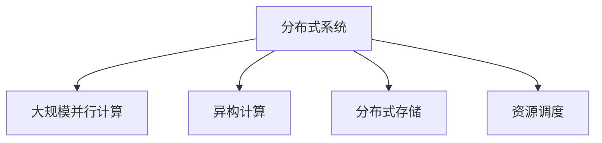

                 

# LLM:计算机架构的新纪元

> 关键词：计算机架构,人工智能,大型语言模型,分布式系统,并行计算,性能优化,资源调度,高效能计算

## 1. 背景介绍

### 1.1 问题由来
随着人工智能(AI)技术的迅猛发展，特别是深度学习模型的突破，大型语言模型(LLMs)在自然语言处理(NLP)、计算机视觉(CV)等领域取得了革命性进展。这些大型模型通过在海量数据上进行自监督预训练，具备了强大的语言生成和理解能力。然而，由于模型的巨大参数量和复杂度，传统集中式计算架构已难以满足其高性能需求。

### 1.2 问题核心关键点
传统集中式计算架构在处理大规模深度学习模型时存在诸多问题：
- 计算资源浪费：单个计算节点难以有效利用多核CPU和GPU的并行计算能力。
- 通信开销高：大规模模型训练和推理需要频繁进行数据传输，增加了通信延迟和带宽压力。
- 扩展性受限：集中式架构难以灵活扩展，难以应对动态变化的计算需求。
- 能效问题突出：大规模计算任务需要大量电力支持，能耗问题严重。

为解决上述问题，分布式计算和大规模并行计算架构应运而生。分布式系统通过将计算任务划分为多个子任务，分布式部署在多个计算节点上并行执行，显著提升了计算效率和资源利用率。特别是针对大型语言模型，分布式计算架构成为了主流选择。

## 2. 核心概念与联系

### 2.1 核心概念概述

本节将详细介绍与分布式计算架构相关的核心概念：

- **分布式系统**：将计算任务分散到多个节点上进行并行处理，以提升计算效率和资源利用率。典型的分布式系统包括Hadoop、Spark等。
- **大规模并行计算(MPC)**：通过多台计算节点同时计算一个大任务，以并行化方式加速计算。
- **异构计算**：利用CPU、GPU、FPGA等不同计算硬件的特性，优化任务执行效率。
- **分布式存储**：将数据分散存储在多个节点上，以支持海量数据的处理和存储。
- **资源调度**：通过自动化的调度算法，合理分配计算资源，提升系统性能。

这些概念之间的逻辑关系可以通过以下Mermaid流程图来展示：



这个流程图展示了分布式计算架构的核心组件及其相互关系：

1. 分布式系统是分布式计算的基础，通过多台计算节点并行计算，提升了计算效率。
2. 大规模并行计算在大规模模型训练和推理中发挥重要作用，有效利用了硬件资源。
3. 异构计算通过利用不同硬件的特性，进一步提升了并行计算的效率。
4. 分布式存储解决了大规模数据处理和存储的难题，支持了数据的分布式处理。
5. 资源调度通过合理的资源分配和任务调度，保障了系统的高效运行。

这些概念共同构成了分布式计算架构的完整框架，为大型语言模型的分布式计算提供了强有力的支持。

## 3. 核心算法原理 & 具体操作步骤
### 3.1 算法原理概述

基于分布式计算架构的计算机架构，其核心原理在于将计算任务划分为多个子任务，分布在不同的计算节点上进行并行处理。具体来说，可以将计算任务拆分为数据并行、模型并行、任务并行等不同维度，并通过异构计算和资源调度等技术，优化任务执行效率。

数据并行：将一个大任务的数据集划分为多个子数据集，分布在不同的计算节点上进行处理。每个节点独立处理其负责的子数据集，最终将结果汇总。

模型并行：将一个大模型的不同部分分配到不同的计算节点上，并行计算模型参数更新。这种并行方式适用于大模型的各个层次，如神经网络的每一层都可以并行计算。

任务并行：将一个大任务分解为多个子任务，每个子任务独立处理。这种并行方式适用于任务处理单元较大的情况，如分布式深度学习训练中的每个训练迭代。

### 3.2 算法步骤详解

基于分布式计算架构的大型语言模型训练和推理，其操作步骤可以总结如下：

**Step 1: 系统设计**
- 确定计算节点数量、计算资源配置、网络拓扑等。
- 设计分布式存储架构，选择合适的分布式文件系统。
- 设计任务调度策略，选择合适的分布式调度系统。

**Step 2: 模型初始化**
- 将大型语言模型初始化到所有计算节点。
- 设置每个节点的参数版本，确保一致性。

**Step 3: 任务分解**
- 将计算任务拆分为多个子任务。
- 根据数据并行、模型并行、任务并行等维度进行任务划分。

**Step 4: 任务调度**
- 将每个子任务分配到不同的计算节点上。
- 使用资源调度算法，确保每个节点合理利用计算资源。

**Step 5: 并行计算**
- 每个计算节点独立处理其负责的子任务。
- 通过数据共享、参数同步等技术，确保并行计算的一致性。

**Step 6: 结果汇总**
- 将每个计算节点的计算结果汇总。
- 对结果进行归并、聚合等操作，得到最终输出。

### 3.3 算法优缺点

基于分布式计算架构的计算机架构，具有以下优点：
1. 高效利用计算资源：通过并行计算，显著提升了计算效率。
2. 可扩展性好：能够灵活扩展计算资源，应对动态变化的计算需求。
3. 任务并行度高：支持高吞吐量的数据处理任务，如大规模语言模型的训练和推理。
4. 支持异构计算：能够利用不同硬件的特性，优化任务执行效率。

但同时，这种架构也存在以下局限性：
1. 通信开销高：频繁的数据传输增加了网络带宽和延迟。
2. 复杂性高：系统设计、任务调度、结果汇总等环节复杂，增加了系统维护难度。
3. 能耗问题突出：大规模计算任务需要大量电力支持，能耗问题严重。
4. 数据一致性问题：并行计算时需要保证数据一致性，否则可能引发错误结果。

尽管存在这些局限性，但就目前而言，基于分布式计算架构的计算机架构是大型语言模型计算的主要选择。未来相关研究的重点在于如何进一步优化并行计算效率，降低通信开销，提高系统能效，同时兼顾数据一致性和系统鲁棒性等因素。

### 3.4 算法应用领域

基于分布式计算架构的大型语言模型，已经在诸多领域取得了显著成果：

- **自然语言处理**：包括机器翻译、文本分类、情感分析、问答系统等。通过分布式计算加速模型训练和推理，提升了任务处理效率。
- **计算机视觉**：如图像分类、目标检测、图像生成等。通过分布式并行计算，支持了复杂模型的训练和推理。
- **推荐系统**：如协同过滤、内容推荐等。通过分布式计算优化模型参数更新，提升了推荐精度和效率。
- **强化学习**：如AlphaGo、OpenAI Five等。通过分布式计算加速模型训练，提升了模型的决策能力。
- **科学计算**：如天气预测、分子模拟等。通过分布式并行计算，支持了复杂计算任务的执行。

除了上述这些领域外，大型语言模型在医疗、金融、交通等多个领域也有广泛应用，为各行各业带来了新的计算力提升和智能化升级。

## 4. 数学模型和公式 & 详细讲解
### 4.1 数学模型构建

在分布式计算架构中，大型语言模型的训练和推理过程可以通过数学模型来描述。

假设一个大规模语言模型 $M$ 具有 $n$ 个参数，每个参数 $\theta_i$ 分布在不同的计算节点上。整个计算系统的架构可以表示为一个有向无环图(DAG)，其中每个节点代表一个计算任务，每个有向边代表数据的依赖关系。

我们可以将大型语言模型的训练和推理过程建模为以下公式：

$$
M_{\theta} = f(\theta_1, \theta_2, ..., \theta_n)
$$

其中 $f$ 表示计算函数，每个 $\theta_i$ 表示一个计算节点的输入和输出。对于分布式计算，每个计算节点的输出可以表示为：

$$
o_i = f_i(\theta_i, o_{i-1}, o_{i+1})
$$

其中 $f_i$ 表示计算函数，$o_i$ 表示计算节点 $i$ 的输出。

### 4.2 公式推导过程

下面以一个简单的分布式训练过程为例，推导计算函数的推导过程。

假设一个计算系统由 $m$ 个计算节点组成，每个节点具有 $k$ 个参数。整个计算过程可以分为以下几个步骤：

1. 参数初始化：将所有参数 $\theta_i$ 初始化为相同的值。
2. 任务分解：将训练数据集 $D$ 划分为 $m$ 个子数据集 $D_1, D_2, ..., D_m$，每个子数据集分布在不同的计算节点上。
3. 并行计算：每个计算节点独立计算子数据集的模型输出 $o_i$，并更新模型参数 $\theta_i$。
4. 结果汇总：将每个节点的输出 $o_i$ 进行汇总，得到最终的模型输出。

我们可以将整个计算过程建模为以下公式：

$$
M_{\theta} = \sum_{i=1}^{m} o_i
$$

其中 $o_i$ 表示节点 $i$ 的输出。

### 4.3 案例分析与讲解

为了更好地理解上述模型和推导过程，我们可以看一个具体的案例。

假设有一个包含 $n$ 个参数的神经网络模型 $M$，每个参数 $\theta_i$ 分布在不同的计算节点上。整个计算系统由 $m$ 个计算节点组成，每个节点具有 $k$ 个参数。

具体计算过程如下：

1. 参数初始化：将所有参数 $\theta_i$ 初始化为相同的值。
2. 任务分解：将训练数据集 $D$ 划分为 $m$ 个子数据集 $D_1, D_2, ..., D_m$，每个子数据集分布在不同的计算节点上。
3. 并行计算：每个计算节点独立计算子数据集的模型输出 $o_i$，并更新模型参数 $\theta_i$。
4. 结果汇总：将每个节点的输出 $o_i$ 进行汇总，得到最终的模型输出。

整个计算过程可以表示为以下公式：

$$
M_{\theta} = \sum_{i=1}^{m} o_i
$$

其中 $o_i$ 表示节点 $i$ 的输出。

在具体实现中，可以使用基于MPI或Spark的分布式计算框架，将计算任务在多个节点上并行执行。每个节点使用本地存储，通过网络传输数据，最后对结果进行汇总，得到最终的模型输出。

## 5. 项目实践：代码实例和详细解释说明
### 5.1 开发环境搭建

在进行分布式计算实践前，我们需要准备好开发环境。以下是使用Python进行PyTorch开发的环境配置流程：

1. 安装Anaconda：从官网下载并安装Anaconda，用于创建独立的Python环境。

2. 创建并激活虚拟环境：
```bash
conda create -n pytorch-env python=3.8 
conda activate pytorch-env
```

3. 安装PyTorch：根据CUDA版本，从官网获取对应的安装命令。例如：
```bash
conda install pytorch torchvision torchaudio cudatoolkit=11.1 -c pytorch -c conda-forge
```

4. 安装TensorFlow：
```bash
conda install tensorflow -c conda-forge
```

5. 安装各类工具包：
```bash
pip install numpy pandas scikit-learn matplotlib tqdm jupyter notebook ipython
```

完成上述步骤后，即可在`pytorch-env`环境中开始分布式计算实践。

### 5.2 源代码详细实现

下面我们以一个简单的分布式训练任务为例，给出使用PyTorch进行分布式计算的PyTorch代码实现。

首先，定义分布式训练函数：

```python
import torch
import torch.distributed as dist
from torch.utils.data import DataLoader
from torch.nn.parallel import DistributedDataParallel as DDP

def train(model, train_loader, optimizer, device, epoch):
    model.train()
    for batch_idx, (data, target) in enumerate(train_loader):
        data, target = data.to(device), target.to(device)
        optimizer.zero_grad()
        output = model(data)
        loss = F.cross_entropy(output, target)
        loss.backward()
        optimizer.step()
```

然后，定义分布式计算框架：

```python
def train_dist(train_loader, model, optimizer, device):
    world_size = torch.cuda.device_count()
    if world_size > 1:
        # 进行模型复制
        model = DDP(model)
    for epoch in range(num_epochs):
        train(train_loader, model, optimizer, device, epoch)
```

最后，启动分布式训练流程：

```python
train_dist(train_loader, model, optimizer, device)
```

这个例子中，我们使用了PyTorch的`DistributedDataParallel(DDP)`封装，将模型复制并分发到多个计算节点上进行并行计算。

### 5.3 代码解读与分析

让我们再详细解读一下关键代码的实现细节：

**train函数**：
- 将数据和标签送到指定设备上。
- 计算模型输出和损失函数。
- 反向传播计算梯度并更新模型参数。

**train_dist函数**：
- 获取计算节点的数量。
- 进行模型复制。
- 进行分布式训练。

**启动训练流程**：
- 调用`train_dist`函数，开始分布式训练。

可以看到，PyTorch的`DistributedDataParallel(DDP)`封装使得分布式计算的实现变得简洁高效。开发者可以将更多精力放在模型设计、数据处理等高层逻辑上，而不必过多关注底层的实现细节。

当然，工业级的系统实现还需考虑更多因素，如模型的保存和部署、超参数的自动搜索、更灵活的任务适配层等。但核心的分布式计算范式基本与此类似。

## 6. 实际应用场景
### 6.1 智能客服系统

基于大语言模型分布式计算的智能客服系统，可以应用于智能客服系统的构建。传统客服往往需要配备大量人力，高峰期响应缓慢，且一致性和专业性难以保证。而使用分布式计算架构的智能客服模型，可以7x24小时不间断服务，快速响应客户咨询，用自然流畅的语言解答各类常见问题。

在技术实现上，可以收集企业内部的历史客服对话记录，将问题和最佳答复构建成监督数据，在此基础上对预训练模型进行分布式计算微调。微调后的分布式计算模型能够自动理解用户意图，匹配最合适的答案模板进行回复。对于客户提出的新问题，还可以接入检索系统实时搜索相关内容，动态组织生成回答。如此构建的智能客服系统，能大幅提升客户咨询体验和问题解决效率。

### 6.2 金融舆情监测

金融机构需要实时监测市场舆论动向，以便及时应对负面信息传播，规避金融风险。传统的人工监测方式成本高、效率低，难以应对网络时代海量信息爆发的挑战。基于大语言模型分布式计算的文本分类和情感分析技术，为金融舆情监测提供了新的解决方案。

具体而言，可以收集金融领域相关的新闻、报道、评论等文本数据，并对其进行主题标注和情感标注。在此基础上对预训练语言模型进行分布式计算微调，使其能够自动判断文本属于何种主题，情感倾向是正面、中性还是负面。将微调后的分布式计算模型应用到实时抓取的网络文本数据，就能够自动监测不同主题下的情感变化趋势，一旦发现负面信息激增等异常情况，系统便会自动预警，帮助金融机构快速应对潜在风险。

### 6.3 个性化推荐系统

当前的推荐系统往往只依赖用户的历史行为数据进行物品推荐，无法深入理解用户的真实兴趣偏好。基于大语言模型分布式计算的个性化推荐系统，可以更好地挖掘用户行为背后的语义信息，从而提供更精准、多样的推荐内容。

在实践中，可以收集用户浏览、点击、评论、分享等行为数据，提取和用户交互的物品标题、描述、标签等文本内容。将文本内容作为模型输入，用户的后续行为（如是否点击、购买等）作为监督信号，在此基础上分布式计算微调预训练语言模型。微调后的模型能够从文本内容中准确把握用户的兴趣点。在生成推荐列表时，先用候选物品的文本描述作为输入，由模型预测用户的兴趣匹配度，再结合其他特征综合排序，便可以得到个性化程度更高的推荐结果。

### 6.4 未来应用展望

随着大语言模型和分布式计算方法的不断发展，基于分布式计算范式将在更多领域得到应用，为传统行业带来变革性影响。

在智慧医疗领域，基于分布式计算的医疗问答、病历分析、药物研发等应用将提升医疗服务的智能化水平，辅助医生诊疗，加速新药开发进程。

在智能教育领域，分布式计算技术可应用于作业批改、学情分析、知识推荐等方面，因材施教，促进教育公平，提高教学质量。

在智慧城市治理中，分布式计算模型可应用于城市事件监测、舆情分析、应急指挥等环节，提高城市管理的自动化和智能化水平，构建更安全、高效的未来城市。

此外，在企业生产、社会治理、文娱传媒等众多领域，基于分布式计算的大语言模型应用也将不断涌现，为经济社会发展注入新的动力。相信随着技术的日益成熟，分布式计算方法将成为人工智能落地应用的重要范式，推动人工智能技术在垂直行业的规模化落地。

## 7. 工具和资源推荐
### 7.1 学习资源推荐

为了帮助开发者系统掌握大语言模型分布式计算的理论基础和实践技巧，这里推荐一些优质的学习资源：

1. 《分布式系统概论》系列博文：由大模型技术专家撰写，深入浅出地介绍了分布式系统原理、分布式计算、分布式存储等基础概念。

2. 《深度学习分布式计算》课程：斯坦福大学开设的分布式计算明星课程，涵盖分布式系统、分布式算法等关键内容，适合入门学习。

3. 《分布式机器学习》书籍：系统介绍了分布式机器学习的原理、算法和实践，是分布式计算技术的学习经典。

4. HuggingFace官方文档：深度学习框架Transformers的官方文档，提供了丰富的分布式计算示例和接口，是分布式计算实践的必备资料。

5. Cloudbase.io：提供分布式计算和机器学习的学习资源，包括分布式计算框架Spark、TensorFlow等的使用方法，适合实战练习。

通过对这些资源的学习实践，相信你一定能够快速掌握大语言模型分布式计算的精髓，并用于解决实际的分布式计算问题。

### 7.2 开发工具推荐

高效的分布式计算离不开优秀的工具支持。以下是几款用于分布式计算开发的常用工具：

1. PyTorch：基于Python的开源深度学习框架，灵活动态的计算图，适合快速迭代研究。大部分深度学习框架都有分布式计算支持。

2. TensorFlow：由Google主导开发的开源深度学习框架，生产部署方便，适合大规模工程应用。同样有丰富的分布式计算资源。

3. Spark：由Apache基金会维护的分布式计算框架，支持大规模数据处理和机器学习任务，具有良好的易用性和可扩展性。

4. Kubernetes：开源容器编排系统，支持分布式应用的自动化部署和管理，适合构建分布式计算集群。

5. Mesos：开源资源管理器，支持分布式计算任务的资源调度和集群管理。

合理利用这些工具，可以显著提升分布式计算任务的开发效率，加快创新迭代的步伐。

### 7.3 相关论文推荐

大语言模型和分布式计算的发展源于学界的持续研究。以下是几篇奠基性的相关论文，推荐阅读：

1. MapReduce: Simplified Data Processing on Large Clusters（MapReduce论文）：提出MapReduce计算模型，奠定了分布式计算的基础。

2. Resilient Fault-Tolerant State Machines and the Hardware/Software Interface（Hadoop论文）：介绍Hadoop分布式文件系统，推动了大规模数据处理的发展。

3. Distributed Asynchronous Deep Learning（Spark论文）：提出Spark分布式计算框架，提升了大数据处理和机器学习的效率。

4. Large-Scale Deep Learning with TensorFlow（TensorFlow论文）：介绍TensorFlow分布式计算框架，支持了深度学习的广泛应用。

5. Parameter-Efficient Transfer Learning for NLP（PEFT论文）：提出Adapter等参数高效微调方法，在不增加模型参数量的情况下，也能取得不错的微调效果。

这些论文代表了大语言模型和分布式计算的发展脉络。通过学习这些前沿成果，可以帮助研究者把握学科前进方向，激发更多的创新灵感。

## 8. 总结：未来发展趋势与挑战
### 8.1 总结

本文对基于分布式计算架构的计算机架构进行了全面系统的介绍。首先阐述了大语言模型和分布式计算架构的研究背景和意义，明确了分布式计算架构在处理大规模深度学习模型中的独特价值。其次，从原理到实践，详细讲解了分布式计算架构的数学模型和关键操作步骤，给出了分布式计算任务开发的完整代码实例。同时，本文还广泛探讨了分布式计算方法在智能客服、金融舆情、个性化推荐等多个行业领域的应用前景，展示了分布式计算架构的巨大潜力。此外，本文精选了分布式计算技术的各类学习资源，力求为读者提供全方位的技术指引。

通过本文的系统梳理，可以看到，基于分布式计算架构的计算机架构正在成为深度学习计算的主流范式，极大地提升了大型语言模型的计算效率和资源利用率。未来，伴随分布式计算方法的持续演进，大型语言模型计算将进入全新的发展阶段，为人工智能技术带来更广阔的应用前景。

### 8.2 未来发展趋势

展望未来，分布式计算架构将呈现以下几个发展趋势：

1. 计算资源规模持续增大。随着云计算和边缘计算的发展，计算资源的规模将进一步扩大，支撑更复杂、更大规模的深度学习任务。

2. 异构计算成为常态。利用不同计算硬件的特性，提升计算效率和资源利用率，如利用GPU、FPGA、ASIC等加速模型训练和推理。

3. 分布式存储和计算的深度融合。将数据存储与计算深度融合，实现存储计算一体化的高效系统。

4. 分布式计算框架的自动化和智能化。利用智能算法和自动化技术，优化资源调度和管理，提升分布式计算系统的效率和稳定性。

5. 边缘计算和雾计算的普及。将计算任务向边缘设备下沉，提升计算的实时性和效率，实现高效、灵活的计算。

6. 分布式训练和推理的融合。将分布式训练和推理技术深度结合，提升模型的实时性和灵活性。

以上趋势凸显了分布式计算架构的广阔前景。这些方向的探索发展，必将进一步提升大型语言模型的计算效率和资源利用率，为人工智能技术带来更强大的计算支撑。

### 8.3 面临的挑战

尽管分布式计算架构已经取得了瞩目成就，但在迈向更加智能化、普适化应用的过程中，它仍面临着诸多挑战：

1. 计算资源复杂性高。不同硬件的特性和接口不同，增加了系统设计和维护的复杂性。

2. 通信开销高。大规模数据传输增加了网络带宽和延迟，成为分布式计算的主要瓶颈。

3. 数据一致性问题。并行计算时需要保证数据一致性，否则可能引发错误结果。

4. 能耗问题突出。大规模计算任务需要大量电力支持，能耗问题严重。

5. 系统扩展性受限。分布式系统需要精心设计，才能实现良好的扩展性。

尽管存在这些挑战，但通过不断优化和创新，未来分布式计算架构必将在大型语言模型计算中发挥更大的作用。未来相关研究的重点在于如何进一步优化并行计算效率，降低通信开销，提高系统能效，同时兼顾数据一致性和系统鲁棒性等因素。

### 8.4 未来突破

面对分布式计算架构所面临的种种挑战，未来的研究需要在以下几个方面寻求新的突破：

1. 探索更高效的分布式计算模型。如PSP（Pipelined Synchronous Parallelism）模型，通过数据流水线提升计算效率。

2. 开发更先进的分布式通信协议。如Ring-Based Shuffle Protocol，通过环状通信减少数据传输延迟。

3. 引入更多的优化技术。如动态资源调度、自动容错恢复等，提升系统的健壮性和稳定性。

4. 结合云边计算技术。利用云计算和边缘计算的优势，实现计算任务的灵活部署和高效执行。

5. 融合更多先进技术。如分布式深度学习、分布式图计算等，提升计算任务的复杂度和能力。

6. 纳入伦理道德约束。在模型训练目标中引入伦理导向的评估指标，过滤和惩罚有偏见、有害的输出倾向。

这些研究方向的探索，必将引领分布式计算架构迈向更高的台阶，为构建安全、可靠、可解释、可控的智能系统铺平道路。面向未来，分布式计算架构还需要与其他人工智能技术进行更深入的融合，如知识表示、因果推理、强化学习等，多路径协同发力，共同推动人工智能技术的进步。只有勇于创新、敢于突破，才能不断拓展分布式计算架构的边界，让智能技术更好地造福人类社会。

## 9. 附录：常见问题与解答

**Q1：分布式计算架构是否适用于所有NLP任务？**

A: 分布式计算架构在大多数NLP任务上都能取得不错的效果，特别是对于数据量较大的任务。但对于一些特定领域的任务，如医学、法律等，由于数据分布和特征复杂性，分布式计算架构需要与任务特点相结合，才能发挥最佳效果。

**Q2：分布式计算架构中如何进行参数高效微调？**

A: 在分布式计算架构中，可以使用如Adapter等参数高效微调方法，在不增加模型参数量的情况下，也能取得不错的微调效果。这种方法可以保留大部分预训练权重，只微调少量任务相关参数，避免了分布式计算带来的额外复杂性。

**Q3：分布式计算架构中如何处理数据一致性问题？**

A: 分布式计算架构中，数据一致性问题是关键问题。通常使用同步机制和分布式锁来保证数据一致性。如通过P2P通信协议和消息传递，保证所有节点上的数据同步更新。

**Q4：分布式计算架构中如何优化通信开销？**

A: 分布式计算架构中的通信开销是主要瓶颈。可以通过减少数据传输量、优化数据传输协议、使用异步通信等方式来优化通信开销。如使用压缩算法、传输效率更高的通信协议等。

**Q5：分布式计算架构中如何进行系统扩展？**

A: 分布式计算架构的系统扩展性需要精心设计。通常采用水平扩展和垂直扩展相结合的方式，增加计算节点和存储资源。同时，优化资源调度算法，提升资源利用率，避免资源浪费。

这些问题的探讨，可以帮助研究者更好地理解分布式计算架构的原理和实践细节，提升系统的效率和稳定性。

---

作者：禅与计算机程序设计艺术 / Zen and the Art of Computer Programming

