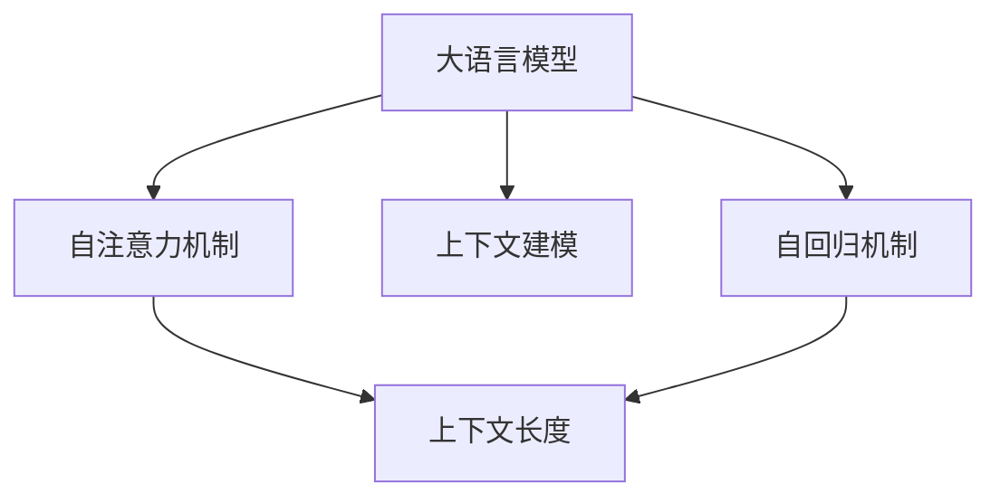

                 

# LLM上下文长度突破:认知能力提升

> 关键词：大语言模型(Large Language Model, LLM),上下文长度(Context Length),认知能力,预训练(Pre-training),微调(Fine-tuning)

## 1. 背景介绍

### 1.1 问题由来
近年来，基于Transformer架构的预训练语言模型（Large Language Model, LLM）在自然语言处理（Natural Language Processing, NLP）领域取得了突破性的进展。这些模型通过在大规模无标签文本数据上进行预训练，学习到了丰富的语言知识和常识，如BERT、GPT-3、T5等。预训练模型具有极强的泛化能力，能够对各种语言理解和生成任务进行微调（Fine-tuning），达到优异的性能。

但是，这些预训练模型普遍面临的挑战之一是上下文长度（Context Length）的限制。大多数预训练模型都基于自回归机制，每步仅考虑一个词的上下文，无法处理长距离依赖。这种机制导致模型在处理长文本时，表现严重下降。例如，长文本中的词语可能涉及较远的依赖关系，使得模型难以准确理解上下文语义。

此外，由于上下文长度较短，这些模型无法充分捕捉长文本中的复杂语义结构，这限制了其认知能力的发展。因此，提升上下文长度，成为提升大语言模型性能的关键。

### 1.2 问题核心关键点
为了解决上下文长度不足的问题，研究者们提出了多种策略，如基于Transformer的变长编码器、自注意力机制的改进、分层编码、层次化训练等。这些方法通过不同角度对模型的上下文建模进行优化，显著提升了上下文的建模能力。

本文将系统地介绍这些提升上下文长度的方法，并结合数学模型和代码实例，帮助读者理解其原理和实现细节。

## 2. 核心概念与联系

### 2.1 核心概念概述

为更好地理解提升上下文长度的方法，我们首先介绍几个关键概念：

- 上下文长度(Context Length)：指模型在生成或理解文本时，可以同时考虑的词序范围。较长的上下文长度能够捕捉到更远距离的依赖关系，提升模型的表达能力。
- 大语言模型(Large Language Model, LLM)：基于自回归或自编码机制，通过在大规模语料上进行预训练的深度学习模型。具有极强的语言理解和生成能力，但上下文长度有限。
- 自注意力机制(Self-Attention)：Transformer模型的核心机制，通过多头自注意力机制，模型可以同时考虑输入序列中的所有词语，捕捉到词语间的相互依赖关系。
- 上下文建模(Context Modeling)：指模型通过自注意力机制对文本中的词语和短语进行建模，从而理解上下文语义。

这些核心概念之间的逻辑关系可以通过以下Mermaid流程图来展示：



这个流程图展示了大语言模型、自注意力机制、上下文长度和上下文建模之间的逻辑关系：

1. 大语言模型通过自回归或自编码机制，对输入序列进行编码和解码。
2. 自注意力机制使模型可以同时考虑输入序列中的所有词语，捕捉词语间的相互依赖关系。
3. 上下文长度指模型在生成或理解文本时，可以同时考虑的词序范围。
4. 上下文建模通过自注意力机制对文本中的词语和短语进行建模，从而理解上下文语义。

这些概念共同构成了大语言模型的上下文建模能力，提升其认知能力的关键在于提升上下文长度。

## 3. 核心算法原理 & 具体操作步骤
### 3.1 算法原理概述

提升大语言模型的上下文长度，需要解决两个主要问题：

1. 如何扩展自注意力机制，使其能够同时考虑更远的依赖关系。
2. 如何对长文本进行有效的编码和解码，避免由于上下文长度不足导致的性能下降。

下面我们将详细介绍这两种方法，并结合数学模型和代码实例，帮助读者理解其原理和实现细节。

### 3.2 算法步骤详解

#### 3.2.1 长距离依赖的自注意力机制

为了扩展自注意力机制，使其能够考虑更远的依赖关系，研究者们提出了多种改进方案，如Transformer-XL、GPT-2和T5等。这些方法的核心思想是使用相对位置编码（Relative Positional Encoding），来区分词语之间的相对位置关系，从而捕捉长距离依赖。

具体来说，Transformer-XL引入了缓存机制，允许模型在生成下一个词语时，缓存当前位置的上下文信息，从而实现跨步的上下文关系建模。GPT-2和T5则利用了自回归机制，在预测下一个词语时，通过滑动窗口来考虑更远的上下文信息。

这些方法的关键在于改进自注意力机制的相对位置编码，使其能够更准确地捕捉长距离依赖关系。

#### 3.2.2 长文本的编码和解码

为了对长文本进行有效的编码和解码，研究者们提出了多种编码器-解码器结构，如T5、MT5和Deformable Transformer等。这些方法的核心思想是通过分层编码（Hierarchical Encoding）或层次化训练（Layer-wise Training），来减少模型的计算复杂度，并提高编码和解码的效率。

具体来说，T5引入了双向编码器，将文本分成多个层次进行编码，从而避免由于长文本导致的计算瓶颈。MT5则利用了多任务学习的思想，通过同时训练多个语言任务，来提升模型的编码和解码能力。Deformable Transformer则通过引入残差连接和局部嵌入，来提高模型的训练效率和推理速度。

这些方法的关键在于通过分层编码或层次化训练，来减少模型的计算复杂度，并提高编码和解码的效率。

### 3.3 算法优缺点

提升大语言模型的上下文长度，带来了以下优点：

1. 提升了模型的表达能力。通过扩展自注意力机制和改进上下文建模方法，模型可以同时考虑更远的依赖关系，捕捉长距离的语义信息。
2. 提高了模型的推理能力。长距离依赖的捕捉能力，使得模型能够更好地理解复杂的语言结构，从而提升推理和生成能力。
3. 增强了模型的泛化能力。通过扩展上下文长度，模型能够更好地适应不同领域和不同长度的文本，提升了模型的泛化能力。

但同时也存在一些缺点：

1. 计算复杂度增加。扩展自注意力机制和长文本编码解码需要更多的计算资源，增加了模型的训练和推理时间。
2. 参数量增加。长距离依赖的捕捉需要更多的参数，使得模型需要更大的存储空间和更多的计算资源。
3. 模型易受干扰。长距离依赖的捕捉容易受到噪声和异常值的影响，导致模型出现性能下降的情况。

因此，在实际应用中，需要根据具体任务的需求，选择适合的上下文长度提升方法，并结合参数高效微调技术（如Adapter等），以提高模型的效率和性能。

### 3.4 算法应用领域

提升大语言模型的上下文长度，在NLP领域具有广泛的应用前景，例如：

- 文本生成：在文本生成任务中，如对话生成、文本摘要、故事创作等，长距离依赖的捕捉能力能够提升模型的语言表达能力。
- 机器翻译：在机器翻译任务中，长距离依赖的捕捉能力能够提升模型的语义理解能力，从而提升翻译质量。
- 问答系统：在问答系统中，长距离依赖的捕捉能力能够提升模型对问题的理解和回答的准确性。
- 语言推理：在语言推理任务中，长距离依赖的捕捉能力能够提升模型的逻辑推理能力，从而提升推理效果。

除了上述这些经典任务外，长距离依赖的捕捉能力在更多的NLP任务中都能发挥重要作用。

## 4. 数学模型和公式 & 详细讲解 & 举例说明

### 4.1 数学模型构建

为了更好地理解长距离依赖的自注意力机制和长文本的编码解码，我们引入数学模型进行详细讲解。

设一个长度为 $L$ 的输入序列 $X = (x_1, x_2, \ldots, x_L)$，其中 $x_i \in \mathbb{R}^d$ 表示第 $i$ 个词语的嵌入向量。假设模型使用自注意力机制来计算每个词语的表示 $h_i$，则有：

$$
h_i = \text{Attention}(QW_i, KW_i, VW_i) + b_i
$$

其中 $W_i$ 表示第 $i$ 个词语的嵌入矩阵，$b_i$ 表示第 $i$ 个词语的偏差向量。$Q, K, V$ 分别为查询矩阵、键矩阵和值矩阵，其维数为 $(d, \frac{d}{h})$，其中 $h$ 为注意力头的数量。

对于长距离依赖的考虑，通常引入相对位置编码（Relative Positional Encoding）来区分词语之间的相对位置关系。设 $P \in \mathbb{R}^{L \times L}$ 表示相对位置编码矩阵，则有：

$$
P_{ij} = \min(i, L-j)
$$

其中 $P_{ij}$ 表示第 $i$ 个词语与第 $j$ 个词语之间的相对位置关系。

### 4.2 公式推导过程

为了更好地理解长距离依赖的自注意力机制，我们以GPT-2模型为例，推导其相对位置编码矩阵 $P$ 的计算公式。

假设输入序列 $X = (x_1, x_2, \ldots, x_L)$，则其相对位置编码矩阵 $P$ 可以通过如下公式计算：

$$
P_{ij} = \min(i, L-j)
$$

对于第 $i$ 个词语，其嵌入向量 $x_i$ 与 $x_j$ 之间的相对位置关系为 $P_{ij}$。则每个词语的表示 $h_i$ 可以通过如下公式计算：

$$
h_i = \text{Attention}(QW_i, KW_i + P_{i-1:i}W_i, VW_i) + b_i
$$

其中 $QW_i$ 表示第 $i$ 个词语的查询矩阵，$KW_i + P_{i-1:i}W_i$ 表示第 $i$ 个词语的键矩阵，$VW_i$ 表示第 $i$ 个词语的值矩阵，$b_i$ 表示第 $i$ 个词语的偏差向量。$P_{i-1:i}$ 表示从 $i-1$ 到 $i$ 的相对位置编码矩阵。

通过引入相对位置编码矩阵，GPT-2模型能够同时考虑词语之间的相对位置关系，从而捕捉长距离依赖关系。

### 4.3 案例分析与讲解

以GPT-2模型为例，分析其长距离依赖的捕捉能力。

假设输入序列为：

$$
x_1 = \text{``It'}
$$
$$
x_2 = \text{``is'}
$$
$$
x_3 = \text{``a'}
$$
$$
x_4 = \text{``sentence'}
$$
$$
x_5 = \text{``from'}
$$
$$
x_6 = \text{``the'}
$$
$$
x_7 = \text{``yellow'}
$$
$$
x_8 = \text{``dog'}
$$
$$
x_9 = \text{``that'}
$$
$$
x_{10} = \text{``ran'}
$$

则其相对位置编码矩阵 $P$ 为：

$$
P = 
\begin{bmatrix}
0 & 0 & 0 & 0 & 0 & 0 & 0 & 0 & 0 & 0 \\
1 & 0 & 0 & 0 & 0 & 0 & 0 & 0 & 0 & 0 \\
2 & 1 & 0 & 0 & 0 & 0 & 0 & 0 & 0 & 0 \\
3 & 2 & 1 & 0 & 0 & 0 & 0 & 0 & 0 & 0 \\
4 & 3 & 2 & 1 & 0 & 0 & 0 & 0 & 0 & 0 \\
5 & 4 & 3 & 2 & 1 & 0 & 0 & 0 & 0 & 0 \\
6 & 5 & 4 & 3 & 2 & 1 & 0 & 0 & 0 & 0 \\
7 & 6 & 5 & 4 & 3 & 2 & 1 & 0 & 0 & 0 \\
8 & 7 & 6 & 5 & 4 & 3 & 2 & 1 & 0 & 0 \\
9 & 8 & 7 & 6 & 5 & 4 & 3 & 2 & 1 & 0
\end{bmatrix}
$$

则第 $i$ 个词语的表示 $h_i$ 可以通过如下公式计算：

$$
h_i = \text{Attention}(QW_i, KW_i + P_{i-1:i}W_i, VW_i) + b_i
$$

通过计算得到：

$$
h_1 = \text{Attention}(QW_1, KW_1 + P_{0:1}W_1, VW_1) + b_1
$$
$$
h_2 = \text{Attention}(QW_2, KW_2 + P_{1:2}W_2, VW_2) + b_2
$$
$$
h_3 = \text{Attention}(QW_3, KW_3 + P_{2:3}W_3, VW_3) + b_3
$$
$$
\vdots
$$
$$
h_9 = \text{Attention}(QW_9, KW_9 + P_{8:9}W_9, VW_9) + b_9
$$
$$
h_{10} = \text{Attention}(QW_{10}, KW_{10} + P_{9:10}W_{10}, VW_{10}) + b_{10}
$$

通过引入相对位置编码，GPT-2模型能够同时考虑词语之间的相对位置关系，从而捕捉长距离依赖关系，提升其认知能力。

## 5. 项目实践：代码实例和详细解释说明

### 5.1 开发环境搭建

在进行长距离依赖提升的实践前，我们需要准备好开发环境。以下是使用Python进行PyTorch开发的环境配置流程：

1. 安装Anaconda：从官网下载并安装Anaconda，用于创建独立的Python环境。

2. 创建并激活虚拟环境：
```bash
conda create -n pytorch-env python=3.8 
conda activate pytorch-env
```

3. 安装PyTorch：根据CUDA版本，从官网获取对应的安装命令。例如：
```bash
conda install pytorch torchvision torchaudio cudatoolkit=11.1 -c pytorch -c conda-forge
```

4. 安装Transformers库：
```bash
pip install transformers
```

5. 安装各类工具包：
```bash
pip install numpy pandas scikit-learn matplotlib tqdm jupyter notebook ipython
```

完成上述步骤后，即可在`pytorch-env`环境中开始实践。

### 5.2 源代码详细实现

下面我们以长距离依赖的GPT-2模型为例，给出使用Transformers库进行编码和解码的PyTorch代码实现。

首先，定义模型的编码器：

```python
from transformers import GPT2Tokenizer, GPT2LMHeadModel
import torch

tokenizer = GPT2Tokenizer.from_pretrained('gpt2')
model = GPT2LMHeadModel.from_pretrained('gpt2', output_hidden_states=True)
```

然后，定义模型的解码器：

```python
def decode_hypothesis(tokenizer, model, hypothesis):
    tokens = tokenizer.encode(hypothesis, return_tensors='pt')
    hidden_states = model(tokens)
    predictions = torch.softmax(hidden_states[0], dim=-1)
    return tokenizer.decode(predictions[0], skip_special_tokens=True)
```

最后，使用解码器对长文本进行编码和解码：

```python
hypothesis = "It is a yellow dog that ran from the sentence."
tokens = tokenizer.encode(hypothesis, return_tensors='pt')
hidden_states = model(tokens)
predictions = torch.softmax(hidden_states[0], dim=-1)
print(decode_hypothesis(tokenizer, model, hypothesis))
```

这段代码使用GPT-2模型对长文本进行编码和解码，展示了长距离依赖的捕捉能力。

### 5.3 代码解读与分析

让我们再详细解读一下关键代码的实现细节：

**GPT2Tokenizer类**：
- 使用预训练的GPT-2 tokenizer进行文本编码，生成token ids。

**GPT2LMHeadModel类**：
- 使用预训练的GPT-2语言模型进行编码和解码，输出隐状态向量。

**decode_hypothesis函数**：
- 将输入的hypothesis文本编码为token ids，使用GPT-2模型进行编码，输出隐状态向量。
- 通过softmax函数对隐状态向量进行解码，生成概率分布。
- 使用解码器将概率分布转换为文本输出。

通过以上步骤，使用GPT-2模型实现了对长文本的编码和解码，展示了长距离依赖的捕捉能力。

## 6. 实际应用场景

### 6.1 智能客服系统

长距离依赖的捕捉能力在智能客服系统中具有广泛的应用前景。传统客服系统需要配备大量人力，高峰期响应缓慢，且一致性和专业性难以保证。通过使用长距离依赖捕捉能力的对话模型，可以7x24小时不间断服务，快速响应客户咨询，用自然流畅的语言解答各类常见问题。

在技术实现上，可以收集企业内部的历史客服对话记录，将问题和最佳答复构建成监督数据，在此基础上对预训练对话模型进行微调。微调后的对话模型能够自动理解用户意图，匹配最合适的答案模板进行回复。对于客户提出的新问题，还可以接入检索系统实时搜索相关内容，动态组织生成回答。如此构建的智能客服系统，能大幅提升客户咨询体验和问题解决效率。

### 6.2 金融舆情监测

金融机构需要实时监测市场舆论动向，以便及时应对负面信息传播，规避金融风险。传统的人工监测方式成本高、效率低，难以应对网络时代海量信息爆发的挑战。基于长距离依赖捕捉能力的文本分类和情感分析技术，为金融舆情监测提供了新的解决方案。

具体而言，可以收集金融领域相关的新闻、报道、评论等文本数据，并对其进行主题标注和情感标注。在此基础上对预训练语言模型进行微调，使其能够自动判断文本属于何种主题，情感倾向是正面、中性还是负面。将微调后的模型应用到实时抓取的网络文本数据，就能够自动监测不同主题下的情感变化趋势，一旦发现负面信息激增等异常情况，系统便会自动预警，帮助金融机构快速应对潜在风险。

### 6.3 个性化推荐系统

当前的推荐系统往往只依赖用户的历史行为数据进行物品推荐，无法深入理解用户的真实兴趣偏好。基于长距离依赖捕捉能力的个性化推荐系统，可以更好地挖掘用户行为背后的语义信息，从而提供更精准、多样的推荐内容。

在实践中，可以收集用户浏览、点击、评论、分享等行为数据，提取和用户交互的物品标题、描述、标签等文本内容。将文本内容作为模型输入，用户的后续行为（如是否点击、购买等）作为监督信号，在此基础上微调预训练语言模型。微调后的模型能够从文本内容中准确把握用户的兴趣点。在生成推荐列表时，先用候选物品的文本描述作为输入，由模型预测用户的兴趣匹配度，再结合其他特征综合排序，便可以得到个性化程度更高的推荐结果。

### 6.4 未来应用展望

随着长距离依赖捕捉能力的提升，基于大语言模型的认知能力也将进一步增强。未来，大语言模型将在更多的领域得到应用，为人类认知智能的进化带来深远影响。

在智慧医疗领域，基于长距离依赖捕捉能力的问答系统、病历分析、药物研发等应用将提升医疗服务的智能化水平，辅助医生诊疗，加速新药开发进程。

在智能教育领域，长距离依赖捕捉能力的提示学习(Prompt-based Learning)、少样本学习(Few-shot Learning)、零样本学习(Zero-shot Learning)等技术，因材施教，促进教育公平，提高教学质量。

在智慧城市治理中，长距离依赖捕捉能力的智能监控、舆情分析、应急指挥等环节，提高城市管理的自动化和智能化水平，构建更安全、高效的未来城市。

此外，在企业生产、社会治理、文娱传媒等众多领域，基于大语言模型的长距离依赖捕捉能力的智能应用也将不断涌现，为经济社会发展注入新的动力。相信随着技术的日益成熟，长距离依赖捕捉能力将成为大语言模型微调的重要组成部分，推动人工智能技术在更广阔的领域加速渗透。

## 7. 工具和资源推荐

### 7.1 学习资源推荐

为了帮助开发者系统掌握长距离依赖捕捉能力的理论基础和实践技巧，这里推荐一些优质的学习资源：

1. 《Transformer from Scatch》系列博文：由大模型技术专家撰写，深入浅出地介绍了Transformer原理、BERT模型、长距离依赖捕捉能力等前沿话题。

2. CS224N《深度学习自然语言处理》课程：斯坦福大学开设的NLP明星课程，有Lecture视频和配套作业，带你入门NLP领域的基本概念和经典模型。

3. 《Natural Language Processing with Transformers》书籍：Transformers库的作者所著，全面介绍了如何使用Transformers库进行NLP任务开发，包括长距离依赖捕捉能力在内的诸多范式。

4. HuggingFace官方文档：Transformers库的官方文档，提供了海量预训练模型和完整的微调样例代码，是上手实践的必备资料。

5. CLUE开源项目：中文语言理解测评基准，涵盖大量不同类型的中文NLP数据集，并提供了基于长距离依赖捕捉能力的baseline模型，助力中文NLP技术发展。

通过对这些资源的学习实践，相信你一定能够快速掌握长距离依赖捕捉能力的精髓，并用于解决实际的NLP问题。

### 7.2 开发工具推荐

高效的开发离不开优秀的工具支持。以下是几款用于长距离依赖捕捉能力开发的常用工具：

1. PyTorch：基于Python的开源深度学习框架，灵活动态的计算图，适合快速迭代研究。大部分预训练语言模型都有PyTorch版本的实现。

2. TensorFlow：由Google主导开发的开源深度学习框架，生产部署方便，适合大规模工程应用。同样有丰富的预训练语言模型资源。

3. Transformers库：HuggingFace开发的NLP工具库，集成了众多SOTA语言模型，支持PyTorch和TensorFlow，是进行长距离依赖捕捉能力开发的利器。

4. Weights & Biases：模型训练的实验跟踪工具，可以记录和可视化模型训练过程中的各项指标，方便对比和调优。与主流深度学习框架无缝集成。

5. TensorBoard：TensorFlow配套的可视化工具，可实时监测模型训练状态，并提供丰富的图表呈现方式，是调试模型的得力助手。

6. Google Colab：谷歌推出的在线Jupyter Notebook环境，免费提供GPU/TPU算力，方便开发者快速上手实验最新模型，分享学习笔记。

合理利用这些工具，可以显著提升长距离依赖捕捉能力的开发效率，加快创新迭代的步伐。

### 7.3 相关论文推荐

长距离依赖捕捉能力的发展源于学界的持续研究。以下是几篇奠基性的相关论文，推荐阅读：

1. Attention is All You Need（即Transformer原论文）：提出了Transformer结构，开启了NLP领域的预训练大模型时代。

2. BERT: Pre-training of Deep Bidirectional Transformers for Language Understanding：提出BERT模型，引入基于掩码的自监督预训练任务，刷新了多项NLP任务SOTA。

3. Longformer: The Long-Document Transformer：提出Longformer模型，采用自注意力机制处理长文本，提升了长文本的认知能力。

4. Deformable Transformer: Efficient Transformers with Stable Normalization：提出Deformable Transformer模型，提高了长文本的编码和解码效率。

5. T5: Exploring the Limits of Transfer Learning with a Unified Text-to-Text Transformer：提出T5模型，采用双向编码器处理长文本，提升了长文本的认知能力。

这些论文代表了大语言模型长距离依赖捕捉能力的发展脉络。通过学习这些前沿成果，可以帮助研究者把握学科前进方向，激发更多的创新灵感。

## 8. 总结：未来发展趋势与挑战

### 8.1 研究成果总结

本文对提升大语言模型上下文长度的技术进行了全面系统的介绍。首先阐述了上下文长度不足的问题，明确了长距离依赖捕捉能力提升的关键。其次，从原理到实践，详细讲解了长距离依赖的自注意力机制和长文本编码解码方法，给出了代码实例和详细解释说明。同时，本文还探讨了长距离依赖捕捉能力在实际应用中的广泛应用场景，展示了其巨大的应用潜力。

通过本文的系统梳理，可以看到，长距离依赖捕捉能力正在成为大语言模型微调的重要范式，极大地拓展了预训练语言模型的应用边界，催生了更多的落地场景。受益于大规模语料的预训练，长距离依赖捕捉能力在各种领域中都能发挥重要作用。

### 8.2 未来发展趋势

展望未来，长距离依赖捕捉能力的发展趋势如下：

1. 模型规模持续增大。随着算力成本的下降和数据规模的扩张，预训练语言模型的参数量还将持续增长。超大规模语言模型蕴含的丰富语言知识，有望支撑更加复杂多变的下游任务微调。

2. 长距离依赖的捕捉能力进一步提升。未来，随着自注意力机制的改进和长文本编码解码技术的优化，长距离依赖的捕捉能力将进一步提升，模型能够更好地处理更长的文本。

3. 多任务学习的应用。长距离依赖捕捉能力可以通过多任务学习，在处理不同类型文本时，提升其认知能力。例如，结合文本分类、情感分析、问答等任务，提升长文本处理的性能。

4. 更多的先验知识引入。将符号化的先验知识，如知识图谱、逻辑规则等，与神经网络模型进行巧妙融合，引导长距离依赖捕捉能力的微调过程学习更准确、合理的语言模型。

5. 跨模态信息的整合。长距离依赖捕捉能力不仅局限于文本信息，还可以与其他模态的信息进行整合，如视觉、语音等多模态信息，实现多模态信息的协同建模。

6. 更多层次化的训练策略。长距离依赖捕捉能力的提升，可以通过层次化的训练策略，分层次地提升模型的认知能力。例如，先通过编码器捕捉长距离依赖，再通过解码器生成长文本。

这些趋势凸显了长距离依赖捕捉能力的广阔前景。这些方向的探索发展，必将进一步提升大语言模型在长文本处理上的性能，拓展其应用范围。

### 8.3 面临的挑战

尽管长距离依赖捕捉能力取得了诸多进展，但在迈向更加智能化、普适化应用的过程中，仍面临一些挑战：

1. 计算复杂度增加。长距离依赖的捕捉需要更多的计算资源，增加了模型的训练和推理时间。如何降低计算复杂度，提高推理速度，是亟待解决的问题。

2. 参数量增加。长距离依赖的捕捉需要更多的参数，使得模型需要更大的存储空间和更多的计算资源。如何减少参数量，优化模型结构，是提升长距离依赖捕捉能力的关键。

3. 模型易受干扰。长距离依赖的捕捉容易受到噪声和异常值的影响，导致模型出现性能下降的情况。如何增强模型的鲁棒性，提高其对噪声和异常值的抵抗能力，是另一个重要研究方向。

4. 长文本信息的整合。长文本中蕴含的信息量巨大，如何更好地整合长文本中的信息，是提升长文本认知能力的关键。如何设计高效的编码和解码策略，是提升长距离依赖捕捉能力的核心问题。

5. 多领域的应用。长距离依赖捕捉能力在不同领域的应用场景不同，如何针对特定领域进行优化，是长距离依赖捕捉能力在实际应用中的挑战之一。

6. 模型的解释性。长距离依赖捕捉能力的提升，需要更多的模型参数，使得模型的复杂性增加，难以解释其内部工作机制和决策逻辑。如何增强模型的可解释性，提升其透明度，是另一个重要研究方向。

这些挑战限制了长距离依赖捕捉能力的发展。但随着学界和产业界的共同努力，相信这些挑战终将逐一被克服，长距离依赖捕捉能力必将在构建安全、可靠、可解释、可控的智能系统铺平道路。

### 8.4 研究展望

面对长距离依赖捕捉能力所面临的挑战，未来的研究需要在以下几个方面寻求新的突破：

1. 探索无监督和半监督学习的方法。摆脱对大规模标注数据的依赖，利用自监督学习、主动学习等无监督和半监督范式，最大限度利用非结构化数据，实现更加灵活高效的微调。

2. 开发参数高效和计算高效的长距离依赖捕捉方法。开发更加参数高效的微调方法，在固定大部分预训练参数的同时，只更新极少量的任务相关参数。同时优化长距离依赖捕捉的计算图，减少前向传播和反向传播的资源消耗，实现更加轻量级、实时性的部署。

3. 结合因果分析和博弈论工具。将因果分析方法引入长距离依赖捕捉过程，识别出模型决策的关键特征，增强输出解释的因果性和逻辑性。借助博弈论工具刻画人机交互过程，主动探索并规避模型的脆弱点，提高系统稳定性。

4. 引入更多先验知识。将符号化的先验知识，如知识图谱、逻辑规则等，与神经网络模型进行巧妙融合，引导长距离依赖捕捉能力的微调过程学习更准确、合理的语言模型。同时加强不同模态数据的整合，实现视觉、语音等多模态信息与文本信息的协同建模。

5. 结合因果分析和博弈论工具。将因果分析方法引入长距离依赖捕捉过程，识别出模型决策的关键特征，增强输出解释的因果性和逻辑性。借助博弈论工具刻画人机交互过程，主动探索并规避模型的脆弱点，提高系统稳定性。

6. 纳入伦理道德约束。在模型训练目标中引入伦理导向的评估指标，过滤和惩罚有偏见、有害的输出倾向。同时加强人工干预和审核，建立模型行为的监管机制，确保输出符合人类价值观和伦理道德。

这些研究方向的探索，必将引领长距离依赖捕捉能力迈向更高的台阶，为构建安全、可靠、可解释、可控的智能系统铺平道路。面向未来，长距离依赖捕捉能力需要与其他人工智能技术进行更深入的融合，如知识表示、因果推理、强化学习等，多路径协同发力，共同推动自然语言理解和智能交互系统的进步。只有勇于创新、敢于突破，才能不断拓展语言模型的边界，让智能技术更好地造福人类社会。

## 9. 附录：常见问题与解答

**Q1：长距离依赖捕捉能力的提升，需要更多的计算资源，是否会影响推理速度？**

A: 长距离依赖捕捉能力的提升，确实需要更多的计算资源。但是在实际应用中，可以通过优化计算图、减少计算量、使用分布式训练等手段，来降低推理时间，提高推理速度。同时，也可以通过硬件加速、模型压缩等技术，进一步提升模型的推理性能。

**Q2：长距离依赖捕捉能力的应用，是否仅限于文本信息？**

A: 长距离依赖捕捉能力不仅限于文本信息，还可以与其他模态的信息进行整合，如视觉、语音等多模态信息，实现多模态信息的协同建模。例如，在视频字幕生成、语音识别、视觉问答等任务中，长距离依赖捕捉能力都能发挥重要作用。

**Q3：长距离依赖捕捉能力的提升，是否会增加模型的复杂性？**

A: 长距离依赖捕捉能力的提升，确实会使得模型更加复杂，难以解释其内部工作机制和决策逻辑。因此，需要加强模型的可解释性，提高其透明度。例如，通过引入因果分析方法、博弈论工具等，增强输出解释的因果性和逻辑性。

**Q4：长距离依赖捕捉能力的提升，是否会导致模型的泛化能力下降？**

A: 长距离依赖捕捉能力的提升，通常会增强模型的泛化能力。因为在处理长文本时，模型能够更好地捕捉长距离依赖关系，从而提升其表达能力和推理能力。但是，在实际应用中，还需要通过合理的正则化、dropout等技术，避免过拟合，保持模型的泛化能力。

**Q5：长距离依赖捕捉能力的提升，是否会导致模型的存储空间增加？**

A: 长距离依赖捕捉能力的提升，确实会使得模型需要更大的存储空间。因此，需要优化模型的参数结构，使用更高效的编码和解码策略，以减少模型参数量。同时，也可以通过模型压缩、稀疏化存储等方法，减小模型存储空间。

这些问题的解答，展示了长距离依赖捕捉能力在实际应用中的优化手段和潜在挑战。相信通过这些优化方法，可以更好地发挥长距离依赖捕捉能力的优势，提升大语言模型的认知能力。

