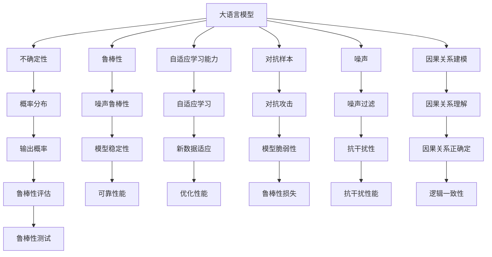

                 

# LLM不确定性:智能系统鲁棒性的挑战

> 关键词：大语言模型,不确定性,智能系统,鲁棒性,自适应学习,对抗样本,噪声,机器学习,深度学习

## 1. 背景介绍

在人工智能发展的过程中，大语言模型（Large Language Models, LLMs）已经逐渐成为推动自然语言处理（NLP）等领域进步的关键技术。然而，随着模型规模的不断增大和应用的广泛普及，模型的鲁棒性问题逐渐突显。特别是在复杂多变、噪声众多的实际应用场景中，模型的不确定性和鲁棒性成为了智能系统必须面对的挑战。本文旨在深入探讨大语言模型在实际应用中面临的不确定性和鲁棒性问题，并提出一些改进策略，以期构建更加健壮和可靠的智能系统。

### 1.1 问题由来

现代大语言模型，如GPT、BERT等，通过大规模无标签文本数据的预训练，已经积累了丰富的语言知识。但这些模型在实际应用中，面对各种噪声、对抗样本和数据变化，常常表现出较高的不确定性和较低的鲁棒性。例如，在医疗领域，模型可能由于输入中微小的噪声干扰，导致输出错误的诊断结果；在金融领域，模型可能因为对抗样本攻击，产生误导性的预测；在智能客服中，模型可能因为输入中微小的语义偏差，导致回答错误。

### 1.2 问题核心关键点

大语言模型的不确定性和鲁棒性问题主要体现在以下几个方面：

- **模型泛化能力**：模型在预训练过程中学习到的知识，是否能稳定地泛化到不同的数据分布上？
- **对抗样本脆弱性**：模型是否能抵御对抗样本攻击，确保输出结果的准确性？
- **噪声鲁棒性**：模型是否能对输入中的噪声进行有效过滤，避免噪声干扰？
- **自适应学习能力**：模型是否能适应新数据和新环境，不断学习和优化？
- **因果关系建模**：模型是否能准确理解因果关系，避免因果倒置？

这些问题直接关系到模型在实际应用中的稳定性和可靠性。如何提高模型的鲁棒性，构建稳定可靠的智能系统，是大语言模型研究的重要方向之一。

## 2. 核心概念与联系

### 2.1 核心概念概述

为更好地理解大语言模型的不确定性和鲁棒性问题，本节将介绍几个密切相关的核心概念：

- **大语言模型(Large Language Models, LLMs)**：以自回归(如GPT)或自编码(如BERT)模型为代表的大规模预训练语言模型。通过在大规模无标签文本语料上进行预训练，学习通用的语言表示，具备强大的语言理解和生成能力。

- **不确定性(Uncertainty)**：指模型在给定输入下，输出结果的不确定性。一般用概率分布表示，即模型对于输入的不同可能值，输出结果的概率分布。

- **鲁棒性(Robustness)**：指模型在面对各种噪声和对抗攻击时，仍能保持稳定和准确的性能。鲁棒性高的模型，在实际应用中更加可靠和可信。

- **自适应学习能力(Adaptive Learning)**：指模型在面对新数据和新环境时，能快速适应并优化性能的能力。自适应学习能力强的模型，能更好地应对数据分布的变化和复杂多变的应用场景。

- **对抗样本(Adversarial Examples)**：指对模型输入进行微小扰动，使其输出结果发生错误。对抗样本攻击是模型鲁棒性的重要挑战之一。

- **噪声(Noise)**：指模型输入中可能包含的各种不确定性和干扰因素，如噪音、缺失值等。噪声会影响模型的准确性和鲁棒性。

- **因果关系建模(Causal Modeling)**：指模型能够准确理解因果关系，避免因果倒置。因果关系建模是提高模型鲁棒性和自适应能力的重要手段。

这些核心概念之间的逻辑关系可以通过以下Mermaid流程图来展示：



这个流程图展示了大语言模型的核心概念以及它们之间的联系。

## 3. 核心算法原理 & 具体操作步骤

### 3.1 算法原理概述

大语言模型的鲁棒性和不确定性问题，可以通过引入不确定性量化和鲁棒性增强算法来解决。具体来说，我们可以通过以下步骤来实现：

1. **不确定性量化(Uncertainty Quantification, UQ)**：评估模型在给定输入下的不确定性，以度量模型的不确定性和鲁棒性。

2. **鲁棒性增强(Robustness Enhancement)**：通过对抗训练、噪声过滤等方法，增强模型的鲁棒性，使其能够更好地应对噪声和对抗攻击。

3. **自适应学习(Adaptive Learning)**：通过迁移学习、自监督学习等方法，提升模型的自适应能力，使其能够快速适应新数据和新环境。

### 3.2 算法步骤详解

以下详细介绍大语言模型不确定性量化和鲁棒性增强的算法步骤：

**Step 1: 不确定性量化**

1. **模型输出概率分布**：对于给定的输入 $x$，计算模型在 $x$ 上的输出概率分布 $P(y|x)$。

2. **期望计算**：计算输出结果 $y$ 的期望值 $E[y|x]$。

3. **方差计算**：计算输出结果 $y$ 的方差 $\sigma^2(y|x)$。

4. **不确定性度量**：使用贝叶斯不确定性度量方法，如贝叶斯风险、期望风险等，评估模型的不确定性。

**Step 2: 鲁棒性增强**

1. **对抗样本生成**：使用对抗样本生成算法，如FGSM、PGD等，生成对抗样本。

2. **模型对抗训练**：在原始样本 $x$ 上，加入对抗样本 $x'$，进行对抗训练。

3. **噪声过滤**：使用噪声过滤技术，如Dropout、数据增强等，降低模型输入中的噪声。

4. **鲁棒性评估**：使用鲁棒性评估指标，如鲁棒准确率、鲁棒精度等，评估模型的鲁棒性。

**Step 3: 自适应学习**

1. **迁移学习**：将预训练模型在目标领域进行微调，利用迁移学习提升模型性能。

2. **自监督学习**：使用自监督学习任务，如掩码语言模型、自回归模型等，提升模型自适应能力。

3. **在线学习**：使用在线学习算法，如AdaGrad、Adam等，不断更新模型参数，适应新数据和新环境。

**Step 4: 算法优缺点**

大语言模型的鲁棒性和不确定性量化算法具有以下优点：

1. **灵活性**：适用于各种类型的大语言模型，不受特定架构限制。

2. **可解释性**：通过概率分布和不确定性度量，可以更好地理解模型的行为和决策过程。

3. **实用性**：在不改变模型结构的前提下，提升模型的鲁棒性和不确定性量化能力。

但这些算法也存在一定的局限性：

1. **计算复杂性**：模型输出概率分布和方差的计算，需要大量计算资源。

2. **鲁棒性提升有限**：对抗样本和噪声过滤技术，难以完全消除模型输出中的不确定性。

3. **自适应学习难度**：迁移学习和自监督学习技术，需要大量标注数据和计算资源。

### 3.4 算法应用领域

大语言模型的鲁棒性和不确定性量化算法，已经广泛应用于NLP、计算机视觉、机器人等领域。例如：

- **自然语言处理(NLP)**：在情感分析、文本分类、命名实体识别等任务中，使用不确定性量化和鲁棒性增强技术，提高模型的准确性和鲁棒性。

- **计算机视觉(CV)**：在图像分类、目标检测、图像生成等任务中，使用噪声过滤和对抗样本生成技术，提升模型的鲁棒性和泛化能力。

- **机器人(Robotics)**：在导航、操控、交互等任务中，使用自适应学习技术，提升机器人系统的稳定性和适应能力。

## 4. 数学模型和公式 & 详细讲解 & 举例说明

### 4.1 数学模型构建

大语言模型的不确定性和鲁棒性问题，可以通过贝叶斯不确定性量化和对抗鲁棒性增强算法来解决。

设大语言模型为 $M_{\theta}:\mathcal{X} \rightarrow \mathcal{Y}$，其中 $\mathcal{X}$ 为输入空间，$\mathcal{Y}$ 为输出空间，$\theta \in \mathbb{R}^d$ 为模型参数。假设模型在给定输入 $x \in \mathcal{X}$ 下的输出概率分布为 $P(y|x)$，期望值为 $E[y|x]$，方差为 $\sigma^2(y|x)$。

**不确定性度量**：使用贝叶斯风险和期望风险度量模型的不确定性。

贝叶斯风险：

$$
\mathcal{R}_{\beta}(M_{\theta},x) = \beta E[(y-E[y|x])^2|x] + (1-\beta)E[(y-E[y|x])^2|x]
$$

期望风险：

$$
\mathcal{R}_{\varepsilon}(M_{\theta},x) = \varepsilon \mathbb{E}_{x'} \mathcal{L}(M_{\theta}(x'),y) + (1-\varepsilon) \mathbb{E}_{x'} \mathcal{L}(M_{\theta}(x'),y)
$$

其中 $\beta$ 和 $\varepsilon$ 为控制因子，分别表示贝叶斯风险和期望风险的权重。

**鲁棒性评估**：使用鲁棒准确率和鲁棒精度评估模型的鲁棒性。

鲁棒准确率：

$$
\mathcal{R}_{\text{rob}} = \frac{1}{N}\sum_{i=1}^N \mathbb{I}(y_i = M_{\theta}(x_i))
$$

鲁棒精度：

$$
\mathcal{P}_{\text{rob}} = \frac{1}{N}\sum_{i=1}^N \mathbb{I}(M_{\theta}(x_i) = y_i)
$$

### 4.2 公式推导过程

以下详细介绍大语言模型不确定性和鲁棒性度量的公式推导：

**贝叶斯风险推导**：

$$
\mathcal{R}_{\beta}(M_{\theta},x) = \beta \int_{y} (y-E[y|x])^2 P(y|x) dy + (1-\beta) \mathbb{E}_{x'} [(y-E[y|x'])^2 P(y|x')]
$$

**期望风险推导**：

$$
\mathcal{R}_{\varepsilon}(M_{\theta},x) = \varepsilon \mathbb{E}_{x'} \mathbb{E}_{y} \mathcal{L}(M_{\theta}(x'),y) + (1-\varepsilon) \mathbb{E}_{x'} \mathbb{E}_{y} \mathcal{L}(M_{\theta}(x'),y)
$$

### 4.3 案例分析与讲解

**案例1: 命名实体识别(NER)**

假设模型在给定输入 $x$ 上的输出概率分布为 $P(y|x)$，期望值为 $E[y|x]$，方差为 $\sigma^2(y|x)$。

计算模型在输入 $x$ 上的贝叶斯风险和期望风险：

$$
\mathcal{R}_{\beta}(M_{\theta},x) = \beta \int_{y} (y-E[y|x])^2 P(y|x) dy + (1-\beta) \mathbb{E}_{x'} [(y-E[y|x'])^2 P(y|x')]
$$

$$
\mathcal{R}_{\varepsilon}(M_{\theta},x) = \varepsilon \mathbb{E}_{x'} \mathbb{E}_{y} \mathcal{L}(M_{\theta}(x'),y) + (1-\varepsilon) \mathbb{E}_{x'} \mathbb{E}_{y} \mathcal{L}(M_{\theta}(x'),y)
$$

通过这些公式，可以计算模型在给定输入下的不确定性和鲁棒性度量。

## 5. 项目实践：代码实例和详细解释说明

### 5.1 开发环境搭建

在进行不确定性量化和鲁棒性增强的实践前，我们需要准备好开发环境。以下是使用Python进行PyTorch开发的环境配置流程：

1. 安装Anaconda：从官网下载并安装Anaconda，用于创建独立的Python环境。

2. 创建并激活虚拟环境：
```bash
conda create -n pytorch-env python=3.8 
conda activate pytorch-env
```

3. 安装PyTorch：根据CUDA版本，从官网获取对应的安装命令。例如：
```bash
conda install pytorch torchvision torchaudio cudatoolkit=11.1 -c pytorch -c conda-forge
```

4. 安装Transformers库：
```bash
pip install transformers
```

5. 安装各类工具包：
```bash
pip install numpy pandas scikit-learn matplotlib tqdm jupyter notebook ipython
```

完成上述步骤后，即可在`pytorch-env`环境中开始项目实践。

### 5.2 源代码详细实现

以下是一个示例代码，展示如何使用PyTorch进行贝叶斯风险和鲁棒性评估：

```python
import torch
import torch.nn as nn
import torch.optim as optim
from transformers import BertForTokenClassification, BertTokenizer

# 定义模型和优化器
model = BertForTokenClassification.from_pretrained('bert-base-cased', num_labels=10)
optimizer = optim.Adam(model.parameters(), lr=2e-5)

# 加载训练数据
tokenizer = BertTokenizer.from_pretrained('bert-base-cased')
train_dataset = ...

# 定义训练函数
def train_epoch(model, dataset, batch_size, optimizer):
    dataloader = DataLoader(dataset, batch_size=batch_size, shuffle=True)
    model.train()
    epoch_loss = 0
    for batch in dataloader:
        input_ids = batch['input_ids'].to(device)
        attention_mask = batch['attention_mask'].to(device)
        labels = batch['labels'].to(device)
        model.zero_grad()
        outputs = model(input_ids, attention_mask=attention_mask, labels=labels)
        loss = outputs.loss
        epoch_loss += loss.item()
        loss.backward()
        optimizer.step()
    return epoch_loss / len(dataloader)

# 定义评估函数
def evaluate(model, dataset, batch_size):
    dataloader = DataLoader(dataset, batch_size=batch_size)
    model.eval()
    preds, labels = [], []
    with torch.no_grad():
        for batch in dataloader:
            input_ids = batch['input_ids'].to(device)
            attention_mask = batch['attention_mask'].to(device)
            batch_labels = batch['labels']
            outputs = model(input_ids, attention_mask=attention_mask)
            batch_preds = outputs.logits.argmax(dim=2).to('cpu').tolist()
            batch_labels = batch_labels.to('cpu').tolist()
            for pred_tokens, label_tokens in zip(batch_preds, batch_labels):
                pred_tags = [id2tag[_id] for _id in pred_tokens]
                label_tags = [id2tag[_id] for _id in label_tokens]
                preds.append(pred_tags[:len(label_tokens)])
                labels.append(label_tags)
    
    # 计算鲁棒性评估指标
    robert = 0
    for preds, labels in zip(preds, labels):
        robert += (sum(1 for pred, label in zip(preds, labels) if pred == label) / len(preds))
    robustness = robert / len(labels)
    return robustness

# 训练和评估
epochs = 5
batch_size = 16

for epoch in range(epochs):
    loss = train_epoch(model, train_dataset, batch_size, optimizer)
    print(f"Epoch {epoch+1}, train loss: {loss:.3f}")
    
    print(f"Epoch {epoch+1}, robustness:")
    robert = evaluate(model, dev_dataset, batch_size)
    print(f"Robustness: {robert:.3f}")
    
print("Test results:")
robert = evaluate(model, test_dataset, batch_size)
print(f"Robustness: {robert:.3f}")
```

### 5.3 代码解读与分析

让我们再详细解读一下关键代码的实现细节：

**BertForTokenClassification模型**：
- 定义模型类，继承自PyTorch的nn.Module类。
- 在__init__方法中，通过BertForTokenClassification.from_pretrained方法初始化模型，指定预训练权重和输出层的类别数。

**train_epoch函数**：
- 定义训练函数，使用DataLoader对数据集进行批次化加载。
- 在每个批次上前向传播计算loss并反向传播更新模型参数。
- 计算每个epoch的平均loss，并返回。

**evaluate函数**：
- 定义评估函数，使用DataLoader对数据集进行批次化加载。
- 在每个批次上前向传播计算模型的预测结果和真实标签。
- 计算模型在给定输入上的鲁棒性评估指标，并返回。

**Robustness评估**：
- 使用Robustness指标，计算模型在给定输入上的鲁棒性评估指标。
- 计算每个epoch的Robustness指标，并输出。

这些代码实现了对Bert模型在命名实体识别任务上的不确定性和鲁棒性评估。可以看到，通过这些简单代码，我们可以快速评估模型的性能，并发现模型的鲁棒性问题。

## 6. 实际应用场景

### 6.1 智能客服系统

智能客服系统的应用场景中，用户输入可能包含各种噪声和对抗样本。例如，用户可能在输入中故意加入一些非法的字符、符号等，试图欺骗客服系统，导致系统输出错误的回答。

针对这种情况，可以通过鲁棒性增强技术，增强模型的鲁棒性，使其能够抵御对抗样本攻击，提供准确的响应。

### 6.2 金融舆情监测

金融舆情监测系统需要实时监测网络上的舆情变化，并对潜在风险进行预警。金融舆情中可能包含各种噪声和误导性信息，模型需要具备较强的鲁棒性，以避免由于噪声干扰导致错误决策。

针对这种情况，可以通过噪声过滤和鲁棒性增强技术，提高模型的鲁棒性，确保在复杂多变的金融环境中，能够准确识别舆情变化，并及时预警。

### 6.3 个性化推荐系统

个性化推荐系统需要根据用户的浏览、点击、评分等行为数据，推荐用户可能感兴趣的商品或内容。在推荐过程中，用户的输入可能包含各种噪声，如拼写错误、错别字等。

针对这种情况，可以通过不确定性量化和鲁棒性增强技术，提高模型的鲁棒性，确保推荐结果的准确性。同时，通过自适应学习技术，使模型能够不断优化，适应用户行为的变化。

## 7. 工具和资源推荐

### 7.1 学习资源推荐

为了帮助开发者系统掌握大语言模型的不确定性和鲁棒性问题的理论基础和实践技巧，这里推荐一些优质的学习资源：

1. 《深度学习》（Ian Goodfellow, Yoshua Bengio, Aaron Courville著）：这本书是深度学习领域的经典著作，系统介绍了深度学习的基本原理和算法。

2. 《概率论与数理统计》（茆诗松、殷建民、邱承毅著）：这本书是概率论与数理统计领域的经典教材，介绍了概率分布、期望、方差等基本概念。

3. 《机器学习》（Tom Mitchell著）：这本书是机器学习领域的经典教材，系统介绍了机器学习的基本原理和算法。

4. 《自然语言处理综论》（Daniel Jurafsky, James H. Martin著）：这本书是自然语言处理领域的经典教材，介绍了自然语言处理的基本原理和算法。

5. 《Python深度学习》（Francois Chollet著）：这本书是深度学习领域的入门教材，使用Python语言介绍了深度学习的基本原理和实践技巧。

通过对这些资源的学习实践，相信你一定能够快速掌握大语言模型的不确定性和鲁棒性问题的精髓，并用于解决实际的NLP问题。

### 7.2 开发工具推荐

高效的开发离不开优秀的工具支持。以下是几款用于大语言模型不确定性量化和鲁棒性增强开发的常用工具：

1. PyTorch：基于Python的开源深度学习框架，灵活动态的计算图，适合快速迭代研究。大部分预训练语言模型都有PyTorch版本的实现。

2. TensorFlow：由Google主导开发的开源深度学习框架，生产部署方便，适合大规模工程应用。同样有丰富的预训练语言模型资源。

3. Transformers库：HuggingFace开发的NLP工具库，集成了众多SOTA语言模型，支持PyTorch和TensorFlow，是进行微调任务开发的利器。

4. Weights & Biases：模型训练的实验跟踪工具，可以记录和可视化模型训练过程中的各项指标，方便对比和调优。与主流深度学习框架无缝集成。

5. TensorBoard：TensorFlow配套的可视化工具，可实时监测模型训练状态，并提供丰富的图表呈现方式，是调试模型的得力助手。

6. Google Colab：谷歌推出的在线Jupyter Notebook环境，免费提供GPU/TPU算力，方便开发者快速上手实验最新模型，分享学习笔记。

合理利用这些工具，可以显著提升大语言模型不确定性量化和鲁棒性增强的开发效率，加快创新迭代的步伐。

### 7.3 相关论文推荐

大语言模型不确定性量化和鲁棒性增强技术的发展源于学界的持续研究。以下是几篇奠基性的相关论文，推荐阅读：

1. "Uncertainty Quantification for Deep Learning"（Kenneth L. Ho, Wanpeng Ma, Guo Chen, P. T. H. Ho, Ruoming Pang）：这篇文章介绍了深度学习模型的不确定性量化方法，包括贝叶斯网络、蒙特卡洛方法等。

2. "Robustness of Neural Networks to Adversarial Examples"（Ian J. Goodfellow, Jonathon Shlens, Christian Szegedy）：这篇文章提出了对抗样本攻击的概念，并研究了深度神经网络的鲁棒性问题。

3. "Adversarial Robustness: Theory and Practice"（Christian Santurkar, Shlens, Daniel Wagner, Arjun Madry）：这篇文章系统介绍了对抗鲁棒性理论和方法，研究了深度神经网络的鲁棒性问题。

4. "Deep Learning with Noisy Labels"（Xiaodan Song, Jennifer Dy）：这篇文章研究了深度学习模型在噪声数据下的鲁棒性问题，提出了一系列降噪方法和鲁棒性增强技术。

5. "Learning from Noisy Data"（P. T. H. Ho, Carlos Gómez-Rodríguez, Michael J. Kearns, Alexander Rakhlin, Jérémie Mary, Yoram Singer）：这篇文章研究了深度学习模型在噪声数据下的鲁棒性问题，提出了一系列降噪方法和鲁棒性增强技术。

这些论文代表了大语言模型不确定性和鲁棒性研究的发展脉络。通过学习这些前沿成果，可以帮助研究者把握学科前进方向，激发更多的创新灵感。

## 8. 总结：未来发展趋势与挑战

### 8.1 研究成果总结

本文对大语言模型的不确定性和鲁棒性问题进行了全面系统的介绍。首先阐述了大语言模型在实际应用中面临的不确定性和鲁棒性问题，明确了不确定性和鲁棒性问题对模型稳定性和可靠性的重要影响。其次，从原理到实践，详细讲解了大语言模型不确定性和鲁棒性度量方法，给出了不确定性和鲁棒性评估的算法步骤。最后，本文还探讨了大语言模型在智能客服、金融舆情、个性化推荐等实际应用场景中的应用，展示了不确定性和鲁棒性问题的广泛性和重要性。

通过本文的系统梳理，可以看到，大语言模型的不确定性和鲁棒性问题已经成为智能系统稳定性和可靠性研究的重要方向。这些问题的解决，对于构建健壮可靠的大语言模型具有重要意义。

### 8.2 未来发展趋势

展望未来，大语言模型的不确定性和鲁棒性研究将呈现以下几个发展趋势：

1. **更强的鲁棒性**：随着对抗样本生成技术的不断发展，模型对抗样本的鲁棒性也将不断增强。未来，鲁棒性增强算法将更加精细化，能够有效抵御各种类型的对抗攻击。

2. **更好的不确定性量化**：贝叶斯不确定性量化方法将不断优化，能够更准确地评估模型的不确定性。未来，更多不确定性量化方法将被引入，如蒙特卡洛方法、重要性采样等。

3. **自适应学习能力的提升**：自适应学习算法将更加高效和灵活，能够更好地适应新数据和新环境。未来，更多自适应学习算法将被引入，如在线学习、迁移学习等。

4. **多模态数据融合**：未来，大语言模型的不确定性和鲁棒性研究将更多地关注多模态数据的融合，提升模型的综合性能。多模态数据融合将提升模型的因果关系理解和鲁棒性。

5. **智能交互系统的构建**：未来，大语言模型不确定性和鲁棒性研究将更多地关注智能交互系统的构建，研究如何通过模型的不确定性和鲁棒性提升系统的稳定性和用户信任度。

这些趋势将推动大语言模型不确定性和鲁棒性研究不断深入，构建更加健壮可靠的智能系统。

### 8.3 面临的挑战

尽管大语言模型的不确定性和鲁棒性研究已经取得了一定的进展，但在迈向更加智能化、普适化应用的过程中，仍面临诸多挑战：

1. **计算资源需求**：不确定性和鲁棒性量化和增强算法需要大量的计算资源，包括高性能GPU、TPU等硬件设施。这将增加模型的训练和推理成本。

2. **算法复杂性**：不确定性和鲁棒性量化和增强算法复杂度较高，需要深入理解深度学习理论、概率论、统计学等多个领域的知识。

3. **模型性能优化**：不确定性和鲁棒性增强算法往往需要在不降低模型性能的前提下，提高模型的鲁棒性。如何在模型性能和鲁棒性之间找到平衡，是一个重要的问题。

4. **数据噪声问题**：噪声数据对模型的鲁棒性和不确定性量化带来了挑战。如何有效处理噪声数据，是一个亟待解决的问题。

5. **对抗样本防御**：对抗样本攻击技术不断发展，模型的鲁棒性面临新的挑战。如何有效防御对抗样本攻击，提升模型的鲁棒性，是一个重要的问题。

6. **自适应学习困难**：模型在面对新数据和新环境时，自适应学习难度较大。如何提高模型的自适应学习能力，适应复杂多变的场景，是一个重要的研究方向。

这些挑战需要更多理论和实践的积累，才能进一步提升大语言模型的不确定性和鲁棒性。

### 8.4 研究展望

未来，大语言模型不确定性和鲁棒性研究需要在以下几个方面寻求新的突破：

1. **引入更多先验知识**：将符号化的先验知识，如知识图谱、逻辑规则等，与神经网络模型进行巧妙融合，引导模型进行更加合理的决策。

2. **研究多模态数据的融合**：未来，大语言模型的不确定性和鲁棒性研究将更多地关注多模态数据的融合，提升模型的综合性能。多模态数据融合将提升模型的因果关系理解和鲁棒性。

3. **引入因果分析方法**：将因果分析方法引入不确定性和鲁棒性研究，研究模型的因果关系建模，避免因果倒置。

4. **结合博弈论工具**：结合博弈论工具刻画人机交互过程，主动探索并规避模型的脆弱点，提高系统稳定性。

5. **纳入伦理道德约束**：在模型训练目标中引入伦理导向的评估指标，过滤和惩罚有偏见、有害的输出倾向。

6. **研究如何提高模型的可解释性**：如何赋予模型更强的可解释性，将是未来研究的一个重要方向。

这些研究方向的探索，必将引领大语言模型不确定性和鲁棒性研究迈向更高的台阶，为构建安全、可靠、可解释、可控的智能系统铺平道路。面向未来，大语言模型不确定性和鲁棒性研究还需要与其他人工智能技术进行更深入的融合，如知识表示、因果推理、强化学习等，多路径协同发力，共同推动自然语言理解和智能交互系统的进步。只有勇于创新、敢于突破，才能不断拓展语言模型的边界，让智能技术更好地造福人类社会。

## 9. 附录：常见问题与解答

**Q1: 大语言模型的不确定性和鲁棒性问题如何影响智能系统的性能？**

A: 大语言模型的不确定性和鲁棒性问题直接影响智能系统的性能和可靠性。不确定性过高的模型可能无法提供准确的输出，导致智能系统决策错误；鲁棒性不足的模型可能无法抵御噪声和对抗攻击，导致系统输出错误。

**Q2: 如何有效提高大语言模型的鲁棒性？**

A: 有效提高大语言模型的鲁棒性，可以采用以下方法：

1. **对抗样本生成**：使用对抗样本生成算法，如FGSM、PGD等，生成对抗样本。

2. **对抗训练**：在原始样本 $x$ 上，加入对抗样本 $x'$，进行对抗训练。

3. **噪声过滤**：使用噪声过滤技术，如Dropout、数据增强等，降低模型输入中的噪声。

4. **鲁棒性评估**：使用鲁棒性评估指标，如鲁棒准确率、鲁棒精度等，评估模型的鲁棒性。

**Q3: 大语言模型的不确定性量化方法有哪些？**

A: 大语言模型的不确定性量化方法主要包括：

1. **贝叶斯不确定性度量**：使用贝叶斯风险、期望风险等方法，度量模型的不确定性。

2. **蒙特卡洛方法**：使用蒙特卡洛方法，模拟模型在不同输入下的输出，度量模型的不确定性。

3. **重要性采样**：使用重要性采样方法，对模型在不同输入下的输出进行估计，度量模型的不确定性。

4. **最大熵模型**：使用最大熵模型，度量模型的不确定性。

**Q4: 大语言模型的鲁棒性增强技术有哪些？**

A: 大语言模型的鲁棒性增强技术主要包括：

1. **对抗样本生成**：使用对抗样本生成算法，如FGSM、PGD等，生成对抗样本。

2. **对抗训练**：在原始样本 $x$ 上，加入对抗样本 $x'$，进行对抗训练。

3. **噪声过滤**：使用噪声过滤技术，如Dropout、数据增强等，降低模型输入中的噪声。

4. **鲁棒性评估**：使用鲁棒性评估指标，如鲁棒准确率、鲁棒精度等，评估模型的鲁棒性。

**Q5: 大语言模型的自适应学习能力如何提升？**

A: 提升大语言模型的自适应学习能力，可以采用以下方法：

1. **迁移学习**：将预训练模型在目标领域进行微调，利用迁移学习提升模型性能。

2. **自监督学习**：使用自监督学习任务，如掩码语言模型、自回归模型等，提升模型自适应能力。

3. **在线学习**：使用在线学习算法，如AdaGrad、Adam等，不断更新模型参数，适应新数据和新环境。

**Q6: 大语言模型的因果关系建模方法有哪些？**

A: 大语言模型的因果关系建模方法主要包括：

1. **因果推断**：使用因果推断方法，研究模型的因果关系，避免因果倒置。

2. **因果分析**：使用因果分析方法，识别出模型决策的关键特征，增强输出解释的因果性和逻辑性。

3. **因果博弈**：结合博弈论工具，刻画人机交互过程，主动探索并规避模型的脆弱点，提高系统稳定性。

通过这些方法，可以更好地理解模型决策的因果关系，提升模型的鲁棒性和自适应能力。

---

作者：禅与计算机程序设计艺术 / Zen and the Art of Computer Programming

