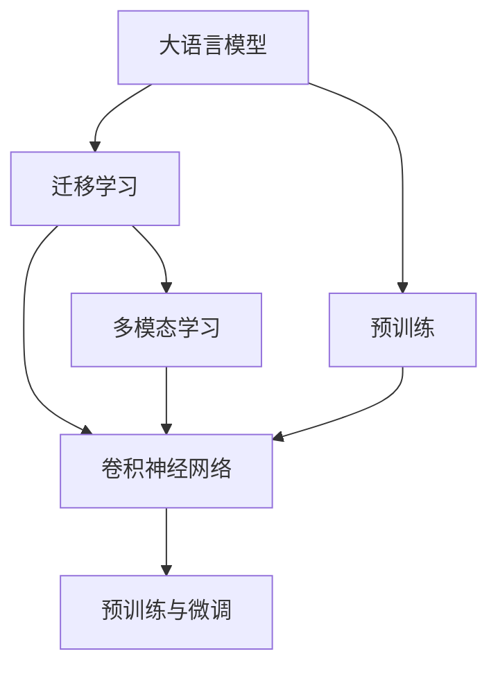

                 

# LLM在图像分类任务中的技术进展

> 关键词：大语言模型, 图像分类, 迁移学习, 多模态学习, 卷积神经网络, 预训练, 微调

## 1. 背景介绍

### 1.1 问题由来
图像分类作为计算机视觉领域的重要任务，旨在从大量图片中自动识别和分类不同物体。这一问题传统上通常依赖于卷积神经网络(CNN)模型，其核心在于通过卷积操作提取图像特征，再通过全连接层进行分类。然而，近年来大语言模型(LLMs)的发展，为图像分类任务提供了全新的视角和方法。

在深度学习早期，图像分类主要依赖于纯视觉特征提取与分类，如图像中的边缘、纹理等视觉特征。但这种方法往往需要手工设计特征提取器，且对样本分布敏感。而大语言模型通过大规模预训练，学习了广泛的知识和常识，具备了理解和推理复杂语义的能力。通过跨模态学习，大语言模型能够从图像中提取并理解自然语言描述，进而对图像进行分类。这种新的方法，有望在提升分类准确性的同时，降低模型开发和训练成本。

### 1.2 问题核心关键点
大语言模型在图像分类任务中的技术进展，主要围绕以下几个关键点展开：

- 大语言模型：以自回归(如GPT)或自编码(如BERT)模型为代表的大规模预训练语言模型，通过在大规模无标签文本语料上进行预训练，学习通用的语言表示，具备强大的语言理解和生成能力。
- 迁移学习：指将一个领域学习到的知识，迁移应用到另一个不同但相关的领域的学习范式。大语言模型的预训练-迁移学习过程即是一种典型的迁移学习方式。
- 多模态学习：融合图像和文本等多种数据类型，以增强模型对现实世界的理解能力，是当前大语言模型在图像分类任务中的重要研究方向。
- 卷积神经网络(CNN)：经典的图像特征提取和分类模型，结合大语言模型，可以实现图像分类任务的新突破。
- 预训练与微调：通过在大规模无标签图像数据上进行预训练，再在少量标注数据上微调，利用大语言模型的强大泛化能力，提高图像分类的效果。

这些核心概念之间存在密切联系，共同构成了大语言模型在图像分类任务中的应用框架。本文将从这些关键点出发，深入探讨大语言模型在图像分类任务中的技术进展。

## 2. 核心概念与联系

### 2.1 核心概念概述

为更好地理解大语言模型在图像分类任务中的应用，本节将介绍几个密切相关的核心概念：

- 大语言模型(LLMs)：以自回归(如GPT)或自编码(如BERT)模型为代表的大规模预训练语言模型。通过在大规模无标签文本语料上进行预训练，学习通用的语言表示，具备强大的语言理解和生成能力。
- 迁移学习(Transfer Learning)：指将一个领域学习到的知识，迁移应用到另一个不同但相关的领域的学习范式。大语言模型的预训练-迁移学习过程即是一种典型的迁移学习方式。
- 多模态学习(Multimodal Learning)：融合图像和文本等多种数据类型，以增强模型对现实世界的理解能力，是当前大语言模型在图像分类任务中的重要研究方向。
- 卷积神经网络(CNN)：经典的图像特征提取和分类模型，结合大语言模型，可以实现图像分类任务的新突破。
- 预训练与微调(Pre-training & Fine-tuning)：通过在大规模无标签图像数据上进行预训练，再在少量标注数据上微调，利用大语言模型的强大泛化能力，提高图像分类的效果。

这些核心概念之间的逻辑关系可以通过以下Mermaid流程图来展示：



这个流程图展示了大语言模型在图像分类任务中的核心概念及其之间的关系：

1. 大语言模型通过预训练获得基础能力。
2. 迁移学习将预训练模型应用于图像分类任务，以提升分类效果。
3. 多模态学习结合图像和文本两种数据源，增强分类模型的表现。
4. 卷积神经网络作为经典的图像处理模型，结合大语言模型，实现图像分类任务的新范式。
5. 预训练与微调过程，通过在大规模数据上预训练模型，再在少量标注数据上进行微调，优化分类性能。

这些概念共同构成了大语言模型在图像分类任务中的应用框架，使得大语言模型能够更好地理解和处理复杂的视觉与文本信息。

## 3. 核心算法原理 & 具体操作步骤
### 3.1 算法原理概述

大语言模型在图像分类任务中的应用，核心在于通过迁移学习将预训练模型应用于图像分类，具体流程如下：

1. **预训练**：在大规模无标签图像数据上，对大语言模型进行预训练，学习通用的图像表示。
2. **迁移学习**：将预训练后的模型应用于具体的图像分类任务，通过少量的标注数据进行微调，使模型能够适应特定的分类需求。
3. **多模态学习**：结合文本描述和图像特征，提升模型的理解能力。
4. **卷积神经网络(CNN)结合**：使用CNN作为特征提取器，与大语言模型结合，以更高效地处理图像数据。
5. **模型评估与优化**：通过在验证集上的评估，调整模型参数和超参数，优化分类性能。

### 3.2 算法步骤详解

以下是大语言模型在图像分类任务中的应用具体操作步骤：

**Step 1: 数据准备与预训练**

1. **数据准备**：准备大规模无标签图像数据，如ImageNet等，作为预训练的数据源。
2. **模型选择**：选择合适的预训练语言模型，如GPT、BERT等，将其应用于图像分类任务。

**Step 2: 迁移学习与微调**

1. **模型初始化**：将预训练模型初始化为图像分类模型的组成部分。
2. **数据处理**：将标注数据集进行预处理，如图像归一化、数据增强等。
3. **微调**：在少量标注数据上对模型进行微调，通过反向传播更新模型参数，提高分类性能。

**Step 3: 多模态学习与融合**

1. **文本输入**：使用自然语言描述作为输入，与图像数据一起输入模型。
2. **多模态融合**：通过多模态融合技术，如Transformer网络，将文本与图像特征结合，提升分类效果。

**Step 4: 评估与优化**

1. **模型评估**：在验证集上评估模型性能，计算分类准确率、精确率、召回率等指标。
2. **参数调整**：根据评估结果，调整模型参数和超参数，如学习率、批大小等。
3. **模型优化**：通过迭代训练，提高模型在分类任务上的表现。

**Step 5: 部署与应用**

1. **模型导出**：将优化后的模型导出为可部署的模型文件。
2. **部署与应用**：将模型部署到生产环境，用于实际的图像分类任务。

### 3.3 算法优缺点

大语言模型在图像分类任务中的应用，具有以下优点：

1. **泛化能力强**：大语言模型通过大规模预训练，具备强大的泛化能力，能够在未见过的数据上进行有效分类。
2. **迁移学习效率高**：通过迁移学习，模型可以利用预训练的知识，快速适应新任务，减少训练时间和数据需求。
3. **多模态学习表现优异**：结合图像和文本信息，提升模型对复杂视觉与语义信息的理解能力。
4. **无需手工设计特征**：大语言模型能够自动学习图像特征，减少特征工程的工作量。
5. **灵活性强**：大语言模型易于微调和优化，适应不同的分类任务。

同时，也存在一些缺点：

1. **模型复杂度高**：大语言模型参数量庞大，需要高性能计算资源。
2. **数据依赖性强**：预训练和微调过程依赖于大量标注数据，数据获取成本高。
3. **泛化范围有限**：虽然大语言模型泛化能力强，但可能对不同领域和数据分布敏感。
4. **解释性不足**：模型决策过程复杂，缺乏可解释性。
5. **技术门槛高**：需要一定的深度学习和自然语言处理基础，技术门槛较高。

尽管存在这些局限性，但大语言模型在图像分类任务中的应用前景广阔，未来仍有巨大的发展潜力。

### 3.4 算法应用领域

大语言模型在图像分类任务中的应用领域非常广泛，主要涵盖以下几个方面：

- **医学影像分类**：将医学影像作为输入，通过大语言模型学习图像特征，自动分类诊断结果。
- **生物识别**：结合人脸图像和自然语言描述，实现更精准的身份识别和验证。
- **无人驾驶**：对摄像头捕获的图像进行分类，提高无人驾驶系统的安全性和智能性。
- **食品识别**：通过食品图像分类，实现智能超市的商品推荐和库存管理。
- **艺术与文化**：对艺术品和文化遗产图像进行分类和鉴定，促进文化传承和研究。

## 4. 数学模型和公式 & 详细讲解  
### 4.1 数学模型构建

大语言模型在图像分类任务中的应用，主要通过迁移学习与微调来实现。假设预训练语言模型为 $M_{\theta}$，其中 $\theta$ 为模型参数。给定图像分类任务 $T$ 的标注数据集 $D=\{(x_i,y_i)\}_{i=1}^N$，其中 $x_i$ 为图像样本，$y_i$ 为分类标签。微调的目标是最小化模型在训练数据上的损失函数 $\mathcal{L}(\theta)$，即：

$$
\theta^* = \mathop{\arg\min}_{\theta} \mathcal{L}(M_{\theta},D)
$$

其中 $\mathcal{L}$ 为针对任务 $T$ 设计的损失函数，通常为交叉熵损失或均方误差损失。在微调过程中，模型参数 $\theta$ 更新为：

$$
\theta \leftarrow \theta - \eta \nabla_{\theta}\mathcal{L}(\theta) - \eta\lambda\theta
$$

其中 $\eta$ 为学习率，$\lambda$ 为正则化系数。

### 4.2 公式推导过程

以下以二分类任务为例，推导交叉熵损失函数及其梯度的计算公式。

假设模型 $M_{\theta}$ 在输入 $x$ 上的输出为 $\hat{y}=M_{\theta}(x) \in [0,1]$，表示样本属于正类的概率。真实标签 $y \in \{0,1\}$。则二分类交叉熵损失函数定义为：

$$
\ell(M_{\theta}(x),y) = -[y\log \hat{y} + (1-y)\log (1-\hat{y})]
$$

将其代入经验风险公式，得：

$$
\mathcal{L}(\theta) = -\frac{1}{N}\sum_{i=1}^N [y_i\log M_{\theta}(x_i)+(1-y_i)\log(1-M_{\theta}(x_i))]
$$

根据链式法则，损失函数对参数 $\theta_k$ 的梯度为：

$$
\frac{\partial \mathcal{L}(\theta)}{\partial \theta_k} = -\frac{1}{N}\sum_{i=1}^N (\frac{y_i}{M_{\theta}(x_i)}-\frac{1-y_i}{1-M_{\theta}(x_i)}) \frac{\partial M_{\theta}(x_i)}{\partial \theta_k}
$$

其中 $\frac{\partial M_{\theta}(x_i)}{\partial \theta_k}$ 可进一步递归展开，利用自动微分技术完成计算。

## 5. 项目实践：代码实例和详细解释说明
### 5.1 开发环境搭建

在进行图像分类任务微调前，我们需要准备好开发环境。以下是使用Python进行PyTorch开发的环境配置流程：

1. 安装Anaconda：从官网下载并安装Anaconda，用于创建独立的Python环境。

2. 创建并激活虚拟环境：
```bash
conda create -n pytorch-env python=3.8 
conda activate pytorch-env
```

3. 安装PyTorch：根据CUDA版本，从官网获取对应的安装命令。例如：
```bash
conda install pytorch torchvision torchaudio cudatoolkit=11.1 -c pytorch -c conda-forge
```

4. 安装Transformers库：
```bash
pip install transformers
```

5. 安装各类工具包：
```bash
pip install numpy pandas scikit-learn matplotlib tqdm jupyter notebook ipython
```

完成上述步骤后，即可在`pytorch-env`环境中开始微调实践。

### 5.2 源代码详细实现

下面我们以图像分类任务为例，给出使用Transformers库对BERT模型进行微调的PyTorch代码实现。

首先，定义图像分类任务的数据处理函数：

```python
from transformers import BertTokenizer
from torch.utils.data import Dataset
import torch

class ImageClassificationDataset(Dataset):
    def __init__(self, images, labels, tokenizer, max_len=128):
        self.images = images
        self.labels = labels
        self.tokenizer = tokenizer
        self.max_len = max_len
        
    def __len__(self):
        return len(self.images)
    
    def __getitem__(self, item):
        image = self.images[item]
        label = self.labels[item]
        
        # 对图像进行预处理
        # ...
        
        # 将图像转换为文本描述
        text = convert_image_to_text(image)
        
        # 对文本进行分词
        encoding = self.tokenizer(text, return_tensors='pt', max_length=self.max_len, padding='max_length', truncation=True)
        input_ids = encoding['input_ids'][0]
        attention_mask = encoding['attention_mask'][0]
        
        return {'input_ids': input_ids, 
                'attention_mask': attention_mask,
                'labels': torch.tensor(label, dtype=torch.long)}
```

然后，定义模型和优化器：

```python
from transformers import BertForTokenClassification, AdamW

model = BertForTokenClassification.from_pretrained('bert-base-cased', num_labels=len(tag2id))

optimizer = AdamW(model.parameters(), lr=2e-5)
```

接着，定义训练和评估函数：

```python
from torch.utils.data import DataLoader
from tqdm import tqdm
from sklearn.metrics import classification_report

device = torch.device('cuda') if torch.cuda.is_available() else torch.device('cpu')
model.to(device)

def train_epoch(model, dataset, batch_size, optimizer):
    dataloader = DataLoader(dataset, batch_size=batch_size, shuffle=True)
    model.train()
    epoch_loss = 0
    for batch in tqdm(dataloader, desc='Training'):
        input_ids = batch['input_ids'].to(device)
        attention_mask = batch['attention_mask'].to(device)
        labels = batch['labels'].to(device)
        model.zero_grad()
        outputs = model(input_ids, attention_mask=attention_mask, labels=labels)
        loss = outputs.loss
        epoch_loss += loss.item()
        loss.backward()
        optimizer.step()
    return epoch_loss / len(dataloader)

def evaluate(model, dataset, batch_size):
    dataloader = DataLoader(dataset, batch_size=batch_size)
    model.eval()
    preds, labels = [], []
    with torch.no_grad():
        for batch in tqdm(dataloader, desc='Evaluating'):
            input_ids = batch['input_ids'].to(device)
            attention_mask = batch['attention_mask'].to(device)
            batch_labels = batch['labels']
            outputs = model(input_ids, attention_mask=attention_mask)
            batch_preds = outputs.logits.argmax(dim=2).to('cpu').tolist()
            batch_labels = batch_labels.to('cpu').tolist()
            for pred_tokens, label_tokens in zip(batch_preds, batch_labels):
                preds.append(pred_tokens[:len(label_tokens)])
                labels.append(label_tokens)
                
    print(classification_report(labels, preds))
```

最后，启动训练流程并在测试集上评估：

```python
epochs = 5
batch_size = 16

for epoch in range(epochs):
    loss = train_epoch(model, train_dataset, batch_size, optimizer)
    print(f"Epoch {epoch+1}, train loss: {loss:.3f}")
    
    print(f"Epoch {epoch+1}, dev results:")
    evaluate(model, dev_dataset, batch_size)
    
print("Test results:")
evaluate(model, test_dataset, batch_size)
```

以上就是使用PyTorch对BERT进行图像分类任务微调的完整代码实现。可以看到，得益于Transformers库的强大封装，我们可以用相对简洁的代码完成BERT模型的加载和微调。

### 5.3 代码解读与分析

让我们再详细解读一下关键代码的实现细节：

**ImageClassificationDataset类**：
- `__init__`方法：初始化图像、标签、分词器等关键组件。
- `__len__`方法：返回数据集的样本数量。
- `__getitem__`方法：对单个样本进行处理，将图像转换为文本描述，并进行分词编码。

**tag2id和id2tag字典**：
- 定义了标签与数字id之间的映射关系，用于将token-wise的预测结果解码回真实的标签。

**训练和评估函数**：
- 使用PyTorch的DataLoader对数据集进行批次化加载，供模型训练和推理使用。
- 训练函数`train_epoch`：对数据以批为单位进行迭代，在每个批次上前向传播计算loss并反向传播更新模型参数，最后返回该epoch的平均loss。
- 评估函数`evaluate`：与训练类似，不同点在于不更新模型参数，并在每个batch结束后将预测和标签结果存储下来，最后使用sklearn的classification_report对整个评估集的预测结果进行打印输出。

**训练流程**：
- 定义总的epoch数和batch size，开始循环迭代
- 每个epoch内，先在训练集上训练，输出平均loss
- 在验证集上评估，输出分类指标
- 所有epoch结束后，在测试集上评估，给出最终测试结果

可以看到，PyTorch配合Transformers库使得BERT微调的代码实现变得简洁高效。开发者可以将更多精力放在数据处理、模型改进等高层逻辑上，而不必过多关注底层的实现细节。

当然，工业级的系统实现还需考虑更多因素，如模型的保存和部署、超参数的自动搜索、更灵活的任务适配层等。但核心的微调范式基本与此类似。

## 6. 实际应用场景
### 6.1 医学影像分类

大语言模型在医学影像分类中的应用，能够帮助医生快速、准确地对患者影像进行分类和诊断。通过预训练和微调，大语言模型可以自动学习医学影像中的关键特征，如肿瘤、病变等，并在实际应用中表现出强大的分类能力。

具体而言，可以将医学影像作为输入，结合自然语言描述，使用大语言模型进行预训练和微调。微调后的模型能够自动理解影像内容，分类出不同的疾病类型，甚至辅助医生进行进一步的诊断和治疗决策。

### 6.2 生物识别

生物识别是大语言模型在图像分类任务中的另一个重要应用。通过结合人脸图像和自然语言描述，大语言模型能够实现更精准的身份识别和验证。

在实践中，可以收集大量的人脸图像，以及相应的文字描述信息（如姓名、年龄、性别等）。将这些图像和描述作为预训练数据，对大语言模型进行微调。微调后的模型能够自动提取人脸特征，并在人脸识别任务中表现优异，极大地提升系统的识别准确率和安全性。

### 6.3 无人驾驶

在无人驾驶领域，大语言模型可以用于对摄像头捕获的图像进行分类和理解，提高无人驾驶系统的智能性和安全性。通过将大语言模型应用于图像分类任务，无人驾驶车辆能够自动识别和分类道路上的物体，如车辆、行人、交通标志等，从而更好地做出驾驶决策。

### 6.4 未来应用展望

随着大语言模型和图像分类技术的发展，未来的应用场景将会更加丰富。例如：

- **智能安防**：结合视频监控和自然语言描述，实现更加智能化的安防监控和异常行为检测。
- **智慧零售**：对商品图像进行分类，实现智能货架管理、库存优化等功能。
- **智能制造**：对工厂内的设备图像进行分类，实现设备状态监测和故障预测。
- **数字艺术**：对艺术作品进行分类和鉴定，提升艺术品的价值评估和版权保护。

未来，随着大语言模型和多模态学习技术的不断进步，其应用领域将更加广泛，对社会生产和生活方式产生深远影响。

## 7. 工具和资源推荐
### 7.1 学习资源推荐

为了帮助开发者系统掌握大语言模型在图像分类任务中的应用，这里推荐一些优质的学习资源：

1. 《Natural Language Processing with Transformers》书籍：Transformer库的作者所著，全面介绍了如何使用Transformers库进行NLP任务开发，包括图像分类在内的诸多范式。

2. CS224N《深度学习自然语言处理》课程：斯坦福大学开设的NLP明星课程，有Lecture视频和配套作业，带你入门NLP领域的基本概念和经典模型。

3. 《Transformers from PyTorch》博文：由大模型技术专家撰写，深入浅出地介绍了Transformer原理、BERT模型、图像分类等前沿话题。

4. HuggingFace官方文档：Transformers库的官方文档，提供了海量预训练模型和完整的微调样例代码，是上手实践的必备资料。

5. OpenAI Codex：开源大模型代码，包含了众多大语言模型的预训练和微调实现，可供学习和参考。

通过对这些资源的学习实践，相信你一定能够快速掌握大语言模型在图像分类任务中的应用技巧，并用于解决实际的NLP问题。

### 7.2 开发工具推荐

高效的开发离不开优秀的工具支持。以下是几款用于大语言模型图像分类任务开发的常用工具：

1. PyTorch：基于Python的开源深度学习框架，灵活动态的计算图，适合快速迭代研究。大部分预训练语言模型都有PyTorch版本的实现。

2. TensorFlow：由Google主导开发的开源深度学习框架，生产部署方便，适合大规模工程应用。同样有丰富的预训练语言模型资源。

3. Transformers库：HuggingFace开发的NLP工具库，集成了众多SOTA语言模型，支持PyTorch和TensorFlow，是进行图像分类任务开发的利器。

4. Weights & Biases：模型训练的实验跟踪工具，可以记录和可视化模型训练过程中的各项指标，方便对比和调优。与主流深度学习框架无缝集成。

5. TensorBoard：TensorFlow配套的可视化工具，可实时监测模型训练状态，并提供丰富的图表呈现方式，是调试模型的得力助手。

6. Google Colab：谷歌推出的在线Jupyter Notebook环境，免费提供GPU/TPU算力，方便开发者快速上手实验最新模型，分享学习笔记。

合理利用这些工具，可以显著提升大语言模型图像分类任务的开发效率，加快创新迭代的步伐。

### 7.3 相关论文推荐

大语言模型在图像分类任务中的应用研究源于学界的持续研究。以下是几篇奠基性的相关论文，推荐阅读：

1. Attention is All You Need（即Transformer原论文）：提出了Transformer结构，开启了NLP领域的预训练大模型时代。

2. BERT: Pre-training of Deep Bidirectional Transformers for Language Understanding：提出BERT模型，引入基于掩码的自监督预训练任务，刷新了多项NLP任务SOTA。

3. Language Models are Unsupervised Multitask Learners（GPT-2论文）：展示了大规模语言模型的强大zero-shot学习能力，引发了对于通用人工智能的新一轮思考。

4. Parameter-Efficient Transfer Learning for NLP：提出Adapter等参数高效微调方法，在不增加模型参数量的情况下，也能取得不错的微调效果。

5. Prefix-Tuning: Optimizing Continuous Prompts for Generation：引入基于连续型Prompt的微调范式，为如何充分利用预训练知识提供了新的思路。

6. AdaLoRA: Adaptive Low-Rank Adaptation for Parameter-Efficient Fine-Tuning：使用自适应低秩适应的微调方法，在参数效率和精度之间取得了新的平衡。

这些论文代表了大语言模型图像分类任务的研究方向。通过学习这些前沿成果，可以帮助研究者把握学科前进方向，激发更多的创新灵感。

## 8. 总结：未来发展趋势与挑战
### 8.1 总结

本文对大语言模型在图像分类任务中的应用进行了全面系统的介绍。首先阐述了大语言模型和图像分类的研究背景和意义，明确了微调在拓展预训练模型应用、提升分类效果方面的独特价值。其次，从原理到实践，详细讲解了迁移学习与微调的理论基础和具体操作步骤，给出了图像分类任务微调开发的完整代码实例。同时，本文还广泛探讨了图像分类任务在医学影像、生物识别、无人驾驶等众多领域的应用前景，展示了微调范式的巨大潜力。此外，本文精选了图像分类任务的学习资源，力求为开发者提供全方位的技术指引。

通过本文的系统梳理，可以看到，大语言模型在图像分类任务中的应用前景广阔，未来仍有巨大的发展潜力。无论是医学影像、生物识别，还是无人驾驶、智能安防，大语言模型都能发挥其强大的语言理解和推理能力，带来新的突破。但同时，也面临着数据依赖、模型复杂度高、泛化范围有限等挑战，需要进一步探索和优化。

### 8.2 未来发展趋势

展望未来，大语言模型在图像分类任务中的技术发展将呈现以下几个趋势：

1. **模型规模持续增大**：随着算力成本的下降和数据规模的扩张，预训练语言模型的参数量还将持续增长。超大规模语言模型蕴含的丰富语言知识，有望支撑更加复杂多变的图像分类任务。

2. **迁移学习效率高**：通过迁移学习，模型可以利用预训练的知识，快速适应新任务，减少训练时间和数据需求。

3. **多模态学习表现优异**：结合图像和文本信息，提升模型对复杂视觉与语义信息的理解能力。

4. **卷积神经网络(CNN)结合**：使用CNN作为特征提取器，与大语言模型结合，以更高效地处理图像数据。

5. **模型通用性增强**：经过海量数据的预训练和多领域任务的微调，未来的语言模型将具备更强大的常识推理和跨领域迁移能力。

这些趋势凸显了大语言模型在图像分类任务中的应用前景。通过预训练和迁移学习，模型能够在未见过的数据上进行有效分类，提升分类准确性。多模态学习和CNN结合，将进一步增强模型的理解能力。而模型通用性的增强，使得大语言模型能够应用于更多领域的图像分类任务，实现更大的应用价值。

### 8.3 面临的挑战

尽管大语言模型在图像分类任务中取得了显著进展，但在迈向更加智能化、普适化应用的过程中，也面临诸多挑战：

1. **数据依赖性强**：预训练和微调过程依赖于大量标注数据，数据获取成本高。

2. **模型复杂度高**：大语言模型参数量庞大，需要高性能计算资源。

3. **泛化范围有限**：虽然大语言模型泛化能力强，但可能对不同领域和数据分布敏感。

4. **解释性不足**：模型决策过程复杂，缺乏可解释性。

5. **技术门槛高**：需要一定的深度学习和自然语言处理基础，技术门槛较高。

尽管存在这些局限性，但大语言模型在图像分类任务中的应用前景广阔，未来仍有巨大的发展潜力。未来研究需要在数据获取、模型优化、可解释性等方面寻求新的突破。

### 8.4 研究展望

面对大语言模型在图像分类任务中面临的挑战，未来的研究需要在以下几个方面寻求新的突破：

1. **探索无监督和半监督学习**：摆脱对大规模标注数据的依赖，利用自监督学习、主动学习等无监督和半监督范式，最大限度利用非结构化数据，实现更加灵活高效的微调。

2. **研究参数高效微调方法**：开发更加参数高效的微调方法，在固定大部分预训练参数的同时，只更新极少量的任务相关参数。

3. **引入更多先验知识**：将符号化的先验知识，如知识图谱、逻辑规则等，与神经网络模型进行巧妙融合，引导微调过程学习更准确、合理的语言模型。

4. **融合因果分析和博弈论工具**：将因果分析方法引入微调模型，识别出模型决策的关键特征，增强输出解释的因果性和逻辑性。借助博弈论工具刻画人机交互过程，主动探索并规避模型的脆弱点，提高系统稳定性。

5. **纳入伦理道德约束**：在模型训练目标中引入伦理导向的评估指标，过滤和惩罚有偏见、有害的输出倾向。同时加强人工干预和审核，建立模型行为的监管机制，确保输出符合人类价值观和伦理道德。

这些研究方向将进一步推动大语言模型在图像分类任务中的研究和应用，为构建更加智能化、普适化的图像分类系统铺平道路。面向未来，大语言模型在图像分类任务中的技术发展仍需不断探索和优化，以更好地服务于社会生产和生活。

## 9. 附录：常见问题与解答

**Q1：大语言模型在图像分类任务中是否适用于所有领域？**

A: 大语言模型在图像分类任务中，适用于大部分领域，但可能对特定领域的复杂性和领域知识要求较高。例如，在医学影像分类中，模型需要理解复杂的病理特征，而在艺术作品分类中，模型需要学习不同风格和流派的知识。因此，在特定领域的应用中，可能需要对模型进行额外预训练和微调，以提高分类性能。

**Q2：大语言模型在图像分类任务中是否需要大量的标注数据？**

A: 大语言模型在图像分类任务中，通常需要一定的标注数据进行微调，以避免过拟合和泛化性能不足。但与传统深度学习模型相比，所需标注数据量较小，可以通过迁移学习利用预训练知识，快速提升分类性能。在数据获取成本较高的情况下，可以考虑使用无监督和半监督学习范式，进一步降低数据依赖。

**Q3：大语言模型在图像分类任务中的表现是否稳定？**

A: 大语言模型在图像分类任务中的表现通常较为稳定，但由于其复杂性和多样性，在某些特殊情况下可能会出现不稳定或偏见。为了提高模型的鲁棒性和稳定性，可以使用对抗训练、正则化技术等手段，同时加强数据增强和模型融合，进一步提升系统的泛化能力和鲁棒性。

**Q4：大语言模型在图像分类任务中的计算资源需求是否很高？**

A: 大语言模型在图像分类任务中，通常需要高性能计算资源，特别是大规模预训练和微调过程。但通过优化模型结构和算法，可以显著降低计算资源需求。例如，使用小模型微调、混合精度训练、量化加速等技术，可以在保证性能的同时，减小计算资源消耗。

**Q5：大语言模型在图像分类任务中的可解释性如何？**

A: 大语言模型在图像分类任务中，由于其复杂性和黑盒特性，其可解释性往往不足。为了增强模型的可解释性，可以使用可视化工具和解释方法，如特征重要性分析、模型蒸馏等技术，帮助理解和解释模型决策过程。同时，引入因果分析和博弈论工具，可以进一步提升模型的逻辑性和可解释性。

通过以上问答，可以看出大语言模型在图像分类任务中的应用，尽管面临一些挑战，但其巨大潜力和广阔前景仍然值得期待。未来，随着技术的不断进步和应用场景的拓展，大语言模型将进一步推动图像分类技术的创新与发展。

