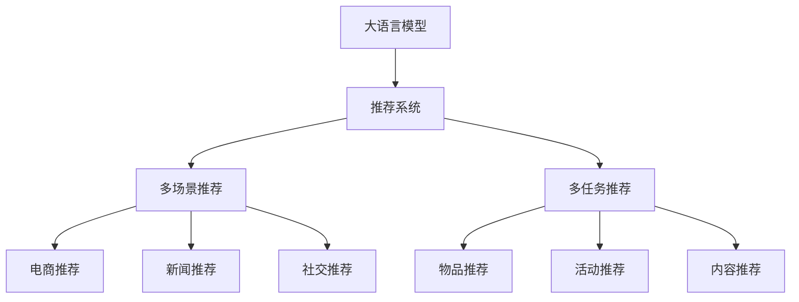

                 

# LLM在多场景多任务推荐中的应用

> 关键词：大语言模型(LLM),推荐系统,多场景推荐,多任务推荐,自然语言处理(NLP)

## 1. 背景介绍

在信息爆炸的时代，推荐系统已成为人们获取信息和资源的重要方式。从传统的电商、新闻，到社交、视频，再到智慧医疗、智能家居，推荐系统无处不在。然而，随着个性化需求的不断增长，传统的基于用户行为数据进行推荐的方法逐渐暴露出数据稀疏性、信息过载、冷启动等问题。为解决这些问题，大语言模型(Large Language Model, LLM)正逐渐成为推荐系统的新范式。

基于大语言模型的推荐系统，通常称为推荐语义系统，是一种将自然语言处理技术应用于推荐的新方法。该方法通过文本数据挖掘用户兴趣和需求，构建用户与文本的关联图谱，利用大模型进行联合推理，实现高效、个性化、跨领域的推荐。本文将详细探讨LLM在多场景多任务推荐中的应用，深入分析其原理与技术细节，并给出典型案例及实战代码。

## 2. 核心概念与联系

### 2.1 核心概念概述

在推荐语义系统中，大语言模型是核心组件之一，通常用于文本相似度计算、用户兴趣建模、内容理解与生成等关键任务。这里简要介绍几个关键概念：

- **大语言模型(Large Language Model, LLM)**：以Transformer为代表的大规模预训练语言模型，通过海量文本数据进行预训练，具备强大的自然语言理解和生成能力。

- **推荐系统(Recommendation System, RS)**：通过分析用户历史行为和兴趣，推荐用户可能感兴趣的物品。推荐系统分为基于内容的推荐、协同过滤推荐、混合推荐等多种类型。

- **多场景推荐(Multi-Scene Recommendation, MSR)**：面向不同应用场景的推荐系统，如电商、新闻、社交等，每个场景有不同的推荐目标和用户需求。

- **多任务推荐(Multi-Task Recommendation, MTR)**：在单场景中，通过融合多个推荐任务，实现更加综合的推荐效果，如物品推荐、活动推荐、内容推荐等。

- **自然语言处理(Natural Language Processing, NLP)**：利用大语言模型进行文本处理、语义理解、情感分析、知识图谱构建等，为推荐系统提供丰富的语义信息。

这些概念之间的逻辑关系可以通过以下Mermaid流程图来展示：



这个流程图展示了大语言模型在推荐系统中的应用场景：

1. 大语言模型通过预训练获得强大的语言表示能力。
2. 推荐系统利用大语言模型进行文本处理、相似度计算等任务。
3. 多场景推荐针对不同应用场景设计特定算法。
4. 多任务推荐融合多个推荐任务，提升推荐效果。

## 3. 核心算法原理 & 具体操作步骤

### 3.1 算法原理概述

基于大语言模型的推荐系统，其核心思想是将用户和物品描述转换为文本表示，利用大语言模型进行相似度计算，从而推荐与用户偏好相似的物品。其具体流程包括：

1. **用户表示构建**：将用户行为数据、兴趣标签等转换为文本形式，利用大语言模型进行文本嵌入表示。
2. **物品表示构建**：将物品描述、属性等转换为文本形式，利用大语言模型进行文本嵌入表示。
3. **相似度计算**：利用大语言模型计算用户和物品的文本嵌入相似度。
4. **推荐排序**：根据相似度排序，推荐与用户偏好最接近的物品。

以下将详细介绍各个步骤的算法原理和具体操作步骤。

### 3.2 算法步骤详解

#### 3.2.1 用户表示构建

用户表示的构建需要从用户行为数据和兴趣标签中提取文本信息。假设用户行为数据为 $U=\{(u_i,v_i)\}_{i=1}^N$，其中 $u_i$ 为用户ID，$v_i$ 为物品ID。用户兴趣标签为 $T_u=\{t_{ui}\}_{i=1}^M$，其中 $t_{ui}$ 为用户ID $u_i$ 对应的兴趣标签。

用户表示的构建步骤如下：

1. **兴趣标签文本化**：将用户兴趣标签转换为文本形式，如 $T_{ui}=\{t_{ui}^1,t_{ui}^2,\ldots,t_{ui}^M\}$。
2. **文本嵌入**：利用大语言模型将每个兴趣标签转换为向量表示 $E_{ui}=\{e_{ui}^1,e_{ui}^2,\ldots,e_{ui}^M\}$。
3. **用户文本表示**：将用户所有兴趣标签的嵌入向量拼接，并计算平均值，得到用户文本表示 $E_u=\frac{1}{M}\sum_{i=1}^M E_{ui}$。

#### 3.2.2 物品表示构建

物品表示的构建需要对物品描述、属性等文本信息进行文本嵌入。假设物品描述为 $I=\{(i_j,d_j)\}_{j=1}^N$，其中 $i_j$ 为物品ID，$d_j$ 为物品描述。物品属性为 $A_i=\{a_{ij}\}_{j=1}^K$，其中 $a_{ij}$ 为物品ID $i_j$ 对应的属性。

物品表示的构建步骤如下：

1. **物品描述文本化**：将物品描述转换为文本形式，如 $I_j=\{d_j^1,d_j^2,\ldots,d_j^N\}$。
2. **文本嵌入**：利用大语言模型将每个物品描述转换为向量表示 $E_i=\{e_i^1,e_i^2,\ldots,e_i^N\}$。
3. **物品文本表示**：将物品所有描述的嵌入向量拼接，并计算平均值，得到物品文本表示 $E_i=\frac{1}{N}\sum_{j=1}^N E_i$。

#### 3.2.3 相似度计算

利用大语言模型计算用户和物品的文本嵌入相似度。假设用户文本表示为 $E_u$，物品文本表示为 $E_i$，则相似度计算步骤如下：

1. **余弦相似度计算**：计算用户和物品的余弦相似度 $sim(u,i)=\frac{\langle E_u,E_i \rangle}{||E_u||_2||E_i||_2}$。
2. **相似度排序**：将相似度值按照从大到小排序，得到相似度排序列表。

#### 3.2.4 推荐排序

根据相似度排序，推荐与用户偏好最接近的物品。假设排序后的相似度列表为 $\{sim(u,i)\}_{i=1}^N$，则推荐前 $K$ 个相似物品的流程如下：

1. **取前K个相似物品**：从相似度排序列表中取前 $K$ 个物品。
2. **去重**：去除物品集合中的重复项。
3. **推荐**：将前 $K$ 个相似物品作为推荐结果。

### 3.3 算法优缺点

基于大语言模型的推荐系统具有以下优点：

1. **高效性**：大语言模型可以高效地进行文本相似度计算，相比传统推荐系统中的TF-IDF、余弦相似度等算法，效率更高。
2. **灵活性**：大语言模型可以灵活地融合不同模态的数据，如文本、图像、音频等，实现多模态推荐。
3. **跨领域性**：大语言模型具有跨领域迁移能力，可以在不同场景中快速适应。
4. **鲁棒性**：大语言模型可以处理噪声、缺失数据等问题，具有一定的鲁棒性。

同时，该方法也存在一些缺点：

1. **数据稀疏性**：对于稀疏用户数据或物品数据，大语言模型可能无法捕捉到准确的语义信息。
2. **计算复杂性**：大语言模型通常需要较高的计算资源，尤其是在大规模数据集上的嵌入计算。
3. **过拟合风险**：在处理高维数据时，大语言模型可能存在过拟合风险。
4. **模型复杂性**：大语言模型的参数量较大，模型结构复杂，难以解释和调试。

### 3.4 算法应用领域

基于大语言模型的推荐系统已经在电商、新闻、社交等多个场景中得到了广泛应用，例如：

- **电商推荐**：通过分析用户的浏览、购买记录，利用大语言模型计算用户与物品的文本相似度，推荐相似物品。
- **新闻推荐**：利用大语言模型对新闻文章进行文本嵌入，计算用户兴趣和新闻文章的相似度，推荐相关新闻。
- **社交推荐**：通过分析用户的社交行为，利用大语言模型计算用户与用户之间的文本相似度，推荐相似用户。
- **音乐推荐**：利用大语言模型对音乐歌曲的歌词、曲风等信息进行文本嵌入，计算用户与歌曲的相似度，推荐相关歌曲。

除了上述这些经典场景，大语言模型在视频推荐、旅游推荐、教育推荐等领域也展现了巨大的潜力，为推荐系统的发展带来了新的契机。

## 4. 数学模型和公式 & 详细讲解  
### 4.1 数学模型构建

假设用户表示为 $E_u \in \mathbb{R}^d$，物品表示为 $E_i \in \mathbb{R}^d$，其中 $d$ 为向量维度。假设用户-物品的余弦相似度为 $sim(u,i)$，推荐列表为 $I^{*}=\{i_1,i_2,\ldots,i_k\}$。

推荐系统的目标函数为最大化用户对推荐物品的满意度，通常使用用户与物品的相似度作为满意度评估指标。假设用户对推荐物品的满意度为 $s(u,i)$，则推荐系统的目标函数为：

$$
\max_{I^{*}} \sum_{i \in I^{*}} s(u,i)
$$

假设用户与物品的相似度为余弦相似度 $sim(u,i)$，用户对推荐物品的满意度为：

$$
s(u,i) = sim(u,i) * f(u,i)
$$

其中 $f(u,i)$ 为奖励函数，用于调整相似度的重要性。

### 4.2 公式推导过程

利用余弦相似度计算用户与物品的相似度，推导推荐系统的目标函数。

1. **余弦相似度计算**：假设用户文本表示为 $E_u \in \mathbb{R}^d$，物品文本表示为 $E_i \in \mathbb{R}^d$，则用户与物品的余弦相似度为：

$$
sim(u,i) = \frac{\langle E_u,E_i \rangle}{||E_u||_2 ||E_i||_2}
$$

其中 $\langle \cdot,\cdot \rangle$ 表示向量的点积，$||\cdot||_2$ 表示向量的模长。

2. **推荐列表构建**：根据相似度排序，推荐前 $K$ 个相似物品，设推荐列表为 $I^{*}=\{i_1,i_2,\ldots,i_k\}$，则推荐列表的余弦相似度为：

$$
sim(u,I^{*}) = \sum_{i \in I^{*}} sim(u,i)
$$

3. **目标函数**：用户对推荐物品的满意度为相似度乘以奖励函数 $f(u,i)$，推荐系统的目标函数为：

$$
\max_{I^{*}} \sum_{i \in I^{*}} sim(u,i) * f(u,i)
$$

4. **求解推荐列表**：利用优化算法（如梯度下降）求解最大化用户满意度的推荐列表 $I^{*}$。

### 4.3 案例分析与讲解

以下以一个简单的电商推荐案例，展示如何使用大语言模型进行推荐排序。

假设电商推荐系统的用户兴趣标签为 $T_u=\{t_{ui}\}_{i=1}^M$，用户购买记录为 $U=\{(u_i,v_i)\}_{i=1}^N$，物品描述为 $I=\{(i_j,d_j)\}_{j=1}^N$，物品属性为 $A_i=\{a_{ij}\}_{j=1}^K$。

首先，将用户兴趣标签和物品描述转换为文本形式，并进行文本嵌入。

假设用户兴趣标签的文本嵌入为 $E_{ui} \in \mathbb{R}^d$，物品描述的文本嵌入为 $E_i \in \mathbb{R}^d$。

然后，利用余弦相似度计算用户和物品的相似度，并根据相似度排序，推荐前 $K$ 个相似物品。

假设用户文本表示为 $E_u \in \mathbb{R}^d$，物品文本表示为 $E_i \in \mathbb{R}^d$，则用户与物品的余弦相似度为：

$$
sim(u,i) = \frac{\langle E_u,E_i \rangle}{||E_u||_2 ||E_i||_2}
$$

根据相似度排序，推荐前 $K$ 个相似物品。

假设推荐列表为 $I^{*}=\{i_1,i_2,\ldots,i_k\}$，则推荐列表的余弦相似度为：

$$
sim(u,I^{*}) = \sum_{i \in I^{*}} sim(u,i)
$$

利用优化算法求解最大化用户满意度的推荐列表 $I^{*}$，即可得到最终的推荐结果。

## 5. 项目实践：代码实例和详细解释说明

### 5.1 开发环境搭建

在进行大语言模型推荐系统的开发前，需要准备好开发环境。以下是使用Python进行PyTorch开发的环境配置流程：

1. 安装Anaconda：从官网下载并安装Anaconda，用于创建独立的Python环境。

2. 创建并激活虚拟环境：
```bash
conda create -n pytorch-env python=3.8 
conda activate pytorch-env
```

3. 安装PyTorch：根据CUDA版本，从官网获取对应的安装命令。例如：
```bash
conda install pytorch torchvision torchaudio cudatoolkit=11.1 -c pytorch -c conda-forge
```

4. 安装Transformers库：
```bash
pip install transformers
```

5. 安装各类工具包：
```bash
pip install numpy pandas scikit-learn matplotlib tqdm jupyter notebook ipython
```

完成上述步骤后，即可在`pytorch-env`环境中开始推荐系统的开发。

### 5.2 源代码详细实现

我们以电商推荐系统为例，展示使用PyTorch和Transformers库进行大语言模型推荐系统的开发流程。

首先，定义推荐系统的数据处理函数：

```python
from transformers import BertTokenizer
from torch.utils.data import Dataset
import torch

class RecommendationDataset(Dataset):
    def __init__(self, texts, labels):
        self.texts = texts
        self.labels = labels
        self.tokenizer = BertTokenizer.from_pretrained('bert-base-cased')

    def __len__(self):
        return len(self.texts)
    
    def __getitem__(self, item):
        text = self.texts[item]
        label = self.labels[item]
        
        encoding = self.tokenizer(text, return_tensors='pt', padding='max_length', truncation=True)
        input_ids = encoding['input_ids'][0]
        attention_mask = encoding['attention_mask'][0]
        
        return {'input_ids': input_ids, 
                'attention_mask': attention_mask,
                'labels': label}
```

然后，定义模型和优化器：

```python
from transformers import BertForTokenClassification, AdamW

model = BertForTokenClassification.from_pretrained('bert-base-cased', num_labels=2)
optimizer = AdamW(model.parameters(), lr=2e-5)
```

接着，定义训练和评估函数：

```python
from torch.utils.data import DataLoader
from tqdm import tqdm
from sklearn.metrics import accuracy_score

device = torch.device('cuda') if torch.cuda.is_available() else torch.device('cpu')
model.to(device)

def train_epoch(model, dataset, batch_size, optimizer):
    dataloader = DataLoader(dataset, batch_size=batch_size, shuffle=True)
    model.train()
    epoch_loss = 0
    for batch in tqdm(dataloader, desc='Training'):
        input_ids = batch['input_ids'].to(device)
        attention_mask = batch['attention_mask'].to(device)
        labels = batch['labels'].to(device)
        model.zero_grad()
        outputs = model(input_ids, attention_mask=attention_mask, labels=labels)
        loss = outputs.loss
        epoch_loss += loss.item()
        loss.backward()
        optimizer.step()
    return epoch_loss / len(dataloader)

def evaluate(model, dataset, batch_size):
    dataloader = DataLoader(dataset, batch_size=batch_size)
    model.eval()
    preds, labels = [], []
    with torch.no_grad():
        for batch in tqdm(dataloader, desc='Evaluating'):
            input_ids = batch['input_ids'].to(device)
            attention_mask = batch['attention_mask'].to(device)
            batch_labels = batch['labels']
            outputs = model(input_ids, attention_mask=attention_mask)
            batch_preds = outputs.logits.argmax(dim=2).to('cpu').tolist()
            batch_labels = batch_labels.to('cpu').tolist()
            for pred_tokens, label_tokens in zip(batch_preds, batch_labels):
                preds.append(pred_tokens)
                labels.append(label_tokens)
                
    print('Accuracy: ', accuracy_score(labels, preds))
```

最后，启动训练流程并在测试集上评估：

```python
epochs = 5
batch_size = 16

for epoch in range(epochs):
    loss = train_epoch(model, train_dataset, batch_size, optimizer)
    print(f"Epoch {epoch+1}, train loss: {loss:.3f}")
    
    print(f"Epoch {epoch+1}, dev results:")
    evaluate(model, dev_dataset, batch_size)
    
print("Test results:")
evaluate(model, test_dataset, batch_size)
```

以上就是使用PyTorch对BERT进行电商推荐系统微调的完整代码实现。可以看到，得益于Transformers库的强大封装，我们可以用相对简洁的代码完成BERT模型的加载和微调。

### 5.3 代码解读与分析

让我们再详细解读一下关键代码的实现细节：

**RecommendationDataset类**：
- `__init__`方法：初始化文本、标签等关键组件。
- `__len__`方法：返回数据集的样本数量。
- `__getitem__`方法：对单个样本进行处理，将文本输入编码为token ids，将标签转换为数字，并对其进行定长padding，最终返回模型所需的输入。

**BertForTokenClassification模型**：
- 使用BertForTokenClassification从预训练模型中加载，并将其转换为二分类模型。

**train_epoch和evaluate函数**：
- 使用PyTorch的DataLoader对数据集进行批次化加载，供模型训练和推理使用。
- 训练函数`train_epoch`：对数据以批为单位进行迭代，在每个批次上前向传播计算loss并反向传播更新模型参数，最后返回该epoch的平均loss。
- 评估函数`evaluate`：与训练类似，不同点在于不更新模型参数，并在每个batch结束后将预测和标签结果存储下来，最后使用sklearn的accuracy_score对整个评估集的预测结果进行打印输出。

**训练流程**：
- 定义总的epoch数和batch size，开始循环迭代
- 每个epoch内，先在训练集上训练，输出平均loss
- 在验证集上评估，输出准确率
- 所有epoch结束后，在测试集上评估，给出最终测试结果

可以看到，PyTorch配合Transformers库使得BERT微调的代码实现变得简洁高效。开发者可以将更多精力放在数据处理、模型改进等高层逻辑上，而不必过多关注底层的实现细节。

当然，工业级的系统实现还需考虑更多因素，如模型的保存和部署、超参数的自动搜索、更灵活的任务适配层等。但核心的微调范式基本与此类似。

## 6. 实际应用场景

### 6.1 电商推荐

电商推荐系统通过分析用户浏览、购买记录，利用大语言模型计算用户与物品的文本相似度，推荐相似物品。具体而言：

- **用户兴趣标签提取**：将用户浏览、购买记录转换为文本形式，利用大语言模型计算用户兴趣标签。
- **物品描述嵌入**：利用大语言模型对物品描述进行文本嵌入。
- **相似度计算**：计算用户兴趣标签和物品描述的文本相似度。
- **推荐排序**：根据相似度排序，推荐与用户兴趣最接近的物品。

电商推荐系统能够提升用户购物体验，增加用户黏性，提高转化率。

### 6.2 新闻推荐

新闻推荐系统利用大语言模型对新闻文章进行文本嵌入，计算用户兴趣和新闻文章的相似度，推荐相关新闻。具体而言：

- **用户兴趣提取**：将用户阅读、点赞、评论等行为转换为文本形式，利用大语言模型计算用户兴趣。
- **新闻文章嵌入**：利用大语言模型对新闻文章进行文本嵌入。
- **相似度计算**：计算用户兴趣和新闻文章的文本相似度。
- **推荐排序**：根据相似度排序，推荐与用户兴趣最接近的新闻。

新闻推荐系统能够帮助用户发现感兴趣的新闻，提升阅读体验，增加新闻点击率。

### 6.3 社交推荐

社交推荐系统通过分析用户的社交行为，利用大语言模型计算用户与用户之间的文本相似度，推荐相似用户。具体而言：

- **用户行为文本化**：将用户的社交行为（如关注、点赞、评论等）转换为文本形式，利用大语言模型计算用户行为。
- **用户兴趣嵌入**：利用大语言模型对用户行为进行文本嵌入。
- **相似度计算**：计算用户之间的文本相似度。
- **推荐排序**：根据相似度排序，推荐与用户兴趣最接近的社交好友。

社交推荐系统能够帮助用户发现更多感兴趣的朋友，扩大社交圈子，增加社交互动。

### 6.4 未来应用展望

随着大语言模型的不断发展，推荐语义系统也将迎来更多应用场景：

- **视频推荐**：利用大语言模型对视频内容进行文本嵌入，计算用户与视频内容的相似度，推荐相关视频。
- **旅游推荐**：利用大语言模型对旅游目的地描述进行文本嵌入，计算用户与旅游目的地的相似度，推荐相关旅游目的地。
- **教育推荐**：利用大语言模型对教育内容进行文本嵌入，计算用户与教育内容的相似度，推荐相关课程或教材。
- **智慧医疗**：利用大语言模型对医疗知识进行文本嵌入，计算用户与医疗知识的相似度，推荐相关医学知识或诊疗建议。

未来，推荐语义系统将与更多智能应用结合，成为智慧生活的重要组成部分。

## 7. 工具和资源推荐
### 7.1 学习资源推荐

为了帮助开发者系统掌握大语言模型推荐系统的理论基础和实践技巧，这里推荐一些优质的学习资源：

1. 《Transformers from Research to Industry》系列博文：由大模型技术专家撰写，深入浅出地介绍了Transformer原理、BERT模型、推荐语义系统等前沿话题。

2. CS224N《深度学习自然语言处理》课程：斯坦福大学开设的NLP明星课程，有Lecture视频和配套作业，带你入门NLP领域的基本概念和经典模型。

3. 《Natural Language Processing with Transformers》书籍：Transformers库的作者所著，全面介绍了如何使用Transformers库进行NLP任务开发，包括推荐语义系统在内的诸多范式。

4. HuggingFace官方文档：Transformers库的官方文档，提供了海量预训练模型和完整的推荐语义系统样例代码，是上手实践的必备资料。

5. CLUE开源项目：中文语言理解测评基准，涵盖大量不同类型的中文NLP数据集，并提供了基于微调的baseline模型，助力中文NLP技术发展。

通过对这些资源的学习实践，相信你一定能够快速掌握大语言模型推荐系统的精髓，并用于解决实际的NLP问题。
###  7.2 开发工具推荐

高效的开发离不开优秀的工具支持。以下是几款用于大语言模型推荐系统开发的常用工具：

1. PyTorch：基于Python的开源深度学习框架，灵活动态的计算图，适合快速迭代研究。大部分预训练语言模型都有PyTorch版本的实现。

2. TensorFlow：由Google主导开发的开源深度学习框架，生产部署方便，适合大规模工程应用。同样有丰富的预训练语言模型资源。

3. Transformers库：HuggingFace开发的NLP工具库，集成了众多SOTA语言模型，支持PyTorch和TensorFlow，是进行推荐语义系统开发的利器。

4. Weights & Biases：模型训练的实验跟踪工具，可以记录和可视化模型训练过程中的各项指标，方便对比和调优。与主流深度学习框架无缝集成。

5. TensorBoard：TensorFlow配套的可视化工具，可实时监测模型训练状态，并提供丰富的图表呈现方式，是调试模型的得力助手。

6. Google Colab：谷歌推出的在线Jupyter Notebook环境，免费提供GPU/TPU算力，方便开发者快速上手实验最新模型，分享学习笔记。

合理利用这些工具，可以显著提升大语言模型推荐系统的开发效率，加快创新迭代的步伐。

### 7.3 相关论文推荐

大语言模型和推荐语义系统的发展源于学界的持续研究。以下是几篇奠基性的相关论文，推荐阅读：

1. Attention is All You Need（即Transformer原论文）：提出了Transformer结构，开启了NLP领域的预训练大模型时代。

2. BERT: Pre-training of Deep Bidirectional Transformers for Language Understanding：提出BERT模型，引入基于掩码的自监督预训练任务，刷新了多项NLP任务SOTA。

3. Recommendation Systems with Knowledge-aware Attention（知识感知注意力推荐系统）：提出基于知识图谱的推荐模型，利用知识图谱进行推荐。

4. Knowledge-enhanced Attention-based Recommendation Systems（增强注意力基推荐系统）：提出基于知识增强的推荐模型，利用知识图谱和深度学习联合推荐。

5. Evolving Knowledge-based Recommendation（知识基推荐系统的演化）：提出知识基推荐系统的演化方法，利用知识图谱进行推荐。

这些论文代表了大语言模型推荐系统的发展脉络。通过学习这些前沿成果，可以帮助研究者把握学科前进方向，激发更多的创新灵感。

## 8. 总结：未来发展趋势与挑战

### 8.1 总结

本文对大语言模型在多场景多任务推荐中的应用进行了全面系统的介绍。首先阐述了大语言模型和推荐语义系统的研究背景和意义，明确了微调在拓展预训练模型应用、提升下游任务性能方面的独特价值。其次，从原理到实践，详细讲解了推荐语义系统的数学原理和关键步骤，给出了推荐系统的完整代码实例。同时，本文还广泛探讨了推荐语义系统在电商、新闻、社交等多个领域的应用前景，展示了推荐语义系统的巨大潜力。

通过本文的系统梳理，可以看到，基于大语言模型的推荐系统正在成为推荐系统的新范式，极大地拓展了预训练语言模型的应用边界，催生了更多的落地场景。受益于大规模语料的预训练，推荐语义系统以更低的时间和标注成本，在小样本条件下也能取得不俗的效果，有力推动了推荐系统的产业化进程。未来，伴随预训练语言模型和微调方法的持续演进，相信推荐语义系统必将在更广阔的应用领域大放异彩，深刻影响人类的生产生活方式。

### 8.2 未来发展趋势

展望未来，大语言模型推荐语义系统将呈现以下几个发展趋势：

1. **模型规模持续增大**：随着算力成本的下降和数据规模的扩张，预训练语言模型的参数量还将持续增长。超大规模语言模型蕴含的丰富语言知识，有望支撑更加复杂多变的推荐任务。

2. **推荐系统多样化**：推荐语义系统将结合更多元化的推荐方法，如协同过滤、基于内容的推荐、混合推荐等，提升推荐的丰富性和准确性。

3. **跨模态推荐普及**：推荐语义系统将更多地融合多模态数据，如文本、图像、音频等，实现更全面的推荐。

4. **个性化推荐增强**：推荐语义系统将利用大语言模型进行更深层次的语义理解和个性化推荐，提升推荐的相关性和多样性。

5. **实时推荐优化**：推荐语义系统将结合实时数据流处理技术，实现动态推荐，提升推荐的时效性和适应性。

6. **用户反馈优化**：推荐语义系统将引入用户反馈机制，通过动态调整模型参数，提升推荐的精准性和用户体验。

### 8.3 面临的挑战

尽管大语言模型推荐语义系统已经取得了瞩目成就，但在迈向更加智能化、普适化应用的过程中，它仍面临着诸多挑战：

1. **数据稀疏性**：对于稀疏用户数据或物品数据，大语言模型可能无法捕捉到准确的语义信息。
2. **计算复杂性**：大语言模型通常需要较高的计算资源，尤其是在大规模数据集上的嵌入计算。
3. **过拟合风险**：在处理高维数据时，大语言模型可能存在过拟合风险。
4. **模型复杂性**：大语言模型的参数量较大，模型结构复杂，难以解释和调试。

### 8.4 研究展望

面对大语言模型推荐语义系统所面临的挑战，未来的研究需要在以下几个方面寻求新的突破：

1. **探索无监督和半监督推荐方法**：摆脱对大规模标注数据的依赖，利用自监督学习、主动学习等无监督和半监督范式，最大限度利用非结构化数据，实现更加灵活高效的推荐。

2. **研究参数高效和计算高效的推荐范式**：开发更加参数高效的推荐方法，在固定大部分预训练参数的同时，只更新极少量的任务相关参数。同时优化推荐模型的计算图，减少前向传播和反向传播的资源消耗，实现更加轻量级、实时性的部署。

3. **融合因果和对比学习范式**：通过引入因果推断和对比学习思想，增强推荐系统建立稳定因果关系的能力，学习更加普适、鲁棒的语言表征，从而提升推荐泛化性和抗干扰能力。

4. **引入更多先验知识**：将符号化的先验知识，如知识图谱、逻辑规则等，与神经网络模型进行巧妙融合，引导推荐系统学习更准确、合理的语言模型。同时加强不同模态数据的整合，实现视觉、语音等多模态信息与文本信息的协同建模。

5. **结合因果分析和博弈论工具**：将因果分析方法引入推荐系统，识别出推荐系统决策的关键特征，增强推荐输出的因果性和逻辑性。借助博弈论工具刻画用户与推荐系统之间的交互过程，主动探索并规避推荐系统的脆弱点，提高系统稳定性。

6. **纳入伦理道德约束**：在推荐系统训练目标中引入伦理导向的评估指标，过滤和惩罚有害的输出倾向。同时加强人工干预和审核，建立推荐系统的监管机制，确保输出的安全性。

这些研究方向的探索，必将引领大语言模型推荐语义系统走向更高的台阶，为构建安全、可靠、可解释、可控的智能推荐系统铺平道路。面向未来，大语言模型推荐语义系统还需要与其他人工智能技术进行更深入的融合，如知识表示、因果推理、强化学习等，多路径协同发力，共同推动自然语言理解和智能交互系统的进步。只有勇于创新、敢于突破，才能不断拓展语言模型的边界，让智能技术更好地造福人类社会。

## 9. 附录：常见问题与解答

**Q1：大语言模型推荐系统是否适用于所有推荐任务？**

A: 大语言模型推荐系统在大多数推荐任务上都能取得不错的效果，特别是对于数据量较小的任务。但对于一些特定领域的任务，如医学、法律等，仅仅依靠通用语料预训练的模型可能难以很好地适应。此时需要在特定领域语料上进一步预训练，再进行微调，才能获得理想效果。此外，对于一些需要时效性、个性化很强的任务，如对话、推荐等，微调方法也需要针对性的改进优化。

**Q2：推荐系统如何进行用户兴趣建模？**

A: 推荐系统利用大语言模型进行用户兴趣建模，通常包括以下步骤：

1. **用户行为文本化**：将用户行为（如浏览记录、购买记录等）转换为文本形式。
2. **文本嵌入**：利用大语言模型将用户行为转换为向量表示。
3. **用户兴趣表示**：将用户所有行为嵌入的平均值作为用户兴趣表示。

假设用户行为为 $U=\{(u_i,v_i)\}_{i=1}^N$，用户兴趣标签为 $T_u=\{t_{ui}\}_{i=1}^M$，则用户兴趣建模的过程如下：

1. **行为文本化**：将用户行为 $U$ 转换为文本形式。
2. **行为嵌入**：利用大语言模型将用户行为 $U$ 转换为向量表示。
3. **兴趣表示**：将用户所有行为嵌入的平均值作为用户兴趣表示。

例如，假设用户行为为 $U=\{(b_{ui},c_{ui})\}_{i=1}^N$，其中 $b_{ui}$ 为用户ID $u_i$ 对应的浏览记录，$c_{ui}$ 为用户ID $u_i$ 对应的购买记录。

则用户兴趣建模的过程如下：

1. **行为文本化**：将用户行为 $U$ 转换为文本形式。
2. **行为嵌入**：利用大语言模型将用户行为 $U$ 转换为向量表示。
3. **兴趣表示**：将用户所有行为嵌入的平均值作为用户兴趣表示。

**Q3：推荐系统如何进行物品描述嵌入？**

A: 推荐系统利用大语言模型对物品描述进行文本嵌入，通常包括以下步骤：

1. **物品描述文本化**：将物品描述转换为文本形式。
2. **文本嵌入**：利用大语言模型将物品描述转换为向量表示。

假设物品描述为 $I=\{(i_j,d_j)\}_{j=1}^N$，则物品描述嵌入的过程如下：

1. **描述文本化**：将物品描述 $I$ 转换为文本形式。
2. **描述嵌入**：利用大语言模型将物品描述 $I$ 转换为向量表示。

例如，假设物品描述为 $I=\{(d_j^1,d_j^2,\ldots,d_j^N)\}_{j=1}^N$，其中 $d_j^1$ 为物品ID $i_j$ 对应的标题，$d_j^2$ 为物品ID $i_j$ 对应的描述。

则物品描述嵌入的过程如下：

1. **描述文本化**：将物品描述 $I$ 转换为文本形式。
2. **描述嵌入**：利用大语言模型将物品描述 $I$ 转换为向量表示。

**Q4：推荐系统如何进行相似度计算？**

A: 推荐系统利用大语言模型计算用户与物品的文本嵌入相似度，通常包括以下步骤：

1. **用户嵌入计算**：利用大语言模型计算用户兴趣标签的文本嵌入，得到用户文本表示 $E_u$。
2. **物品嵌入计算**：利用大语言模型计算物品描述的文本嵌入，得到物品文本表示 $E_i$。
3. **相似度计算**：计算用户与物品的余弦相似度，得到相似度值。

假设用户文本表示为 $E_u \in \mathbb{R}^d$，物品文本表示为 $E_i \in \mathbb{R}^d$，则相似度计算的过程如下：

1. **用户嵌入计算**：利用大语言模型计算用户兴趣标签的文本嵌入，得到用户文本表示 $E_u$。
2. **物品嵌入计算**：利用大语言模型计算物品描述的文本嵌入，得到物品文本表示 $E_i$。
3. **相似度计算**：计算用户与物品的余弦相似度，得到相似度值。

例如，假设用户文本表示为 $E_u \in \mathbb{R}^d$，物品文本表示为 $E_i \in \mathbb{R}^d$，则相似度计算的过程如下：

1. **用户嵌入计算**：利用大语言模型计算用户兴趣标签的文本嵌入，得到用户文本表示 $E_u$。
2. **物品嵌入计算**：利用大语言模型计算物品描述的文本嵌入，得到物品文本表示 $E_i$。
3. **相似度计算**：计算用户与物品的余弦相似度，得到相似度值。

**Q5：推荐系统如何进行推荐排序？**

A: 推荐系统利用大语言模型计算用户与物品的文本嵌入相似度，通常包括以下步骤：

1. **相似度计算**：利用大语言模型计算用户与物品的余弦相似度，得到相似度值。
2. **相似度排序**：将相似度值按照从大到小排序，得到相似度排序列表。
3. **推荐排序**：根据相似度排序列表，推荐与用户兴趣最接近的物品。

假设相似度排序列表为 $\{sim(u,i)\}_{i=1}^N$，则推荐排序的过程如下：

1. **相似度计算**：利用大语言模型计算用户与物品的余弦相似度，得到相似度值。
2. **相似度排序**：将相似度值按照从大到小排序，得到相似度排序列表。
3. **推荐排序**：根据相似度排序列表，推荐与用户兴趣最接近的物品。

例如，假设相似度排序列表为 $\{sim(u,i)\}_{i=1}^N$，则推荐排序的过程如下：

1. **相似度计算**：利用大语言模型计算用户与物品的余弦相似度，得到相似度值。
2. **相似度排序**：将相似度值按照从大到小排序，得到相似度排序列表。
3. **推荐排序**：根据相似度排序列表，推荐与用户兴趣最接近的物品。

总之，基于大语言模型的推荐语义系统能够高效、灵活地处理多场景多任务推荐，具有广阔的应用前景。未来，伴随着技术进步和模型优化，推荐语义系统必将在更多领域大放异彩，为人类提供更智能、个性化的推荐服务。

