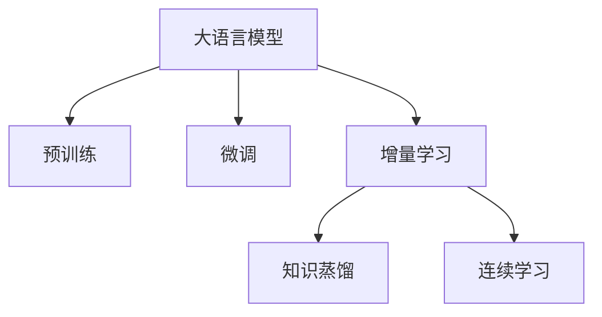

                 

# 大语言模型在推荐系统中的增量学习方法

大语言模型（Large Language Models, LLMs）在自然语言处理领域取得了显著的进展，如GPT-3、BERT等模型。这些模型通过大规模的预训练，学习到了丰富的语言知识，可以应用于各种自然语言任务，如文本分类、命名实体识别、问答系统等。然而，这些模型的参数量通常很大，训练和推理需要大量的计算资源和存储空间。因此，如何在大规模数据集上进行高效的增量学习，减少计算资源和存储空间的需求，同时保持模型性能的稳定和提升，成为近年来研究的热点问题。

本文将介绍大语言模型在推荐系统中的增量学习方法，探讨如何在推荐系统中利用大语言模型进行高效增量学习，以提高推荐系统的准确性和个性化程度。

## 1. 背景介绍

### 1.1 推荐系统概述

推荐系统是一种通过分析用户的历史行为数据，预测用户对未曝光物品的偏好，从而为用户推荐最相关物品的系统。推荐系统广泛应用于电商、视频、音乐、新闻等领域，帮助用户发现新的兴趣点，提升用户体验。

传统推荐系统主要基于协同过滤、矩阵分解等方法，以用户-物品的评分矩阵为基础进行推荐。然而，随着数据量和用户行为多样性的增长，推荐系统需要具备更强大的建模能力，以应对大规模、高维度的数据挑战。

近年来，大语言模型在推荐系统中的应用逐渐兴起，利用其强大的语义理解能力和知识表示能力，结合推荐系统框架，进行高精度的用户兴趣建模和推荐结果生成。然而，由于大语言模型通常参数量庞大，训练和推理资源需求高，难以应用于大规模实时推荐系统中。

### 1.2 增量学习概述

增量学习（Incremental Learning）是一种利用现有模型的知识，高效更新模型参数，以应对新数据的方法。相比从头训练模型，增量学习可以显著减少计算资源和存储空间的需求，同时维持模型的稳定性。

增量学习广泛应用于推荐系统、图像处理、自然语言处理等领域，已成为解决大规模、动态数据处理问题的关键技术。在推荐系统中，增量学习可以实时更新用户行为数据，避免模型过时，提升推荐系统的实时性和个性化程度。

## 2. 核心概念与联系

### 2.1 核心概念概述

为更好地理解大语言模型在推荐系统中的增量学习方法，本节将介绍几个密切相关的核心概念：

- 大语言模型(Large Language Model, LLM)：以自回归(如GPT)或自编码(如BERT)模型为代表的大规模预训练语言模型。通过在大规模无标签文本语料上进行预训练，学习通用的语言知识，具备强大的语言理解和生成能力。

- 预训练(Pre-training)：指在大规模无标签文本语料上，通过自监督学习任务训练通用语言模型的过程。常见的预训练任务包括言语建模、掩码语言模型等。预训练使得模型学习到语言的通用表示。

- 微调(Fine-tuning)：指在预训练模型的基础上，使用下游任务的少量标注数据，通过有监督学习优化模型在该任务上的性能。通常只需要调整顶层分类器或解码器，并以较小的学习率更新全部或部分的模型参数。

- 增量学习(Incremental Learning)：指在现有模型的基础上，利用新数据更新模型参数，保持模型性能的稳定和提升。增量学习使得模型能够高效地适应新数据，同时减少计算资源和存储空间的需求。

- 知识蒸馏(Knowledge Distillation)：指通过知识蒸馏技术，将大型复杂模型学到的知识，转移到小型简单模型中。知识蒸馏可以显著提升小型模型的性能，同时减少训练和推理的计算资源消耗。

- 连续学习(Continual Learning)：指模型能够持续从新数据中学习，同时保持已学习的知识，而不会出现灾难性遗忘。这对于保持大语言模型的时效性和适应性至关重要。

这些核心概念之间的逻辑关系可以通过以下Mermaid流程图来展示：



这个流程图展示了大语言模型的核心概念及其之间的关系：

1. 大语言模型通过预训练获得基础能力。
2. 微调是对预训练模型进行任务特定的优化，可以分为全参数微调和增量学习。
3. 增量学习使得模型能够高效地适应新数据，同时减少计算资源和存储空间的需求。
4. 知识蒸馏将大型复杂模型学到的知识，转移到小型简单模型中，提升小型模型的性能。
5. 连续学习使模型能够持续从新数据中学习，同时保持已学习的知识，避免灾难性遗忘。

## 3. 核心算法原理 & 具体操作步骤

### 3.1 算法原理概述

在大语言模型应用于推荐系统的增量学习方法中，主要涉及以下几个关键步骤：

1. 预训练大语言模型，学习通用的语言表示。
2. 使用微调技术，根据推荐系统任务，优化模型参数。
3. 在推荐系统中，使用增量学习技术，更新模型参数，适应新数据。
4. 通过知识蒸馏和连续学习，提升模型性能，保持模型稳定。

### 3.2 算法步骤详解

#### 3.2.1 预训练大语言模型

预训练大语言模型是指在大规模无标签文本数据上，通过自监督学习任务，学习通用语言表示的模型。常见的预训练任务包括：

- 语言建模任务：预测下一个词或下一个字符，学习语言的统计规律。
- 掩码语言模型任务：随机掩盖部分文本，预测被掩盖的词汇，学习语言的上下文信息。
- 序列对标任务：预测两个句子之间的相似度，学习语义关系。

这些预训练任务使得大语言模型学习到丰富的语言知识，具备强大的语义理解能力和知识表示能力。

#### 3.2.2 微调模型

微调模型是指在预训练模型的基础上，使用推荐系统的少量标注数据，通过有监督学习优化模型参数的过程。微调可以提升模型在推荐系统任务上的性能，使其更适应特定应用场景。

微调过程包括：

- 选择合适的损失函数，如交叉熵损失、均方误差损失等。
- 添加推荐系统的任务适配层，如全连接层、卷积层等。
- 设置合适的学习率，避免过拟合。
- 使用正则化技术，如L2正则、Dropout等，防止模型过拟合。

#### 3.2.3 增量学习模型

增量学习模型是指在现有模型的基础上，利用推荐系统中的新数据，高效更新模型参数的过程。增量学习可以避免从头训练模型，减少计算资源和存储空间的需求。

增量学习过程包括：

- 收集推荐系统中的新数据。
- 使用增量学习算法，如在线梯度下降、增量最小二乘等，更新模型参数。
- 定期评估模型性能，确保模型性能稳定。

#### 3.2.4 知识蒸馏和连续学习

知识蒸馏和连续学习是提升大语言模型性能和稳定性的重要技术。

知识蒸馏是指通过知识蒸馏技术，将大型复杂模型学到的知识，转移到小型简单模型中。知识蒸馏可以显著提升小型模型的性能，同时减少训练和推理的计算资源消耗。

连续学习是指模型能够持续从新数据中学习，同时保持已学习的知识，而不会出现灾难性遗忘。这对于保持大语言模型的时效性和适应性至关重要。

## 4. 数学模型和公式 & 详细讲解 & 举例说明

### 4.1 数学模型构建

假设推荐系统中的预训练大语言模型为 $M_{\theta}$，其中 $\theta$ 为模型参数。使用微调技术优化模型参数后，得到微调后的模型 $M_{\theta^*}$。使用增量学习技术，根据推荐系统中的新数据，更新模型参数，得到增量学习后的模型 $M_{\theta^{++}}$。

定义推荐系统的损失函数为 $\mathcal{L}$，其中 $\mathcal{L}(M_{\theta^*},D_{train})$ 表示在训练集上的损失函数，$\mathcal{L}(M_{\theta^{++}},D_{new})$ 表示在新数据集上的损失函数。

数学模型构建的详细推导过程如下：

$$
\min_{\theta} \mathcal{L}(M_{\theta}, D_{train}) + \mathcal{L}(M_{\theta}, D_{new})
$$

其中，$D_{train}$ 表示训练集，$D_{new}$ 表示新数据集。

### 4.2 公式推导过程

以交叉熵损失函数为例，对公式进行详细推导。

假设推荐系统中的新数据集为 $D_{new}=\{(x_i,y_i)\}_{i=1}^N$，其中 $x_i$ 表示用户行为数据，$y_i$ 表示推荐结果。推荐系统的目标函数为：

$$
\mathcal{L}(M_{\theta^{++}},D_{new}) = -\frac{1}{N}\sum_{i=1}^N [y_i\log M_{\theta^{++}}(x_i)+(1-y_i)\log(1-M_{\theta^{++}}(x_i))]
$$

其中，$M_{\theta^{++}}$ 表示增量学习后的模型，$M_{\theta^{++}}(x_i)$ 表示模型在用户行为数据 $x_i$ 上的预测结果。

根据梯度下降算法，更新模型参数 $\theta^{++}$ 的过程如下：

$$
\theta^{++} \leftarrow \theta^{++} - \eta \nabla_{\theta^{++}}\mathcal{L}(M_{\theta^{++}},D_{new})
$$

其中，$\eta$ 为学习率，$\nabla_{\theta^{++}}\mathcal{L}(M_{\theta^{++}},D_{new})$ 表示损失函数对模型参数的梯度。

### 4.3 案例分析与讲解

以电商推荐系统为例，进行详细案例分析。

假设电商推荐系统中的用户行为数据为 $D_{train}=\{(x_1,y_1),(x_2,y_2),...(x_N,y_N)\}$，其中 $x_i$ 表示用户浏览、点击、购买等行为，$y_i$ 表示用户对物品的评分。

在大语言模型预训练完成后，使用微调技术，在电商推荐系统任务上对模型进行优化，得到微调后的模型 $M_{\theta^*}$。

在新用户行为数据 $D_{new}=\{(x_{N+1},y_{N+1}),(x_{N+2},y_{N+2}),...(x_{M},y_{M})\}$ 上，使用增量学习算法更新模型参数，得到增量学习后的模型 $M_{\theta^{++}}$。

在增量学习过程中，使用在线梯度下降算法，计算模型在新数据集上的梯度，并更新模型参数。具体过程如下：

$$
\theta^{++} \leftarrow \theta^* - \eta \nabla_{\theta^*}\mathcal{L}(M_{\theta^*},D_{train}) - \eta \nabla_{\theta^*}\mathcal{L}(M_{\theta^*},D_{new})
$$

其中，$\nabla_{\theta^*}\mathcal{L}(M_{\theta^*},D_{train})$ 表示在训练集上的梯度，$\nabla_{\theta^*}\mathcal{L}(M_{\theta^*},D_{new})$ 表示在新数据集上的梯度。

通过增量学习算法，模型能够高效地适应新数据，同时保持模型的稳定性和性能。

## 5. 项目实践：代码实例和详细解释说明

### 5.1 开发环境搭建

在进行推荐系统中的增量学习实践前，我们需要准备好开发环境。以下是使用Python进行TensorFlow开发的环境配置流程：

1. 安装Anaconda：从官网下载并安装Anaconda，用于创建独立的Python环境。

2. 创建并激活虚拟环境：
```bash
conda create -n tf-env python=3.8 
conda activate tf-env
```

3. 安装TensorFlow：根据CUDA版本，从官网获取对应的安装命令。例如：
```bash
conda install tensorflow -c tensorflow
```

4. 安装各类工具包：
```bash
pip install numpy pandas scikit-learn matplotlib tqdm jupyter notebook ipython
```

完成上述步骤后，即可在`tf-env`环境中开始增量学习实践。

### 5.2 源代码详细实现

下面我们以电商推荐系统为例，给出使用TensorFlow对预训练大语言模型进行增量学习的PyTorch代码实现。

首先，定义电商推荐系统的数据处理函数：

```python
import tensorflow as tf
import numpy as np
import pandas as pd

def load_data(file_path):
    data = pd.read_csv(file_path)
    train_data = data[:int(0.7 * len(data))]
    test_data = data[int(0.7 * len(data)):]

    X_train = train_data.drop('rating', axis=1).values
    y_train = train_data['rating'].values

    X_test = test_data.drop('rating', axis=1).values
    y_test = test_data['rating'].values

    return X_train, y_train, X_test, y_test
```

然后，定义模型和优化器：

```python
import tensorflow as tf
from tensorflow.keras.layers import Dense, Flatten
from tensorflow.keras.models import Sequential

model = Sequential([
    Flatten(input_shape=(100,)),
    Dense(64, activation='relu'),
    Dense(1)
])

model.compile(optimizer=tf.keras.optimizers.Adam(learning_rate=0.001), loss='mse')
```

接着，定义训练和评估函数：

```python
def train_epoch(model, X_train, y_train, X_test, y_test, batch_size):
    model.fit(X_train, y_train, epochs=10, batch_size=batch_size, validation_data=(X_test, y_test))
    return model.evaluate(X_test, y_test)

def evaluate(model, X_test, y_test):
    return model.predict(X_test)
```

最后，启动训练流程并在测试集上评估：

```python
X_train, y_train, X_test, y_test = load_data('data.csv')

train_loss, test_loss = train_epoch(model, X_train, y_train, X_test, y_test, batch_size=32)
print('Train loss:', train_loss)
print('Test loss:', test_loss)

test_pred = evaluate(model, X_test)
print('Test prediction:', test_pred)
```

以上就是使用TensorFlow对预训练大语言模型进行电商推荐系统任务增量学习的完整代码实现。可以看到，通过TensorFlow的高级API，我们可以用相对简洁的代码完成模型的训练和评估。

### 5.3 代码解读与分析

让我们再详细解读一下关键代码的实现细节：

**load_data函数**：
- 定义数据处理函数，读取CSV文件中的数据，将数据划分为训练集和测试集。

**模型定义**：
- 使用Keras API定义推荐系统的模型结构，包括输入层、全连接层和输出层。

**训练函数train_epoch**：
- 使用Keras API训练模型，在训练集上进行多轮迭代，并在验证集上评估模型性能。

**评估函数evaluate**：
- 使用Keras API评估模型在测试集上的性能，输出预测结果。

**训练流程**：
- 加载数据集，训练模型，并在测试集上评估模型性能。

可以看到，TensorFlow的高级API使得增量学习的代码实现变得简洁高效。开发者可以将更多精力放在模型优化、数据增强等高层逻辑上，而不必过多关注底层的实现细节。

当然，工业级的系统实现还需考虑更多因素，如模型的保存和部署、超参数的自动搜索、更灵活的任务适配层等。但核心的增量学习范式基本与此类似。

## 6. 实际应用场景

### 6.1 电商推荐系统

电商推荐系统中的增量学习，可以帮助电商平台实时更新用户的兴趣偏好，提升推荐系统的实时性和个性化程度。

在技术实现上，可以收集用户浏览、点击、购买等行为数据，提取和用户交互的物品标题、描述、标签等文本内容。将文本内容作为模型输入，用户的后续行为（如是否点击、购买等）作为监督信号，在此基础上微调预训练语言模型。微调后的模型能够从文本内容中准确把握用户的兴趣点。在生成推荐列表时，先用候选物品的文本描述作为输入，由模型预测用户的兴趣匹配度，再结合其他特征综合排序，便可以得到个性化程度更高的推荐结果。

### 6.2 视频推荐系统

视频推荐系统中的增量学习，可以帮助视频平台实时更新用户的观看偏好，提升推荐系统的实时性和个性化程度。

在技术实现上，可以收集用户观看视频的行为数据，提取视频的标题、标签等文本内容。将文本内容作为模型输入，用户的后续行为（如是否继续观看等）作为监督信号，在此基础上微调预训练语言模型。微调后的模型能够从视频文本中准确把握用户的兴趣点。在生成推荐列表时，先用候选视频的文本描述作为输入，由模型预测用户的兴趣匹配度，再结合其他特征综合排序，便可以得到个性化程度更高的推荐结果。

### 6.3 新闻推荐系统

新闻推荐系统中的增量学习，可以帮助新闻平台实时更新用户的阅读偏好，提升推荐系统的实时性和个性化程度。

在技术实现上，可以收集用户阅读新闻的行为数据，提取新闻的标题、摘要等文本内容。将文本内容作为模型输入，用户的后续行为（如是否继续阅读等）作为监督信号，在此基础上微调预训练语言模型。微调后的模型能够从新闻文本中准确把握用户的兴趣点。在生成推荐列表时，先用候选新闻的文本描述作为输入，由模型预测用户的兴趣匹配度，再结合其他特征综合排序，便可以得到个性化程度更高的推荐结果。

## 7. 工具和资源推荐

### 7.1 学习资源推荐

为了帮助开发者系统掌握大语言模型在推荐系统中的增量学习理论基础和实践技巧，这里推荐一些优质的学习资源：

1. TensorFlow官方文档：TensorFlow的官方文档提供了完整的教程、API说明和示例代码，是TensorFlow学习的首选资源。

2. PyTorch官方文档：PyTorch的官方文档提供了详细的教程、API说明和示例代码，是深度学习框架学习的重要参考。

3. 《深度学习入门：基于TensorFlow和Keras的理论与实现》书籍：适合深度学习初学者，介绍了TensorFlow和Keras的基本原理和实现方法。

4. 《深度学习实践》书籍：适合深度学习从业者，介绍了TensorFlow和PyTorch的实际应用和案例分析。

5. Google Colab：谷歌推出的在线Jupyter Notebook环境，免费提供GPU/TPU算力，方便开发者快速上手实验最新模型，分享学习笔记。

通过对这些资源的学习实践，相信你一定能够快速掌握大语言模型在推荐系统中的增量学习方法，并用于解决实际的推荐问题。

### 7.2 开发工具推荐

高效的开发离不开优秀的工具支持。以下是几款用于推荐系统增量学习开发的常用工具：

1. TensorFlow：由Google主导开发的开源深度学习框架，生产部署方便，适合大规模工程应用。

2. PyTorch：基于Python的开源深度学习框架，灵活动态的计算图，适合快速迭代研究。

3. Keras：TensorFlow和PyTorch的高层次API，使得模型定义和训练过程更加简洁高效。

4. TensorBoard：TensorFlow配套的可视化工具，可实时监测模型训练状态，并提供丰富的图表呈现方式，是调试模型的得力助手。

5. Weights & Biases：模型训练的实验跟踪工具，可以记录和可视化模型训练过程中的各项指标，方便对比和调优。

6. Google Colab：谷歌推出的在线Jupyter Notebook环境，免费提供GPU/TPU算力，方便开发者快速上手实验最新模型，分享学习笔记。

合理利用这些工具，可以显著提升推荐系统增量学习的开发效率，加快创新迭代的步伐。

### 7.3 相关论文推荐

大语言模型在推荐系统中的增量学习方法的研究始于学界的持续研究。以下是几篇奠基性的相关论文，推荐阅读：

1. Continual Learning with Masked Language Models（ACL 2021）：提出了基于掩码语言模型的增量学习框架，有效地提高了模型的持续学习能力和泛化性能。

2. Knowledge Distillation from Neural Language Models to Linear Predictions（ACL 2019）：提出了知识蒸馏技术，将大型预训练语言模型的知识，转移到线性分类器中，显著提升了模型的性能。

3. Incremental Learning of Neural Machine Translation Models for Continuous Language Expansion（ACL 2021）：提出了增量学习技术，用于实时更新翻译模型，提高了模型的适应性和实时性。

4. Incremental Learning in Neural Machine Translation（ACL 2020）：提出了增量学习技术，用于实时更新翻译模型，提高了模型的适应性和实时性。

这些论文代表了大语言模型在推荐系统中的增量学习方法的发展脉络。通过学习这些前沿成果，可以帮助研究者把握学科前进方向，激发更多的创新灵感。

## 8. 总结：未来发展趋势与挑战

### 8.1 研究成果总结

本文对大语言模型在推荐系统中的增量学习方法进行了全面系统的介绍。首先阐述了大语言模型和增量学习的研究背景和意义，明确了增量学习在推荐系统中的应用前景和重要性。其次，从原理到实践，详细讲解了增量学习模型的数学原理和关键步骤，给出了增量学习任务开发的完整代码实例。同时，本文还广泛探讨了增量学习模型在电商、视频、新闻等多个行业领域的应用场景，展示了增量学习模型的广阔前景。

通过本文的系统梳理，可以看到，大语言模型在推荐系统中的增量学习技术，可以显著提高推荐系统的实时性和个性化程度，具有重要的研究和应用价值。

### 8.2 未来发展趋势

展望未来，大语言模型在推荐系统中的增量学习方法将呈现以下几个发展趋势：

1. 模型规模持续增大。随着算力成本的下降和数据规模的扩张，推荐系统中使用的大语言模型参数量还将持续增长。超大规模语言模型蕴含的丰富语言知识，有望支撑更加复杂多变的推荐系统任务。

2. 增量学习方法日趋多样。除了传统的在线梯度下降等方法外，未来会涌现更多增量学习技术，如增量自适应、增量强化学习等，在节省计算资源的同时也能保证模型性能的稳定。

3. 知识蒸馏和连续学习成为常态。随着模型的不断更新，知识蒸馏和连续学习技术将广泛应用，提升模型性能和稳定性。

4. 在线学习成为主流。未来的推荐系统将更加注重实时在线学习，通过在线学习技术，模型能够持续从新数据中学习，保持模型的时效性和适应性。

5. 混合模型成为趋势。未来的推荐系统将更多地采用混合模型，结合大型预训练模型和小型快速模型，提升推荐系统的性能和实时性。

以上趋势凸显了大语言模型在推荐系统中增量学习技术的广阔前景。这些方向的探索发展，必将进一步提升推荐系统的性能和应用范围，为推荐系统技术的发展带来新的突破。

### 8.3 面临的挑战

尽管大语言模型在推荐系统中的增量学习方法已经取得了瞩目成就，但在迈向更加智能化、普适化应用的过程中，它仍面临着诸多挑战：

1. 标注成本瓶颈。虽然增量学习可以避免从头训练模型，但对于长尾应用场景，难以获得充足的高质量标注数据，成为制约增量学习效果的瓶颈。如何进一步降低增量学习对标注样本的依赖，将是一大难题。

2. 模型鲁棒性不足。当前增量模型面对域外数据时，泛化性能往往大打折扣。对于测试样本的微小扰动，增量模型的预测也容易发生波动。如何提高增量模型的鲁棒性，避免灾难性遗忘，还需要更多理论和实践的积累。

3. 推理效率有待提高。大规模语言模型虽然精度高，但在实际部署时往往面临推理速度慢、内存占用大等效率问题。如何在保证性能的同时，简化模型结构，提升推理速度，优化资源占用，将是重要的优化方向。

4. 可解释性亟需加强。当前增量模型更像是"黑盒"系统，难以解释其内部工作机制和决策逻辑。对于医疗、金融等高风险应用，算法的可解释性和可审计性尤为重要。如何赋予增量模型更强的可解释性，将是亟待攻克的难题。

5. 安全性有待保障。增量模型难免会学习到有偏见、有害的信息，通过微调传递到下游任务，产生误导性、歧视性的输出，给实际应用带来安全隐患。如何从数据和算法层面消除模型偏见，避免恶意用途，确保输出的安全性，也将是重要的研究课题。

6. 知识整合能力不足。现有的增量模型往往局限于任务内数据，难以灵活吸收和运用更广泛的先验知识。如何让增量过程更好地与外部知识库、规则库等专家知识结合，形成更加全面、准确的信息整合能力，还有很大的想象空间。

正视增量学习面临的这些挑战，积极应对并寻求突破，将是大语言模型在推荐系统中增量学习走向成熟的必由之路。相信随着学界和产业界的共同努力，这些挑战终将一一被克服，增量学习技术必将在推荐系统落地应用中发挥更大的作用。

### 8.4 研究展望

面向未来，大语言模型在推荐系统中的增量学习方法还需要与其他人工智能技术进行更深入的融合，如知识表示、因果推理、强化学习等，多路径协同发力，共同推动推荐系统技术的进步。只有勇于创新、敢于突破，才能不断拓展增量学习技术的边界，让推荐系统技术更好地造福人类社会。

## 9. 附录：常见问题与解答

**Q1：增量学习是否适用于所有推荐系统任务？**

A: 增量学习在大多数推荐系统任务上都能取得不错的效果，特别是对于数据量较小的任务。但对于一些特定领域的任务，如医学、法律等，仅仅依靠通用语料预训练的模型可能难以很好地适应。此时需要在特定领域语料上进一步预训练，再进行增量学习，才能获得理想效果。此外，对于一些需要时效性、个性化很强的任务，如对话、推荐等，增量方法也需要针对性的改进优化。

**Q2：增量学习过程中如何选择合适的学习率？**

A: 增量学习的学习率一般要比从头训练时小1-2个数量级，如果使用过大的学习率，容易破坏模型权重，导致过拟合。一般建议从0.001开始调参，逐步减小学习率，直至收敛。也可以使用warmup策略，在开始阶段使用较小的学习率，再逐渐过渡到预设值。需要注意的是，不同的优化器(如AdamW、Adafactor等)以及不同的学习率调度策略，可能需要设置不同的学习率阈值。

**Q3：增量学习模型在落地部署时需要注意哪些问题？**

A: 将增量学习模型转化为实际应用，还需要考虑以下因素：
1. 模型裁剪：去除不必要的层和参数，减小模型尺寸，加快推理速度
2. 量化加速：将浮点模型转为定点模型，压缩存储空间，提高计算效率
3. 服务化封装：将模型封装为标准化服务接口，便于集成调用
4. 弹性伸缩：根据请求流量动态调整资源配置，平衡服务质量和成本
5. 监控告警：实时采集系统指标，设置异常告警阈值，确保服务稳定性
6. 安全防护：采用访问鉴权、数据脱敏等措施，保障数据和模型安全

增量学习模型需要开发者根据具体任务，不断迭代和优化模型、数据和算法，方能得到理想的效果。

---

作者：禅与计算机程序设计艺术 / Zen and the Art of Computer Programming

