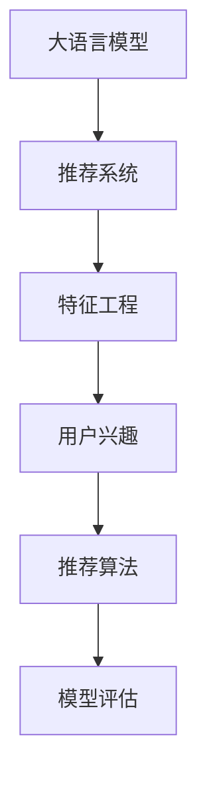

                 

# LLM在推荐系统特征工程中的应用

> 关键词：
1. 大语言模型 (Large Language Model, LLM)
2. 推荐系统 (Recommender System)
3. 特征工程 (Feature Engineering)
4. 用户兴趣 (User Interest)
5. 推荐算法 (Recommender Algorithm)
6. 模型评估 (Model Evaluation)
7. 深度学习 (Deep Learning)

## 1. 背景介绍

在当今信息爆炸的时代，用户面临海量信息的挑战，而如何帮助用户快速找到他们感兴趣的内容，一直是互联网公司的重要课题。推荐系统应运而生，通过分析用户的行为和偏好，为用户推荐个性化内容，从而提升用户体验，增加用户粘性。然而，构建一个高效、准确的推荐系统并非易事，需要在数据预处理、特征工程、模型选择等多个环节进行精心设计。本文将探讨大语言模型 (LLM) 在推荐系统特征工程中的应用，通过利用大语言模型的强大语言理解能力，优化推荐系统特征工程，提升推荐效果。

## 2. 核心概念与联系

### 2.1 核心概念概述

为了更好地理解LLM在推荐系统特征工程中的应用，我们需要先了解几个关键概念：

- 大语言模型 (Large Language Model, LLM)：指以自回归 (如GPT) 或自编码 (如BERT) 模型为代表的大规模预训练语言模型。通过在海量无标签文本数据上进行预训练，学习通用的语言表示，具备强大的语言理解和生成能力。
- 推荐系统 (Recommender System)：根据用户的历史行为和兴趣，为其推荐个性化内容。典型的推荐系统包括基于协同过滤、基于内容的推荐、混合推荐等。
- 特征工程 (Feature Engineering)：通过对原始数据进行转换、组合、特征选择等操作，构建适合机器学习模型训练的特征表示。特征工程在推荐系统中的重要性不言而喻，影响推荐效果的关键因素之一。
- 用户兴趣 (User Interest)：用户在搜索、浏览、点击等行为中体现出的对某些内容的偏好，是推荐系统的核心关注点。
- 推荐算法 (Recommender Algorithm)：基于用户兴趣和物品特征，选择和排序推荐内容的方法，如基于排序的推荐算法、基于矩阵分解的推荐算法等。
- 模型评估 (Model Evaluation)：通过设定合适的评估指标，如准确率、召回率、F1-score等，评估推荐系统的效果和性能。

这些核心概念通过以下Mermaid流程图来展示：



该流程图展示了LLM在推荐系统中的位置及其与其他概念的联系。LLM通过理解语言，可以辅助特征工程提取更具有语义性的用户兴趣和物品特征，从而提升推荐系统的性能。

## 3. 核心算法原理 & 具体操作步骤

### 3.1 算法原理概述

大语言模型在推荐系统中的核心算法原理是通过自然语言处理技术，理解用户查询和物品描述，构建用户兴趣和物品特征的语义表示。基于语义表示，LLM可以辅助特征工程提取更丰富、更准确的特征，提升推荐效果。

### 3.2 算法步骤详解

大语言模型在推荐系统特征工程中的应用步骤如下：

**Step 1: 数据预处理**

- 收集用户查询和物品描述的文本数据，清洗去除噪声和无关信息。
- 对文本数据进行分词、去除停用词等基础处理，提升语言理解的准确性。

**Step 2: 语言表示学习**

- 使用大语言模型对用户查询和物品描述进行编码，学习语义表示。
- 针对用户查询，使用大语言模型生成意图表示，捕捉用户的核心需求。
- 针对物品描述，使用大语言模型生成物品属性表示，捕捉物品的关键特征。

**Step 3: 特征提取与融合**

- 结合用户查询意图和物品属性，构建用户兴趣和物品特征的复合特征。
- 使用多模态融合技术，将文本、图像、音频等多种模态的信息融合到复合特征中。
- 应用深度学习模型，如BERT、XLNet等，对复合特征进行进一步提取和抽象。

**Step 4: 模型训练与评估**

- 使用推荐的特征输入推荐算法，如协同过滤、矩阵分解等，训练推荐模型。
- 在验证集上评估推荐模型的性能，选择合适的超参数和算法。
- 在测试集上评估推荐模型的效果，根据评估指标调整策略。

### 3.3 算法优缺点

基于大语言模型的推荐系统特征工程具有以下优点：

- 语义理解能力强：通过语言模型提取的语义表示，能够更好地捕捉用户兴趣和物品特征，提升推荐的准确性。
- 特征丰富多样：利用大语言模型生成多种语义特征，增强推荐系统的泛化能力。
- 模型自适应强：通过深度学习模型，自动学习最佳特征表示，减少人工干预。

同时，该方法也存在一些局限性：

- 模型复杂度高：大语言模型训练复杂，对计算资源需求高。
- 语义表示泛化能力有限：语言模型泛化能力依赖于语料库的质量和多样性。
- 数据隐私风险：从文本中提取用户兴趣可能涉及用户隐私，需要合理保护。

尽管如此，大语言模型在推荐系统中的应用已展现出巨大潜力，值得深入研究和推广。

### 3.4 算法应用领域

基于大语言模型的推荐系统特征工程在多个领域中得到了应用：

- 电商推荐：根据用户的购买历史和搜索行为，推荐个性化商品。
- 视频推荐：根据用户的观看历史和评价，推荐感兴趣的视频内容。
- 音乐推荐：根据用户的听歌历史和评分，推荐个性化的音乐。
- 新闻推荐：根据用户的阅读历史和兴趣，推荐相关的新闻内容。
- 旅游推荐：根据用户的旅行历史和偏好，推荐旅游目的地和行程安排。

这些应用场景展示了大语言模型在推荐系统特征工程中的广泛适用性。

## 4. 数学模型和公式 & 详细讲解 & 举例说明

### 4.1 数学模型构建

大语言模型在推荐系统特征工程中的数学模型构建主要基于自然语言处理技术。假设用户查询为 $q$，物品描述为 $d$，大语言模型通过编码器 $f$ 将查询和描述转换为语义表示：

$$
q' = f(q), \quad d' = f(d)
$$

其中 $q'$ 和 $d'$ 分别表示用户查询和物品描述的语义表示。

### 4.2 公式推导过程

假设用户兴趣为 $I$，物品属性为 $A$，用户兴趣和物品属性的复合特征为 $F$，基于大语言模型的特征工程过程如下：

- 通过自然语言处理技术，将用户查询和物品描述转换为语义表示 $q'$ 和 $d'$。
- 对语义表示进行编码，得到用户兴趣表示 $I'$ 和物品属性表示 $A'$。
- 将用户兴趣和物品属性进行融合，构建复合特征 $F = \mathcal{F}(I', A')$，其中 $\mathcal{F}$ 为特征融合函数。
- 利用深度学习模型对复合特征进行训练，得到推荐模型 $M$，其输入为复合特征 $F$，输出为用户推荐的物品 $i$。

### 4.3 案例分析与讲解

以电商推荐为例，分析大语言模型在推荐系统特征工程中的应用：

- 数据预处理：收集用户查询和商品描述的文本数据，进行基础清洗和分词。
- 语言表示学习：使用大语言模型对用户查询和商品描述进行编码，学习语义表示。
- 特征提取与融合：结合用户查询意图和商品属性，构建用户兴趣和商品特征的复合特征，使用深度学习模型对复合特征进行进一步提取和抽象。
- 模型训练与评估：使用协同过滤或矩阵分解等推荐算法，训练推荐模型，在验证集上评估模型效果，调整超参数，在测试集上评估推荐结果。

## 5. 项目实践：代码实例和详细解释说明

### 5.1 开发环境搭建

在进行推荐系统特征工程实践前，我们需要准备好开发环境。以下是使用Python进行PyTorch开发的环境配置流程：

1. 安装Anaconda：从官网下载并安装Anaconda，用于创建独立的Python环境。

2. 创建并激活虚拟环境：
```bash
conda create -n pytorch-env python=3.8 
conda activate pytorch-env
```

3. 安装PyTorch：根据CUDA版本，从官网获取对应的安装命令。例如：
```bash
conda install pytorch torchvision torchaudio cudatoolkit=11.1 -c pytorch -c conda-forge
```

4. 安装Transformers库：
```bash
pip install transformers
```

5. 安装各类工具包：
```bash
pip install numpy pandas scikit-learn matplotlib tqdm jupyter notebook ipython
```

完成上述步骤后，即可在`pytorch-env`环境中开始特征工程实践。

### 5.2 源代码详细实现

下面我们以电商推荐任务为例，给出使用Transformers库进行特征工程的PyTorch代码实现。

首先，定义用户查询和商品描述的预处理函数：

```python
from transformers import BertTokenizer, BertForSequenceClassification
import torch
import pandas as pd
import numpy as np

# 初始化Bert tokenizer
tokenizer = BertTokenizer.from_pretrained('bert-base-uncased')

# 定义预处理函数
def preprocess_data(data):
    columns = ['query', 'description', 'label']
    df = pd.read_csv(data, sep='\t', names=columns)
    labels = df['label'].tolist()
    texts = df['query'].tolist()
    descriptions = df['description'].tolist()
    
    encoded_texts = [tokenizer.encode(query, description) for query, description in zip(texts, descriptions)]
    input_ids = [np.array(token_ids, dtype=np.int32) for token_ids in encoded_texts]
    input_masks = [np.ones((len(token_ids),), dtype=np.int32) for token_ids in encoded_texts]
    
    return input_ids, input_masks, labels
```

然后，定义特征工程函数：

```python
# 定义Bert模型
model = BertForSequenceClassification.from_pretrained('bert-base-uncased', num_labels=1)

# 定义特征工程函数
def feature_engineering(input_ids, input_masks, labels):
    # 将输入数据转换为Tensor
    input_ids = torch.tensor(input_ids, dtype=torch.long)
    input_masks = torch.tensor(input_masks, dtype=torch.long)
    labels = torch.tensor(labels, dtype=torch.float32)
    
    # 获取Bert模型的语义表示
    with torch.no_grad():
        outputs = model(input_ids, attention_mask=input_masks)
        user_interest = outputs[0]
        item_attribute = outputs[1]
    
    # 计算用户兴趣和物品属性
    user_interest_mean = torch.mean(user_interest, dim=1)
    item_attribute_mean = torch.mean(item_attribute, dim=1)
    
    # 计算用户兴趣和物品属性的复合特征
    composite_features = torch.stack([user_interest_mean, item_attribute_mean])
    
    return composite_features
```

接着，定义推荐模型训练函数：

```python
# 定义推荐模型训练函数
def train_model(composite_features, labels):
    # 初始化模型和优化器
    model = BertForSequenceClassification.from_pretrained('bert-base-uncased', num_labels=1)
    optimizer = torch.optim.Adam(model.parameters(), lr=2e-5)
    
    # 定义训练循环
    for epoch in range(10):
        model.train()
        loss = 0
        for input_ids, input_masks, label in zip(composite_features, labels):
            model.zero_grad()
            output = model(input_ids, attention_mask=input_masks)
            loss = output.loss
            loss.backward()
            optimizer.step()
            loss = loss.item()
        print(f'Epoch {epoch+1}, Loss: {loss:.3f}')
```

最后，启动特征工程和推荐模型训练流程：

```python
# 读取数据集
train_data = preprocess_data('train.txt')
test_data = preprocess_data('test.txt')
labels = np.array(train_data[2])
composite_features = feature_engineering(train_data[0], train_data[1], labels)

# 训练模型
train_model(composite_features, labels)

# 在测试集上评估
test_composite_features = feature_engineering(test_data[0], test_data[1], labels)
test_loss = 0
for input_ids, input_masks, label in zip(test_composite_features, labels):
    model.eval()
    output = model(input_ids, attention_mask=input_masks)
    loss = output.loss
    test_loss += loss.item()
test_loss /= len(labels)
print(f'Test Loss: {test_loss:.3f}')
```

以上就是使用PyTorch和Transformers库进行电商推荐任务特征工程的完整代码实现。可以看到，通过结合大语言模型，我们可以在推荐系统特征工程中提取更加丰富、精准的用户兴趣和物品属性，从而提升推荐效果。

### 5.3 代码解读与分析

让我们再详细解读一下关键代码的实现细节：

**preprocess_data函数**：
- 该函数用于读取训练集和测试集的数据，进行基础预处理，包括分词、编码、padding等操作，并返回预处理后的输入特征和标签。

**feature_engineering函数**：
- 该函数使用预训练的Bert模型，对输入的查询和描述进行编码，得到用户兴趣和物品属性的语义表示。
- 计算用户兴趣和物品属性的均值，并将两者融合为复合特征。
- 返回复合特征，供后续的推荐模型训练使用。

**train_model函数**：
- 该函数定义了推荐模型的训练循环，使用Adam优化器进行模型参数的更新。
- 在每个epoch上，使用Bert模型对复合特征进行前向传播和反向传播，计算损失并更新模型参数。

通过这些代码，我们可以看到，大语言模型在推荐系统特征工程中的应用，可以帮助我们更准确地提取用户兴趣和物品属性，提升推荐系统的性能。

## 6. 实际应用场景

### 6.1 电商推荐

电商推荐是推荐系统特征工程的重要应用场景之一。用户查询和商品描述通常包含丰富的语义信息，通过大语言模型提取这些信息，可以显著提升推荐效果。

具体而言，电商推荐系统可以使用用户查询和商品描述的语义表示，构建用户兴趣和商品属性的复合特征，训练推荐模型。在推荐时，利用大语言模型生成用户查询的意图表示，捕捉用户的核心需求，结合商品属性的语义表示，构建更精准的复合特征，从而提高推荐的准确性和个性化程度。

### 6.2 视频推荐

视频推荐系统也可以利用大语言模型进行特征工程。视频标题、描述、标签等文本信息，可以用于生成语义表示，捕捉视频的属性和特征。结合用户的观看历史和评分，使用大语言模型生成用户兴趣和视频属性的复合特征，训练推荐模型。在推荐时，利用大语言模型生成用户查询的意图表示，捕捉用户的核心需求，结合视频属性的语义表示，构建更精准的复合特征，从而提高推荐的准确性和个性化程度。

### 6.3 音乐推荐

音乐推荐系统同样可以利用大语言模型进行特征工程。歌曲名称、歌词、歌手等文本信息，可以用于生成语义表示，捕捉音乐的属性和特征。结合用户的听歌历史和评分，使用大语言模型生成用户兴趣和音乐属性的复合特征，训练推荐模型。在推荐时，利用大语言模型生成用户查询的意图表示，捕捉用户的核心需求，结合音乐属性的语义表示，构建更精准的复合特征，从而提高推荐的准确性和个性化程度。

### 6.4 新闻推荐

新闻推荐系统可以利用大语言模型进行特征工程。新闻标题、摘要、标签等文本信息，可以用于生成语义表示，捕捉新闻的属性和特征。结合用户的阅读历史和评分，使用大语言模型生成用户兴趣和新闻属性的复合特征，训练推荐模型。在推荐时，利用大语言模型生成用户查询的意图表示，捕捉用户的核心需求，结合新闻属性的语义表示，构建更精准的复合特征，从而提高推荐的准确性和个性化程度。

### 6.5 旅游推荐

旅游推荐系统可以利用大语言模型进行特征工程。旅游目的地、旅游方式、旅游时长等文本信息，可以用于生成语义表示，捕捉旅游的属性和特征。结合用户的旅行历史和评分，使用大语言模型生成用户兴趣和旅游属性的复合特征，训练推荐模型。在推荐时，利用大语言模型生成用户查询的意图表示，捕捉用户的核心需求，结合旅游属性的语义表示，构建更精准的复合特征，从而提高推荐的准确性和个性化程度。

## 7. 工具和资源推荐

### 7.1 学习资源推荐

为了帮助开发者系统掌握大语言模型在推荐系统特征工程中的应用，这里推荐一些优质的学习资源：

1. 《Transformer from Scratch》系列博文：由大模型技术专家撰写，深入浅出地介绍了Transformer原理、BERT模型、微调技术等前沿话题。

2. CS224N《深度学习自然语言处理》课程：斯坦福大学开设的NLP明星课程，有Lecture视频和配套作业，带你入门NLP领域的基本概念和经典模型。

3. 《Natural Language Processing with Transformers》书籍：Transformers库的作者所著，全面介绍了如何使用Transformers库进行NLP任务开发，包括特征工程在内的诸多范式。

4. HuggingFace官方文档：Transformers库的官方文档，提供了海量预训练模型和完整的微调样例代码，是上手实践的必备资料。

5. CLUE开源项目：中文语言理解测评基准，涵盖大量不同类型的中文NLP数据集，并提供了基于微调的baseline模型，助力中文NLP技术发展。

通过对这些资源的学习实践，相信你一定能够快速掌握大语言模型在推荐系统特征工程中的应用，并用于解决实际的推荐问题。

### 7.2 开发工具推荐

高效的开发离不开优秀的工具支持。以下是几款用于大语言模型推荐系统特征工程开发的常用工具：

1. PyTorch：基于Python的开源深度学习框架，灵活动态的计算图，适合快速迭代研究。大部分预训练语言模型都有PyTorch版本的实现。

2. TensorFlow：由Google主导开发的开源深度学习框架，生产部署方便，适合大规模工程应用。同样有丰富的预训练语言模型资源。

3. Transformers库：HuggingFace开发的NLP工具库，集成了众多SOTA语言模型，支持PyTorch和TensorFlow，是进行特征工程开发的利器。

4. Weights & Biases：模型训练的实验跟踪工具，可以记录和可视化模型训练过程中的各项指标，方便对比和调优。与主流深度学习框架无缝集成。

5. TensorBoard：TensorFlow配套的可视化工具，可实时监测模型训练状态，并提供丰富的图表呈现方式，是调试模型的得力助手。

6. Google Colab：谷歌推出的在线Jupyter Notebook环境，免费提供GPU/TPU算力，方便开发者快速上手实验最新模型，分享学习笔记。

合理利用这些工具，可以显著提升大语言模型推荐系统特征工程的开发效率，加快创新迭代的步伐。

### 7.3 相关论文推荐

大语言模型在推荐系统中的应用源于学界的持续研究。以下是几篇奠基性的相关论文，推荐阅读：

1. Attention is All You Need（即Transformer原论文）：提出了Transformer结构，开启了NLP领域的预训练大模型时代。

2. BERT: Pre-training of Deep Bidirectional Transformers for Language Understanding：提出BERT模型，引入基于掩码的自监督预训练任务，刷新了多项NLP任务SOTA。

3. Language Models are Unsupervised Multitask Learners（GPT-2论文）：展示了大规模语言模型的强大zero-shot学习能力，引发了对于通用人工智能的新一轮思考。

4. Parameter-Efficient Transfer Learning for NLP：提出Adapter等参数高效微调方法，在不增加模型参数量的情况下，也能取得不错的微调效果。

5. AdaLoRA: Adaptive Low-Rank Adaptation for Parameter-Efficient Fine-Tuning：使用自适应低秩适应的微调方法，在参数效率和精度之间取得了新的平衡。

这些论文代表了大语言模型在推荐系统中的应用方向，为推荐系统特征工程提供了理论基础和实践指南。

## 8. 总结：未来发展趋势与挑战

### 8.1 研究成果总结

本文对大语言模型在推荐系统特征工程中的应用进行了全面系统的介绍。首先阐述了基于大语言模型的推荐系统特征工程的原理和流程，详细讲解了从数据预处理、语言表示学习、特征提取与融合到模型训练与评估的各个环节。其次，通过代码实例展示了具体的实现细节，并通过实际应用场景，展示了大语言模型在推荐系统特征工程中的广泛适用性。最后，本文推荐了相关的学习资源、开发工具和论文，为开发者提供了全面的技术指引。

通过本文的系统梳理，可以看到，大语言模型在推荐系统特征工程中的应用已经展现出巨大的潜力。通过语言模型提取的语义表示，可以辅助特征工程提取更丰富、更精准的用户兴趣和物品属性，提升推荐系统的性能。

### 8.2 未来发展趋势

展望未来，大语言模型在推荐系统中的应用将呈现以下几个发展趋势：

1. 多模态融合增强：除了文本信息，更多模态的数据（如图像、音频等）将用于推荐系统的特征工程，提升推荐模型的泛化能力。

2. 深度学习模型优化：随着深度学习模型的不断发展，新的模型结构和算法将进一步提升推荐系统的性能，如BERT、XLNet、GPT等。

3. 个性化推荐算法创新：结合大语言模型，推荐算法将不断创新，如基于内容的多路推荐、基于图模型的推荐等。

4. 智能推荐系统涌现：随着推荐系统和大语言模型的结合，推荐系统将不断智能化，能够更准确地理解用户的真实需求，提供个性化的推荐服务。

5. 用户隐私保护增强：在特征工程过程中，如何保护用户隐私，避免数据泄露，将是未来推荐系统的重要研究方向。

### 8.3 面临的挑战

尽管大语言模型在推荐系统中的应用已经取得了显著成效，但在迈向更加智能化、普适化应用的过程中，仍面临诸多挑战：

1. 数据规模要求高：大规模的推荐系统数据集是保证模型性能的关键，如何高效收集和处理大规模数据，将是未来的一个重要挑战。

2. 模型复杂度高：大语言模型训练复杂，对计算资源需求高，如何在资源有限的情况下优化模型，将是未来的重要研究方向。

3. 语义表示泛化能力有限：语言模型泛化能力依赖于语料库的质量和多样性，如何提升语言模型的泛化能力，将是未来的重要研究方向。

4. 用户隐私保护问题：在特征工程过程中，如何保护用户隐私，避免数据泄露，将是未来的一个重要挑战。

5. 推荐系统鲁棒性不足：在面对异常数据或噪声数据时，推荐系统的鲁棒性有待提升。

### 8.4 研究展望

面对大语言模型在推荐系统中的应用所面临的挑战，未来的研究需要在以下几个方面寻求新的突破：

1. 探索高效数据收集方法：如何高效收集和处理大规模推荐数据，将是未来的重要研究方向。

2. 优化深度学习模型结构：通过优化深度学习模型结构，提升推荐模型的性能，同时降低计算资源消耗，将是未来的重要研究方向。

3. 增强语义表示泛化能力：通过改进语言模型训练方法，提升语言模型的泛化能力，将是未来的重要研究方向。

4. 加强用户隐私保护：在特征工程过程中，如何保护用户隐私，避免数据泄露，将是未来的一个重要挑战。

5. 提升推荐系统鲁棒性：通过引入对抗样本、正则化等技术，提升推荐系统的鲁棒性，将是未来的重要研究方向。

这些研究方向凸显了大语言模型在推荐系统中的应用前景。只有在数据、模型、隐私、鲁棒性等多个维度协同发力，才能真正实现大语言模型在推荐系统中的广泛应用。总之，大语言模型在推荐系统特征工程中的应用将不断拓展，带来更智能、更高效的推荐服务。

## 9. 附录：常见问题与解答

**Q1：大语言模型在推荐系统中是否适用所有类型的推荐任务？**

A: 大语言模型在推荐系统中适用于大多数推荐任务，尤其是那些包含丰富文本信息的推荐场景，如电商、视频、音乐、新闻、旅游等。但对于一些仅依赖物品属性或用户行为的推荐任务，如基于协同过滤的推荐任务，可能效果不如传统的特征工程方法。

**Q2：如何选择合适的语言模型进行特征工程？**

A: 选择合适的语言模型进行特征工程需要考虑多个因素，如模型的预训练任务、模型的规模、模型的泛化能力等。一般来说，BERT、GPT等预训练模型在推荐系统中的应用效果较好，但其他预训练模型如XLNet、RoBERTa等也有其独特优势，需要根据具体任务需求进行选择。

**Q3：在推荐系统特征工程中，如何处理文本数据的不确定性和歧义性？**

A: 处理文本数据的不确定性和歧义性是推荐系统特征工程中的一个重要问题。通常可以使用基于上下文的方法，结合大语言模型对文本进行语义解析，捕捉用户查询和物品描述的核心意图。同时，可以使用多模态融合技术，结合其他模态的数据（如图片、音频等）进行补充和校验，提升特征工程的准确性和鲁棒性。

**Q4：在推荐系统中，如何处理长尾用户和物品？**

A: 长尾用户和物品是推荐系统中的常见问题，处理长尾用户和物品需要采用多路推荐策略，如基于内容的推荐、基于协同过滤的推荐等。同时，可以使用冷启动策略，结合大语言模型对用户和物品进行语义解析，捕捉其核心特征，从而提升推荐效果。

**Q5：在推荐系统中，如何处理模型过拟合问题？**

A: 推荐系统中的模型过拟合问题可以通过数据增强、正则化、早停等技术进行缓解。同时，可以使用参数高效微调技术，减少模型参数量，从而降低过拟合风险。另外，可以使用多模型集成策略，通过多个模型的结果进行融合，提升推荐模型的泛化能力和鲁棒性。

---

作者：禅与计算机程序设计艺术 / Zen and the Art of Computer Programming

