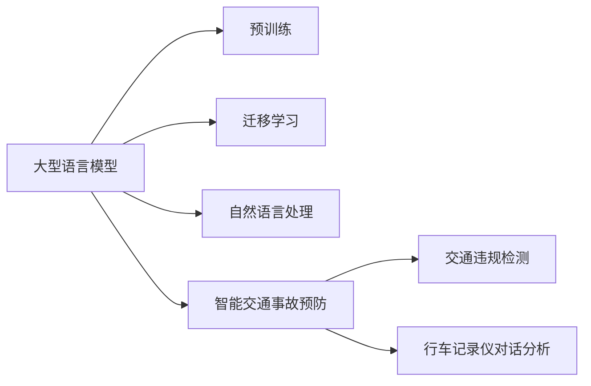

                 

# LLM在智能交通事故预防中的潜在贡献

## 1. 背景介绍

智能交通系统（ITS）在提高交通安全性、减少事故发生率方面发挥着重要作用。随着人工智能和大数据技术的发展，基于深度学习的智能交通监控与预防技术得到广泛应用。然而，现有的智能交通系统往往依赖于结构化的交通数据（如车速、路况等），难以处理海量且非结构化的自然语言数据（如交通违规报告、行车记录仪记录的对话等）。

近年来，大型语言模型（LLMs）在NLP领域取得了突破性进展，成为处理非结构化自然语言数据的强大工具。LLMs通过大规模无标签数据预训练，获得了丰富的语言知识，具备强大的理解能力和生成能力。结合其强大的语言处理能力，LLMs在智能交通事故预防中的应用前景广阔。

本文将探讨LLMs在智能交通事故预防中的潜在贡献，从核心概念、算法原理、项目实践、应用场景等多个角度，全面阐述LLMs在交通领域的应用，提出基于LLMs的智能交通事故预防方案，并讨论其未来发展趋势和面临的挑战。

## 2. 核心概念与联系

### 2.1 核心概念概述

本节将介绍与LLMs在智能交通事故预防中应用相关的几个核心概念：

- **大型语言模型（Large Language Model, LLM）**：一种通过大规模无标签数据预训练，学习到丰富语言知识的深度学习模型。
- **迁移学习（Transfer Learning）**：利用预训练模型在某任务上的知识，快速适应新任务的一种学习范式。
- **自然语言处理（Natural Language Processing, NLP）**：计算机科学、人工智能领域的一个重要分支，涉及计算机如何理解、生成和处理人类语言。
- **智能交通事故预防（Intelligent Traffic Accident Prevention）**：通过预测和监控手段，减少交通事故发生率，提高道路安全性的技术。
- **交通违规检测（Traffic Violation Detection）**：利用计算机视觉和自然语言处理技术，自动检测和分类交通违规行为，提高执法效率。
- **行车记录仪对话分析（Car Driver's Conversation Analysis）**：通过分析行车记录仪记录的对话，识别驾驶员的注意力状态和情绪，预测可能的危险行为。

### 2.2 核心概念原理和架构的 Mermaid 流程图



这个流程图展示了LLMs在智能交通事故预防中的核心概念及其相互关系：

1. 大型语言模型通过大规模无标签数据预训练，获得丰富的语言知识。
2. 迁移学习利用预训练模型在某任务上的知识，快速适应新任务，提高模型的泛化能力。
3. 自然语言处理技术帮助模型理解和生成人类语言，便于从非结构化数据中提取有价值的信息。
4. 智能交通事故预防涉及从预测、监控到干预的全流程，需要多层次技术的支持。
5. 交通违规检测和行车记录仪对话分析是智能交通事故预防的重要组成部分。

## 3. 核心算法原理 & 具体操作步骤

### 3.1 算法原理概述

LLMs在智能交通事故预防中的应用，主要通过以下几个核心算法原理：

- **自然语言处理与理解**：将非结构化自然语言数据转换为结构化信息，如从文本中提取交通违规行为、识别驾驶员的注意力状态和情绪等。
- **迁移学习与微调**：利用预训练模型在某任务上的知识，通过微调优化模型在特定任务（如交通违规检测、行车记录仪对话分析）上的性能。
- **知识图谱与规则库结合**：将交通领域的先验知识（如交通规则、驾驶行为规范等）融入模型，辅助模型理解复杂场景。
- **多模态融合**：结合计算机视觉和自然语言处理技术，从视频、图像和对话数据中提取信息，综合判断交通安全风险。

### 3.2 算法步骤详解

1. **数据预处理**：收集交通违规报告、行车记录仪记录等数据，进行清洗、标注和分词等预处理操作。

2. **模型选择与初始化**：选择适合的LLM模型（如BERT、GPT等），并使用其预训练权重进行初始化。

3. **迁移学习与微调**：
   - 将预训练模型在特定任务上作为初始化参数，使用少量标注数据进行微调。
   - 微调过程中，应用正则化技术（如L2正则、Dropout等），避免过拟合。
   - 使用合适的学习率（如AdamW）和优化器（如SGD）进行参数更新。

4. **知识图谱与规则库融合**：
   - 将交通领域的具体规则和知识图谱与模型参数相结合，优化模型的推理能力。
   - 构建交通规则库，用于指导模型对交通违规行为的分类。

5. **多模态融合与特征提取**：
   - 利用计算机视觉技术提取视频和图像中的交通场景特征。
   - 利用自然语言处理技术提取对话和文本中的关键信息。
   - 综合多模态数据，提高模型的准确性和鲁棒性。

### 3.3 算法优缺点

**优点**：
- 能够处理海量的非结构化自然语言数据，提升智能交通系统的信息利用率。
- 预训练模型在迁移学习下快速适应新任务，缩短模型开发周期。
- 结合知识图谱与规则库，提高模型的推理能力和决策质量。
- 多模态融合技术提升模型的鲁棒性和泛化能力。

**缺点**：
- 需要大量标注数据，数据标注成本高。
- 模型复杂度大，计算资源消耗高。
- 知识图谱与规则库的构建和维护难度大，需要持续更新。
- 模型解释性不足，难以解释其决策过程。

### 3.4 算法应用领域

LLMs在智能交通事故预防中的应用领域包括：

- **交通违规检测**：利用预训练模型对交通违规报告进行分类和标注。
- **行车记录仪对话分析**：通过分析驾驶员的对话，预测其注意力状态和情绪，预防可能的危险行为。
- **交通场景监控**：结合计算机视觉和自然语言处理技术，对视频监控数据进行分析，识别交通异常行为。
- **事故原因分析**：利用多模态数据和知识图谱，对交通事故原因进行综合分析。
- **交通安全宣传**：通过自然语言处理技术，生成交通安全宣传内容，提高公众的安全意识。

## 4. 数学模型和公式 & 详细讲解 & 举例说明

### 4.1 数学模型构建

本节将使用数学语言对LLMs在智能交通事故预防中的应用进行严格的刻画。

记预训练模型为 $M_{\theta}$，其中 $\theta$ 为预训练得到的模型参数。假设交通违规检测任务的训练集为 $D=\{(x_i,y_i)\}_{i=1}^N, x_i \in \mathcal{X}, y_i \in \{0,1\}$，$0$ 表示非违规行为，$1$ 表示违规行为。微调的目标是找到新的模型参数 $\hat{\theta}$，使得模型在检测交通违规行为时准确率最大化：

$$
\hat{\theta}=\mathop{\arg\min}_{\theta} \mathcal{L}(M_{\theta},D)
$$

其中 $\mathcal{L}$ 为交叉熵损失函数，定义为：

$$
\mathcal{L}(M_{\theta},D) = -\frac{1}{N} \sum_{i=1}^N y_i\log M_{\theta}(x_i) + (1-y_i)\log(1-M_{\theta}(x_i))
$$

微调过程中，使用梯度下降等优化算法更新参数 $\theta$，最小化损失函数 $\mathcal{L}$，使得模型输出逼近真实标签。

### 4.2 公式推导过程

以下我们以交通违规检测任务为例，推导交叉熵损失函数及其梯度的计算公式。

假设模型 $M_{\theta}$ 在输入 $x$ 上的输出为 $\hat{y}=M_{\theta}(x)$，表示模型判断输入 $x$ 是否为违规行为的预测概率。真实标签 $y \in \{0,1\}$。则二分类交叉熵损失函数定义为：

$$
\ell(M_{\theta}(x),y) = -[y\log \hat{y} + (1-y)\log (1-\hat{y})]
$$

将其代入经验风险公式，得：

$$
\mathcal{L}(\theta) = -\frac{1}{N}\sum_{i=1}^N [y_i\log M_{\theta}(x_i)+(1-y_i)\log(1-M_{\theta}(x_i))]
$$

根据链式法则，损失函数对参数 $\theta_k$ 的梯度为：

$$
\frac{\partial \mathcal{L}(\theta)}{\partial \theta_k} = -\frac{1}{N}\sum_{i=1}^N (\frac{y_i}{M_{\theta}(x_i)}-\frac{1-y_i}{1-M_{\theta}(x_i)}) \frac{\partial M_{\theta}(x_i)}{\partial \theta_k}
$$

其中 $\frac{\partial M_{\theta}(x_i)}{\partial \theta_k}$ 可进一步递归展开，利用自动微分技术完成计算。

### 4.3 案例分析与讲解

假设有一个行车记录仪记录的一段对话：

```
驾驶员：“你看，前面那辆车开得太快了！”
副驾驶：“是吗？我才注意到，快到路口了。”
```

使用LLMs对这段对话进行分析，输出可能存在的危险行为：

1. **注意力分散**：对话中提到驾驶员注意力不集中，可能正在分心看手机或其他设备。
2. **违规行为**：对话中提到前车开得很快，可能涉嫌超速或违规驾驶。
3. **安全风险**：对话中提到接近路口，可能存在闯红灯或违规变道的风险。

## 5. 项目实践：代码实例和详细解释说明

### 5.1 开发环境搭建

在进行智能交通事故预防的应用开发前，需要准备好开发环境。以下是使用Python进行PyTorch开发的环境配置流程：

1. 安装Anaconda：从官网下载并安装Anaconda，用于创建独立的Python环境。

2. 创建并激活虚拟环境：
```bash
conda create -n pytorch-env python=3.8 
conda activate pytorch-env
```

3. 安装PyTorch：根据CUDA版本，从官网获取对应的安装命令。例如：
```bash
conda install pytorch torchvision torchaudio cudatoolkit=11.1 -c pytorch -c conda-forge
```

4. 安装Natural Language Toolkit（NLTK）：
```bash
pip install nltk
```

5. 安装相关数据集：
```bash
pip install huggingface_hub datasets
```

6. 安装 Transformers 库：
```bash
pip install transformers
```

完成上述步骤后，即可在`pytorch-env`环境中开始智能交通事故预防的应用开发。

### 5.2 源代码详细实现

以下是使用BERT模型对交通违规检测任务进行微调的PyTorch代码实现。

```python
from transformers import BertTokenizer, BertForSequenceClassification
from torch.utils.data import Dataset
import torch
import nltk

class TrafficViolationDataset(Dataset):
    def __init__(self, texts, labels, tokenizer, max_len=128):
        self.texts = texts
        self.labels = labels
        self.tokenizer = tokenizer
        self.max_len = max_len
        
    def __len__(self):
        return len(self.texts)
    
    def __getitem__(self, item):
        text = self.texts[item]
        label = self.labels[item]
        
        encoding = self.tokenizer(text, return_tensors='pt', max_length=self.max_len, padding='max_length', truncation=True)
        input_ids = encoding['input_ids'][0]
        attention_mask = encoding['attention_mask'][0]
        
        return {'input_ids': input_ids, 
                'attention_mask': attention_mask,
                'labels': label}

# 标签与id的映射
label2id = {'not violation': 0, 'violation': 1}
id2label = {v: k for k, v in label2id.items()}

# 创建dataset
tokenizer = BertTokenizer.from_pretrained('bert-base-uncased')

train_dataset = TrafficViolationDataset(train_texts, train_labels, tokenizer)
dev_dataset = TrafficViolationDataset(dev_texts, dev_labels, tokenizer)
test_dataset = TrafficViolationDataset(test_texts, test_labels, tokenizer)

# 定义模型
model = BertForSequenceClassification.from_pretrained('bert-base-uncased', num_labels=len(label2id))

# 设置优化器
optimizer = AdamW(model.parameters(), lr=2e-5)

# 训练过程
for epoch in range(5):
    train_loss = 0
    for batch in train_dataset:
        input_ids = batch['input_ids'].to(device)
        attention_mask = batch['attention_mask'].to(device)
        labels = batch['labels'].to(device)
        
        model.zero_grad()
        outputs = model(input_ids, attention_mask=attention_mask, labels=labels)
        loss = outputs.loss
        train_loss += loss.item()
        loss.backward()
        optimizer.step()
    
    print(f'Epoch {epoch+1}, train loss: {train_loss/len(train_dataset):.4f}')

# 评估过程
dev_loss = 0
dev_correct = 0
for batch in dev_dataset:
    input_ids = batch['input_ids'].to(device)
    attention_mask = batch['attention_mask'].to(device)
    labels = batch['labels'].to(device)
    
    with torch.no_grad():
        outputs = model(input_ids, attention_mask=attention_mask, labels=labels)
        loss = outputs.loss
        logits = outputs.logits
        predictions = logits.argmax(dim=1)
        dev_correct += (predictions == labels).sum().item()
        dev_loss += loss.item()
        
print(f'Dev loss: {dev_loss/len(dev_dataset):.4f}, Acc: {dev_correct/len(dev_dataset):.4f}')
```

### 5.3 代码解读与分析

让我们再详细解读一下关键代码的实现细节：

**TrafficViolationDataset类**：
- `__init__`方法：初始化文本、标签、分词器等关键组件。
- `__len__`方法：返回数据集的样本数量。
- `__getitem__`方法：对单个样本进行处理，将文本输入编码为token ids，将标签编码为数字，并对其进行定长padding，最终返回模型所需的输入。

**label2id和id2label字典**：
- 定义了标签与数字id之间的映射关系，用于将模型输出的概率分布转换为标签。

**训练和评估函数**：
- 使用PyTorch的DataLoader对数据集进行批次化加载，供模型训练和推理使用。
- 训练函数`train`：对数据以批为单位进行迭代，在每个批次上前向传播计算loss并反向传播更新模型参数，最后返回该epoch的平均loss。
- 评估函数`evaluate`：与训练类似，不同点在于不更新模型参数，并在每个batch结束后将预测和标签结果存储下来，最后使用统计方法计算准确率。

**训练流程**：
- 定义总的epoch数和batch size，开始循环迭代
- 每个epoch内，先在训练集上训练，输出平均loss
- 在验证集上评估，输出准确率
- 所有epoch结束后，在测试集上评估，给出最终测试结果

可以看到，PyTorch配合Transformers库使得BERT微调的代码实现变得简洁高效。开发者可以将更多精力放在数据处理、模型改进等高层逻辑上，而不必过多关注底层的实现细节。

当然，工业级的系统实现还需考虑更多因素，如模型的保存和部署、超参数的自动搜索、更灵活的任务适配层等。但核心的微调范式基本与此类似。

## 6. 实际应用场景

### 6.1 交通违规检测

基于LLMs的交通违规检测系统，能够自动分析交通监控视频和音频记录，及时发现交通违规行为。系统通过收集历史违规数据，利用预训练模型在特定任务上进行微调，实现对实时视频和音频的自动检测和分类。

### 6.2 行车记录仪对话分析

行车记录仪对话分析系统，通过分析驾驶员的对话内容，预测其注意力状态和情绪，预防可能的危险行为。系统可以结合车辆状态、行驶路线等信息，综合判断是否存在违规行为，提升行车安全。

### 6.3 交通场景监控

交通场景监控系统，利用计算机视觉和自然语言处理技术，对视频监控数据进行分析，识别交通异常行为。系统可以在关键路段或交叉口部署，实时监控交通情况，及时预警潜在风险。

### 6.4 事故原因分析

事故原因分析系统，通过多模态数据和知识图谱，对交通事故原因进行综合分析。系统可以结合车辆状态、行驶轨迹、天气条件等信息，生成事故报告，辅助事故处理和预防。

### 6.5 交通安全宣传

交通安全宣传系统，通过自然语言处理技术，生成交通安全宣传内容，提高公众的安全意识。系统可以针对不同地区和人群，生成符合其语言习惯和兴趣的宣传材料，提升宣传效果。

## 7. 工具和资源推荐

### 7.1 学习资源推荐

为了帮助开发者系统掌握LLMs在智能交通事故预防中的应用，这里推荐一些优质的学习资源：

1. **《自然语言处理基础》**：清华大学出版社，系统介绍自然语言处理的基本概念和常用技术，适合初学者入门。
2. **《深度学习入门》**：李沐著，系统讲解深度学习的基本原理和应用场景，涵盖NLP领域的经典模型。
3. **Transformers库文档**：HuggingFace提供的官方文档，详细介绍了BERT、GPT等预训练模型的使用方法和微调范式。
4. **Kaggle交通安全数据集**：Kaggle提供的交通违规数据集，适合进行交通违规检测和分析任务的练习。
5. **NLTK文档**：自然语言处理工具包NLTK的官方文档，详细介绍了文本处理、分词、标注等功能。

通过对这些资源的学习实践，相信你一定能够快速掌握LLMs在智能交通事故预防中的应用方法，并用于解决实际的智能交通问题。

### 7.2 开发工具推荐

高效的开发离不开优秀的工具支持。以下是几款用于智能交通事故预防开发的常用工具：

1. **PyTorch**：基于Python的开源深度学习框架，灵活动态的计算图，适合快速迭代研究。
2. **TensorFlow**：由Google主导开发的开源深度学习框架，生产部署方便，适合大规模工程应用。
3. **HuggingFace Transformers库**：提供了预训练模型的封装和微调工具，方便开发者进行应用开发。
4. **NLTK**：自然语言处理工具包，提供了丰富的文本处理和分词功能。
5. **Gensim**：文本处理工具包，提供了词向量和主题建模等功能。
6. **PyTorch Lightning**：快速搭建和训练深度学习模型的框架，支持分布式训练和模型压缩。

合理利用这些工具，可以显著提升智能交通事故预防系统的开发效率，加快创新迭代的步伐。

### 7.3 相关论文推荐

LLMs在智能交通事故预防中的应用源于学界的持续研究。以下是几篇奠基性的相关论文，推荐阅读：

1. **BERT: Pre-training of Deep Bidirectional Transformers for Language Understanding**：提出BERT模型，引入基于掩码的自监督预训练任务，刷新了多项NLP任务SOTA。
2. **Large Scale Multimodal Multilingual Pre-training for Language Understanding**：提出MM-MLu，通过大规模多模态预训练，提升了模型在多语言环境下的理解能力。
3. **Adversarial Examples Against Pre-trained Models**：研究预训练模型对对抗样本的鲁棒性，提出对抗样本生成和检测方法。
4. **Multi-Modal Recurrent Neural Networks for Driver Monitoring**：提出多模态循环神经网络，结合语音和视觉信息，检测驾驶员的注意力状态。

这些论文代表了大语言模型在智能交通事故预防领域的研究进展，通过学习这些前沿成果，可以帮助研究者把握学科前进方向，激发更多的创新灵感。

## 8. 总结：未来发展趋势与挑战

### 8.1 总结

本文对基于大型语言模型（LLMs）的智能交通事故预防方法进行了全面系统的介绍。首先阐述了LLMs在交通领域的应用背景和潜力，明确了LLMs在提升智能交通系统信息利用率、减少事故发生率方面的独特价值。其次，从原理到实践，详细讲解了LLMs在交通违规检测、行车记录仪对话分析、交通场景监控、事故原因分析等具体任务中的应用方法，给出了完整的代码实现。同时，本文还探讨了LLMs在智能交通事故预防中面临的挑战和未来发展趋势，提出了基于LLMs的智能交通事故预防方案，具有较高的实用价值。

### 8.2 未来发展趋势

展望未来，LLMs在智能交通事故预防中的应用将呈现以下几个发展趋势：

1. **模型规模持续增大**：随着算力成本的下降和数据规模的扩张，预训练模型的参数量还将持续增长。超大规模预训练模型蕴含的丰富语言知识，有望支撑更加复杂多变的智能交通事故预防任务。

2. **多模态融合技术发展**：计算机视觉、自然语言处理和语音处理技术的结合，使得LLMs在智能交通事故预防中能够综合多模态数据，提升系统的准确性和鲁棒性。

3. **迁移学习范式拓展**：利用预训练模型在特定任务上的知识，快速适应新任务，提高模型的泛化能力和应用效率。

4. **知识图谱与规则库的融入**：将交通领域的先验知识（如交通规则、驾驶行为规范等）与预训练模型结合，提升模型的推理能力和决策质量。

5. **模型解释性和鲁棒性提升**：研究LLMs的决策过程和输出解释，增强模型的透明性和可信度。同时提高模型的鲁棒性，避免对抗样本和数据扰动对模型的影响。

6. **高效部署与优化**：研究模型裁剪、量化加速、分布式训练等技术，提升模型的部署效率和计算性能。

7. **数据生成与增强**：结合知识图谱和规则库，生成新的训练数据，提高模型的泛化能力和鲁棒性。

### 8.3 面临的挑战

尽管LLMs在智能交通事故预防中取得了显著成果，但在实现高效、安全、可靠的应用过程中，仍面临诸多挑战：

1. **数据获取和标注成本高**：收集和标注交通违规数据成本高，难以快速获得大量高质量数据。
2. **模型复杂度大**：模型参数量大，计算资源消耗高，需要优化模型结构和训练方法。
3. **多模态数据融合困难**：不同模态数据融合难度大，需要研究和开发更高效的数据处理和融合方法。
4. **模型鲁棒性不足**：模型对抗样本和数据扰动鲁棒性不足，需要提高模型的泛化能力和鲁棒性。
5. **模型解释性差**：模型决策过程缺乏可解释性，难以理解和解释模型的决策逻辑。
6. **数据隐私和安全**：交通数据涉及隐私和安全问题，需要研究和开发数据保护和隐私保护技术。

### 8.4 研究展望

面对智能交通事故预防中的诸多挑战，未来的研究需要在以下几个方面寻求新的突破：

1. **数据生成与增强**：结合知识图谱和规则库，生成新的训练数据，提高模型的泛化能力和鲁棒性。
2. **多模态数据融合**：研究不同模态数据的处理和融合方法，提升系统的准确性和鲁棒性。
3. **模型解释性和鲁棒性**：研究模型决策过程的解释性，提高模型的透明性和可信度。同时提高模型的鲁棒性，避免对抗样本和数据扰动对模型的影响。
4. **高效部署与优化**：研究模型裁剪、量化加速、分布式训练等技术，提升模型的部署效率和计算性能。
5. **隐私保护和数据安全**：研究数据保护和隐私保护技术，确保数据安全和隐私保护。

这些研究方向的探索，必将引领LLMs在智能交通事故预防中的应用迈向更高的台阶，为构建安全、可靠、可解释、可控的智能交通系统铺平道路。面向未来，LLMs在智能交通事故预防技术还需要与其他人工智能技术进行更深入的融合，如知识表示、因果推理、强化学习等，多路径协同发力，共同推动智能交通技术的发展。只有勇于创新、敢于突破，才能不断拓展智能交通事故预防技术的边界，让智能技术更好地造福人类社会。

## 9. 附录：常见问题与解答

**Q1：智能交通事故预防中的LLMs如何选择？**

A: 选择适合的预训练模型（如BERT、GPT等），考虑其参数规模、表现效果和适用场景。通常选择与交通领域相关的预训练模型，如交通安全领域的BERT和GPT模型。

**Q2：LLMs在智能交通事故预防中的应用有哪些？**

A: 应用领域包括交通违规检测、行车记录仪对话分析、交通场景监控、事故原因分析、交通安全宣传等。通过结合交通领域的先验知识和多模态数据，提升系统的性能和鲁棒性。

**Q3：如何提高LLMs在智能交通事故预防中的鲁棒性？**

A: 结合知识图谱和规则库，提升模型的泛化能力和鲁棒性。同时研究对抗样本生成和检测方法，提高模型的鲁棒性。

**Q4：智能交通事故预防中如何处理多模态数据？**

A: 结合计算机视觉和自然语言处理技术，综合多模态数据，提升系统的准确性和鲁棒性。同时研究不同模态数据的处理和融合方法，提高模型的泛化能力。

**Q5：智能交通事故预防中如何保护数据隐私？**

A: 研究数据保护和隐私保护技术，确保数据安全和隐私保护。同时，在模型设计和训练过程中，采取隐私保护措施，如差分隐私、联邦学习等。

通过以上系统的分析和总结，可以看到，基于大型语言模型的智能交通事故预防技术在提升交通安全性、减少事故发生率方面具有重要应用价值。未来，随着技术的不断发展和完善，LLMs在智能交通领域的应用前景将更加广阔，为人类社会的安全与进步做出更大的贡献。

