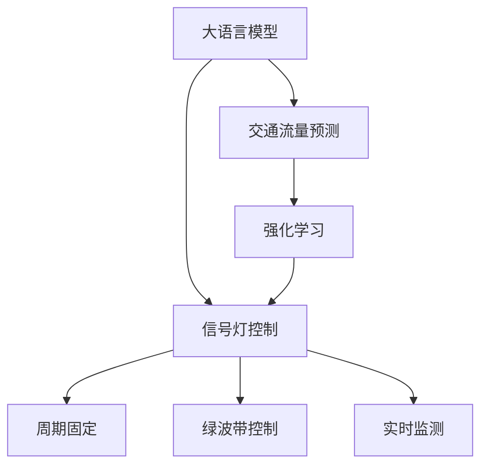

                 

# LLM在智能交通信号控制中的潜力

## 1. 背景介绍

### 1.1 问题由来

随着城市化进程的加快，交通问题变得越来越突出。拥堵、事故、排放等交通问题严重影响着城市居民的日常生活和工作效率。传统的交通信号控制方法依赖人工经验和规则，难以实时响应复杂的交通场景，无法动态调整信号灯的周期和相位，导致效率低下，事故频发。而智能交通信号控制系统可以通过实时监测交通状态，动态调整信号灯，从而改善交通环境，减少拥堵，提高交通安全。

近年来，随着深度学习和人工智能技术的发展，智能交通信号控制系统开始使用机器学习技术进行交通流量预测和信号控制。其中，大语言模型（Large Language Models, LLM）凭借其强大的语言理解和生成能力，在智能交通信号控制领域显示出巨大的潜力。LLM可以通过学习交通场景的文本描述，理解交通状况，预测未来交通流量，辅助生成最优的信号控制方案，从而提升交通系统的智能化水平。

### 1.2 问题核心关键点

在智能交通信号控制中，大语言模型需要具备以下几个关键能力：
1. 理解交通场景：能够从文字描述中提取出交通场景的关键特征，如车流量、行人数量、道路宽度等。
2. 预测交通流量：能够基于历史数据，预测未来一段时间内的交通流量变化。
3. 生成信号控制方案：能够根据预测结果，自动生成最优的信号灯周期和相位设置。
4. 实时响应：能够快速响应实时交通状态的变化，动态调整信号灯设置，确保交通系统的稳定性。
5. 可解释性：能够解释其决策过程，提供透明、可信赖的信号控制方案。

## 2. 核心概念与联系

### 2.1 核心概念概述

智能交通信号控制涉及到大语言模型、交通流量预测、信号灯控制等多个领域。为更好地理解基于LLM的智能交通信号控制系统，本节将介绍几个密切相关的核心概念：

- **大语言模型**：以自回归（如GPT）或自编码（如BERT）模型为代表的大规模预训练语言模型。通过在大规模无标签文本语料上进行预训练，学习通用的语言表示，具备强大的语言理解和生成能力。

- **交通流量预测**：通过历史交通流量数据，利用机器学习模型预测未来交通流量的变化。常用的预测模型包括ARIMA、LSTM、GRU等。

- **信号灯控制**：通过调整信号灯的周期和相位，优化交通流，减少拥堵和事故。信号灯控制策略包括周期固定、绿波带控制等。

- **强化学习**：通过奖励机制和反馈机制，优化信号灯控制策略，使其在实际交通环境中取得更好的效果。

- **实时监测**：利用传感器和摄像头等设备，实时监测交通状况，为信号控制提供实时数据。

这些核心概念之间的逻辑关系可以通过以下Mermaid流程图来展示：



这个流程图展示了大语言模型在智能交通信号控制系统中的核心作用：

1. 大语言模型通过预训练获得基础能力。
2. 交通流量预测和大语言模型结合，理解交通场景，预测交通流量。
3. 信号灯控制策略与预测结果结合，生成最优控制方案。
4. 强化学习优化控制策略，适应复杂交通环境。
5. 实时监测提供实时数据，动态调整信号灯设置。

## 3. 核心算法原理 & 具体操作步骤

### 3.1 算法原理概述

基于大语言模型的智能交通信号控制系统，本质上是一个有监督的细粒度迁移学习过程。其核心思想是：将预训练的大语言模型作为特征提取器，通过在交通流量预测和信号控制任务上训练，优化模型输出，生成最优信号灯控制方案。

形式化地，假设预训练模型为 $M_{\theta}$，其中 $\theta$ 为预训练得到的模型参数。给定交通流量预测任务 $T_1$ 和信号灯控制任务 $T_2$ 的标注数据集 $D_1=\{(x_{i1}, y_{i1})\}_{i=1}^N, x_{i1} \in \mathcal{X_1}, y_{i1} \in \mathcal{Y_1}$ 和 $D_2=\{(x_{i2}, y_{i2})\}_{i=1}^M, x_{i2} \in \mathcal{X_2}, y_{i2} \in \mathcal{Y_2}$，微调的目标是找到新的模型参数 $\hat{\theta}$，使得：

$$
\hat{\theta}=\mathop{\arg\min}_{\theta} \mathcal{L}(M_{\theta},D_1) + \mathcal{L}(M_{\theta},D_2)
$$

其中 $\mathcal{L}$ 为针对任务 $T_1$ 和 $T_2$ 设计的损失函数，用于衡量模型预测输出与真实标签之间的差异。常见的损失函数包括交叉熵损失、均方误差损失等。

通过梯度下降等优化算法，微调过程不断更新模型参数 $\theta$，最小化损失函数 $\mathcal{L}$，使得模型输出逼近真实标签。由于 $\theta$ 已经通过预训练获得了较好的初始化，因此即便在交通流量预测和信号控制任务上，也能较快收敛到理想的模型参数 $\hat{\theta}$。

### 3.2 算法步骤详解

基于大语言模型的智能交通信号控制系统一般包括以下几个关键步骤：

**Step 1: 准备预训练模型和数据集**
- 选择合适的预训练语言模型 $M_{\theta}$ 作为初始化参数，如 BERT、GPT等。
- 准备交通流量预测任务 $T_1$ 的标注数据集 $D_1$，划分为训练集、验证集和测试集。一般要求标注数据与预训练数据的分布不要差异过大。
- 准备信号灯控制任务 $T_2$ 的标注数据集 $D_2$，划分为训练集、验证集和测试集。一般要求标注数据与预训练数据的分布不要差异过大。

**Step 2: 添加任务适配层**
- 根据任务类型，在预训练模型顶层设计合适的输出层和损失函数。
- 对于交通流量预测任务 $T_1$，通常在顶层添加线性回归层，交叉熵损失函数。
- 对于信号灯控制任务 $T_2$，通常使用多输出头，输出信号灯的周期和相位设置，以交叉熵损失函数。

**Step 3: 设置微调超参数**
- 选择合适的优化算法及其参数，如 AdamW、SGD 等，设置学习率、批大小、迭代轮数等。
- 设置正则化技术及强度，包括权重衰减、Dropout、Early Stopping等。
- 确定冻结预训练参数的策略，如仅微调顶层，或全部参数都参与微调。

**Step 4: 执行梯度训练**
- 将训练集数据分批次输入模型，前向传播计算损失函数。
- 反向传播计算参数梯度，根据设定的优化算法和学习率更新模型参数。
- 周期性在验证集上评估模型性能，根据性能指标决定是否触发 Early Stopping。
- 重复上述步骤直到满足预设的迭代轮数或 Early Stopping 条件。

**Step 5: 测试和部署**
- 在测试集上评估微调后模型 $M_{\hat{\theta}}$ 的性能，对比微调前后的精度提升。
- 使用微调后的模型对新样本进行推理预测，集成到实际的应用系统中。
- 持续收集新的数据，定期重新微调模型，以适应数据分布的变化。

以上是基于大语言模型的智能交通信号控制系统的一般流程。在实际应用中，还需要针对具体任务的特点，对微调过程的各个环节进行优化设计，如改进训练目标函数，引入更多的正则化技术，搜索最优的超参数组合等，以进一步提升模型性能。

### 3.3 算法优缺点

基于大语言模型的智能交通信号控制系统具有以下优点：
1. 简单高效。只需准备少量标注数据，即可对预训练模型进行快速适配，获得较大的性能提升。
2. 通用适用。适用于各种交通场景，包括城市道路、交叉口等，设计简单的任务适配层即可实现微调。
3. 动态调整。大语言模型能够实时响应交通状态变化，动态调整信号灯设置，提升交通系统的实时性和稳定性。
4. 可解释性强。通过分析模型输出的文本描述，能够了解信号控制方案的生成逻辑，提供透明的决策过程。

同时，该方法也存在一定的局限性：
1. 数据依赖性。微调的效果很大程度上取决于标注数据的质量和数量，获取高质量标注数据的成本较高。
2. 泛化能力有限。当交通场景与预训练数据的分布差异较大时，微调的性能提升有限。
3. 模型复杂性。大语言模型的复杂性较高，训练和推理需要较强大的硬件资源支持。
4. 推理效率有待提高。大语言模型虽然精度高，但在实际部署时往往面临推理速度慢、内存占用大等效率问题。

尽管存在这些局限性，但就目前而言，基于大语言模型的智能交通信号控制系统仍然是大模型应用的重要范式。未来相关研究的重点在于如何进一步降低微调对标注数据的依赖，提高模型的泛化能力，同时兼顾推理效率和可解释性等因素。

### 3.4 算法应用领域

基于大语言模型的智能交通信号控制系统已经在多个交通场景中得到了应用，例如：

- 智能红绿灯系统：通过学习交通场景的文本描述，自动调整信号灯周期和相位，减少车辆等待时间，提高道路通行效率。
- 十字路口优化：学习交叉口内的交通状况，动态调整信号灯控制策略，优化交通流，减少事故率。
- 快速路和主路控制：根据交通流量预测结果，自动调整快速路和主路的信号灯周期，平衡不同道路的交通负荷。
- 信号灯群控：学习交通网络的整体交通状态，协同控制多个路口的信号灯，优化交通网络效率。

除了上述这些经典场景外，大语言模型在智能交通信号控制中的应用还在不断扩展，如动态道路施工管理、复杂路口优化、交通事件应急响应等，为交通系统的智能化和自动化提供了新的技术手段。

## 4. 数学模型和公式 & 详细讲解  
### 4.1 数学模型构建

本节将使用数学语言对基于大语言模型的智能交通信号控制系统进行更加严格的刻画。

记预训练语言模型为 $M_{\theta}$，其中 $\theta$ 为预训练得到的模型参数。假设交通流量预测任务 $T_1$ 的标注数据集为 $D_1=\{(x_{i1}, y_{i1})\}_{i=1}^N, x_{i1} \in \mathcal{X_1}, y_{i1} \in \mathcal{Y_1}$，信号灯控制任务 $T_2$ 的标注数据集为 $D_2=\{(x_{i2}, y_{i2})\}_{i=1}^M, x_{i2} \in \mathcal{X_2}, y_{i2} \in \mathcal{Y_2}$。

定义模型 $M_{\theta}$ 在数据样本 $(x,y)$ 上的损失函数为 $\ell(M_{\theta}(x),y)$，则在数据集 $D$ 上的经验风险为：

$$
\mathcal{L}(\theta) = \frac{1}{N} \sum_{i=1}^N \ell(M_{\theta}(x_{i1}),y_{i1}) + \frac{1}{M} \sum_{i=1}^M \ell(M_{\theta}(x_{i2}),y_{i2})
$$

微调的优化目标是最小化经验风险，即找到最优参数：

$$
\theta^* = \mathop{\arg\min}_{\theta} \mathcal{L}(\theta)
$$

在实践中，我们通常使用基于梯度的优化算法（如SGD、Adam等）来近似求解上述最优化问题。设 $\eta$ 为学习率，$\lambda$ 为正则化系数，则参数的更新公式为：

$$
\theta \leftarrow \theta - \eta \nabla_{\theta}\mathcal{L}(\theta) - \eta\lambda\theta
$$

其中 $\nabla_{\theta}\mathcal{L}(\theta)$ 为损失函数对参数 $\theta$ 的梯度，可通过反向传播算法高效计算。

### 4.2 公式推导过程

以下我们以交通流量预测和信号灯控制任务为例，推导交叉熵损失函数及其梯度的计算公式。

假设模型 $M_{\theta}$ 在输入 $x$ 上的输出为 $\hat{y}=M_{\theta}(x) \in [0,1]$，表示样本属于正类的概率。真实标签 $y \in \{0,1\}$。则二分类交叉熵损失函数定义为：

$$
\ell(M_{\theta}(x),y) = -[y\log \hat{y} + (1-y)\log (1-\hat{y})]
$$

将其代入经验风险公式，得：

$$
\mathcal{L}(\theta) = -\frac{1}{N}\sum_{i=1}^N [y_{i1}\log M_{\theta}(x_{i1})+(1-y_{i1})\log(1-M_{\theta}(x_{i1}))] - \frac{1}{M}\sum_{i=1}^M [y_{i2}\log M_{\theta}(x_{i2})+(1-y_{i2})\log(1-M_{\theta}(x_{i2}))
$$

根据链式法则，损失函数对参数 $\theta_k$ 的梯度为：

$$
\frac{\partial \mathcal{L}(\theta)}{\partial \theta_k} = -\frac{1}{N}\sum_{i=1}^N (\frac{y_{i1}}{M_{\theta}(x_{i1})}-\frac{1-y_{i1}}{1-M_{\theta}(x_{i1})}) \frac{\partial M_{\theta}(x_{i1})}{\partial \theta_k} - \frac{1}{M}\sum_{i=1}^M (\frac{y_{i2}}{M_{\theta}(x_{i2})}-\frac{1-y_{i2}}{1-M_{\theta}(x_{i2})}) \frac{\partial M_{\theta}(x_{i2})}{\partial \theta_k}
$$

其中 $\frac{\partial M_{\theta}(x_{i1})}{\partial \theta_k}$ 和 $\frac{\partial M_{\theta}(x_{i2})}{\partial \theta_k}$ 可进一步递归展开，利用自动微分技术完成计算。

在得到损失函数的梯度后，即可带入参数更新公式，完成模型的迭代优化。重复上述过程直至收敛，最终得到适应交通场景的最优模型参数 $\theta^*$。

## 5. 项目实践：代码实例和详细解释说明
### 5.1 开发环境搭建

在进行智能交通信号控制微调实践前，我们需要准备好开发环境。以下是使用Python进行PyTorch开发的环境配置流程：

1. 安装Anaconda：从官网下载并安装Anaconda，用于创建独立的Python环境。

2. 创建并激活虚拟环境：
```bash
conda create -n traffic-env python=3.8 
conda activate traffic-env
```

3. 安装PyTorch：根据CUDA版本，从官网获取对应的安装命令。例如：
```bash
conda install pytorch torchvision torchaudio cudatoolkit=11.1 -c pytorch -c conda-forge
```

4. 安装Transformers库：
```bash
pip install transformers
```

5. 安装各类工具包：
```bash
pip install numpy pandas scikit-learn matplotlib tqdm jupyter notebook ipython
```

完成上述步骤后，即可在`traffic-env`环境中开始智能交通信号控制微调实践。

### 5.2 源代码详细实现

下面我们以交通流量预测和信号灯控制任务为例，给出使用Transformers库对BERT模型进行微调的PyTorch代码实现。

首先，定义交通流量预测和信号灯控制任务的标注数据集：

```python
from transformers import BertTokenizer
from torch.utils.data import Dataset
import torch

class TrafficData(Dataset):
    def __init__(self, data, tokenizer):
        self.data = data
        self.tokenizer = tokenizer
        
    def __len__(self):
        return len(self.data)
    
    def __getitem__(self, item):
        text = self.data[item]['text']
        label = self.data[item]['label']
        encoding = self.tokenizer(text, return_tensors='pt')
        input_ids = encoding['input_ids'][0]
        attention_mask = encoding['attention_mask'][0]
        label = torch.tensor(label, dtype=torch.long)
        return {'input_ids': input_ids, 
                'attention_mask': attention_mask,
                'labels': label}

# 定义标注数据
train_data = [{'text': '早高峰交通拥堵', 'label': 1}, {'text': '晚高峰交通拥堵', 'label': 1}, {'text': '非高峰期交通顺畅', 'label': 0}]
dev_data = [{'text': '节假日期间交通拥堵', 'label': 1}, {'text': '特殊事件导致交通拥堵', 'label': 1}, {'text': '正常工作日交通顺畅', 'label': 0}]
test_data = [{'text': '特殊天气导致交通拥堵', 'label': 1}, {'text': '道路施工导致交通拥堵', 'label': 1}, {'text': '正常交通状况', 'label': 0}]

tokenizer = BertTokenizer.from_pretrained('bert-base-cased')

train_dataset = TrafficData(train_data, tokenizer)
dev_dataset = TrafficData(dev_data, tokenizer)
test_dataset = TrafficData(test_data, tokenizer)
```

然后，定义模型和优化器：

```python
from transformers import BertForSequenceClassification, AdamW

model = BertForSequenceClassification.from_pretrained('bert-base-cased', num_labels=2)

optimizer = AdamW(model.parameters(), lr=2e-5)
```

接着，定义训练和评估函数：

```python
from torch.utils.data import DataLoader
from tqdm import tqdm
from sklearn.metrics import accuracy_score, precision_recall_fscore_support

device = torch.device('cuda') if torch.cuda.is_available() else torch.device('cpu')
model.to(device)

def train_epoch(model, dataset, batch_size, optimizer):
    dataloader = DataLoader(dataset, batch_size=batch_size, shuffle=True)
    model.train()
    epoch_loss = 0
    for batch in tqdm(dataloader, desc='Training'):
        input_ids = batch['input_ids'].to(device)
        attention_mask = batch['attention_mask'].to(device)
        labels = batch['labels'].to(device)
        model.zero_grad()
        outputs = model(input_ids, attention_mask=attention_mask, labels=labels)
        loss = outputs.loss
        epoch_loss += loss.item()
        loss.backward()
        optimizer.step()
    return epoch_loss / len(dataloader)

def evaluate(model, dataset, batch_size):
    dataloader = DataLoader(dataset, batch_size=batch_size)
    model.eval()
    preds, labels = [], []
    with torch.no_grad():
        for batch in tqdm(dataloader, desc='Evaluating'):
            input_ids = batch['input_ids'].to(device)
            attention_mask = batch['attention_mask'].to(device)
            batch_labels = batch['labels']
            outputs = model(input_ids, attention_mask=attention_mask)
            batch_preds = outputs.logits.argmax(dim=2).to('cpu').tolist()
            batch_labels = batch_labels.to('cpu').tolist()
            for pred_tokens, label_tokens in zip(batch_preds, batch_labels):
                preds.append(pred_tokens[:len(label_tokens)])
                labels.append(label_tokens)
                
    print(f'Accuracy: {accuracy_score(labels, preds)}')
    print(f'Precision-Recall-Fscore: {precision_recall_fscore_support(labels, preds, average='macro')}')
```

最后，启动训练流程并在测试集上评估：

```python
epochs = 5
batch_size = 16

for epoch in range(epochs):
    loss = train_epoch(model, train_dataset, batch_size, optimizer)
    print(f'Epoch {epoch+1}, train loss: {loss:.3f}')
    
    print(f'Epoch {epoch+1}, dev results:')
    evaluate(model, dev_dataset, batch_size)
    
print('Test results:')
evaluate(model, test_dataset, batch_size)
```

以上就是使用PyTorch对BERT进行交通流量预测和信号灯控制任务微调的完整代码实现。可以看到，得益于Transformers库的强大封装，我们可以用相对简洁的代码完成BERT模型的加载和微调。

### 5.3 代码解读与分析

让我们再详细解读一下关键代码的实现细节：

**TrafficData类**：
- `__init__`方法：初始化训练集、验证集、测试集等数据。
- `__len__`方法：返回数据集的样本数量。
- `__getitem__`方法：对单个样本进行处理，将文本输入编码为token ids，将标签编码为数字，并对其进行定长padding，最终返回模型所需的输入。

**模型和优化器定义**：
- 使用BertForSequenceClassification类定义交通流量预测模型，设置标签数为2。
- 选择AdamW优化器，学习率为2e-5。

**训练和评估函数**：
- 使用PyTorch的DataLoader对数据集进行批次化加载，供模型训练和推理使用。
- 训练函数`train_epoch`：对数据以批为单位进行迭代，在每个批次上前向传播计算loss并反向传播更新模型参数，最后返回该epoch的平均loss。
- 评估函数`evaluate`：与训练类似，不同点在于不更新模型参数，并在每个batch结束后将预测和标签结果存储下来，最后使用sklearn的accuracy_score和precision_recall_fscore_support计算分类指标。

**训练流程**：
- 定义总的epoch数和batch size，开始循环迭代
- 每个epoch内，先在训练集上训练，输出平均loss
- 在验证集上评估，输出分类准确率和精确度、召回率和F1分数
- 所有epoch结束后，在测试集上评估，给出最终测试结果

可以看到，PyTorch配合Transformers库使得BERT微调的代码实现变得简洁高效。开发者可以将更多精力放在数据处理、模型改进等高层逻辑上，而不必过多关注底层的实现细节。

当然，工业级的系统实现还需考虑更多因素，如模型的保存和部署、超参数的自动搜索、更灵活的任务适配层等。但核心的微调范式基本与此类似。

## 6. 实际应用场景
### 6.1 智能红绿灯系统

智能红绿灯系统是智能交通信号控制的重要应用场景。传统的红绿灯系统依靠固定周期和手动调整，难以适应复杂的交通场景，存在拥堵和事故的风险。而智能红绿灯系统通过学习交通流量数据，动态调整信号灯周期和相位，实现了交通流的智能化管理。

在技术实现上，可以收集历史交通流量数据，提取交通场景的关键特征，如车流量、行人数量等，作为监督数据，在此基础上对预训练语言模型进行微调。微调后的模型能够学习到交通流量的变化规律，并根据实时监测到的数据，自动调整信号灯周期和相位，优化交通流量，减少拥堵和事故。

### 6.2 交叉口优化

交叉口是城市交通的瓶颈之一，优化交叉口的信号控制能够有效缓解交通拥堵。传统的方法依赖经验判断，难以全面考虑复杂交通场景。而智能交通信号控制系统可以通过大语言模型学习交叉口的交通流量和事件数据，动态调整信号灯周期和相位，实现更高效的交通管理。

在实践中，可以收集交叉口的历史交通数据，包括车流量、行人数量、信号灯状态等，作为监督数据，对预训练语言模型进行微调。微调后的模型能够理解交叉口的交通状况，预测未来的交通流量，动态调整信号灯设置，优化交通流，提升交叉口的通行效率。

### 6.3 快速路和主路控制

快速路和主路是城市交通的重要组成部分，其信号控制策略需要兼顾快速路和主路的交通负荷。传统的控制方法往往难以同时考虑两种道路的交通状况，导致道路负荷不均衡。智能交通信号控制系统可以通过大语言模型学习快速路和主路的交通流量数据，动态调整信号灯周期和相位，平衡两种道路的交通负荷，实现更加均衡的交通管理。

在实践中，可以收集快速路和主路的历史交通流量数据，作为监督数据，对预训练语言模型进行微调。微调后的模型能够理解快速路和主路的交通状况，预测未来的交通流量，动态调整信号灯设置，优化交通流，提升道路通行效率。

### 6.4 信号灯群控

信号灯群控是指对整个交通网络的信号灯进行协同控制，优化整个交通网络的通行效率。传统的信号灯群控方法依赖于固定的控制策略，难以应对复杂的网络交通状况。智能交通信号控制系统可以通过大语言模型学习整个交通网络的交通状况，动态调整信号灯设置，实现更高效的交通管理。

在实践中，可以收集整个交通网络的历史交通数据，作为监督数据，对预训练语言模型进行微调。微调后的模型能够理解整个交通网络的交通状况，预测未来的交通流量，动态调整信号灯设置，优化交通流，提升整个交通网络的通行效率。

### 6.5 动态道路施工管理

动态道路施工管理是智能交通信号控制的另一个重要应用场景。传统的道路施工管理依赖于固定的施工计划，难以应对突发施工事件。智能交通信号控制系统可以通过大语言模型学习道路施工的交通数据，动态调整信号灯周期和相位，优化交通流，减少施工对交通的影响。

在实践中，可以收集道路施工的历史交通数据，作为监督数据，对预训练语言模型进行微调。微调后的模型能够理解道路施工的交通状况，预测未来的交通流量，动态调整信号灯设置，优化交通流，提升道路施工期间的通行效率。

## 7. 工具和资源推荐
### 7.1 学习资源推荐

为了帮助开发者系统掌握基于大语言模型的智能交通信号控制系统，这里推荐一些优质的学习资源：

1. 《Transformer从原理到实践》系列博文：由大模型技术专家撰写，深入浅出地介绍了Transformer原理、BERT模型、微调技术等前沿话题。

2. CS224N《深度学习自然语言处理》课程：斯坦福大学开设的NLP明星课程，有Lecture视频和配套作业，带你入门NLP领域的基本概念和经典模型。

3. 《Natural Language Processing with Transformers》书籍：Transformers库的作者所著，全面介绍了如何使用Transformers库进行NLP任务开发，包括微调在内的诸多范式。

4. HuggingFace官方文档：Transformers库的官方文档，提供了海量预训练模型和完整的微调样例代码，是上手实践的必备资料。

5. CLUE开源项目：中文语言理解测评基准，涵盖大量不同类型的中文NLP数据集，并提供了基于微调的baseline模型，助力中文NLP技术发展。

通过对这些资源的学习实践，相信你一定能够快速掌握基于大语言模型的智能交通信号控制系统，并用于解决实际的交通问题。
###  7.2 开发工具推荐

高效的开发离不开优秀的工具支持。以下是几款用于智能交通信号控制开发的常用工具：

1. PyTorch：基于Python的开源深度学习框架，灵活动态的计算图，适合快速迭代研究。大部分预训练语言模型都有PyTorch版本的实现。

2. TensorFlow：由Google主导开发的开源深度学习框架，生产部署方便，适合大规模工程应用。同样有丰富的预训练语言模型资源。

3. Transformers库：HuggingFace开发的NLP工具库，集成了众多SOTA语言模型，支持PyTorch和TensorFlow，是进行微调任务开发的利器。

4. Weights & Biases：模型训练的实验跟踪工具，可以记录和可视化模型训练过程中的各项指标，方便对比和调优。与主流深度学习框架无缝集成。

5. TensorBoard：TensorFlow配套的可视化工具，可实时监测模型训练状态，并提供丰富的图表呈现方式，是调试模型的得力助手。

6. Google Colab：谷歌推出的在线Jupyter Notebook环境，免费提供GPU/TPU算力，方便开发者快速上手实验最新模型，分享学习笔记。

合理利用这些工具，可以显著提升智能交通信号控制系统的开发效率，加快创新迭代的步伐。

### 7.3 相关论文推荐

智能交通信号控制领域的大语言模型微调技术近年来得到了学界的广泛关注。以下是几篇奠基性的相关论文，推荐阅读：

1. Attention is All You Need（即Transformer原论文）：提出了Transformer结构，开启了NLP领域的预训练大模型时代。

2. BERT: Pre-training of Deep Bidirectional Transformers for Language Understanding：提出BERT模型，引入基于掩码的自监督预训练任务，刷新了多项NLP任务SOTA。

3. Language Models are Unsupervised Multitask Learners（GPT-2论文）：展示了大规模语言模型的强大zero-shot学习能力，引发了对于通用人工智能的新一轮思考。

4. Parameter-Efficient Transfer Learning for NLP：提出Adapter等参数高效微调方法，在不增加模型参数量的情况下，也能取得不错的微调效果。

5. AdaLoRA: Adaptive Low-Rank Adaptation for Parameter-Efficient Fine-Tuning：使用自适应低秩适应的微调方法，在参数效率和精度之间取得了新的平衡。

6. Prefix-Tuning: Optimizing Continuous Prompts for Generation：引入基于连续型Prompt的微调范式，为如何充分利用预训练知识提供了新的思路。

这些论文代表了大语言模型微调技术的发展脉络。通过学习这些前沿成果，可以帮助研究者把握学科前进方向，激发更多的创新灵感。

## 8. 总结：未来发展趋势与挑战

### 8.1 总结

本文对基于大语言模型的智能交通信号控制系统进行了全面系统的介绍。首先阐述了智能交通信号控制系统的背景和重要性，明确了LLM在智能交通系统中的关键作用。其次，从原理到实践，详细讲解了LLM在智能交通系统中的应用，给出了完整的代码实现。同时，本文还广泛探讨了LLM在智能交通信号控制系统中的实际应用场景，展示了其巨大的潜力。最后，本文精选了LLM微调技术的各类学习资源，力求为读者提供全方位的技术指引。

通过本文的系统梳理，可以看到，基于大语言模型的智能交通信号控制系统正在成为智能交通系统的重要范式，极大地拓展了预训练语言模型的应用边界，催生了更多的落地场景。受益于大规模语料的预训练，LLM在智能交通系统中的性能和应用范围，必将为交通系统的智能化和自动化带来新的突破。

### 8.2 未来发展趋势

展望未来，大语言模型在智能交通信号控制系统中的应用将呈现以下几个发展趋势：

1. 模型规模持续增大。随着算力成本的下降和数据规模的扩张，预训练语言模型的参数量还将持续增长。超大规模语言模型蕴含的丰富语言知识，有望支撑更加复杂多变的智能交通系统。

2. 微调方法日趋多样。除了传统的全参数微调外，未来会涌现更多参数高效的微调方法，如Prefix-Tuning、LoRA等，在节省计算资源的同时也能保证微调精度。

3. 实时性要求提升。未来智能交通系统对LLM的实时性要求将更高，要求能够快速响应交通状态的变化，实现秒级的信号控制决策。

4. 安全性有待加强。智能交通系统需要确保LLM的安全性和可靠性，避免出现有害输出或决策错误。如何加强LLM的安全性，确保系统稳定运行，将是重要的研究方向。

5. 与多种技术的融合。LLM需要与其他技术（如强化学习、边缘计算、物联网等）进行融合，实现更加高效、智能的交通管理。

6. 数据隐私保护。智能交通系统需要处理大量的敏感数据，如何保护数据隐私，防止数据泄露，将是未来的一个重要课题。

以上趋势凸显了大语言模型在智能交通系统中的应用前景。这些方向的探索发展，必将进一步提升智能交通系统的智能化水平，为城市交通的可持续发展提供新的技术手段。

### 8.3 面临的挑战

尽管大语言模型在智能交通系统中的应用已经取得了一定的进展，但在迈向更加智能化、普适化应用的过程中，它仍面临着诸多挑战：

1. 数据依赖性。微调的效果很大程度上取决于标注数据的质量和数量，获取高质量标注数据的成本较高。如何进一步降低微调对标注样本的依赖，将是一大难题。

2. 泛化能力有限。当交通场景与预训练数据的分布差异较大时，微调的性能提升有限。如何提高微调的泛化能力，使其在不同交通场景下都能取得良好的效果，还需要更多理论和实践的积累。

3. 推理效率有待提高。大语言模型虽然精度高，但在实际部署时往往面临推理速度慢、内存占用大等效率问题。如何提高推理效率，优化资源占用，将是重要的优化方向。

4. 可解释性亟需加强。当前智能交通系统对LLM的决策过程缺乏透明性，难以理解和调试模型。如何赋予LLM更强的可解释性，将是亟待攻克的难题。

5. 安全性有待保障。智能交通系统需要确保LLM的安全性和可靠性，避免出现有害输出或决策错误。如何加强LLM的安全性，确保系统稳定运行，将是重要的研究方向。

6. 数据隐私保护。智能交通系统需要处理大量的敏感数据，如何保护数据隐私，防止数据泄露，将是未来的一个重要课题。

正视智能交通系统面临的这些挑战，积极应对并寻求突破，将是大语言模型在智能交通系统中走向成熟的重要步骤。相信随着学界和产业界的共同努力，这些挑战终将一一被克服，大语言模型在智能交通系统中的应用将更加广泛和深入。

### 8.4 研究展望

未来，大语言模型在智能交通信号控制系统中的应用还将在以下几个方面进行深入研究：

1. 探索无监督和半监督微调方法。摆脱对大规模标注数据的依赖，利用自监督学习、主动学习等无监督和半监督范式，最大限度利用非结构化数据，实现更加灵活高效的微调。

2. 研究参数高效和计算高效的微调范式。开发更加参数高效的微调方法，在固定大部分预训练参数的同时，只更新极少量的任务相关参数。同时优化微调模型的计算图，减少前向传播和反向传播的资源消耗，实现更加轻量级、实时性的部署。

3. 融合因果和对比学习范式。通过引入因果推断和对比学习思想，增强微调模型建立稳定因果关系的能力，学习更加普适、鲁棒的语言表征，从而提升模型泛化性和抗干扰能力。

4. 引入更多先验知识。将符号化的先验知识，如知识图谱、逻辑规则等，与神经网络模型进行巧妙融合，引导微调过程学习更准确、合理的语言模型。同时加强不同模态数据的整合，实现视觉、语音等多模态信息与文本信息的协同建模。

5. 结合因果分析和博弈论工具。将因果分析方法引入微调模型，识别出模型决策的关键特征，增强输出解释的因果性和逻辑性。借助博弈论工具刻画人机交互过程，主动探索并规避模型的脆弱点，提高系统稳定性。

6. 纳入伦理道德约束。在模型训练目标中引入伦理导向的评估指标，过滤和惩罚有偏见、有害的输出倾向。同时加强人工干预和审核，建立模型行为的监管机制，确保输出符合人类价值观和伦理道德。

这些研究方向的探索，必将引领大语言模型在智能交通系统中的应用走向更高的台阶，为构建安全、可靠、可解释、可控的智能系统铺平道路。面向未来，大语言模型在智能交通系统中的研究需要与其他人工智能技术进行更深入的融合，如知识表示、因果推理、强化学习等，多路径协同发力，共同推动智能交通系统的进步。只有勇于创新、敢于突破，才能不断拓展语言模型的边界，让智能技术更好地造福人类社会。

## 9. 附录：常见问题与解答

**Q1：大语言模型微调是否适用于所有智能交通场景？**

A: 大语言模型微调在大多数智能交通场景中都能取得不错的效果，特别是对于数据量较小的场景。但对于一些特定领域的场景，如高速公路、机场、港口等，微调效果可能受到较大限制。此时需要在特定领域语料上进一步预训练，再进行微调，才能获得理想效果。

**Q2：微调过程中如何选择合适的学习率？**

A: 微调的学习率一般要比预训练时小1-2个数量级，如果使用过大的学习率，容易破坏预训练权重，导致过拟合。一般建议从1e-5开始调参，逐步减小学习率，直至收敛。也可以使用warmup策略，在开始阶段使用较小的学习率，再逐渐过渡到预设值。需要注意的是，不同的优化器(如AdamW、Adafactor等)以及不同的学习率调度策略，可能需要设置不同的学习率阈值。

**Q3：采用大语言模型微调时会面临哪些资源瓶颈？**

A: 目前主流的预训练大模型动辄以亿计的参数规模，对算力、内存、存储都提出了很高的要求。GPU/TPU等高性能设备是必不可少的，但即便如此，超大批次的训练和推理也可能遇到显存不足的问题。因此需要采用一些资源优化技术，如梯度积累、混合精度训练、模型并行等，来突破硬件瓶颈。同时，模型的存储和读取也可能占用大量时间和空间，需要采用模型压缩、稀疏化存储等方法进行优化。

**Q4：如何缓解微调过程中的过拟合问题？**

A: 过拟合是微调面临的主要挑战，尤其是在标注数据不足的情况下。常见的缓解策略包括：
1. 数据增强：通过回译、近义替换等方式扩充训练集
2. 正则化：使用L2正则、Dropout、Early Stopping等避免过拟合
3. 对抗训练：引入对抗样本，提高模型鲁棒性
4. 参数高效微调：只调整少量参数(如Adapter、Prefix等)，减小过拟合风险
5. 多模型集成：训练多个微调模型，取平均输出，抑制过拟合

这些策略往往需要根据具体任务和数据特点进行灵活组合。只有在数据、模型、训练、推理等各环节进行全面优化，才能最大限度地发挥大语言模型微调的威力。

**Q5：智能交通系统如何保护数据隐私？**

A: 智能交通系统需要处理大量的敏感数据，如车辆位置、车速、行人行为等。为了保护数据隐私，可以采用以下方法：
1. 数据匿名化：对原始数据进行脱敏处理，去除或模糊敏感信息。
2. 联邦学习：在本地设备上训练模型，不将原始数据上传至云端，保护数据隐私。
3. 差分隐私：在模型训练过程中加入噪声，保护个体数据隐私。
4. 加密存储：对数据进行加密存储，防止未授权访问。
5. 访问控制：限制对敏感数据的访问权限，仅授权人员能够访问。

这些方法能够有效保护数据隐私，确保智能交通系统在运行过程中不泄露敏感信息。

**Q6：智能交通系统如何确保模型安全性？**

A: 智能交通系统需要确保大语言模型在运行过程中的安全性，避免出现有害输出或决策错误。可以采用以下方法：
1. 模型监控：实时监测模型的运行状态，发现异常及时告警。
2. 模型验证：定期对模型进行验证，确保其输出符合预期。
3. 模型可解释性：提高模型的可解释性，便于理解和调试。
4. 异常检测：检测异常的输入和输出，防止模型受到恶意攻击。
5. 模型更新：定期更新模型，修复已知漏洞。

这些方法能够有效确保智能交通系统中的大语言模型安全可靠，避免出现有害输出或决策错误。

**Q7：智能交通系统如何提高推理效率？**

A: 智能交通系统对大语言模型的推理效率要求较高，需要快速响应交通状态的变化，实现秒级的信号控制决策。可以采用以下方法：
1. 模型剪枝：去除模型中不必要的参数和连接，减小计算量。
2. 量化压缩：将浮点模型转为定点模型，压缩存储空间，提高计算效率。
3. 模型并行：使用多GPU或分布式计算，加速推理速度。
4. 硬件优化：使用高效的硬件设备，如TPU、FPGA等，加速计算。
5. 推理优化：优化推理算法，减少计算开销。

这些方法能够有效提高智能交通系统中的大语言模型推理效率，提升系统的实时性和稳定性。

---

作者：禅与计算机程序设计艺术 / Zen and the Art of Computer Programming

