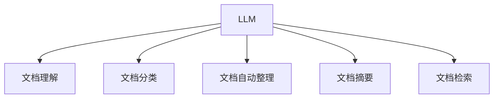

                 

# LLM在智能文档处理中的潜力

> 关键词：大语言模型,文档理解,知识提取,自然语言处理,NLP,文档自动化,文本分析

## 1. 背景介绍

### 1.1 问题由来
在当今数字化时代，文档处理是一项复杂且耗时的任务，涉及文档扫描、信息抽取、自动分类、自动摘要等多个环节。传统的文档处理依赖人工操作，不仅效率低下，且容易出错。尤其是面对海量文档数据的处理，人工方式更显捉襟见肘。

随着人工智能技术的快速发展和自然语言处理（NLP）技术的日趋成熟，大语言模型（LLM）在文档处理领域展现出巨大的应用潜力。LLM通过预训练学习到丰富的语言知识，能够自动理解文本内容，提取结构化信息，分类整理文档，生成简明摘要，从而大幅提升文档处理的效率和质量。

### 1.2 问题核心关键点
LLM在文档处理中的应用，主要集中在以下几个方面：
1. **文档理解与知识提取**：利用LLM强大的语言理解能力，从文本中自动提取关键信息，如人名、地点、组织、时间等实体信息。
2. **文档分类与自动整理**：对文档进行自动分类，并将其按主题整理，方便后续查询和管理。
3. **文档摘要与精简**：对长文档自动生成摘要，提取核心内容，减少阅读时间。
4. **文档检索与推荐**：构建文档索引，支持关键词搜索和相似性检索，提升文档检索效率。

这些应用使得文档处理变得更为高效、自动化，有助于提高工作效率，减少人工误操作，提升文档管理水平。

## 2. 核心概念与联系

### 2.1 核心概念概述

为更好地理解LLM在文档处理中的应用，本节将介绍几个密切相关的核心概念：

- 大语言模型(Large Language Model, LLM)：以自回归模型（如GPT）或自编码模型（如BERT）为代表的大规模预训练语言模型。通过在大规模无标签文本语料上进行预训练，学习通用的语言表示，具备强大的语言理解和生成能力。

- 文档理解(Document Understanding)：指对文档内容进行语义理解，自动提取关键信息和结构化数据的过程。文档理解是大语言模型在文档处理中最核心的应用之一。

- 文档分类(Document Classification)：将文档根据其内容和主题进行自动分类，以便后续的存储和检索。文档分类是文档自动化处理的基础。

- 文档自动整理(Document Organization)：对文档进行自动分类和结构化整理，帮助用户快速定位文档内容。文档自动整理有助于提高文档管理的效率。

- 文档摘要(Document Summarization)：自动生成文档的简明摘要，提取核心信息，缩短阅读时间。文档摘要是文档处理的另一个重要应用场景。

- 文档检索(Document Retrieval)：通过构建文档索引，支持关键词搜索和相似性检索，提升文档检索的效率和准确性。文档检索在信息检索和知识管理中具有重要意义。

这些核心概念之间的逻辑关系可以通过以下Mermaid流程图来展示：



这个流程图展示了大语言模型在文档处理中的主要应用场景：

1. 大语言模型通过预训练获得语言理解能力。
2. 文档理解利用语言模型自动提取文档内容。
3. 文档分类利用语言模型学习文档主题。
4. 文档自动整理和文档摘要利用语言模型生成文档结构。
5. 文档检索利用语言模型构建文档索引。

这些概念共同构成了LLM在文档处理的应用框架，使其能够更好地处理文档数据，提供高效、智能的文档处理服务。

## 3. 核心算法原理 & 具体操作步骤
### 3.1 算法原理概述

基于大语言模型的文档处理，本质上是一种基于文本数据的深度学习范式。其核心思想是：将大语言模型作为文本处理的核心引擎，利用其在语言理解、知识提取和文本生成等方面的能力，对文档数据进行自动理解和处理。

形式化地，假设预训练语言模型为 $M_{\theta}$，其中 $\theta$ 为预训练得到的模型参数。给定文档数据集 $D=\{(d_i, y_i)\}_{i=1}^N, d_i$ 为文档，$y_i$ 为文档标签（分类或摘要）。文档处理的目标是找到新的模型参数 $\hat{\theta}$，使得：

$$
\hat{\theta}=\mathop{\arg\min}_{\theta} \mathcal{L}(M_{\theta},D)
$$

其中 $\mathcal{L}$ 为针对文档处理任务设计的损失函数，用于衡量模型预测输出与真实标签之间的差异。常见的损失函数包括交叉熵损失、均方误差损失等。

通过梯度下降等优化算法，文档处理过程不断更新模型参数 $\theta$，最小化损失函数 $\mathcal{L}$，使得模型输出逼近真实标签。由于 $\theta$ 已经通过预训练获得了较好的初始化，因此即便在文档数据集 $D$ 上进行处理，也能较快收敛到理想的模型参数 $\hat{\theta}$。

### 3.2 算法步骤详解

基于大语言模型的文档处理一般包括以下几个关键步骤：

**Step 1: 准备预训练模型和数据集**
- 选择合适的预训练语言模型 $M_{\theta}$ 作为初始化参数，如 BERT、GPT 等。
- 准备文档处理任务的数据集 $D$，划分为训练集、验证集和测试集。一般要求文档数据与预训练数据的分布不要差异过大。

**Step 2: 设计任务适配层**
- 根据文档处理任务的类型，设计合适的任务适配层。例如，对于分类任务，通常使用softmax分类器输出，交叉熵损失函数；对于摘要任务，则可以使用BART、T5等模型生成摘要。

**Step 3: 设置处理超参数**
- 选择合适的优化算法及其参数，如 AdamW、SGD 等，设置学习率、批大小、迭代轮数等。
- 设置正则化技术及强度，包括权重衰减、Dropout、Early Stopping等。
- 确定冻结预训练参数的策略，如仅微调顶层，或全部参数都参与微调。

**Step 4: 执行文档处理**
- 将文档数据分批次输入模型，前向传播计算损失函数。
- 反向传播计算参数梯度，根据设定的优化算法和学习率更新模型参数。
- 周期性在验证集上评估模型性能，根据性能指标决定是否触发 Early Stopping。
- 重复上述步骤直到满足预设的迭代轮数或 Early Stopping 条件。

**Step 5: 评估和部署**
- 在测试集上评估处理后模型 $M_{\hat{\theta}}$ 的性能，对比处理前后的效果。
- 使用处理后的模型对新文档进行推理预测，集成到实际的应用系统中。
- 持续收集新的文档数据，定期重新处理模型，以适应数据分布的变化。

以上是基于大语言模型的文档处理的一般流程。在实际应用中，还需要针对具体任务的特点，对文档处理过程的各个环节进行优化设计，如改进任务适配层，引入更多的正则化技术，搜索最优的超参数组合等，以进一步提升模型性能。

### 3.3 算法优缺点

基于大语言模型的文档处理具有以下优点：
1. 高效自动化。利用预训练的语言模型进行文档处理，可以大幅提升处理速度和效率，减少人工操作。
2. 全面理解。LLM能够全面理解文档内容，提取关键信息，生成摘要，支持多种文档处理任务。
3. 灵活应用。文档处理任务可以根据实际需求进行灵活设计，适配不同场景。
4. 持续优化。LLM能够持续学习新知识，适应数据分布的变化，提升处理能力。

同时，该方法也存在一定的局限性：
1. 依赖标注数据。文档分类和摘要任务需要标注数据进行训练，获取高质量标注数据的成本较高。
2. 模型复杂性。大语言模型参数量大，复杂度高，对计算资源要求高。
3. 泛化能力。当处理数据与预训练数据分布差异较大时，文档处理效果可能不佳。
4. 数据隐私。文档数据往往包含敏感信息，如何在处理过程中保护数据隐私，是重要考量因素。

尽管存在这些局限性，但就目前而言，基于大语言模型的文档处理技术仍是最主流范式。未来相关研究的重点在于如何进一步降低处理对标注数据的依赖，提高模型的泛化能力和可解释性，同时兼顾数据隐私和安全性等因素。

### 3.4 算法应用领域

基于大语言模型的文档处理技术，已经在多个领域得到了广泛应用，例如：

- 文档自动分类：自动将文档按主题分类，如新闻分类、邮件分类、论文分类等。
- 文档自动摘要：自动生成文档的简明摘要，提取核心内容。
- 文档实体抽取：从文档中自动提取人名、地名、组织名等实体信息。
- 文档命名实体识别：自动识别文本中的实体，并标记其类型。
- 文档信息抽取：从结构化数据中抽取关键信息，生成结构化数据库。

除了上述这些经典应用外，大语言模型在文档处理领域还有更多创新性的应用，如文档生成、文档情感分析、文档多语言翻译等，为文档处理带来了新的突破。

## 4. 数学模型和公式 & 详细讲解  
### 4.1 数学模型构建

本节将使用数学语言对基于大语言模型的文档处理过程进行更加严格的刻画。

记预训练语言模型为 $M_{\theta}$，其中 $\theta$ 为预训练得到的模型参数。假设文档处理任务为分类任务，训练集为 $D=\{(d_i, y_i)\}_{i=1}^N, d_i$ 为文档，$y_i$ 为文档标签。

定义模型 $M_{\theta}$ 在文档 $d_i$ 上的损失函数为 $\ell(d_i,y_i)$，则在数据集 $D$ 上的经验风险为：

$$
\mathcal{L}(\theta) = \frac{1}{N} \sum_{i=1}^N \ell(d_i,y_i)
$$

微调的目标是最小化经验风险，即找到最优参数：

$$
\theta^* = \mathop{\arg\min}_{\theta} \mathcal{L}(\theta)
$$

在实践中，我们通常使用基于梯度的优化算法（如SGD、Adam等）来近似求解上述最优化问题。设 $\eta$ 为学习率，$\lambda$ 为正则化系数，则参数的更新公式为：

$$
\theta \leftarrow \theta - \eta \nabla_{\theta}\mathcal{L}(\theta) - \eta\lambda\theta
$$

其中 $\nabla_{\theta}\mathcal{L}(\theta)$ 为损失函数对参数 $\theta$ 的梯度，可通过反向传播算法高效计算。

### 4.2 公式推导过程

以下我们以文档分类任务为例，推导交叉熵损失函数及其梯度的计算公式。

假设模型 $M_{\theta}$ 在文档 $d_i$ 上的输出为 $\hat{y}=M_{\theta}(d_i) \in [0,1]$，表示文档属于正类的概率。真实标签 $y_i \in \{0,1\}$。则二分类交叉熵损失函数定义为：

$$
\ell(d_i,y_i) = -[y_i\log \hat{y} + (1-y_i)\log (1-\hat{y})]
$$

将其代入经验风险公式，得：

$$
\mathcal{L}(\theta) = -\frac{1}{N}\sum_{i=1}^N [y_i\log M_{\theta}(d_i)+(1-y_i)\log(1-M_{\theta}(d_i))]
$$

根据链式法则，损失函数对参数 $\theta_k$ 的梯度为：

$$
\frac{\partial \mathcal{L}(\theta)}{\partial \theta_k} = -\frac{1}{N}\sum_{i=1}^N (\frac{y_i}{M_{\theta}(d_i)}-\frac{1-y_i}{1-M_{\theta}(d_i)}) \frac{\partial M_{\theta}(d_i)}{\partial \theta_k}
$$

其中 $\frac{\partial M_{\theta}(d_i)}{\partial \theta_k}$ 可进一步递归展开，利用自动微分技术完成计算。

在得到损失函数的梯度后，即可带入参数更新公式，完成模型的迭代优化。重复上述过程直至收敛，最终得到适应文档分类任务的最优模型参数 $\theta^*$。

## 5. 项目实践：代码实例和详细解释说明
### 5.1 开发环境搭建

在进行文档处理实践前，我们需要准备好开发环境。以下是使用Python进行PyTorch开发的环境配置流程：

1. 安装Anaconda：从官网下载并安装Anaconda，用于创建独立的Python环境。

2. 创建并激活虚拟环境：
```bash
conda create -n pytorch-env python=3.8 
conda activate pytorch-env
```

3. 安装PyTorch：根据CUDA版本，从官网获取对应的安装命令。例如：
```bash
conda install pytorch torchvision torchaudio cudatoolkit=11.1 -c pytorch -c conda-forge
```

4. 安装Transformers库：
```bash
pip install transformers
```

5. 安装各类工具包：
```bash
pip install numpy pandas scikit-learn matplotlib tqdm jupyter notebook ipython
```

完成上述步骤后，即可在`pytorch-env`环境中开始文档处理实践。

### 5.2 源代码详细实现

下面我以文档分类任务为例，给出使用Transformers库对BERT模型进行文档分类的PyTorch代码实现。

首先，定义文档分类任务的数据处理函数：

```python
from transformers import BertTokenizer
from torch.utils.data import Dataset
import torch

class DocumentDataset(Dataset):
    def __init__(self, docs, labels, tokenizer, max_len=128):
        self.docs = docs
        self.labels = labels
        self.tokenizer = tokenizer
        self.max_len = max_len
        
    def __len__(self):
        return len(self.docs)
    
    def __getitem__(self, item):
        doc = self.docs[item]
        label = self.labels[item]
        
        encoding = self.tokenizer(doc, return_tensors='pt', max_length=self.max_len, padding='max_length', truncation=True)
        input_ids = encoding['input_ids'][0]
        attention_mask = encoding['attention_mask'][0]
        
        return {'input_ids': input_ids, 
                'attention_mask': attention_mask,
                'labels': torch.tensor(label, dtype=torch.long)}
```

然后，定义模型和优化器：

```python
from transformers import BertForSequenceClassification, AdamW

model = BertForSequenceClassification.from_pretrained('bert-base-cased', num_labels=2)

optimizer = AdamW(model.parameters(), lr=2e-5)
```

接着，定义训练和评估函数：

```python
from torch.utils.data import DataLoader
from tqdm import tqdm
from sklearn.metrics import classification_report

device = torch.device('cuda') if torch.cuda.is_available() else torch.device('cpu')
model.to(device)

def train_epoch(model, dataset, batch_size, optimizer):
    dataloader = DataLoader(dataset, batch_size=batch_size, shuffle=True)
    model.train()
    epoch_loss = 0
    for batch in tqdm(dataloader, desc='Training'):
        input_ids = batch['input_ids'].to(device)
        attention_mask = batch['attention_mask'].to(device)
        labels = batch['labels'].to(device)
        model.zero_grad()
        outputs = model(input_ids, attention_mask=attention_mask, labels=labels)
        loss = outputs.loss
        epoch_loss += loss.item()
        loss.backward()
        optimizer.step()
    return epoch_loss / len(dataloader)

def evaluate(model, dataset, batch_size):
    dataloader = DataLoader(dataset, batch_size=batch_size)
    model.eval()
    preds, labels = [], []
    with torch.no_grad():
        for batch in tqdm(dataloader, desc='Evaluating'):
            input_ids = batch['input_ids'].to(device)
            attention_mask = batch['attention_mask'].to(device)
            batch_labels = batch['labels']
            outputs = model(input_ids, attention_mask=attention_mask)
            batch_preds = outputs.logits.argmax(dim=2).to('cpu').tolist()
            batch_labels = batch_labels.to('cpu').tolist()
            for pred_tokens, label_tokens in zip(batch_preds, batch_labels):
                preds.append(pred_tokens)
                labels.append(label_tokens)
                
    print(classification_report(labels, preds))
```

最后，启动训练流程并在测试集上评估：

```python
epochs = 5
batch_size = 16

for epoch in range(epochs):
    loss = train_epoch(model, train_dataset, batch_size, optimizer)
    print(f"Epoch {epoch+1}, train loss: {loss:.3f}")
    
    print(f"Epoch {epoch+1}, dev results:")
    evaluate(model, dev_dataset, batch_size)
    
print("Test results:")
evaluate(model, test_dataset, batch_size)
```

以上就是使用PyTorch对BERT进行文档分类任务的完整代码实现。可以看到，得益于Transformers库的强大封装，我们可以用相对简洁的代码完成BERT模型的加载和分类任务微调。

### 5.3 代码解读与分析

让我们再详细解读一下关键代码的实现细节：

**DocumentDataset类**：
- `__init__`方法：初始化文档、标签、分词器等关键组件。
- `__len__`方法：返回数据集的样本数量。
- `__getitem__`方法：对单个样本进行处理，将文档输入编码为token ids，将标签编码为数字，并对其进行定长padding，最终返回模型所需的输入。

**train_epoch函数和evaluate函数**：
- 使用PyTorch的DataLoader对数据集进行批次化加载，供模型训练和推理使用。
- 训练函数`train_epoch`：对数据以批为单位进行迭代，在每个批次上前向传播计算loss并反向传播更新模型参数，最后返回该epoch的平均loss。
- 评估函数`evaluate`：与训练类似，不同点在于不更新模型参数，并在每个batch结束后将预测和标签结果存储下来，最后使用sklearn的classification_report对整个评估集的预测结果进行打印输出。

**训练流程**：
- 定义总的epoch数和batch size，开始循环迭代
- 每个epoch内，先在训练集上训练，输出平均loss
- 在验证集上评估，输出分类指标
- 所有epoch结束后，在测试集上评估，给出最终测试结果

可以看到，PyTorch配合Transformers库使得BERT微调的代码实现变得简洁高效。开发者可以将更多精力放在数据处理、模型改进等高层逻辑上，而不必过多关注底层的实现细节。

当然，工业级的系统实现还需考虑更多因素，如模型的保存和部署、超参数的自动搜索、更灵活的任务适配层等。但核心的微调范式基本与此类似。

## 6. 实际应用场景
### 6.1 企业文档管理

大语言模型在企业文档管理中的应用，可以帮助企业实现文档的自动化分类、归档和检索，提高文档管理的效率和质量。

通过预训练模型对企业内部和外部的文档数据进行学习，大语言模型可以自动识别文档类型、主题和关键信息。将文档自动分类后，系统可以自动将其归档到对应的文件夹中，方便后续查找和阅读。在检索过程中，大语言模型可以构建文档索引，通过关键词搜索和相似性检索，快速找到需要的文档。

### 6.2 法律文书处理

法律文书处理涉及大量文本数据的分类、抽取和归档。大语言模型可以自动理解法律文本，抽取关键法律条款，分类不同种类的法律文书，提升法律文书处理的效率和准确性。

例如，对于合同文本，大语言模型可以自动抽取合同条款、标注合同双方信息，生成合同摘要，为法律工作者提供快速准确的文书处理支持。

### 6.3 学术文献管理

学术文献管理涉及大量学术论文的分类、摘要和引用关系抽取。大语言模型可以自动理解学术论文的标题、摘要和关键词，将其自动分类到相应的学科领域，生成简洁的摘要，并自动抽取引用关系，构建文献引用网络，方便研究人员快速找到相关的文献。

### 6.4 医疗病历分析

医疗病历分析涉及海量病历数据的分类、摘要和实体抽取。大语言模型可以自动理解病历文本，提取关键信息如症状、诊断、治疗方案等，自动分类不同种类的病历数据，生成简洁的病历摘要，为医生提供快速的病历处理支持。

### 6.5 金融文档处理

金融文档处理涉及大量财务报表、客户合同等文本数据的分类、摘要和实体抽取。大语言模型可以自动理解财务报表和合同文本，提取关键财务指标和合同条款，分类不同种类的金融文档，生成简洁的摘要，为金融机构提供高效的文档处理支持。

### 6.6 新闻自动分类

新闻自动分类涉及对海量新闻文本的分类和摘要。大语言模型可以自动理解新闻文本，提取关键信息如新闻事件、新闻来源、新闻主题等，自动分类不同类型的新闻，生成简洁的摘要，为新闻工作者提供快速的新闻处理支持。

### 6.7 市场分析报告

市场分析报告涉及大量市场研究报告的分类、摘要和实体抽取。大语言模型可以自动理解市场研究报告，提取关键信息如市场趋势、市场规模、市场分析等，自动分类不同种类的市场报告，生成简洁的摘要，为市场研究人员提供快速的市场处理支持。

## 7. 工具和资源推荐
### 7.1 学习资源推荐

为了帮助开发者系统掌握大语言模型在文档处理中的应用，这里推荐一些优质的学习资源：

1. 《自然语言处理基础》系列博文：由自然语言处理专家撰写，介绍了自然语言处理的基本概念和经典模型，包括文档处理的基本原理。

2. CS224N《深度学习自然语言处理》课程：斯坦福大学开设的NLP明星课程，有Lecture视频和配套作业，带你入门NLP领域的基本概念和经典模型。

3. 《自然语言处理与深度学习》书籍：详细介绍了自然语言处理的基本原理和深度学习模型在NLP中的应用，包括文档处理的任务设计和模型实现。

4. HuggingFace官方文档：Transformers库的官方文档，提供了海量预训练模型和完整的文档处理样例代码，是上手实践的必备资料。

5. ColossalAI开源项目：开源的大规模自然语言处理工具库，提供了丰富的预训练模型和文档处理工具，助力大语言模型的应用开发。

通过对这些资源的学习实践，相信你一定能够快速掌握大语言模型在文档处理中的应用精髓，并用于解决实际的NLP问题。
###  7.2 开发工具推荐

高效的开发离不开优秀的工具支持。以下是几款用于大语言模型文档处理开发的常用工具：

1. PyTorch：基于Python的开源深度学习框架，灵活动态的计算图，适合快速迭代研究。大部分预训练语言模型都有PyTorch版本的实现。

2. TensorFlow：由Google主导开发的开源深度学习框架，生产部署方便，适合大规模工程应用。同样有丰富的预训练语言模型资源。

3. Transformers库：HuggingFace开发的NLP工具库，集成了众多SOTA语言模型，支持PyTorch和TensorFlow，是进行文档处理任务的开发的利器。

4. Weights & Biases：模型训练的实验跟踪工具，可以记录和可视化模型训练过程中的各项指标，方便对比和调优。与主流深度学习框架无缝集成。

5. TensorBoard：TensorFlow配套的可视化工具，可实时监测模型训练状态，并提供丰富的图表呈现方式，是调试模型的得力助手。

6. Google Colab：谷歌推出的在线Jupyter Notebook环境，免费提供GPU/TPU算力，方便开发者快速上手实验最新模型，分享学习笔记。

合理利用这些工具，可以显著提升大语言模型文档处理任务的开发效率，加快创新迭代的步伐。

### 7.3 相关论文推荐

大语言模型在文档处理中的应用源于学界的持续研究。以下是几篇奠基性的相关论文，推荐阅读：

1. Document Understanding using BERT：提出使用BERT模型进行文档理解，自动提取文档内容，生成文档摘要，提升了文档处理的效率和准确性。

2. Attention is All You Need：提出Transformer结构，开启了NLP领域的预训练大模型时代，为文档理解提供了强大的模型基础。

3. Unsupervised Learning of Document Hierarchical Semantic Representation：提出使用自监督学习进行文档分类，提升了文档分类的泛化能力和准确性。

4. Massively Multilingual Document Understanding using MASS：提出使用多种语言的大模型进行文档理解，提升了跨语言文档处理的效率和效果。

5. GPT-3 for Document Understanding：提出使用GPT-3模型进行文档理解，进一步提升了文档处理的精度和泛化能力。

这些论文代表了大语言模型在文档处理领域的发展脉络。通过学习这些前沿成果，可以帮助研究者把握学科前进方向，激发更多的创新灵感。

## 8. 总结：未来发展趋势与挑战

### 8.1 总结

本文对大语言模型在文档处理中的应用进行了全面系统的介绍。首先阐述了文档处理的重要性和大语言模型的应用潜力，明确了大语言模型在文档理解、分类、摘要等方面的核心作用。其次，从原理到实践，详细讲解了基于大语言模型的文档处理过程，给出了文档处理任务开发的完整代码实例。同时，本文还广泛探讨了大语言模型在企业文档管理、法律文书处理、学术文献管理等多个领域的应用前景，展示了文档处理范式的巨大潜力。此外，本文精选了文档处理技术的各类学习资源，力求为开发者提供全方位的技术指引。

通过本文的系统梳理，可以看到，基于大语言模型的文档处理技术已经在多个领域取得了显著成效，成为文档处理的重要手段。随着预训练语言模型的不断进步，文档处理技术必将进一步提升文档处理的效率和效果，为数字化转型提供新的动力。

### 8.2 未来发展趋势

展望未来，大语言模型在文档处理中的应用将呈现以下几个发展趋势：

1. 模型规模持续增大。随着算力成本的下降和数据规模的扩张，预训练语言模型的参数量还将持续增长。超大规模语言模型蕴含的丰富语言知识，有望支撑更加复杂多变的文档处理任务。

2. 微调方法日趋多样。除了传统的全参数微调外，未来会涌现更多参数高效的微调方法，如Prefix-Tuning、LoRA等，在固定大部分预训练参数的情况下，只更新极少量的任务相关参数，以提高微调效率，避免过拟合。

3. 文档处理任务的丰富化。未来文档处理任务将更加多样化，如文档生成、文档情感分析、文档多语言翻译等，将为文档处理带来更多的应用场景。

4. 持续学习成为常态。随着文档数据分布的不断变化，文档处理模型也需要持续学习新知识以保持性能。如何在不遗忘原有知识的同时，高效吸收新样本信息，将成为重要的研究课题。

5. 文档处理的自动化。未来文档处理将更加自动化，依赖更少的人工干预，能够自动分类、摘要、检索，提升文档处理的效率和效果。

6. 跨领域文档处理的融合。未来文档处理将融合多领域知识，如知识图谱、逻辑规则等，提升文档处理的精度和泛化能力。

以上趋势凸显了大语言模型在文档处理领域的广阔前景。这些方向的探索发展，必将进一步提升文档处理的效果和应用范围，为数字化转型提供新的动力。

### 8.3 面临的挑战

尽管大语言模型在文档处理中取得了诸多成功，但在迈向更加智能化、普适化应用的过程中，它仍面临着诸多挑战：

1. 标注成本瓶颈。文档分类和摘要任务需要标注数据进行训练，获取高质量标注数据的成本较高。如何进一步降低文档处理对标注数据的依赖，将是一大难题。

2. 模型鲁棒性不足。当处理数据与预训练数据分布差异较大时，文档处理效果可能不佳。对于测试样本的微小扰动，文档处理模型也容易发生波动。如何提高文档处理模型的鲁棒性，避免灾难性遗忘，还需要更多理论和实践的积累。

3. 推理效率有待提高。大语言模型虽然精度高，但在实际部署时往往面临推理速度慢、内存占用大等效率问题。如何在保证性能的同时，简化模型结构，提升推理速度，优化资源占用，将是重要的优化方向。

4. 可解释性亟需加强。当前文档处理模型更像是"黑盒"系统，难以解释其内部工作机制和决策逻辑。对于医疗、金融等高风险应用，算法的可解释性和可审计性尤为重要。如何赋予文档处理模型更强的可解释性，将是亟待攻克的难题。

5. 数据隐私有待保护。文档数据往往包含敏感信息，如何在处理过程中保护数据隐私，是重要考量因素。如何设计隐私保护机制，防止数据泄露，将成为未来研究的重要方向。

6. 知识整合能力不足。现有的文档处理模型往往局限于任务内数据，难以灵活吸收和运用更广泛的先验知识。如何让文档处理过程更好地与外部知识库、规则库等专家知识结合，形成更加全面、准确的信息整合能力，还有很大的想象空间。

正视文档处理面临的这些挑战，积极应对并寻求突破，将是大语言模型在文档处理走向成熟的必由之路。相信随着学界和产业界的共同努力，这些挑战终将一一被克服，大语言模型在文档处理中必将发挥更大的作用。

### 8.4 研究展望

面对大语言模型在文档处理中面临的种种挑战，未来的研究需要在以下几个方面寻求新的突破：

1. 探索无监督和半监督文档处理方法。摆脱对大规模标注数据的依赖，利用自监督学习、主动学习等无监督和半监督范式，最大限度利用非结构化数据，实现更加灵活高效的文档处理。

2. 研究参数高效和计算高效的文档处理范式。开发更加参数高效的文档处理模型，在固定大部分预训练参数的情况下，只更新极少量的任务相关参数，以提高文档处理效率。同时优化文档处理模型的计算图，减少前向传播和反向传播的资源消耗，实现更加轻量级、实时性的部署。

3. 融合因果和对比学习范式。通过引入因果推断和对比学习思想，增强文档处理模型建立稳定因果关系的能力，学习更加普适、鲁棒的语言表征，从而提升模型泛化性和抗干扰能力。

4. 引入更多先验知识。将符号化的先验知识，如知识图谱、逻辑规则等，与神经网络模型进行巧妙融合，引导文档处理过程学习更准确、合理的语言模型。同时加强不同模态数据的整合，实现视觉、语音等多模态信息与文本信息的协同建模。

5. 结合因果分析和博弈论工具。将因果分析方法引入文档处理模型，识别出模型决策的关键特征，增强输出解释的因果性和逻辑性。借助博弈论工具刻画人机交互过程，主动探索并规避模型的脆弱点，提高系统稳定性。

6. 纳入伦理道德约束。在文档处理模型训练目标中引入伦理导向的评估指标，过滤和惩罚有偏见、有害的输出倾向。同时加强人工干预和审核，建立文档处理模型的监管机制，确保输出符合人类价值观和伦理道德。

这些研究方向的探索，必将引领大语言模型在文档处理领域迈向更高的台阶，为数字化转型提供新的动力。面向未来，大语言模型文档处理技术还需要与其他人工智能技术进行更深入的融合，如知识表示、因果推理、强化学习等，多路径协同发力，共同推动自然语言理解和智能交互系统的进步。只有勇于创新、敢于突破，才能不断拓展语言模型的边界，让智能技术更好地造福人类社会。

## 9. 附录：常见问题与解答

**Q1：文档分类任务中，标注数据的质量对模型性能有何影响？**

A: 标注数据的质量对文档分类模型的性能有显著影响。标注数据的质量体现在标注的准确性和标注的覆盖面上。如果标注数据不准确或者标注的领域覆盖不全面，训练出的模型容易出现过拟合或者泛化能力差的问题。因此，高质量的标注数据是模型训练的基础。

**Q2：如何进行文档分类任务的超参数调优？**

A: 文档分类任务的超参数调优包括学习率、批大小、迭代轮数等。一般来说，建议从预定的参数组合开始调参，逐步减小学习率，逐步增大批大小，增加迭代轮数。可以使用交叉验证方法评估模型性能，找到最优的超参数组合。此外，还可以尝试使用一些先进的优化算法，如AdamW、Adafactor等，以提高训练效率和模型性能。

**Q3：如何缓解文档处理中的过拟合问题？**

A: 缓解文档处理中的过拟合问题，可以采用以下方法：
1. 数据增强：通过回译、近义替换等方式扩充训练集。
2. 正则化：使用L2正则、Dropout、Early Stopping等技术避免过拟合。
3. 对抗训练：引入对抗样本，提高模型鲁棒性。
4. 参数高效微调：只调整少量参数，减小过拟合风险。

**Q4：文档处理中如何保护用户隐私？**

A: 文档处理中保护用户隐私可以通过以下方法：
1. 数据脱敏：对敏感信息进行匿名化处理，防止隐私泄露。
2. 访问控制：对文档处理系统进行访问控制，仅允许授权人员访问敏感文档。
3. 差分隐私：在模型训练过程中，采用差分隐私技术，保护用户隐私。

**Q5：文档处理中如何提高模型的泛化能力？**

A: 提高文档处理模型的泛化能力可以通过以下方法：
1. 增加数据多样性：收集更多的不同领域、不同类型的文档数据，增加数据多样性。
2. 引入先验知识：将符号化的先验知识，如知识图谱、逻辑规则等，与神经网络模型进行巧妙融合，引导模型学习更准确、合理的语言模型。
3. 迁移学习：利用其他领域的数据和模型，进行迁移学习，提升模型泛化能力。

通过这些方法的综合应用，可以有效提高文档处理模型的泛化能力，提升模型在实际应用中的表现。

