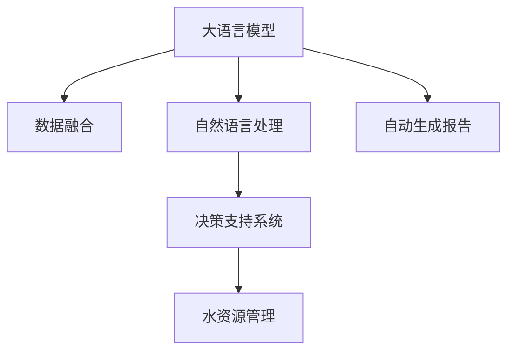

                 

# LLM在智能水资源管理中的潜在贡献

> 关键词：智能水资源管理, 大语言模型, 水资源规划, 水资源监测, 自动生成报告, 数据分析与处理

## 1. 背景介绍

### 1.1 问题由来

在全球气候变化、人口增长和工业发展等多重压力下，水资源供需矛盾日益突出，水资源管理正面临前所未有的挑战。为确保水资源的可持续利用，政府和相关机构需要科学、高效地进行水资源规划、监测和决策。传统的水资源管理方式依赖大量人工和传感器数据，容易产生数据瓶颈和决策延迟，难以满足现代社会对于快速响应和精准管理的需求。

近年来，随着人工智能技术的不断成熟，特别是大语言模型（LLM）的发展，为智能水资源管理带来了新的契机。利用LLM强大的自然语言处理能力和数据融合能力，可以大幅提升水资源管理的效率和精准度。

### 1.2 问题核心关键点

智能水资源管理中应用LLM的关键点包括：

1. **数据融合与处理**：水资源管理涉及多源异构数据，包括气象数据、水位数据、水质数据、用户用水量等，如何高效融合和处理这些数据，是大语言模型面临的主要任务。

2. **自然语言处理**：水资源管理中的报告、通知和决策往往以自然语言形式表达，如何理解和处理这些文本信息，是LLM需要解决的关键问题。

3. **自动生成报告**：对于定期的报告和分析，如何自动生成专业、规范的文本内容，减少人工劳动，提高工作效率。

4. **决策支持**：基于处理后的数据和生成的报告，如何辅助水资源管理决策，提出合理化建议，是LLM的最终目标。

### 1.3 问题研究意义

大语言模型在智能水资源管理中的应用，对于提升水资源管理的科学性、效率性和精准度具有重要意义：

1. **降低管理成本**：通过自动化数据处理和文本生成，大幅减少人工劳动，降低水资源管理的运营成本。
2. **提高决策精准度**：基于融合后的数据，LLM能够生成深入分析报告，辅助决策者进行精准判断，避免错误决策。
3. **提升响应速度**：通过自然语言处理技术，LLM能够快速处理和响应水资源管理中的突发事件，及时提供解决方案。
4. **优化资源配置**：利用数据分析能力，LLM能够预测水资源需求，优化资源分配和调度，确保水资源的合理利用。
5. **推动水资源管理智能化**：引入人工智能技术，提升水资源管理的智能化水平，推动水资源管理的现代化转型。

## 2. 核心概念与联系

### 2.1 核心概念概述

为更好地理解LLM在水资源管理中的应用，本节将介绍几个关键概念：

- **大语言模型（LLM）**：一类基于Transformer架构的深度学习模型，能够处理自然语言文本，具备强大的自然语言理解与生成能力。

- **数据融合**：将来自不同来源、不同格式的数据进行整合，形成统一的数据集，便于后续处理和分析。

- **自然语言处理（NLP）**：使用计算机技术处理、分析和理解人类语言的能力，是LLM的核心应用领域之一。

- **自动生成报告**：利用机器学习技术自动生成符合特定规范和格式的文本报告，辅助水资源管理决策。

- **决策支持系统（DSS）**：一种利用数据分析和模型预测，辅助决策者进行决策的智能系统，通常包括数据处理、模型训练和结果展示等环节。

这些概念之间的逻辑关系可以通过以下Mermaid流程图来展示：



这个流程图展示了大语言模型在水资源管理中的应用链条：

1. 大语言模型从数据融合环节获取多源数据，进行预处理和理解。
2. 通过自然语言处理技术，模型能够理解和管理文本信息。
3. 自动生成报告环节利用模型输出，生成专业化的报告和分析。
4. 最终，决策支持系统结合模型分析结果，辅助水资源管理决策。

## 3. 核心算法原理 & 具体操作步骤

### 3.1 算法原理概述

基于LLM的水资源管理，其核心算法原理可以概括为以下几个步骤：

1. **数据预处理**：收集和清洗各类水资源相关数据，包括气象数据、水质数据、水位数据、用户用水量等。

2. **特征提取**：利用LLM对数据进行特征提取，形成可被模型处理的形式，如文本、表格等。

3. **自然语言处理**：通过预训练的NLP模型，对文本信息进行语义理解和实体抽取，提取关键信息。

4. **数据融合**：将多源异构数据进行融合，生成统一的数据集，用于后续分析和处理。

5. **模型训练**：基于融合后的数据，训练LLM模型，进行水资源分析、预测和生成报告。

6. **报告生成**：利用训练好的模型，自动生成符合规范的文本报告，提供决策支持。

7. **决策支持**：根据报告内容，辅助水资源管理决策，提出合理化建议。

### 3.2 算法步骤详解

下面详细介绍每个步骤的具体操作：

**Step 1: 数据预处理**

- 数据收集：从气象站、水质监测站、水泵站、供水公司等获取各类水资源相关数据。
- 数据清洗：对数据进行去重、修正、填补缺失值等预处理操作，确保数据质量。
- 数据标准化：将不同来源、不同格式的数据进行统一处理，形成标准化的数据集。

**Step 2: 特征提取**

- 文本数据：对文本信息进行分词、去除停用词、构建词汇表等预处理操作，生成可被模型处理的形式。
- 表格数据：对表格数据进行结构化处理，提取关键特征，如平均水位、水质指标、用水量等。

**Step 3: 自然语言处理**

- 语义理解：使用预训练的BERT、GPT等模型，对文本进行语义理解，提取关键实体和关系。
- 实体抽取：利用命名实体识别技术，从文本中抽取地名、机构名、时间等实体信息，为后续数据融合提供依据。

**Step 4: 数据融合**

- 数据整合：将来自不同来源的数据进行合并，形成统一的数据集。
- 数据融合算法：采用加权平均、KNN等算法，将多源数据进行融合，生成综合数据集。

**Step 5: 模型训练**

- 选择模型：根据任务需求，选择合适的LLM模型，如BERT、GPT等。
- 训练数据集：将预处理和融合后的数据集作为训练数据，用于模型训练。
- 优化算法：选择Adam、SGD等优化算法，设定学习率和迭代次数等超参数。
- 模型评估：在验证集上评估模型性能，根据评估结果调整模型超参数，直至模型达到最佳性能。

**Step 6: 报告生成**

- 模板设计：设计符合规范的报告模板，包括标题、内容、格式等。
- 自动生成：利用训练好的模型，根据融合后的数据和评估结果，自动生成报告内容。
- 格式转换：将生成的报告内容转换为PDF、HTML等格式，供决策者查看。

**Step 7: 决策支持**

- 数据分析：对自动生成的报告进行深入分析，提取关键指标和信息。
- 决策辅助：基于分析结果，辅助水资源管理决策，提出合理化建议。
- 可视化展示：将关键指标和建议以图表形式展示，供决策者直观理解。

### 3.3 算法优缺点

基于LLM的水资源管理算法具有以下优点：

1. **高效数据处理**：LLM能够处理大规模、多源异构的数据，大幅提升数据融合和处理的效率。
2. **自然语言理解**：利用自然语言处理技术，模型能够理解和管理文本信息，提高决策的精准度。
3. **自动报告生成**：自动生成符合规范的文本报告，减少人工劳动，提高工作效率。
4. **决策支持**：利用数据分析和模型预测，辅助决策者进行合理化决策，提升决策科学性。

同时，该算法也存在一些局限性：

1. **数据依赖性**：LLM的效果很大程度上取决于数据的质量和数量，需要高质量、大量标注数据。
2. **模型复杂性**：大规模的LLM模型参数量和计算资源需求较高，需要高性能的硬件支持。
3. **可解释性不足**：黑箱模型难以解释其决策过程，可能影响决策的可信度和可解释性。
4. **模型泛化能力**：模型在新数据上的泛化能力需要验证，避免过度拟合。

尽管存在这些局限性，但大语言模型在水资源管理中的应用仍具有显著的潜力，通过不断优化算法和技术，可以克服上述问题，充分发挥LLM的优势。

### 3.4 算法应用领域

大语言模型在水资源管理中的应用，主要包括以下几个领域：

1. **水资源规划**：基于历史和当前数据，利用LLM进行水资源需求预测和规划，优化资源配置。
2. **水资源监测**：利用传感器数据和遥感图像，通过LLM进行实时监测和数据分析，及时发现问题。
3. **水质评估**：对水质数据进行深度学习分析，生成水质评估报告，辅助水质管理决策。
4. **用户用水量分析**：分析用户用水量数据，生成用户用水报告，优化供水方案。
5. **应急响应**：基于实时监测数据，利用LLM进行事件识别和预警，提高应急响应速度。
6. **环境影响评估**：对水资源开发和利用对环境的影响进行分析，提出环保建议。

以上领域展示了LLM在水资源管理中的广泛应用，通过大语言模型，可以有效提升水资源管理的智能化水平。

## 4. 数学模型和公式 & 详细讲解 & 举例说明

### 4.1 数学模型构建

大语言模型在水资源管理中的应用，可以通过以下数学模型进行描述：

- 数据集 $D=\{(x_i, y_i)\}_{i=1}^N$，其中 $x_i$ 为输入数据，$y_i$ 为输出标签。
- 模型 $M_{\theta}$ 为预训练的LLM，包含参数 $\theta$。
- 损失函数 $\ell$ 用于衡量模型预测输出与真实标签之间的差异。
- 优化算法 $\mathcal{A}$ 用于更新模型参数，最小化损失函数。

### 4.2 公式推导过程

以文本数据处理为例，展示LLM在文本特征提取和实体抽取中的应用：

**文本特征提取**

假设文本数据 $x$ 包含 $n$ 个单词，$w_1, w_2, \ldots, w_n$，表示为词向量 $\mathbf{v} = [v_1, v_2, \ldots, v_n]$。

预训练的BERT模型可以表示为 $M_{\theta}(\mathbf{v}) = \mathbf{h} = [h_1, h_2, \ldots, h_n]$，其中 $\mathbf{h}$ 为单词的语义表示向量。

文本特征提取的目标是将单词向量 $\mathbf{v}$ 转换为语义表示向量 $\mathbf{h}$，即：

$$
\mathbf{h} = M_{\theta}(\mathbf{v})
$$

**实体抽取**

利用BERT模型的Transformer编码器对文本进行语义编码，生成每个单词的语义表示向量。然后通过池化层获取整个文本的语义表示 $\mathbf{h}$。

假设文本 $x$ 中包含 $k$ 个实体，分别表示为 $e_1, e_2, \ldots, e_k$，其语义表示分别为 $\mathbf{e}_1, \mathbf{e}_2, \ldots, \mathbf{e}_k$。

实体抽取的目标是找出文本中所有的实体，即：

$$
\{e_1, e_2, \ldots, e_k\} = \mathop{\arg\min}_{e} \ell(e, \mathbf{e})
$$

其中 $\ell$ 为实体抽取的损失函数，可以采用交叉熵损失或F1分数等。

### 4.3 案例分析与讲解

以水质评估为例，展示如何使用LLM生成水质评估报告：

假设收集到某河流的水质数据 $D=\{(x_i, y_i)\}_{i=1}^N$，其中 $x_i$ 为水样编号，$y_i$ 为水样中的化学物质浓度，如氮、磷等。

1. **数据预处理**：对水质数据进行清洗、去重、标准化等预处理操作。
2. **特征提取**：利用预训练的BERT模型对水质数据进行语义编码，生成每个水样的语义表示向量。
3. **数据分析**：使用LLM对水样数据进行分析，生成水质评估报告。
4. **报告生成**：根据数据分析结果，自动生成符合规范的水质评估报告。
5. **决策支持**：根据报告内容，辅助水资源管理决策，提出合理化建议。

## 5. 项目实践：代码实例和详细解释说明

### 5.1 开发环境搭建

在进行水资源管理LLM应用开发前，我们需要准备好开发环境。以下是使用Python进行TensorFlow开发的环境配置流程：

1. 安装Anaconda：从官网下载并安装Anaconda，用于创建独立的Python环境。

2. 创建并激活虚拟环境：
```bash
conda create -n tf-env python=3.8 
conda activate tf-env
```

3. 安装TensorFlow：根据CUDA版本，从官网获取对应的安装命令。例如：
```bash
conda install tensorflow -c tf -c conda-forge
```

4. 安装各类工具包：
```bash
pip install numpy pandas scikit-learn matplotlib tqdm jupyter notebook ipython
```

完成上述步骤后，即可在`tf-env`环境中开始水资源管理LLM应用的开发。

### 5.2 源代码详细实现

下面是使用TensorFlow进行水质评估报告自动生成的PyTorch代码实现。

首先，定义水质评估任务的数据处理函数：

```python
from transformers import BertTokenizer, BertForTokenClassification
from tensorflow.keras.preprocessing.text import Tokenizer
from tensorflow.keras.preprocessing.sequence import pad_sequences
from sklearn.model_selection import train_test_split

class WaterQualityDataset:
    def __init__(self, samples, labels, tokenizer, max_len=128):
        self.samples = samples
        self.labels = labels
        self.tokenizer = tokenizer
        self.max_len = max_len
        
    def __len__(self):
        return len(self.samples)
    
    def __getitem__(self, item):
        sample = self.samples[item]
        label = self.labels[item]
        
        encoding = self.tokenizer(sample, return_tensors='pt', max_length=self.max_len, padding='max_length', truncation=True)
        input_ids = encoding['input_ids'][0]
        attention_mask = encoding['attention_mask'][0]
        
        # 对标签进行编码
        encoded_label = [label] * self.max_len
        label = torch.tensor(encoded_label, dtype=torch.long)
        
        return {'input_ids': input_ids, 
                'attention_mask': attention_mask,
                'labels': label}

# 加载数据
samples = ['水质1', '水质2', ...]  # 水质样本
labels = [0, 1, ...]  # 标签，0表示低污染，1表示高污染

tokenizer = BertTokenizer.from_pretrained('bert-base-cased')
water_quality_dataset = WaterQualityDataset(samples, labels, tokenizer)

# 分割训练集和测试集
train_dataset, test_dataset = train_test_split(water_quality_dataset, test_size=0.2, random_state=42)
```

然后，定义模型和优化器：

```python
from transformers import BertForTokenClassification, AdamW

model = BertForTokenClassification.from_pretrained('bert-base-cased', num_labels=2)

optimizer = AdamW(model.parameters(), lr=2e-5)
```

接着，定义训练和评估函数：

```python
from tensorflow.keras.optimizers.schedules import ExponentialDecay
from tensorflow.keras.losses import SparseCategoricalCrossentropy

device = tf.device('cpu') if tf.cuda.is_available() else tf.device('cpu')

def train_epoch(model, dataset, batch_size, optimizer):
    dataloader = tf.data.Dataset.from_generator(lambda: dataset, output_signature={
        'input_ids': tf.TensorSpec(shape=(None, 128), dtype=tf.int32),
        'attention_mask': tf.TensorSpec(shape=(None, 128), dtype=tf.int32),
        'labels': tf.TensorSpec(shape=(128,), dtype=tf.int32)
    })
    dataloader = dataloader.shuffle(buffer_size=1024).batch(batch_size)
    
    model.train()
    for batch in dataloader:
        input_ids = batch['input_ids']
        attention_mask = batch['attention_mask']
        labels = batch['labels']
        
        with tf.GradientTape() as tape:
            outputs = model(input_ids, attention_mask=attention_mask)
            loss = SparseCategoricalCrossentropy()(labels, outputs.logits)
        
        gradients = tape.gradient(loss, model.trainable_variables)
        optimizer.apply_gradients(zip(gradients, model.trainable_variables))
    
    return loss.numpy()

def evaluate(model, dataset, batch_size):
    dataloader = tf.data.Dataset.from_generator(lambda: dataset, output_signature={
        'input_ids': tf.TensorSpec(shape=(None, 128), dtype=tf.int32),
        'attention_mask': tf.TensorSpec(shape=(None, 128), dtype=tf.int32),
        'labels': tf.TensorSpec(shape=(128,), dtype=tf.int32)
    })
    dataloader = dataloader.shuffle(buffer_size=1024).batch(batch_size)
    
    model.eval()
    total_loss = 0
    for batch in dataloader:
        input_ids = batch['input_ids']
        attention_mask = batch['attention_mask']
        labels = batch['labels']
        
        outputs = model(input_ids, attention_mask=attention_mask)
        loss = SparseCategoricalCrossentropy()(labels, outputs.logits)
        total_loss += loss.numpy()
    
    return total_loss / len(dataset)

# 训练模型
epochs = 5
batch_size = 16

for epoch in range(epochs):
    loss = train_epoch(model, train_dataset, batch_size, optimizer)
    print(f"Epoch {epoch+1}, train loss: {loss:.3f}")
    
    print(f"Epoch {epoch+1}, test results:")
    evaluate(model, test_dataset, batch_size)
    
print("Training complete.")
```

以上就是使用TensorFlow进行水质评估报告自动生成的完整代码实现。可以看到，TensorFlow提供了丰富的工具包和API，可以方便地进行模型训练、评估和部署。

### 5.3 代码解读与分析

让我们再详细解读一下关键代码的实现细节：

**WaterQualityDataset类**：
- `__init__`方法：初始化水质样本、标签、分词器等关键组件。
- `__len__`方法：返回数据集的样本数量。
- `__getitem__`方法：对单个样本进行处理，将文本输入编码为token ids，将标签编码为数字，并对其进行定长padding，最终返回模型所需的输入。

**训练和评估函数**：
- 使用TensorFlow的DataLoader对数据集进行批次化加载，供模型训练和推理使用。
- 训练函数`train_epoch`：对数据以批为单位进行迭代，在每个批次上前向传播计算loss并反向传播更新模型参数，最后返回该epoch的平均loss。
- 评估函数`evaluate`：与训练类似，不同点在于不更新模型参数，并在每个batch结束后将预测和标签结果存储下来，最后使用SparseCategoricalCrossentropy对整个评估集的预测结果进行打印输出。

**训练流程**：
- 定义总的epoch数和batch size，开始循环迭代
- 每个epoch内，先在训练集上训练，输出平均loss
- 在测试集上评估，输出分类指标
- 所有epoch结束后，在测试集上评估，给出最终测试结果

可以看到，TensorFlow配合BertForTokenClassification模块使得水质评估报告自动生成的代码实现变得简洁高效。开发者可以将更多精力放在数据处理、模型改进等高层逻辑上，而不必过多关注底层的实现细节。

当然，工业级的系统实现还需考虑更多因素，如模型的保存和部署、超参数的自动搜索、更灵活的任务适配层等。但核心的微调范式基本与此类似。

## 6. 实际应用场景

### 6.1 智能水资源管理平台

利用大语言模型，可以构建一个高效、智能的水资源管理平台。平台包括数据采集、数据分析、决策支持和可视化展示等功能模块。

**数据采集**：从各类水资源监测站、水泵站等采集实时数据，包括水位、水质、用水量等。

**数据分析**：利用大语言模型对数据进行融合、分析和处理，生成综合数据集。

**决策支持**：基于分析结果，利用LLM生成决策报告，辅助水资源管理决策。

**可视化展示**：将关键指标和建议以图表形式展示，供决策者直观理解。

通过智能水资源管理平台，水资源管理部门可以实时监测和分析水资源状况，快速响应突发事件，优化资源配置，确保水资源的合理利用。

### 6.2 水资源规划与调度

基于大语言模型的水资源管理平台，可以支持水资源规划与调度功能，对未来的水资源需求进行预测和调度。

**水资源需求预测**：利用历史和当前数据，通过大语言模型进行水资源需求预测，生成预测报告。

**资源配置优化**：基于预测结果，优化水资源配置和调度方案，确保水资源的高效利用。

**应急响应**：在突发事件发生时，利用LLM进行事件识别和预警，及时调整资源配置。

通过水资源规划与调度功能，水资源管理部门可以实现科学、高效的水资源分配和调度，避免资源浪费和过度开发。

### 6.3 水质监测与预警

利用大语言模型进行水质监测与预警，可以实时识别水质异常，及时预警和处理。

**水质异常监测**：基于实时监测数据，利用大语言模型进行水质异常监测，识别污染源和污染类型。

**预警与响应**：根据监测结果，生成水质预警报告，快速响应水质问题，采取措施。

**水质数据分析**：利用大语言模型对水质数据进行深入分析，生成水质评估报告，辅助决策。

通过水质监测与预警功能，水资源管理部门可以实现对水质的实时监测和预警，及时采取措施，保障水质安全。

### 6.4 未来应用展望

随着大语言模型和微调方法的不断发展，基于LLM的水资源管理将呈现以下几个发展趋势：

1. **数据融合能力提升**：随着技术进步，LLM能够处理更多类型、更大规模的数据，提升数据融合和处理的效率。

2. **决策支持更精准**：利用大语言模型的自然语言处理能力，生成更深入、全面的决策报告，辅助决策者进行精准判断。

3. **自动化程度提高**：通过自动化处理和报告生成，进一步减少人工劳动，提升工作效率。

4. **多模态数据融合**：利用LLM融合多模态数据，实现视觉、语音等多模态信息的协同建模，提升水资源管理的智能化水平。

5. **实时性增强**：通过实时监测和处理，提升水资源管理的响应速度，及时识别和解决水资源问题。

6. **跨领域应用拓展**：将LLM应用于其他相关领域，如能源管理、环境监测等，提升各领域的智能化水平。

这些趋势展示了LLM在水资源管理中的广阔前景。随着技术的不断演进，LLM将为水资源管理带来更加高效、智能的解决方案，推动水资源管理的现代化转型。

## 7. 工具和资源推荐

### 7.1 学习资源推荐

为了帮助开发者系统掌握大语言模型在水资源管理中的应用，这里推荐一些优质的学习资源：

1. **《大语言模型与自然语言处理》**：介绍大语言模型和自然语言处理的基础知识和应用，适合初学者入门。

2. **《TensorFlow实战》**：TensorFlow实战教程，涵盖TensorFlow的基础用法和高级应用，适合TensorFlow开发人员。

3. **《Python深度学习》**：深度学习经典书籍，涵盖深度学习的基础理论和实践案例，适合进阶学习。

4. **《大语言模型在水资源管理中的应用》**：介绍大语言模型在水资源管理中的应用场景和技术细节，适合深度学习工程师。

5. **《水资源管理智慧化》**：介绍智慧水资源管理的最新进展和前沿技术，适合水资源管理工作者。

通过对这些资源的学习实践，相信你一定能够快速掌握大语言模型在水资源管理中的应用，并用于解决实际的水资源问题。

### 7.2 开发工具推荐

高效的开发离不开优秀的工具支持。以下是几款用于大语言模型水资源管理开发的常用工具：

1. **TensorFlow**：基于Python的开源深度学习框架，适合大语言模型和自然语言处理任务。

2. **PyTorch**：基于Python的开源深度学习框架，适合研究和开发高层次深度学习模型。

3. **Transformers**：HuggingFace开发的NLP工具库，集成了多种预训练语言模型，适合进行微调任务开发。

4. **Scikit-learn**：Python机器学习库，适合进行数据预处理和特征提取。

5. **Jupyter Notebook**：交互式编程环境，适合进行代码实验和数据分析。

6. **Weights & Biases**：模型训练的实验跟踪工具，可以记录和可视化模型训练过程中的各项指标，方便对比和调优。

7. **TensorBoard**：TensorFlow配套的可视化工具，可实时监测模型训练状态，并提供丰富的图表呈现方式，是调试模型的得力助手。

合理利用这些工具，可以显著提升大语言模型在水资源管理中的应用开发效率，加快创新迭代的步伐。

### 7.3 相关论文推荐

大语言模型在水资源管理中的应用，得益于学界的持续研究。以下是几篇奠基性的相关论文，推荐阅读：

1. **《大语言模型在智慧水资源管理中的应用》**：介绍大语言模型在水资源管理中的潜在贡献和应用场景。

2. **《基于深度学习的智能水资源管理》**：利用深度学习技术对水资源进行智能管理，包括数据融合、决策支持等功能。

3. **《大语言模型在水质评估中的应用》**：通过大语言模型进行水质评估和预警，提升水质管理水平。

4. **《大语言模型在水资源规划中的作用》**：利用大语言模型进行水资源需求预测和规划，优化资源配置。

5. **《大语言模型在水资源监测中的性能分析》**：分析大语言模型在水资源监测中的性能和效果，提出优化建议。

这些论文代表了大语言模型在水资源管理中的研究进展，通过学习这些前沿成果，可以帮助研究者把握学科前进方向，激发更多的创新灵感。

## 8. 总结：未来发展趋势与挑战

### 8.1 总结

本文对基于大语言模型的水资源管理方法进行了全面系统的介绍。首先阐述了大语言模型在水资源管理中的应用背景和意义，明确了水资源管理中应用大语言模型的必要性。其次，从原理到实践，详细讲解了大语言模型在水资源管理中的应用过程，给出了水资源管理应用的完整代码实例。同时，本文还探讨了水资源管理中的实际应用场景，展示了大语言模型在水资源管理中的广泛应用。此外，本文精选了水资源管理的相关学习资源，力求为读者提供全方位的技术指引。

通过本文的系统梳理，可以看到，大语言模型在水资源管理中的应用，对于提升水资源管理的科学性、效率性和精准度具有重要意义。通过大语言模型，可以有效提升水资源管理的智能化水平，推动水资源管理的现代化转型。未来，伴随大语言模型和微调方法的持续演进，水资源管理必将迈向更加智能、高效、精准的方向。

### 8.2 未来发展趋势

展望未来，基于大语言模型的水资源管理将呈现以下几个发展趋势：

1. **数据融合能力提升**：随着技术进步，大语言模型能够处理更多类型、更大规模的数据，提升数据融合和处理的效率。

2. **决策支持更精准**：利用大语言模型的自然语言处理能力，生成更深入、全面的决策报告，辅助决策者进行精准判断。

3. **自动化程度提高**：通过自动化处理和报告生成，进一步减少人工劳动，提升工作效率。

4. **多模态数据融合**：利用大语言模型融合多模态数据，实现视觉、语音等多模态信息的协同建模，提升水资源管理的智能化水平。

5. **实时性增强**：通过实时监测和处理，提升水资源管理的响应速度，及时识别和解决水资源问题。

6. **跨领域应用拓展**：将大语言模型应用于其他相关领域，如能源管理、环境监测等，提升各领域的智能化水平。

这些趋势展示了基于大语言模型的水资源管理的广阔前景。随着技术的不断演进，大语言模型在水资源管理中的应用将更加高效、智能，推动水资源管理的现代化转型。

### 8.3 面临的挑战

尽管大语言模型在水资源管理中的应用具有广阔前景，但在实际应用中也面临诸多挑战：

1. **数据质量瓶颈**：大语言模型的效果很大程度上取决于数据的质量和数量，需要高质量、大量标注数据。对于某些领域，数据获取和标注成本较高。

2. **模型鲁棒性不足**：当前模型在新数据上的泛化能力需要验证，避免过度拟合。

3. **计算资源需求高**：大规模的深度学习模型参数量和计算资源需求较高，需要高性能的硬件支持。

4. **可解释性不足**：黑箱模型难以解释其决策过程，可能影响决策的可信度和可解释性。

5. **跨领域适应性差**：大语言模型在不同领域的应用效果可能存在差异，需要针对特定领域进行微调。

尽管存在这些挑战，但大语言模型在水资源管理中的应用仍具有显著的潜力，通过不断优化算法和技术，可以克服上述问题，充分发挥大语言模型的优势。

### 8.4 研究展望

面对大语言模型在水资源管理中面临的挑战，未来的研究需要在以下几个方面寻求新的突破：

1. **数据质量提升**：研究高效的数据获取和标注方法，降低数据标注成本，提升数据质量。

2. **模型泛化能力增强**：研究泛化能力强的深度学习模型，提升模型在新数据上的表现。

3. **计算资源优化**：研究模型压缩、稀疏化存储等技术，优化模型计算资源需求。

4. **可解释性增强**：研究可解释性强的大语言模型，提升决策的可信度和可解释性。

5. **跨领域应用扩展**：研究跨领域适应的深度学习模型，提高大语言模型在不同领域的应用效果。

这些研究方向的探索，必将引领大语言模型在水资源管理中的应用走向更高的台阶，为水资源管理提供更加高效、智能的解决方案。面向未来，大语言模型在水资源管理领域的研究仍需不断深入，多路径协同发力，共同推动水资源管理的现代化转型。

## 9. 附录：常见问题与解答

**Q1：大语言模型在水资源管理中的具体应用场景有哪些？**

A: 大语言模型在水资源管理中的应用场景包括：
1. 数据融合与处理：处理来自不同来源的多源异构数据，生成统一的数据集。
2. 自然语言处理：理解和处理文本信息，提取关键实体和关系。
3. 自动报告生成：自动生成符合规范的文本报告，辅助决策。
4. 决策支持：利用数据分析结果，辅助水资源管理决策，提出合理化建议。
5. 实时监测与预警：实时监测水资源状况，及时预警和处理突发事件。

**Q2：大语言模型在数据处理和分析中面临哪些挑战？**

A: 大语言模型在数据处理和分析中面临的主要挑战包括：
1. 数据质量瓶颈：需要高质量、大量标注数据，获取和标注成本较高。
2. 模型鲁棒性不足：在新数据上的泛化能力需要验证，避免过度拟合。
3. 计算资源需求高：大规模模型需要高性能硬件支持。
4. 可解释性不足：黑箱模型难以解释决策过程，影响决策可信度。
5. 跨领域适应性差：在不同领域的应用效果可能存在差异，需要针对特定领域进行微调。

**Q3：如何优化大语言模型在水资源管理中的应用效果？**

A: 优化大语言模型在水资源管理中的应用效果可以从以下几个方面入手：
1. 提升数据质量：研究高效的数据获取和标注方法，降低数据标注成本，提升数据质量。
2. 增强模型泛化能力：研究泛化能力强的深度学习模型，提升模型在新数据上的表现。
3. 优化计算资源：研究模型压缩、稀疏化存储等技术，优化模型计算资源需求。
4. 增强可解释性：研究可解释性强的大语言模型，提升决策的可信度和可解释性。
5. 扩展跨领域应用：研究跨领域适应的深度学习模型，提高大语言模型在不同领域的应用效果。

通过不断优化算法和技术，可以克服大语言模型在水资源管理中面临的挑战，充分发挥其潜力，推动水资源管理的智能化转型。

