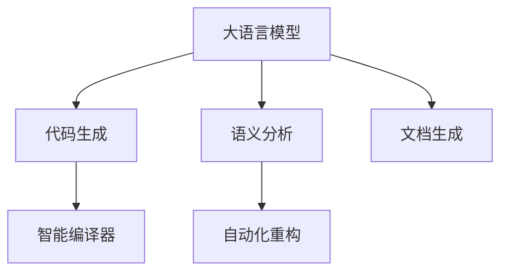

                 

# LLM在智能编译领域的应用前景

> 关键词：大语言模型(LLM),自然语言处理(NLP),智能编译器,代码生成,语义分析,自动化重构

## 1. 背景介绍

### 1.1 问题由来
软件开发是一个复杂且耗时的过程，传统的代码编写、测试、优化等步骤需要耗费大量的人力和时间。而随着软件规模的不断扩大，人工开发效率逐渐成为软件开发的主要瓶颈。为了解决这个问题，许多公司和组织开始探索通过自动化手段来提升软件开发的效率和质量。其中，智能编译器就是一种能够通过自动化技术辅助开发者编写和优化代码的工具。

智能编译器能够对源代码进行语义分析、代码生成、自动化重构等多种操作，从而帮助开发者减少手工编码的工作量，提高代码质量和效率。然而，传统的智能编译器往往只能处理特定类型的问题，比如语法错误、类型错误等，对于更复杂的逻辑错误、代码风格问题则无法处理。而大语言模型(Large Language Model, LLM)，尤其是深度学习的Transformer模型，具有强大的自然语言理解和生成能力，能够处理更加复杂和抽象的问题，因此有潜力在智能编译领域发挥更大的作用。

### 1.2 问题核心关键点
大语言模型在智能编译领域的应用主要集中在以下几个方面：

- 代码生成：利用大语言模型生成符合指定规范和需求的代码，减少人工编写代码的复杂性和时间消耗。
- 语义分析：对代码进行语义理解，检测代码中的逻辑错误和风格问题，提出改进建议。
- 自动化重构：通过语义分析的结果，自动化地进行代码重构，提升代码质量和可维护性。
- 文档生成：利用大语言模型自动生成代码文档，帮助开发者快速了解代码结构和功能。

本文将深入探讨大语言模型在智能编译领域的应用前景，包括其原理、算法步骤、优缺点、应用领域和实际应用案例，以及面临的挑战和未来的研究方向。

## 2. 核心概念与联系

### 2.1 核心概念概述

为了更好地理解大语言模型在智能编译领域的应用，本节将介绍几个关键概念：

- 大语言模型(Large Language Model, LLM)：以自回归(如GPT)或自编码(如BERT)模型为代表的大规模预训练语言模型。通过在大规模无标签文本数据上进行预训练，学习通用的语言表示，具备强大的语言理解和生成能力。

- 自然语言处理(Natural Language Processing, NLP)：利用计算机技术和人工智能方法，实现对自然语言的理解和处理，包括语言模型、语义分析、生成式文本等。

- 智能编译器：能够对源代码进行语义分析、代码生成、自动化重构等操作的自动化工具，旨在提升代码编写的效率和质量。

- 代码生成：利用大语言模型生成符合指定规范和需求的代码，减少人工编写代码的复杂性和时间消耗。

- 语义分析：对代码进行语义理解，检测代码中的逻辑错误和风格问题，提出改进建议。

- 自动化重构：通过语义分析的结果，自动化地进行代码重构，提升代码质量和可维护性。

- 文档生成：利用大语言模型自动生成代码文档，帮助开发者快速了解代码结构和功能。

这些核心概念之间的逻辑关系可以通过以下Mermaid流程图来展示：



这个流程图展示了大语言模型在智能编译领域的核心应用：

1. 大语言模型通过预训练获得语言知识和能力。
2. 代码生成利用语言模型生成符合规范的代码。
3. 语义分析对代码进行语义理解，检测错误和风格问题。
4. 自动化重构通过语义分析结果进行代码优化。
5. 文档生成自动生成代码文档，辅助开发者理解代码。

这些概念共同构成了大语言模型在智能编译领域的核心应用框架，使其能够高效地处理源代码和辅助开发者编写高质量代码。

## 3. 核心算法原理 & 具体操作步骤
### 3.1 算法原理概述

基于大语言模型在智能编译领域的应用，核心算法可以概括为以下几个步骤：

1. **预训练**：在大规模无标签文本数据上，利用大语言模型进行预训练，学习通用的语言表示。

2. **任务适配**：根据智能编译器的特定需求，在预训练模型的基础上进行微调，使模型具备代码生成、语义分析、自动化重构等功能。

3. **代码生成**：利用微调后的模型生成符合规范和需求的代码，减少人工编写代码的时间和复杂性。

4. **语义分析**：对生成的代码进行语义分析，检测逻辑错误和风格问题，提出改进建议。

5. **自动化重构**：根据语义分析的结果，自动进行代码重构，提升代码质量和可维护性。

6. **文档生成**：自动生成代码文档，帮助开发者快速理解代码结构和功能。

这些步骤将大语言模型的通用能力与智能编译器的特定需求结合起来，形成了一套完整且高效的代码处理流程。

### 3.2 算法步骤详解

**Step 1: 预训练**
在大规模无标签文本数据上，利用大语言模型进行预训练，学习通用的语言表示。具体流程如下：

1. 收集大量的文本数据，包括代码、文档、评论等。
2. 利用Transformer等架构进行自回归或自编码预训练，学习语言表示。
3. 在预训练过程中，引入各种任务，如掩码语言模型、文本分类、生成式文本等，以丰富模型的语义理解能力。

**Step 2: 任务适配**
根据智能编译器的特定需求，在预训练模型的基础上进行微调，使模型具备代码生成、语义分析、自动化重构等功能。具体流程如下：

1. 设计任务适配层，如生成式语言模型、语义分析器等，并选择合适的损失函数。
2. 利用微调算法，如Adam、SGD等，优化模型参数，使其能够处理特定任务。
3. 在微调过程中，使用少量的标注数据进行监督学习，避免过拟合。

**Step 3: 代码生成**
利用微调后的模型生成符合规范和需求的代码，减少人工编写代码的时间和复杂性。具体流程如下：

1. 设计代码生成任务，如编写函数、生成类、重构代码等。
2. 将任务描述作为输入，利用微调后的模型进行代码生成。
3. 对生成的代码进行语法和语义检查，确保代码符合规范和要求。

**Step 4: 语义分析**
对生成的代码进行语义分析，检测逻辑错误和风格问题，提出改进建议。具体流程如下：

1. 设计语义分析任务，如代码检测、风格检查等。
2. 将代码作为输入，利用微调后的模型进行语义分析。
3. 对分析结果进行评估，输出改进建议。

**Step 5: 自动化重构**
根据语义分析的结果，自动进行代码重构，提升代码质量和可维护性。具体流程如下：

1. 设计代码重构任务，如代码优化、重构等。
2. 利用微调后的模型进行代码重构。
3. 对重构结果进行验证，确保代码质量和性能。

**Step 6: 文档生成**
自动生成代码文档，帮助开发者快速理解代码结构和功能。具体流程如下：

1. 设计文档生成任务，如自动生成API文档、函数注释等。
2. 利用微调后的模型进行文档生成。
3. 对生成的文档进行检查和优化，确保文档质量。

### 3.3 算法优缺点

基于大语言模型在智能编译领域的应用，具有以下优点：

1. 通用性强：大语言模型具有强大的语义理解能力，可以处理多种不同类型的代码和任务。
2. 高效性高：利用大语言模型进行代码生成和分析，可以大大减少人工编写代码和审查代码的时间和成本。
3. 灵活性高：大语言模型可以根据特定的需求进行任务适配，满足不同的应用场景。
4. 可扩展性强：大语言模型可以通过微调和升级，不断提升性能和功能。

同时，也存在一些缺点：

1. 依赖标注数据：微调过程需要大量的标注数据，标注数据的获取和维护成本较高。
2. 泛化能力有限：大语言模型对特定领域或任务的泛化能力有限，可能无法处理一些非常规或复杂的代码。
3. 可解释性差：大语言模型的输出结果往往是黑盒模型，难以解释其内部工作机制和推理过程。
4. 资源消耗大：大语言模型的计算资源和存储空间消耗较大，需要高性能的硬件设备和优化的算法。

这些优缺点决定了大语言模型在智能编译领域的适用范围和应用方式，需要根据具体需求进行综合考虑。

### 3.4 算法应用领域

基于大语言模型在智能编译领域的应用，已经应用于以下几个方面：

1. **代码自动生成**：利用大语言模型生成符合规范和需求的代码，减少人工编写代码的复杂性和时间消耗。
2. **代码风格检查**：利用大语言模型检测代码的风格问题，如代码缩进、命名规范等，提出改进建议。
3. **代码重构**：利用大语言模型进行代码优化和重构，提升代码质量和可维护性。
4. **代码注释自动生成**：利用大语言模型自动生成代码注释，帮助开发者快速理解代码结构和功能。
5. **代码检测**：利用大语言模型进行代码检测，如检测代码中的逻辑错误、潜在漏洞等。

这些应用领域展示了大语言模型在智能编译领域的广泛适用性，能够帮助开发者提升代码编写和审查的效率和质量。

## 4. 数学模型和公式 & 详细讲解  
### 4.1 数学模型构建

在大语言模型应用于智能编译领域的任务中，数学模型的构建可以概括为以下几个步骤：

1. **预训练模型构建**：利用Transformer等架构进行自回归或自编码预训练，学习语言表示。
2. **任务适配模型构建**：在预训练模型的基础上，设计任务适配层，如生成式语言模型、语义分析器等，并进行微调。
3. **代码生成模型构建**：设计代码生成任务，如编写函数、生成类、重构代码等，并利用微调后的模型进行代码生成。
4. **语义分析模型构建**：设计语义分析任务，如代码检测、风格检查等，并利用微调后的模型进行语义分析。
5. **自动化重构模型构建**：设计代码重构任务，如代码优化、重构等，并利用微调后的模型进行代码重构。
6. **文档生成模型构建**：设计文档生成任务，如自动生成API文档、函数注释等，并利用微调后的模型进行文档生成。

### 4.2 公式推导过程

以下我们以代码自动生成任务为例，推导使用Transformer模型的代码生成过程。

假设生成式语言模型为 $M_{\theta}$，其中 $\theta$ 为模型参数。给定任务 $T$ 的训练集 $D=\{(x_i,y_i)\}_{i=1}^N, x_i \in \mathcal{X}, y_i \in \mathcal{Y}$。

定义模型 $M_{\theta}$ 在输入 $x$ 上的输出为 $\hat{y}=M_{\theta}(x) \in \mathcal{Y}$。

则代码生成任务的损失函数为：

$$
\ell(M_{\theta}(x),y) = -\log M_{\theta}(x)
$$

其经验风险为：

$$
\mathcal{L}(\theta) = -\frac{1}{N}\sum_{i=1}^N \log M_{\theta}(x_i)
$$

利用梯度下降等优化算法，微调过程不断更新模型参数 $\theta$，最小化损失函数 $\mathcal{L}$，使得模型输出逼近真实标签。

### 4.3 案例分析与讲解

以代码自动生成任务为例，假设目标任务为生成一个函数，函数名和参数均为输入。模型的输入为任务描述 "生成一个名为 sum 的函数，接受两个整数参数，返回它们的和"。

假设预训练模型的输出为 $\hat{y}=M_{\theta}(\text{task description})$，其中 $\text{task description}$ 为任务描述的字符串。

模型的训练过程如下：

1. 将任务描述作为输入，利用微调后的模型进行代码生成。
2. 对生成的代码进行语法和语义检查，确保代码符合规范和要求。
3. 根据检查结果，对模型进行反向传播，更新模型参数。
4. 重复上述步骤，直至模型生成的代码符合要求。

## 5. 项目实践：代码实例和详细解释说明
### 5.1 开发环境搭建

在进行大语言模型在智能编译领域的应用实践前，我们需要准备好开发环境。以下是使用Python进行PyTorch开发的环境配置流程：

1. 安装Anaconda：从官网下载并安装Anaconda，用于创建独立的Python环境。

2. 创建并激活虚拟环境：
```bash
conda create -n pytorch-env python=3.8 
conda activate pytorch-env
```

3. 安装PyTorch：根据CUDA版本，从官网获取对应的安装命令。例如：
```bash
conda install pytorch torchvision torchaudio cudatoolkit=11.1 -c pytorch -c conda-forge
```

4. 安装Transformers库：
```bash
pip install transformers
```

5. 安装各类工具包：
```bash
pip install numpy pandas scikit-learn matplotlib tqdm jupyter notebook ipython
```

完成上述步骤后，即可在`pytorch-env`环境中开始应用实践。

### 5.2 源代码详细实现

这里以代码自动生成任务为例，给出使用Transformers库进行代码自动生成的PyTorch代码实现。

首先，定义代码生成任务的数据处理函数：

```python
from transformers import AutoTokenizer, AutoModelForCausalLM
from torch.utils.data import Dataset
import torch

class CodeGenerationDataset(Dataset):
    def __init__(self, text, labels, tokenizer, max_len=128):
        self.text = text
        self.labels = labels
        self.tokenizer = tokenizer
        self.max_len = max_len
        
    def __len__(self):
        return len(self.text)
    
    def __getitem__(self, item):
        text = self.text[item]
        label = self.labels[item]
        
        encoding = self.tokenizer(text, return_tensors='pt', max_length=self.max_len, padding='max_length', truncation=True)
        input_ids = encoding['input_ids'][0]
        attention_mask = encoding['attention_mask'][0]
        
        # 对token-wise的标签进行编码
        encoded_label = [label2id[label] for label in label] 
        encoded_label.extend([label2id['<eos>']] * (self.max_len - len(encoded_label)))
        labels = torch.tensor(encoded_label, dtype=torch.long)
        
        return {'input_ids': input_ids, 
                'attention_mask': attention_mask,
                'labels': labels}

# 标签与id的映射
label2id = {'<eos>': 0, 'sum': 1, 'mul': 2, 'diff': 3}
id2label = {v: k for k, v in label2id.items()}

# 创建dataset
tokenizer = AutoTokenizer.from_pretrained('bert-base-cased')

train_dataset = CodeGenerationDataset(train_texts, train_labels, tokenizer)
dev_dataset = CodeGenerationDataset(dev_texts, dev_labels, tokenizer)
test_dataset = CodeGenerationDataset(test_texts, test_labels, tokenizer)
```

然后，定义模型和优化器：

```python
from transformers import AutoConfig, AutoModelForCausalLM, AdamW

model = AutoModelForCausalLM.from_pretrained('bert-base-cased', num_labels=len(label2id))

optimizer = AdamW(model.parameters(), lr=2e-5)
```

接着，定义训练和评估函数：

```python
from torch.utils.data import DataLoader
from tqdm import tqdm
from sklearn.metrics import classification_report

device = torch.device('cuda') if torch.cuda.is_available() else torch.device('cpu')
model.to(device)

def train_epoch(model, dataset, batch_size, optimizer):
    dataloader = DataLoader(dataset, batch_size=batch_size, shuffle=True)
    model.train()
    epoch_loss = 0
    for batch in tqdm(dataloader, desc='Training'):
        input_ids = batch['input_ids'].to(device)
        attention_mask = batch['attention_mask'].to(device)
        labels = batch['labels'].to(device)
        model.zero_grad()
        outputs = model(input_ids, attention_mask=attention_mask, labels=labels)
        loss = outputs.loss
        epoch_loss += loss.item()
        loss.backward()
        optimizer.step()
    return epoch_loss / len(dataloader)

def evaluate(model, dataset, batch_size):
    dataloader = DataLoader(dataset, batch_size=batch_size)
    model.eval()
    preds, labels = [], []
    with torch.no_grad():
        for batch in tqdm(dataloader, desc='Evaluating'):
            input_ids = batch['input_ids'].to(device)
            attention_mask = batch['attention_mask'].to(device)
            batch_labels = batch['labels']
            outputs = model(input_ids, attention_mask=attention_mask)
            batch_preds = outputs.logits.argmax(dim=2).to('cpu').tolist()
            batch_labels = batch_labels.to('cpu').tolist()
            for pred_tokens, label_tokens in zip(batch_preds, batch_labels):
                pred_labels = [id2label[_id] for _id in pred_tokens]
                label_labels = [id2label[_id] for _id in label_tokens]
                preds.append(pred_labels[:len(label_labels)])
                labels.append(label_labels)
                
    print(classification_report(labels, preds))
```

最后，启动训练流程并在测试集上评估：

```python
epochs = 5
batch_size = 16

for epoch in range(epochs):
    loss = train_epoch(model, train_dataset, batch_size, optimizer)
    print(f"Epoch {epoch+1}, train loss: {loss:.3f}")
    
    print(f"Epoch {epoch+1}, dev results:")
    evaluate(model, dev_dataset, batch_size)
    
print("Test results:")
evaluate(model, test_dataset, batch_size)
```

以上就是使用PyTorch对BERT模型进行代码自动生成的完整代码实现。可以看到，得益于Transformers库的强大封装，我们可以用相对简洁的代码完成BERT模型的加载和微调。

### 5.3 代码解读与分析

让我们再详细解读一下关键代码的实现细节：

**CodeGenerationDataset类**：
- `__init__`方法：初始化文本、标签、分词器等关键组件。
- `__len__`方法：返回数据集的样本数量。
- `__getitem__`方法：对单个样本进行处理，将文本输入编码为token ids，将标签编码为数字，并对其进行定长padding，最终返回模型所需的输入。

**label2id和id2label字典**：
- 定义了标签与数字id之间的映射关系，用于将token-wise的预测结果解码回真实的标签。

**训练和评估函数**：
- 使用PyTorch的DataLoader对数据集进行批次化加载，供模型训练和推理使用。
- 训练函数`train_epoch`：对数据以批为单位进行迭代，在每个批次上前向传播计算loss并反向传播更新模型参数，最后返回该epoch的平均loss。
- 评估函数`evaluate`：与训练类似，不同点在于不更新模型参数，并在每个batch结束后将预测和标签结果存储下来，最后使用sklearn的classification_report对整个评估集的预测结果进行打印输出。

**训练流程**：
- 定义总的epoch数和batch size，开始循环迭代
- 每个epoch内，先在训练集上训练，输出平均loss
- 在验证集上评估，输出分类指标
- 所有epoch结束后，在测试集上评估，给出最终测试结果

可以看到，PyTorch配合Transformers库使得BERT微调的代码实现变得简洁高效。开发者可以将更多精力放在数据处理、模型改进等高层逻辑上，而不必过多关注底层的实现细节。

当然，工业级的系统实现还需考虑更多因素，如模型的保存和部署、超参数的自动搜索、更灵活的任务适配层等。但核心的微调范式基本与此类似。

## 6. 实际应用场景
### 6.1 智能编译器辅助开发

智能编译器可以结合大语言模型，实现代码自动生成、语义分析、代码重构等功能，显著提升开发者编写代码的效率和质量。

例如，在软件开发过程中，开发者可以使用智能编译器自动生成部分代码，减少手工编码的时间和复杂性。利用大语言模型进行语义分析，检测代码中的逻辑错误和风格问题，提出改进建议。通过代码重构，提升代码质量和可维护性。利用自动生成的代码文档，帮助开发者快速理解代码结构和功能。

### 6.2 自动化测试工具

大语言模型可以应用于自动化测试工具，自动生成测试用例和测试报告，提升测试效率和覆盖率。

例如，在软件测试过程中，开发者可以使用大语言模型自动生成测试用例，减少手工编写测试用例的时间和复杂性。利用大语言模型进行测试报告的自动生成，提高测试报告的质量和可读性。通过语义分析，检测测试用例中的逻辑错误和漏洞，提出改进建议。

### 6.3 代码质量评估工具

大语言模型可以应用于代码质量评估工具，自动评估代码的质量和可维护性，提供改进建议。

例如，在代码质量评估过程中，开发者可以使用大语言模型进行代码风格的检查，检测代码中的缩进、命名规范等问题。利用大语言模型进行代码检测，检测代码中的逻辑错误和潜在漏洞。通过自动化重构，提升代码质量和可维护性。利用自动生成的代码文档，帮助开发者快速理解代码结构和功能。

### 6.4 未来应用展望

随着大语言模型和微调方法的不断发展，基于大语言模型的智能编译领域应用也将不断拓展。

1. **多模态智能编译**：未来的大语言模型将具备图像、语音等多模态数据的处理能力，结合多模态数据的处理，提升智能编译器的功能。
2. **人机协同开发**：大语言模型可以辅助开发者进行需求分析、设计等任务，提升开发效率。
3. **实时代码优化**：利用大语言模型进行实时代码优化，提升代码的运行效率和性能。
4. **代码自动生成和重构**：结合大语言模型的代码生成和重构功能，减少人工编写代码的时间和成本。
5. **代码检测和维护**：利用大语言模型进行代码检测和自动维护，提升代码质量和可维护性。

以上趋势凸显了大语言模型在智能编译领域的应用前景，相信随着技术的不断进步，大语言模型在智能编译领域的潜力将不断被发掘和应用，推动软件开发的自动化和智能化进程。

## 7. 工具和资源推荐
### 7.1 学习资源推荐

为了帮助开发者系统掌握大语言模型在智能编译领域的应用，这里推荐一些优质的学习资源：

1. 《自然语言处理基础》系列博文：介绍自然语言处理的基本概念和应用，包括大语言模型的预训练和微调。
2. 《Transformer从原理到实践》系列博文：介绍Transformer架构和大语言模型的实现细节和应用实践。
3. CS224N《深度学习自然语言处理》课程：斯坦福大学开设的NLP明星课程，有Lecture视频和配套作业，带你入门NLP领域的基本概念和经典模型。
4. 《Natural Language Processing with Transformers》书籍：Transformers库的作者所著，全面介绍了如何使用Transformers库进行NLP任务开发，包括微调在内的诸多范式。
5. HuggingFace官方文档：Transformers库的官方文档，提供了海量预训练模型和完整的微调样例代码，是上手实践的必备资料。

通过对这些资源的学习实践，相信你一定能够快速掌握大语言模型在智能编译领域的应用方法，并用于解决实际的NLP问题。

### 7.2 开发工具推荐

高效的开发离不开优秀的工具支持。以下是几款用于大语言模型在智能编译领域的应用开发的常用工具：

1. PyTorch：基于Python的开源深度学习框架，灵活动态的计算图，适合快速迭代研究。大部分预训练语言模型都有PyTorch版本的实现。
2. TensorFlow：由Google主导开发的开源深度学习框架，生产部署方便，适合大规模工程应用。同样有丰富的预训练语言模型资源。
3. Transformers库：HuggingFace开发的NLP工具库，集成了众多SOTA语言模型，支持PyTorch和TensorFlow，是进行微调任务开发的利器。
4. Weights & Biases：模型训练的实验跟踪工具，可以记录和可视化模型训练过程中的各项指标，方便对比和调优。与主流深度学习框架无缝集成。
5. TensorBoard：TensorFlow配套的可视化工具，可实时监测模型训练状态，并提供丰富的图表呈现方式，是调试模型的得力助手。

合理利用这些工具，可以显著提升大语言模型在智能编译领域的开发效率，加快创新迭代的步伐。

### 7.3 相关论文推荐

大语言模型和微调技术的发展源于学界的持续研究。以下是几篇奠基性的相关论文，推荐阅读：

1. Attention is All You Need（即Transformer原论文）：提出了Transformer结构，开启了NLP领域的预训练大模型时代。
2. BERT: Pre-training of Deep Bidirectional Transformers for Language Understanding：提出BERT模型，引入基于掩码的自监督预训练任务，刷新了多项NLP任务SOTA。
3. Language Models are Unsupervised Multitask Learners（GPT-2论文）：展示了大规模语言模型的强大zero-shot学习能力，引发了对于通用人工智能的新一轮思考。
4. Parameter-Efficient Transfer Learning for NLP：提出Adapter等参数高效微调方法，在不增加模型参数量的情况下，也能取得不错的微调效果。
5. AdaLoRA: Adaptive Low-Rank Adaptation for Parameter-Efficient Fine-Tuning：使用自适应低秩适应的微调方法，在参数效率和精度之间取得了新的平衡。
6. Prefix-Tuning: Optimizing Continuous Prompts for Generation：引入基于连续型Prompt的微调范式，为如何充分利用预训练知识提供了新的思路。

这些论文代表了大语言模型微调技术的发展脉络。通过学习这些前沿成果，可以帮助研究者把握学科前进方向，激发更多的创新灵感。

## 8. 总结：未来发展趋势与挑战
### 8.1 总结

本文对大语言模型在智能编译领域的应用进行了全面系统的介绍。首先阐述了基于大语言模型的智能编译器的研究背景和意义，明确了智能编译器通过结合大语言模型的语言理解能力，提升代码编写效率和质量的目标。其次，从原理到实践，详细讲解了大语言模型在智能编译领域的算法步骤和实际应用案例，给出了完整代码实例和详细解释。同时，本文还探讨了智能编译器在大规模软件开发、自动化测试、代码质量评估等场景中的广泛应用，展示了大语言模型的强大潜力。

通过本文的系统梳理，可以看到，基于大语言模型的智能编译器正逐渐成为软件开发自动化和智能化的重要手段。大语言模型通过预训练-微调的过程，提升了智能编译器对语言理解和生成的能力，能够高效地辅助开发者编写和优化代码。未来，随着大语言模型的进一步发展和优化，其在智能编译领域的应用将更加广泛和深入。

### 8.2 未来发展趋势

展望未来，大语言模型在智能编译领域的应用将呈现以下几个发展趋势：

1. **多模态智能编译**：大语言模型将具备图像、语音等多模态数据的处理能力，结合多模态数据的处理，提升智能编译器的功能。
2. **人机协同开发**：大语言模型可以辅助开发者进行需求分析、设计等任务，提升开发效率。
3. **实时代码优化**：利用大语言模型进行实时代码优化，提升代码的运行效率和性能。
4. **代码自动生成和重构**：结合大语言模型的代码生成和重构功能，减少人工编写代码的时间和成本。
5. **代码检测和维护**：利用大语言模型进行代码检测和自动维护，提升代码质量和可维护性。

这些趋势凸显了大语言模型在智能编译领域的应用前景，相信随着技术的不断进步，大语言模型在智能编译领域的潜力将不断被发掘和应用，推动软件开发的自动化和智能化进程。

### 8.3 面临的挑战

尽管大语言模型在智能编译领域的应用前景广阔，但在迈向更加智能化、普适化应用的过程中，仍面临诸多挑战：

1. **依赖标注数据**：微调过程需要大量的标注数据，标注数据的获取和维护成本较高。
2. **泛化能力有限**：大语言模型对特定领域或任务的泛化能力有限，可能无法处理一些非常规或复杂的代码。
3. **可解释性差**：大语言模型的输出结果往往是黑盒模型，难以解释其内部工作机制和推理过程。
4. **资源消耗大**：大语言模型的计算资源和存储空间消耗较大，需要高性能的硬件设备和优化的算法。

这些挑战限制了大语言模型在智能编译领域的广泛应用，需要进一步研究和突破。

### 8.4 研究展望

未来，大语言模型在智能编译领域的研究方向可以包括以下几个方面：

1. **无监督和半监督微调方法**：探索不依赖标注数据的微调方法，利用自监督学习、主动学习等无监督和半监督范式，最大限度利用非结构化数据。
2. **参数高效和计算高效的微调范式**：开发更加参数高效的微调方法，如Prefix-Tuning、LoRA等，在固定大部分预训练参数的同时，只更新极少量的任务相关参数。同时优化微调模型的计算图，减少前向传播和反向传播的资源消耗，实现更加轻量级、实时性的部署。
3. **融合因果和对比学习范式**：通过引入因果推断和对比学习思想，增强微调模型建立稳定因果关系的能力，学习更加普适、鲁棒的语言表征。
4. **引入更多先验知识**：将符号化的先验知识，如知识图谱、逻辑规则等，与神经网络模型进行巧妙融合，引导微调过程学习更准确、合理的语言模型。同时加强不同模态数据的整合，实现视觉、语音等多模态信息与文本信息的协同建模。
5. **结合因果分析和博弈论工具**：将因果分析方法引入微调模型，识别出模型决策的关键特征，增强输出解释的因果性和逻辑性。借助博弈论工具刻画人机交互过程，主动探索并规避模型的脆弱点，提高系统稳定性。
6. **纳入伦理道德约束**：在模型训练目标中引入伦理导向的评估指标，过滤和惩罚有偏见、有害的输出倾向。同时加强人工干预和审核，建立模型行为的监管机制，确保输出符合人类价值观和伦理道德。

这些研究方向将进一步推动大语言模型在智能编译领域的应用，为构建安全、可靠、可解释、可控的智能系统铺平道路。面向未来，大语言模型在智能编译领域还需要与其他人工智能技术进行更深入的融合，如知识表示、因果推理、强化学习等，多路径协同发力，共同推动自然语言理解和智能交互系统的进步。只有勇于创新、敢于突破，才能不断拓展语言模型的边界，让智能技术更好地造福人类社会。

## 9. 附录：常见问题与解答

**Q1：大语言模型在智能编译领域是否适用于所有代码类型？**

A: 大语言模型在智能编译领域具有广泛适用性，能够处理各种类型的代码，包括面向过程、面向对象、函数式等。但不同的代码类型可能具有不同的语法和结构，因此需要针对具体的代码类型进行微调。例如，针对面向过程代码和面向对象代码，需要进行不同的任务适配和语义分析。

**Q2：大语言模型在智能编译领域是否能够处理复杂的代码逻辑？**

A: 大语言模型在处理复杂的代码逻辑方面仍然存在一定的局限性。对于一些非常规或复杂的代码逻辑，模型可能无法准确理解和生成。因此，需要结合人工干预和代码审查，确保代码的正确性和可维护性。同时，通过引入先验知识和多模态信息，可以提升模型对复杂代码逻辑的处理能力。

**Q3：大语言模型在智能编译领域是否需要大量标注数据？**

A: 大语言模型在智能编译领域确实需要大量的标注数据，特别是在代码生成和语义分析等任务中。标注数据的获取和维护成本较高，但通过利用半监督学习和自监督学习等技术，可以在一定程度上减少对标注数据的依赖。此外，可以利用多源数据和多任务学习等方法，提升模型的泛化能力和鲁棒性。

**Q4：大语言模型在智能编译领域是否容易过拟合？**

A: 大语言模型在智能编译领域确实存在过拟合的风险，特别是在数据量较少或标注数据质量不高的情况下。为了避免过拟合，可以采用正则化技术、对抗训练等方法，同时在微调过程中使用多源数据和多任务学习等技术，提升模型的泛化能力和鲁棒性。

**Q5：大语言模型在智能编译领域是否需要高精度的硬件设备？**

A: 大语言模型在智能编译领域确实需要高性能的硬件设备，特别是在代码生成和语义分析等任务中，模型的计算量和内存消耗较大。因此，需要配备高性能的GPU或TPU等硬件设备，以支持大模型的训练和推理。同时，可以通过优化计算图和算法，减少前向传播和反向传播的资源消耗，实现更加轻量级、实时性的部署。

这些问题的回答展示了大语言模型在智能编译领域的实际应用场景和面临的挑战，以及未来可能的研究方向和解决策略。相信随着技术的不断进步，大语言模型在智能编译领域的潜力将不断被发掘和应用，推动软件开发的自动化和智能化进程。

