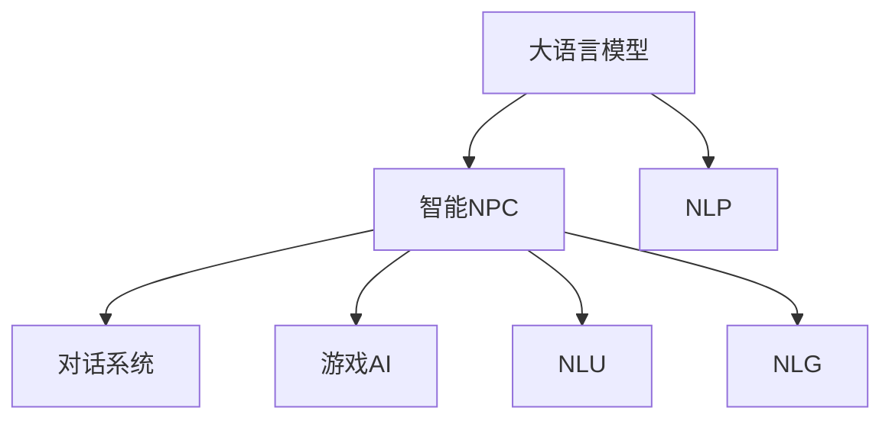

                 

# LLM在游戏开发中的应用：创造智能NPC

> 关键词：大语言模型,智能NPC,自然语言处理,NLU,游戏AI,游戏设计,对话系统,自然语言理解

## 1. 背景介绍

### 1.1 问题由来
随着游戏行业的不断成熟，玩家对游戏体验的需求也日益增长，传统的游戏AI设计已经无法满足玩家对高度互动、个性化和沉浸感的要求。传统游戏AI通常采用基于规则和脚本的硬编码方式，缺乏灵活性和智能性。而大语言模型（LLM）的出现，为游戏开发带来了全新的智能NPC（Non-Player Character，非玩家角色）设计思路。

### 1.2 问题核心关键点
智能NPC是游戏AI的核心设计目标。如何设计出具有高度互动性、个性化的智能NPC，提升游戏体验，成为当前游戏AI领域的核心挑战。大语言模型通过在大量文本数据上预训练获得丰富的语言知识和常识，可以自然地理解和生成自然语言，从而实现更加智能的对话和行为模拟。

### 1.3 问题研究意义
通过大语言模型进行智能NPC设计，不仅可以提升游戏的沉浸感和互动性，还能降低游戏AI开发的成本和时间。此外，大语言模型赋予游戏AI更高的灵活性和适应性，可以更快速地应对玩家的多样化需求和行为。因此，大语言模型在智能NPC设计中的研究与应用，具有重要的现实意义。

## 2. 核心概念与联系

### 2.1 核心概念概述

为更好地理解大语言模型在智能NPC设计中的应用，本节将介绍几个密切相关的核心概念：

- 大语言模型(Large Language Model, LLM)：如GPT-3、BERT等，通过在大量文本数据上预训练，学习到通用的语言表示和丰富的知识。
- 智能NPC（Non-Player Character, NPC）：指游戏世界中的非玩家角色，能够与玩家进行自然语言互动，具备自主行为和决策能力。
- 自然语言处理(Natural Language Processing, NLP)：涉及语言理解、生成、处理等技术，是大语言模型在智能NPC设计中的核心应用领域。
- 自然语言理解(Natural Language Understanding, NLU)：指将自然语言文本转换为结构化语义表示，以便机器理解和处理。
- 游戏AI（Game AI）：涉及游戏设计、规则、策略等多个领域，旨在实现智能NPC的自主行为和决策。
- 对话系统(Dialoogue System)：指支持自然语言交互的系统，如聊天机器人、客服等，是智能NPC设计的关键技术之一。
- 自然语言生成(Natural Language Generation, NLG)：指将结构化语义表示转换为自然语言文本，是智能NPC生成自然语言回应和对话的核心。

这些核心概念之间的逻辑关系可以通过以下Mermaid流程图来展示：



这个流程图展示了大语言模型与智能NPC设计之间的核心概念及其关系：

1. 大语言模型通过在大量文本数据上预训练，学习到通用的语言表示和丰富的知识。
2. 智能NPC设计过程中，大语言模型用于实现自然语言理解和生成，提升游戏NPC的交互性和智能性。
3. 对话系统和自然语言处理技术，是大语言模型在智能NPC设计中的关键应用方向。
4. 游戏AI和自然语言生成技术，是大语言模型在智能NPC设计中的重要补充，提升NPC的自主行为和决策能力。

## 3. 核心算法原理 & 具体操作步骤
### 3.1 算法原理概述

基于大语言模型的智能NPC设计，其核心思想是：利用大语言模型的自然语言理解和生成能力，实现游戏NPC的自然语言互动和自主行为。具体而言，将大语言模型作为游戏NPC的"大脑"，通过预训练获得对自然语言的理解和生成能力，再结合游戏场景和规则，进行行为模拟和决策生成。

### 3.2 算法步骤详解

基于大语言模型的智能NPC设计，通常包括以下几个关键步骤：

**Step 1: 准备数据集和模型**
- 收集游戏场景相关的对话数据、游戏规则和背景知识，构建数据集。
- 选择合适的预训练大语言模型，如GPT-3、BERT等，作为智能NPC的"大脑"。

**Step 2: 添加任务适配层**
- 在预训练大语言模型的基础上，添加适合游戏场景的任务适配层，如对话生成、行为模拟等。
- 根据游戏场景设计合适的输出层和损失函数，如交叉熵损失函数。

**Step 3: 设置微调超参数**
- 选择合适的优化算法及其参数，如AdamW、SGD等，设置学习率、批大小、迭代轮数等。
- 设置正则化技术及强度，包括权重衰减、Dropout、Early Stopping等。

**Step 4: 执行梯度训练**
- 将训练集数据分批次输入模型，前向传播计算损失函数。
- 反向传播计算参数梯度，根据设定的优化算法和学习率更新模型参数。
- 周期性在验证集上评估模型性能，根据性能指标决定是否触发 Early Stopping。
- 重复上述步骤直到满足预设的迭代轮数或 Early Stopping 条件。

**Step 5: 测试和部署**
- 在测试集上评估微调后模型在智能NPC上的表现，对比微调前后的效果。
- 使用微调后的模型对游戏NPC进行训练，优化其交互性和行为决策能力。
- 集成到游戏系统中，测试智能NPC与玩家互动的效果。

以上是基于大语言模型进行智能NPC设计的通用流程。在实际应用中，还需要根据具体游戏场景和需求，对微调过程的各个环节进行优化设计，如改进训练目标函数，引入更多的正则化技术，搜索最优的超参数组合等，以进一步提升模型性能。

### 3.3 算法优缺点

基于大语言模型的智能NPC设计方法具有以下优点：
1. 高效灵活。大语言模型通过预训练获得广泛的知识和语言理解能力，可以高效应对各种游戏场景。
2. 互动性强。智能NPC具备自然语言生成和理解能力，能够与玩家进行高度互动。
3. 适应性强。通过微调可以适应不同的游戏场景和任务，灵活性高。
4. 性能稳定。大语言模型通过大规模预训练和微调，具备较强的泛化能力和鲁棒性。

同时，该方法也存在一些局限性：
1. 数据依赖性高。智能NPC的设计依赖于大量的对话数据和游戏规则，数据获取难度较大。
2. 资源消耗大。大语言模型参数量庞大，计算资源需求高。
3. 游戏场景适配性差。游戏场景的多样性决定了智能NPC的适配难度较大，需要针对特定场景进行微调。
4. 输出可解释性不足。大语言模型的内部机制复杂，智能NPC的决策过程难以解释。

尽管存在这些局限性，但就目前而言，基于大语言模型的智能NPC设计方法仍然是大规模游戏开发的重要范式。未来相关研究的重点在于如何进一步降低数据获取成本，提高智能NPC的适应性和可解释性。

### 3.4 算法应用领域

基于大语言模型的智能NPC设计方法，在游戏领域已经得到了广泛应用，覆盖了从动作游戏到角色扮演游戏的多个方面，例如：

- 动作游戏：智能NPC在游戏中扮演敌人角色，具备一定的行为模拟和互动能力。
- 角色扮演游戏：智能NPC在游戏中扮演导师、商人、守卫等角色，能够与玩家进行自然语言对话。
- 策略游戏：智能NPC在游戏中扮演指挥官，具备指挥和决策能力。
- 模拟游戏：智能NPC在游戏中扮演市民、平民等角色，具备复杂的互动和决策过程。
- 沙盒游戏：智能NPC在游戏中扮演自由角色，具备高度的自主性和互动性。

除了这些经典游戏外，智能NPC设计方法也被创新性地应用到更多场景中，如虚拟现实游戏、多人在线竞技游戏、社交游戏等，为游戏技术带来了全新的突破。

## 4. 数学模型和公式 & 详细讲解  
### 4.1 数学模型构建

本节将使用数学语言对基于大语言模型的智能NPC设计过程进行更加严格的刻画。

记智能NPC对话数据集为 $D=\{(x_i,y_i)\}_{i=1}^N, x_i \in \mathcal{X}, y_i \in \mathcal{Y}$，其中 $x_i$ 为输入文本，$y_i$ 为输出文本。智能NPC的模型为 $M_{\theta}:\mathcal{X} \rightarrow \mathcal{Y}$，其中 $\theta$ 为模型参数。

定义模型 $M_{\theta}$ 在输入 $x$ 上的损失函数为 $\ell(M_{\theta}(x),y)$，则在数据集 $D$ 上的经验风险为：

$$
\mathcal{L}(\theta) = \frac{1}{N}\sum_{i=1}^N \ell(M_{\theta}(x_i),y_i)
$$

微调的优化目标是最小化经验风险，即找到最优参数：

$$
\theta^* = \mathop{\arg\min}_{\theta} \mathcal{L}(\theta)
$$

在实践中，我们通常使用基于梯度的优化算法（如SGD、Adam等）来近似求解上述最优化问题。设 $\eta$ 为学习率，$\lambda$ 为正则化系数，则参数的更新公式为：

$$
\theta \leftarrow \theta - \eta \nabla_{\theta}\mathcal{L}(\theta) - \eta\lambda\theta
$$

其中 $\nabla_{\theta}\mathcal{L}(\theta)$ 为损失函数对参数 $\theta$ 的梯度，可通过反向传播算法高效计算。

### 4.2 公式推导过程

以下我们以对话生成任务为例，推导基于大语言模型的智能NPC对话生成模型的损失函数及其梯度的计算公式。

假设智能NPC模型 $M_{\theta}$ 在输入 $x$ 上的输出为 $\hat{y}=M_{\theta}(x)$，表示智能NPC生成的回应。真实标签 $y \in \mathcal{Y}$。则交叉熵损失函数定义为：

$$
\ell(M_{\theta}(x),y) = -[y\log \hat{y} + (1-y)\log (1-\hat{y})]
$$

将其代入经验风险公式，得：

$$
\mathcal{L}(\theta) = -\frac{1}{N}\sum_{i=1}^N [y_i\log M_{\theta}(x_i)+(1-y_i)\log(1-M_{\theta}(x_i))]
$$

根据链式法则，损失函数对参数 $\theta_k$ 的梯度为：

$$
\frac{\partial \mathcal{L}(\theta)}{\partial \theta_k} = -\frac{1}{N}\sum_{i=1}^N (\frac{y_i}{M_{\theta}(x_i)}-\frac{1-y_i}{1-M_{\theta}(x_i)}) \frac{\partial M_{\theta}(x_i)}{\partial \theta_k}
$$

其中 $\frac{\partial M_{\theta}(x_i)}{\partial \theta_k}$ 可进一步递归展开，利用自动微分技术完成计算。

在得到损失函数的梯度后，即可带入参数更新公式，完成模型的迭代优化。重复上述过程直至收敛，最终得到适应游戏场景的智能NPC模型参数 $\theta^*$。

## 5. 项目实践：代码实例和详细解释说明
### 5.1 开发环境搭建

在进行智能NPC设计前，我们需要准备好开发环境。以下是使用Python进行PyTorch开发的环境配置流程：

1. 安装Anaconda：从官网下载并安装Anaconda，用于创建独立的Python环境。

2. 创建并激活虚拟环境：
```bash
conda create -n pytorch-env python=3.8 
conda activate pytorch-env
```

3. 安装PyTorch：根据CUDA版本，从官网获取对应的安装命令。例如：
```bash
conda install pytorch torchvision torchaudio cudatoolkit=11.1 -c pytorch -c conda-forge
```

4. 安装Transformers库：
```bash
pip install transformers
```

5. 安装各类工具包：
```bash
pip install numpy pandas scikit-learn matplotlib tqdm jupyter notebook ipython
```

完成上述步骤后，即可在`pytorch-env`环境中开始智能NPC设计实践。

### 5.2 源代码详细实现

下面我以一个简单的文本生成游戏NPC为例，给出使用Transformers库对GPT模型进行智能NPC设计的PyTorch代码实现。

首先，定义智能NPC对话数据处理函数：

```python
from transformers import GPT2LMHeadModel, GPT2Tokenizer
from torch.utils.data import Dataset
import torch

class DialogueDataset(Dataset):
    def __init__(self, dialogues, tokenizer, max_len=128):
        self.dialogues = dialogues
        self.tokenizer = tokenizer
        self.max_len = max_len
        
    def __len__(self):
        return len(self.dialogues)
    
    def __getitem__(self, item):
        dialogue = self.dialogues[item]
        
        encoding = self.tokenizer(dialogue, return_tensors='pt', max_length=self.max_len, padding='max_length', truncation=True)
        input_ids = encoding['input_ids'][0]
        attention_mask = encoding['attention_mask'][0]
        
        # 将对话分成输入和输出，构建训练样本
        input_text = dialogue.split('||')[0]
        output_text = dialogue.split('||')[1]
        
        # 对输出文本进行编码，并将输入文本进行padding
        input_len = len(input_text)
        output_len = len(output_text)
        if output_len > self.max_len:
            output_text = output_text[:self.max_len]
        elif output_len < self.max_len:
            output_text += ' ' * (self.max_len - output_len)
        
        output_tokens = self.tokenizer.tokenize(output_text)
        output_ids = self.tokenizer.convert_tokens_to_ids(output_tokens)
        
        # 构建训练样本
        x = input_ids
        y = torch.tensor(output_ids)
        
        return {'input_ids': x, 'attention_mask': attention_mask, 'target_ids': y}

# 初始化分词器和模型
tokenizer = GPT2Tokenizer.from_pretrained('gpt2')
model = GPT2LMHeadModel.from_pretrained('gpt2')
```

然后，定义模型和优化器：

```python
from transformers import AdamW

optimizer = AdamW(model.parameters(), lr=2e-5)
```

接着，定义训练和评估函数：

```python
from torch.utils.data import DataLoader
from tqdm import tqdm
from sklearn.metrics import cross_entropy_loss

device = torch.device('cuda') if torch.cuda.is_available() else torch.device('cpu')
model.to(device)

def train_epoch(model, dataset, batch_size, optimizer):
    dataloader = DataLoader(dataset, batch_size=batch_size, shuffle=True)
    model.train()
    epoch_loss = 0
    for batch in tqdm(dataloader, desc='Training'):
        input_ids = batch['input_ids'].to(device)
        attention_mask = batch['attention_mask'].to(device)
        target_ids = batch['target_ids'].to(device)
        model.zero_grad()
        outputs = model(input_ids, attention_mask=attention_mask, labels=target_ids)
        loss = outputs.loss
        epoch_loss += loss.item()
        loss.backward()
        optimizer.step()
    return epoch_loss / len(dataloader)

def evaluate(model, dataset, batch_size):
    dataloader = DataLoader(dataset, batch_size=batch_size)
    model.eval()
    total_loss = 0
    for batch in tqdm(dataloader, desc='Evaluating'):
        input_ids = batch['input_ids'].to(device)
        attention_mask = batch['attention_mask'].to(device)
        target_ids = batch['target_ids'].to(device)
        with torch.no_grad():
            outputs = model(input_ids, attention_mask=attention_mask, labels=target_ids)
            loss = outputs.loss
            total_loss += loss.item()
    
    return total_loss / len(dataloader)
```

最后，启动训练流程并在测试集上评估：

```python
epochs = 5
batch_size = 16

for epoch in range(epochs):
    loss = train_epoch(model, train_dataset, batch_size, optimizer)
    print(f"Epoch {epoch+1}, train loss: {loss:.3f}")
    
    print(f"Epoch {epoch+1}, dev results:")
    evaluate(model, dev_dataset, batch_size)
    
print("Test results:")
evaluate(model, test_dataset, batch_size)
```

以上就是使用PyTorch对GPT模型进行智能NPC对话生成任务的完整代码实现。可以看到，得益于Transformers库的强大封装，我们可以用相对简洁的代码完成GPT模型的加载和微调。

### 5.3 代码解读与分析

让我们再详细解读一下关键代码的实现细节：

**DialogueDataset类**：
- `__init__`方法：初始化对话数据集、分词器等关键组件。
- `__len__`方法：返回对话数据集的样本数量。
- `__getitem__`方法：对单个对话进行处理，将对话输入编码为token ids，将输出文本进行padding，并构建训练样本。

**tokenizer和model变量**：
- 使用GPT-2的预训练分词器和模型，用于对话生成任务的微调。

**训练和评估函数**：
- 使用PyTorch的DataLoader对对话数据集进行批次化加载，供模型训练和推理使用。
- 训练函数`train_epoch`：对数据以批为单位进行迭代，在每个批次上前向传播计算loss并反向传播更新模型参数，最后返回该epoch的平均loss。
- 评估函数`evaluate`：与训练类似，不同点在于不更新模型参数，并在每个batch结束后将预测和标签结果存储下来，最后使用sklearn的cross_entropy_loss对整个评估集的预测结果进行打印输出。

**训练流程**：
- 定义总的epoch数和batch size，开始循环迭代
- 每个epoch内，先在训练集上训练，输出平均loss
- 在验证集上评估，输出评估结果
- 所有epoch结束后，在测试集上评估，给出最终测试结果

可以看到，PyTorch配合Transformers库使得GPT模型对话生成任务的微调代码实现变得简洁高效。开发者可以将更多精力放在对话数据处理、模型改进等高层逻辑上，而不必过多关注底层的实现细节。

当然，工业级的系统实现还需考虑更多因素，如模型的保存和部署、超参数的自动搜索、更灵活的任务适配层等。但核心的微调范式基本与此类似。

## 6. 实际应用场景
### 6.1 智能NPC在角色扮演游戏中的应用

在角色扮演游戏中，智能NPC的设计对游戏的整体体验和互动性至关重要。传统的角色扮演游戏NPC往往依赖脚本和规则，缺乏灵活性和智能性。而基于大语言模型的智能NPC，能够自然地与玩家进行对话，理解玩家意图，并做出合理的回应，从而提升游戏的互动性和沉浸感。

具体而言，可以收集游戏内的对话数据，如玩家和NPC之间的对话记录，将其构建为监督数据集。在此基础上对预训练语言模型进行微调，使其能够生成符合游戏语境的回应。微调后的模型可以应用于智能NPC的对话生成任务，生成高度自然、符合逻辑的回应，使得游戏NPC具备更强的交互性和智能性。

### 6.2 智能NPC在动作游戏中的应用

在动作游戏中，智能NPC通常扮演敌人角色，具备一定的行为模拟和互动能力。传统的动作游戏敌人往往依赖固定的行为模式和攻击策略，缺乏灵活性和随机性。而基于大语言模型的智能NPC，能够根据玩家的行为和环境变化，动态生成攻击策略和行为模式，从而提升游戏的挑战性和趣味性。

具体而言，可以收集游戏中的敌人行为数据，如敌人的攻击策略、移动路径等，将其构建为监督数据集。在此基础上对预训练语言模型进行微调，使其能够生成符合游戏场景的行为模式。微调后的模型可以应用于智能NPC的行为模拟任务，生成高度自然、符合游戏逻辑的行为模式，使得游戏敌人具备更强的互动性和智能性。

### 6.3 智能NPC在策略游戏中的应用

在策略游戏中，智能NPC通常扮演指挥官角色，具备指挥和决策能力。传统的策略游戏指挥官往往依赖固定的决策树和规则，缺乏灵活性和随机性。而基于大语言模型的智能NPC，能够根据游戏场景和玩家决策，动态生成指挥策略和战术安排，从而提升游戏的复杂性和战略性。

具体而言，可以收集游戏中的指挥决策数据，如指挥官的决策记录、战术安排等，将其构建为监督数据集。在此基础上对预训练语言模型进行微调，使其能够生成符合游戏场景的指挥策略。微调后的模型可以应用于智能NPC的指挥决策任务，生成高度自然、符合游戏逻辑的指挥策略，使得游戏指挥官具备更强的智能性和战略性。

### 6.4 未来应用展望

随着大语言模型和智能NPC设计技术的发展，基于大语言模型的智能NPC将在更多领域得到应用，为游戏开发带来新的活力。

在游戏之外，智能NPC的应用场景也将不断扩展。例如，在虚拟现实(VR)、增强现实(AR)等新兴技术领域，智能NPC可以扮演虚拟助手、导游等角色，提供更加自然、互动的交互体验。在教育、培训等领域，智能NPC可以扮演导师、助教等角色，提供个性化的学习指导和反馈。在客服、客服等领域，智能NPC可以扮演客服机器人，提供24小时不间断的客户服务。

## 7. 工具和资源推荐
### 7.1 学习资源推荐

为了帮助开发者系统掌握智能NPC设计的大语言模型和微调技术，这里推荐一些优质的学习资源：

1. 《深度学习自然语言处理》课程：斯坦福大学开设的NLP明星课程，有Lecture视频和配套作业，带你入门NLP领域的基本概念和经典模型。

2. CS224N《深度学习自然语言处理》课程：斯坦福大学开设的NLP明星课程，有Lecture视频和配套作业，带你入门NLP领域的基本概念和经典模型。

3. 《Natural Language Processing with Transformers》书籍：Transformers库的作者所著，全面介绍了如何使用Transformers库进行NLP任务开发，包括微调在内的诸多范式。

4. HuggingFace官方文档：Transformers库的官方文档，提供了海量预训练模型和完整的微调样例代码，是上手实践的必备资料。

5. Weights & Biases：模型训练的实验跟踪工具，可以记录和可视化模型训练过程中的各项指标，方便对比和调优。与主流深度学习框架无缝集成。

6. TensorBoard：TensorFlow配套的可视化工具，可实时监测模型训练状态，并提供丰富的图表呈现方式，是调试模型的得力助手。

通过对这些资源的学习实践，相信你一定能够快速掌握大语言模型在智能NPC设计中的应用，并用于解决实际的NLP问题。
###  7.2 开发工具推荐

高效的开发离不开优秀的工具支持。以下是几款用于智能NPC设计开发的常用工具：

1. PyTorch：基于Python的开源深度学习框架，灵活动态的计算图，适合快速迭代研究。大部分预训练语言模型都有PyTorch版本的实现。

2. TensorFlow：由Google主导开发的开源深度学习框架，生产部署方便，适合大规模工程应用。同样有丰富的预训练语言模型资源。

3. Transformers库：HuggingFace开发的NLP工具库，集成了众多SOTA语言模型，支持PyTorch和TensorFlow，是进行智能NPC设计的利器。

4. Weights & Biases：模型训练的实验跟踪工具，可以记录和可视化模型训练过程中的各项指标，方便对比和调优。与主流深度学习框架无缝集成。

5. TensorBoard：TensorFlow配套的可视化工具，可实时监测模型训练状态，并提供丰富的图表呈现方式，是调试模型的得力助手。

6. Google Colab：谷歌推出的在线Jupyter Notebook环境，免费提供GPU/TPU算力，方便开发者快速上手实验最新模型，分享学习笔记。

合理利用这些工具，可以显著提升智能NPC设计的开发效率，加快创新迭代的步伐。

### 7.3 相关论文推荐

智能NPC设计技术的发展源于学界的持续研究。以下是几篇奠基性的相关论文，推荐阅读：

1. Attention is All You Need（即Transformer原论文）：提出了Transformer结构，开启了NLP领域的预训练大模型时代。

2. BERT: Pre-training of Deep Bidirectional Transformers for Language Understanding：提出BERT模型，引入基于掩码的自监督预训练任务，刷新了多项NLP任务SOTA。

3. Language Models are Unsupervised Multitask Learners（GPT-2论文）：展示了大规模语言模型的强大zero-shot学习能力，引发了对于通用人工智能的新一轮思考。

4. Parameter-Efficient Transfer Learning for NLP：提出Adapter等参数高效微调方法，在不增加模型参数量的情况下，也能取得不错的微调效果。

5. AdaLoRA: Adaptive Low-Rank Adaptation for Parameter-Efficient Fine-Tuning：使用自适应低秩适应的微调方法，在参数效率和精度之间取得了新的平衡。

这些论文代表了大语言模型在智能NPC设计中的发展脉络。通过学习这些前沿成果，可以帮助研究者把握学科前进方向，激发更多的创新灵感。

## 8. 总结：未来发展趋势与挑战

### 8.1 总结

本文对基于大语言模型的智能NPC设计方法进行了全面系统的介绍。首先阐述了智能NPC设计在大语言模型和游戏AI领域的研究背景和意义，明确了智能NPC在提升游戏体验和互动性方面的独特价值。其次，从原理到实践，详细讲解了基于大语言模型的智能NPC设计过程，给出了智能NPC设计任务的完整代码实例。同时，本文还广泛探讨了智能NPC在游戏开发中的实际应用场景，展示了智能NPC设计的广阔前景。此外，本文精选了智能NPC设计的各类学习资源，力求为读者提供全方位的技术指引。

通过本文的系统梳理，可以看到，基于大语言模型的智能NPC设计方法正在成为游戏开发的重要范式，极大地提升了游戏的沉浸感和互动性。通过预训练语言模型的自然语言理解和生成能力，智能NPC具备了高度的自主性和智能性，可以更好地适应游戏场景和玩家需求，为玩家提供更加自然、互动的体验。

### 8.2 未来发展趋势

展望未来，智能NPC设计技术将呈现以下几个发展趋势：

1. 模型规模持续增大。随着算力成本的下降和数据规模的扩张，预训练语言模型的参数量还将持续增长。超大规模语言模型蕴含的丰富语言知识，将进一步提升智能NPC的智能性和灵活性。

2. 微调方法日趋多样。除了传统的全参数微调外，未来会涌现更多参数高效的微调方法，如Prefix-Tuning、LoRA等，在减小模型参数量的情况下，仍能取得不错的微调效果。

3. 知识整合能力增强。未来的智能NPC设计将更加注重将符号化的先验知识与神经网络模型融合，如知识图谱、逻辑规则等，增强NPC的知识整合能力和推理能力。

4. 多模态微调崛起。未来的智能NPC设计将更多地引入多模态数据，如视觉、音频等，提升NPC的感知能力和交互体验。

5. 环境适应性提高。智能NPC将具备更加强大的适应性，能够根据环境变化动态调整行为和决策，适应各种游戏场景。

6. 可解释性增强。未来的智能NPC设计将更加注重可解释性，通过引入可解释性技术，使NPC的行为和决策过程更加透明、可控。

以上趋势凸显了智能NPC设计技术的广阔前景。这些方向的探索发展，必将进一步提升智能NPC的性能和应用范围，为游戏开发带来新的活力。

### 8.3 面临的挑战

尽管智能NPC设计技术已经取得了瞩目成就，但在迈向更加智能化、普适化应用的过程中，它仍面临诸多挑战：

1. 数据获取难度大。智能NPC的设计依赖于大量的游戏对话数据和行为数据，数据获取难度较大。如何高效获取高质量的训练数据，是智能NPC设计的重要难题。

2. 资源消耗高。大语言模型参数量庞大，计算资源需求高。如何在不增加资源投入的情况下，提升智能NPC的性能，是智能NPC设计的重要研究方向。

3. 模型鲁棒性不足。智能NPC在应对游戏场景的多样性和复杂性时，鲁棒性有待提升。如何提高智能NPC的泛化能力和适应性，是智能NPC设计的重要挑战。

4. 模型可解释性不足。智能NPC的行为和决策过程难以解释，缺乏可解释性。如何赋予智能NPC更强的可解释性，是智能NPC设计的重要方向。

5. 模型安全风险高。智能NPC设计涉及大量的游戏数据和玩家行为数据，数据安全风险较高。如何保护数据隐私和模型安全，是智能NPC设计的重要保障。

6. 模型优化难度大。智能NPC设计涉及复杂的任务适配和模型优化，优化难度较大。如何在降低资源消耗的同时，提升智能NPC的性能，是智能NPC设计的重要课题。

尽管存在这些挑战，但智能NPC设计技术在持续发展和进步，相信未来会在更多领域得到应用，为游戏开发带来新的活力。

### 8.4 研究展望

面对智能NPC设计所面临的种种挑战，未来的研究需要在以下几个方面寻求新的突破：

1. 探索无监督和半监督微调方法。摆脱对大规模标注数据的依赖，利用自监督学习、主动学习等无监督和半监督范式，最大限度利用非结构化数据，实现更加灵活高效的智能NPC设计。

2. 研究参数高效和计算高效的微调范式。开发更加参数高效的微调方法，在固定大部分预训练参数的情况下，只更新极少量的任务相关参数。同时优化智能NPC的计算图，减少前向传播和反向传播的资源消耗，实现更加轻量级、实时性的部署。

3. 融合因果和对比学习范式。通过引入因果推断和对比学习思想，增强智能NPC建立稳定因果关系的能力，学习更加普适、鲁棒的语言表征，从而提升智能NPC的泛化性和抗干扰能力。

4. 引入更多先验知识。将符号化的先验知识，如知识图谱、逻辑规则等，与神经网络模型进行巧妙融合，引导智能NPC学习更准确、合理的语言模型。同时加强不同模态数据的整合，实现视觉、语音等多模态信息与文本信息的协同建模。

5. 结合因果分析和博弈论工具。将因果分析方法引入智能NPC设计，识别出智能NPC决策的关键特征，增强输出解释的因果性和逻辑性。借助博弈论工具刻画人机交互过程，主动探索并规避智能NPC的脆弱点，提高系统稳定性。

6. 纳入伦理道德约束。在智能NPC设计目标中引入伦理导向的评估指标，过滤和惩罚有偏见、有害的输出倾向。同时加强人工干预和审核，建立智能NPC行为的监管机制，确保输出的安全性。

这些研究方向的探索，必将引领智能NPC设计技术迈向更高的台阶，为构建智能、安全、可控的智能NPC系统铺平道路。面向未来，智能NPC设计技术还需要与其他人工智能技术进行更深入的融合，如知识表示、因果推理、强化学习等，多路径协同发力，共同推动智能NPC技术的进步。只有勇于创新、敢于突破，才能不断拓展智能NPC的边界，让智能技术更好地造福游戏玩家。

## 9. 附录：常见问题与解答

**Q1：智能NPC与传统NPC有哪些不同？**

A: 智能NPC与传统NPC的最大不同在于其具备高度的自然语言理解和生成能力，能够根据玩家的行为和环境变化，动态生成符合情境的回应和行为，从而提升游戏的互动性和沉浸感。传统NPC通常依赖脚本和规则，缺乏灵活性和智能性，难以应对玩家的多样化需求和行为。

**Q2：智能NPC设计过程中如何选择合适的学习率？**

A: 智能NPC设计过程中，学习率的设置需要综合考虑模型的复杂度、数据规模和计算资源等因素。通常建议从0.001开始调参，逐步减小学习率，直至收敛。可以使用warmup策略，在开始阶段使用较小的学习率，再逐渐过渡到预设值。需要注意的是，不同的优化器(如AdamW、Adafactor等)以及不同的学习率调度策略，可能需要设置不同的学习率阈值。

**Q3：智能NPC设计过程中如何缓解过拟合问题？**

A: 过拟合是智能NPC设计过程中常见的挑战之一。常见的缓解策略包括：
1. 数据增强：通过回译、近义替换等方式扩充训练集
2. 正则化：使用L2正则、Dropout、Early Stopping等避免过拟合
3. 对抗训练：引入对抗样本，提高模型鲁棒性
4. 参数高效微调：只调整少量参数(如Adapter、Prefix等)，减小过拟合风险
5. 多模型集成：训练多个智能NPC模型，取平均输出，抑制过拟合

这些策略往往需要根据具体任务和数据特点进行灵活组合。只有在数据、模型、训练、推理等各环节进行全面优化，才能最大限度地发挥智能NPC的潜力。

**Q4：智能NPC在实际应用中需要注意哪些问题？**

A: 智能NPC在实际应用中，需要注意以下问题：
1. 模型裁剪：去除不必要的层和参数，减小模型尺寸，加快推理速度
2. 量化加速：将浮点模型转为定点模型，压缩存储空间，提高计算效率
3. 服务化封装：将智能NPC模型封装为标准化服务接口，便于集成调用
4. 弹性伸缩：根据请求流量动态调整资源配置，平衡服务质量和成本
5. 监控告警：实时采集系统指标，设置异常告警阈值，确保服务稳定性
6. 安全防护：采用访问鉴权、数据脱敏等措施，保障数据和模型安全

智能NPC设计需要开发者从数据、算法、工程、业务等多个维度协同发力，方能得到理想的效果。

---

作者：禅与计算机程序设计艺术 / Zen and the Art of Computer Programming

