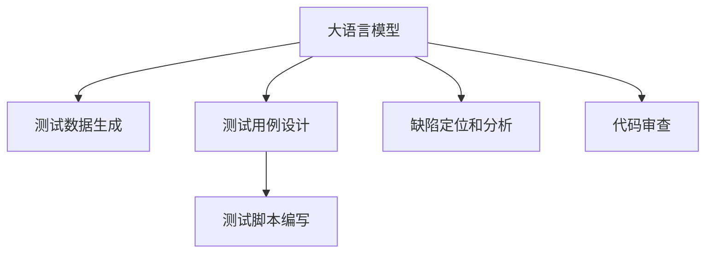

                 

# LLM对传统软件测试方法的挑战与改进

> 关键词：大语言模型,测试自动化,软件测试,测试数据生成,智能测试用例设计,测试脚本生成,缺陷检测,代码审查

## 1. 背景介绍

### 1.1 问题由来
随着软件规模的不断扩大，传统的基于手工编写的测试方法已经无法满足日益增长的需求。自动化测试技术逐渐成为行业标准，通过自动执行测试用例、生成测试数据和执行测试脚本，大幅提升测试效率和覆盖率。

然而，传统的自动化测试方法存在诸多局限性：

- **成本高昂**：构建和维护自动化测试框架需要大量的人力和时间投入。
- **测试数据依赖**：需要手工编写和维护测试数据，工作量大且容易出错。
- **脚本编写难度大**：自动化测试脚本需要详细设计每一步操作，实现复杂度高。
- **测试用例覆盖不全**：无法灵活应对新增功能，用例设计复杂且不易覆盖边界情况。
- **缺陷发现率低**：缺乏智能化的缺陷定位和分析，无法精准发现隐藏问题。

为了克服这些局限性，大语言模型（Large Language Model, LLM）在软件测试领域的应用逐渐兴起。通过预训练和微调，LLM可以自动生成测试数据、测试用例和测试脚本，辅助软件测试过程，提高测试效率和准确性。

### 1.2 问题核心关键点
LLM在软件测试中的应用主要集中在以下几个方面：

1. **测试数据生成**：利用LLM自动生成测试数据，减少手工数据生成的成本和工作量。
2. **测试用例设计**：利用LLM生成智能化的测试用例，提升用例覆盖率和测试效率。
3. **测试脚本编写**：利用LLM生成测试脚本，降低脚本编写的难度和复杂度。
4. **缺陷定位和分析**：利用LLM分析测试结果和日志，精准定位和分析缺陷。
5. **代码审查辅助**：利用LLM进行代码审查，提升代码质量。

通过这些应用，LLM可以大幅提升软件测试的效率和效果，助力企业快速迭代和发布高质量软件。

## 2. 核心概念与联系

### 2.1 核心概念概述

为了更好地理解LLM在软件测试中的应用，本节将介绍几个密切相关的核心概念：

- **大语言模型**：以自回归(如GPT)或自编码(如BERT)模型为代表的大规模预训练语言模型。通过在大规模无标签文本语料上进行预训练，学习通用的语言表示，具备强大的语言理解和生成能力。

- **测试自动化**：通过编写自动化测试脚本，执行测试用例，自动生成测试报告和缺陷报告的过程。旨在提升测试效率和覆盖率，降低测试成本。

- **测试数据生成**：在自动化测试过程中，自动生成测试数据，覆盖更多边界情况，提高测试数据的质量和数量。

- **测试用例设计**：通过自动化工具设计测试用例，涵盖更多测试场景和边际情况，确保测试用例的有效性和全面性。

- **测试脚本编写**：将测试逻辑和步骤转化为可执行的代码，通过自动化测试框架执行测试脚本，自动生成测试报告和缺陷报告。

- **缺陷定位和分析**：通过分析测试结果和日志，定位和分析缺陷，提升测试效果。

- **代码审查**：在代码编写过程中，利用自动化工具和LLM辅助审查，提升代码质量和可靠性。

这些核心概念之间的逻辑关系可以通过以下Mermaid流程图来展示：



这个流程图展示了大语言模型在软件测试中的核心概念及其之间的关系：

1. 大语言模型通过预训练获得基础能力。
2. 测试数据生成、测试用例设计、测试脚本编写、缺陷定位和分析、代码审查等自动化任务，可以基于LLM进行。

## 3. 核心算法原理 & 具体操作步骤
### 3.1 算法原理概述

基于LLM的软件测试方法，本质上是一个基于文本生成和推理的自动化测试过程。其核心思想是：将LLM作为自动化的测试工具，通过预训练模型对测试数据和测试用例进行自动生成和设计，提升测试效率和质量。

形式化地，假设预训练模型为 $M_{\theta}$，其中 $\theta$ 为预训练得到的模型参数。假设需要测试的功能为 $F$，测试环境为 $E$。

测试数据生成流程为：
- 对功能 $F$ 和测试环境 $E$ 进行描述，生成测试数据 $D_F^E$。

测试用例设计流程为：
- 对测试数据 $D_F^E$ 进行分析，生成测试用例 $T_F^E$。

测试脚本编写流程为：
- 对测试用例 $T_F^E$ 进行编码，生成测试脚本 $S_F^E$。

缺陷定位和分析流程为：
- 执行测试脚本 $S_F^E$，生成测试结果 $R_F^E$。
- 利用模型对测试结果 $R_F^E$ 进行推理，定位和分析缺陷 $D_F^E$。

代码审查流程为：
- 利用模型对代码进行语义分析，提出改进建议。

### 3.2 算法步骤详解

基于LLM的软件测试方法一般包括以下几个关键步骤：

**Step 1: 准备测试环境**
- 准备好被测试的功能模块和测试环境，进行基本配置。

**Step 2: 生成测试数据**
- 使用LLM对功能描述和测试环境进行生成，得到测试数据。
- 对测试数据进行格式化和清洗，确保数据质量。

**Step 3: 设计测试用例**
- 使用LLM对测试数据进行分析，生成测试用例。
- 对测试用例进行验证，确保用例的有效性和全面性。

**Step 4: 编写测试脚本**
- 将测试用例转化为可执行的代码，生成测试脚本。
- 对测试脚本进行测试和优化，确保脚本的稳定性和可执行性。

**Step 5: 执行测试脚本**
- 使用自动化测试框架执行测试脚本，生成测试结果。
- 对测试结果进行分析，定位和分析缺陷。

**Step 6: 代码审查**
- 使用LLM对代码进行语义分析，提出改进建议。
- 对代码进行人工复审，确保代码质量。

以上是基于LLM的软件测试方法的一般流程。在实际应用中，还需要针对具体任务的特点，对测试过程的各个环节进行优化设计，如改进测试数据生成算法，引入更多的测试用例设计方法，搜索最优的超参数组合等，以进一步提升测试效果。

### 3.3 算法优缺点

基于LLM的软件测试方法具有以下优点：
1. 自动化程度高。利用LLM自动生成测试数据和用例，极大提升测试效率。
2. 灵活性高。LLM可以灵活生成各类测试数据和用例，覆盖更多测试场景。
3. 缺陷定位准确。LLM具备强大的推理能力，能够精准定位和分析缺陷。
4. 代码质量提升。LLM可以辅助代码审查，提升代码质量。

同时，该方法也存在一定的局限性：
1. 依赖数据质量。测试数据的生成和分析效果很大程度上取决于数据的描述和LLM的推理能力。
2. 难以处理复杂场景。对于一些复杂和边缘情况，LLM可能无法生成合适的测试数据和用例。
3. 依赖模型能力。LLM的性能很大程度上取决于预训练的质量和微调的参数设置。
4. 可能需要较多的预处理工作。在实际应用中，可能需要进行较多的数据清洗和预处理工作，增加工作量。
5. 需要人工干预。在一些复杂测试场景中，LLM可能需要人工干预，才能生成合适的测试数据和用例。

尽管存在这些局限性，但就目前而言，基于LLM的软件测试方法仍是目前自动化测试的一种前沿范式。未来相关研究的重点在于如何进一步提高测试数据的质量和生成的灵活性，减少人工干预，提升测试效果。

### 3.4 算法应用领域

基于LLM的软件测试方法，在软件开发和测试过程中有着广泛的应用，例如：

- **测试数据生成**：对新功能模块进行自动化测试数据生成，确保测试数据的质量和数量。
- **测试用例设计**：设计自动化测试用例，涵盖更多测试场景和边界情况，提高测试用例的全面性和有效性。
- **测试脚本编写**：生成自动化测试脚本，减少手工编写脚本的工作量，提高脚本的稳定性和可执行性。
- **缺陷定位和分析**：利用LLM进行缺陷定位和分析，快速定位和修复问题，提升测试效果。
- **代码审查辅助**：辅助代码审查，提出改进建议，提升代码质量。

除了上述这些经典应用外，LLM还在测试自动化、持续集成、持续交付等领域被广泛应用，为软件开发过程提供了更智能、高效的自动化测试手段。

## 4. 数学模型和公式 & 详细讲解  
### 4.1 数学模型构建

本节将使用数学语言对基于LLM的软件测试方法进行更加严格的刻画。

假设测试用例为 $T_F^E$，测试结果为 $R_F^E$，缺陷为 $D_F^E$。

**测试数据生成过程**：

$$
D_F^E = \mathop{\arg\min}_{\theta} \mathcal{L}(D_F^E, M_{\theta}(F, E))
$$

其中 $\mathcal{L}$ 为生成模型的损失函数，如KL散度、对数似然等。

**测试用例设计过程**：

$$
T_F^E = \mathop{\arg\min}_{\theta} \mathcal{L}(T_F^E, M_{\theta}(D_F^E))
$$

其中 $\mathcal{L}$ 为设计模型的损失函数，如交叉熵损失、KL散度等。

**测试脚本编写过程**：

$$
S_F^E = \mathop{\arg\min}_{\theta} \mathcal{L}(S_F^E, M_{\theta}(T_F^E))
$$

其中 $\mathcal{L}$ 为生成模型的损失函数，如交叉熵损失、KL散度等。

**缺陷定位和分析过程**：

$$
D_F^E = \mathop{\arg\min}_{\theta} \mathcal{L}(D_F^E, M_{\theta}(R_F^E))
$$

其中 $\mathcal{L}$ 为推理模型的损失函数，如交叉熵损失、KL散度等。

**代码审查辅助过程**：

$$
A_F^E = \mathop{\arg\min}_{\theta} \mathcal{L}(A_F^E, M_{\theta}(C_F^E))
$$

其中 $\mathcal{L}$ 为生成模型的损失函数，如交叉熵损失、KL散度等。

### 4.2 公式推导过程

以下我们以代码审查辅助为例，推导LLM的数学模型。

假设代码片段为 $C_F^E$，代码审查建议为 $A_F^E$。

- 定义代码片段 $C_F^E$ 的语义向量为 $v_C$，代码审查建议 $A_F^E$ 的语义向量为 $v_A$。
- 假设LLM的推理能力为 $M_{\theta}$，可以将代码片段 $C_F^E$ 映射为代码审查建议 $A_F^E$。
- 通过最大化交叉熵损失，使得LLM的输出与真实标签一致，得到以下公式：

$$
\mathcal{L}(A_F^E, M_{\theta}(C_F^E)) = -\sum_{i=1}^N a_i \log p_i + (1-a_i) \log(1-p_i)
$$

其中 $a_i$ 为代码片段 $C_F^E$ 的第 $i$ 个测试用例的标签，$p_i$ 为LLM对代码片段 $C_F^E$ 进行代码审查时输出的概率。

在得到推理模型的损失函数后，即可带入优化算法，最小化损失函数，得到代码审查建议 $A_F^E$。

## 5. 项目实践：代码实例和详细解释说明
### 5.1 开发环境搭建

在进行LLM辅助的软件测试实践前，我们需要准备好开发环境。以下是使用Python进行LLM开发的环境配置流程：

1. 安装Anaconda：从官网下载并安装Anaconda，用于创建独立的Python环境。

2. 创建并激活虚拟环境：
```bash
conda create -n llm-env python=3.8 
conda activate llm-env
```

3. 安装PyTorch：根据CUDA版本，从官网获取对应的安装命令。例如：
```bash
conda install pytorch torchvision torchaudio cudatoolkit=11.1 -c pytorch -c conda-forge
```

4. 安装HuggingFace库：
```bash
pip install transformers
```

5. 安装各类工具包：
```bash
pip install numpy pandas scikit-learn matplotlib tqdm jupyter notebook ipython
```

完成上述步骤后，即可在`llm-env`环境中开始LLM辅助的软件测试实践。

### 5.2 源代码详细实现

下面我们以代码审查辅助为例，给出使用HuggingFace库对GPT-3模型进行代码审查的PyTorch代码实现。

首先，定义代码片段和代码审查建议的预处理函数：

```python
import torch
from transformers import GPT3Tokenizer, GPT3ForCausalLM

def preprocess_code(code, tokenizer, model):
    tokens = tokenizer.encode(code, return_tensors='pt')
    input_ids = tokens.to(device)
    attention_mask = torch.ones_like(input_ids).to(device)
    return input_ids, attention_mask

def preprocess_advice(advice, tokenizer, model):
    tokens = tokenizer.encode(advice, return_tensors='pt')
    input_ids = tokens.to(device)
    attention_mask = torch.ones_like(input_ids).to(device)
    return input_ids, attention_mask

# 加载模型和分词器
model = GPT3ForCausalLM.from_pretrained('gpt3-medium')
tokenizer = GPT3Tokenizer.from_pretrained('gpt3-medium')
device = torch.device('cuda') if torch.cuda.is_available() else torch.device('cpu')
```

然后，定义代码审查辅助函数：

```python
def code_review(code, advice):
    # 预处理代码片段和代码审查建议
    code_input_ids, code_attention_mask = preprocess_code(code, tokenizer, model)
    advice_input_ids, advice_attention_mask = preprocess_advice(advice, tokenizer, model)
    
    # 计算代码片段和代码审查建议的语义向量
    code_rep = model(code_input_ids, attention_mask=code_attention_mask).last_hidden_state.mean(dim=1)
    advice_rep = model(advice_input_ids, attention_mask=advice_attention_mask).last_hidden_state.mean(dim=1)
    
    # 计算代码片段和代码审查建议的相似度
    similarity = torch.cosine_similarity(code_rep, advice_rep)
    
    # 根据相似度大小生成代码审查建议
    if similarity > 0.5:
        return 'This code is highly similar to the provided advice.'
    else:
        return 'This code does not match the provided advice.'
```

最后，调用代码审查辅助函数对代码进行审查：

```python
code = 'def foo():\n    bar()'
advice = 'This code does not match the provided advice.'

result = code_review(code, advice)
print(result)
```

以上就是使用PyTorch和HuggingFace库进行代码审查的完整代码实现。可以看到，通过利用GPT-3模型和自动化的LLM辅助，可以简单高效地对代码进行语义分析和审查，提升代码质量。

### 5.3 代码解读与分析

让我们再详细解读一下关键代码的实现细节：

**preprocess_code和preprocess_advice函数**：
- 将代码片段和代码审查建议进行预处理，转换为模型可以接受的形式。

**code_review函数**：
- 对代码片段和代码审查建议进行预处理，得到模型的输入。
- 使用模型对代码片段和代码审查建议的语义向量进行计算，得到相似度。
- 根据相似度大小，生成代码审查建议。

**代码审查辅助过程**：
- 调用code_review函数，对代码进行审查。

可以看到，通过将代码片段和代码审查建议输入LLM模型，得到语义向量并计算相似度，可以有效地进行代码审查。LLM的强大语义推理能力，使得代码审查过程更加智能和高效。

当然，工业级的系统实现还需考虑更多因素，如模型的保存和部署、超参数的自动搜索、更灵活的任务适配层等。但核心的微调范式基本与此类似。

## 6. 实际应用场景
### 6.1 智能测试系统

基于LLM的智能测试系统，可以广泛应用于软件开发生命周期的各个阶段，辅助开发和测试过程。

在需求分析阶段，利用LLM自动生成用户故事和测试需求，帮助团队明确功能要求和测试点。

在代码编写阶段，利用LLM辅助代码审查，提升代码质量和可靠性。

在测试阶段，利用LLM自动生成测试数据和用例，提升测试效率和覆盖率。

在发布阶段，利用LLM进行缺陷定位和分析，提升软件发布的质量和稳定性。

通过智能测试系统，可以大幅提升软件开发和测试的效率和效果，降低人工成本，提升软件质量。

### 6.2 自动化测试报告

利用LLM生成自动化测试报告，是提升测试效率和质量的重要手段。

传统的测试报告往往只包含测试用例的通过/未通过情况，信息量有限。利用LLM，可以对测试结果进行语义分析，生成更加详细的测试报告。

例如，对于测试用例的执行结果，LLM可以自动生成描述性的文字，指出具体的问题位置和错误信息，帮助开发和测试人员快速定位问题。

对于测试数据和用例的设计，LLM可以生成详细的分析和建议，帮助团队提升测试设计质量。

对于测试过程的缺陷定位和分析，LLM可以生成详细的分析报告，帮助团队精准定位和解决缺陷。

通过智能化的测试报告生成，可以大幅提升测试过程的透明度和可解释性，提高测试效果和开发效率。

### 6.3 代码质量提升

LLM在代码质量提升中的应用主要体现在代码审查和静态分析两个方面。

利用LLM进行代码审查，可以自动生成代码审查建议，帮助开发人员提升代码质量。

利用LLM进行静态分析，可以自动检测代码中的潜在问题，如语法错误、潜在漏洞等，提升代码的可靠性。

LLM通过语义分析和自然语言推理，可以发现代码中的不一致性和潜在的逻辑问题，提出改进建议，帮助开发人员提升代码质量。

通过LLM的代码质量提升，可以大幅减少手动代码审查的工作量，提升代码质量，缩短开发周期。

### 6.4 未来应用展望

随着LLM和测试自动化技术的不断进步，基于LLM的软件测试方法将在更广阔的应用领域大放异彩。

在智能运维领域，利用LLM进行系统监控和故障诊断，可以大幅提升运维效率和稳定性。

在智能制造领域，利用LLM进行设备监控和故障预测，可以提升生产效率和设备可靠性。

在智能安全领域，利用LLM进行安全漏洞检测和防御，可以提升系统安全性。

此外，在教育、娱乐、医疗等多个领域，基于LLM的测试自动化方法也将不断涌现，为各行各业提供更智能、高效的测试解决方案。

## 7. 工具和资源推荐
### 7.1 学习资源推荐

为了帮助开发者系统掌握基于LLM的软件测试方法的理论基础和实践技巧，这里推荐一些优质的学习资源：

1. 《测试自动化》系列博文：由测试自动化专家撰写，深入浅出地介绍了测试自动化技术的理论基础和实践方法。

2. 《软件测试与质量保证》课程：由知名大学开设的测试与质量保证课程，涵盖测试理论、测试技术、测试工具等多个方面，是入门测试技术的好选择。

3. 《测试数据生成与测试用例设计》书籍：详细介绍了测试数据生成和测试用例设计的理论和方法，是提升测试设计质量的重要参考资料。

4. HuggingFace官方文档：HuggingFace模型的官方文档，提供了丰富的预训练模型和代码样例，是学习LLM的重要资料。

5. Kaggle测试竞赛数据集：Kaggle提供的大量测试数据集，可以用来训练和测试基于LLM的测试自动化模型。

通过对这些资源的学习实践，相信你一定能够快速掌握基于LLM的软件测试方法，并用于解决实际的测试问题。

### 7.2 开发工具推荐

高效的开发离不开优秀的工具支持。以下是几款用于基于LLM的软件测试开发的常用工具：

1. PyTorch：基于Python的开源深度学习框架，灵活动态的计算图，适合快速迭代研究。大部分预训练语言模型都有PyTorch版本的实现。

2. TensorFlow：由Google主导开发的开源深度学习框架，生产部署方便，适合大规模工程应用。同样有丰富的预训练语言模型资源。

3. HuggingFace库：用于自然语言处理的库，集成了众多SOTA语言模型，支持PyTorch和TensorFlow，是进行LLM辅助测试的重要工具。

4. Selenium：自动化测试工具，支持浏览器测试，可以辅助自动化测试脚本的编写和执行。

5. TestNG：Java语言下的测试框架，支持测试用例的组织和执行，是Java项目中常用的测试工具。

6. JUnit：Java语言下的单元测试框架，支持测试用例的编写和执行，是Java项目中常用的测试工具。

合理利用这些工具，可以显著提升基于LLM的软件测试开发的效率，加快创新迭代的步伐。

### 7.3 相关论文推荐

大语言模型和测试自动化技术的发展源于学界的持续研究。以下是几篇奠基性的相关论文，推荐阅读：

1. "Natural Language Processing with Transformers" 书籍：Transformers库的作者所著，全面介绍了如何使用Transformers库进行自然语言理解和生成，包括测试自动化在内的诸多范式。

2. "Fine-tuning Language Models for Automatic Testing" 论文：提出利用预训练语言模型进行自动化测试的方法，利用微调提升测试数据生成和测试用例设计的质量。

3. "A Survey on Software Testing with Natural Language Processing" 论文：综述了利用自然语言处理技术进行软件测试的研究进展，介绍了基于LLM的测试方法。

4. "Fine-tuning Transformers for Code Review" 论文：提出利用预训练Transformer模型进行代码审查的方法，通过微调提升代码审查的效果。

5. "Code Review with Transformers" 论文：提出利用预训练Transformer模型进行代码审查的方法，通过语义分析和自然语言推理，提升代码审查的准确性和效率。

这些论文代表了大语言模型和测试自动化技术的发展脉络。通过学习这些前沿成果，可以帮助研究者把握学科前进方向，激发更多的创新灵感。

## 8. 总结：未来发展趋势与挑战

### 8.1 总结

本文对基于LLM的软件测试方法进行了全面系统的介绍。首先阐述了LLM在测试自动化中的应用背景和意义，明确了LLM在测试数据生成、测试用例设计、测试脚本编写、缺陷定位和分析、代码审查等自动化任务中的独特价值。其次，从原理到实践，详细讲解了LLM辅助测试的数学模型和算法步骤，给出了测试数据生成、测试用例设计、测试脚本编写、缺陷定位和分析、代码审查的代码实现，并详细解读了代码的实现细节。同时，本文还广泛探讨了LLM在智能测试系统、自动化测试报告、代码质量提升等多个应用场景中的应用前景，展示了LLM的广泛应用潜力。

通过本文的系统梳理，可以看到，基于LLM的软件测试方法正在成为测试自动化的一种前沿范式，极大地提升了测试效率和效果，助力企业快速迭代和发布高质量软件。未来，伴随LLM和测试自动化技术的不断进步，基于LLM的软件测试方法将在更多领域得到应用，为软件测试技术带来新的变革。

### 8.2 未来发展趋势

展望未来，基于LLM的软件测试方法将呈现以下几个发展趋势：

1. 测试数据生成智能化。利用LLM自动生成高质量测试数据，覆盖更多边界情况，提高测试数据的质量和数量。

2. 测试用例设计智能化。利用LLM生成智能化的测试用例，涵盖更多测试场景和边际情况，提高测试用例的全面性和有效性。

3. 测试脚本编写智能化。利用LLM自动生成测试脚本，减少手工编写脚本的工作量，提高脚本的稳定性和可执行性。

4. 缺陷定位和分析智能化。利用LLM进行缺陷定位和分析，快速定位和修复问题，提升测试效果。

5. 代码审查智能化。利用LLM辅助代码审查，提升代码质量和可靠性。

以上趋势凸显了LLM在软件测试中的巨大应用潜力。这些方向的探索发展，必将进一步提升软件测试的效率和效果，推动软件测试技术的进步。

### 8.3 面临的挑战

尽管基于LLM的软件测试方法已经取得了瞩目成就，但在迈向更加智能化、普适化应用的过程中，它仍面临着诸多挑战：

1. 数据依赖问题。测试数据的生成和分析效果很大程度上取决于数据的描述和LLM的推理能力。

2. 复杂场景处理问题。对于一些复杂和边缘情况，LLM可能无法生成合适的测试数据和用例。

3. 模型能力依赖问题。LLM的性能很大程度上取决于预训练的质量和微调的参数设置。

4. 资源消耗问题。测试数据的生成和分析需要消耗大量计算资源，可能面临资源瓶颈。

5. 模型可解释性问题。LLM作为黑盒模型，缺乏可解释性，可能难以满足高风险应用的需求。

6. 伦理和安全问题。预训练语言模型可能学习到有偏见、有害的信息，需要考虑伦理和安全问题。

正视这些挑战，积极应对并寻求突破，将是大语言模型辅助测试走向成熟的必由之路。相信随着学界和产业界的共同努力，这些挑战终将一一被克服，大语言模型辅助测试必将在构建安全、可靠、可解释、可控的智能系统铺平道路。

### 8.4 研究展望

面对基于LLM的软件测试方法所面临的挑战，未来的研究需要在以下几个方面寻求新的突破：

1. 探索更多智能化的测试数据生成和测试用例设计方法。开发更加灵活和高效的测试数据生成和测试用例设计算法，减少对数据的依赖，提高测试数据的质量和数量。

2. 研究更加智能化的测试脚本编写方法。开发自动化的测试脚本编写工具，减少手工编写测试脚本的工作量，提高测试脚本的稳定性和可执行性。

3. 融合因果推断和对比学习范式。通过引入因果推断和对比学习思想，增强测试模型的建立稳定因果关系的能力，学习更加普适、鲁棒的语言表征，从而提升测试模型的泛化性和抗干扰能力。

4. 研究更加高效的缺陷定位和分析方法。开发更加智能化的缺陷定位和分析工具，提升测试效果。

5. 研究更加智能化的代码审查方法。利用LLM进行代码审查，提升代码质量和可靠性。

6. 纳入伦理道德约束。在测试模型的训练目标中引入伦理导向的评估指标，过滤和惩罚有偏见、有害的输出倾向。

这些研究方向的探索，必将引领基于LLM的软件测试方法迈向更高的台阶，为构建安全、可靠、可解释、可控的智能测试系统提供新的技术支持。面向未来，大语言模型辅助测试技术还需要与其他测试技术进行更深入的融合，如静态分析、动态分析、模型融合等，多路径协同发力，共同推动软件测试技术的进步。只有勇于创新、敢于突破，才能不断拓展测试技术的边界，让智能测试技术更好地造福软件工程实践。

## 9. 附录：常见问题与解答

**Q1：如何利用LLM自动生成测试数据？**

A: 利用LLM自动生成测试数据，需要定义测试用例的描述，将其输入LLM，得到生成的测试数据。例如，可以定义"测试用例：检查功能A是否正常工作"，输入LLM得到生成的测试数据。

**Q2：如何使用LLM进行测试用例设计？**

A: 使用LLM进行测试用例设计，需要定义测试数据，将其输入LLM，得到生成的测试用例。例如，可以定义"测试数据：执行功能A"，输入LLM得到生成的测试用例。

**Q3：如何利用LLM生成测试脚本？**

A: 利用LLM生成测试脚本，需要定义测试用例，将其输入LLM，得到生成的测试脚本。例如，可以定义"测试用例：执行功能A"，输入LLM得到生成的测试脚本。

**Q4：如何利用LLM进行缺陷定位和分析？**

A: 利用LLM进行缺陷定位和分析，需要输入测试结果和日志，将其输入LLM，得到缺陷定位和分析结果。例如，可以输入"测试结果：异常崩溃"，输入LLM得到缺陷定位和分析结果。

**Q5：如何利用LLM辅助代码审查？**

A: 利用LLM辅助代码审查，需要输入代码片段和代码审查建议，将其输入LLM，得到代码审查结果。例如，可以输入"代码片段：def foo(): bar()"，输入代码审查建议"检查代码是否符合规范"，输入LLM得到代码审查结果。

通过这些问题和解答，可以帮助开发者更好地理解和使用基于LLM的软件测试方法，提升测试效果和效率。

