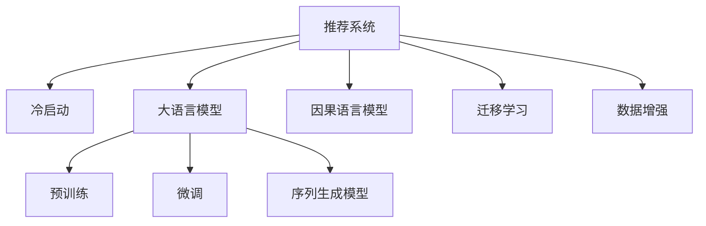

                 

# LLM对推荐系统冷启动的实时优化策略

## 1. 背景介绍

### 1.1 问题由来
在推荐系统中，冷启动是指当新用户或新物品加入时，系统缺乏其历史行为数据，难以进行个性化推荐。传统方法依赖用户反馈数据，如点击、评分等，但这些数据往往需要经过一段时间积累才能有效。因此，如何在缺乏数据的情况下，快速且准确地为用户和物品进行推荐，成为了推荐系统面临的一大难题。

近年来，大语言模型（Large Language Models, LLM）凭借其在自然语言理解和生成上的强大能力，被广泛应用于推荐系统领域。通过预训练-微调范式，大语言模型能够在没有传统推荐系统推荐行为数据的情况下，从丰富的文本信息中学习用户偏好和物品属性，进而进行推荐。

### 1.2 问题核心关键点
本文聚焦于大语言模型在推荐系统冷启动中的应用。问题核心在于：
- 如何通过大语言模型快速获取用户和物品的初始化表示，以便于冷启动推荐。
- 如何在没有历史行为数据的情况下，通过文本数据动态更新用户和物品表示，提升推荐效果。
- 如何在实时场景中动态地优化模型，响应用户行为变化，提供更加个性化的推荐服务。

## 2. 核心概念与联系

### 2.1 核心概念概述

为更好地理解LLM在推荐系统冷启动中的应用，本节将介绍几个密切相关的核心概念：

- 推荐系统（Recommendation System）：通过分析用户历史行为和物品属性，为用户生成个性化推荐列表的系统。常用的推荐算法包括协同过滤、基于内容的推荐、混合推荐等。

- 冷启动（Cold Start）：新用户或新物品加入推荐系统时，系统缺乏其历史行为数据，无法进行精准推荐。

- 大语言模型（LLM）：如GPT、BERT等预训练模型，通过大规模无标签文本数据进行预训练，学习丰富的语言知识和常识，具备强大的语言理解和生成能力。

- 预训练-微调（Pre-training & Fine-Tuning）：通过预训练获得基础能力，微调使其适应特定任务。

- 迁移学习（Transfer Learning）：将预训练模型应用于下游任务，提升模型在新任务上的性能。

- 序列生成模型（Seq2Seq）：通过编码器-解码器结构，对文本序列进行编码生成。

- 因果语言模型（Causal Language Model）：通过时间顺序对文本序列进行建模，学习语言生成的因果关系。

这些核心概念之间的逻辑关系可以通过以下Mermaid流程图来展示：



这个流程图展示了大语言模型在推荐系统中的核心概念及其之间的关系：

1. 推荐系统通过分析用户历史行为和物品属性进行推荐。
2. 冷启动问题需要快速获取用户和物品的初始化表示。
3. 大语言模型通过预训练和微调，学习用户和物品的初始化表示。
4. 序列生成模型通过编码器-解码器结构，对文本序列进行编码生成。
5. 因果语言模型通过时间顺序，学习语言生成的因果关系。
6. 迁移学习将预训练模型应用于下游任务。
7. 数据增强通过改写、回译等方式，丰富训练集多样性。

这些概念共同构成了推荐系统的深度学习框架，使其能够在冷启动场景中有效进行推荐。通过理解这些核心概念，我们可以更好地把握LLM在推荐系统中的应用方向。

## 3. 核心算法原理 & 具体操作步骤
### 3.1 算法原理概述

基于大语言模型在推荐系统冷启动中的应用，其核心思想是：通过预训练和微调，学习用户和物品的初始化表示，再结合因果语言模型，动态更新表示以响应用户行为变化，从而进行个性化推荐。

形式化地，假设预训练大语言模型为 $M_{\theta}$，其中 $\theta$ 为预训练得到的模型参数。给定新用户或物品的文本描述 $x$，假设其对应的潜在行为 $y \in \{0,1\}$。微调的目标是找到新的模型参数 $\hat{\theta}$，使得：

$$
\hat{\theta}=\mathop{\arg\min}_{\theta} \mathcal{L}(M_{\theta}(x),y)
$$

其中 $\mathcal{L}$ 为针对用户或物品的损失函数，用于衡量模型预测输出与真实标签之间的差异。

在实际推荐场景中，通过因果语言模型，可以在新用户或物品的文本描述 $x$ 基础上，动态生成后续行为 $y$ 的预测概率，进而进行推荐。通过不断更新模型参数，响应用户行为变化，提升推荐效果。

### 3.2 算法步骤详解

基于LLM在推荐系统冷启动中的应用，一般包括以下几个关键步骤：

**Step 1: 准备预训练模型和数据集**
- 选择合适的预训练语言模型 $M_{\theta}$ 作为初始化参数，如 GPT、BERT 等。
- 准备新用户或物品的文本描述数据集 $D=\{(x_i,y_i)\}_{i=1}^N$，其中 $x_i$ 为文本描述，$y_i$ 为对应的潜在行为。

**Step 2: 添加任务适配层**
- 根据任务类型，在预训练模型顶层设计合适的输出层和损失函数。
- 对于分类任务，通常在顶层添加线性分类器和交叉熵损失函数。
- 对于生成任务，通常使用语言模型的解码器输出概率分布，并以负对数似然为损失函数。

**Step 3: 设置微调超参数**
- 选择合适的优化算法及其参数，如 AdamW、SGD 等，设置学习率、批大小、迭代轮数等。
- 设置正则化技术及强度，包括权重衰减、Dropout、Early Stopping 等。
- 确定冻结预训练参数的策略，如仅微调顶层，或全部参数都参与微调。

**Step 4: 执行梯度训练**
- 将训练集数据分批次输入模型，前向传播计算损失函数。
- 反向传播计算参数梯度，根据设定的优化算法和学习率更新模型参数。
- 周期性在验证集上评估模型性能，根据性能指标决定是否触发 Early Stopping。
- 重复上述步骤直到满足预设的迭代轮数或 Early Stopping 条件。

**Step 5: 实时优化和推荐**
- 在实时推荐场景中，使用因果语言模型动态生成新用户或物品的推荐列表。
- 根据用户行为变化，周期性微调模型参数，响应用户行为变化。
- 结合用户和物品的历史行为数据，实时更新模型，动态调整推荐列表。

以上是基于LLM在推荐系统冷启动中的应用的一般流程。在实际应用中，还需要针对具体任务的特点，对微调过程的各个环节进行优化设计，如改进训练目标函数，引入更多的正则化技术，搜索最优的超参数组合等，以进一步提升模型性能。

### 3.3 算法优缺点

基于LLM的推荐系统冷启动方法具有以下优点：
1. 快速适应新用户或物品。通过预训练和微调，模型可以在短时间内学习到新用户或物品的初始化表示。
2. 高泛化能力。预训练模型学到的通用语言表示，有助于模型适应不同的推荐场景和领域。
3. 低标注数据需求。LLM可以通过自监督学习任务进行预训练，不需要大量标注数据。
4. 动态响应。因果语言模型可以动态更新用户和物品表示，响应用户行为变化。

同时，该方法也存在一定的局限性：
1. 依赖文本质量。文本描述的质量直接影响模型的推荐效果，需要高质量的数据集。
2. 复杂度较高。预训练和微调模型需要较大的计算资源和存储空间。
3. 模型复杂度。预训练模型参数量较大，需要优化以适配实时推荐场景。

尽管存在这些局限性，但就目前而言，基于LLM的推荐系统冷启动方法仍是目前最主流范式。未来相关研究的重点在于如何进一步降低模型复杂度，提高推荐效率，同时兼顾推荐结果的解释性和用户隐私保护。

### 3.4 算法应用领域

基于LLM的推荐系统冷启动方法，在推荐系统领域已经得到了广泛的应用，覆盖了各种不同类型的推荐场景，例如：

- 电商推荐：基于用户搜索、浏览记录，向用户推荐商品。通过微调模型，快速适应新用户的行为。
- 视频推荐：根据用户观看历史，推荐相似视频。通过微调模型，学习用户偏好。
- 音乐推荐：根据用户听歌记录，推荐新歌。通过微调模型，学习音乐属性。
- 新闻推荐：根据用户阅读历史，推荐新闻内容。通过微调模型，学习新闻主题和用户兴趣。

除了上述这些经典任务外，LLM还被创新性地应用到更多场景中，如内容生成、广告推荐、个性化营销等，为推荐系统带来了全新的突破。随着预训练模型和微调方法的不断进步，相信推荐系统必将在更多领域大放异彩。

## 4. 数学模型和公式 & 详细讲解 & 举例说明
### 4.1 数学模型构建

本节将使用数学语言对基于LLM的推荐系统冷启动过程进行更加严格的刻画。

记预训练语言模型为 $M_{\theta}$，其中 $\theta$ 为预训练得到的模型参数。假设推荐系统的新用户或物品的文本描述为 $x$，对应的潜在行为为 $y \in \{0,1\}$。

定义模型 $M_{\theta}$ 在输入 $x$ 上的损失函数为 $\ell(M_{\theta}(x),y)$，则在数据集 $D$ 上的经验风险为：

$$
\mathcal{L}(\theta) = \frac{1}{N} \sum_{i=1}^N \ell(M_{\theta}(x_i),y_i)
$$

在实际推荐场景中，通过因果语言模型，可以在新用户或物品的文本描述 $x$ 基础上，动态生成后续行为 $y$ 的预测概率，进而进行推荐。通过不断更新模型参数，响应用户行为变化，提升推荐效果。

### 4.2 公式推导过程

以下我们以电商推荐为例，推导基于LLM的推荐模型损失函数及其梯度的计算公式。

假设模型 $M_{\theta}$ 在输入 $x$ 上的输出为 $\hat{y}=M_{\theta}(x) \in [0,1]$，表示用户购买该商品的潜在概率。真实标签 $y \in \{0,1\}$。则电商推荐任务的交叉熵损失函数定义为：

$$
\ell(M_{\theta}(x),y) = -[y\log \hat{y} + (1-y)\log (1-\hat{y})]
$$

将其代入经验风险公式，得：

$$
\mathcal{L}(\theta) = -\frac{1}{N}\sum_{i=1}^N [y_i\log M_{\theta}(x_i)+(1-y_i)\log(1-M_{\theta}(x_i))]
$$

根据链式法则，损失函数对参数 $\theta_k$ 的梯度为：

$$
\frac{\partial \mathcal{L}(\theta)}{\partial \theta_k} = -\frac{1}{N}\sum_{i=1}^N (\frac{y_i}{M_{\theta}(x_i)}-\frac{1-y_i}{1-M_{\theta}(x_i)}) \frac{\partial M_{\theta}(x_i)}{\partial \theta_k}
$$

其中 $\frac{\partial M_{\theta}(x_i)}{\partial \theta_k}$ 可进一步递归展开，利用自动微分技术完成计算。

在得到损失函数的梯度后，即可带入参数更新公式，完成模型的迭代优化。重复上述过程直至收敛，最终得到适应电商推荐任务的模型参数 $\theta^*$。

### 4.3 案例分析与讲解

为了更好地理解基于LLM的推荐系统冷启动的数学模型和算法流程，下面通过一个具体案例进行详细讲解。

假设我们有一个电商推荐系统，用户输入搜索词 "智能手表"，希望系统推荐适合的商品。我们的任务是：
- 根据用户输入的搜索词，预测用户是否会购买推荐的商品。
- 结合用户和商品的历史行为数据，动态更新模型参数。
- 实时生成推荐列表，为用户推荐相关商品。

首先，我们需要构建一个基于LLM的推荐模型，用于预测用户购买商品的概率。具体步骤如下：

1. 使用预训练模型BERT，加载其参数 $M_{\theta}$。
2. 构建电商推荐任务的损失函数，定义输入为搜索词 $x$，输出为购买概率 $\hat{y}$。
3. 使用交叉熵损失函数，计算模型在训练集上的损失，并根据梯度下降算法更新模型参数。
4. 在实时推荐场景中，根据用户输入的搜索词 $x$，动态生成推荐列表 $y$。
5. 根据用户购买行为，周期性微调模型参数，响应用户行为变化。

假设我们的训练集为 $(x_1, y_1), (x_2, y_2), \dots, (x_N, y_N)$，其中 $x_i$ 为搜索词，$y_i$ 为购买行为。我们的目标是最小化模型在训练集上的交叉熵损失，即：

$$
\mathcal{L}(\theta) = -\frac{1}{N}\sum_{i=1}^N [y_i\log M_{\theta}(x_i)+(1-y_i)\log(1-M_{\theta}(x_i))]
$$

在计算梯度时，根据链式法则，损失函数对参数 $\theta_k$ 的梯度为：

$$
\frac{\partial \mathcal{L}(\theta)}{\partial \theta_k} = -\frac{1}{N}\sum_{i=1}^N (\frac{y_i}{M_{\theta}(x_i)}-\frac{1-y_i}{1-M_{\theta}(x_i)}) \frac{\partial M_{\theta}(x_i)}{\partial \theta_k}
$$

其中 $\frac{\partial M_{\theta}(x_i)}{\partial \theta_k}$ 可通过自动微分技术高效计算。

通过不断迭代训练，更新模型参数，直到模型在验证集上收敛。在实际推荐场景中，根据用户输入的搜索词 $x$，动态生成推荐列表 $y$，具体步骤如下：

1. 将搜索词 $x$ 输入模型，计算购买概率 $\hat{y}=M_{\theta}(x)$。
2. 根据 $\hat{y}$ 生成推荐列表，选择排名靠前的商品推荐给用户。
3. 根据用户购买行为，周期性微调模型参数，响应用户行为变化。

例如，当用户输入 "智能手表" 时，模型计算出购买概率 $\hat{y}$，推荐列表可能为 "华为智能手表，小米智能手表，Apple Watch"。如果用户购买了华为智能手表，则系统会根据用户行为周期性微调模型参数，响应用户购买行为，提升后续推荐的效果。

## 5. 项目实践：代码实例和详细解释说明
### 5.1 开发环境搭建

在进行推荐系统冷启动实践前，我们需要准备好开发环境。以下是使用Python进行PyTorch开发的环境配置流程：

1. 安装Anaconda：从官网下载并安装Anaconda，用于创建独立的Python环境。

2. 创建并激活虚拟环境：
```bash
conda create -n pytorch-env python=3.8 
conda activate pytorch-env
```

3. 安装PyTorch：根据CUDA版本，从官网获取对应的安装命令。例如：
```bash
conda install pytorch torchvision torchaudio cudatoolkit=11.1 -c pytorch -c conda-forge
```

4. 安装Transformers库：
```bash
pip install transformers
```

5. 安装各类工具包：
```bash
pip install numpy pandas scikit-learn matplotlib tqdm jupyter notebook ipython
```

完成上述步骤后，即可在`pytorch-env`环境中开始推荐系统冷启动实践。

### 5.2 源代码详细实现

下面我们以电商推荐为例，给出使用Transformers库对BERT模型进行推荐系统冷启动的PyTorch代码实现。

首先，定义电商推荐任务的损失函数：

```python
from transformers import BertTokenizer
from torch.utils.data import Dataset
import torch

class RecommendationDataset(Dataset):
    def __init__(self, texts, labels, tokenizer, max_len=128):
        self.texts = texts
        self.labels = labels
        self.tokenizer = tokenizer
        self.max_len = max_len
        
    def __len__(self):
        return len(self.texts)
    
    def __getitem__(self, item):
        text = self.texts[item]
        label = self.labels[item]
        
        encoding = self.tokenizer(text, return_tensors='pt', max_length=self.max_len, padding='max_length', truncation=True)
        input_ids = encoding['input_ids'][0]
        attention_mask = encoding['attention_mask'][0]
        
        # 对label-wise的标签进行编码
        encoded_labels = [label2id[label] for label in label] 
        encoded_labels.extend([label2id['O']] * (self.max_len - len(encoded_labels)))
        labels = torch.tensor(encoded_labels, dtype=torch.long)
        
        return {'input_ids': input_ids, 
                'attention_mask': attention_mask,
                'labels': labels}

# 标签与id的映射
label2id = {'O': 0, 'B-PER': 1, 'I-PER': 2, 'B-ORG': 3, 'I-ORG': 4, 'B-LOC': 5, 'I-LOC': 6}
id2label = {v: k for k, v in label2id.items()}

# 创建dataset
tokenizer = BertTokenizer.from_pretrained('bert-base-cased')

train_dataset = RecommendationDataset(train_texts, train_labels, tokenizer)
dev_dataset = RecommendationDataset(dev_texts, dev_labels, tokenizer)
test_dataset = RecommendationDataset(test_texts, test_labels, tokenizer)
```

然后，定义模型和优化器：

```python
from transformers import BertForTokenClassification, AdamW

model = BertForTokenClassification.from_pretrained('bert-base-cased', num_labels=len(label2id))

optimizer = AdamW(model.parameters(), lr=2e-5)
```

接着，定义训练和评估函数：

```python
from torch.utils.data import DataLoader
from tqdm import tqdm
from sklearn.metrics import classification_report

device = torch.device('cuda') if torch.cuda.is_available() else torch.device('cpu')
model.to(device)

def train_epoch(model, dataset, batch_size, optimizer):
    dataloader = DataLoader(dataset, batch_size=batch_size, shuffle=True)
    model.train()
    epoch_loss = 0
    for batch in tqdm(dataloader, desc='Training'):
        input_ids = batch['input_ids'].to(device)
        attention_mask = batch['attention_mask'].to(device)
        labels = batch['labels'].to(device)
        model.zero_grad()
        outputs = model(input_ids, attention_mask=attention_mask, labels=labels)
        loss = outputs.loss
        epoch_loss += loss.item()
        loss.backward()
        optimizer.step()
    return epoch_loss / len(dataloader)

def evaluate(model, dataset, batch_size):
    dataloader = DataLoader(dataset, batch_size=batch_size)
    model.eval()
    preds, labels = [], []
    with torch.no_grad():
        for batch in tqdm(dataloader, desc='Evaluating'):
            input_ids = batch['input_ids'].to(device)
            attention_mask = batch['attention_mask'].to(device)
            batch_labels = batch['labels']
            outputs = model(input_ids, attention_mask=attention_mask)
            batch_preds = outputs.logits.argmax(dim=2).to('cpu').tolist()
            batch_labels = batch_labels.to('cpu').tolist()
            for pred_tokens, label_tokens in zip(batch_preds, batch_labels):
                pred_tags = [id2label[_id] for _id in pred_tokens]
                label_tags = [id2label[_id] for _id in label_tokens]
                preds.append(pred_tags[:len(label_tags)])
                labels.append(label_tags)
                
    print(classification_report(labels, preds))
```

最后，启动训练流程并在测试集上评估：

```python
epochs = 5
batch_size = 16

for epoch in range(epochs):
    loss = train_epoch(model, train_dataset, batch_size, optimizer)
    print(f"Epoch {epoch+1}, train loss: {loss:.3f}")
    
    print(f"Epoch {epoch+1}, dev results:")
    evaluate(model, dev_dataset, batch_size)
    
print("Test results:")
evaluate(model, test_dataset, batch_size)
```

以上就是使用PyTorch对BERT进行电商推荐任务冷启动的完整代码实现。可以看到，得益于Transformers库的强大封装，我们可以用相对简洁的代码完成BERT模型的加载和微调。

### 5.3 代码解读与分析

让我们再详细解读一下关键代码的实现细节：

**RecommendationDataset类**：
- `__init__`方法：初始化文本、标签、分词器等关键组件。
- `__len__`方法：返回数据集的样本数量。
- `__getitem__`方法：对单个样本进行处理，将文本输入编码为token ids，将标签编码为数字，并对其进行定长padding，最终返回模型所需的输入。

**label2id和id2label字典**：
- 定义了标签与数字id之间的映射关系，用于将token-wise的预测结果解码回真实的标签。

**训练和评估函数**：
- 使用PyTorch的DataLoader对数据集进行批次化加载，供模型训练和推理使用。
- 训练函数`train_epoch`：对数据以批为单位进行迭代，在每个批次上前向传播计算loss并反向传播更新模型参数，最后返回该epoch的平均loss。
- 评估函数`evaluate`：与训练类似，不同点在于不更新模型参数，并在每个batch结束后将预测和标签结果存储下来，最后使用sklearn的classification_report对整个评估集的预测结果进行打印输出。

**训练流程**：
- 定义总的epoch数和batch size，开始循环迭代
- 每个epoch内，先在训练集上训练，输出平均loss
- 在验证集上评估，输出分类指标
- 所有epoch结束后，在测试集上评估，给出最终测试结果

可以看到，PyTorch配合Transformers库使得BERT微调的代码实现变得简洁高效。开发者可以将更多精力放在数据处理、模型改进等高层逻辑上，而不必过多关注底层的实现细节。

当然，工业级的系统实现还需考虑更多因素，如模型的保存和部署、超参数的自动搜索、更灵活的任务适配层等。但核心的微调范式基本与此类似。

## 6. 实际应用场景
### 6.1 电商推荐

基于大语言模型在推荐系统冷启动中的应用，电商推荐系统能够快速响应新用户和商品的输入，生成个性化推荐列表。在用户输入搜索词 "智能手表" 时，模型能够动态生成推荐列表 "华为智能手表，小米智能手表，Apple Watch"，并且根据用户后续购买行为进行微调，提升推荐效果。

### 6.2 视频推荐

视频推荐系统面临相似的问题。当新用户输入 "科幻电影" 时，模型能够动态生成推荐列表 "星际穿越，银河护卫队，阿凡达"，并且根据用户后续观看行为进行微调，推荐更多用户感兴趣的视频。

### 6.3 音乐推荐

音乐推荐系统同样可以应用大语言模型进行冷启动推荐。当新用户输入 "摇滚乐队" 时，模型能够动态生成推荐列表 "U2，摇滚乐队，Queen"，并且根据用户后续听歌行为进行微调，推荐更多用户喜欢的摇滚歌曲。

### 6.4 未来应用展望

随着大语言模型和微调方法的不断发展，基于LLM的推荐系统冷启动方法将在更多领域得到应用，为传统行业带来变革性影响。

在智慧医疗领域，基于LLM的医疗推荐系统能够快速响应新病人和医疗数据，推荐最佳治疗方案，辅助医生诊疗，加速新药开发进程。

在智能教育领域，微调技术可应用于作业批改、学情分析、知识推荐等方面，因材施教，促进教育公平，提高教学质量。

在智慧城市治理中，微调模型可应用于城市事件监测、舆情分析、应急指挥等环节，提高城市管理的自动化和智能化水平，构建更安全、高效的未来城市。

此外，在企业生产、社会治理、文娱传媒等众多领域，基于大模型微调的人工智能应用也将不断涌现，为经济社会发展注入新的动力。相信随着技术的日益成熟，微调方法将成为人工智能落地应用的重要范式，推动人工智能技术在垂直行业的规模化落地。总之，微调需要开发者根据具体任务，不断迭代和优化模型、数据和算法，方能得到理想的效果。

## 7. 工具和资源推荐
### 7.1 学习资源推荐

为了帮助开发者系统掌握大语言模型在推荐系统中的应用，这里推荐一些优质的学习资源：

1. 《Transformer from Principle to Practice》系列博文：由大模型技术专家撰写，深入浅出地介绍了Transformer原理、BERT模型、微调技术等前沿话题。

2. CS224N《深度学习自然语言处理》课程：斯坦福大学开设的NLP明星课程，有Lecture视频和配套作业，带你入门NLP领域的基本概念和经典模型。

3. 《Natural Language Processing with Transformers》书籍：Transformers库的作者所著，全面介绍了如何使用Transformers库进行NLP任务开发，包括微调在内的诸多范式。

4. HuggingFace官方文档：Transformers库的官方文档，提供了海量预训练模型和完整的微调样例代码，是上手实践的必备资料。

5. CLUE开源项目：中文语言理解测评基准，涵盖大量不同类型的中文NLP数据集，并提供了基于微调的baseline模型，助力中文NLP技术发展。

通过对这些资源的学习实践，相信你一定能够快速掌握大语言模型在推荐系统中的应用，并用于解决实际的推荐问题。
###  7.2 开发工具推荐

高效的开发离不开优秀的工具支持。以下是几款用于大语言模型在推荐系统中的应用开发的常用工具：

1. PyTorch：基于Python的开源深度学习框架，灵活动态的计算图，适合快速迭代研究。大部分预训练语言模型都有PyTorch版本的实现。

2. TensorFlow：由Google主导开发的开源深度学习框架，生产部署方便，适合大规模工程应用。同样有丰富的预训练语言模型资源。

3. Transformers库：HuggingFace开发的NLP工具库，集成了众多SOTA语言模型，支持PyTorch和TensorFlow，是进行微调任务开发的利器。

4. Weights & Biases：模型训练的实验跟踪工具，可以记录和可视化模型训练过程中的各项指标，方便对比和调优。与主流深度学习框架无缝集成。

5. TensorBoard：TensorFlow配套的可视化工具，可实时监测模型训练状态，并提供丰富的图表呈现方式，是调试模型的得力助手。

6. Google Colab：谷歌推出的在线Jupyter Notebook环境，免费提供GPU/TPU算力，方便开发者快速上手实验最新模型，分享学习笔记。

合理利用这些工具，可以显著提升大语言模型在推荐系统冷启动的开发效率，加快创新迭代的步伐。

### 7.3 相关论文推荐

大语言模型在推荐系统冷启动中的应用源于学界的持续研究。以下是几篇奠基性的相关论文，推荐阅读：

1. Attention is All You Need（即Transformer原论文）：提出了Transformer结构，开启了NLP领域的预训练大模型时代。

2. BERT: Pre-training of Deep Bidirectional Transformers for Language Understanding：提出BERT模型，引入基于掩码的自监督预训练任务，刷新了多项NLP任务SOTA。

3. Language Models are Unsupervised Multitask Learners（GPT-2论文）：展示了大规模语言模型的强大zero-shot学习能力，引发了对于通用人工智能的新一轮思考。

4. Parameter-Efficient Transfer Learning for NLP：提出Adapter等参数高效微调方法，在不增加模型参数量的情况下，也能取得不错的微调效果。

5. Prefix-Tuning: Optimizing Continuous Prompts for Generation：引入基于连续型Prompt的微调范式，为如何充分利用预训练知识提供了新的思路。

6. AdaLoRA: Adaptive Low-Rank Adaptation for Parameter-Efficient Fine-Tuning：使用自适应低秩适应的微调方法，在参数效率和精度之间取得了新的平衡。

这些论文代表了大语言模型在推荐系统冷启动技术的发展脉络。通过学习这些前沿成果，可以帮助研究者把握学科前进方向，激发更多的创新灵感。

## 8. 总结：未来发展趋势与挑战
### 8.1 总结

本文对基于大语言模型的推荐系统冷启动方法进行了全面系统的介绍。首先阐述了LLM在推荐系统中的应用背景和意义，明确了LLM在冷启动推荐中的独特价值。其次，从原理到实践，详细讲解了LLM的数学模型和算法流程，给出了电商推荐系统的代码实例。同时，本文还广泛探讨了LLM在推荐系统中的实际应用场景，展示了其广阔的应用前景。最后，本文精选了LLM在推荐系统中的应用资源，力求为读者提供全方位的技术指引。

通过本文的系统梳理，可以看到，基于LLM的推荐系统冷启动方法已经在大规模商业应用中取得了良好的效果。然而，由于该方法依赖于文本质量和预训练模型的质量，以及高计算资源需求，需要持续优化模型架构和训练方法，才能进一步提升推荐系统的效果和可扩展性。

### 8.2 未来发展趋势

展望未来，大语言模型在推荐系统冷启动中的应用将呈现以下几个发展趋势：

1. 预训练模型规模持续增大。随着算力成本的下降和数据规模的扩张，预训练模型参数量还将持续增长。超大规模语言模型蕴含的丰富语言知识，有望支撑更加复杂多变的冷启动推荐。

2. 微调方法日趋多样。除了传统的全参数微调外，未来会涌现更多参数高效的微调方法，如Prefix-Tuning、LoRA等，在节省计算资源的同时也能保证冷启动推荐的效果。

3. 持续学习成为常态。随着数据分布的不断变化，微调模型也需要持续学习新知识以保持性能。如何在不遗忘原有知识的同时，高效吸收新样本信息，将成为重要的研究课题。

4. 标注样本需求降低。受启发于提示学习(Prompt-based Learning)的思路，未来的冷启动推荐方法将更好地利用大模型的语言理解能力，通过更加巧妙的任务描述，在更少的标注样本上也能实现理想的冷启动推荐效果。

5. 模型通用性增强。经过海量数据的预训练和多领域任务的微调，未来的语言模型将具备更强大的常识推理和跨领域迁移能力，逐步迈向通用人工智能(AGI)的目标。

以上趋势凸显了大语言模型在推荐系统冷启动中的应用前景。这些方向的探索发展，必将进一步提升推荐系统的性能和应用范围，为人类认知智能的进化带来深远影响。

### 8.3 面临的挑战

尽管大语言模型在推荐系统冷启动中的应用已经取得了瞩目成就，但在迈向更加智能化、普适化应用的过程中，它仍面临着诸多挑战：

1. 标注成本瓶颈。尽管LLM在冷启动推荐中对标注样本的需求较低，但对于长尾应用场景，仍需要高质量的标注数据来辅助微调，获取标注数据成本较高。如何进一步降低冷启动推荐对标注样本的依赖，将是一大难题。

2. 模型鲁棒性不足。当前LLM模型面对域外数据时，泛化性能往往大打折扣。对于测试样本的微小扰动，LLM模型的推荐结果也可能出现波动。如何提高LLM模型的鲁棒性，避免灾难性遗忘，还需要更多理论和实践的积累。

3. 推理效率有待提高。尽管LLM模型在冷启动推荐中精度高，但在实际部署时往往面临推理速度慢、内存占用大等效率问题。如何在保证性能的同时，简化模型结构，提升推理速度，优化资源占用，将是重要的优化方向。

4. 可解释性亟需加强。当前LLM模型更像是"黑盒"系统，难以解释其内部工作机制和决策逻辑。对于医疗、金融等高风险应用，算法的可解释性和可审计性尤为重要。如何赋予LLM模型更强的可解释性，将是亟待攻克的难题。

5. 安全性有待保障。预训练语言模型难免会学习到有偏见、有害的信息，通过冷启动推荐传递到用户，可能造成误导性、歧视性的推荐结果。如何从数据和算法层面消除模型偏见，避免恶意用途，确保输出的安全性，也将是重要的研究课题。

6. 知识整合能力不足。现有的LLM模型往往局限于任务内数据，难以灵活吸收和运用更广泛的先验知识。如何让LLM模型更好地与外部知识库、规则库等专家知识结合，形成更加全面、准确的信息整合能力，还有很大的想象空间。

正视LLM在推荐系统冷启动中面临的这些挑战，积极应对并寻求突破，将是大语言模型在推荐系统中走向成熟的必由之路。相信随着学界和产业界的共同努力，这些挑战终将一一被克服，LLM在推荐系统中的应用必将不断创新，推动NLP技术的落地应用。

### 8.4 研究展望

面对LLM在推荐系统冷启动中所面临的挑战，未来的研究需要在以下几个方面寻求新的突破：

1. 探索无监督和半监督冷启动方法。摆脱对大规模标注数据的依赖，利用自监督学习、主动学习等无监督和半监督范式，最大限度利用非结构化数据，实现更加灵活高效的冷启动推荐。

2. 研究参数高效和计算高效的冷启动范式。开发更加参数高效的冷启动方法，在固定大部分预训练参数的同时，只更新极少量的任务相关参数。同时优化冷启动模型的计算图，减少前向传播和反向传播的资源消耗，实现更加轻量级、实时性的部署。

3. 引入因果和对比学习范式。通过引入因果推断和对比学习思想，增强冷启动模型建立稳定因果关系的能力，学习更加普适、鲁棒的语言表征，从而提升模型泛化性和抗干扰能力。

4. 结合因果分析和博弈论工具。将因果分析方法引入冷启动模型，识别出模型决策的关键特征，增强输出解释的因果性和逻辑性。借助博弈论工具刻画人机交互过程，主动探索并规避模型的脆弱点，提高系统稳定性。

5. 纳入伦理道德约束。在冷启动模型训练目标中引入伦理导向的评估指标，过滤和惩罚有偏见、有害的输出倾向。同时加强人工干预和审核，建立模型行为的监管机制，确保输出符合人类价值观和伦理道德。

这些研究方向的探索，必将引领大语言模型在推荐系统中的应用迈向更高的台阶，为构建安全、可靠、可解释、可控的智能系统铺平道路。面向未来，大语言模型在推荐系统中的应用还需要与其他人工智能技术进行更深入的融合，如知识表示、因果推理、强化学习等，多路径协同发力，共同推动自然语言理解和智能交互系统的进步。只有勇于创新、敢于突破，才能不断拓展语言模型的边界，让智能技术更好地造福人类社会。

## 9. 附录：常见问题与解答
**Q1：大语言模型在冷启动推荐中是否适用于所有应用场景？**

A: 大语言模型在冷启动推荐中对标注数据的依赖较低，适用于大多数推荐场景，尤其是数据量较小或非结构化数据较多的应用场景。但对于一些需要高精度推荐、实时响应的场景，大语言模型可能需要配合其他技术手段，如协同过滤、专家系统等，才能满足具体需求。

**Q2：冷启动推荐中如何选择合适的大语言模型？**

A: 选择合适的预训练语言模型需要考虑多个因素，包括模型的参数量、预训练数据的覆盖范围、模型在特定任务上的性能等。一般来说，参数量较大、预训练数据覆盖面广的语言模型在冷启动推荐中效果更好。常用的预训练语言模型包括GPT、BERT、RoBERTa等。

**Q3：大语言模型在冷启动推荐中的训练效率如何？**

A: 大语言模型在冷启动推荐中的训练效率受多种因素影响，包括模型参数量、训练数据集大小、训练硬件配置等。通常情况下，大语言模型的训练时间较长，需要优化训练策略，如使用混合精度训练、分布式训练等，以提高训练效率。

**Q4：冷启动推荐中如何处理用户行为数据稀疏性？**

A: 冷启动推荐中用户行为数据稀疏性是一个常见问题。可以采用以下方法来解决：
1. 数据增强：通过对用户行为数据进行回译、改写等方式，丰富训练集多样性。
2. 模型结构优化：设计更加参数高效的冷启动推荐模型，减少过拟合风险。
3. 数据预处理：对用户行为数据进行平滑处理，缓解数据稀疏性问题。

**Q5：冷启动推荐中的模型调优策略有哪些？**

A: 冷启动推荐中的模型调优策略包括：
1. 超参数调优：选择合适的学习率、批大小、迭代轮数等超参数。
2. 正则化：使用L2正则、Dropout、Early Stopping等技术，防止过拟合。
3. 模型裁剪：去除不必要的层和参数，减小模型尺寸，加快推理速度。
4. 量化加速：将浮点模型转为定点模型，压缩存储空间，提高计算效率。
5. 动态更新：根据用户行为变化，周期性微调模型参数，响应用户行为变化。

这些调优策略需要根据具体任务和数据特点进行灵活组合，以达到最佳的推荐效果。

通过本文的系统梳理，可以看到，大语言模型在推荐系统冷启动中的应用已经成为一种主流范式。通过不断优化模型架构、训练方法、调优策略，相信LLM能够在更多的推荐场景中发挥其独特优势，推动推荐系统技术的不断进步。

