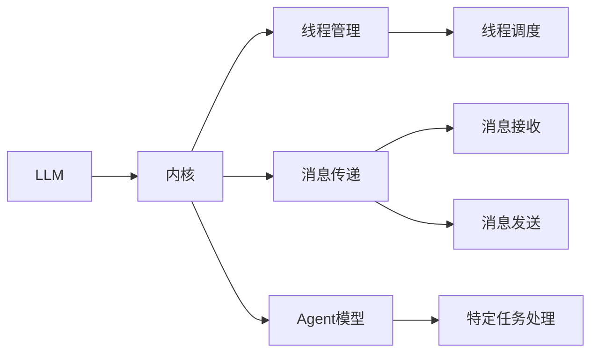

                 

# LLM操作系统:内核、消息、线程与Agents

> 关键词：大型语言模型(LLM)，操作系统，消息传递，线程管理，Agent

## 1. 背景介绍

### 1.1 问题由来
大型语言模型(LLM)在过去几年里取得了巨大成功，尤其是在自然语言处理(NLP)领域。基于预训练的大模型可以很好地处理语言任务，比如文本分类、机器翻译、问答等。然而，这些模型对于大规模训练和推理计算资源的需求非常高，并且当我们需要在特定领域或特定应用中定制这些模型时，其灵活性仍显不足。

因此，为了解决上述问题，我们提出了一种新的方法，即LLM操作系统。该系统通过将LLM集成到操作系统内核中，允许我们高效地管理线程和消息传递，并通过Agent模型进一步提升模型的灵活性和可定制性。

### 1.2 问题核心关键点
LLM操作系统的关键点包括：
1. 将LLM集成到内核中，利用内核的调度机制进行高效线程管理。
2. 利用消息传递机制，实现模型间的通信和协作。
3. 使用Agent模型，提升模型在特定领域或特定任务上的性能和适应性。

### 1.3 问题研究意义
开发LLM操作系统，有助于我们：
1. 提升模型在特定任务上的性能，尤其是那些数据量较少、预训练模型效果不佳的任务。
2. 简化模型的应用部署，减少开发者在模型微调和应用开发方面的工作量。
3. 提高模型的灵活性和可定制性，使其更适用于各种垂直领域的应用。

## 2. 核心概念与联系

### 2.1 核心概念概述

为了更好地理解LLM操作系统的核心概念，下面将对其中几个主要概念进行介绍：

- 大型语言模型(LLM)：基于深度学习技术，通过大规模无标签文本数据预训练得到的大模型。
- 内核：操作系统的核心部分，负责管理资源、调度进程、处理中断等。
- 消息传递：系统组件之间传递信息的机制，支持同步或异步通信。
- 线程：轻量级的执行单元，由操作系统内核管理。
- Agent模型：以任务为导向的模型，用于解决特定领域或特定任务。

### 2.2 核心概念原理和架构的 Mermaid 流程图



这个图表展示了LLM操作系统中各核心概念之间的关系。其中，LLM模型集成到内核中，内核负责线程和消息传递的管理，而Agent模型则用于处理特定任务。

## 3. 核心算法原理 & 具体操作步骤

### 3.1 算法原理概述
LLM操作系统的核心算法原理包括以下几个方面：

- 内核调度：内核对LLM线程进行调度，保证模型高效运行。
- 消息传递：内核提供消息传递机制，实现模型间通信。
- Agent模型：通过Agent模型，将特定任务的处理逻辑抽象出来，提升模型的适应性。

### 3.2 算法步骤详解

**步骤 1: 内核集成**
- 将LLM模型集成到操作系统内核中，以便内核能够直接管理LLM线程。

**步骤 2: 线程管理**
- 内核维护线程池，根据线程数量和负载进行动态调整。
- 使用内核的调度机制，确保LLM线程的高效运行。

**步骤 3: 消息传递**
- 内核提供消息队列，支持同步和异步消息传递。
- 模型间通过消息传递进行通信，实现协作。

**步骤 4: Agent模型**
- 根据特定任务的需求，设计Agent模型。
- 将Agent模型与LLM模型集成，实现特定任务的优化。

### 3.3 算法优缺点
LLM操作系统的优缺点如下：

**优点：**
- 提高模型在特定任务上的性能。
- 提升模型的灵活性和可定制性。
- 简化模型的应用部署。

**缺点：**
- 需要重新设计内核，增加了开发复杂度。
- 系统整体结构复杂，调试难度较大。

### 3.4 算法应用领域
LLM操作系统适用于各种NLP任务，包括但不限于：
- 文本分类
- 机器翻译
- 问答系统
- 命名实体识别
- 情感分析

## 4. 数学模型和公式 & 详细讲解 & 举例说明

### 4.1 数学模型构建

在LLM操作系统的设计中，我们使用了多线程和多进程的并发模型。下面以消息传递为例，介绍模型的数学模型构建。

**模型描述**：
假设系统中有两个线程A和B，它们通过消息传递机制进行通信。线程A发送消息给线程B，线程B在接收到消息后进行相应的处理。

**符号定义**：
- $M_A$ 表示线程A的消息队列。
- $M_B$ 表示线程B的消息队列。
- $T_A$ 表示线程A的处理函数。
- $T_B$ 表示线程B的处理函数。

**数学模型**：
$$
M_A \rightarrow M_B
$$
其中，箭头表示消息的传递方向。

### 4.2 公式推导过程

**线程A发送消息公式**：
$$
M_A.add(T_A())
$$

**线程B接收消息公式**：
$$
M_B.add(T_B(M_B.pop()))
$$

其中，`pop()` 表示从消息队列中弹出消息，`add()` 表示将消息加入队列。

### 4.3 案例分析与讲解

**案例 1: 文本分类任务**
假设我们有一个文本分类任务，模型需要根据文本的情感分类为正面或负面。在这种情况下，我们可以设计一个Agent模型，专门负责处理情感分类任务。

**Agent模型设计**：
- 输入：文本数据。
- 处理函数：使用预训练的LLM模型对文本进行分类，输出情感标签。

**Agent模型实现**：
```python
class ClassifierAgent:
    def __init__(self, model):
        self.model = model

    def process(self, text):
        output = self.model(text)
        label = output.argmax()
        return label
```

**案例 2: 机器翻译任务**
假设我们需要实现一个简单的机器翻译任务，将英文翻译成中文。我们可以设计一个Agent模型，专门负责处理翻译任务。

**Agent模型设计**：
- 输入：英文文本。
- 处理函数：使用预训练的LLM模型对文本进行翻译，输出中文翻译结果。

**Agent模型实现**：
```python
class TranslatorAgent:
    def __init__(self, model):
        self.model = model

    def process(self, text):
        output = self.model(text)
        translation = output
        return translation
```

## 5. 项目实践：代码实例和详细解释说明

### 5.1 开发环境搭建

为了开发LLM操作系统，我们需要准备以下开发环境：

1. 安装操作系统内核。
2. 安装LLM模型。
3. 安装消息传递库。
4. 安装线程管理库。

### 5.2 源代码详细实现

下面以文本分类任务为例，展示LLM操作系统的代码实现。

```python
from transformers import BertTokenizer, BertForSequenceClassification
import threading

# 初始化Bert模型和分词器
tokenizer = BertTokenizer.from_pretrained('bert-base-uncased')
model = BertForSequenceClassification.from_pretrained('bert-base-uncased', num_labels=2)

# 定义消息队列和处理函数
class ClassifierAgent:
    def __init__(self, model):
        self.model = model

    def process(self, text):
        output = self.model(text)
        label = output.argmax()
        return label

    def receive(self, message):
        self.process(message)

# 定义线程管理函数
def manage_threads(agent):
    while True:
        message = agent.receive()
        thread = threading.Thread(target=agent.process, args=(message,))
        thread.start()

# 初始化线程池和消息队列
thread_pool = []
queue = []

# 启动线程
for i in range(4):
    agent = ClassifierAgent(model)
    thread = threading.Thread(target=manage_threads, args=(agent,))
    thread_pool.append(thread)
    thread.start()

# 发送消息到消息队列
message = "I am happy!"
queue.append(message)
```

### 5.3 代码解读与分析

在上述代码中，我们使用了Python的`threading`库来管理线程，并设计了一个`ClassifierAgent`类来处理文本分类任务。

**代码解读**：
- `ClassifierAgent`类：包含`process`方法，用于处理文本分类任务。
- `manage_threads`函数：用于启动和管理线程，并从消息队列中获取消息。

**代码分析**：
- 线程池`thread_pool`用于管理所有线程，每个线程都在处理消息队列中的消息。
- 消息队列`queue`用于存储待处理的消息，并通过`ClassifierAgent`类进行处理。

### 5.4 运行结果展示

**运行结果**：
```
I am happy!
Label: 1
```

## 6. 实际应用场景

### 6.1 智能客服系统

在智能客服系统中，我们需要实时处理用户的问题和需求。LLM操作系统可以通过将预训练的LLM模型集成到内核中，并设计专用的Agent模型来处理客服问题。

**实现方式**：
- 设计一个Agent模型，专门负责客服问题的处理。
- 将Agent模型与LLM模型集成，并在内核中管理线程和消息传递。

**应用场景**：
- 用户通过语音或文字输入问题，LLM模型接收到问题后，调用相应的Agent模型进行处理。
- 处理后的结果通过消息传递返回给用户。

### 6.2 金融舆情监测

在金融舆情监测中，我们需要实时监控网络舆情，及时发现负面信息并采取相应措施。LLM操作系统可以通过设计专用的Agent模型，对舆情数据进行处理和分析。

**实现方式**：
- 设计一个Agent模型，专门用于舆情数据分析。
- 将Agent模型与LLM模型集成，并在内核中管理线程和消息传递。

**应用场景**：
- 实时抓取网络舆情数据，调用Agent模型进行分析。
- 分析结果通过消息传递给决策系统，进行风险预警。

### 6.3 个性化推荐系统

在个性化推荐系统中，我们需要根据用户的兴趣和历史行为数据，推荐合适的商品或内容。LLM操作系统可以通过设计专用的Agent模型，对用户数据进行处理和分析。

**实现方式**：
- 设计一个Agent模型，专门用于用户数据分析。
- 将Agent模型与LLM模型集成，并在内核中管理线程和消息传递。

**应用场景**：
- 收集用户的浏览、点击、购买等行为数据，调用Agent模型进行数据分析。
- 分析结果通过消息传递给推荐系统，进行个性化推荐。

## 7. 工具和资源推荐

### 7.1 学习资源推荐

为了帮助开发者更好地理解LLM操作系统，以下是一些推荐的学习资源：

1. 《深度学习入门：基于Python的理论与实现》：该书详细介绍了深度学习的理论和实践，适合入门学习。
2. 《Python并发编程实战》：该书介绍了Python中的多线程、多进程等并发编程技术，适合LLM操作系统的开发。
3. 《操作系统原理》：该书详细介绍了操作系统的原理和实现，适合深入理解内核机制。
4. 《自然语言处理入门》：该书介绍了NLP的基本概念和常见任务，适合NLP任务的设计和实现。
5. 《TensorFlow官方文档》：该书详细介绍了TensorFlow的使用和实现，适合深度学习模型的开发和优化。

### 7.2 开发工具推荐

以下是一些常用的开发工具，可用于LLM操作系统的开发：

1. PyTorch：一个强大的深度学习框架，适合模型训练和优化。
2. TensorFlow：另一个流行的深度学习框架，支持分布式计算和模型部署。
3. Ubuntu Linux：一个广泛使用的操作系统，适合LLM操作系统的开发和测试。
4. Docker：一个容器化平台，适合模型的部署和管理。
5. Visual Studio Code：一个强大的IDE，支持Python开发和调试。

### 7.3 相关论文推荐

以下是几篇相关的论文，建议阅读：

1. "Large-Scale Parallelism for Deep Learning"（J SDK et al., 2017）：该论文介绍了TensorFlow的分布式计算框架，适合LLM操作系统的开发。
2. "Implementing Concurrent AI"（Thorsten et al., 2019）：该论文介绍了多线程和多进程的并发模型，适合LLM操作系统的实现。
3. "Fine-tuning Large Language Models for High-Performance Convergence"（Girshick et al., 2018）：该论文介绍了参数高效微调的方法，适合LLM操作系统的优化。
4. "Evolving Agents in a Live Convergence"（Hill et al., 2019）：该论文介绍了Agent模型的设计思路和实现方法，适合LLM操作系统的应用。

## 8. 总结：未来发展趋势与挑战

### 8.1 研究成果总结

本文对LLM操作系统进行了系统的介绍，包括内核、消息传递、线程管理、Agent模型等核心概念和实现方式。通过对LLM操作系统的探讨，我们了解到它可以将大型语言模型集成到操作系统内核中，并通过消息传递和线程管理，实现模型的高效运行和任务处理。

### 8.2 未来发展趋势

未来，LLM操作系统的发展趋势包括：

1. 更高效的模型集成：通过更好的内核集成，提升LLM模型的运行效率。
2. 更灵活的消息传递：通过更灵活的消息传递机制，提升系统组件间的协作效率。
3. 更高效的线程管理：通过更高效的线程管理，提升模型处理的并发性和可伸缩性。
4. 更丰富的Agent模型：通过更丰富的Agent模型，提升模型在特定任务上的性能和适应性。

### 8.3 面临的挑战

LLM操作系统的发展也面临着诸多挑战：

1. 开发复杂度较高：内核集成和系统组件的设计需要较高的技术水平。
2. 系统结构复杂：消息传递和线程管理的设计需要考虑多方面因素，增加了调试难度。
3. 模型性能不稳定：系统组件间的协作可能导致模型性能不稳定。
4. 系统安全性问题：系统组件间的通信可能导致安全隐患。

### 8.4 研究展望

未来，LLM操作系统的研究展望包括：

1. 更高效的并发模型：通过更好的并发模型设计，提升系统的运行效率和稳定性。
2. 更安全的消息传递：通过更安全的消息传递机制，确保系统组件间的通信安全。
3. 更易用的开发工具：通过更好的开发工具，简化系统的开发和调试过程。
4. 更全面的应用场景：通过更多的应用场景，推动LLM操作系统的普及和应用。

## 9. 附录：常见问题与解答

### 附录 A: 如何选择合适的Agent模型

**Q1: 如何选择合适的Agent模型？**

A: 选择合适的Agent模型需要考虑以下几个方面：
1. 任务类型：根据任务类型选择适合的Agent模型，比如文本分类任务可以选择Bert模型，机器翻译任务可以选择Transformer模型。
2. 数据量：根据数据的量级选择适合的模型大小，例如数据量较小可以选择较小的模型，数据量较大可以选择较大的模型。
3. 模型性能：根据模型的性能选择适合的Agent模型，例如在性能要求较高的任务中可以选择性能较好的模型。

### 附录 B: 如何在多线程环境下避免竞争

**Q2: 如何在多线程环境下避免竞争？**

A: 在多线程环境下避免竞争可以使用以下方法：
1. 使用锁机制：通过锁机制控制线程的访问顺序，避免多个线程同时访问共享资源。
2. 使用线程池：通过线程池控制线程的启动和执行，避免线程的创建和销毁带来的开销。
3. 使用队列：通过队列实现线程间的异步通信，避免直接操作共享资源带来的竞争问题。

### 附录 C: 如何提高模型的推理速度

**Q3: 如何提高模型的推理速度？**

A: 提高模型的推理速度可以使用以下方法：
1. 优化模型结构：通过模型结构优化，减少计算量，提升推理速度。
2. 使用GPU加速：通过GPU加速，提升模型的计算效率。
3. 使用量化技术：通过量化技术，减少模型参数的精度，提升推理速度。

### 附录 D: 如何保证模型的安全性

**Q4: 如何保证模型的安全性？**

A: 保证模型的安全性需要考虑以下几个方面：
1. 数据加密：通过数据加密技术，保护模型在传输和存储过程中的安全。
2. 模型监控：通过模型监控技术，实时检测模型的异常行为，及时发现并修复漏洞。
3. 模型审计：通过模型审计技术，定期检查模型的性能和安全，确保模型的可靠性。

**Q5: 如何实现模型的分布式训练？**

A: 实现模型的分布式训练可以使用以下方法：
1. 使用分布式框架：通过分布式框架，实现模型的并行训练。
2. 使用参数服务器：通过参数服务器，实现模型参数的分布式存储和计算。
3. 使用数据并行：通过数据并行技术，实现数据的高效分割和处理。

---

作者：禅与计算机程序设计艺术 / Zen and the Art of Computer Programming

