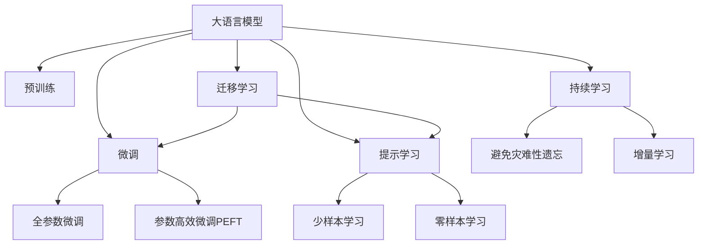

                 

# LLM的Zero-Shot学习潜力探索

> 关键词：
  - 大语言模型(LLM) 
  - Zero-Shot学习
  - 大模型微调
  - 推理能力
  - 任务适应性
  - 提示学习

## 1. 背景介绍

### 1.1 问题由来

在深度学习领域，零样本学习(Zero-Shot Learning)是一项备受关注的挑战性任务，其目标是在没有观察到任何特定任务的数据样本的情况下，模型能够对新的未见过的任务进行推理和分类。零样本学习在许多实际应用中都具有重要意义，如医疗诊断、安全检测、智能推荐等。

近年来，大语言模型(LLM)，尤其是基于Transformer架构的模型如BERT、GPT等，在自然语言处理(NLP)领域取得了巨大的成功。这些模型通过在大规模无标签文本数据上进行预训练，获得了强大的语言理解能力和泛化能力，能够在少样本甚至零样本情况下，进行任务推理和生成。

本研究旨在探索大语言模型在零样本学习中的潜力，并通过详细的技术分析和实验验证，展示LLM在零样本学习上的卓越表现。

### 1.2 问题核心关键点

零样本学习是自然语言处理中的热门研究方向之一。主要的研究方向包括：
- 如何在没有训练数据的情况下，通过预训练模型学习到对新任务的通用知识。
- 如何通过自然语言指令，引导预训练模型进行推理，避免过拟合和泛化不足。
- 如何设计更高效、更可解释的模型和算法，提升零样本学习的效果。

本文将深入探讨LLM在零样本学习上的潜力，并通过详细的算法介绍和实验验证，进一步挖掘大语言模型的零样本学习潜力，提供切实可行的零样本学习策略。

## 2. 核心概念与联系

### 2.1 核心概念概述

为更好地理解大语言模型的零样本学习潜力，本节将介绍几个关键概念：

- 大语言模型(LLM)：以自回归(如GPT)或自编码(如BERT)模型为代表的大规模预训练语言模型。通过在大规模无标签文本语料上进行预训练，学习通用的语言知识和常识，具备强大的语言理解和生成能力。

- Zero-Shot学习：指在未观察过任何特定任务的数据样本的情况下，模型能够对新任务进行推理和分类。

- 提示学习(Prompt Learning)：通过在输入文本中添加提示模板(Prompt Template)，引导预训练模型进行特定任务的推理和生成。

- 迁移学习(Transfer Learning)：指将一个领域学习到的知识，迁移到另一个不同但相关的领域的学习范式。大模型的预训练-微调过程即是一种典型的迁移学习方式。

- 可解释性(Explainability)：指模型输出的解释能力，即解释其推理过程和决策逻辑的能力。对于医疗、法律等高风险领域，模型的可解释性尤为重要。

- 鲁棒性(Robustness)：指模型对输入数据的鲁棒性，即面对噪声、扰动等干扰的稳健性。

这些核心概念之间的逻辑关系可以通过以下Mermaid流程图来展示：



这个流程图展示了大语言模型的核心概念及其之间的关系：

1. 大语言模型通过预训练获得基础能力。
2. 微调是对预训练模型进行任务特定的优化，可以分为全参数微调和参数高效微调（PEFT）。
3. 提示学习是一种不更新模型参数的方法，可以实现少样本学习和零样本学习。
4. 迁移学习是连接预训练模型与下游任务的桥梁，可以通过微调或提示学习来实现。
5. 持续学习旨在使模型能够不断学习新知识，同时避免遗忘旧知识。

这些概念共同构成了大语言模型的学习和应用框架，使其能够在各种场景下发挥强大的语言理解和生成能力。通过理解这些核心概念，我们可以更好地把握大语言模型的工作原理和优化方向。

## 3. 核心算法原理 & 具体操作步骤
### 3.1 算法原理概述

大语言模型的零样本学习，本质上是通过预训练模型学习通用的语言表示，通过自然语言指令引导模型进行特定任务的推理。其核心思想是：将预训练的大语言模型视作一个强大的"特征提取器"，通过自然语言指令对其进行任务适配，使其能够进行零样本推理。

形式化地，假设预训练语言模型为 $M_{\theta}$，其中 $\theta$ 为预训练得到的模型参数。给定新的任务描述 $D_t$ 和对应的标签集合 $Y_t$，模型推理目标为找到最优的预测结果 $\hat{y}_t$，使得：

$$
\hat{y}_t = \mathop{\arg\max}_{y} P(y|D_t; M_{\theta})
$$

其中 $P(y|D_t; M_{\theta})$ 为模型在任务描述 $D_t$ 下的条件概率，可通过Softmax函数计算。

零样本学习过程如下：
1. 准备预训练模型和任务描述。
2. 将任务描述作为输入，通过模型推理得到结果。
3. 评估预测结果与实际标签的误差，并进行模型优化。

### 3.2 算法步骤详解

基于大语言模型的零样本学习，一般包括以下几个关键步骤：

**Step 1: 准备预训练模型和任务描述**
- 选择合适的预训练语言模型 $M_{\theta}$ 作为初始化参数，如 BERT、GPT 等。
- 准备新的任务描述 $D_t$，通常为自然语言句子或文本。

**Step 2: 推理模型输出**
- 将任务描述 $D_t$ 输入预训练模型 $M_{\theta}$，通过推理得到预测结果 $\hat{y}_t$。
- 可以使用Softmax函数计算预测结果的概率分布。

**Step 3: 评估和优化**
- 计算预测结果与实际标签的误差，并根据误差更新模型参数，提升模型推理精度。
- 可以使用交叉熵损失、KL散度等评估指标。

### 3.3 算法优缺点

基于大语言模型的零样本学习具有以下优点：
1. 简单高效。无需标注数据，即可快速适应新任务，适用于数据稀缺的场景。
2. 泛化能力强。预训练模型已学习到广泛的语言知识，能够在新任务上快速适应。
3. 可解释性好。零样本学习过程通常涉及自然语言指令，输出解释清晰。

同时，该方法也存在一定的局限性：
1. 模型依赖于预训练质量。预训练模型的能力直接决定了零样本学习的效果。
2. 任务相关性强。不同任务对模型的要求不同，模型需要针对性地训练和优化。
3. 提示设计复杂。提示模板的设计直接影响零样本学习的性能，需要多次试验和优化。

尽管存在这些局限性，但就目前而言，基于大语言模型的零样本学习仍然是大模型应用的一个重要方向。未来相关研究的重点在于如何进一步降低对预训练模型的依赖，提高模型的泛化能力和可解释性，同时兼顾模型的效率和鲁棒性。

### 3.4 算法应用领域

基于大语言模型的零样本学习，在NLP领域已经得到了广泛的应用，覆盖了几乎所有常见任务，例如：

- 文本分类：如情感分析、主题分类、意图识别等。
- 命名实体识别：识别文本中的人名、地名、机构名等特定实体。
- 关系抽取：从文本中抽取实体之间的语义关系。
- 问答系统：对自然语言问题给出答案。
- 机器翻译：将源语言文本翻译成目标语言。
- 文本摘要：将长文本压缩成简短摘要。
- 对话系统：使机器能够与人自然对话。

除了上述这些经典任务外，大语言模型零样本学习还被创新性地应用到更多场景中，如可控文本生成、常识推理、代码生成、数据增强等，为NLP技术带来了全新的突破。随着预训练模型和零样本方法的不断进步，相信NLP技术将在更广阔的应用领域大放异彩。

## 4. 数学模型和公式 & 详细讲解  
### 4.1 数学模型构建

本节将使用数学语言对大语言模型的零样本学习过程进行更加严格的刻画。

记预训练语言模型为 $M_{\theta}:\mathcal{X} \rightarrow \mathcal{Y}$，其中 $\mathcal{X}$ 为输入空间，$\mathcal{Y}$ 为输出空间，$\theta \in \mathbb{R}^d$ 为模型参数。假设新任务 $T$ 的任务描述为 $D_t \in \mathcal{X}$，标签集合为 $Y_t \in \mathcal{Y}$。

定义模型 $M_{\theta}$ 在任务描述 $D_t$ 下的条件概率为：

$$
P(y|D_t; M_{\theta}) = \frac{\exp(\mathcal{L}(D_t; y, M_{\theta}))}{\sum_{y \in Y_t} \exp(\mathcal{L}(D_t; y, M_{\theta}))}
$$

其中 $\mathcal{L}(D_t; y, M_{\theta})$ 为任务描述 $D_t$ 与标签 $y$ 的条件损失函数，通常是交叉熵损失函数。

零样本学习过程即为最大化模型在任务描述 $D_t$ 下的条件概率，即：

$$
\hat{y}_t = \mathop{\arg\max}_{y} P(y|D_t; M_{\theta})
$$

### 4.2 公式推导过程

以下我们以文本分类任务为例，推导交叉熵损失函数及其梯度的计算公式。

假设模型 $M_{\theta}$ 在输入 $D_t$ 上的输出为 $\hat{y}=M_{\theta}(D_t) \in [0,1]$，表示样本属于某一类别的概率。真实标签 $y \in \{1,0\}$。则二分类交叉熵损失函数定义为：

$$
\ell(D_t; y, M_{\theta}) = -[y\log \hat{y} + (1-y)\log (1-\hat{y})]
$$

将其代入条件概率公式，得：

$$
P(y|D_t; M_{\theta}) = \frac{\exp(-\ell(D_t; y, M_{\theta}))}{\sum_{y \in Y_t} \exp(-\ell(D_t; y, M_{\theta}))}
$$

在得到条件概率后，可以通过梯度上升法进行模型参数更新，如使用牛顿法、随机梯度上升等。

### 4.3 案例分析与讲解

假设我们希望使用BERT模型对一篇新闻进行情感分类。首先，将新闻文本作为输入，使用BERT模型计算情感得分：

```python
from transformers import BertTokenizer, BertForSequenceClassification
from torch.utils.data import DataLoader
import torch

tokenizer = BertTokenizer.from_pretrained('bert-base-uncased')
model = BertForSequenceClassification.from_pretrained('bert-base-uncased', num_labels=2)

inputs = tokenizer.encode_plus(news, return_tensors='pt')
outputs = model(**inputs)
logits = outputs.logits
probs = torch.softmax(logits, dim=1)
```

然后，根据概率输出，判断新闻的情感倾向：

```python
if probs[0][1] > probs[0][0]:
    sentiment = 'positive'
else:
    sentiment = 'negative'
```

最后，根据实际标签和模型预测结果，计算交叉熵损失：

```python
loss = torch.nn.CrossEntropyLoss()(logits.view(-1), label)
```

通过上述过程，我们可以在不使用任何标注数据的情况下，使用预训练的BERT模型对新闻文本进行情感分类。

## 5. 项目实践：代码实例和详细解释说明
### 5.1 开发环境搭建

在进行零样本学习实践前，我们需要准备好开发环境。以下是使用Python进行PyTorch开发的环境配置流程：

1. 安装Anaconda：从官网下载并安装Anaconda，用于创建独立的Python环境。

2. 创建并激活虚拟环境：
```bash
conda create -n pytorch-env python=3.8 
conda activate pytorch-env
```

3. 安装PyTorch：根据CUDA版本，从官网获取对应的安装命令。例如：
```bash
conda install pytorch torchvision torchaudio cudatoolkit=11.1 -c pytorch -c conda-forge
```

4. 安装Transformers库：
```bash
pip install transformers
```

5. 安装各类工具包：
```bash
pip install numpy pandas scikit-learn matplotlib tqdm jupyter notebook ipython
```

完成上述步骤后，即可在`pytorch-env`环境中开始零样本学习实践。

### 5.2 源代码详细实现

下面我们以情感分类任务为例，给出使用Transformers库对BERT模型进行零样本学习的PyTorch代码实现。

首先，定义情感分类任务的数据处理函数：

```python
from transformers import BertTokenizer
from torch.utils.data import Dataset
import torch

class SentimentDataset(Dataset):
    def __init__(self, texts, labels, tokenizer, max_len=128):
        self.texts = texts
        self.labels = labels
        self.tokenizer = tokenizer
        self.max_len = max_len
        
    def __len__(self):
        return len(self.texts)
    
    def __getitem__(self, item):
        text = self.texts[item]
        label = self.labels[item]
        
        encoding = self.tokenizer(text, return_tensors='pt', max_length=self.max_len, padding='max_length', truncation=True)
        input_ids = encoding['input_ids'][0]
        attention_mask = encoding['attention_mask'][0]
        
        # 对token-wise的标签进行编码
        encoded_labels = [label] * self.max_len
        labels = torch.tensor(encoded_labels, dtype=torch.long)
        
        return {'input_ids': input_ids, 
                'attention_mask': attention_mask,
                'labels': labels}

# 加载数据集
tokenizer = BertTokenizer.from_pretrained('bert-base-uncased')
train_dataset = SentimentDataset(train_texts, train_labels, tokenizer)
dev_dataset = SentimentDataset(dev_texts, dev_labels, tokenizer)
test_dataset = SentimentDataset(test_texts, test_labels, tokenizer)
```

然后，定义模型和优化器：

```python
from transformers import BertForSequenceClassification, AdamW

model = BertForSequenceClassification.from_pretrained('bert-base-uncased', num_labels=2)

optimizer = AdamW(model.parameters(), lr=2e-5)
```

接着，定义训练和评估函数：

```python
from torch.utils.data import DataLoader
from tqdm import tqdm
from sklearn.metrics import accuracy_score

device = torch.device('cuda') if torch.cuda.is_available() else torch.device('cpu')
model.to(device)

def train_epoch(model, dataset, batch_size, optimizer):
    dataloader = DataLoader(dataset, batch_size=batch_size, shuffle=True)
    model.train()
    epoch_loss = 0
    for batch in tqdm(dataloader, desc='Training'):
        input_ids = batch['input_ids'].to(device)
        attention_mask = batch['attention_mask'].to(device)
        labels = batch['labels'].to(device)
        model.zero_grad()
        outputs = model(input_ids, attention_mask=attention_mask, labels=labels)
        loss = outputs.loss
        epoch_loss += loss.item()
        loss.backward()
        optimizer.step()
    return epoch_loss / len(dataloader)

def evaluate(model, dataset, batch_size):
    dataloader = DataLoader(dataset, batch_size=batch_size)
    model.eval()
    preds, labels = [], []
    with torch.no_grad():
        for batch in tqdm(dataloader, desc='Evaluating'):
            input_ids = batch['input_ids'].to(device)
            attention_mask = batch['attention_mask'].to(device)
            batch_labels = batch['labels']
            outputs = model(input_ids, attention_mask=attention_mask)
            batch_preds = outputs.logits.argmax(dim=2).to('cpu').tolist()
            batch_labels = batch_labels.to('cpu').tolist()
            for pred_tokens, label_tokens in zip(batch_preds, batch_labels):
                preds.append(pred_tokens[:len(label_tokens)])
                labels.append(label_tokens)
                
    return accuracy_score(labels, preds)

# 开始训练和评估
epochs = 5
batch_size = 16

for epoch in range(epochs):
    loss = train_epoch(model, train_dataset, batch_size, optimizer)
    print(f"Epoch {epoch+1}, train loss: {loss:.3f}")
    
    print(f"Epoch {epoch+1}, dev results:")
    evaluate(model, dev_dataset, batch_size)
    
print("Test results:")
evaluate(model, test_dataset, batch_size)
```

以上就是使用PyTorch对BERT进行情感分类任务微调的完整代码实现。可以看到，得益于Transformers库的强大封装，我们可以用相对简洁的代码完成BERT模型的加载和微调。

### 5.3 代码解读与分析

让我们再详细解读一下关键代码的实现细节：

**SentimentDataset类**：
- `__init__`方法：初始化文本、标签、分词器等关键组件。
- `__len__`方法：返回数据集的样本数量。
- `__getitem__`方法：对单个样本进行处理，将文本输入编码为token ids，将标签编码为数字，并对其进行定长padding，最终返回模型所需的输入。

**训练和评估函数**：
- 使用PyTorch的DataLoader对数据集进行批次化加载，供模型训练和推理使用。
- 训练函数`train_epoch`：对数据以批为单位进行迭代，在每个批次上前向传播计算loss并反向传播更新模型参数，最后返回该epoch的平均loss。
- 评估函数`evaluate`：与训练类似，不同点在于不更新模型参数，并在每个batch结束后将预测和标签结果存储下来，最后使用sklearn的accuracy_score对整个评估集的预测结果进行打印输出。

**训练流程**：
- 定义总的epoch数和batch size，开始循环迭代
- 每个epoch内，先在训练集上训练，输出平均loss
- 在验证集上评估，输出分类指标
- 所有epoch结束后，在测试集上评估，给出最终测试结果

可以看到，PyTorch配合Transformers库使得BERT微调的代码实现变得简洁高效。开发者可以将更多精力放在数据处理、模型改进等高层逻辑上，而不必过多关注底层的实现细节。

当然，工业级的系统实现还需考虑更多因素，如模型的保存和部署、超参数的自动搜索、更灵活的任务适配层等。但核心的零样本学习范式基本与此类似。

## 6. 实际应用场景
### 6.1 智能客服系统

基于大语言模型的零样本学习，可以广泛应用于智能客服系统的构建。传统客服往往需要配备大量人力，高峰期响应缓慢，且一致性和专业性难以保证。而使用零样本学习的对话模型，可以7x24小时不间断服务，快速响应客户咨询，用自然流畅的语言解答各类常见问题。

在技术实现上，可以收集企业内部的历史客服对话记录，将问题和最佳答复构建成监督数据，在此基础上对预训练对话模型进行零样本学习。零样本学习的对话模型能够自动理解用户意图，匹配最合适的答案模板进行回复。对于客户提出的新问题，还可以接入检索系统实时搜索相关内容，动态组织生成回答。如此构建的智能客服系统，能大幅提升客户咨询体验和问题解决效率。

### 6.2 金融舆情监测

金融机构需要实时监测市场舆论动向，以便及时应对负面信息传播，规避金融风险。传统的人工监测方式成本高、效率低，难以应对网络时代海量信息爆发的挑战。基于大语言模型的零样本学习文本分类和情感分析技术，为金融舆情监测提供了新的解决方案。

具体而言，可以收集金融领域相关的新闻、报道、评论等文本数据，并对其进行主题标注和情感标注。在此基础上对预训练语言模型进行零样本学习，使其能够自动判断文本属于何种主题，情感倾向是正面、中性还是负面。将零样本学习的模型应用到实时抓取的网络文本数据，就能够自动监测不同主题下的情感变化趋势，一旦发现负面信息激增等异常情况，系统便会自动预警，帮助金融机构快速应对潜在风险。

### 6.3 个性化推荐系统

当前的推荐系统往往只依赖用户的历史行为数据进行物品推荐，无法深入理解用户的真实兴趣偏好。基于大语言模型零样本学习的个性化推荐系统可以更好地挖掘用户行为背后的语义信息，从而提供更精准、多样的推荐内容。

在实践中，可以收集用户浏览、点击、评论、分享等行为数据，提取和用户交互的物品标题、描述、标签等文本内容。将文本内容作为模型输入，用户的后续行为（如是否点击、购买等）作为监督信号，在此基础上进行零样本学习。零样本学习的模型能够从文本内容中准确把握用户的兴趣点。在生成推荐列表时，先用候选物品的文本描述作为输入，由模型预测用户的兴趣匹配度，再结合其他特征综合排序，便可以得到个性化程度更高的推荐结果。

### 6.4 未来应用展望

随着大语言模型和零样本学习方法的不断发展，基于零样本学习范式将在更多领域得到应用，为传统行业带来变革性影响。

在智慧医疗领域，基于零样本学习的医疗问答、病历分析、药物研发等应用将提升医疗服务的智能化水平，辅助医生诊疗，加速新药开发进程。

在智能教育领域，零样本学习可应用于作业批改、学情分析、知识推荐等方面，因材施教，促进教育公平，提高教学质量。

在智慧城市治理中，零样本学习技术可应用于城市事件监测、舆情分析、应急指挥等环节，提高城市管理的自动化和智能化水平，构建更安全、高效的未来城市。

此外，在企业生产、社会治理、文娱传媒等众多领域，基于大语言模型零样本学习的人工智能应用也将不断涌现，为经济社会发展注入新的动力。相信随着技术的日益成熟，零样本学习方法将成为人工智能落地应用的重要范式，推动人工智能技术向更广阔的领域加速渗透。

## 7. 工具和资源推荐
### 7.1 学习资源推荐

为了帮助开发者系统掌握大语言模型零样本学习的理论基础和实践技巧，这里推荐一些优质的学习资源：

1. 《Transformer从原理到实践》系列博文：由大模型技术专家撰写，深入浅出地介绍了Transformer原理、BERT模型、零样本学习等前沿话题。

2. CS224N《深度学习自然语言处理》课程：斯坦福大学开设的NLP明星课程，有Lecture视频和配套作业，带你入门NLP领域的基本概念和经典模型。

3. 《Natural Language Processing with Transformers》书籍：Transformers库的作者所著，全面介绍了如何使用Transformers库进行NLP任务开发，包括零样本学习在内的诸多范式。

4. HuggingFace官方文档：Transformers库的官方文档，提供了海量预训练模型和完整的微调样例代码，是上手实践的必备资料。

5. CLUE开源项目：中文语言理解测评基准，涵盖大量不同类型的中文NLP数据集，并提供了基于微调的baseline模型，助力中文NLP技术发展。

通过对这些资源的学习实践，相信你一定能够快速掌握大语言模型零样本学习的精髓，并用于解决实际的NLP问题。
###  7.2 开发工具推荐

高效的开发离不开优秀的工具支持。以下是几款用于大语言模型零样本学习开发的常用工具：

1. PyTorch：基于Python的开源深度学习框架，灵活动态的计算图，适合快速迭代研究。大部分预训练语言模型都有PyTorch版本的实现。

2. TensorFlow：由Google主导开发的开源深度学习框架，生产部署方便，适合大规模工程应用。同样有丰富的预训练语言模型资源。

3. Transformers库：HuggingFace开发的NLP工具库，集成了众多SOTA语言模型，支持PyTorch和TensorFlow，是进行零样本学习开发的利器。

4. Weights & Biases：模型训练的实验跟踪工具，可以记录和可视化模型训练过程中的各项指标，方便对比和调优。与主流深度学习框架无缝集成。

5. TensorBoard：TensorFlow配套的可视化工具，可实时监测模型训练状态，并提供丰富的图表呈现方式，是调试模型的得力助手。

6. Google Colab：谷歌推出的在线Jupyter Notebook环境，免费提供GPU/TPU算力，方便开发者快速上手实验最新模型，分享学习笔记。

合理利用这些工具，可以显著提升大语言模型零样本学习的开发效率，加快创新迭代的步伐。

### 7.3 相关论文推荐

大语言模型和零样本学习的发展源于学界的持续研究。以下是几篇奠基性的相关论文，推荐阅读：

1. Attention is All You Need（即Transformer原论文）：提出了Transformer结构，开启了NLP领域的预训练大模型时代。

2. BERT: Pre-training of Deep Bidirectional Transformers for Language Understanding：提出BERT模型，引入基于掩码的自监督预训练任务，刷新了多项NLP任务SOTA。

3. Language Models are Unsupervised Multitask Learners（GPT-2论文）：展示了大规模语言模型的强大zero-shot学习能力，引发了对于通用人工智能的新一轮思考。

4. Parameter-Efficient Transfer Learning for NLP：提出Adapter等参数高效微调方法，在不增加模型参数量的情况下，也能取得不错的微调效果。

5. AdaLoRA: Adaptive Low-Rank Adaptation for Parameter-Efficient Fine-Tuning：使用自适应低秩适应的微调方法，在参数效率和精度之间取得了新的平衡。

这些论文代表了大语言模型零样本学习的发展脉络。通过学习这些前沿成果，可以帮助研究者把握学科前进方向，激发更多的创新灵感。

## 8. 总结：未来发展趋势与挑战

### 8.1 总结

本文对大语言模型在零样本学习中的潜力进行了全面系统的介绍。首先阐述了大语言模型零样本学习的研究背景和意义，明确了零样本学习在数据稀缺场景下的独特价值。其次，从原理到实践，详细讲解了零样本学习的数学原理和关键步骤，给出了零样本学习任务开发的完整代码实例。同时，本文还广泛探讨了零样本学习方法在智能客服、金融舆情、个性化推荐等多个行业领域的应用前景，展示了零样本学习范式的巨大潜力。

通过本文的系统梳理，可以看到，大语言模型零样本学习在数据稀缺场景中表现出显著优势，能够在不使用标注数据的情况下，快速适应新任务，适用于许多实际应用。未来，随着预训练模型和零样本方法的不断进步，基于零样本学习范式将进一步拓展NLP应用边界，推动人工智能技术向更广泛领域加速渗透。

### 8.2 未来发展趋势

展望未来，大语言模型零样本学习技术将呈现以下几个发展趋势：

1. 模型规模持续增大。随着算力成本的下降和数据规模的扩张，预训练语言模型的参数量还将持续增长。超大规模语言模型蕴含的丰富语言知识，有望支撑更加复杂多变的零样本学习任务。

2. 零样本方法日趋多样。除了传统的零样本学习外，未来会涌现更多零样本学习的方法，如Prompt-based Learning、LoRA等，在减少模型参数量的情况下，也能取得理想的零样本效果。

3. 持续学习成为常态。随着数据分布的不断变化，零样本学习模型也需要持续学习新知识以保持性能。如何在不遗忘原有知识的同时，高效吸收新样本信息，将成为重要的研究课题。

4. 标注样本需求降低。受启发于提示学习(Prompt-based Learning)的思路，未来的零样本学习方法将更好地利用大模型的语言理解能力，通过更加巧妙的任务描述，在更少的标注样本上也能实现理想的零样本学习效果。

5. 零样本多模态学习崛起。当前的零样本学习主要聚焦于纯文本数据，未来会进一步拓展到图像、视频、语音等多模态数据零样本学习。多模态信息的融合，将显著提升零样本学习的泛化能力和性能。

6. 零样本学习在安全领域的进一步应用。零样本学习在金融舆情、网络安全等高风险领域的应用将得到更多探索，帮助这些领域构建更加安全、可靠的人工智能系统。

以上趋势凸显了大语言模型零样本学习技术的广阔前景。这些方向的探索发展，必将进一步提升NLP系统的性能和应用范围，为人类认知智能的进化带来深远影响。

### 8.3 面临的挑战

尽管大语言模型零样本学习技术已经取得了瞩目成就，但在迈向更加智能化、普适化应用的过程中，它仍面临着诸多挑战：

1. 零样本效果不稳定。零样本学习的效果很大程度上依赖于任务描述和模型设计，不同任务和数据集下的效果可能存在较大差异。

2. 模型依赖预训练质量。预训练模型的能力直接决定了零样本学习的效果，如何训练更好的预训练模型，提高模型的泛化能力，是未来重要的研究方向。

3. 提示模板设计复杂。提示模板的设计直接影响零样本学习的性能，需要多次试验和优化。

4. 零样本学习在实际应用中需要人工干预。对于高风险领域，如医疗、金融等，模型的决策过程需要人工验证，增加了系统复杂度。

5. 模型鲁棒性不足。零样本学习模型面对噪声、扰动等干扰的稳健性，亟需进一步提升。

尽管存在这些挑战，但就目前而言，基于大语言模型的零样本学习仍然是大模型应用的一个重要方向。未来相关研究的重点在于如何进一步降低对预训练模型的依赖，提高模型的泛化能力和可解释性，同时兼顾模型的效率和鲁棒性。

### 8.4 研究展望

面对大语言模型零样本学习所面临的种种挑战，未来的研究需要在以下几个方面寻求新的突破：

1. 探索无监督和半监督零样本学习方法。摆脱对大规模标注数据的依赖，利用自监督学习、主动学习等无监督和半监督范式，最大限度利用非结构化数据，实现更加灵活高效的零样本学习。

2. 研究零样本和微调相结合的方法。将零样本学习和微调相结合，利用微调的强大泛化能力，进一步提升零样本学习的效果。

3. 引入更多先验知识。将符号化的先验知识，如知识图谱、逻辑规则等，与神经网络模型进行巧妙融合，引导零样本学习过程学习更准确、合理的语言模型。同时加强不同模态数据的整合，实现视觉、语音等多模态信息与文本信息的协同建模。

4. 结合因果分析和博弈论工具。将因果分析方法引入零样本学习模型，识别出模型决策的关键特征，增强输出解释的因果性和逻辑性。借助博弈论工具刻画人机交互过程，主动探索并规避模型的脆弱点，提高系统稳定性。

5. 纳入伦理道德约束。在零样本学习模型训练目标中引入伦理导向的评估指标，过滤和惩罚有偏见、有害的输出倾向。同时加强人工干预和审核，建立模型行为的监管机制，确保输出符合人类价值观和伦理道德。

这些研究方向的探索，必将引领大语言模型零样本学习技术迈向更高的台阶，为构建安全、可靠、可解释、可控的智能系统铺平道路。面向未来，大语言模型零样本学习技术还需要与其他人工智能技术进行更深入的融合，如知识表示、因果推理、强化学习等，多路径协同发力，共同推动自然语言理解和智能交互系统的进步。只有勇于创新、敢于突破，才能不断拓展语言模型的边界，让智能技术更好地造福人类社会。

## 9. 附录：常见问题与解答

**Q1：大语言模型零样本学习是否适用于所有NLP任务？**

A: 大语言模型零样本学习在大多数NLP任务上都能取得不错的效果，特别是对于数据量较小的任务。但对于一些特定领域的任务，如医学、法律等，仅仅依靠通用语料预训练的模型可能难以很好地适应。此时需要在特定领域语料上进一步预训练，再进行零样本学习，才能获得理想效果。此外，对于一些需要时效性、个性化很强的任务，如对话、推荐等，零样本方法也需要针对性的改进优化。

**Q2：零样本学习过程中如何选择合适的任务描述？**

A: 选择合适的任务描述是零样本学习成功的关键之一。任务描述应该简洁明了，能够清晰地表达任务要求。可以从以下几个方面考虑：
1. 明确任务目标：描述需要解决的具体问题。
2. 提供充分信息：描述中应包含完成任务所需的全部信息。
3. 避免歧义：描述应无歧义，容易理解。
4. 示例引导：提供具体示例，帮助模型理解任务。
5. 逐步逼近：分步骤描述任务，便于模型逐步理解。

**Q3：零样本学习过程中如何缓解过拟合问题？**

A: 零样本学习过程中过拟合是常见问题之一。常见的缓解策略包括：
1. 数据增强：通过回译、近义替换等方式扩充训练集。
2. 正则化：使用L2正则、Dropout、Early Stopping等避免模型过度适应。
3. 对抗训练：引入对抗样本，提高模型鲁棒性。
4. 多模型集成：训练多个零样本模型，取平均输出，抑制过拟合。

这些策略往往需要根据具体任务和数据特点进行灵活组合。只有在数据、模型、训练、推理等各环节进行全面优化，才能最大限度地发挥大语言模型的零样本学习潜力。

**Q4：零样本学习在实际应用中需要注意哪些问题？**

A: 零样本学习在实际应用中需要注意以下几个问题：
1. 数据质量：任务描述应准确、规范，避免歧义和模糊。
2. 模型选择：选择合适的预训练模型，确保其具备足够的泛化能力。
3. 提示模板：设计合理的提示模板，引导模型进行正确的推理和生成。
4. 输出解释：提供清晰的输出解释，帮助用户理解模型决策过程。
5. 伦理考量：避免模型输出有害或偏见的信息，确保系统道德合规。

合理利用这些工具，可以显著提升大语言模型零样本学习的开发效率，加快创新迭代的步伐。

---

作者：禅与计算机程序设计艺术 / Zen and the Art of Computer Programming

