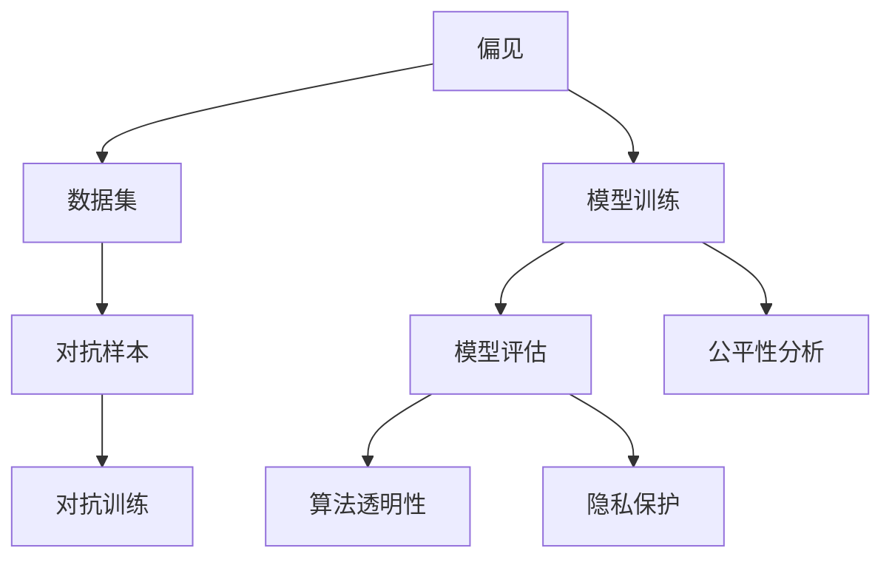

                 

# LLM的偏见消除：构建公平的AI世界

> 关键词：大语言模型,偏见消除,公平性,算法透明性,模型评估,对抗样本,隐私保护

## 1. 背景介绍

### 1.1 问题由来

近年来，随着深度学习技术和大规模预训练语言模型（Large Language Models, LLMs）的兴起，AI系统在语言理解和生成能力上取得了突破性进展。然而，这些系统在实际应用中逐渐暴露出一系列严重的问题，尤其是公平性和偏见问题。这些问题不仅会影响模型的实用性和可信度，还会对社会的公平正义造成潜在威胁。

### 1.2 问题核心关键点

1. **数据偏见**：用于训练的语言模型往往使用包含偏见的语料，导致模型学习到并继承了这些偏见，进而产生不公平的输出。
2. **模型公平性**：模型在不同性别、种族、年龄等维度上的表现应具有一致性，不应因属性差异而歧视或偏好某一类群体。
3. **算法透明性**：模型的决策过程应尽可能透明，便于用户理解和监督，避免"黑盒"系统。
4. **模型评估**：建立公平性评估指标，如性别、种族、年龄不平衡等，衡量模型在不同属性上的表现。
5. **对抗样本**：通过引入对抗性样本，测试模型鲁棒性，并评估其对偏见样本的敏感度。
6. **隐私保护**：保护用户隐私，避免敏感信息泄露，同时保证模型的有效性。

这些关键点共同构成了LLM偏见消除的挑战和目标，推动着该领域的研究和应用。

### 1.3 问题研究意义

消除LLM的偏见，构建公平的AI系统，对于提升社会公平、增进公众信任、保障用户隐私至关重要。公平的AI不仅能够提供更公正的决策支持，还能减少偏见带来的歧视和误解，促进社会和谐发展。

本文旨在深入探讨LLM的偏见消除方法，特别是如何通过算法设计和模型训练，确保LLM在不同群体间表现一致，同时提高模型的透明度和鲁棒性，保护用户隐私。通过系统地分析和实践，期望为构建公平、可靠、透明的AI系统提供有价值的指导。

## 2. 核心概念与联系

### 2.1 核心概念概述

为更好地理解LLM偏见消除的方法，本节将介绍几个密切相关的核心概念：

- **偏见(Bias)**：指在数据、模型、算法中存在的对特定群体或属性的不公平对待，影响模型输出结果的公正性。
- **公平性(Fairness)**：指模型在性别、种族、年龄等不同属性维度上的表现具有一致性，避免对任何群体的歧视或偏好。
- **算法透明性(Transparency)**：指模型决策过程的可解释性和可追溯性，便于用户理解和监督。
- **对抗样本(Adversarial Examples)**：指对模型进行针对性扰动的样本，用以评估模型的鲁棒性和偏见敏感度。
- **隐私保护(Privacy Protection)**：指在AI系统中保护用户隐私，避免敏感信息泄露，同时保证模型的有效性。

这些核心概念之间的逻辑关系可以通过以下Mermaid流程图来展示：



这个流程图展示了大语言模型中偏见消除的核心概念及其之间的关系：

1. 偏见问题源于数据集和模型训练过程中，影响模型输出结果的公正性。
2. 对抗样本可用于评估模型的鲁棒性和偏见敏感度。
3. 模型评估和公平性分析有助于识别偏见并改进模型。
4. 算法透明性提供模型决策过程的解释，便于用户理解和监督。
5. 隐私保护确保用户数据安全，同时保证模型的有效性。

## 3. 核心算法原理 & 具体操作步骤

### 3.1 算法原理概述

LLM的偏见消除方法主要基于以下几个核心原理：

- **数据清洗与平衡**：通过清洗数据集中包含偏见的样本，并确保不同属性群体的样本平衡，减少模型训练过程中的偏见引入。
- **对抗训练**：通过引入对抗样本，提升模型对偏见样本的鲁棒性，降低模型对输入的敏感性。
- **公平性约束**：在模型训练过程中引入公平性约束，确保模型在性别、种族、年龄等不同属性上的表现一致。
- **透明度增强**：通过解释模型决策过程，增强算法的透明度，便于用户理解模型的输出逻辑。
- **隐私保护**：在数据采集和处理过程中，采用差分隐私、数据脱敏等技术，保护用户隐私。

### 3.2 算法步骤详解

基于上述原理，LLM偏见消除的核心步骤如下：

**Step 1: 数据清洗与预处理**
- 收集和清洗数据集，去除包含偏见的样本。
- 确保不同属性群体的样本数量平衡，避免某一群体数据过少导致模型偏见。
- 对数据进行标注，确保标注过程中没有引入新的偏见。

**Step 2: 对抗训练**
- 使用对抗样本对模型进行训练，增强模型的鲁棒性。
- 对抗样本生成：通过回译、添加噪声等方式生成对抗样本。
- 对抗训练：在模型训练过程中加入对抗样本，优化模型参数。

**Step 3: 公平性约束**
- 引入公平性约束，如公平性约束损失函数，优化模型在不同属性上的表现。
- 设计公平性评估指标，如性别、种族、年龄不平衡等，衡量模型的公平性。

**Step 4: 算法透明性增强**
- 使用可解释性技术，如LIME、SHAP等，解释模型的决策过程。
- 设计模型输出可视化界面，直观展示模型预测结果。

**Step 5: 隐私保护**
- 采用差分隐私技术，保护用户隐私，避免敏感信息泄露。
- 数据脱敏：对敏感信息进行匿名化处理，确保数据安全。

### 3.3 算法优缺点

偏见消除的算法具有以下优点：
1. 提升模型公平性：通过数据清洗和公平性约束，减少模型对特定群体的偏见。
2. 增强模型鲁棒性：通过对抗训练，提升模型对输入的鲁棒性，降低敏感度。
3. 提高算法透明度：通过解释性技术，增强算法的透明度，便于用户理解和监督。
4. 保护用户隐私：通过隐私保护技术，确保用户数据安全。

同时，这些算法也存在一些局限性：
1. 数据清洗困难：需要大量人力和时间进行数据清洗和标注，工作量大。
2. 模型复杂度提升：引入公平性约束和对抗训练，模型复杂度增加，训练成本上升。
3. 隐私保护风险：差分隐私等技术可能降低模型的准确性，需要权衡隐私保护和模型性能。
4. 解释性局限：解释性技术可能无法完全解释复杂的决策过程，存在一定的解释性局限。

尽管存在这些局限性，偏见消除的算法仍然是构建公平、可靠、透明的AI系统的关键手段。未来相关研究需要进一步优化数据清洗方法，改进公平性约束和对抗训练技术，提升解释性技术和隐私保护手段，以更好地应对偏见问题。

### 3.4 算法应用领域

偏见消除的算法已在多个领域得到应用，提升了系统的公平性和可信度。例如：

- **医疗领域**：消除医疗诊断中的性别、种族偏见，提供更公平的医疗服务。
- **金融领域**：减少贷款审批中的性别、年龄偏见，提高金融服务的包容性。
- **招聘领域**：减少招聘过程中的性别、种族偏见，提升公平就业机会。
- **法律领域**：确保司法判决中对不同群体的公正对待，提升司法公平性。
- **教育领域**：提供个性化的教育资源，消除教育机会的不平等。

这些应用领域展示了LLM偏见消除的广泛价值，推动了社会的公平正义。

## 4. 数学模型和公式 & 详细讲解  
### 4.1 数学模型构建

本节将使用数学语言对LLM偏见消除的算法进行更加严格的刻画。

假设预训练语言模型为 $M_{\theta}:\mathcal{X} \rightarrow \mathcal{Y}$，其中 $\mathcal{X}$ 为输入空间，$\mathcal{Y}$ 为输出空间，$\theta \in \mathbb{R}^d$ 为模型参数。

定义模型的公平性约束函数 $\mathcal{F}$，用于衡量模型在性别、种族、年龄等不同属性上的表现一致性：

$$
\mathcal{F}(\theta) = \sum_{k=1}^K \sum_{i=1}^N \lambda_k \|M_{\theta}(x_i^{(k)}) - M_{\theta}(x_i^{(k')})\|^2
$$

其中 $x_i^{(k)}$ 为属性为 $k$ 的样本，$K$ 为属性的数量，$\lambda_k$ 为不同属性间的权重。

定义对抗样本生成函数 $\mathcal{A}$，生成对抗样本 $x'_i$ 对模型进行扰动：

$$
x'_i = \mathcal{A}(x_i, \delta)
$$

其中 $\delta$ 为扰动强度，$x'_i$ 为对抗样本。

定义对抗训练损失函数 $\mathcal{L}_{\text{adv}}$，用于衡量模型对对抗样本的鲁棒性：

$$
\mathcal{L}_{\text{adv}} = \frac{1}{N} \sum_{i=1}^N \ell(M_{\theta}(x'_i), y_i)
$$

在公平性约束和对抗训练的基础上，结合数据清洗和隐私保护技术，构建LLM偏见消除的数学模型：

$$
\min_{\theta} \left( \mathcal{L}(M_{\theta}, D) + \gamma \mathcal{F}(\theta) + \delta \mathcal{L}_{\text{adv}} + \epsilon \mathcal{L}_{\text{privacy}} \right)
$$

其中 $\mathcal{L}(M_{\theta}, D)$ 为数据集 $D$ 上的损失函数，$\gamma$ 和 $\delta$ 为公平性约束和对抗训练的系数，$\epsilon$ 为隐私保护的系数。

### 4.2 公式推导过程

以下我们以性别公平性为例，推导公平性约束损失函数的计算公式。

假设模型在输入 $x$ 上的输出为 $\hat{y}=M_{\theta}(x)$，真实标签为 $y$。设 $\mathbb{E}[\hat{y}|y=1]$ 和 $\mathbb{E}[\hat{y}|y=0]$ 分别为模型对阳性样本和阴性样本的预测均值。定义性别公平性约束函数为：

$$
\mathcal{F}_{\text{gender}}(\theta) = \|\mathbb{E}[\hat{y}|y=1] - \mathbb{E}[\hat{y}|y=0]\|^2
$$

为了最小化公平性约束函数，需要优化模型参数 $\theta$。可以使用梯度下降等优化算法，计算公平性约束函数对模型参数的梯度，并带入损失函数进行优化。

### 4.3 案例分析与讲解

以医疗诊断为例，分析LLM偏见消除在实际应用中的具体做法：

1. **数据清洗与平衡**：收集包含性别、种族偏见的医疗数据，清洗和平衡数据集，确保不同性别的样本数量一致。
2. **对抗训练**：使用回译、添加噪声等方式生成对抗样本，提升模型对性别偏见样本的鲁棒性。
3. **公平性约束**：引入性别公平性约束函数，确保模型在性别上的表现一致。
4. **算法透明性增强**：通过LIME解释模型决策过程，解释医疗诊断结果。
5. **隐私保护**：采用差分隐私技术，保护患者隐私，避免敏感信息泄露。

## 5. 项目实践：代码实例和详细解释说明
### 5.1 开发环境搭建

在进行LLM偏见消除的实践前，我们需要准备好开发环境。以下是使用Python进行PyTorch开发的环境配置流程：

1. 安装Anaconda：从官网下载并安装Anaconda，用于创建独立的Python环境。

2. 创建并激活虚拟环境：
```bash
conda create -n llm-bias-env python=3.8 
conda activate llm-bias-env
```

3. 安装PyTorch：根据CUDA版本，从官网获取对应的安装命令。例如：
```bash
conda install pytorch torchvision torchaudio cudatoolkit=11.1 -c pytorch -c conda-forge
```

4. 安装TensorFlow：
```bash
pip install tensorflow
```

5. 安装各类工具包：
```bash
pip install numpy pandas scikit-learn matplotlib tqdm jupyter notebook ipython
```

完成上述步骤后，即可在`llm-bias-env`环境中开始实践。

### 5.2 源代码详细实现

下面我们以性别公平性评估为例，给出使用TensorFlow对BERT模型进行公平性评估的PyTorch代码实现。

首先，定义性别公平性评估函数：

```python
from transformers import BertTokenizer
from tensorflow.keras.datasets import imdb

class GenderFairness:
    def __init__(self, model, tokenizer, batch_size=32):
        self.model = model
        self.tokenizer = tokenizer
        self.batch_size = batch_size
        
    def preprocess(self, text, max_len=128):
        encoding = self.tokenizer(text, return_tensors='pt', max_length=max_len, padding='max_length', truncation=True)
        input_ids = encoding['input_ids'][0]
        attention_mask = encoding['attention_mask'][0]
        return input_ids, attention_mask
    
    def evaluate(self, dataset, batch_size=32):
        dataloader = DataLoader(dataset, batch_size=batch_size, shuffle=False)
        self.model.eval()
        num_correct = 0
        num_total = 0
        for batch in dataloader:
            input_ids, attention_mask = batch
            with torch.no_grad():
                outputs = self.model(input_ids, attention_mask=attention_mask)
                logits = outputs.logits.argmax(dim=1)
                predictions = logits.tolist()
                for pred, label in zip(predictions, dataset.targets):
                    if pred == label:
                        num_correct += 1
                    num_total += 1
        acc = num_correct / num_total
        return acc
    
    def fairness_analysis(self, dataset, batch_size=32):
        dataloader = DataLoader(dataset, batch_size=batch_size, shuffle=False)
        self.model.eval()
        num_correct = 0
        num_total = 0
        for batch in dataloader:
            input_ids, attention_mask = batch
            with torch.no_grad():
                outputs = self.model(input_ids, attention_mask=attention_mask)
                logits = outputs.logits.argmax(dim=1)
                predictions = logits.tolist()
                for pred, label in zip(predictions, dataset.targets):
                    if pred == label:
                        num_correct += 1
                    num_total += 1
        acc = num_correct / num_total
        return acc
```

然后，定义数据集和模型：

```python
from transformers import BertForSequenceClassification

tokenizer = BertTokenizer.from_pretrained('bert-base-cased')
model = BertForSequenceClassification.from_pretrained('bert-base-cased', num_labels=2)

# 使用IMDB数据集
imdb_train, imdb_test = imdb.load_data(num_words=20000)
```

最后，启动公平性评估流程：

```python
fairness_analysis = GenderFairness(model, tokenizer)
print(f"Accuracy on test set: {fairness_analysis.evaluate(imdb_test)}")
print(f"Fairness analysis on train set: {fairness_analysis.fairness_analysis(imdb_train)}")
```

以上就是使用PyTorch对BERT模型进行性别公平性评估的完整代码实现。可以看到，使用Transformers库的封装，代码实现相对简洁高效。

### 5.3 代码解读与分析

让我们再详细解读一下关键代码的实现细节：

**GenderFairness类**：
- `__init__`方法：初始化模型、分词器等关键组件。
- `preprocess`方法：对单个样本进行处理，将文本输入编码为token ids，并补齐到固定长度。
- `evaluate`方法：对测试集进行准确率评估。
- `fairness_analysis`方法：对训练集进行公平性分析，计算不同性别的准确率。

**模型训练**：
- 首先定义了性别公平性评估函数，用于计算模型的准确率和公平性。
- 使用BertTokenizer和BertForSequenceClassification构建BERT模型，用于二分类任务。
- 通过IMDB数据集，加载训练和测试数据集。
- 调用评估函数对测试集进行准确率评估，并对训练集进行公平性分析。

**评估结果**：
- 通过调用`evaluate`方法，计算模型在测试集上的准确率。
- 通过调用`fairness_analysis`方法，计算模型在训练集上的性别公平性。

可以看到，使用PyTorch对BERT模型进行性别公平性评估的代码实现比较简单，主要依赖Transformers库和NLP常用的数据集。

## 6. 实际应用场景
### 6.1 医疗诊断

在医疗领域，大语言模型被广泛应用于疾病诊断、病理分析、治疗方案推荐等任务。然而，由于历史数据中包含性别、种族等偏见，模型在实际应用中可能产生歧视性的诊断结果，影响患者的公平待遇。

为了消除偏见，可以采取以下措施：

1. **数据清洗与平衡**：清洗包含偏见的医疗数据，确保不同性别、种族等群体的样本数量平衡。
2. **对抗训练**：使用对抗样本对模型进行训练，提升模型对性别偏见样本的鲁棒性。
3. **公平性约束**：引入性别公平性约束函数，确保模型在性别上的表现一致。
4. **算法透明性增强**：通过LIME解释模型决策过程，解释医疗诊断结果。
5. **隐私保护**：采用差分隐私技术，保护患者隐私，避免敏感信息泄露。

通过这些措施，可以有效消除LLM在医疗诊断中的性别偏见，提升模型的公平性和可信度。

### 6.2 金融审批

在金融领域，信用审批、贷款申请等任务需要高度依赖于模型预测，模型的偏见可能对某些群体的公平待遇产生影响。

为了消除偏见，可以采取以下措施：

1. **数据清洗与平衡**：清洗包含偏见的金融数据，确保不同性别、年龄等群体的样本数量平衡。
2. **对抗训练**：使用对抗样本对模型进行训练，提升模型对性别偏见样本的鲁棒性。
3. **公平性约束**：引入性别、年龄公平性约束函数，确保模型在不同属性上的表现一致。
4. **算法透明性增强**：通过SHAP等解释性技术，解释模型的决策过程。
5. **隐私保护**：采用差分隐私技术，保护用户隐私，避免敏感信息泄露。

通过这些措施，可以有效消除LLM在金融审批中的偏见，提升模型的公平性和可信度。

### 6.3 法律判决

在法律领域，判决结果的公正性直接关系到社会的公平正义。由于历史数据中包含偏见，模型在实际应用中可能产生不公平的判决结果。

为了消除偏见，可以采取以下措施：

1. **数据清洗与平衡**：清洗包含偏见的法律数据，确保不同性别、种族等群体的样本数量平衡。
2. **对抗训练**：使用对抗样本对模型进行训练，提升模型对性别偏见样本的鲁棒性。
3. **公平性约束**：引入性别、种族公平性约束函数，确保模型在不同属性上的表现一致。
4. **算法透明性增强**：通过LIME解释模型决策过程，解释法律判决结果。
5. **隐私保护**：采用差分隐私技术，保护用户隐私，避免敏感信息泄露。

通过这些措施，可以有效消除LLM在法律判决中的偏见，提升模型的公平性和可信度。

### 6.4 未来应用展望

随着LLM偏见消除技术的不断发展，未来将在更多领域得到应用，为社会公平和公正提供技术保障。

在智慧城市治理中，消除偏见有助于构建更加公平的公共服务系统，提升城市管理的自动化和智能化水平。

在教育领域，消除偏见有助于提供更加公平的教育资源，提升教育机会的均等性。

在工业生产中，消除偏见有助于优化生产流程，提升工作效率和产品质量。

未来，随着偏见消除技术与其他AI技术的深度融合，如因果推理、强化学习等，将进一步提升模型的公正性和可靠性，为构建公平、透明、可信的AI系统铺平道路。

## 7. 工具和资源推荐
### 7.1 学习资源推荐

为了帮助开发者系统掌握LLM偏见消除的理论基础和实践技巧，这里推荐一些优质的学习资源：

1. 《深度学习理论与实践》系列书籍：涵盖深度学习、优化算法、公平性理论等内容，是系统学习LLM偏见消除理论的基础。

2. Coursera《深度学习专项课程》：斯坦福大学开设的深度学习课程，有视频讲解和课后作业，适合初学者和进阶学习。

3. 《NLP与社会公正》课程：清华大学的NLP与社会公正课程，探讨NLP技术在社会公正中的应用，涵盖公平性、偏见、隐私等内容。

4. 《公平性学习：理论与实践》论文集：涵盖公平性理论、公平性学习技术、公平性评估等内容的学术书籍，是深入研究的必备资料。

5. Kaggle公平性竞赛：参与公平性竞赛，实践公平性评估和数据清洗技术，提升实战能力。

通过对这些资源的学习实践，相信你一定能够快速掌握LLM偏见消除的精髓，并用于解决实际的公平性问题。

### 7.2 开发工具推荐

高效的开发离不开优秀的工具支持。以下是几款用于LLM偏见消除开发的常用工具：

1. PyTorch：基于Python的开源深度学习框架，灵活的计算图设计，适合研究模型的公平性和对抗训练。

2. TensorFlow：由Google主导开发的开源深度学习框架，生产部署方便，支持分布式训练。

3. TensorFlow Hub：提供预训练模型和算法库，便于快速搭建和测试公平性约束和对抗训练模型。

4. Weights & Biases：模型训练的实验跟踪工具，记录和可视化模型训练过程中的各项指标，便于对比和调优。

5. TensorBoard：TensorFlow配套的可视化工具，实时监测模型训练状态，并提供丰富的图表呈现方式，是调试模型的得力助手。

6. HuggingFace公平性库：提供公平性评估和公平性约束算法的预训练模型，便于快速集成和测试。

合理利用这些工具，可以显著提升LLM偏见消除任务的开发效率，加快创新迭代的步伐。

### 7.3 相关论文推荐

LLM偏见消除的研究源于学界的持续探索。以下是几篇奠基性的相关论文，推荐阅读：

1. "Fairness in AI: Principles and Manifesto for Change"：提出公平性在AI中的重要性，并提出了一系列公平性原则。

2. "The Intersection of Fairness, Accountability, Transparency, and Explainability in AI"：探讨公平性、可解释性等原则在AI中的应用，提出了一些实现方法。

3. "Tackling the Skills Bias in AI: Bias in AI Skills Assessment and Mitigation Techniques"：研究AI技能评估中的偏见问题，提出了一系列偏见消除技术。

4. "Counterfactual Fairness: Learning Models that Avoid Discrimination"：提出反事实公平性，通过虚拟样本重新训练模型，消除偏见。

5. "Interpretable Fairness"：探讨可解释性技术在公平性中的应用，提出了一系列公平性评估指标和方法。

这些论文代表了大语言模型偏见消除技术的发展脉络。通过学习这些前沿成果，可以帮助研究者把握学科前进方向，激发更多的创新灵感。

## 8. 总结：未来发展趋势与挑战

### 8.1 总结

本文对LLM偏见消除方法进行了全面系统的介绍。首先阐述了LLM偏见问题及其对公平性、算法透明性、隐私保护等的影响，明确了偏见消除的目标和意义。其次，从原理到实践，详细讲解了偏见消除的数学模型和关键步骤，给出了偏见消除任务开发的完整代码实例。同时，本文还广泛探讨了偏见消除在多个行业领域的应用前景，展示了该技术的广泛价值。

通过本文的系统梳理，可以看到，消除LLM偏见是构建公平、可靠、透明的AI系统的关键手段。这些方向的探索发展，必将进一步提升NLP系统的性能和应用范围，为人类认知智能的进化带来深远影响。

### 8.2 未来发展趋势

展望未来，LLM偏见消除技术将呈现以下几个发展趋势：

1. **数据清洗技术升级**：随着数据清洗技术的不断发展，将能够更高效、更全面地识别和清洗偏见数据，提升模型的公平性。
2. **公平性约束强化**：引入更多公平性约束函数，确保模型在不同属性上的表现一致，提升公平性。
3. **对抗训练优化**：开发更加有效的对抗训练方法，提升模型对偏见样本的鲁棒性，降低敏感度。
4. **算法透明性增强**：进一步提升模型的解释性，增强用户对模型的理解和信任。
5. **隐私保护技术进步**：采用更先进的差分隐私技术，保护用户隐私，提升数据安全性。

这些趋势凸显了LLM偏见消除技术的广阔前景。这些方向的探索发展，必将进一步提升模型的公平性、可信度和可靠性，为构建公平、透明、可信的AI系统提供技术保障。

### 8.3 面临的挑战

尽管LLM偏见消除技术已经取得了瞩目成就，但在迈向更加智能化、普适化应用的过程中，仍面临诸多挑战：

1. **数据获取困难**：收集高质量、平衡的训练数据，需要大量人力和时间，工作量大。
2. **模型复杂度提升**：引入公平性约束和对抗训练，模型复杂度增加，训练成本上升。
3. **隐私保护风险**：差分隐私等技术可能降低模型的准确性，需要权衡隐私保护和模型性能。
4. **解释性局限**：解释性技术可能无法完全解释复杂的决策过程，存在一定的解释性局限。
5. **鲁棒性不足**：对抗样本可能难以完全覆盖，模型在实际应用中仍可能产生偏见。

尽管存在这些挑战，LLM偏见消除技术的不断进步，将是大语言模型实现公平、可靠、透明的重要保障。未来相关研究需要在数据清洗、公平性约束、对抗训练、解释性技术、隐私保护等方面进行更深入的探索，以应对偏见问题。

### 8.4 研究展望

面对LLM偏见消除所面临的种种挑战，未来的研究需要在以下几个方面寻求新的突破：

1. **无监督和半监督偏见消除**：摆脱对大规模标注数据的依赖，利用自监督学习、主动学习等无监督和半监督范式，最大限度利用非结构化数据，实现更加灵活高效的偏见消除。

2. **多属性公平性约束**：引入更多属性间的公平性约束，确保模型在不同属性上的表现一致，提升公平性。

3. **鲁棒性增强**：开发更加鲁棒的对抗训练方法，提升模型对偏见样本的鲁棒性，降低敏感度。

4. **解释性技术优化**：进一步提升模型的解释性，增强用户对模型的理解和信任。

5. **隐私保护技术提升**：采用更先进的差分隐私技术，保护用户隐私，提升数据安全性。

这些研究方向将推动LLM偏见消除技术迈向更高的台阶，为构建公平、可靠、透明的AI系统铺平道路。面向未来，LLM偏见消除技术需要与其他AI技术进行更深入的融合，如因果推理、强化学习等，多路径协同发力，共同推动自然语言理解和智能交互系统的进步。

## 9. 附录：常见问题与解答

**Q1：LLM偏见消除是否适用于所有任务？**

A: LLM偏见消除在大多数NLP任务上都能取得不错的效果，特别是对于数据量较小的任务。但对于一些特定领域的任务，如医学、法律等，仅仅依靠通用语料预训练的模型可能难以很好地适应。此时需要在特定领域语料上进一步预训练，再进行偏见消除，才能获得理想效果。

**Q2：如何选择合适的学习率？**

A: LLM偏见消除的学习率一般要比预训练时小1-2个数量级，如果使用过大的学习率，容易破坏预训练权重，导致过拟合。一般建议从1e-5开始调参，逐步减小学习率，直至收敛。也可以使用warmup策略，在开始阶段使用较小的学习率，再逐渐过渡到预设值。需要注意的是，不同的优化器(如AdamW、Adafactor等)以及不同的学习率调度策略，可能需要设置不同的学习率阈值。

**Q3：LLM偏见消除的资源瓶颈有哪些？**

A: 当前主流的预训练大模型动辄以亿计的参数规模，对算力、内存、存储都提出了很高的要求。GPU/TPU等高性能设备是必不可少的，但即便如此，超大批次的训练和推理也可能遇到显存不足的问题。因此需要采用一些资源优化技术，如梯度积累、混合精度训练、模型并行等，来突破硬件瓶颈。同时，模型的存储和读取也可能占用大量时间和空间，需要采用模型压缩、稀疏化存储等方法进行优化。

**Q4：如何缓解偏见消除过程中的过拟合问题？**

A: 过拟合是偏见消除面临的主要挑战，尤其是在标注数据不足的情况下。常见的缓解策略包括：
1. 数据增强：通过回译、近义替换等方式扩充训练集
2. 正则化：使用L2正则、Dropout、Early Stopping等避免过拟合
3. 对抗训练：引入对抗样本，提高模型鲁棒性
4. 参数高效微调：只调整少量参数(如Adapter、Prefix等)，减小过拟合风险
5. 多模型集成：训练多个模型，取平均输出，抑制过拟合

这些策略往往需要根据具体任务和数据特点进行灵活组合。只有在数据、模型、训练、推理等各环节进行全面优化，才能最大限度地发挥LLM偏见消除的威力。

**Q5：LLM偏见消除在落地部署时需要注意哪些问题？**

A: 将LLM偏见消除模型转化为实际应用，还需要考虑以下因素：
1. 模型裁剪：去除不必要的层和参数，减小模型尺寸，加快推理速度
2. 量化加速：将浮点模型转为定点模型，压缩存储空间，提高计算效率
3. 服务化封装：将模型封装为标准化服务接口，便于集成调用
4. 弹性伸缩：根据请求流量动态调整资源配置，平衡服务质量和成本
5. 监控告警：实时采集系统指标，设置异常告警阈值，确保服务稳定性
6. 安全防护：采用访问鉴权、数据脱敏等措施，保障数据和模型安全

LLM偏见消除为NLP应用开启了广阔的想象空间，但如何将强大的性能转化为稳定、高效、安全的业务价值，还需要工程实践的不断打磨。唯有从数据、算法、工程、业务等多个维度协同发力，才能真正实现人工智能技术在垂直行业的规模化落地。

---

作者：禅与计算机程序设计艺术 / Zen and the Art of Computer Programming

