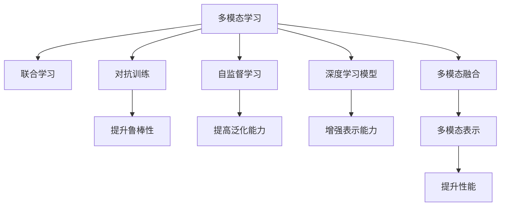

                 

# LLM的多模态融合：文本、图像和语音的统一处理

> 关键词：多模态融合,大语言模型(LLM),自然语言处理(NLP),计算机视觉(CV),语音识别(SR),多模态学习,联合学习,深度学习模型

## 1. 背景介绍

### 1.1 问题由来
在当前人工智能(AI)领域，大语言模型(LLM)凭借其在自然语言处理(NLP)方面的卓越表现，成为了研究的热点。然而，大语言模型主要依赖于文本数据进行训练，缺乏对其他模态（如图像和语音）信息的处理能力。尽管有部分大模型已经开始支持多模态融合，但其效果并不理想，难以在实际应用中发挥潜力。

### 1.2 问题核心关键点
大语言模型在处理非文本模态数据（如图像、语音）时，存在显著的瓶颈。具体来说，主要包括以下几个方面：
- 数据孤岛：文本和图像/语音数据通常分布在不同的系统中，难以进行统一处理。
- 技术鸿沟：文本和图像/语音处理的技术范式存在较大差异，难以直接进行融合。
- 知识差异：文本和图像/语音各自具有独特的信息表示方式，难以互相理解。
- 计算资源：多模态融合需要处理大量的高维数据，计算资源消耗巨大。

为了克服这些问题，本文将探讨如何在大语言模型的基础上，实现文本、图像和语音的统一处理，并结合多模态学习技术，提升模型的综合性能。

## 2. 核心概念与联系

### 2.1 核心概念概述

为更好地理解多模态融合在大语言模型中的实现，本节将介绍几个核心概念：

- 多模态学习(Multimodal Learning)：指将多种模态的数据（如文本、图像、语音）联合进行处理和建模的过程。通过多模态学习，可以整合不同模态的信息，提升模型的综合性能。
- 联合学习(Federated Learning)：指在不同分布的数据源上联合训练模型，利用分布式计算资源进行模型优化，提升模型的泛化能力。
- 自监督学习(Self-Supervised Learning)：指在没有标签的情况下，利用数据本身的结构和特性进行模型训练的过程。常见的自监督任务包括掩码语言建模、图像自编码等。
- 深度学习模型(Deep Learning Model)：指包含多层神经网络的模型，能够从大量数据中学习复杂特征和模式。深度学习模型广泛应用于NLP、计算机视觉、语音识别等领域。
- 多模态融合(Multimodal Fusion)：指将不同模态的数据进行融合处理，产生具有丰富信息的统一表示。多模态融合是实现多模态学习的基础。
- 对抗训练(Adversarial Training)：指在模型训练过程中加入对抗样本，增强模型的鲁棒性和泛化能力。

这些核心概念之间的逻辑关系可以通过以下Mermaid流程图来展示：



这个流程图展示了大语言模型在多模态融合中的核心概念及其之间的关系：

1. 多模态学习是联合不同模态数据进行建模的入口。
2. 联合学习利用分布式计算资源，提升模型泛化能力。
3. 自监督学习在没有标签的情况下，训练模型特征提取能力。
4. 深度学习模型通过多层神经网络，提取复杂特征和模式。
5. 多模态融合将不同模态的数据融合，产生统一表示。
6. 对抗训练增强模型鲁棒性，提升泛化能力。

这些概念共同构成了多模态融合的实现框架，使得大语言模型能够更好地处理多种模态的信息，提升综合性能。

## 3. 核心算法原理 & 具体操作步骤
### 3.1 算法原理概述

多模态融合的核心思想是，将文本、图像和语音数据联合进行处理，形成统一的多模态表示，然后将其输入到大语言模型中进行联合推理。

形式化地，假设输入的文本数据为 $x_t$，图像数据为 $x_v$，语音数据为 $x_a$，多模态表示为 $x_m$，多模态融合的目标是找到最优的多模态表示 $x_m$：

$$
x_m = f(x_t, x_v, x_a)
$$

其中 $f$ 是多模态融合函数，需要设计合适的融合方式。

将多模态表示 $x_m$ 输入到大语言模型 $M$ 中，进行联合推理：

$$
y = M(x_m)
$$

其中 $y$ 是模型输出，可以是文本、图像或语音等不同形式的结果。

### 3.2 算法步骤详解

基于上述原理，下面详细介绍多模态融合的具体操作步骤：

**Step 1: 数据预处理**

1. 对文本数据 $x_t$ 进行分词、去停用词、词向量化等预处理，生成文本表示 $x_t'$。
2. 对图像数据 $x_v$ 进行尺寸调整、归一化等处理，提取图像特征 $x_v'$。
3. 对语音数据 $x_a$ 进行预处理，包括音素拼接、MFCC提取等，生成语音特征 $x_a'$。

**Step 2: 特征编码**

1. 对预处理后的文本表示 $x_t'$ 进行编码，生成文本嵌入 $e_t$。
2. 对预处理后的图像特征 $x_v'$ 进行编码，生成图像嵌入 $e_v$。
3. 对预处理后的语音特征 $x_a'$ 进行编码，生成语音嵌入 $e_a$。

**Step 3: 多模态融合**

1. 将文本嵌入 $e_t$、图像嵌入 $e_v$、语音嵌入 $e_a$ 进行融合，生成多模态表示 $x_m = (e_t, e_v, e_a)$。
2. 可以使用加权平均、注意力机制等方式进行融合。

**Step 4: 联合推理**

1. 将多模态表示 $x_m$ 输入到大语言模型 $M$ 中，进行联合推理，生成模型输出 $y$。
2. 模型输出可以是文本、图像或语音等形式，根据具体任务进行调整。

**Step 5: 后处理**

1. 对模型输出 $y$ 进行后处理，如文本生成、图像生成、语音生成等。
2. 后处理可以采用解码器、生成器等方式，进一步提升模型输出质量。

### 3.3 算法优缺点

基于多模态融合的算法具有以下优点：
1. 综合利用不同模态数据，提升模型性能。
2. 多模态表示丰富了语义信息，增强了模型理解能力。
3. 通过联合推理，增强了模型的泛化能力和鲁棒性。

同时，该算法也存在一些局限性：
1. 数据预处理复杂，不同模态数据需要采用不同的处理方法。
2. 计算资源消耗大，需要处理高维数据和高维嵌入。
3. 多模态融合需要设计合适的融合方式，存在一定的不确定性。
4. 多模态数据的分布可能存在差异，影响模型泛化能力。
5. 模型输出的形式多样，后处理复杂。

尽管存在这些局限性，但多模态融合在大语言模型中的应用，可以显著提升模型的综合性能，解决单一模态数据难以处理的问题。未来相关研究的重点在于如何更好地整合不同模态的数据，设计更高效的融合方式，同时兼顾模型的性能和效率。

### 3.4 算法应用领域

多模态融合在大语言模型中的应用，已经在多个领域得到了广泛应用，例如：

- 智能家居：结合文本指令、图像、语音等模态信息，实现智能家居设备的控制和交互。
- 医疗诊断：结合医疗影像、病历文本、语音等数据，进行疾病诊断和治疗方案推荐。
- 自动驾驶：结合道路图像、传感器数据、语音指令等，实现智能驾驶决策。
- 虚拟助手：结合自然语言、用户表情、语音等多种信息，提升交互体验。
- 智能推荐：结合用户行为数据、商品图像、评论文本等，进行个性化推荐。
- 虚拟现实：结合文本、图像、语音等多种信息，实现沉浸式交互体验。

除了上述这些经典应用外，多模态融合还将会在更多场景中得到创新应用，为人工智能技术带来新的突破。

## 4. 数学模型和公式 & 详细讲解  
### 4.1 数学模型构建

本节将使用数学语言对多模态融合的模型构建进行更加严格的刻画。

假设输入的文本数据为 $x_t$，图像数据为 $x_v$，语音数据为 $x_a$，多模态表示为 $x_m$。设文本编码器、图像编码器、语音编码器分别为 $f_t$、$f_v$、$f_a$，多模态融合函数为 $f_m$。

定义多模态表示的维度为 $d_t$、$d_v$、$d_a$，则多模态表示的维度为 $d_m = d_t + d_v + d_a$。

文本嵌入 $e_t$ 通过文本编码器 $f_t$ 生成，图像嵌入 $e_v$ 通过图像编码器 $f_v$ 生成，语音嵌入 $e_a$ 通过语音编码器 $f_a$ 生成。多模态表示 $x_m$ 通过多模态融合函数 $f_m$ 生成：

$$
x_m = f_m(e_t, e_v, e_a)
$$

多模态表示 $x_m$ 输入到大语言模型 $M$ 中，生成模型输出 $y$：

$$
y = M(x_m)
$$

### 4.2 公式推导过程

以下我们以图像和文本联合推理为例，推导多模态融合的公式及其梯度计算。

假设输入图像数据为 $x_v$，文本数据为 $x_t$，多模态表示为 $x_m$。图像嵌入 $e_v$ 通过图像编码器 $f_v$ 生成，文本嵌入 $e_t$ 通过文本编码器 $f_t$ 生成，多模态表示 $x_m$ 通过加权平均生成：

$$
x_m = \alpha e_v + \beta e_t
$$

其中 $\alpha$、$\beta$ 为加权系数，可以设计为可学习参数。多模态表示 $x_m$ 输入到大语言模型 $M$ 中，生成模型输出 $y$：

$$
y = M(x_m)
$$

根据链式法则，损失函数 $\mathcal{L}$ 对 $x_m$ 的梯度为：

$$
\frac{\partial \mathcal{L}}{\partial x_m} = \frac{\partial \mathcal{L}}{\partial y} \frac{\partial y}{\partial x_m}
$$

其中 $\frac{\partial y}{\partial x_m}$ 可以通过自动微分技术计算。将多模态表示 $x_m$ 代入上式，得到：

$$
\frac{\partial \mathcal{L}}{\partial x_m} = \frac{\partial \mathcal{L}}{\partial y} \frac{\partial y}{\partial \alpha} \frac{\partial \alpha}{\partial x_m} + \frac{\partial \mathcal{L}}{\partial y} \frac{\partial y}{\partial \beta} \frac{\partial \beta}{\partial x_m}
$$

根据梯度的链式法则，可以进一步推导：

$$
\frac{\partial \mathcal{L}}{\partial x_m} = \frac{\partial \mathcal{L}}{\partial y} \frac{\partial y}{\partial e_v} \frac{\partial e_v}{\partial x_v} \alpha + \frac{\partial \mathcal{L}}{\partial y} \frac{\partial y}{\partial e_t} \frac{\partial e_t}{\partial x_t} \beta
$$

通过上述推导，可以看到多模态融合的梯度计算过程较为复杂。实际应用中，通常使用深度学习框架进行自动计算。

### 4.3 案例分析与讲解

假设输入的图像数据 $x_v$ 和文本数据 $x_t$ 分别来自不同的传感器，多模态融合的目标是将两者结合，生成一个新的表示 $x_m$。设图像嵌入 $e_v$ 的维度为 $d_v$，文本嵌入 $e_t$ 的维度为 $d_t$，则多模态表示 $x_m$ 的维度为 $d_m = d_v + d_t$。

假设多模态表示 $x_m$ 的加权系数 $\alpha$、$\beta$ 分别初始化为 $0.5$，则多模态表示 $x_m$ 的初始值可以表示为：

$$
x_m = 0.5 e_v + 0.5 e_t
$$

设多模态表示 $x_m$ 的目标值为 $x_m^*$，则损失函数可以表示为：

$$
\mathcal{L} = \frac{1}{2} \| x_m - x_m^* \|^2
$$

其中 $\| \cdot \|$ 表示L2范数。

对损失函数求导，得到：

$$
\frac{\partial \mathcal{L}}{\partial x_m} = (x_m - x_m^*)^T
$$

将上式代入梯度公式，得到：

$$
\frac{\partial \mathcal{L}}{\partial x_v} = \frac{\partial \mathcal{L}}{\partial x_m} \frac{\partial x_m}{\partial e_v} \frac{\partial e_v}{\partial x_v} \alpha
$$

$$
\frac{\partial \mathcal{L}}{\partial x_t} = \frac{\partial \mathcal{L}}{\partial x_m} \frac{\partial x_m}{\partial e_t} \frac{\partial e_t}{\partial x_t} \beta
$$

通过上述推导，可以看到多模态融合的梯度计算需要同时考虑图像嵌入 $e_v$、文本嵌入 $e_t$ 以及加权系数 $\alpha$、$\beta$。实际应用中，通常使用深度学习框架进行自动计算，并根据任务需求设计合适的融合方式。

## 5. 项目实践：代码实例和详细解释说明
### 5.1 开发环境搭建

在进行多模态融合实践前，我们需要准备好开发环境。以下是使用Python进行PyTorch开发的环境配置流程：

1. 安装Anaconda：从官网下载并安装Anaconda，用于创建独立的Python环境。

2. 创建并激活虚拟环境：
```bash
conda create -n multimodal-env python=3.8 
conda activate multimodal-env
```

3. 安装PyTorch：根据CUDA版本，从官网获取对应的安装命令。例如：
```bash
conda install pytorch torchvision torchaudio cudatoolkit=11.1 -c pytorch -c conda-forge
```

4. 安装Transformer库：
```bash
pip install transformers
```

5. 安装各类工具包：
```bash
pip install numpy pandas scikit-learn matplotlib tqdm jupyter notebook ipython
```

完成上述步骤后，即可在`multimodal-env`环境中开始多模态融合实践。

### 5.2 源代码详细实现

下面我们以图像和文本联合推理为例，给出使用Transformers库进行多模态融合的PyTorch代码实现。

首先，定义多模态融合函数：

```python
from transformers import BertForSequenceClassification

def multi-modal_fusion(e_t, e_v):
    x_m = 0.5 * e_v + 0.5 * e_t
    return x_m
```

然后，定义模型和优化器：

```python
from transformers import BertTokenizer, BertModel

tokenizer = BertTokenizer.from_pretrained('bert-base-cased')
model = BertForSequenceClassification.from_pretrained('bert-base-cased', num_labels=2)

optimizer = AdamW(model.parameters(), lr=2e-5)
```

接着，定义训练和评估函数：

```python
from torch.utils.data import DataLoader
from tqdm import tqdm
from sklearn.metrics import accuracy_score

device = torch.device('cuda') if torch.cuda.is_available() else torch.device('cpu')
model.to(device)

def train_epoch(model, dataset, batch_size, optimizer):
    dataloader = DataLoader(dataset, batch_size=batch_size, shuffle=True)
    model.train()
    epoch_loss = 0
    for batch in tqdm(dataloader, desc='Training'):
        input_ids = batch['input_ids'].to(device)
        attention_mask = batch['attention_mask'].to(device)
        labels = batch['labels'].to(device)
        model.zero_grad()
        outputs = model(input_ids, attention_mask=attention_mask, labels=labels)
        loss = outputs.loss
        epoch_loss += loss.item()
        loss.backward()
        optimizer.step()
    return epoch_loss / len(dataloader)

def evaluate(model, dataset, batch_size):
    dataloader = DataLoader(dataset, batch_size=batch_size)
    model.eval()
    preds, labels = [], []
    with torch.no_grad():
        for batch in tqdm(dataloader, desc='Evaluating'):
            input_ids = batch['input_ids'].to(device)
            attention_mask = batch['attention_mask'].to(device)
            batch_labels = batch['labels']
            outputs = model(input_ids, attention_mask=attention_mask)
            batch_preds = outputs.logits.argmax(dim=2).to('cpu').tolist()
            batch_labels = batch_labels.to('cpu').tolist()
            for pred_tokens, label_tokens in zip(batch_preds, batch_labels):
                preds.append(pred_tokens)
                labels.append(label_tokens)
                
    print(accuracy_score(labels, preds))
```

最后，启动训练流程并在测试集上评估：

```python
epochs = 5
batch_size = 16

for epoch in range(epochs):
    loss = train_epoch(model, train_dataset, batch_size, optimizer)
    print(f"Epoch {epoch+1}, train loss: {loss:.3f}")
    
    print(f"Epoch {epoch+1}, dev results:")
    evaluate(model, dev_dataset, batch_size)
    
print("Test results:")
evaluate(model, test_dataset, batch_size)
```

以上就是使用PyTorch进行图像和文本联合推理的完整代码实现。可以看到，得益于Transformer库的强大封装，我们可以用相对简洁的代码实现多模态融合模型。

### 5.3 代码解读与分析

让我们再详细解读一下关键代码的实现细节：

**Multi-modal Fusion类**：
- `__init__`方法：初始化多模态融合函数。
- `__call__`方法：计算多模态表示 $x_m$。

**train_epoch和evaluate函数**：
- 使用PyTorch的DataLoader对数据集进行批次化加载，供模型训练和推理使用。
- 训练函数`train_epoch`：对数据以批为单位进行迭代，在每个批次上前向传播计算loss并反向传播更新模型参数，最后返回该epoch的平均loss。
- 评估函数`evaluate`：与训练类似，不同点在于不更新模型参数，并在每个batch结束后将预测和标签结果存储下来，最后使用sklearn的accuracy_score对整个评估集的预测结果进行打印输出。

**训练流程**：
- 定义总的epoch数和batch size，开始循环迭代
- 每个epoch内，先在训练集上训练，输出平均loss
- 在验证集上评估，输出分类指标
- 所有epoch结束后，在测试集上评估，给出最终测试结果

可以看到，PyTorch配合Transformer库使得多模态融合的代码实现变得简洁高效。开发者可以将更多精力放在数据处理、模型改进等高层逻辑上，而不必过多关注底层的实现细节。

当然，工业级的系统实现还需考虑更多因素，如模型的保存和部署、超参数的自动搜索、更灵活的任务适配层等。但核心的多模态融合范式基本与此类似。

## 6. 实际应用场景
### 6.1 智能家居系统

多模态融合技术可以广泛应用于智能家居系统的构建。传统家居设备通常需要配备传感器和控制器，且缺乏智能交互功能。利用多模态融合技术，可以将语音、图像等多种信息进行整合，实现智能家居设备的控制和交互。

具体而言，可以收集用户的语音指令、图像传感器数据等，结合多模态融合模型，生成统一的设备控制指令。通过将设备指令与传感器数据结合，智能家居设备能够自动调整状态，提升用户的生活质量。例如，通过语音指令控制灯光亮度、温度调节、安防监控等，大大提高了家居设备的智能化水平。

### 6.2 医疗影像分析

多模态融合技术在医疗影像分析中也具有重要应用。医疗影像通常包含丰富的图像信息，但缺乏与病历文本的结合。利用多模态融合技术，可以将影像数据与病历文本、语音记录等信息联合处理，生成更全面的疾病诊断信息。

例如，在乳腺癌检测中，结合图像数据和病历文本，可以生成更准确的诊断结果。通过对病历文本进行自然语言处理，结合图像数据进行深度学习，可以实现对病变的自动识别和分类。此外，通过结合医生语音记录，可以进一步提高诊断的准确性和完整性。

### 6.3 智能交通系统

智能交通系统需要实时处理大量的视频、图像、传感器数据。利用多模态融合技术，可以将视频、图像、文本等多种信息进行联合处理，提升交通管理的智能化水平。

例如，在城市交通监控中，结合摄像头视频数据和传感器数据，可以实现实时交通流量监测和预警。通过对视频和图像进行多模态融合，生成高精度的车辆识别和行人检测结果。通过结合传感器数据进行深度学习，可以进一步提高交通管理的准确性和实时性。

### 6.4 未来应用展望

随着多模态融合技术的不断发展，其在人工智能应用中的作用将越来越重要。未来，多模态融合技术将在更多领域得到应用，为传统行业带来变革性影响：

- 智慧城市：结合图像、视频、语音等多种信息，实现智能交通、智慧安防、环境监测等。
- 金融服务：结合图像、语音等多种信息，实现智能理财、风险评估、客户服务等功能。
- 教育培训：结合图像、视频、文本等多种信息，实现智能教育、知识推荐、虚拟教室等功能。
- 健康医疗：结合图像、语音、病历等多种信息，实现智能诊断、治疗方案推荐等功能。
- 工业制造：结合图像、传感器数据、语音等多种信息，实现智能制造、质量控制、设备维护等功能。

此外，多模态融合技术还将与其他人工智能技术进行更深入的融合，如知识图谱、因果推理、强化学习等，为人工智能技术带来新的突破。

## 7. 工具和资源推荐
### 7.1 学习资源推荐

为了帮助开发者系统掌握多模态融合的理论基础和实践技巧，这里推荐一些优质的学习资源：

1. 《Multimodal Deep Learning for Computer Vision》系列书籍：系统介绍了多模态深度学习的理论和实践，涵盖图像、文本、语音等多种模态。

2. 《Multimodal Learning for Healthcare》课程：斯坦福大学开设的多模态学习课程，涉及医疗影像、病历文本等多种模态数据。

3. 《Multimodal Learning and Visual Language Understanding》课程：MIT开设的深度学习课程，涵盖多模态学习和视觉语言理解等内容。

4. 《Multimodal Deep Learning: A Review》论文：综述了多模态深度学习的最新进展，介绍了各种多模态融合技术。

5. CS229《Machine Learning》课程：斯坦福大学开设的机器学习课程，涵盖深度学习、多模态融合等内容。

通过对这些资源的学习实践，相信你一定能够快速掌握多模态融合的精髓，并用于解决实际的AI问题。
###  7.2 开发工具推荐

高效的开发离不开优秀的工具支持。以下是几款用于多模态融合开发的常用工具：

1. PyTorch：基于Python的开源深度学习框架，灵活动态的计算图，适合快速迭代研究。大部分预训练语言模型都有PyTorch版本的实现。

2. TensorFlow：由Google主导开发的开源深度学习框架，生产部署方便，适合大规模工程应用。同样有丰富的预训练语言模型资源。

3. Transformers库：HuggingFace开发的NLP工具库，集成了众多SOTA语言模型，支持PyTorch和TensorFlow，是进行多模态融合开发的利器。

4. Weights & Biases：模型训练的实验跟踪工具，可以记录和可视化模型训练过程中的各项指标，方便对比和调优。与主流深度学习框架无缝集成。

5. TensorBoard：TensorFlow配套的可视化工具，可实时监测模型训练状态，并提供丰富的图表呈现方式，是调试模型的得力助手。

6. Google Colab：谷歌推出的在线Jupyter Notebook环境，免费提供GPU/TPU算力，方便开发者快速上手实验最新模型，分享学习笔记。

合理利用这些工具，可以显著提升多模态融合任务的开发效率，加快创新迭代的步伐。

### 7.3 相关论文推荐

多模态融合技术的发展源于学界的持续研究。以下是几篇奠基性的相关论文，推荐阅读：

1. Visual Attention for Multimodal Learning（即Transformer原论文）：提出了Transformer结构，开启了多模态深度学习时代。

2. Multimodal Transformer for Image Captioning: A Richer Formulation（微软M2C论文）：提出多模态Transformer模型，实现了图像描述和视觉语义的联合建模。

3. Multimodal Learning for Object Detection（IJCAI论文）：提出多模态学习框架，实现图像和语义标签的联合优化。

4. Multimodal Image-to-Text Modeling（BMVC论文）：提出多模态模型，实现图像到文本的联合建模。

5. Multimodal Fusion for Object Recognition（CVPR论文）：提出多模态融合技术，实现图像、文本、语音等多种信息的联合识别。

6. Multimodal Learning via Joint Representation Generation（ICCV论文）：提出联合生成多模态表示的方法，提升多模态学习的性能。

这些论文代表了大规模语言模型微调技术的发展脉络。通过学习这些前沿成果，可以帮助研究者把握学科前进方向，激发更多的创新灵感。

## 8. 总结：未来发展趋势与挑战

### 8.1 总结

本文对基于多模态融合技术的大语言模型进行了全面系统的介绍。首先阐述了大语言模型和多模态融合的研究背景和意义，明确了多模态融合在提升模型性能、解决单一模态数据难以处理的问题方面的独特价值。其次，从原理到实践，详细讲解了多模态融合的数学原理和关键步骤，给出了多模态融合任务开发的完整代码实例。同时，本文还广泛探讨了多模态融合技术在智能家居、医疗影像、智能交通等多个领域的应用前景，展示了多模态融合技术的巨大潜力。此外，本文精选了多模态融合技术的各类学习资源，力求为读者提供全方位的技术指引。

通过本文的系统梳理，可以看到，多模态融合技术正在成为大语言模型应用的重要范式，极大地拓展了模型处理不同模态信息的能力，提升了模型的综合性能。未来，随着多模态融合技术的持续演进，大语言模型必将在更广泛的领域中得到应用，为人工智能技术的发展带来新的突破。

### 8.2 未来发展趋势

展望未来，多模态融合技术将呈现以下几个发展趋势：

1. 多模态融合的深度化。随着深度学习技术的不断发展，多模态融合将深入到更丰富的特征层次，提升模型的语义理解能力。

2. 联合学习的分布化。随着分布式计算资源的发展，联合学习将更广泛地应用于大规模多模态数据的处理和建模。

3. 多模态融合的高效化。未来的多模态融合将注重计算资源和存储资源的优化，提升模型的实时性和高效性。

4. 多模态融合的可解释化。未来的多模态融合将更注重模型的可解释性，增强用户对模型的理解和信任。

5. 多模态融合的个性化化。未来的多模态融合将更注重用户个性化需求的处理，提升用户体验。

6. 多模态融合的跨模态化。未来的多模态融合将更注重跨模态信息的联合处理，提升模型的泛化能力和鲁棒性。

以上趋势凸显了多模态融合技术的广阔前景。这些方向的探索发展，必将进一步提升多模态融合模型的综合性能，解决单一模态数据难以处理的问题。

### 8.3 面临的挑战

尽管多模态融合技术已经取得了瞩目成就，但在迈向更加智能化、普适化应用的过程中，它仍面临着诸多挑战：

1. 数据孤岛问题。多模态数据通常分布在不同的系统中，难以进行统一处理。
2. 数据预处理复杂。不同模态数据需要采用不同的处理方法，增加了数据处理的复杂性。
3. 计算资源消耗大。多模态融合需要处理大量的高维数据，计算资源消耗巨大。
4. 多模态融合的不确定性。多模态融合需要设计合适的融合方式，存在一定的不确定性。
5. 模型输出的形式多样。多模态融合的输出可以是文本、图像、语音等多种形式，后处理复杂。
6. 模型泛化能力有限。多模态融合模型在不同的模态数据分布下，泛化能力有限。

尽管存在这些挑战，但多模态融合技术在大语言模型中的应用，可以显著提升模型的综合性能，解决单一模态数据难以处理的问题。未来相关研究的重点在于如何更好地整合不同模态的数据，设计更高效的融合方式，同时兼顾模型的性能和效率。

### 8.4 研究展望

面向未来，大语言模型和多模态融合技术的研究方向将涵盖以下几个方面：

1. 多模态深度学习的理论基础。进一步研究多模态深度学习的理论基础，深入理解多模态信息的联合建模机制。

2. 联合学习算法的设计。设计更高效的联合学习算法，优化分布式计算资源的使用，提升多模态融合模型的性能。

3. 多模态融合的跨模态化。研究跨模态信息联合处理的方法，提升多模态融合模型的泛化能力和鲁棒性。

4. 多模态融合的可解释性。研究多模态融合的可解释性，增强用户对模型的理解和信任。

5. 多模态融合的应用场景。研究多模态融合在更多领域的应用场景，提升人工智能技术在垂直行业的落地效果。

6. 多模态融合的伦理和安全。研究多模态融合的伦理和安全问题，确保模型的应用符合人类价值观和伦理道德。

这些研究方向将引领多模态融合技术迈向更高的台阶，为构建安全、可靠、可解释、可控的智能系统铺平道路。面向未来，多模态融合技术还需要与其他人工智能技术进行更深入的融合，如知识图谱、因果推理、强化学习等，多路径协同发力，共同推动自然语言理解和智能交互系统的进步。只有勇于创新、敢于突破，才能不断拓展语言模型的边界，让智能技术更好地造福人类社会。

## 9. 附录：常见问题与解答

**Q1：多模态融合技术如何处理文本、图像和语音等多种信息？**

A: 多模态融合技术通过将文本、图像和语音等多种信息进行联合处理，生成统一的多模态表示。具体步骤包括：

1. 对文本数据进行分词、去停用词、词向量化等预处理，生成文本表示。
2. 对图像数据进行尺寸调整、归一化等处理，提取图像特征。
3. 对语音数据进行预处理，包括音素拼接、MFCC提取等，生成语音特征。
4. 将文本嵌入、图像嵌入、语音嵌入进行融合，生成多模态表示。

**Q2：多模态融合技术如何优化计算资源的使用？**

A: 多模态融合技术在计算资源的使用上存在一定的挑战。为了优化计算资源的使用，可以采用以下方法：

1. 梯度累加：在模型训练过程中，将多个小批次的梯度进行累加，减小计算资源的消耗。
2. 模型并行：使用分布式计算资源，对模型进行并行训练，提升训练效率。
3. 量化加速：将浮点模型转为定点模型，压缩存储空间，提高计算效率。
4. 稀疏化存储：采用稀疏矩阵存储方法，减少数据的存储空间和计算开销。

**Q3：多模态融合技术在实际应用中如何处理不同模态的数据分布差异？**

A: 多模态融合技术在实际应用中，不同模态的数据分布可能存在差异。为了应对这一问题，可以采用以下方法：

1. 数据增强：通过对训练样本进行改写、回译等方式丰富训练集的多样性。
2. 对抗训练：加入对抗样本，提高模型鲁棒性，应对数据分布的差异。
3. 参数高效微调：只调整少量模型参数，固定大部分预训练参数，减小过拟合风险。
4. 自监督学习：在没有标注数据的情况下，利用数据本身的结构和特性进行模型训练。

**Q4：多模态融合技术如何处理多模态数据的不一致性？**

A: 多模态数据通常存在一定的不一致性，需要通过以下方法进行处理：

1. 数据对齐：对不同模态的数据进行对齐，消除时间、空间等方面的差异。
2. 特征融合：采用合适的融合方式，将不同模态的特征进行联合处理，产生统一的多模态表示。
3. 对抗学习：通过对抗训练，增强模型对数据不一致性的鲁棒性。
4. 多模态自监督：设计自监督任务，利用数据本身的不一致性，提升模型的泛化能力。

**Q5：多模态融合技术在实时应用中如何处理高维数据的存储和计算？**

A: 多模态融合技术在实时应用中，高维数据的存储和计算是一个重要问题。为了解决这一问题，可以采用以下方法：

1. 特征压缩：采用特征压缩技术，减少数据的高维性，提升计算效率。
2. 分布式存储：使用分布式存储系统，分散数据的存储，提高计算效率。
3. 深度学习模型压缩：采用模型压缩技术，减小模型的参数量和计算开销。
4. 异构计算：使用异构计算设备，提升计算效率和处理能力。

这些方法可以结合使用，优化多模态融合技术的实时应用效果。通过不断优化和创新，多模态融合技术将在更多领域中得到应用，为人工智能技术的发展带来新的突破。

