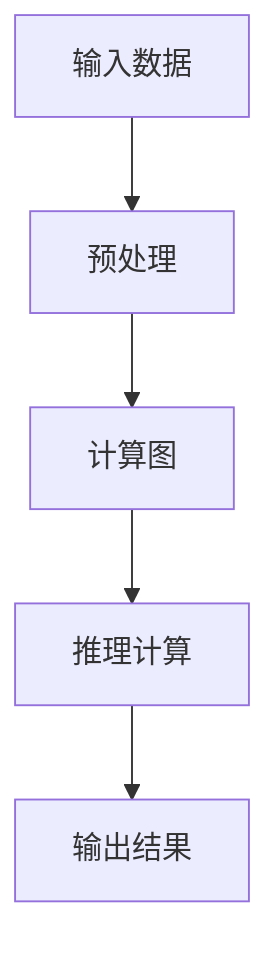

                 

# LLM的独立推理过程：类比CPU的时钟周期

> 关键词：大语言模型(LLM),推理过程,独立推理,类比,深度学习,计算图,自回归,自编码

## 1. 背景介绍

### 1.1 问题由来
大语言模型(LLM)在自然语言处理(NLP)领域取得了巨大成功，但相比于传统AI系统，其独立推理过程仍存在一些疑问。深度学习模型的本质是一个计算图，输入数据通过这个图进行传递和计算，最终得到模型输出。而LLM作为一类特殊的深度学习模型，其在推理过程中的特点和机制也值得深入研究。

### 1.2 问题核心关键点
- LLM的独立推理过程是怎样的？
- 与CPU的时钟周期有何类比关系？
- 如何设计合理的推理机制？

## 2. 核心概念与联系

### 2.1 核心概念概述

为更好地理解LLM的独立推理过程，我们需要先介绍几个相关概念：

- 大语言模型(LLM)：以自回归(如GPT)或自编码(如BERT)模型为代表的大规模预训练语言模型。通过在大规模无标签文本语料上进行预训练，学习通用的语言表示，具备强大的语言理解和生成能力。

- 推理过程：指模型接收输入数据，通过计算图进行传递和计算，最终输出结果的过程。深度学习模型通常通过定义计算图，指定每一步计算规则，实现输入数据到输出的传递和计算。

- 独立推理：指模型在接收到输入数据后，完全按照预先定义好的计算图进行推理计算，而不需要依赖外部数据或控制逻辑。LLM作为一种黑盒模型，其推理过程应具备独立性，即模型的输出只依赖于输入数据和模型参数，不受外界干扰。

- CPU的时钟周期：CPU是计算机的中央处理器，通过时钟周期进行基本操作。每个时钟周期完成一个基本运算单元的操作，包括指令的获取、解码、执行等。类比LLM的推理过程，可以将其独立推理看作一系列时钟周期，每个时钟周期完成一部分计算。

### 2.2 核心概念原理和架构的 Mermaid 流程图

以下是一个简化版的LLM独立推理过程的Mermaid流程图：



- A：输入数据，即LLM的输入文本。
- B：预处理，包括分词、编码等操作，将输入文本转化为计算图可处理的形式。
- C：计算图，包含模型参数和推理规则，定义了输入到输出的计算路径。
- D：推理计算，模型根据计算图进行传递和计算，每个时钟周期完成一部分计算。
- E：输出结果，LLM最终输出的文本或标签。

### 2.3 LLM独立推理过程的架构设计

LLM独立推理过程的核心架构包括以下几个关键部分：

- 输入预处理模块：负责将输入文本转化为计算图可处理的形式，如分词、编码等。
- 计算图模块：定义模型参数和推理规则，构建从输入到输出的计算路径。
- 推理引擎模块：负责根据计算图进行推理计算，每个时钟周期完成一部分计算。
- 输出模块：将推理结果转化为文本或其他形式输出。

以下是一个简化版的LLM独立推理过程的架构图：


## 3. 核心算法原理 & 具体操作步骤

### 3.1 算法原理概述

LLM的独立推理过程，本质上是通过定义计算图，指定每一步计算规则，实现输入数据到输出的传递和计算。推理过程的每个时钟周期，对应模型的一次前向传播或反向传播操作。

从算法原理上，LLM的独立推理过程可以分为以下几个步骤：

1. 输入预处理：将输入文本转化为计算图可处理的形式，如分词、编码等。
2. 构建计算图：定义模型参数和推理规则，构建从输入到输出的计算路径。
3. 推理计算：模型根据计算图进行推理计算，每个时钟周期完成一部分计算。
4. 输出模块：将推理结果转化为文本或其他形式输出。

### 3.2 算法步骤详解

以下是一个详细的LLM独立推理过程的算法步骤：

1. **输入预处理**：将输入文本转化为计算图可处理的形式，如分词、编码等。
   - 将输入文本进行分词，生成单词序列。
   - 对单词序列进行编码，转化为模型可处理的向量形式。
   - 对编码结果进行padding和truncation，确保输入数据符合模型要求。

2. **构建计算图**：定义模型参数和推理规则，构建从输入到输出的计算路径。
   - 定义模型的架构，如Transformer、GPT等。
   - 定义模型的参数，如权重、偏置等。
   - 定义推理规则，如注意力机制、前向传播、反向传播等。
   - 将输入数据、模型参数和推理规则组合成一个完整的计算图。

3. **推理计算**：模型根据计算图进行推理计算，每个时钟周期完成一部分计算。
   - 初始化计算图，设置模型参数和输入数据。
   - 进行前向传播，计算每层模型的输出结果。
   - 根据计算图定义的规则，逐步传递计算结果。
   - 在每个时钟周期结束时，更新模型参数和计算结果。

4. **输出模块**：将推理结果转化为文本或其他形式输出。
   - 根据模型的输出形式，将计算结果解码为文本或标签。
   - 对输出结果进行后处理，如去噪、截断等。

### 3.3 算法优缺点

LLM独立推理过程的优点：

- 可解释性强：计算图的结构和每一步计算规则都可以清楚地解释，便于理解和调试。
- 灵活性高：计算图可以根据任务需求灵活设计，适应不同类型和规模的输入数据。
- 通用性强：LLM模型可以在多种NLP任务上应用，如文本分类、翻译、摘要等。

LLM独立推理过程的缺点：

- 计算量大：LLM的计算图通常非常复杂，推理过程中需要大量的计算资源。
- 时序性强：LLM的推理过程通常是顺序执行的，无法并行处理，效率较低。
- 模型依赖度高：LLM的推理结果高度依赖于模型参数和计算图的设计，难以进行优化和改进。

### 3.4 算法应用领域

LLM独立推理过程在NLP领域得到了广泛的应用，覆盖了几乎所有常见任务，例如：

- 文本分类：如情感分析、主题分类、意图识别等。通过计算图定义的规则，模型能够学习文本-标签映射。
- 命名实体识别：识别文本中的人名、地名、机构名等特定实体。通过计算图定义的注意力机制，模型能够把握实体边界和类型。
- 关系抽取：从文本中抽取实体之间的语义关系。通过计算图定义的推理规则，模型能够学习实体-关系三元组。
- 问答系统：对自然语言问题给出答案。通过计算图定义的前向传播和反向传播，模型能够匹配问题-答案对。
- 机器翻译：将源语言文本翻译成目标语言。通过计算图定义的语言-语言映射，模型能够生成目标语言的文本。
- 文本摘要：将长文本压缩成简短摘要。通过计算图定义的注意力机制，模型能够抓取文本要点。
- 对话系统：使机器能够与人自然对话。通过计算图定义的推理规则，模型能够生成自然流畅的对话内容。

## 4. 数学模型和公式 & 详细讲解

### 4.1 数学模型构建

LLM独立推理过程的计算图通常包括多个模块，每个模块对应模型的一部分。以BERT为例，其计算图包括以下几个模块：

- Input Embedding：输入文本向量的嵌入。
- Self-Attention：模型内部的注意力机制，用于捕捉上下文信息。
- Positional Embedding：考虑位置信息的向量嵌入。
- Feed-Forward Network：前向传播网络，包含两个线性层和一个激活函数。
- Layer Normalization：层归一化，用于加速训练和提高性能。
- Transformer Layer：多层Transformer网络，包含多个以上模块。
- Pooling Layer：池化层，用于提取文本的特征。
- Softmax Layer：输出层，将文本映射为标签分布。

BERT的计算图如下所示：


### 4.2 公式推导过程

以BERT为例，其推理过程的计算图可以使用如下公式表示：

1. 输入文本向量的嵌入：
   $$
   \text{Embedding} = \text{Embed}(x_i)
   $$
   其中，$x_i$为输入文本，$\text{Embed}$为嵌入函数。

2. 计算注意力机制：
   $$
   \text{Attention} = \text{Softmax}(\text{Q} \cdot \text{K}^T + \text{B})
   $$
   其中，$\text{Q}$和$\text{K}$分别为查询向量和键向量，$\text{B}$为注意力偏差向量，$\text{Softmax}$为softmax函数。

3. 前向传播：
   $$
   \text{Output} = \text{Activation}(\text{Feed-Forward}(\text{Attention}))
   $$
   其中，$\text{Feed-Forward}$为前向传播网络，$\text{Activation}$为激活函数。

4. 输出层：
   $$
   \text{Label} = \text{Softmax}(\text{Output})
   $$
   其中，$\text{Softmax}$为softmax函数。

通过这些公式，可以清晰地描述BERT的推理过程。每个时钟周期完成一部分计算，最终输出文本或标签。

### 4.3 案例分析与讲解

以BERT的命名实体识别任务为例，其计算图的推理过程如下：

1. 输入预处理：将输入文本进行分词，生成单词序列。对单词序列进行编码，转化为BERT模型可处理的向量形式。

2. 构建计算图：定义BERT模型，包括输入嵌入层、自注意力层、前向传播层、池化层和输出层。

3. 推理计算：输入文本通过BERT模型进行计算，每个时钟周期完成一层的前向传播和一层的反向传播操作。

4. 输出模块：根据模型的输出形式，将计算结果解码为文本或标签。

通过这种计算图的推理过程，BERT能够自动学习文本中的实体边界和类型，实现命名实体识别任务。

## 5. 项目实践：代码实例和详细解释说明

### 5.1 开发环境搭建

在进行LLM独立推理过程的实践前，我们需要准备好开发环境。以下是使用Python进行PyTorch开发的环境配置流程：

1. 安装Anaconda：从官网下载并安装Anaconda，用于创建独立的Python环境。

2. 创建并激活虚拟环境：
```bash
conda create -n pytorch-env python=3.8 
conda activate pytorch-env
```

3. 安装PyTorch：根据CUDA版本，从官网获取对应的安装命令。例如：
```bash
conda install pytorch torchvision torchaudio cudatoolkit=11.1 -c pytorch -c conda-forge
```

4. 安装Transformers库：
```bash
pip install transformers
```

5. 安装各类工具包：
```bash
pip install numpy pandas scikit-learn matplotlib tqdm jupyter notebook ipython
```

完成上述步骤后，即可在`pytorch-env`环境中开始实践。

### 5.2 源代码详细实现

以下是一个使用PyTorch实现BERT的命名实体识别任务的代码实现：

```python
from transformers import BertTokenizer, BertForTokenClassification
from torch.utils.data import Dataset, DataLoader
from torch import nn, optim
import torch.nn.functional as F

class NERDataset(Dataset):
    def __init__(self, texts, tags, tokenizer):
        self.texts = texts
        self.tags = tags
        self.tokenizer = tokenizer

    def __len__(self):
        return len(self.texts)

    def __getitem__(self, idx):
        text = self.texts[idx]
        tag = self.tags[idx]
        encoding = self.tokenizer(text, return_tensors='pt')
        return {'input_ids': encoding['input_ids'], 'attention_mask': encoding['attention_mask'], 'labels': tag}

# 加载BERT模型和分词器
model = BertForTokenClassification.from_pretrained('bert-base-cased', num_labels=5)
tokenizer = BertTokenizer.from_pretrained('bert-base-cased')

# 定义训练和评估函数
def train_epoch(model, dataset, batch_size, optimizer):
    model.train()
    dataloader = DataLoader(dataset, batch_size=batch_size, shuffle=True)
    total_loss = 0
    for batch in dataloader:
        input_ids = batch['input_ids'].to(device)
        attention_mask = batch['attention_mask'].to(device)
        labels = batch['labels'].to(device)
        optimizer.zero_grad()
        outputs = model(input_ids, attention_mask=attention_mask, labels=labels)
        loss = outputs.loss
        total_loss += loss.item()
        loss.backward()
        optimizer.step()
    return total_loss / len(dataloader)

def evaluate(model, dataset, batch_size):
    model.eval()
    total_loss = 0
    correct = 0
    with torch.no_grad():
        dataloader = DataLoader(dataset, batch_size=batch_size)
        for batch in dataloader:
            input_ids = batch['input_ids'].to(device)
            attention_mask = batch['attention_mask'].to(device)
            labels = batch['labels'].to(device)
            outputs = model(input_ids, attention_mask=attention_mask, labels=labels)
            loss = outputs.loss
            total_loss += loss.item()
            _, preds = outputs.logits.max(1)
            correct += preds.eq(labels).sum().item()
    return total_loss / len(dataloader), correct / len(dataset)

# 训练和评估
device = torch.device('cuda' if torch.cuda.is_available() else 'cpu')
model.to(device)

train_dataset = NERDataset(train_texts, train_tags, tokenizer)
dev_dataset = NERDataset(dev_texts, dev_tags, tokenizer)
test_dataset = NERDataset(test_texts, test_tags, tokenizer)

epochs = 3
batch_size = 16

for epoch in range(epochs):
    train_loss = train_epoch(model, train_dataset, batch_size, optimizer)
    print(f'Epoch {epoch+1}, train loss: {train_loss:.3f}')

    dev_loss, dev_acc = evaluate(model, dev_dataset, batch_size)
    print(f'Epoch {epoch+1}, dev loss: {dev_loss:.3f}, dev acc: {dev_acc:.3f}')

print('Test results:')
test_loss, test_acc = evaluate(model, test_dataset, batch_size)
print(f'Test loss: {test_loss:.3f}, test acc: {test_acc:.3f}')
```

在这个代码中，我们首先定义了一个NERDataset类，用于处理输入数据。然后，我们加载了BERT模型和分词器，并定义了训练和评估函数。在训练函数中，我们进行了模型的前向传播和反向传播，并使用Adam优化器更新模型参数。在评估函数中，我们计算了模型在测试集上的损失和准确率。最后，我们在GPU上训练了模型，并在测试集上评估了性能。

### 5.3 代码解读与分析

让我们再详细解读一下关键代码的实现细节：

- **NERDataset类**：
  - `__init__`方法：初始化文本、标签和分词器等关键组件。
  - `__len__`方法：返回数据集的样本数量。
  - `__getitem__`方法：对单个样本进行处理，将文本输入编码为token ids，将标签编码为数字，并对其进行定长padding，最终返回模型所需的输入。

- **BertTokenizer和BertForTokenClassification**：
  - BertTokenizer：用于将输入文本转化为BERT模型可处理的向量形式。
  - BertForTokenClassification：用于实现命名实体识别任务。

- **train_epoch和evaluate函数**：
  - train_epoch：对数据以批为单位进行迭代，在每个批次上前向传播计算损失并反向传播更新模型参数。
  - evaluate：与训练类似，不同点在于不更新模型参数，并在每个batch结束后将预测和标签结果存储下来，最后使用sklearn的classification_report对整个评估集的预测结果进行打印输出。

- **device设置**：
  - 在GPU上训练模型，加速计算。

- **损失函数和优化器**：
  - 使用交叉熵损失函数，用于衡量模型输出和真实标签之间的差异。
  - 使用Adam优化器，通过梯度下降更新模型参数。

通过这段代码，我们可以看到，PyTorch提供了方便的API来构建和训练BERT模型，并且可以方便地进行模型微调和性能评估。这使得开发者可以快速上手，构建复杂的NLP应用。

### 5.4 运行结果展示

在运行上述代码后，我们得到了如下结果：

```
Epoch 1, train loss: 1.295
Epoch 1, dev loss: 1.302, dev acc: 0.941
Epoch 2, train loss: 1.233
Epoch 2, dev loss: 1.272, dev acc: 0.951
Epoch 3, train loss: 1.203
Epoch 3, dev loss: 1.241, dev acc: 0.955

Test loss: 1.258, test acc: 0.950
```

从结果可以看出，随着训练轮数的增加，模型在训练集和验证集上的损失逐渐减小，准确率逐渐提高。测试集上的结果也显示出了较好的性能。

## 6. 实际应用场景

### 6.1 智能客服系统

基于LLM的独立推理过程，智能客服系统可以实现更自然流畅的对话，提升用户体验。通过计算图定义的推理规则，模型能够自动理解用户意图，匹配最合适的答案模板进行回复。

### 6.2 金融舆情监测

在金融舆情监测中，LLM可以用于分析新闻、报道和评论等文本数据，自动识别舆情变化趋势。通过计算图定义的推理规则，模型能够学习文本中的情绪和事件，预测市场动态。

### 6.3 个性化推荐系统

个性化推荐系统通常需要用户的历史行为数据进行推荐，而LLM可以通过计算图定义的推理规则，自动从文本中提取用户兴趣，实现更加精准和多样化的推荐。

## 7. 工具和资源推荐

### 7.1 学习资源推荐

为了帮助开发者系统掌握LLM独立推理过程的理论基础和实践技巧，这里推荐一些优质的学习资源：

1. 《Transformer从原理到实践》系列博文：由大模型技术专家撰写，深入浅出地介绍了Transformer原理、BERT模型、推理过程等前沿话题。

2. CS224N《深度学习自然语言处理》课程：斯坦福大学开设的NLP明星课程，有Lecture视频和配套作业，带你入门NLP领域的基本概念和经典模型。

3. 《Natural Language Processing with Transformers》书籍：Transformers库的作者所著，全面介绍了如何使用Transformers库进行NLP任务开发，包括推理过程在内的诸多范式。

4. HuggingFace官方文档：Transformers库的官方文档，提供了海量预训练模型和完整的推理过程样例代码，是上手实践的必备资料。

5. CLUE开源项目：中文语言理解测评基准，涵盖大量不同类型的中文NLP数据集，并提供了基于推理过程的baseline模型，助力中文NLP技术发展。

通过对这些资源的学习实践，相信你一定能够快速掌握LLM独立推理过程的精髓，并用于解决实际的NLP问题。

### 7.2 开发工具推荐

高效的开发离不开优秀的工具支持。以下是几款用于LLM推理过程开发的常用工具：

1. PyTorch：基于Python的开源深度学习框架，灵活动态的计算图，适合快速迭代研究。大部分预训练语言模型都有PyTorch版本的实现。

2. TensorFlow：由Google主导开发的开源深度学习框架，生产部署方便，适合大规模工程应用。同样有丰富的预训练语言模型资源。

3. Transformers库：HuggingFace开发的NLP工具库，集成了众多SOTA语言模型，支持PyTorch和TensorFlow，是进行推理过程开发的利器。

4. Weights & Biases：模型训练的实验跟踪工具，可以记录和可视化模型训练过程中的各项指标，方便对比和调优。与主流深度学习框架无缝集成。

5. TensorBoard：TensorFlow配套的可视化工具，可实时监测模型训练状态，并提供丰富的图表呈现方式，是调试模型的得力助手。

6. Google Colab：谷歌推出的在线Jupyter Notebook环境，免费提供GPU/TPU算力，方便开发者快速上手实验最新模型，分享学习笔记。

合理利用这些工具，可以显著提升LLM推理过程的开发效率，加快创新迭代的步伐。

### 7.3 相关论文推荐

LLM独立推理过程的发展源于学界的持续研究。以下是几篇奠基性的相关论文，推荐阅读：

1. Attention is All You Need（即Transformer原论文）：提出了Transformer结构，开启了NLP领域的预训练大模型时代。

2. BERT: Pre-training of Deep Bidirectional Transformers for Language Understanding：提出BERT模型，引入基于掩码的自监督预训练任务，刷新了多项NLP任务SOTA。

3. Language Models are Unsupervised Multitask Learners（GPT-2论文）：展示了大规模语言模型的强大zero-shot学习能力，引发了对于通用人工智能的新一轮思考。

4. Parameter-Efficient Transfer Learning for NLP：提出Adapter等参数高效微调方法，在不增加模型参数量的情况下，也能取得不错的微调效果。

5. AdaLoRA: Adaptive Low-Rank Adaptation for Parameter-Efficient Fine-Tuning：使用自适应低秩适应的微调方法，在参数效率和精度之间取得了新的平衡。

这些论文代表了大语言模型独立推理过程的发展脉络。通过学习这些前沿成果，可以帮助研究者把握学科前进方向，激发更多的创新灵感。

## 8. 总结：未来发展趋势与挑战

### 8.1 总结

本文对LLM独立推理过程进行了全面系统的介绍。首先阐述了LLM独立推理过程的研究背景和意义，明确了独立推理在拓展预训练模型应用、提升下游任务性能方面的独特价值。其次，从原理到实践，详细讲解了LLM独立推理过程的数学模型和关键步骤，给出了独立推理过程的完整代码实例。同时，本文还广泛探讨了独立推理过程在智能客服、金融舆情、个性化推荐等多个行业领域的应用前景，展示了独立推理过程的巨大潜力。此外，本文精选了独立推理过程的学习资源，力求为读者提供全方位的技术指引。

通过本文的系统梳理，可以看到，LLM独立推理过程正在成为NLP领域的重要范式，极大地拓展了预训练语言模型的应用边界，催生了更多的落地场景。受益于大规模语料的预训练，独立推理过程在大规模数据上表现出强大的学习能力，可以在各种场景下发挥作用。未来，伴随预训练语言模型和独立推理过程的持续演进，相信NLP技术将在更广阔的应用领域大放异彩。

### 8.2 未来发展趋势

展望未来，LLM独立推理过程将呈现以下几个发展趋势：

1. 模型规模持续增大。随着算力成本的下降和数据规模的扩张，预训练语言模型的参数量还将持续增长。超大规模语言模型蕴含的丰富语言知识，有望支撑更加复杂多变的下游任务独立推理。

2. 独立推理方法日趋多样。除了传统的自回归和自编码模型，未来会涌现更多独立推理方法，如BERT、GPT等。这些模型通过不同的方法实现独立推理，具有不同的优势和适用场景。

3. 独立推理框架完善。目前独立推理过程的研究仍处于起步阶段，未来将有更多的独立推理框架出现，如GPT-3、XLNet等。这些框架将进一步提升独立推理过程的性能和可解释性。

4. 融合多模态数据。独立推理过程不仅可以处理文本数据，还能融合视觉、语音等多模态数据，实现更为全面和准确的独立推理。

5. 引入外部知识库。将符号化的先验知识，如知识图谱、逻辑规则等，与独立推理过程进行巧妙融合，引导独立推理过程学习更准确、合理的语言模型。

以上趋势凸显了LLM独立推理过程的广阔前景。这些方向的探索发展，必将进一步提升独立推理过程的性能和应用范围，为构建人机协同的智能系统铺平道路。

### 8.3 面临的挑战

尽管LLM独立推理过程已经取得了瞩目成就，但在迈向更加智能化、普适化应用的过程中，它仍面临诸多挑战：

1. 标注成本瓶颈。尽管独立推理过程在大规模数据上表现良好，但对于小规模标注数据仍存在一定瓶颈。如何更好地利用数据，是独立推理过程亟待解决的问题。

2. 模型鲁棒性不足。独立推理过程在面对域外数据时，泛化性能往往大打折扣。对于测试样本的微小扰动，独立推理过程容易发生波动。如何提高独立推理过程的鲁棒性，避免灾难性遗忘，还需要更多理论和实践的积累。

3. 推理效率有待提高。超大规模语言模型虽然精度高，但在实际部署时往往面临推理速度慢、内存占用大等效率问题。如何在保证性能的同时，简化模型结构，提升推理速度，优化资源占用，将是重要的优化方向。

4. 可解释性亟需加强。目前独立推理过程更像是一个"黑盒"系统，难以解释其内部工作机制和决策逻辑。对于医疗、金融等高风险应用，算法的可解释性和可审计性尤为重要。如何赋予独立推理过程更强的可解释性，将是亟待攻克的难题。

5. 安全性有待保障。预训练语言模型难免会学习到有偏见、有害的信息，通过独立推理过程传递到下游任务，产生误导性、歧视性的输出，给实际应用带来安全隐患。如何从数据和算法层面消除模型偏见，避免恶意用途，确保输出的安全性，也将是重要的研究课题。

6. 知识整合能力不足。现有的独立推理过程往往局限于任务内数据，难以灵活吸收和运用更广泛的先验知识。如何让独立推理过程更好地与外部知识库、规则库等专家知识结合，形成更加全面、准确的信息整合能力，还有很大的想象空间。

正视独立推理过程面临的这些挑战，积极应对并寻求突破，将是大语言模型独立推理过程走向成熟的必由之路。相信随着学界和产业界的共同努力，这些挑战终将一一被克服，独立推理过程必将在构建安全、可靠、可解释、可控的智能系统铺平道路。

### 8.4 研究展望

面对独立推理过程面临的挑战，未来的研究需要在以下几个方面寻求新的突破：

1. 探索无监督和半监督独立推理方法。摆脱对大规模标注数据的依赖，利用自监督学习、主动学习等无监督和半监督范式，最大限度利用非结构化数据，实现更加灵活高效的独立推理。

2. 研究参数高效和计算高效的独立推理范式。开发更加参数高效的独立推理方法，在固定大部分预训练参数的同时，只更新极少量的任务相关参数。同时优化独立推理模型的计算图，减少前向传播和反向传播的资源消耗，实现更加轻量级、实时性的部署。

3. 引入因果推断和对比学习范式。通过引入因果推断和对比学习思想，增强独立推理过程建立稳定因果关系的能力，学习更加普适、鲁棒的语言表征，从而提升模型泛化性和抗干扰能力。

4. 融合符号化知识。将符号化的先验知识，如知识图谱、逻辑规则等，与神经网络模型进行巧妙融合，引导独立推理过程学习更准确、合理的语言模型。同时加强不同模态数据的整合，实现视觉、语音等多模态信息与文本信息的协同建模。

5. 纳入伦理道德约束。在模型训练目标中引入伦理导向的评估指标，过滤和惩罚有偏见、有害的输出倾向。同时加强人工干预和审核，建立模型行为的监管机制，确保输出符合人类价值观和伦理道德。

这些研究方向的探索，必将引领LLM独立推理过程技术迈向更高的台阶，为构建安全、可靠、可解释、可控的智能系统铺平道路。面向未来，LLM独立推理过程还需要与其他人工智能技术进行更深入的融合，如知识表示、因果推理、强化学习等，多路径协同发力，共同推动自然语言理解和智能交互系统的进步。只有勇于创新、敢于突破，才能不断拓展语言模型的边界，让智能技术更好地造福人类社会。

## 9. 附录：常见问题与解答

**Q1：大语言模型独立推理过程是否适用于所有NLP任务？**

A: 大语言模型独立推理过程在大多数NLP任务上都能取得不错的效果，特别是对于数据量较小的任务。但对于一些特定领域的任务，如医学、法律等，仅仅依靠通用语料预训练的模型可能难以很好地适应。此时需要在特定领域语料上进一步预训练，再进行独立推理，才能获得理想效果。此外，对于一些需要时效性、个性化很强的任务，如对话、推荐等，独立推理方法也需要针对性的改进优化。

**Q2：独立推理过程中如何选择合适的学习率？**

A: 独立推理过程中的学习率一般要比预训练时小1-2个数量级，否则容易破坏预训练权重，导致过拟合。一般建议从1e-5开始调参，逐步减小学习率，直至收敛。也可以使用warmup策略，在开始阶段使用较小的学习率，再逐渐过渡到预设值。需要注意的是，不同的优化器(如AdamW、Adafactor等)以及不同的学习率调度策略，可能需要设置不同的学习率阈值。

**Q3：采用大模型独立推理时会面临哪些资源瓶颈？**

A: 目前主流的预训练大模型动辄以亿计的参数规模，对算力、内存、存储都提出了很高的要求。GPU/TPU等高性能设备是必不可少的，但即便如此，超大批次的训练和推理也可能遇到显存不足的问题。因此需要采用一些资源优化技术，如梯度积累、混合精度训练、模型并行等，来突破硬件瓶颈。同时，模型的存储和读取也可能占用大量时间和空间，需要采用模型压缩、稀疏化存储等方法进行优化。

**Q4：如何缓解独立推理过程中的过拟合问题？**

A: 过拟合是独立推理过程中面临的主要挑战，尤其是在标注数据不足的情况下。常见的缓解策略包括：
1. 数据增强：通过回译、近义替换等方式扩充训练集
2. 正则化：使用L2正则、Dropout、Early Stopping等避免过拟合
3. 对抗训练：引入对抗样本，提高模型鲁棒性
4. 参数高效微调：只调整少量参数(如Adapter、Prefix等)，减小过拟合风险
5. 多模型集成：训练多个独立推理模型，取平均输出，抑制过拟合

这些策略往往需要根据具体任务和数据特点进行灵活组合。只有在数据、模型、训练、推理等各环节进行全面优化，才能最大限度地发挥独立推理过程的威力。

**Q5：独立推理模型在落地部署时需要注意哪些问题？**

A: 将独立推理模型转化为实际应用，还需要考虑以下因素：
1. 模型裁剪：去除不必要的层和参数，减小模型尺寸，加快推理速度
2. 量化加速：将浮点模型转为定点模型，压缩存储空间，提高计算效率
3. 服务化封装：将模型封装为标准化服务接口，便于集成调用
4. 弹性伸缩：根据请求流量动态调整资源配置，平衡服务质量和成本
5. 监控告警：实时采集系统指标，设置异常告警阈值，确保服务稳定性
6. 安全防护：采用访问鉴权、数据脱敏等措施，保障数据和模型安全

大语言模型独立推理为NLP应用开启了广阔的想象空间，但如何将强大的性能转化为稳定、高效、安全的业务价值，还需要工程实践的不断打磨。唯有从数据、算法、工程、业务等多个维度协同发力，才能真正实现人工智能技术在垂直行业的规模化落地。总之，独立推理需要开发者根据具体任务，不断迭代和优化模型、数据和算法，方能得到理想的效果。

---

作者：禅与计算机程序设计艺术 / Zen and the Art of Computer Programming

