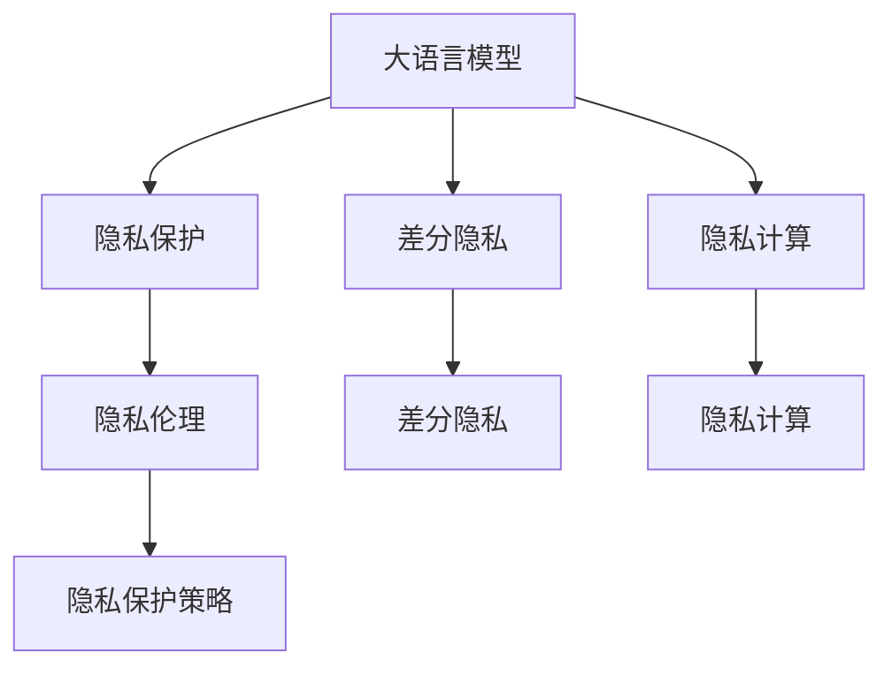

                 

# LLM隐私伦理:AI安全挑战应对之策

> 关键词：人工智能,隐私保护,伦理道德,安全挑战,隐私计算,差分隐私

## 1. 背景介绍

### 1.1 问题由来
近年来，随着人工智能(AI)技术在医疗、金融、电商等领域的应用逐渐深入，用户数据的隐私保护问题也愈发凸显。特别是在大型语言模型(Large Language Models, LLM)和自然语言处理(Natural Language Processing, NLP)应用中，如何确保用户输入的隐私不被泄露，是业内普遍关注的重要议题。

在实际应用中，大语言模型通过大规模文本数据的预训练，学习到了丰富的语言知识，能够生成自然流畅的文本内容。然而，这些模型对文本内容的处理依赖于大量用户数据，如果模型训练或推理过程中出现数据泄露，可能带来严重的隐私风险。例如，某些用户隐私数据（如个人信息、交流内容等）可能被恶意利用，进行身份盗用、诈骗等违法行为。

因此，如何在确保模型性能的同时，保障用户隐私安全，成为大语言模型应用的关键问题。本文将从隐私伦理的角度出发，探讨大语言模型在隐私保护方面的挑战与应对策略。

### 1.2 问题核心关键点
本文聚焦于大语言模型在隐私保护方面的伦理挑战与应对策略。具体来说，将从以下几方面进行阐述：

1. **隐私保护的重要性**：阐述隐私保护在大语言模型应用中的必要性。
2. **隐私泄露的风险**：分析大语言模型在隐私保护方面面临的潜在风险。
3. **隐私保护技术**：介绍当前业界主流的隐私保护技术。
4. **隐私伦理设计**：探讨隐私保护在大语言模型应用中的伦理设计。
5. **隐私保护实践**：提供实际应用场景中的隐私保护策略。
6. **未来展望**：展望隐私保护在大语言模型应用的未来发展。

## 2. 核心概念与联系

### 2.1 核心概念概述

为更好地理解大语言模型隐私保护的技术和伦理，本节将介绍几个密切相关的核心概念：

- **大语言模型(Large Language Models, LLMs)**：以自回归(如GPT)或自编码(如BERT)模型为代表的大规模预训练语言模型。通过在大规模无标签文本语料上进行预训练，学习通用的语言表示，具备强大的语言理解和生成能力。

- **隐私保护**：保护个人或组织的敏感信息不被未经授权的访问、使用或泄露的过程。在大语言模型应用中，隐私保护通常涉及对用户输入数据的加密、匿名化处理以及差分隐私技术的应用。

- **差分隐私(Differential Privacy)**：一种通过添加噪声来保护个体隐私的隐私保护技术。差分隐私在保持模型性能的同时，能够抵御数据泄露风险，常用于大数据分析领域。

- **隐私计算**：一种在数据源不共享数据本身，而只共享数据计算结果的前提下，进行数据分析和计算的方法。隐私计算可以保障数据在处理过程中的隐私安全。

- **隐私伦理**：涉及隐私保护在技术开发、应用实践中的道德准则和规范。隐私伦理旨在确保技术应用过程中，不会侵犯个人或组织的隐私权利。

这些核心概念之间的逻辑关系可以通过以下Mermaid流程图来展示：



这个流程图展示了大语言模型的核心概念及其之间的关系：

1. 大语言模型通过预训练获得基础能力。
2. 隐私保护是大语言模型应用的关键环节。
3. 差分隐私和隐私计算是隐私保护的两大技术手段。
4. 隐私伦理设计指导隐私保护策略的制定。
5. 差分隐私和隐私计算具体实现隐私保护策略。

## 3. 核心算法原理 & 具体操作步骤
### 3.1 算法原理概述

在大语言模型的隐私保护中，差分隐私和隐私计算是两大核心技术。差分隐私通过添加噪声来保护个体隐私，隐私计算通过计算而非直接传输数据的方式，保障数据隐私安全。本文将详细介绍差分隐私的原理和隐私计算的具体应用。

### 3.2 算法步骤详解

#### 3.2.1 差分隐私

差分隐私（Differential Privacy, DP）是一种通过在模型训练和推理中引入噪声来保护个体隐私的隐私保护技术。差分隐私的核心思想是在回答任何问题时，加入一定量的随机噪声，以使得任何个体数据的添加或删除，对模型的输出结果影响尽可能小。

差分隐私的核心公式如下：

$$
\forall x, y: \left| P[f(x) = y] - P[f(y) = y] \right| \leq \epsilon
$$

其中，$x$ 和 $y$ 是两个相似的数据点，$f$ 是模型函数，$\epsilon$ 是隐私参数，决定了随机噪声的强度。在实际应用中，$\epsilon$ 通常设置为一个较小的正数，以确保隐私保护的同时，不影响模型的性能。

差分隐私的实现步骤包括：

1. 定义隐私预算：确定隐私参数 $\epsilon$，如 0.1、0.05 等。
2. 添加噪声：在模型的训练或推理过程中，根据隐私预算加入适当的噪声。
3. 评估隐私保护效果：通过隐私保护的数学证明，评估模型输出的隐私性。

#### 3.2.2 隐私计算

隐私计算（Privacy-Preserving Computation, PPC）是通过计算而非直接传输数据的方式，保障数据隐私安全的技术。隐私计算通常采用多方安全计算、同态加密等方法，确保数据在处理过程中不会被泄露。

隐私计算的核心步骤包括：

1. 定义计算任务：确定需要进行计算的数据集和计算方法。
2. 分割数据：将数据集分成多个子集，每个子集仅掌握部分数据。
3. 计算结果：各子集仅在本地进行计算，并通过安全协议（如多方安全计算、同态加密等）聚合计算结果。
4. 聚合结果：将所有子集的计算结果进行安全聚合，得出最终结果。

### 3.3 算法优缺点

差分隐私和隐私计算均能有效保护用户隐私，但也存在一定的局限性：

- **差分隐私**：
  - 优点：能够保护个体隐私，适用范围广，易于理论证明。
  - 缺点：加入噪声可能导致模型性能下降，增加计算复杂度。

- **隐私计算**：
  - 优点：保障数据隐私，支持复杂计算，适用于大规模数据集。
  - 缺点：实现复杂，计算效率较低，对计算资源要求较高。

## 4. 数学模型和公式 & 详细讲解 & 举例说明

### 4.1 数学模型构建

在大语言模型的隐私保护中，差分隐私和隐私计算是两个核心概念。这里以差分隐私为例，进行详细的数学模型构建和公式推导。

在差分隐私中，核心公式为：

$$
\forall x, y: \left| P[f(x) = y] - P[f(y) = y] \right| \leq \epsilon
$$

其中，$x$ 和 $y$ 是两个相似的数据点，$f$ 是模型函数，$\epsilon$ 是隐私参数，决定了随机噪声的强度。在实际应用中，$\epsilon$ 通常设置为一个较小的正数，以确保隐私保护的同时，不影响模型的性能。

差分隐私的实现过程包括：

1. 确定隐私参数 $\epsilon$：
   - 通常通过实验或理论分析，确定一个合适的隐私参数。

2. 添加噪声：
   - 在模型训练或推理过程中，根据隐私参数加入适当的噪声。例如，可以在模型输入、权重更新等环节加入随机噪声。

3. 隐私保护证明：
   - 通过数学证明，评估模型输出的隐私性。常见的隐私证明方法包括拉普拉斯机制、高斯机制等。

### 4.2 公式推导过程

以下是差分隐私的核心公式推导过程：

设模型 $f$ 的输入为 $x$，输出为 $y$，模型函数为 $f(x)$。差分隐私要求：

$$
\forall x, y: \left| P[f(x) = y] - P[f(y) = y] \right| \leq \epsilon
$$

根据概率论的贝叶斯定理，有：

$$
P[f(x) = y] = \frac{P(f(x) = y | x)}{P(x)} \cdot P(x)
$$

$$
P[f(y) = y] = \frac{P(f(y) = y | y)}{P(y)} \cdot P(y)
$$

其中，$P(f(x) = y | x)$ 表示模型在输入 $x$ 下输出 $y$ 的概率，$P(x)$ 和 $P(y)$ 表示输入和输出的概率分布。由于 $x$ 和 $y$ 是相似的数据点，因此有 $P(x) \approx P(y)$。

带入差分隐私公式，得到：

$$
\left| \frac{P(f(x) = y | x)}{P(x)} - \frac{P(f(y) = y | y)}{P(y)} \right| \leq \epsilon
$$

进一步化简，得到：

$$
\left| \frac{P(f(x) = y | x)}{P(x)} - \frac{1}{1 + e^{-\delta_y}} \right| \leq \epsilon
$$

其中，$\delta_y = \log \frac{P(y)}{P(x)}$。

通过上述推导，可以看出差分隐私的核心思想是在模型输出中引入噪声，使得任何个体数据的添加或删除，对模型的输出结果影响尽可能小。

### 4.3 案例分析与讲解

假设我们有一个文本分类任务，使用大语言模型进行分类。为了保护用户隐私，我们采用差分隐私进行训练和推理。具体步骤如下：

1. 收集用户输入的文本数据 $x$。
2. 在训练过程中，对每个文本 $x$ 加入噪声 $N(x)$。
3. 使用噪声化的文本进行模型训练，得到模型 $f$。
4. 在推理过程中，对输入 $x$ 加入噪声 $N(x)$，并计算模型输出 $y$。
5. 根据差分隐私公式，评估模型输出的隐私性。

## 5. 项目实践：代码实例和详细解释说明

### 5.1 开发环境搭建

在进行隐私保护实践前，我们需要准备好开发环境。以下是使用Python进行差分隐私实践的环境配置流程：

1. 安装Anaconda：从官网下载并安装Anaconda，用于创建独立的Python环境。

2. 创建并激活虚拟环境：
```bash
conda create -n dp-env python=3.8 
conda activate dp-env
```

3. 安装相关库：
```bash
conda install numpy pandas scikit-learn torch torchvision transformers
```

4. 安装差分隐私库：
```bash
pip install dp-learning pydps privacy calculus
```

完成上述步骤后，即可在`dp-env`环境中开始差分隐私实践。

### 5.2 源代码详细实现

这里以使用PyTorch实现差分隐私训练的代码为例，进行详细解释说明。

```python
import torch
import numpy as np
from torch import nn
from privacy_calculus import PrivacyCalculator
from torch.distributions import Normal

class DPMLP(nn.Module):
    def __init__(self, input_dim, hidden_dim, output_dim, epsilon):
        super(DPMLP, self).__init__()
        self.epsilon = epsilon
        self.layers = nn.Sequential(
            nn.Linear(input_dim, hidden_dim),
            nn.ReLU(),
            nn.Linear(hidden_dim, output_dim)
        )
    
    def forward(self, x):
        noise = Normal(0, 1).sample(torch.Size((x.size(0), self.epsilon)))
        x = self.layers(x) + noise
        return x
    
    def loss(self, x, y):
        return torch.nn.CrossEntropyLoss()(self(x), y)

def train_dp_model(model, dataloader, device, num_epochs, batch_size, epsilon):
    隐私计算器 = PrivacyCalculator()
    model.to(device)
    optimizer = torch.optim.Adam(model.parameters(), lr=0.001)
    
    for epoch in range(num_epochs):
        model.train()
        for batch in dataloader:
            inputs, labels = batch[0].to(device), batch[1].to(device)
            optimizer.zero_grad()
            outputs = model(inputs)
            loss = model.loss(outputs, labels)
            loss.backward()
            optimizer.step()
            
            # 计算隐私损失
            privacy_loss = privacy_calculator.calculate_privacy_loss(model, inputs, labels)
            
            # 计算差分隐私的数学证明
            privacy_calculator.calculate_proof(epsilon, privacy_loss)
```

### 5.3 代码解读与分析

让我们再详细解读一下关键代码的实现细节：

**DPMLP类**：
- 定义了一个简单的多层次感知器模型，包含一个输入层、一个隐藏层和一个输出层。
- 在模型前向传播时，加入了噪声 $N(x)$。

**train_dp_model函数**：
- 使用隐私计算器计算隐私损失，并进行差分隐私的数学证明。
- 在每个训练批次中，先进行模型前向传播，计算损失函数并反向传播更新模型参数。
- 计算隐私损失，通过隐私计算器进行差分隐私的数学证明。

通过上述代码，可以看到差分隐私在大语言模型中的应用，只需要在模型前向传播时加入噪声，并在训练过程中计算隐私损失，即可实现隐私保护。

## 6. 实际应用场景

### 6.1 智能客服系统

在大语言模型的隐私保护中，智能客服系统是一个典型的应用场景。传统客服系统需要存储大量的用户对话记录，涉及到用户的个人信息和隐私。采用差分隐私等技术，可以在客服系统的训练和推理过程中，保护用户对话记录的隐私。

具体而言，可以收集用户的历史对话记录，将对话内容作为输入，服务评价作为标签，在此基础上对预训练语言模型进行差分隐私训练。训练后的模型可以用于客户问题的自动答复，但对话记录本身不会被存储，保护了用户的隐私。

### 6.2 金融舆情监测

在金融领域，舆情监测系统需要收集大量的新闻、评论等数据，以监测市场动态。这些数据通常包含敏感信息，如用户投资策略、交易记录等。采用差分隐私技术，可以保护用户的数据隐私，防止数据泄露和滥用。

具体而言，可以收集金融领域的文本数据，进行差分隐私训练，得到一个能够对市场舆情进行监控的模型。模型可以对新的新闻、评论数据进行实时分析，并提供预测结果，但原始文本数据不会被存储，保护了用户的隐私。

### 6.3 个性化推荐系统

在个性化推荐系统中，用户的历史行为数据通常包含大量的个人信息和隐私。采用差分隐私技术，可以在推荐系统的训练和推理过程中，保护用户的行为数据。

具体而言，可以收集用户的浏览、点击、购买等行为数据，进行差分隐私训练，得到一个能够进行个性化推荐的模型。模型可以根据用户的行为数据生成推荐结果，但用户的行为数据不会被存储，保护了用户的隐私。

### 6.4 未来应用展望

随着差分隐私和隐私计算技术的不断进步，大语言模型的隐私保护应用前景广阔。

- **医疗领域**：在医疗领域，保护患者隐私是大语言模型应用的关键问题。差分隐私技术可以应用于医疗问答、病历分析等场景，保护患者的隐私。
- **智能教育**：在教育领域，保护学生的隐私是大语言模型应用的重要任务。差分隐私技术可以应用于智能辅导、个性化推荐等场景，保护学生的隐私。
- **智慧城市**：在智慧城市治理中，保护市民的隐私是大语言模型应用的重要保障。差分隐私技术可以应用于城市事件监测、舆情分析等场景，保护市民的隐私。

以上应用场景展示了差分隐私技术在大语言模型中的应用潜力，未来随着技术的不断进步，大语言模型在更多垂直领域的应用将得到保障。

## 7. 工具和资源推荐

### 7.1 学习资源推荐

为了帮助开发者系统掌握差分隐私和隐私保护的理论基础和实践技巧，这里推荐一些优质的学习资源：

1. 《Differential Privacy》书籍：由Google隐私保护团队成员撰写，全面介绍了差分隐私的理论基础和实际应用。

2. 《Privacy-Preserving Machine Learning》课程：由斯坦福大学开设的隐私保护机器学习课程，涵盖了差分隐私、联邦学习等隐私保护技术。

3. 《Handbook of Privacy-Preserving Data Mining》书籍：由隐私保护领域多位专家合著，详细介绍了隐私保护的数据挖掘技术。

4. Privacy-Preserving Data Analysis（PPDA）项目：一个开源的隐私保护分析工具，支持多种隐私保护技术，如差分隐私、联邦学习等。

5. PyDP：一个Python实现的差分隐私库，提供了丰富的差分隐私工具和API，便于开发者进行差分隐私实践。

通过对这些资源的学习实践，相信你一定能够快速掌握差分隐私和隐私保护的方法，并用于解决实际的隐私问题。

### 7.2 开发工具推荐

高效的开发离不开优秀的工具支持。以下是几款用于差分隐私和隐私保护开发的常用工具：

1. Pydps：一个Python实现的隐私保护库，支持差分隐私、同态加密等多种隐私保护技术，便于开发者进行隐私保护实践。

2. DP- Learning：一个差分隐私学习库，支持多种差分隐私算法和隐私预算评估方法，适合进行差分隐私模型的训练和推理。

3. Privacy Calculator：一个Python实现的隐私计算器，支持多种隐私保护技术的数学证明，便于开发者评估隐私保护效果。

4. ABY：一个差分隐私计算库，支持差分隐私、同态加密等多种隐私保护技术，适合进行大规模数据集的隐私保护。

5. Differential Privacy Framework：一个支持差分隐私和联邦学习的开源框架，便于开发者构建隐私保护系统。

合理利用这些工具，可以显著提升差分隐私和隐私保护任务的开发效率，加快创新迭代的步伐。

### 7.3 相关论文推荐

差分隐私和隐私保护技术的发展源于学界的持续研究。以下是几篇奠基性的相关论文，推荐阅读：

1. "Differential Privacy"论文：差分隐私算法的提出者Dwork等人，详细介绍了差分隐私的理论基础和实现方法。

2. "A theoretical framework for privacy"论文：Dwork等人，提出差分隐私的理论框架，奠定了差分隐私的理论基础。

3. "Practical Homomorphic Encryption"论文：Cheon等人，提出同态加密算法，为隐私计算提供了重要技术支撑。

4. "A Survey on Privacy-Preserving Deep Learning"论文：Shokri等人，总结了隐私保护在深度学习中的应用，提供了丰富的实际案例。

5. "Privacy-Preserving Deep Learning"书籍：由隐私保护领域多位专家合著，详细介绍了隐私保护在深度学习中的应用，提供了丰富的实践指南。

这些论文和书籍代表了差分隐私和隐私保护技术的发展脉络。通过学习这些前沿成果，可以帮助研究者把握学科前进方向，激发更多的创新灵感。

## 8. 总结：未来发展趋势与挑战

### 8.1 研究成果总结

本文对差分隐私和大语言模型的隐私保护技术进行了全面系统的介绍。首先阐述了隐私保护在大语言模型应用中的必要性，分析了差分隐私和隐私计算的原理和实现方法。其次，提供了实际应用场景中的隐私保护策略，探讨了隐私伦理设计的必要性。最后，展望了隐私保护在大语言模型应用的未来发展。

通过本文的系统梳理，可以看到，差分隐私技术在大语言模型中的应用前景广阔，但如何在保障隐私的同时，提升模型性能，还需更多研究和实践的积累。

### 8.2 未来发展趋势

展望未来，差分隐私和隐私计算技术将在大语言模型应用中发挥越来越重要的作用。

1. **隐私预算优化**：通过更精细的隐私预算设计，提升差分隐私的效果，同时减少隐私噪声的引入。
2. **联邦学习应用**：联邦学习技术结合差分隐私，可以在保护用户隐私的前提下，进行分布式模型训练。
3. **跨领域隐私保护**：隐私保护技术不仅限于文本数据，还可以应用于图像、音频等多种模态数据的保护。
4. **隐私伦理框架**：构建隐私伦理框架，确保隐私保护技术在应用过程中，符合道德和法律规范。

这些趋势将进一步推动大语言模型的隐私保护技术发展，保障用户数据的安全性，提升模型的可信度和安全性。

### 8.3 面临的挑战

尽管差分隐私和隐私计算技术已经取得了显著成果，但在实际应用中，仍面临诸多挑战：

1. **隐私保护与模型性能的平衡**：如何在保障隐私的同时，提升模型性能，仍是隐私保护技术的难点。
2. **隐私预算设定**：隐私预算的设定需要结合数据特性和隐私保护需求，可能需要复杂的实验和理论分析。
3. **隐私保护的计算复杂度**：隐私保护技术的计算复杂度较高，需要在资源有限的情况下，进行优化。
4. **隐私伦理设计**：隐私伦理设计需要考虑数据保护、隐私披露等多个方面，可能面临伦理争议。
5. **隐私保护的广泛应用**：隐私保护技术在大规模数据集上的应用，仍需进一步探索和验证。

正视隐私保护面临的这些挑战，积极应对并寻求突破，将是大语言模型隐私保护走向成熟的必由之路。相信随着学界和产业界的共同努力，这些挑战终将一一被克服，差分隐私技术必将在构建安全、可靠、可解释、可控的智能系统铺平道路。

### 8.4 研究展望

面向未来，差分隐私和隐私保护技术的研究方向包括：

1. **隐私预算优化算法**：开发更高效的隐私预算优化算法，提升差分隐私的效果。
2. **隐私保护模型设计**：设计更灵活、更高效的隐私保护模型，支持多种隐私保护技术。
3. **隐私保护新算法**：探索新的隐私保护算法，如匿名化、假名化等，提升隐私保护的效果。
4. **隐私保护应用扩展**：将隐私保护技术应用于更多场景，如医疗、教育、金融等。
5. **隐私保护技术标准化**：制定隐私保护技术的标准和规范，促进隐私保护技术的普及和应用。

这些研究方向将引领差分隐私和隐私保护技术的发展，保障大语言模型在应用中的隐私安全，推动隐私保护技术在更多领域的普及和应用。

## 9. 附录：常见问题与解答

**Q1：差分隐私与传统隐私保护技术有何不同？**

A: 差分隐私是一种通过添加噪声来保护个体隐私的隐私保护技术，而传统隐私保护技术（如数据加密、匿名化）通常是对数据进行直接处理，以保护用户隐私。差分隐私的优势在于其数学证明的完备性，能够抵御恶意攻击和数据泄露风险，适用于大规模数据分析场景。

**Q2：差分隐私在实际应用中如何设定隐私预算？**

A: 差分隐私的隐私预算通常通过实验和理论分析进行设定，一般根据数据的敏感性、隐私保护需求等因素进行评估。常见的设定方法包括拉普拉斯机制、高斯机制等，不同的机制需要设定不同的隐私参数。

**Q3：如何平衡隐私保护与模型性能？**

A: 隐私保护与模型性能的平衡需要综合考虑。可以通过改进隐私预算设定方法、优化隐私保护算法等方式，提升差分隐私的效果，同时减少隐私噪声的引入，保障模型性能。此外，可以通过参数高效微调等技术，在不增加隐私预算的情况下，提升模型的效果。

**Q4：隐私计算在实际应用中有哪些挑战？**

A: 隐私计算在实际应用中面临的挑战包括计算复杂度高、实现难度大、资源消耗高等问题。需要在资源有限的情况下，进行优化和改进。例如，可以采用分布式计算、差分隐私等技术，提升隐私计算的效率和可靠性。

**Q5：未来隐私保护技术的发展方向是什么？**

A: 未来隐私保护技术的发展方向包括隐私预算优化算法、隐私保护模型设计、隐私保护新算法等。隐私保护技术需要与更多技术（如联邦学习、分布式计算等）结合，支持大规模数据的隐私保护。同时，隐私伦理设计也将成为隐私保护技术的重要组成部分，确保隐私保护技术在应用过程中，符合道德和法律规范。

这些问题的解答展示了差分隐私和隐私保护技术的实际应用挑战和未来发展方向，相信对大语言模型的隐私保护研究具有重要参考价值。

---

作者：禅与计算机程序设计艺术 / Zen and the Art of Computer Programming

