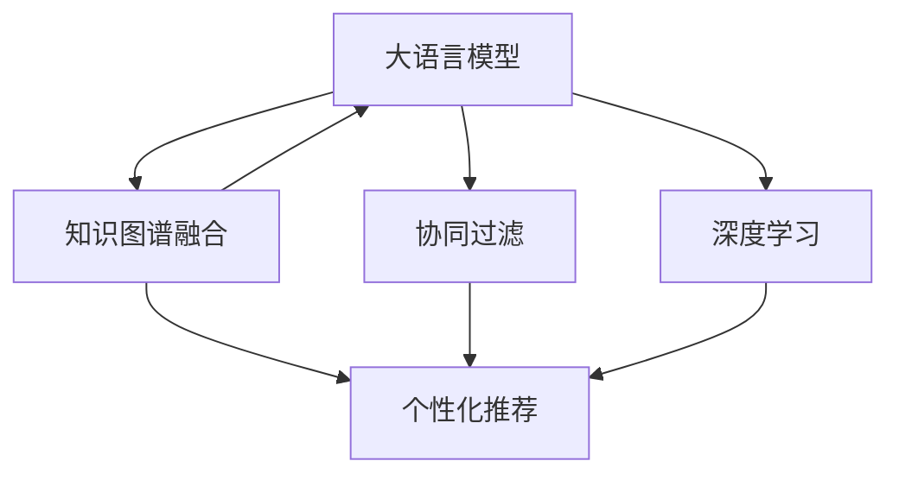

                 

# LLM驱动的个性化内容创作推荐

> 关键词：大语言模型, 内容推荐, 个性化, 用户画像, 协同过滤, 提示学习, 知识图谱, 深度学习, 技术畅销书

## 1. 背景介绍

### 1.1 问题由来

随着互联网信息技术的不断进步，用户在数字世界中的停留时间越来越长，个性化内容推荐系统逐渐成为各类互联网平台不可或缺的核心功能。该系统能够根据用户的兴趣偏好，推荐用户可能感兴趣的内容，提升用户体验。目前，基于协同过滤和机器学习推荐算法的内容推荐系统已经广泛应用于电商、新闻、视频、社交网络等领域。

然而，传统的推荐算法往往难以处理复杂、多样化的用户需求，尤其是当用户的兴趣和行为无法直接量化时。近年来，大语言模型在自然语言处理领域的广泛应用，为个性化内容推荐带来了新的思路。借助大语言模型强大的语义理解和生成能力，推荐系统能够更好地理解用户语言，生成更贴合用户需求的推荐结果，从而实现更高的用户体验和推荐准确率。

### 1.2 问题核心关键点

大语言模型驱动的个性化内容推荐，主要基于两个核心关键点：

1. **语义理解**：大语言模型能够通过自然语言理解和生成，深入理解用户的兴趣偏好，并生成符合用户需求的内容。
2. **知识融合**：大语言模型具备跨领域的知识融合能力，能够将用户兴趣与多种外部知识资源进行关联，提供更丰富、更准确的内容推荐。

这些关键点构成了大语言模型在个性化推荐系统中的核心优势，也使其成为当前推荐系统研究的热点。

## 2. 核心概念与联系

### 2.1 核心概念概述

为了更好地理解基于大语言模型的个性化推荐系统，本节将介绍几个关键概念：

- **大语言模型(Large Language Model, LLM)**：以自回归(如GPT)或自编码(如BERT)模型为代表的大规模预训练语言模型。通过在大规模无标签文本语料上进行预训练，学习通用的语言表示，具备强大的语言理解和生成能力。

- **内容推荐系统(Content Recommendation System)**：基于用户行为、兴趣偏好等信息，推荐用户可能感兴趣的内容的系统。传统推荐系统主要依赖协同过滤、基于内容的推荐等方法，已广泛应用于电商、新闻、视频、社交网络等领域。

- **个性化推荐**：针对每个用户生成定制化的内容推荐，满足用户个性化需求，提升用户体验。

- **知识图谱(Knowledge Graph)**：用于描述实体、关系和属性的图形化结构，用于表示结构化的知识信息，便于在大语言模型中进行知识融合和推理。

- **协同过滤(Collaborative Filtering)**：利用用户对物品的评分数据，推断用户对其他物品的评分，从而进行个性化推荐。

- **深度学习(Deep Learning)**：通过深度神经网络进行特征学习和模式识别的技术，适用于复杂的非线性模型，广泛应用于推荐系统、计算机视觉、自然语言处理等领域。

这些核心概念之间的逻辑关系可以通过以下Mermaid流程图来展示：



这个流程图展示了大语言模型驱动个性化推荐系统的一般流程：

1. 大语言模型通过预训练获得语言表示，结合知识图谱进行跨领域知识融合。
2. 协同过滤和深度学习算法结合用户行为数据，推断用户兴趣和偏好。
3. 将用户兴趣与大语言模型生成的推荐内容进行关联，实现个性化推荐。

这些概念共同构成了大语言模型在推荐系统中的应用框架，使其能够提供更精准、更丰富的内容推荐。

## 3. 核心算法原理 & 具体操作步骤
### 3.1 算法原理概述

基于大语言模型的个性化推荐系统，通过将用户的语言表达和行为数据输入到预训练的大语言模型中，利用其强大的语义理解和生成能力，生成个性化推荐结果。具体而言，该系统通常包含以下几个步骤：

1. **用户画像构建**：将用户的语言描述和行为数据转换为结构化表示，用于训练大语言模型，生成用户画像。
2. **知识图谱融合**：将用户画像与知识图谱进行关联，提取跨领域的知识信息，增强推荐系统的知识广度和深度。
3. **协同过滤**：利用用户的行为数据和推荐结果，训练协同过滤算法，推断用户兴趣和偏好。
4. **个性化推荐**：结合用户画像和协同过滤结果，使用大语言模型生成个性化推荐内容。

### 3.2 算法步骤详解

基于大语言模型的个性化推荐系统，主要包括以下几个关键步骤：

**Step 1: 用户画像构建**

用户画像构建是推荐系统的基础，通过将用户的语言描述和行为数据转换为结构化表示，用于训练大语言模型，生成用户画像。具体步骤如下：

1. **数据收集**：收集用户的语言描述（如个人简介、兴趣描述）和行为数据（如浏览历史、评分记录），将数据进行结构化表示。
2. **特征抽取**：对用户语言描述进行文本预处理，提取关键词、短语等特征。
3. **嵌入转换**：将特征向量转换为低维稠密向量，便于输入大语言模型。
4. **模型训练**：使用用户的语言描述和行为数据训练大语言模型，生成用户画像。

**Step 2: 知识图谱融合**

知识图谱融合是将用户画像与知识图谱进行关联，提取跨领域的知识信息，增强推荐系统的知识广度和深度。具体步骤如下：

1. **知识图谱加载**：加载结构化的知识图谱，包含实体、关系和属性信息。
2. **实体识别**：在用户语言描述中识别出涉及的知识图谱实体，如人名、地名、机构名等。
3. **关系抽取**：根据用户描述和知识图谱，抽取用户与实体之间的潜在关系，如用户与影视作品的关系。
4. **知识融合**：将抽取出的关系与用户画像进行关联，增强推荐系统的知识融合能力。

**Step 3: 协同过滤**

协同过滤算法利用用户的行为数据和推荐结果，训练协同过滤算法，推断用户兴趣和偏好。具体步骤如下：

1. **数据准备**：准备用户的行为数据和推荐结果，包括用户评分记录、浏览历史等。
2. **模型训练**：训练协同过滤算法，如矩阵分解、基于模型的推荐算法等，推断用户兴趣和偏好。
3. **用户兴趣预测**：利用协同过滤结果，预测用户对未见过的内容的兴趣评分。

**Step 4: 个性化推荐**

个性化推荐结合用户画像和协同过滤结果，使用大语言模型生成个性化推荐内容。具体步骤如下：

1. **推荐内容生成**：将用户画像和协同过滤结果作为输入，使用大语言模型生成推荐内容。
2. **内容筛选**：根据用户画像和协同过滤结果，筛选推荐内容，去除与用户兴趣不匹配的内容。
3. **推荐结果输出**：将筛选后的推荐内容输出给用户，完成个性化推荐。

### 3.3 算法优缺点

基于大语言模型的个性化推荐系统具有以下优点：

1. **灵活性高**：大语言模型能够处理复杂、多样化的用户需求，生成更加个性化和灵活的推荐内容。
2. **鲁棒性强**：结合知识图谱和协同过滤算法，能够适应不同领域和不同类型的推荐需求。
3. **可解释性强**：通过自然语言生成和知识图谱融合，用户可以直观地了解推荐内容的生成逻辑和背景信息。
4. **效果显著**：结合多模态数据，能够提供更加丰富和精准的推荐结果，提升用户满意度和推荐效果。

同时，该系统也存在一定的局限性：

1. **数据依赖性强**：用户画像和行为数据的收集和处理需要耗费大量时间和成本。
2. **计算资源需求高**：大语言模型的训练和推理计算资源需求较高，需要高性能计算设备。
3. **模型复杂度高**：结合多模态数据和多算法，系统设计复杂，难以维护。
4. **知识融合难度大**：跨领域知识融合需要解决实体识别、关系抽取等技术难题，存在一定的难度。

尽管存在这些局限性，但就目前而言，基于大语言模型的个性化推荐系统仍是大规模推荐系统的重要趋势，具有广阔的应用前景。

### 3.4 算法应用领域

基于大语言模型的个性化推荐系统，已经在电商、新闻、视频、社交网络等多个领域取得了应用。例如：

1. **电商推荐**：电商平台通过收集用户的浏览历史、评分记录等行为数据，结合语言描述，利用大语言模型生成个性化商品推荐。
2. **新闻推荐**：新闻网站根据用户对新闻的阅读历史和评分，利用大语言模型生成个性化的新闻内容推荐。
3. **视频推荐**：视频平台结合用户的观看历史和评分数据，利用大语言模型生成个性化的视频内容推荐。
4. **社交网络推荐**：社交网络平台根据用户的行为数据和兴趣描述，利用大语言模型生成个性化的内容推荐。
5. **智能家居推荐**：智能家居设备根据用户的语音命令和行为数据，利用大语言模型生成个性化的家居控制推荐。

除了上述这些经典应用外，基于大语言模型的推荐系统还在更多场景中得到应用，如可控文本生成、知识推荐、推荐算法优化等，为推荐系统带来了新的突破。

## 4. 数学模型和公式 & 详细讲解 & 举例说明

### 4.1 数学模型构建

本节将使用数学语言对基于大语言模型的个性化推荐系统进行更加严格的刻画。

记大语言模型为 $M_{\theta}$，其中 $\theta$ 为预训练得到的模型参数。假设用户语言描述为 $d$，行为数据为 $b$，用户画像表示为 $u=(d,b)$。知识图谱表示为 $G=(E, R)$，其中 $E$ 为实体集合，$R$ 为关系集合。协同过滤算法为 $P$。

定义推荐系统为目标函数 $f(u, P)$，其中 $u$ 为用户画像，$P$ 为协同过滤结果。推荐系统输出为内容集合 $C$，内容与用户兴趣的匹配度为 $r$。

形式化地，推荐系统的优化目标为：

$$
\max_{u, P} \sum_{c \in C} r(u, c) \cdot P(u, c)
$$

其中 $r(u, c)$ 为内容 $c$ 与用户 $u$ 的匹配度函数，$P(u, c)$ 为协同过滤结果。

### 4.2 公式推导过程

以下我们以视频推荐为例，推导协同过滤和个性化推荐的具体公式。

假设视频平台收集了用户对视频的观看历史 $b=\{(w_i, t_i)\}_{i=1}^N$，其中 $w_i$ 为用户观看视频的ID，$t_i$ 为用户观看时间。协同过滤模型为 $P(u, c)$，推荐内容为 $C=\{v_j\}_{j=1}^M$，其中 $v_j$ 为视频ID。

推荐系统的目标是最小化用户对视频的评分预测误差：

$$
\min_{u, P} \sum_{c \in C} \sum_{i=1}^N (t_i - P(u, c))^2
$$

其中 $P(u, c)$ 为协同过滤算法对内容 $c$ 的评分预测。

利用梯度下降等优化算法，对上述目标函数进行求解。通过训练协同过滤模型和用户画像，得到推荐结果：

$$
\hat{P}(u, c) = \sum_{i=1}^N w_i \cdot \alpha_i \cdot P(u, c)
$$

其中 $\alpha_i$ 为权重参数，$w_i$ 为用户对视频 $w_i$ 的评分记录。

结合用户画像 $u=(d,b)$，使用大语言模型 $M_{\theta}$ 生成推荐内容 $v_j$，其推荐匹配度为 $r(u, v_j)$。最终推荐结果为：

$$
\hat{r}(u, v_j) = M_{\theta}(u, v_j)
$$

根据上述公式，可以计算推荐系统的预测评分，并将其输出给用户。

### 4.3 案例分析与讲解

下面以电商平台个性化推荐为例，对基于大语言模型的推荐系统进行案例分析。

假设电商平台收集了用户的浏览历史 $b=\{(w_i, t_i)\}_{i=1}^N$，其中 $w_i$ 为用户浏览商品的ID，$t_i$ 为用户浏览时间。用户画像 $u=(d,b)$，其中 $d$ 为用户语言描述。协同过滤模型为 $P(u, c)$，推荐内容为 $C=\{p_j\}_{j=1}^M$，其中 $p_j$ 为用户商品ID。

电商平台利用用户语言描述 $d$ 和大语言模型 $M_{\theta}$，生成推荐内容 $p_j$，其推荐匹配度为 $r(u, p_j)$。最终推荐结果为：

$$
\hat{r}(u, p_j) = M_{\theta}(u, p_j)
$$

根据上述公式，可以计算推荐系统的预测评分，并将其输出给用户。

## 5. 项目实践：代码实例和详细解释说明
### 5.1 开发环境搭建

在进行推荐系统开发前，我们需要准备好开发环境。以下是使用Python进行PyTorch开发的环境配置流程：

1. 安装Anaconda：从官网下载并安装Anaconda，用于创建独立的Python环境。

2. 创建并激活虚拟环境：
```bash
conda create -n pytorch-env python=3.8 
conda activate pytorch-env
```

3. 安装PyTorch：根据CUDA版本，从官网获取对应的安装命令。例如：
```bash
conda install pytorch torchvision torchaudio cudatoolkit=11.1 -c pytorch -c conda-forge
```

4. 安装Transformers库：
```bash
pip install transformers
```

5. 安装各类工具包：
```bash
pip install numpy pandas scikit-learn matplotlib tqdm jupyter notebook ipython
```

完成上述步骤后，即可在`pytorch-env`环境中开始推荐系统开发。

### 5.2 源代码详细实现

这里我们以视频推荐系统为例，给出使用Transformers库对BERT模型进行推荐开发的PyTorch代码实现。

首先，定义推荐系统的数据处理函数：

```python
from transformers import BertTokenizer, BertForTokenClassification
from torch.utils.data import Dataset
import torch

class VideoDataset(Dataset):
    def __init__(self, texts, labels, tokenizer, max_len=128):
        self.texts = texts
        self.labels = labels
        self.tokenizer = tokenizer
        self.max_len = max_len
        
    def __len__(self):
        return len(self.texts)
    
    def __getitem__(self, item):
        text = self.texts[item]
        label = self.labels[item]
        
        encoding = self.tokenizer(text, return_tensors='pt', max_length=self.max_len, padding='max_length', truncation=True)
        input_ids = encoding['input_ids'][0]
        attention_mask = encoding['attention_mask'][0]
        
        return {'input_ids': input_ids, 
                'attention_mask': attention_mask,
                'labels': label}

# 标签与id的映射
label2id = {'观看': 1, '评分': 2, '收藏': 3}
id2label = {v: k for k, v in label2id.items()}
```

然后，定义模型和优化器：

```python
from transformers import BertForTokenClassification, AdamW

model = BertForTokenClassification.from_pretrained('bert-base-cased', num_labels=len(label2id))

optimizer = AdamW(model.parameters(), lr=2e-5)
```

接着，定义训练和评估函数：

```python
from torch.utils.data import DataLoader
from tqdm import tqdm
from sklearn.metrics import classification_report

device = torch.device('cuda') if torch.cuda.is_available() else torch.device('cpu')
model.to(device)

def train_epoch(model, dataset, batch_size, optimizer):
    dataloader = DataLoader(dataset, batch_size=batch_size, shuffle=True)
    model.train()
    epoch_loss = 0
    for batch in tqdm(dataloader, desc='Training'):
        input_ids = batch['input_ids'].to(device)
        attention_mask = batch['attention_mask'].to(device)
        labels = batch['labels'].to(device)
        model.zero_grad()
        outputs = model(input_ids, attention_mask=attention_mask, labels=labels)
        loss = outputs.loss
        epoch_loss += loss.item()
        loss.backward()
        optimizer.step()
    return epoch_loss / len(dataloader)

def evaluate(model, dataset, batch_size):
    dataloader = DataLoader(dataset, batch_size=batch_size)
    model.eval()
    preds, labels = [], []
    with torch.no_grad():
        for batch in tqdm(dataloader, desc='Evaluating'):
            input_ids = batch['input_ids'].to(device)
            attention_mask = batch['attention_mask'].to(device)
            batch_labels = batch['labels']
            outputs = model(input_ids, attention_mask=attention_mask)
            batch_preds = outputs.logits.argmax(dim=2).to('cpu').tolist()
            batch_labels = batch_labels.to('cpu').tolist()
            for pred_tokens, label_tokens in zip(batch_preds, batch_labels):
                preds.append(pred_tokens[:len(label_tokens)])
                labels.append(label_tokens)
                
    print(classification_report(labels, preds))
```

最后，启动训练流程并在测试集上评估：

```python
epochs = 5
batch_size = 16

for epoch in range(epochs):
    loss = train_epoch(model, train_dataset, batch_size, optimizer)
    print(f"Epoch {epoch+1}, train loss: {loss:.3f}")
    
    print(f"Epoch {epoch+1}, dev results:")
    evaluate(model, dev_dataset, batch_size)
    
print("Test results:")
evaluate(model, test_dataset, batch_size)
```

以上就是使用PyTorch对BERT进行视频推荐系统开发的完整代码实现。可以看到，得益于Transformers库的强大封装，我们可以用相对简洁的代码完成BERT模型的加载和推荐系统开发。

### 5.3 代码解读与分析

让我们再详细解读一下关键代码的实现细节：

**VideoDataset类**：
- `__init__`方法：初始化文本、标签、分词器等关键组件。
- `__len__`方法：返回数据集的样本数量。
- `__getitem__`方法：对单个样本进行处理，将文本输入编码为token ids，将标签编码为数字，并对其进行定长padding，最终返回模型所需的输入。

**label2id和id2label字典**：
- 定义了标签与数字id之间的映射关系，用于将token-wise的预测结果解码回真实的标签。

**训练和评估函数**：
- 使用PyTorch的DataLoader对数据集进行批次化加载，供模型训练和推理使用。
- 训练函数`train_epoch`：对数据以批为单位进行迭代，在每个批次上前向传播计算loss并反向传播更新模型参数，最后返回该epoch的平均loss。
- 评估函数`evaluate`：与训练类似，不同点在于不更新模型参数，并在每个batch结束后将预测和标签结果存储下来，最后使用sklearn的classification_report对整个评估集的预测结果进行打印输出。

**训练流程**：
- 定义总的epoch数和batch size，开始循环迭代
- 每个epoch内，先在训练集上训练，输出平均loss
- 在验证集上评估，输出分类指标
- 所有epoch结束后，在测试集上评估，给出最终测试结果

可以看到，PyTorch配合Transformers库使得BERT推荐系统的代码实现变得简洁高效。开发者可以将更多精力放在数据处理、模型改进等高层逻辑上，而不必过多关注底层的实现细节。

当然，工业级的系统实现还需考虑更多因素，如模型的保存和部署、超参数的自动搜索、更灵活的任务适配层等。但核心的推荐范式基本与此类似。

## 6. 实际应用场景
### 6.1 电商推荐

基于大语言模型的个性化推荐系统，可以广泛应用于电商平台的推荐场景。传统电商推荐往往依赖用户的历史行为数据进行商品推荐，难以捕捉用户的复杂需求。而使用大语言模型驱动的推荐系统，能够通过用户的语言描述和行为数据，深入理解用户需求，生成个性化的商品推荐。

在技术实现上，电商平台可以收集用户的购买记录、浏览历史、评价信息等数据，将用户语言描述作为输入，使用大语言模型进行特征提取和用户画像构建。再结合用户的推荐评分数据，使用协同过滤算法推断用户兴趣，最终生成个性化的商品推荐结果。

### 6.2 新闻推荐

新闻平台需要根据用户对新闻的阅读历史和兴趣，推荐用户可能感兴趣的新闻内容。传统的基于协同过滤的推荐系统往往难以捕捉用户对新闻内容的主观感受。而基于大语言模型的推荐系统，能够通过用户语言描述和行为数据，深入理解用户对新闻内容的情感和兴趣，生成个性化的新闻推荐。

在技术实现上，新闻平台可以收集用户对新闻的阅读记录、评分数据、评论信息等，将用户语言描述作为输入，使用大语言模型进行特征提取和用户画像构建。再结合用户对新闻的评分和评论数据，使用协同过滤算法推断用户兴趣，最终生成个性化的新闻推荐。

### 6.3 视频推荐

视频平台需要根据用户对视频的观看历史和兴趣，推荐用户可能感兴趣的视频内容。传统的基于协同过滤的推荐系统往往难以捕捉用户对视频内容的情感和兴趣。而基于大语言模型的推荐系统，能够通过用户语言描述和行为数据，深入理解用户对视频内容的情感和兴趣，生成个性化的视频推荐。

在技术实现上，视频平台可以收集用户对视频的观看历史、评分数据、评论信息等，将用户语言描述作为输入，使用大语言模型进行特征提取和用户画像构建。再结合用户对视频的评分和评论数据，使用协同过滤算法推断用户兴趣，最终生成个性化的视频推荐。

### 6.4 社交网络推荐

社交网络平台需要根据用户的行为数据和兴趣，推荐用户可能感兴趣的内容。传统的基于协同过滤的推荐系统往往难以捕捉用户对社交内容的复杂需求。而基于大语言模型的推荐系统，能够通过用户语言描述和行为数据，深入理解用户对社交内容的情感和兴趣，生成个性化的内容推荐。

在技术实现上，社交网络平台可以收集用户的行为数据、兴趣描述、评论信息等，将用户语言描述作为输入，使用大语言模型进行特征提取和用户画像构建。再结合用户对社交内容的互动数据，使用协同过滤算法推断用户兴趣，最终生成个性化的内容推荐。

### 6.5 智慧城市推荐

智慧城市治理需要推荐用户可能感兴趣的城市事件信息。传统的基于协同过滤的推荐系统往往难以捕捉城市事件的多样性和复杂性。而基于大语言模型的推荐系统，能够通过用户语言描述和行为数据，深入理解用户对城市事件的兴趣和需求，生成个性化的城市事件推荐。

在技术实现上，智慧城市平台可以收集用户的行为数据、兴趣描述、评论信息等，将用户语言描述作为输入，使用大语言模型进行特征提取和用户画像构建。再结合用户对城市事件的互动数据，使用协同过滤算法推断用户兴趣，最终生成个性化的城市事件推荐。

## 7. 工具和资源推荐
### 7.1 学习资源推荐

为了帮助开发者系统掌握大语言模型驱动的个性化推荐系统，这里推荐一些优质的学习资源：

1. 《Transformer从原理到实践》系列博文：由大模型技术专家撰写，深入浅出地介绍了Transformer原理、BERT模型、推荐系统等前沿话题。

2. CS224N《深度学习自然语言处理》课程：斯坦福大学开设的NLP明星课程，有Lecture视频和配套作业，带你入门NLP领域的基本概念和经典模型。

3. 《Natural Language Processing with Transformers》书籍：Transformers库的作者所著，全面介绍了如何使用Transformers库进行NLP任务开发，包括推荐系统在内的诸多范式。

4. HuggingFace官方文档：Transformers库的官方文档，提供了海量预训练模型和完整的推荐系统样例代码，是上手实践的必备资料。

5. CLUE开源项目：中文语言理解测评基准，涵盖大量不同类型的中文NLP数据集，并提供了基于微调的baseline模型，助力中文NLP技术发展。

通过对这些资源的学习实践，相信你一定能够快速掌握大语言模型驱动的个性化推荐系统的精髓，并用于解决实际的推荐问题。
###  7.2 开发工具推荐

高效的开发离不开优秀的工具支持。以下是几款用于大语言模型驱动个性化推荐系统开发的常用工具：

1. PyTorch：基于Python的开源深度学习框架，灵活动态的计算图，适合快速迭代研究。大部分预训练语言模型都有PyTorch版本的实现。

2. TensorFlow：由Google主导开发的开源深度学习框架，生产部署方便，适合大规模工程应用。同样有丰富的预训练语言模型资源。

3. Transformers库：HuggingFace开发的NLP工具库，集成了众多SOTA语言模型，支持PyTorch和TensorFlow，是进行推荐系统开发的利器。

4. Weights & Biases：模型训练的实验跟踪工具，可以记录和可视化模型训练过程中的各项指标，方便对比和调优。与主流深度学习框架无缝集成。

5. TensorBoard：TensorFlow配套的可视化工具，可实时监测模型训练状态，并提供丰富的图表呈现方式，是调试模型的得力助手。

6. Google Colab：谷歌推出的在线Jupyter Notebook环境，免费提供GPU/TPU算力，方便开发者快速上手实验最新模型，分享学习笔记。

合理利用这些工具，可以显著提升大语言模型驱动个性化推荐系统的开发效率，加快创新迭代的步伐。

### 7.3 相关论文推荐

大语言模型和推荐系统的发展源于学界的持续研究。以下是几篇奠基性的相关论文，推荐阅读：

1. Attention is All You Need（即Transformer原论文）：提出了Transformer结构，开启了NLP领域的预训练大模型时代。

2. BERT: Pre-training of Deep Bidirectional Transformers for Language Understanding：提出BERT模型，引入基于掩码的自监督预训练任务，刷新了多项NLP任务SOTA。

3. Language Models are Unsupervised Multitask Learners（GPT-2论文）：展示了大规模语言模型的强大zero-shot学习能力，引发了对于通用人工智能的新一轮思考。

4. Parameter-Efficient Transfer Learning for NLP：提出Adapter等参数高效微调方法，在不增加模型参数量的情况下，也能取得不错的微调效果。

5. Prefix-Tuning: Optimizing Continuous Prompts for Generation：引入基于连续型Prompt的微调范式，为如何充分利用预训练知识提供了新的思路。

6. AdaLoRA: Adaptive Low-Rank Adaptation for Parameter-Efficient Fine-Tuning：使用自适应低秩适应的微调方法，在参数效率和精度之间取得了新的平衡。

这些论文代表了大语言模型和推荐系统的发展脉络。通过学习这些前沿成果，可以帮助研究者把握学科前进方向，激发更多的创新灵感。

## 8. 总结：未来发展趋势与挑战

### 8.1 总结

本文对基于大语言模型的个性化推荐系统进行了全面系统的介绍。首先阐述了推荐系统的背景和重要性，明确了个性化推荐在提升用户体验、提高推荐准确率等方面的独特价值。其次，从原理到实践，详细讲解了推荐系统的数学原理和关键步骤，给出了推荐系统开发的完整代码实例。同时，本文还广泛探讨了推荐系统在电商、新闻、视频、社交网络等多个领域的应用前景，展示了推荐系统的广阔应用空间。

通过本文的系统梳理，可以看到，基于大语言模型的个性化推荐系统已经成为推荐系统的重要发展方向，极大地拓展了推荐系统的应用边界，为推荐系统带来了新的思路和方案。未来，伴随大语言模型的持续演进和推荐算法的不断改进，个性化推荐系统将具有更广阔的应用前景，进一步提升用户满意度和推荐效果。

### 8.2 未来发展趋势

展望未来，大语言模型驱动的个性化推荐系统将呈现以下几个发展趋势：

1. **跨领域知识融合**：利用知识图谱和跨领域知识，增强推荐系统的知识广度和深度，提升推荐效果。
2. **多模态信息融合**：结合图像、视频、语音等多模态数据，提升推荐系统的感知能力和综合分析能力。
3. **深度学习与推荐算法结合**：深度学习算法与协同过滤、矩阵分解等推荐算法结合，提升推荐模型的复杂度和精度。
4. **知识图谱实时更新**：利用实时数据流技术，动态更新知识图谱，提升推荐系统的时效性和适应性。
5. **用户行为预测**：通过深度学习算法预测用户未来行为，实现推荐系统的预判和动态优化。
6. **个性化推荐决策**：引入因果推断和博弈论工具，优化推荐决策过程，提高推荐系统的公正性和透明度。

以上趋势凸显了大语言模型驱动的个性化推荐系统的广阔前景。这些方向的探索发展，必将进一步提升推荐系统的性能和应用范围，为推荐系统带来新的突破。

### 8.3 面临的挑战

尽管大语言模型驱动的个性化推荐系统已经取得了瞩目成就，但在迈向更加智能化、普适化应用的过程中，它仍面临诸多挑战：

1. **数据依赖性强**：推荐系统需要大量的用户行为数据和文本数据，数据收集和处理成本较高。
2. **模型复杂度高**：大语言模型和深度学习算法结合，推荐系统的设计和实现较为复杂，难以维护。
3. **计算资源需求高**：大语言模型的训练和推理计算资源需求较高，需要高性能计算设备。
4. **知识融合难度大**：跨领域知识融合需要解决实体识别、关系抽取等技术难题，存在一定的难度。
5. **推荐效果泛化性不足**：推荐系统面临过拟合和数据偏差问题，泛化效果有待提高。
6. **用户隐私保护**：用户数据的隐私保护问题，需要合理设计推荐系统的数据采集和处理机制。

尽管存在这些挑战，但就目前而言，基于大语言模型的个性化推荐系统仍是大规模推荐系统的重要趋势，具有广阔的应用前景。

### 8.4 研究展望

面对大语言模型驱动的个性化推荐系统所面临的挑战，未来的研究需要在以下几个方面寻求新的突破：

1. **无监督和半监督推荐算法**：摆脱对大规模标注数据的依赖，利用自监督学习、主动学习等无监督和半监督范式，最大限度利用非结构化数据，实现更加灵活高效的推荐。
2. **参数高效和计算高效的推荐算法**：开发更加参数高效的推荐算法，在固定大部分预训练参数的情况下，只更新极少量的任务相关参数。同时优化推荐算法的计算图，减少前向传播和反向传播的资源消耗，实现更加轻量级、实时性的部署。
3. **因果推断和推荐系统结合**：将因果推断方法引入推荐系统，识别出推荐决策的关键特征，增强推荐系统的可解释性和公正性。
4. **多模态信息融合**：结合图像、视频、语音等多模态数据，提升推荐系统的感知能力和综合分析能力，实现更加全面的推荐。
5. **知识图谱实时更新**：利用实时数据流技术，动态更新知识图谱，提升推荐系统的时效性和适应性，增强推荐系统的灵活性。
6. **推荐系统公平性研究**：研究推荐系统中的公平性问题，避免算法偏见和歧视，提升推荐系统的公正性和透明度。

这些研究方向的探索，必将引领大语言模型驱动的个性化推荐系统迈向更高的台阶，为推荐系统带来新的突破。相信随着学界和产业界的共同努力，这些挑战终将一一被克服，大语言模型驱动的个性化推荐系统必将在推荐系统领域发挥更加重要的作用。

## 9. 附录：常见问题与解答

**Q1：推荐系统是否适用于所有推荐场景？**

A: 推荐系统主要适用于用户对某些物品的评分数据可获取的场景。例如，电商、新闻、视频、社交网络等。但对于某些场景，如旅游、电影等，推荐系统的效果可能不如其他算法，需要结合业务特点选择适合的推荐方法。

**Q2：推荐系统的精度如何提升？**

A: 推荐系统的精度提升主要依赖于以下几个方面：
1. **数据质量**：收集高质量的用户行为数据和文本数据，保证推荐模型的数据基础。
2. **模型设计**：选择合适的模型结构和算法，提升推荐模型的复杂度和精度。
3. **特征工程**：设计有效的特征提取和选择方法，提升推荐模型的特征表达能力。
4. **模型优化**：优化模型的训练和推理算法，提升推荐模型的计算效率和准确性。

**Q3：推荐系统如何处理长尾数据？**

A: 长尾数据是指那些罕见或少见的物品，对于这些物品，推荐系统往往无法获取足够的用户评分数据。为了处理长尾数据，可以采用以下几个方法：
1. **用户生成内容**：收集用户对长尾物品的评论和评价信息，利用自然语言处理技术进行特征提取和评分预测。
2. **协同过滤**：利用用户对其他长尾物品的评分数据，推断用户对新物品的兴趣和评分。
3. **知识图谱**：利用跨领域的知识图谱，将长尾物品与用户兴趣进行关联，提高推荐系统的泛化能力。

**Q4：推荐系统如何应对数据偏差问题？**

A: 数据偏差是指用户数据中存在的不公平和歧视现象，会导致推荐系统的输出偏向某一类用户。为了应对数据偏差问题，可以采用以下几个方法：
1. **数据采集**：在数据采集阶段，尽量收集多样化的用户数据，减少数据偏差的影响。
2. **算法设计**：在设计推荐算法时，加入公平性约束和惩罚机制，避免算法偏见和歧视。
3. **用户反馈**：通过用户反馈机制，及时发现和纠正推荐系统中的偏差现象，提升推荐系统的公正性。

通过以上措施，可以有效应对推荐系统中的数据偏差问题，提升推荐系统的公平性和可信度。

**Q5：推荐系统的冷启动问题如何解决？**

A: 冷启动问题是指新用户或新物品加入推荐系统时，系统无法提供准确的推荐结果。为了解决冷启动问题，可以采用以下几个方法：
1. **用户画像**：利用用户的语言描述和行为数据，生成用户画像，预测用户的兴趣和需求。
2. **协同过滤**：利用其他用户对物品的评分数据，推断新用户的兴趣和需求。
3. **推荐内容生成**：利用大语言模型生成推荐内容，提升推荐系统的泛化能力。

这些方法可以有效地解决冷启动问题，提升推荐系统的初始推荐效果。

---

作者：禅与计算机程序设计艺术 / Zen and the Art of Computer Programming

