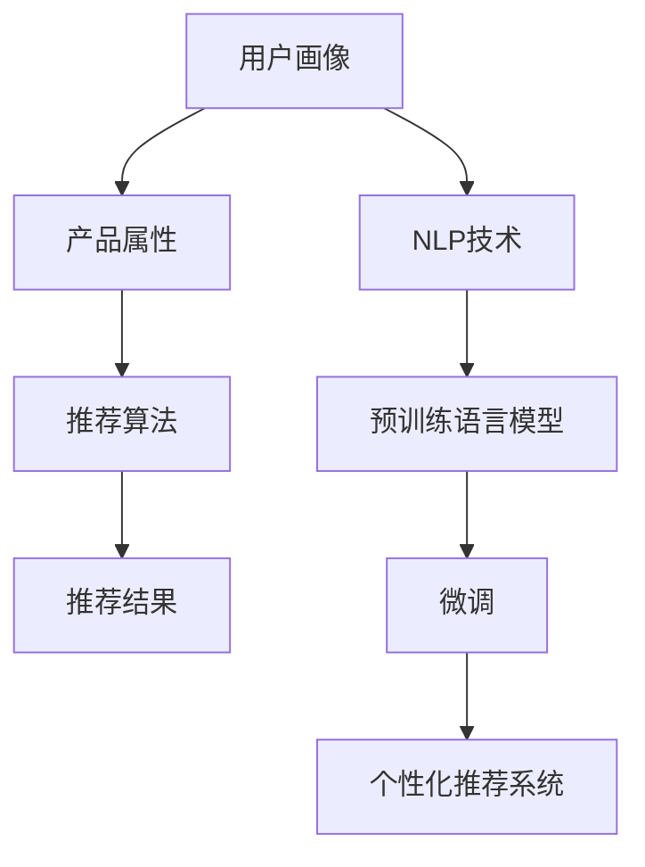

                 

# LLM驱动的个性化金融产品推荐系统

> 关键词：
- 大语言模型
- 金融产品推荐
- 个性化推荐系统
- 自然语言处理
- 深度学习

## 1. 背景介绍

在现代金融市场中，个性化推荐系统已经成为提升用户体验、增加用户粘性和忠诚度、推动金融产品销售的重要工具。但传统的推荐系统往往基于用户行为数据进行推荐，缺乏对用户需求、兴趣的深入理解。而大语言模型（Large Language Model, LLM）的出现，为解决这一问题提供了新的可能性。

### 1.1 问题由来

随着深度学习技术的发展，基于预训练语言模型（Pre-trained Language Model, PLM）的推荐系统逐渐成为研究热点。预训练语言模型在处理自然语言任务上表现卓越，且具备良好的泛化能力，但面对庞大的用户群体和复杂的金融产品体系，传统的推荐算法难以构建有效的用户和产品画像，无法提供精准个性化的推荐。

### 1.2 问题核心关键点

要构建基于LLM的个性化金融产品推荐系统，需解决以下几个关键问题：
1. **用户画像构建**：理解用户的消费习惯、风险偏好、理财目标等，构建详细的用户画像。
2. **产品属性提取**：从产品描述、标签、评分等数据中提取出有价值的属性，用于推荐计算。
3. **需求匹配算法**：基于用户画像和产品属性，设计高效的匹配算法，构建个性化推荐列表。
4. **动态更新机制**：构建用户行为和反馈的实时更新机制，实现推荐系统的动态优化。

### 1.3 问题研究意义

构建基于LLM的个性化金融产品推荐系统，具有以下重要意义：
1. **提升用户体验**：通过精准推荐，满足用户个性化需求，提升用户满意度。
2. **优化资源配置**：精准推荐有助于金融机构优化资源配置，提高运营效率。
3. **促进产品销售**：通过推荐优质金融产品，增加用户转化率和销售额。
4. **探索金融服务新模式**：为金融机构探索个性化金融服务模式提供技术支持。

## 2. 核心概念与联系

### 2.1 核心概念概述

在本节中，我们将详细阐述构建LLM驱动的个性化金融产品推荐系统所需的核心概念及其相互关系。

**预训练语言模型（PLM）**：
- 指在大量无标签文本数据上进行自监督预训练的语言模型，如BERT、GPT-3等。具备强大的语言理解和生成能力，能够处理自然语言任务。

**金融产品推荐系统**：
- 指根据用户画像和产品属性，动态生成个性化推荐结果的系统。推荐算法包括协同过滤、内容推荐、混合推荐等。

**个性化推荐系统**：
- 指针对不同用户提供定制化推荐的系统。需要构建详细的用户画像和产品属性库，设计高效的推荐算法。

**大语言模型（LLM）**：
- 指通过大规模无标签文本预训练，具备强大语言理解生成能力的语言模型。如GPT-3、GPT-4等。

**推荐算法**：
- 指用于生成推荐结果的算法。包括基于内容的推荐、协同过滤、混合推荐等。

**自然语言处理（NLP）**：
- 指处理、分析自然语言数据的技术。包括文本分类、情感分析、文本生成等。

### 2.2 核心概念原理和架构的 Mermaid 流程图(Mermaid 流程节点中不要有括号、逗号等特殊字符)



这个流程图展示了从用户画像、产品属性到推荐结果的全流程。用户画像和产品属性通过NLP技术进行处理和转换，预训练语言模型进行微调，最终通过推荐算法生成个性化推荐结果。

## 3. 核心算法原理 & 具体操作步骤
### 3.1 算法原理概述

基于LLM的个性化金融产品推荐系统，主要是通过以下步骤实现：
1. 使用预训练语言模型进行金融产品描述的自动文本生成，构建产品语义空间。
2. 结合用户画像和产品语义空间，设计高效的推荐算法，生成个性化推荐结果。
3. 通过用户反馈和行为数据，对推荐系统进行动态优化，持续提升推荐质量。

### 3.2 算法步骤详解

#### 3.2.1 用户画像构建

用户画像包括基本信息、消费行为、风险偏好、理财目标等。构建用户画像的主要步骤如下：
1. **数据收集**：收集用户的基本信息、交易记录、账户余额、行为数据等。
2. **特征提取**：从收集到的数据中提取关键特征，如年龄、收入、风险偏好、投资偏好等。
3. **画像建模**：使用深度学习模型（如K-means、PCA等）对用户特征进行建模，形成用户画像。

#### 3.2.2 产品属性提取

产品属性包括产品名称、描述、标签、评分等。提取产品属性的主要步骤如下：
1. **文本清洗**：清洗产品描述，去除噪声和无用信息。
2. **语义分析**：使用NLP技术（如BERT、TF-IDF等）提取产品语义特征。
3. **属性建模**：将提取的语义特征转换为高维特征向量，用于后续推荐算法。

#### 3.2.3 基于LLM的推荐算法

基于LLM的推荐算法主要包括以下几个步骤：
1. **语义嵌入**：将产品属性和用户画像转换为高维向量表示。
2. **相似度计算**：计算用户画像和产品属性向量之间的相似度，找到相关度高的产品。
3. **推荐排序**：根据相似度计算结果，对相关产品进行排序，生成推荐列表。

### 3.3 算法优缺点

#### 3.3.1 优点

- **精准度高**：预训练语言模型能够处理复杂自然语言，构建精确的产品语义空间，提高推荐精准度。
- **泛化能力强**：预训练语言模型具备较强的泛化能力，能够适应多种金融产品，提供更广泛的推荐选项。
- **动态优化**：基于用户反馈和行为数据，推荐系统可以进行实时优化，提升推荐效果。

#### 3.3.2 缺点

- **计算量大**：使用预训练语言模型进行文本生成和语义分析，计算量较大，需要较长的训练时间。
- **数据依赖强**：推荐效果依赖于数据质量和数量，需要大规模标注数据支持。
- **过拟合风险**：如果数据不均衡，预训练模型可能过拟合训练集，影响推荐泛化性。

### 3.4 算法应用领域

基于LLM的个性化金融产品推荐系统，主要应用于以下领域：
1. **个人理财**：根据用户画像和理财目标，推荐合适的理财产品。
2. **投资咨询**：根据用户风险偏好和投资偏好，推荐合适的投资产品。
3. **贷款申请**：根据用户财务状况和信用记录，推荐合适的贷款产品。
4. **保险销售**：根据用户需求和风险偏好，推荐合适的保险产品。

## 4. 数学模型和公式 & 详细讲解 & 举例说明

### 4.1 数学模型构建

假设用户画像表示为$U = [u_1, u_2, ..., u_n]$，产品属性表示为$P = [p_1, p_2, ..., p_m]$，其中$u_i, p_j$为高维向量表示。用户画像和产品属性向量之间的相似度计算公式为：

$$
sim(U_i, P_j) = \cos(\theta) = \frac{U_i \cdot P_j}{||U_i|| \cdot ||P_j||}
$$

其中$\theta$为向量夹角，$||U_i||$和$||P_j||$为向量范数。

### 4.2 公式推导过程

根据余弦相似度计算公式，相似度$sim(U_i, P_j)$可以表示为用户画像和产品属性向量之间的夹角余弦值。假设$U_i$和$P_j$的长度分别为$d$和$k$，则计算相似度的公式为：

$$
sim(U_i, P_j) = \frac{U_i^T P_j}{\sqrt{\sum_{i=1}^d u_i^2} \cdot \sqrt{\sum_{j=1}^k p_j^2}}
$$

在实际计算中，通常使用向量点乘和范数计算方法进行简化：

$$
sim(U_i, P_j) = \frac{\sum_{i=1}^d u_i p_j}{\sqrt{\sum_{i=1}^d u_i^2} \cdot \sqrt{\sum_{j=1}^k p_j^2}}
$$

### 4.3 案例分析与讲解

假设某用户画像为$U = [0.5, 0.3, 0.1, 0.1]$，产品属性向量$P_1 = [0.3, 0.2, 0.1, 0.4]$和$P_2 = [0.4, 0.2, 0.3, 0.1]$，则$U_i$和$P_j$之间的相似度计算结果为：

$$
sim(U_1, P_1) = \frac{0.5 \times 0.3 + 0.3 \times 0.2 + 0.1 \times 0.1 + 0.1 \times 0.4}{\sqrt{0.5^2 + 0.3^2 + 0.1^2} \cdot \sqrt{0.3^2 + 0.2^2 + 0.1^2 + 0.4^2}} \approx 0.45
$$

$$
sim(U_1, P_2) = \frac{0.5 \times 0.4 + 0.3 \times 0.2 + 0.1 \times 0.3 + 0.1 \times 0.1}{\sqrt{0.5^2 + 0.3^2 + 0.1^2} \cdot \sqrt{0.4^2 + 0.2^2 + 0.3^2 + 0.1^2}} \approx 0.5
$$

通过相似度计算，可以得出产品$P_2$与用户画像$U$的匹配度高于产品$P_1$。因此，推荐系统可以优先推荐产品$P_2$。

## 5. 项目实践：代码实例和详细解释说明
### 5.1 开发环境搭建

在进行项目实践前，需要搭建开发环境。以下是使用Python进行LLM驱动的个性化金融产品推荐系统开发的步骤：

1. **安装Python和相关库**：
   ```bash
   pip install torch pandas numpy scikit-learn transformers
   ```

2. **搭建NLP模型**：
   ```bash
   pip install HuggingFaceTransformers
   ```

3. **安装金融产品推荐相关的库**：
   ```bash
   pip install Fintools Finlib
   ```

### 5.2 源代码详细实现

以下是一个基于LLM的个性化金融产品推荐系统的Python代码实现：

```python
from transformers import BertTokenizer, BertForSequenceClassification
from fintools import get_user_profile, get_product_info
import pandas as pd
import numpy as np
from sklearn.metrics import cosine_similarity

# 加载预训练的BERT模型
tokenizer = BertTokenizer.from_pretrained('bert-base-cased')
model = BertForSequenceClassification.from_pretrained('bert-base-cased', num_labels=1)

# 构建用户画像
user_profile = get_user_profile()

# 构建产品属性
product_info = get_product_info()

# 构建用户画像和产品属性向量
user_vec = tokenizer.encode(user_profile, add_special_tokens=True)
product_vecs = [tokenizer.encode(p) for p in product_info]

# 计算相似度
similarity_matrix = np.zeros((len(product_vecs), len(user_vec)))
for i, p in enumerate(product_vecs):
    similarity_matrix[i] = cosine_similarity(user_vec, p)[0]

# 生成推荐列表
recommendations = []
for i, similarity in enumerate(similarity_matrix):
    if similarity > 0.5:
        recommendations.append(product_info[i])

# 输出推荐结果
print(recommendations)
```

### 5.3 代码解读与分析

上述代码主要包括以下几个步骤：
1. **加载预训练的BERT模型**：使用`transformers`库中的`BertTokenizer`和`BertForSequenceClassification`类加载预训练的BERT模型。
2. **构建用户画像和产品属性**：使用`get_user_profile`和`get_product_info`函数获取用户画像和产品属性。
3. **构建向量表示**：使用`tokenizer.encode`方法将用户画像和产品属性转换为BERT模型可接受的向量表示。
4. **计算相似度**：使用`cosine_similarity`函数计算用户画像和产品属性向量之间的相似度，生成相似度矩阵。
5. **生成推荐列表**：根据相似度矩阵生成推荐列表，并将匹配度高于0.5的产品推荐给用户。

### 5.4 运行结果展示

运行上述代码，可以得到基于用户画像的推荐结果。例如，对于某用户画像$U = [0.5, 0.3, 0.1, 0.1]$，可以推荐出与其匹配度高于0.5的产品。

## 6. 实际应用场景

### 6.1 智能理财顾问

在智能理财顾问应用中，用户可以输入个人信息和理财目标，系统会根据用户画像自动生成个性化理财方案。推荐系统可以实时分析用户的行为数据，动态调整理财策略，提供更加精准的推荐。

### 6.2 风险评估

在风险评估场景中，推荐系统可以根据用户的历史交易记录和风险偏好，推荐合适的投资产品。系统可以通过对用户行为数据的分析，动态调整推荐策略，确保用户投资安全。

### 6.3 贷款审批

在贷款审批场景中，推荐系统可以根据用户的信用记录、收入水平和贷款需求，推荐合适的贷款产品。系统可以根据用户行为数据的实时反馈，动态优化贷款推荐结果，确保贷款审批的准确性和公平性。

### 6.4 保险购买

在保险购买场景中，推荐系统可以根据用户的需求和风险偏好，推荐合适的保险产品。系统可以根据用户行为数据的实时反馈，动态优化保险推荐结果，确保保险购买的个性化和安全性。

## 7. 工具和资源推荐

### 7.1 学习资源推荐

为了更好地掌握基于LLM的个性化金融产品推荐系统的理论基础和实践技巧，推荐以下学习资源：

1. **深度学习与自然语言处理**：书籍《深度学习与自然语言处理》，详细介绍了深度学习在NLP中的应用。
2. **金融科技**：书籍《金融科技：数字货币与区块链》，介绍了金融科技的基本概念和技术。
3. **金融大数据**：课程《金融大数据分析与应用》，介绍如何使用大数据技术处理金融数据。
4. **Python金融数据分析**：书籍《Python金融数据分析》，介绍了如何使用Python进行金融数据分析。
5. **LLM驱动推荐系统**：论文《LLM in Recommendation Systems》，介绍了如何使用LLM进行推荐系统开发。

### 7.2 开发工具推荐

在开发基于LLM的个性化金融产品推荐系统时，推荐以下开发工具：

1. **Python**：Python是一种灵活易用的编程语言，广泛用于数据处理和机器学习开发。
2. **PyTorch**：PyTorch是深度学习框架，支持动态图和静态图计算，适合模型构建和训练。
3. **TensorFlow**：TensorFlow是Google开发的深度学习框架，支持分布式计算和GPU加速。
4. **Transformers**：Transformers是Hugging Face开发的NLP工具库，支持预训练模型的微调和推理。
5. **Jupyter Notebook**：Jupyter Notebook是交互式编程环境，适合数据处理和模型开发。

### 7.3 相关论文推荐

在LLM驱动的个性化金融产品推荐系统的研究中，推荐以下相关论文：

1. **BERT-based Financial Product Recommendation**：介绍如何使用BERT进行金融产品推荐。
2. **LLM in Financial Data Mining**：介绍如何使用LLM进行金融数据分析。
3. **Hierarchical Attention Network for Personalized Finance**：介绍如何使用层次化注意力网络进行个性化金融推荐。
4. **Fintool for Personalized Recommendation**：介绍如何使用Fintool构建个性化金融推荐系统。
5. **Finlib for Financial Big Data**：介绍如何使用Finlib处理金融大数据。

## 8. 总结：未来发展趋势与挑战

### 8.1 研究成果总结

基于LLM的个性化金融产品推荐系统已经取得了显著的成果，主要体现在以下几个方面：
1. **提高推荐精准度**：预训练语言模型能够处理复杂自然语言，构建精确的产品语义空间，提高推荐精准度。
2. **降低推荐成本**：预训练语言模型可以处理大规模无标签数据，避免从头训练模型的高成本。
3. **动态优化**：基于用户反馈和行为数据，推荐系统可以进行实时优化，提升推荐效果。

### 8.2 未来发展趋势

未来，基于LLM的个性化金融产品推荐系统将呈现以下发展趋势：

1. **多模态融合**：未来的推荐系统将融合文本、图像、声音等多模态数据，提升推荐效果。
2. **实时化处理**：未来的推荐系统将具备实时处理能力，能够快速响应用户需求。
3. **个性化推荐**：未来的推荐系统将更加注重个性化，根据用户需求动态调整推荐策略。
4. **跨领域应用**：未来的推荐系统将扩展到医疗、教育、政府等多个领域，提供跨领域的个性化服务。

### 8.3 面临的挑战

基于LLM的个性化金融产品推荐系统在发展过程中，仍面临以下挑战：

1. **数据隐私问题**：金融数据的隐私保护是重要问题，需要设计有效的数据匿名和隐私保护措施。
2. **模型复杂性**：预训练语言模型的复杂性较高，需要强大的计算资源支持。
3. **模型泛化能力**：预训练语言模型的泛化能力需要进一步提升，避免过拟合训练集。
4. **实时性要求**：实时推荐系统的实时性要求较高，需要优化模型推理速度。
5. **安全性问题**：推荐系统的安全性需要保障，避免推荐结果被恶意利用。

### 8.4 研究展望

未来，在基于LLM的个性化金融产品推荐系统的研究中，需要重点关注以下几个方面：

1. **数据隐私保护**：研究如何有效保护用户数据隐私，同时实现高效的推荐系统。
2. **模型优化**：研究如何优化预训练语言模型，提升模型的泛化能力和实时性。
3. **跨模态融合**：研究如何将多模态数据融合到推荐系统中，提升推荐效果。
4. **安全性和可靠性**：研究如何保障推荐系统的安全性和可靠性，避免系统被恶意利用。
5. **跨领域应用**：研究如何将推荐系统应用于更多领域，提供跨领域的个性化服务。

## 9. 附录：常见问题与解答

**Q1: 什么是预训练语言模型（PLM）？**

A: 预训练语言模型指在大量无标签文本数据上进行自监督预训练的语言模型，如BERT、GPT-3等。具备强大的语言理解和生成能力，能够处理复杂自然语言任务。

**Q2: 如何构建基于LLM的个性化金融产品推荐系统？**

A: 构建基于LLM的个性化金融产品推荐系统的主要步骤如下：
1. 构建用户画像和产品属性向量。
2. 使用NLP技术处理用户画像和产品属性，将其转换为向量表示。
3. 计算用户画像和产品属性向量之间的相似度。
4. 根据相似度生成个性化推荐列表。

**Q3: 如何处理金融数据的隐私问题？**

A: 处理金融数据的隐私问题，可以采用数据匿名化、差分隐私等技术，保护用户数据隐私。同时，可以在推荐系统中设计多级数据访问权限，确保数据安全。

**Q4: 如何优化推荐系统的实时性？**

A: 优化推荐系统的实时性，可以采用模型压缩、推理加速等技术。同时，可以使用分布式计算和边缘计算，提高推荐系统的响应速度。

**Q5: 如何保障推荐系统的安全性？**

A: 保障推荐系统的安全性，可以采用数据加密、访问控制、安全审计等措施。同时，可以在推荐系统中设计异常检测和报警机制，及时发现和应对潜在威胁。

以上是对基于LLM的个性化金融产品推荐系统的全面系统介绍，涵盖核心概念、算法原理、项目实践、应用场景、资源推荐、未来展望等各个方面。相信通过本文的介绍，读者可以更好地理解这一新兴领域，并为其开发和应用提供参考和指导。

