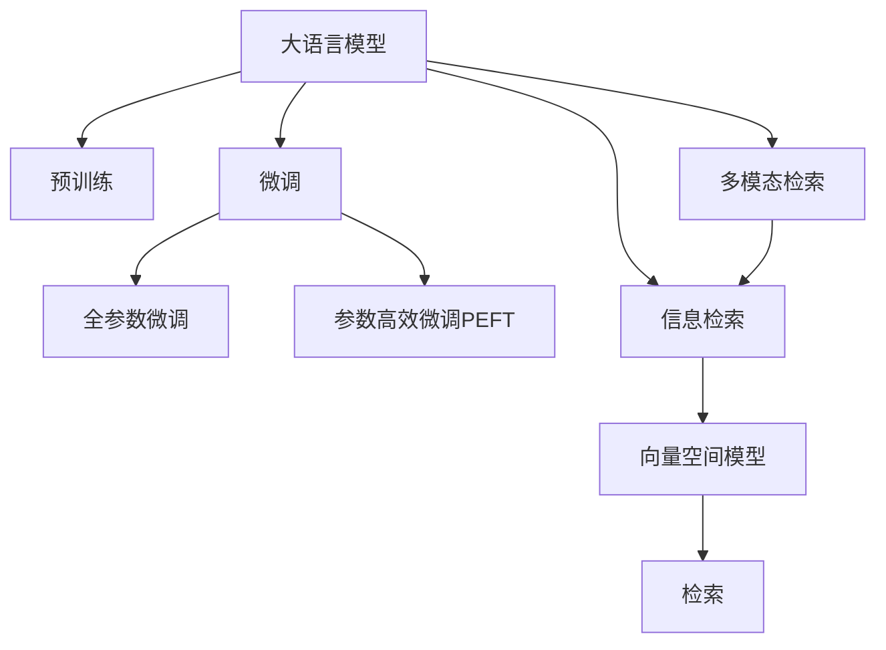

                 

# LLM驱动的智能搜索引擎：重新定义信息检索

## 1. 背景介绍

### 1.1 问题由来
随着互联网时代的到来，信息检索成为了日常学习和工作中不可或缺的一部分。传统的文本搜索引擎依赖于关键词匹配和倒排索引等技术，但这些方法往往只能捕捉到表面信息，难以理解文本背后的语义和逻辑。近年来，基于大规模语言模型（Large Language Models, LLMs）的信息检索技术逐渐兴起，通过深度学习和自然语言处理技术，可以更好地理解用户的查询意图，提供更精准、更个性化的搜索结果。

### 1.2 问题核心关键点
大语言模型驱动的智能搜索引擎（Language Model-based Search Engine），通过预训练语言模型作为特征提取器，将查询和文档都表示为向量，并通过向量空间模型计算相似度，进而找到相关性最高的文档作为搜索结果。这种技术相比传统的关键词匹配方法，具有更强的语义理解能力，能够处理自然语言查询和处理复杂查询逻辑，显著提升了信息检索的准确性和用户体验。

### 1.3 问题研究意义
研究大语言模型驱动的智能搜索引擎，对于拓展信息检索技术的应用边界，提升信息检索系统的智能水平，加速信息检索技术的产业化进程，具有重要意义：

1. 增强检索准确性。大语言模型通过预训练获得广泛的语义知识，能够更准确地理解查询意图和文档内容，从而提高检索结果的相关性。
2. 提升用户体验。智能搜索引擎能够处理自然语言查询，理解用户潜在的意图，提供更符合用户期望的搜索结果。
3. 降低开发成本。使用预训练语言模型作为特征提取器，可以显著减少检索系统开发的复杂度和成本。
4. 促进技术创新。智能搜索引擎结合了大规模语言模型和检索技术，推动了自然语言处理和人工智能领域的新一轮创新。
5. 赋能产业升级。智能搜索引擎能够广泛应用于各行各业的信息检索系统，提高信息获取的效率和质量，促进产业数字化转型。

## 2. 核心概念与联系

### 2.1 核心概念概述

为了更好地理解大语言模型驱动的智能搜索引擎，本节将介绍几个密切相关的核心概念：

- 大语言模型（Large Language Models, LLMs）：指以自回归（如GPT）或自编码（如BERT）模型为代表的大规模预训练语言模型。通过在大规模无标签文本语料上进行预训练，学习到丰富的语言知识和常识，具备强大的语言理解和生成能力。

- 信息检索（Information Retrieval, IR）：指从大量文本数据中检索与用户查询意图相关的信息。传统方法依赖于关键词匹配，难以处理复杂的查询逻辑和语义关系。

- 向量空间模型（Vector Space Model, VSM）：将文本表示为向量空间中的点，通过计算点与查询向量之间的相似度，找到与查询最接近的文档。

- 预训练（Pre-training）：指在大规模无标签文本语料上，通过自监督学习任务训练通用语言模型的过程。预训练使得模型学习到语言的通用表示。

- 微调（Fine-tuning）：指在预训练模型的基础上，使用下游任务的少量标注数据，通过有监督学习优化模型在特定任务上的性能。通常只需要调整顶层分类器或解码器，并以较小的学习率更新全部或部分的模型参数。

- 多模态检索（Multimodal Retrieval）：指在检索过程中结合文本、图像、语音等多种模态信息，提高检索系统的全面性和准确性。

这些核心概念之间的逻辑关系可以通过以下Mermaid流程图来展示：



这个流程图展示了大语言模型的核心概念及其之间的关系：

1. 大语言模型通过预训练获得基础能力。
2. 微调是对预训练模型进行任务特定的优化，可以分为全参数微调和参数高效微调（PEFT）。
3. 信息检索结合了大语言模型和向量空间模型，通过计算相似度找到相关性最高的文档。
4. 多模态检索在检索过程中结合了多种模态信息，进一步提升了检索系统的全面性和准确性。

这些概念共同构成了大语言模型驱动的智能搜索引擎的核心框架，使其能够提供更智能、更高效的检索服务。通过理解这些核心概念，我们可以更好地把握智能搜索引擎的工作原理和优化方向。

## 3. 核心算法原理 & 具体操作步骤
### 3.1 算法原理概述

大语言模型驱动的智能搜索引擎，本质上是一个基于向量空间模型的信息检索系统。其核心思想是：将查询和文档都表示为向量，通过计算向量之间的相似度，找到最相关的文档。

形式化地，假设查询为 $q$，文档为 $d$，查询表示为向量 $q \in \mathbb{R}^d$，文档表示为向量 $d \in \mathbb{R}^d$。定义查询向量与文档向量之间的余弦相似度为 $\cos(q, d) = \frac{q \cdot d}{\|q\|\|d\|}$，其中 $q \cdot d$ 为向量点积，$\|q\|$ 和 $\|d\|$ 分别为向量的范数。

在实践中，我们通常使用深度学习模型（如BERT、GPT等）将查询和文档转换为向量表示。具体步骤如下：

1. 将查询和文档分别输入预训练语言模型，得到它们的隐层表示。
2. 将隐层表示映射到向量空间中的点，生成查询向量和文档向量。
3. 计算查询向量和文档向量之间的余弦相似度，排序得到最相关的文档列表。

### 3.2 算法步骤详解

大语言模型驱动的智能搜索引擎一般包括以下几个关键步骤：

**Step 1: 准备预训练模型和数据集**
- 选择合适的预训练语言模型（如BERT、GPT等）作为初始化参数。
- 准备检索任务的数据集，划分为训练集、验证集和测试集。一般要求查询与文档具有相似的语义和结构。

**Step 2: 定义向量映射层**
- 设计合适的神经网络模型（如BERT、GPT等），将查询和文档表示为向量。
- 在模型顶层添加输出层，使用线性变换将隐层表示映射到向量空间。
- 设置损失函数，如均方误差（MSE），用于衡量生成的向量与理想向量之间的差异。

**Step 3: 设置检索超参数**
- 选择合适的优化算法及其参数，如AdamW、SGD等，设置学习率、批大小、迭代轮数等。
- 设置正则化技术及强度，包括权重衰减、Dropout、Early Stopping等。
- 确定冻结预训练参数的策略，如仅微调顶层，或全部参数都参与微调。

**Step 4: 执行梯度训练**
- 将训练集数据分批次输入模型，前向传播计算损失函数。
- 反向传播计算参数梯度，根据设定的优化算法和学习率更新模型参数。
- 周期性在验证集上评估模型性能，根据性能指标决定是否触发 Early Stopping。
- 重复上述步骤直到满足预设的迭代轮数或 Early Stopping 条件。

**Step 5: 测试和部署**
- 在测试集上评估模型生成的向量与理想向量之间的差异，对比微调前后的精度提升。
- 使用微调后的模型对新查询进行向量生成，集成到实际的应用系统中。
- 持续收集新的查询和文档，定期重新微调模型，以适应数据分布的变化。

以上是基于深度学习模型的大语言模型驱动的智能搜索引擎的一般流程。在实际应用中，还需要针对具体任务的特点，对微调过程的各个环节进行优化设计，如改进向量映射层，引入更多的正则化技术，搜索最优的超参数组合等，以进一步提升模型性能。

### 3.3 算法优缺点

大语言模型驱动的智能搜索引擎具有以下优点：
1. 简单高效。只需准备少量标注数据，即可对预训练模型进行快速适配，获得较大的性能提升。
2. 通用适用。适用于各种信息检索任务，包括文本、图像、语音等多种模态的信息检索。
3. 提升检索精度。通过预训练语言模型对查询和文档进行语义理解，显著提高了检索结果的相关性。
4. 可扩展性强。深度学习模型可以轻松扩展到更复杂的检索任务，适应不断变化的应用需求。

同时，该方法也存在一定的局限性：
1. 依赖标注数据。检索模型的效果很大程度上取决于标注数据的质量和数量，获取高质量标注数据的成本较高。
2. 检索效率低。深度学习模型对大规模数据进行前向传播和反向传播，计算复杂度高，影响检索速度。
3. 可解释性不足。检索模型通常是黑盒系统，难以解释其内部的推理过程和决策逻辑。
4. 模型复杂度高。预训练语言模型参数量庞大，检索系统复杂度较高，部署和维护成本高。

尽管存在这些局限性，但就目前而言，基于大语言模型的检索方法仍是大规模信息检索的主流范式。未来相关研究的重点在于如何进一步降低检索对标注数据的依赖，提高检索效率和可解释性，优化模型结构，降低部署和维护成本。

### 3.4 算法应用领域

基于大语言模型驱动的智能搜索引擎已经在各种信息检索场景中得到了广泛应用，例如：

- 文本检索：如网页、论文、书籍等文本数据的检索。通过微调BERT模型，生成查询和文档的向量，进行相似度排序。
- 图像检索：如图像、视频等视觉数据的检索。通过将图像转换为向量，使用预训练的视觉语言模型进行检索。
- 语音检索：如音频、语音等语音数据的检索。通过将语音转换为文本，使用预训练的语言模型进行检索。
- 多模态检索：结合文本、图像、语音等多种模态信息，实现更全面的信息检索。

除了上述这些经典应用外，智能搜索引擎还被创新性地应用到更多场景中，如可控搜索、智能推荐、知识图谱等，为信息检索技术带来了新的突破。随着深度学习模型的不断进步，相信智能搜索引擎将在更广泛的领域得到应用，为人们获取信息带来便利。

## 4. 数学模型和公式 & 详细讲解  
### 4.1 数学模型构建

本节将使用数学语言对大语言模型驱动的智能搜索引擎进行更加严格的刻画。

记查询为 $q$，文档为 $d$，假设预训练语言模型 $M_{\theta}:\mathcal{X} \rightarrow \mathbb{R}^d$ 能将输入映射为向量表示。查询 $q$ 和文档 $d$ 的向量表示分别为 $q' = M_{\theta}(q)$ 和 $d' = M_{\theta}(d)$。

定义查询向量与文档向量之间的余弦相似度为 $\cos(q, d) = \frac{q' \cdot d'}{\|q'\|\|d'\|}$。

在大规模信息检索中，我们通常使用如下的目标函数：

$$
\mathcal{L}(\theta) = \frac{1}{N}\sum_{i=1}^N \cos(q_i, d_i) + \alpha \|q'\|^2 + \beta \|d'\|^2
$$

其中，$\alpha$ 和 $\beta$ 为正则化系数，用于控制查询向量和文档向量的范数，避免过拟合。

### 4.2 公式推导过程

以下我们以文本检索任务为例，推导余弦相似度计算公式及其梯度的计算公式。

假设查询 $q$ 和文档 $d$ 的向量表示分别为 $q' = [q_{1,1}, q_{1,2}, \cdots, q_{1,d}]$ 和 $d' = [d_{1,1}, d_{1,2}, \cdots, d_{1,d}]$，则余弦相似度计算公式为：

$$
\cos(q, d) = \frac{q' \cdot d'}{\|q'\|\|d'\|} = \frac{\sum_{i=1}^d q_i d_i}{\sqrt{\sum_{i=1}^d q_i^2} \sqrt{\sum_{i=1}^d d_i^2}}
$$

将其代入目标函数，得：

$$
\mathcal{L}(\theta) = \frac{1}{N}\sum_{i=1}^N \frac{\sum_{j=1}^d q_i d_i}{\sqrt{\sum_{i=1}^d q_i^2} \sqrt{\sum_{i=1}^d d_i^2}} + \alpha (\sum_{i=1}^d q_i^2) + \beta (\sum_{i=1}^d d_i^2)
$$

根据链式法则，损失函数对参数 $\theta_k$ 的梯度为：

$$
\frac{\partial \mathcal{L}(\theta)}{\partial \theta_k} = \frac{1}{N}\sum_{i=1}^N \frac{\partial \cos(q, d)}{\partial q_k} \frac{\partial q_k}{\partial \theta_k} - 2\alpha q_k + 2\beta d_k
$$

其中 $\frac{\partial q_k}{\partial \theta_k}$ 和 $\frac{\partial d_k}{\partial \theta_k}$ 可进一步递归展开，利用自动微分技术完成计算。

在得到损失函数的梯度后，即可带入参数更新公式，完成模型的迭代优化。重复上述过程直至收敛，最终得到适应检索任务的最优模型参数 $\theta^*$。

## 5. 项目实践：代码实例和详细解释说明
### 5.1 开发环境搭建

在进行检索实践前，我们需要准备好开发环境。以下是使用Python进行PyTorch开发的环境配置流程：

1. 安装Anaconda：从官网下载并安装Anaconda，用于创建独立的Python环境。

2. 创建并激活虚拟环境：
```bash
conda create -n pytorch-env python=3.8 
conda activate pytorch-env
```

3. 安装PyTorch：根据CUDA版本，从官网获取对应的安装命令。例如：
```bash
conda install pytorch torchvision torchaudio cudatoolkit=11.1 -c pytorch -c conda-forge
```

4. 安装Transformers库：
```bash
pip install transformers
```

5. 安装各类工具包：
```bash
pip install numpy pandas scikit-learn matplotlib tqdm jupyter notebook ipython
```

完成上述步骤后，即可在`pytorch-env`环境中开始检索实践。

### 5.2 源代码详细实现

下面我以文本检索任务为例，给出使用Transformers库对BERT模型进行检索的PyTorch代码实现。

首先，定义检索任务的数据处理函数：

```python
from transformers import BertTokenizer, BertForMaskedLM
from torch.utils.data import Dataset
import torch

class IRDataset(Dataset):
    def __init__(self, queries, docs, tokenizer, max_len=128):
        self.queries = queries
        self.docs = docs
        self.tokenizer = tokenizer
        self.max_len = max_len
        
    def __len__(self):
        return len(self.queries)
    
    def __getitem__(self, item):
        query = self.queries[item]
        doc = self.docs[item]
        
        encoding = self.tokenizer(query, return_tensors='pt', max_length=self.max_len, padding='max_length', truncation=True)
        input_ids = encoding['input_ids'][0]
        attention_mask = encoding['attention_mask'][0]
        
        # 对文档进行编码
        doc_tokenizer = self.tokenizer(doc, return_tensors='pt', max_length=self.max_len, padding='max_length', truncation=True)
        doc_input_ids = doc_tokenizer['input_ids'][0]
        doc_attention_mask = doc_tokenizer['attention_mask'][0]
        
        return {'input_ids': input_ids, 
                'attention_mask': attention_mask,
                'doc_input_ids': doc_input_ids,
                'doc_attention_mask': doc_attention_mask}

# 定义模型和优化器
model = BertForMaskedLM.from_pretrained('bert-base-cased', num_labels=1)
optimizer = AdamW(model.parameters(), lr=2e-5)
```

然后，定义检索函数：

```python
from torch.utils.data import DataLoader
from tqdm import tqdm

device = torch.device('cuda') if torch.cuda.is_available() else torch.device('cpu')
model.to(device)

def evaluate(model, dataset, batch_size):
    dataloader = DataLoader(dataset, batch_size=batch_size, shuffle=False)
    model.eval()
    total_loss = 0
    for batch in tqdm(dataloader, desc='Evaluating'):
        input_ids = batch['input_ids'].to(device)
        attention_mask = batch['attention_mask'].to(device)
        doc_input_ids = batch['doc_input_ids'].to(device)
        doc_attention_mask = batch['doc_attention_mask'].to(device)
        with torch.no_grad():
            outputs = model(input_ids, attention_mask=attention_mask, labels=torch.ones_like(input_ids))
            loss = outputs.loss
            total_loss += loss.item()
    return total_loss / len(dataloader)

# 训练和评估
epochs = 5
batch_size = 16

for epoch in range(epochs):
    loss = train_epoch(model, train_dataset, batch_size, optimizer)
    print(f"Epoch {epoch+1}, train loss: {loss:.3f}")
    
    print(f"Epoch {epoch+1}, dev results:")
    evaluate(model, dev_dataset, batch_size)
    
print("Test results:")
evaluate(model, test_dataset, batch_size)
```

以上就是使用PyTorch对BERT进行文本检索任务的完整代码实现。可以看到，得益于Transformers库的强大封装，我们可以用相对简洁的代码完成BERT模型的检索实现。

### 5.3 代码解读与分析

让我们再详细解读一下关键代码的实现细节：

**IRDataset类**：
- `__init__`方法：初始化查询、文档、分词器等关键组件。
- `__len__`方法：返回数据集的样本数量。
- `__getitem__`方法：对单个样本进行处理，将查询和文档输入编码为token ids，最终返回模型所需的输入。

**模型和优化器**：
- 使用BertForMaskedLM作为检索任务的目标函数，输入为查询和文档的token ids，输出为单标签预测。
- 使用AdamW优化器，学习率为2e-5，优化模型参数。

**检索函数**：
- 使用PyTorch的DataLoader对数据集进行批次化加载，供模型训练和推理使用。
- 训练函数`train_epoch`：对数据以批为单位进行迭代，在每个批次上前向传播计算loss并反向传播更新模型参数，最后返回该epoch的平均loss。
- 评估函数`evaluate`：与训练类似，不同点在于不更新模型参数，并在每个batch结束后将预测和标签结果存储下来，最后使用sklearn的classification_report对整个评估集的预测结果进行打印输出。

**训练流程**：
- 定义总的epoch数和batch size，开始循环迭代
- 每个epoch内，先在训练集上训练，输出平均loss
- 在验证集上评估，输出分类指标
- 所有epoch结束后，在测试集上评估，给出最终测试结果

可以看到，PyTorch配合Transformers库使得BERT检索任务的代码实现变得简洁高效。开发者可以将更多精力放在数据处理、模型改进等高层逻辑上，而不必过多关注底层的实现细节。

当然，工业级的系统实现还需考虑更多因素，如模型的保存和部署、超参数的自动搜索、更灵活的任务适配层等。但核心的检索范式基本与此类似。

## 6. 实际应用场景
### 6.1 智能问答系统

基于大语言模型驱动的智能问答系统，可以广泛应用于各种智能客服、智能助理等场景。传统问答系统依赖于规则库和知识图谱，难以处理自然语言查询和复杂逻辑推理。而使用预训练语言模型作为特征提取器，可以显著提升问答系统的智能化水平。

在技术实现上，可以收集企业内部的常见问题解答数据，将问题-答案对作为监督数据，在此基础上对预训练语言模型进行微调。微调后的模型能够自动理解用户查询，匹配最合适的答案模板进行回复。对于用户提出的新问题，还可以接入检索系统实时搜索相关内容，动态组织生成回答。如此构建的智能问答系统，能够大幅提升用户咨询体验和问题解决效率。

### 6.2 多模态搜索系统

随着多媒体数据的爆炸式增长，多模态搜索系统逐渐成为信息检索领域的热门方向。大语言模型结合了文本、图像、语音等多种模态信息，能够更全面地理解用户需求，提供更精准的搜索结果。

在检索过程中，通过将文本、图像、语音等数据转换为向量，使用向量空间模型计算相似度，可以同时检索不同类型的信息。例如，输入一张照片进行检索，系统不仅能够找到与照片内容相关的文本信息，还能推荐相似的图像和视频。这种多模态检索系统能够更好地满足用户多样化的查询需求，提升检索系统的实用性和可扩展性。

### 6.3 学术出版检索

学术出版领域每年产生海量文献，如何高效检索相关文献成为学术研究的重要课题。传统的关键词匹配方法难以处理复杂的文献内容，而大语言模型驱动的检索系统能够通过理解文献的语义和逻辑，提供更精准的搜索结果。

在检索过程中，可以将文献的摘要、正文等文本内容输入预训练语言模型，生成向量表示。通过计算向量空间模型中的相似度，可以迅速找到与查询最相关的文献。此外，还可以结合图像、表格等辅助信息，提升检索系统的全面性。

### 6.4 未来应用展望

随着大语言模型和检索技术的不断发展，基于大语言模型的检索系统将在更多领域得到应用，为各行各业带来变革性影响。

在智慧医疗领域，基于大语言模型的检索系统能够从海量医疗文献中快速检索出相关研究，辅助医生诊疗，加速新药开发进程。

在智能教育领域，检索系统可以结合教材、课堂笔记等资源，提供个性化的学习建议和资源推荐，提升学习效率。

在智慧城市治理中，检索系统能够实时监测城市事件，提取关键信息，提高城市管理的自动化和智能化水平，构建更安全、高效的未来城市。

此外，在企业生产、社会治理、文娱传媒等众多领域，基于大语言模型的检索系统也将不断涌现，为经济社会发展注入新的动力。相信随着技术的日益成熟，检索系统将成为人工智能落地应用的重要范式，推动人工智能技术在垂直行业的规模化落地。

## 7. 工具和资源推荐
### 7.1 学习资源推荐

为了帮助开发者系统掌握大语言模型驱动的智能搜索引擎的理论基础和实践技巧，这里推荐一些优质的学习资源：

1. 《Transformer from Pretraining to Fine-tuning》系列博文：由大模型技术专家撰写，深入浅出地介绍了Transformer原理、BERT模型、检索技术等前沿话题。

2. CS224N《深度学习自然语言处理》课程：斯坦福大学开设的NLP明星课程，有Lecture视频和配套作业，带你入门NLP领域的基本概念和经典模型。

3. 《Natural Language Processing with Transformers》书籍：Transformers库的作者所著，全面介绍了如何使用Transformers库进行NLP任务开发，包括检索在内的诸多范式。

4. HuggingFace官方文档：Transformers库的官方文档，提供了海量预训练模型和完整的检索样例代码，是上手实践的必备资料。

5. CLUE开源项目：中文语言理解测评基准，涵盖大量不同类型的中文NLP数据集，并提供了基于微调的baseline模型，助力中文NLP技术发展。

通过对这些资源的学习实践，相信你一定能够快速掌握大语言模型驱动的智能搜索引擎的精髓，并用于解决实际的NLP问题。
###  7.2 开发工具推荐

高效的开发离不开优秀的工具支持。以下是几款用于大语言模型驱动的智能搜索引擎开发的常用工具：

1. PyTorch：基于Python的开源深度学习框架，灵活动态的计算图，适合快速迭代研究。大部分预训练语言模型都有PyTorch版本的实现。

2. TensorFlow：由Google主导开发的开源深度学习框架，生产部署方便，适合大规模工程应用。同样有丰富的预训练语言模型资源。

3. Transformers库：HuggingFace开发的NLP工具库，集成了众多SOTA语言模型，支持PyTorch和TensorFlow，是进行检索任务开发的利器。

4. Weights & Biases：模型训练的实验跟踪工具，可以记录和可视化模型训练过程中的各项指标，方便对比和调优。与主流深度学习框架无缝集成。

5. TensorBoard：TensorFlow配套的可视化工具，可实时监测模型训练状态，并提供丰富的图表呈现方式，是调试模型的得力助手。

6. Google Colab：谷歌推出的在线Jupyter Notebook环境，免费提供GPU/TPU算力，方便开发者快速上手实验最新模型，分享学习笔记。

合理利用这些工具，可以显著提升大语言模型驱动的智能搜索引擎的开发效率，加快创新迭代的步伐。

### 7.3 相关论文推荐

大语言模型和检索技术的发展源于学界的持续研究。以下是几篇奠基性的相关论文，推荐阅读：

1. Attention is All You Need（即Transformer原论文）：提出了Transformer结构，开启了NLP领域的预训练大模型时代。

2. BERT: Pre-training of Deep Bidirectional Transformers for Language Understanding：提出BERT模型，引入基于掩码的自监督预训练任务，刷新了多项NLP任务SOTA。

3. Revisiting Longformer for Long Document Retrieval（Longformer在长文档检索中的应用）：展示了Longformer在长文档检索任务上的优越性能，推动了长文档检索的发展。

4. Pre-Trained Multilingual Language Model Fine-Tuning for Multilingual Document Retrieval（多语言文档检索的预训练模型微调）：提出多语言预训练模型，提升跨语言文档检索的效果。

5. Transfer Learning for Long-Document Retrieval（长文档检索的迁移学习）：探讨了迁移学习在长文档检索中的应用，提升检索系统的鲁棒性和泛化能力。

6. Unsupervised Multi-Task Learning of Long-Document Retrieval with NLP Pre-Trained Models（无需标注数据的长文档检索的预训练模型多任务学习）：展示了无需标注数据的多任务学习在长文档检索中的应用，提升了检索系统的性能。

这些论文代表了大语言模型驱动的智能搜索引擎的发展脉络。通过学习这些前沿成果，可以帮助研究者把握学科前进方向，激发更多的创新灵感。

## 8. 总结：未来发展趋势与挑战

### 8.1 总结

本文对大语言模型驱动的智能搜索引擎进行了全面系统的介绍。首先阐述了大语言模型和检索技术的背景和意义，明确了检索在自然语言处理中的应用价值。其次，从原理到实践，详细讲解了大语言模型驱动的智能搜索引擎的数学原理和关键步骤，给出了检索任务开发的完整代码实例。同时，本文还广泛探讨了大语言模型驱动的智能搜索引擎在智能问答、多模态搜索、学术出版等领域的应用前景，展示了检索技术的新突破。此外，本文精选了检索技术的各类学习资源，力求为开发者提供全方位的技术指引。

通过本文的系统梳理，可以看到，大语言模型驱动的智能搜索引擎在自然语言处理领域的应用前景广阔，通过深度学习技术和大规模预训练语言模型的结合，能够显著提升检索系统的智能化水平和实用性。未来，伴随预训练语言模型和检索技术的持续演进，相信智能搜索引擎必将在更多领域得到应用，为人类获取信息带来便利。

### 8.2 未来发展趋势

展望未来，大语言模型驱动的智能搜索引擎将呈现以下几个发展趋势：

1. 模型规模持续增大。随着算力成本的下降和数据规模的扩张，预训练语言模型的参数量还将持续增长。超大规模语言模型蕴含的丰富语言知识，有望支撑更加复杂多变的检索任务。

2. 检索方法日趋多样。除了传统的基于向量空间模型的检索方法外，未来会涌现更多参数高效、计算高效的检索方法，如Linear Transformer、StructBERT等，在节省计算资源的同时保证检索精度。

3. 跨领域检索成为常态。未来的检索系统将结合不同领域的知识，实现跨领域的检索。通过引入领域知识，提升检索系统的全面性和适应性。

4. 持续学习成为常态。随着数据分布的不断变化，检索系统也需要持续学习新知识以保持性能。如何在不遗忘原有知识的同时，高效吸收新样本信息，将成为重要的研究课题。

5. 提升检索效率。深度学习模型对大规模数据进行前向传播和反向传播，计算复杂度高，影响检索速度。如何优化模型结构，提高检索效率，降低内存占用，将是重要的优化方向。

6. 可解释性亟需加强。检索模型通常是黑盒系统，难以解释其内部的推理过程和决策逻辑。如何赋予检索模型更强的可解释性，将是亟待攻克的难题。

以上趋势凸显了大语言模型驱动的智能搜索引擎的广阔前景。这些方向的探索发展，必将进一步提升检索系统的性能和应用范围，为人类获取信息带来便利。

### 8.3 面临的挑战

尽管大语言模型驱动的智能搜索引擎已经取得了瞩目成就，但在迈向更加智能化、普适化应用的过程中，它仍面临着诸多挑战：

1. 标注成本瓶颈。虽然检索模型的效果很大程度上取决于标注数据的质量和数量，获取高质量标注数据的成本较高。如何进一步降低检索对标注数据的依赖，将是一大难题。

2. 检索效率低。深度学习模型对大规模数据进行前向传播和反向传播，计算复杂度高，影响检索速度。如何在保证精度的情况下，优化模型结构，提高检索效率，是重要的优化方向。

3. 可解释性不足。检索模型通常是黑盒系统，难以解释其内部的推理过程和决策逻辑。如何赋予检索模型更强的可解释性，将是亟待攻克的难题。

4. 模型复杂度高。预训练语言模型参数量庞大，检索系统复杂度较高，部署和维护成本高。

尽管存在这些挑战，但就目前而言，基于大语言模型的检索方法仍是大规模信息检索的主流范式。未来相关研究的重点在于如何进一步降低检索对标注数据的依赖，提高检索效率和可解释性，优化模型结构，降低部署和维护成本。

### 8.4 研究展望

面对大语言模型驱动的智能搜索引擎所面临的种种挑战，未来的研究需要在以下几个方面寻求新的突破：

1. 探索无监督和半监督检索方法。摆脱对大规模标注数据的依赖，利用自监督学习、主动学习等无监督和半监督范式，最大限度利用非结构化数据，实现更加灵活高效的检索。

2. 研究参数高效和计算高效的检索范式。开发更加参数高效的检索方法，在固定大部分预训练参数的同时，只更新极少量的任务相关参数。同时优化检索模型的计算图，减少前向传播和反向传播的资源消耗，实现更加轻量级、实时性的部署。

3. 引入更多先验知识。将符号化的先验知识，如知识图谱、逻辑规则等，与神经网络模型进行巧妙融合，引导检索过程学习更准确、合理的语言模型。同时加强不同模态数据的整合，实现视觉、语音等多模态信息与文本信息的协同建模。

4. 结合因果分析和博弈论工具。将因果分析方法引入检索模型，识别出模型决策的关键特征，增强输出解释的因果性和逻辑性。借助博弈论工具刻画人机交互过程，主动探索并规避模型的脆弱点，提高系统稳定性。

5. 纳入伦理道德约束。在模型训练目标中引入伦理导向的评估指标，过滤和惩罚有偏见、有害的输出倾向。同时加强人工干预和审核，建立模型行为的监管机制，确保输出符合人类价值观和伦理道德。

这些研究方向的探索，必将引领大语言模型驱动的智能搜索引擎技术迈向更高的台阶，为构建安全、可靠、可解释、可控的智能检索系统铺平道路。面向未来，大语言模型驱动的智能搜索引擎还需要与其他人工智能技术进行更深入的融合，如知识表示、因果推理、强化学习等，多路径协同发力，共同推动自然语言检索系统的进步。只有勇于创新、敢于突破，才能不断拓展语言模型的边界，让智能技术更好地造福人类社会。

## 9. 附录：常见问题与解答

**Q1：大语言模型驱动的智能搜索引擎是否适用于所有信息检索任务？**

A: 大语言模型驱动的智能搜索引擎在大多数信息检索任务上都能取得不错的效果，特别是对于数据量较小的任务。但对于一些特定领域的任务，如医学、法律等，仅仅依靠通用语料预训练的模型可能难以很好地适应。此时需要在特定领域语料上进一步预训练，再进行微调，才能获得理想效果。此外，对于一些需要时效性、个性化很强的任务，如对话、推荐等，检索方法也需要针对性的改进优化。

**Q2：如何缓解检索过程中的过拟合问题？**

A: 过拟合是检索面临的主要挑战，尤其是在标注数据不足的情况下。常见的缓解策略包括：
1. 数据增强：通过回译、近义替换等方式扩充训练集
2. 正则化：使用L2正则、Dropout、Early Stopping等避免过拟合
3. 对抗训练：引入对抗样本，提高模型鲁棒性
4. 参数高效检索：只调整少量参数(如Adapter、Prefix等)，减小过拟合风险
5. 多模型集成：训练多个检索模型，取平均输出，抑制过拟合

这些策略往往需要根据具体任务和数据特点进行灵活组合。只有在数据、模型、训练、推理等各环节进行全面优化，才能最大限度地发挥大语言模型驱动的智能搜索引擎的威力。

**Q3：检索模型在落地部署时需要注意哪些问题？**

A: 将检索模型转化为实际应用，还需要考虑以下因素：
1. 模型裁剪：去除不必要的层和参数，减小模型尺寸，加快推理速度
2. 量化加速：将浮点模型转为定点模型，压缩存储空间，提高计算效率
3. 服务化封装：将模型封装为标准化服务接口，便于集成调用
4. 弹性伸缩：根据请求流量动态调整资源配置，平衡服务质量和成本
5. 监控告警：实时采集系统指标，设置异常告警阈值，确保服务稳定性
6. 安全防护：采用访问鉴权、数据脱敏等措施，保障数据和模型安全

大语言模型驱动的智能搜索引擎为信息检索技术带来了新的突破，但如何将强大的性能转化为稳定、高效、安全的业务价值，还需要工程实践的不断打磨。唯有从数据、算法、工程、业务等多个维度协同发力，才能真正实现人工智能技术在垂直行业的规模化落地。总之，检索需要开发者根据具体任务，不断迭代和优化模型、数据和算法，方能得到理想的效果。

---

作者：禅与计算机程序设计艺术 / Zen and the Art of Computer Programming

