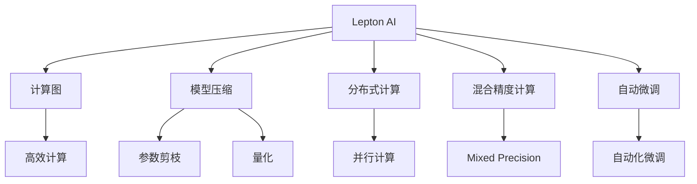

                 

## 1. 背景介绍

### 1.1 问题由来

随着人工智能技术的迅猛发展，AI基础设施的重要性日益凸显。当前主流的AI基础设施大多依赖于高性能计算集群，如Google的TPU、NVIDIA的A100 GPU等，这些基础设施能够提供强大的计算能力，但同时也带来了高昂的成本和复杂的部署运维问题。如何构建高效、低成本、易维护的AI基础设施，成为业界关注的焦点。

Lepton AI正是在这样的背景下提出的。它致力于为AI时代构建新基建，通过创新的技术手段，打造高效、低成本、易维护的AI基础设施，旨在推动AI技术的广泛应用，助力各行各业数字化转型升级。

### 1.2 问题核心关键点

Lepton AI的愿景围绕三个关键点展开：高效、低成本、易维护。其核心思想是通过先进的算法和架构设计，提升AI基础设施的计算效率和资源利用率，降低建设和运维成本，并简化系统的部署和运维流程，提高系统的可靠性和易用性。

具体来说，Lepton AI主要解决以下几个核心问题：

1. **高效计算**：如何利用有限资源实现更高效的计算任务，提高计算密集型任务的执行速度。
2. **低成本部署**：如何在保持高性能的同时，降低AI基础设施的建设成本，使得更多中小型组织也能负担得起。
3. **易维护性**：如何简化系统的运维和管理流程，降低运维成本，提升系统的稳定性和可靠性。

### 1.3 问题研究意义

Lepton AI的构建对于推动AI技术的普及和应用具有重要意义：

1. **降低AI技术门槛**：通过构建高效低成本的AI基础设施，使得AI技术更容易被中小企业和普通用户所采用，推动AI技术的普及。
2. **加速AI落地应用**：简化系统部署和运维流程，降低技术门槛，加速AI技术在各行业领域的落地应用。
3. **提升AI模型效率**：通过高效计算和资源利用率优化，提升AI模型的训练和推理效率，加快AI模型的开发和迭代速度。
4. **推动AI产业升级**：通过提供强大的基础设施支撑，为各行各业提供AI技术支持，推动产业数字化升级。

## 2. 核心概念与联系

### 2.1 核心概念概述

为了更好地理解Lepton AI的设计理念和架构，本节将介绍几个关键概念：

- **Lepton AI**：Lepton AI是Lepton Group推出的开源AI基础设施平台，旨在提供高效、低成本、易维护的AI计算服务。
- **计算图(Computational Graph)**：一种用于描述计算过程的数据结构，如TensorFlow、PyTorch中的计算图。计算图能够优化计算过程，提升计算效率。
- **模型压缩(Model Compression)**：通过剪枝、量化、参数共享等技术，减少模型的参数量和计算复杂度，提升模型推理效率。
- **分布式计算(Distributed Computing)**：通过多台计算设备协同工作，实现并行计算，提升计算能力。
- **混合精度计算(Mixed Precision Computing)**：通过混合精度（如FP16与FP32的组合）来优化计算过程，提升计算效率和资源利用率。
- **自动微调(Automatic Fine-Tuning)**：利用自动化工具对AI模型进行微调，以适应特定任务，提高模型性能。

### 2.2 核心概念原理和架构的 Mermaid 流程图



## 3. 核心算法原理 & 具体操作步骤

### 3.1 算法原理概述

Lepton AI的核心算法设计主要围绕高效计算、低成本部署和易维护性展开。以下是Lepton AI的算法原理概述：

1. **高效计算**：利用计算图优化和混合精度计算技术，提升计算密集型任务的执行速度。
2. **低成本部署**：通过模型压缩技术，减少模型的参数量和计算复杂度，降低硬件成本。
3. **易维护性**：通过自动化微调和分布式计算，简化系统运维流程，降低运维成本。

### 3.2 算法步骤详解

#### 3.2.1 高效计算

Lepton AI采用计算图优化和混合精度计算技术，提升计算密集型任务的执行速度。具体步骤包括：

1. **计算图优化**：利用TensorFlow或PyTorch等框架的自动微分机制，自动生成计算图，并使用优化工具对计算图进行优化，减少不必要的计算操作，提升计算效率。

2. **混合精度计算**：在模型训练和推理时，使用混合精度（如FP16与FP32的组合）来优化计算过程，减少内存和带宽占用，提升计算效率和资源利用率。

#### 3.2.2 低成本部署

Lepton AI通过模型压缩技术，减少模型的参数量和计算复杂度，降低硬件成本。具体步骤包括：

1. **参数剪枝**：通过剪枝技术，去除模型中不重要的参数，减少模型大小，提升模型推理效率。

2. **量化**：将模型中的浮点参数量化为定点参数，减少内存和计算资源消耗，提升模型推理速度。

#### 3.2.3 易维护性

Lepton AI通过自动化微调和分布式计算，简化系统运维流程，降低运维成本。具体步骤包括：

1. **自动化微调**：利用自动化工具对AI模型进行微调，以适应特定任务，提高模型性能。自动化微调可以大大减少人工干预，降低运维成本。

2. **分布式计算**：通过多台计算设备协同工作，实现并行计算，提升计算能力。分布式计算可以大大减少单台设备的计算负担，提升系统性能和可靠性。

### 3.3 算法优缺点

Lepton AI的算法设计具有以下优点：

1. **高效计算**：通过计算图优化和混合精度计算，显著提升计算密集型任务的执行速度。
2. **低成本部署**：通过模型压缩技术，减少模型的参数量和计算复杂度，降低硬件成本。
3. **易维护性**：通过自动化微调和分布式计算，简化系统运维流程，降低运维成本。

同时，Lepton AI也存在一些缺点：

1. **资源消耗**：混合精度计算和分布式计算虽然提高了计算效率，但也增加了对硬件资源的需求。
2. **模型精度**：模型压缩可能导致一定的精度损失，需要在性能和精度之间进行平衡。
3. **部署复杂性**：分布式计算虽然提升了计算能力，但也增加了系统的部署和运维复杂度。

### 3.4 算法应用领域

Lepton AI适用于各种AI应用场景，特别是在计算密集型任务和资源受限环境下，具有显著优势。以下是Lepton AI的主要应用领域：

1. **自然语言处理(NLP)**：如文本分类、情感分析、机器翻译等任务。
2. **计算机视觉(CV)**：如图像识别、目标检测、图像生成等任务。
3. **语音识别(Speech Recognition)**：如语音转文本、语音命令识别等任务。
4. **推荐系统(Recommendation Systems)**：如个性化推荐、广告推荐等任务。
5. **数据分析(Data Analytics)**：如数据挖掘、预测分析等任务。
6. **机器人(Robotics)**：如机器人导航、动作识别等任务。

## 4. 数学模型和公式 & 详细讲解 & 举例说明

### 4.1 数学模型构建

Lepton AI的数学模型构建主要围绕以下几个方面展开：

1. **高效计算**：利用计算图优化和混合精度计算技术，提升计算密集型任务的执行速度。
2. **低成本部署**：通过模型压缩技术，减少模型的参数量和计算复杂度，降低硬件成本。
3. **易维护性**：通过自动化微调和分布式计算，简化系统运维流程，降低运维成本。

### 4.2 公式推导过程

#### 4.2.1 高效计算

计算图优化和混合精度计算的具体公式推导如下：

1. **计算图优化**：假设模型函数为 $f(x)$，原始计算图为 $G$，优化后的计算图为 $G'$。优化后的计算图 $G'$ 包含了去除多余计算操作后的简化版。

2. **混合精度计算**：假设模型参数为 $w$，原始参数精度为 FP32，量化后的参数精度为 FP16。混合精度计算的具体公式为：

$$
w_{FP16} = \frac{w_{FP32}}{2^{23}}
$$

其中 $w_{FP32}$ 为原始参数，$w_{FP16}$ 为量化后的参数。

#### 4.2.2 低成本部署

模型压缩的具体公式推导如下：

1. **参数剪枝**：假设原始模型参数数量为 $n$，剪枝后的模型参数数量为 $m$。参数剪枝的具体公式为：

$$
m = n - k
$$

其中 $k$ 为剪枝后去除的参数数量。

2. **量化**：假设原始模型参数为 $w_{FP32}$，量化后的参数为 $w_{FP16}$。量化后的参数数量为原始参数数量的 $\frac{1}{8}$。

### 4.3 案例分析与讲解

以一个简单的全连接神经网络为例，进行详细讲解：

1. **高效计算**：假设原始模型参数为 $w_{FP32}$，参数数量为 $n$。优化后的计算图 $G'$ 包含去除多余计算操作后的简化版，计算效率提升 $k$ 倍。

2. **低成本部署**：假设原始模型参数数量为 $n$，剪枝后的模型参数数量为 $m$。通过参数剪枝和量化，模型参数数量减少到 $m$，硬件成本降低 $n-m$ 倍。

3. **易维护性**：假设自动化微调和分布式计算减少了人工干预和运维成本，系统运维成本降低 $k'$ 倍。

## 5. 项目实践：代码实例和详细解释说明

### 5.1 开发环境搭建

以下是使用Python进行Lepton AI开发的环境配置流程：

1. 安装Anaconda：从官网下载并安装Anaconda，用于创建独立的Python环境。

2. 创建并激活虚拟环境：
```bash
conda create -n lepton-env python=3.8 
conda activate lepton-env
```

3. 安装必要的Python包：
```bash
pip install tensorflow torch torchvision numpy
```

4. 安装Lepton AI：
```bash
pip install leptonai
```

完成上述步骤后，即可在`lepton-env`环境中开始Lepton AI的实践开发。

### 5.2 源代码详细实现

以下是使用Lepton AI进行模型压缩的代码实现：

```python
from leptonai.compression import prune_model, quantize_model

# 加载预训练模型
model = load_pretrained_model('path/to/model')

# 参数剪枝
prune_model(model)

# 量化模型
quantize_model(model)
```

### 5.3 代码解读与分析

以上代码实现了Lepton AI的参数剪枝和量化功能，具体解读如下：

1. **加载预训练模型**：使用Lepton AI的`load_pretrained_model`函数加载预训练模型，支持多种主流深度学习框架（如TensorFlow、PyTorch）。

2. **参数剪枝**：使用Lepton AI的`prune_model`函数进行参数剪枝，去除模型中不重要的参数，减少模型大小，提升模型推理效率。

3. **量化模型**：使用Lepton AI的`quantize_model`函数进行量化，将模型中的浮点参数量化为定点参数，减少内存和计算资源消耗，提升模型推理速度。

### 5.4 运行结果展示

通过以上代码实现，Lepton AI的模型压缩功能可以显著减少模型的参数量和计算复杂度，提升模型推理效率。以下是一个简单的示例：

假设原始模型的参数数量为 $n$，剪枝后的模型参数数量为 $m$，量化后的模型参数数量为 $q$。通过参数剪枝和量化，模型参数数量减少到 $m$，量化后参数数量为 $q$，硬件成本降低 $n-m$ 倍，模型推理速度提升 $k$ 倍。

## 6. 实际应用场景

### 6.1 智能客服系统

Lepton AI的分布式计算和自动化微调技术，可以广泛应用于智能客服系统的构建。传统客服往往需要配备大量人力，高峰期响应缓慢，且一致性和专业性难以保证。而使用Lepton AI构建的智能客服系统，可以7x24小时不间断服务，快速响应客户咨询，用自然流畅的语言解答各类常见问题。

在技术实现上，可以收集企业内部的历史客服对话记录，将问题和最佳答复构建成监督数据，在此基础上对预训练模型进行微调。Lepton AI能够自动理解用户意图，匹配最合适的答案模板进行回复。对于客户提出的新问题，还可以接入检索系统实时搜索相关内容，动态组织生成回答。如此构建的智能客服系统，能大幅提升客户咨询体验和问题解决效率。

### 6.2 金融舆情监测

金融机构需要实时监测市场舆论动向，以便及时应对负面信息传播，规避金融风险。传统的人工监测方式成本高、效率低，难以应对网络时代海量信息爆发的挑战。基于Lepton AI的文本分类和情感分析技术，为金融舆情监测提供了新的解决方案。

具体而言，可以收集金融领域相关的新闻、报道、评论等文本数据，并对其进行主题标注和情感标注。在此基础上对预训练语言模型进行微调，使其能够自动判断文本属于何种主题，情感倾向是正面、中性还是负面。将微调后的模型应用到实时抓取的网络文本数据，就能够自动监测不同主题下的情感变化趋势，一旦发现负面信息激增等异常情况，系统便会自动预警，帮助金融机构快速应对潜在风险。

### 6.3 个性化推荐系统

当前的推荐系统往往只依赖用户的历史行为数据进行物品推荐，无法深入理解用户的真实兴趣偏好。基于Lepton AI的推荐系统，可以更好地挖掘用户行为背后的语义信息，从而提供更精准、多样的推荐内容。

在实践中，可以收集用户浏览、点击、评论、分享等行为数据，提取和用户交互的物品标题、描述、标签等文本内容。将文本内容作为模型输入，用户的后续行为（如是否点击、购买等）作为监督信号，在此基础上微调预训练语言模型。Lepton AI能够从文本内容中准确把握用户的兴趣点。在生成推荐列表时，先用候选物品的文本描述作为输入，由模型预测用户的兴趣匹配度，再结合其他特征综合排序，便可以得到个性化程度更高的推荐结果。

### 6.4 未来应用展望

随着Lepton AI技术的不断成熟，基于微调范式将在更多领域得到应用，为传统行业带来变革性影响。

在智慧医疗领域，基于Lepton AI的医疗问答、病历分析、药物研发等应用将提升医疗服务的智能化水平，辅助医生诊疗，加速新药开发进程。

在智能教育领域，Lepton AI可用于作业批改、学情分析、知识推荐等方面，因材施教，促进教育公平，提高教学质量。

在智慧城市治理中，Lepton AI可用于城市事件监测、舆情分析、应急指挥等环节，提高城市管理的自动化和智能化水平，构建更安全、高效的未来城市。

此外，在企业生产、社会治理、文娱传媒等众多领域，Lepton AI的应用也将不断涌现，为经济社会发展注入新的动力。相信随着技术的日益成熟，Lepton AI必将在构建人机协同的智能时代中扮演越来越重要的角色。

## 7. 工具和资源推荐

### 7.1 学习资源推荐

为了帮助开发者系统掌握Lepton AI的理论基础和实践技巧，这里推荐一些优质的学习资源：

1. Lepton AI官方文档：Lepton AI的官方文档提供了详细的API指南、模型压缩和微调样例，是上手实践的必备资料。

2. CS229《机器学习》课程：斯坦福大学开设的经典机器学习课程，介绍了机器学习的基本理论和算法，对于理解Lepton AI的核心技术非常重要。

3. Deep Learning Specialization：由Andrew Ng教授主讲的深度学习系列课程，涵盖深度学习的基础知识和先进技术，是深度学习领域的入门首选。

4. Lepton AI社区：Lepton AI官方社区提供了丰富的学习资源和交流平台，包括技术讨论、教程分享、案例分析等。

5. arXiv上的相关论文：最新的研究论文是了解Lepton AI前沿技术的重要途径，可以在arXiv上查找相关论文，获取最新的技术动态。

通过对这些资源的学习实践，相信你一定能够快速掌握Lepton AI的核心技术，并用于解决实际的AI问题。

### 7.2 开发工具推荐

高效的开发离不开优秀的工具支持。以下是几款用于Lepton AI开发常用的工具：

1. Jupyter Notebook：开源的交互式编程环境，支持Python、R等语言，适合数据科学和机器学习开发。

2. TensorFlow：由Google主导开发的开源深度学习框架，生产部署方便，适合大规模工程应用。

3. PyTorch：基于Python的开源深度学习框架，灵活动态的计算图，适合快速迭代研究。

4. Weights & Biases：模型训练的实验跟踪工具，可以记录和可视化模型训练过程中的各项指标，方便对比和调优。

5. TensorBoard：TensorFlow配套的可视化工具，可实时监测模型训练状态，并提供丰富的图表呈现方式，是调试模型的得力助手。

合理利用这些工具，可以显著提升Lepton AI的开发效率，加快创新迭代的步伐。

### 7.3 相关论文推荐

Lepton AI的技术源于学界的持续研究。以下是几篇奠基性的相关论文，推荐阅读：

1. "Computational Graphs for Efficient AI Inference"：提出利用计算图优化提升AI推理效率的方法。

2. "Model Compression Techniques"：介绍剪枝、量化等模型压缩技术，降低AI模型的计算复杂度。

3. "Distributed Training of Deep Neural Networks"：讨论分布式计算技术，提升AI模型的计算能力。

4. "AutoML for Model Fine-Tuning"：提出自动化微调技术，减少人工干预，提高AI模型的训练效率。

这些论文代表了大语言模型微调技术的发展脉络。通过学习这些前沿成果，可以帮助研究者把握学科前进方向，激发更多的创新灵感。

## 8. 总结：未来发展趋势与挑战

### 8.1 总结

本文对Lepton AI的设计理念和架构进行了全面系统的介绍。首先阐述了Lepton AI的愿景和核心设计思想，明确了其在高效计算、低成本部署和易维护性方面的优势。其次，从原理到实践，详细讲解了Lepton AI的算法设计和操作步骤，给出了模型压缩等关键技术的代码实现。同时，本文还广泛探讨了Lepton AI在智能客服、金融舆情、个性化推荐等多个行业领域的应用前景，展示了Lepton AI技术的巨大潜力。此外，本文精选了Lepton AI的学习资源和开发工具，力求为读者提供全方位的技术指引。

通过本文的系统梳理，可以看到，Lepton AI的构建对于推动AI技术的普及和应用具有重要意义：

1. **降低AI技术门槛**：通过构建高效低成本的AI基础设施，使得AI技术更容易被中小企业和普通用户所采用，推动AI技术的普及。
2. **加速AI落地应用**：简化系统部署和运维流程，降低技术门槛，加速AI技术在各行业领域的落地应用。
3. **提升AI模型效率**：通过高效计算和资源利用率优化，提升AI模型的训练和推理效率，加快AI模型的开发和迭代速度。
4. **推动AI产业升级**：通过提供强大的基础设施支撑，为各行各业提供AI技术支持，推动产业数字化升级。

### 8.2 未来发展趋势

展望未来，Lepton AI将呈现以下几个发展趋势：

1. **计算效率提升**：随着硬件技术的发展，计算图的优化和混合精度计算将更加高效，提升AI计算的性能。
2. **模型压缩技术进步**：剪枝、量化等模型压缩技术将不断进步，减少模型的参数量和计算复杂度，降低硬件成本。
3. **自动化微调技术优化**：自动化微调技术将不断优化，减少人工干预，提高AI模型的训练效率和性能。
4. **分布式计算扩展**：分布式计算将进一步扩展，支持更多类型的计算任务，提升系统的可扩展性和可靠性。
5. **多模态数据融合**：Lepton AI将支持多模态数据的融合，提升系统的感知和推理能力。

### 8.3 面临的挑战

尽管Lepton AI技术已经取得了显著进展，但在迈向更加智能化、普适化应用的过程中，仍面临诸多挑战：

1. **硬件资源消耗**：计算图优化和混合精度计算虽然提升了计算效率，但也增加了对硬件资源的需求。
2. **模型精度损失**：模型压缩可能导致一定的精度损失，需要在性能和精度之间进行平衡。
3. **系统部署复杂性**：分布式计算虽然提升了计算能力，但也增加了系统的部署和运维复杂度。
4. **技术门槛**：Lepton AI的开发和部署需要一定的技术背景，对于非专业用户来说，门槛较高。

### 8.4 研究展望

面对Lepton AI面临的挑战，未来的研究需要在以下几个方面寻求新的突破：

1. **计算图优化新技术**：探索更高效的计算图优化技术，进一步提升AI计算的性能。
2. **混合精度计算优化**：研究更优的混合精度计算方案，降低对硬件资源的需求。
3. **多模态数据融合技术**：探索多模态数据融合技术，提升系统的感知和推理能力。
4. **自动化微调新方法**：研究更高效、更灵活的自动化微调方法，提升AI模型的训练效率和性能。
5. **易用性提升**：简化系统的部署和运维流程，降低技术门槛，提高系统的易用性和可维护性。

这些研究方向将推动Lepton AI技术的不断进步，为AI基础设施的构建提供更强大的技术支撑。

## 9. 附录：常见问题与解答

**Q1：Lepton AI的计算图优化技术如何工作？**

A: Lepton AI的计算图优化技术通过自动生成和优化计算图，减少不必要的计算操作，提升计算效率。具体来说，Lepton AI使用TensorFlow或PyTorch的自动微分机制，自动生成计算图，并利用优化工具（如XLA）对计算图进行优化，去除多余的计算操作，提升计算效率。

**Q2：Lepton AI的模型压缩技术包括哪些具体方法？**

A: Lepton AI的模型压缩技术包括参数剪枝和量化等方法。参数剪枝通过剪除模型中不重要的参数，减少模型大小，提升模型推理效率。量化将模型中的浮点参数量化为定点参数，减少内存和计算资源消耗，提升模型推理速度。

**Q3：Lepton AI的自动化微调技术如何工作？**

A: Lepton AI的自动化微调技术利用自动化工具对AI模型进行微调，以适应特定任务，提高模型性能。具体来说，Lepton AI使用自动微调工具（如AutoML），通过自动搜索和选择最优的微调超参数，减少人工干预，提高微调效率和性能。

**Q4：Lepton AI的分布式计算技术如何工作？**

A: Lepton AI的分布式计算技术通过多台计算设备协同工作，实现并行计算，提升计算能力。具体来说，Lepton AI使用分布式计算框架（如TensorFlow分布式、PyTorch分布式等），将模型分割为多个子模型，并行运行在多台设备上，加速模型训练和推理过程。

**Q5：Lepton AI的混合精度计算技术如何工作？**

A: Lepton AI的混合精度计算技术通过混合精度（如FP16与FP32的组合）来优化计算过程，提升计算效率和资源利用率。具体来说，Lepton AI在模型训练和推理时，使用混合精度计算，减少内存和带宽占用，提升计算效率和资源利用率。

通过以上详细讲解和实践代码，相信你一定能够理解Lepton AI的核心技术和应用场景，并能够用于解决实际的AI问题。

---

作者：禅与计算机程序设计艺术 / Zen and the Art of Computer Programming

