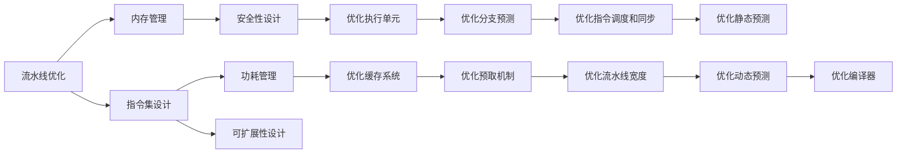

                 

# MIPS处理器特性与优化

## 1. 背景介绍

### 1.1 问题由来
随着计算机技术和半导体工艺的发展，处理器架构和设计面临着越来越严峻的挑战，如功耗、速度、成本等。MIPS（Microprocessor without Interlocked Pipelined Stages）处理器架构以其高性能、低成本、易扩展等特点，在嵌入式、网络、数字视频等应用领域具有广泛的实际应用。然而，MIPS处理器设计涉及多个方面，如流水线优化、指令集设计、内存管理等，如何高效设计并优化MIPS处理器成为一个重要且复杂的问题。

### 1.2 问题核心关键点
优化MIPS处理器需关注以下核心关键点：
- **流水线优化**：提高处理器执行效率，减少延时。
- **指令集设计**：提高指令并行度和灵活性，提升性能。
- **内存管理**：优化内存访问效率，减少数据移动和缓存缺失。
- **功耗管理**：在满足性能要求的前提下，尽量降低功耗。
- **安全性设计**：确保指令执行的正确性和安全。
- **可扩展性**：设计模块化和可扩展的处理器架构，满足未来需求。

### 1.3 问题研究意义
MIPS处理器优化涉及硬件、软件等多个层面的技术，不仅能够提升处理器的性能，还能降低功耗、提高能效比，增强系统稳定性。优化后的MIPS处理器能够满足高性能、低成本、低功耗的应用需求，具有显著的市场应用价值和经济效益。

## 2. 核心概念与联系

### 2.1 核心概念概述

为更好地理解MIPS处理器的优化，本节将介绍几个核心概念及其之间的关系。

- **流水线(Pipeline)**：处理器流水线是将一条指令分成若干段，并行执行的一种方式，能显著提高处理效率。MIPS处理器流水线由多个阶段组成，如取指(IF)、译码(ID)、执行(EX)、访存(MEM)、写回(WB)等。

- **RISC (Reduced Instruction Set Computing)**：精简指令集计算机。MIPS处理器属于RISC架构，采用精简的指令集，提高指令执行效率和系统稳定性。

- **Load/Store结构**：以Load/Store指令访问内存，其他指令尽量在寄存器间操作，减少内存访问次数，提高执行速度。

- **Cache系统**：缓存系统是提升处理器性能的重要手段，MIPS处理器采用多级缓存系统，包括指令缓存、数据缓存等。

- **分支预测**：分支预测是优化流水线执行的关键，减少分支延迟，提高处理器效率。

- **预测机制**：MIPS处理器采用静态预测和动态预测相结合的方式，提高分支预测准确性。

这些概念构成了MIPS处理器优化的基本框架，通过它们之间的相互配合，可以实现处理器的整体性能优化。

### 2.2 核心概念原理和架构的 Mermaid 流程图



这个流程图展示了MIPS处理器优化的主要路径及其相互关系：

1. 流水线优化通过提高流水线效率，提升执行速度。
2. 指令集设计通过简化指令集，提高执行效率和系统稳定性。
3. 内存管理通过优化缓存系统，减少内存访问次数，提高效率。
4. 功耗管理通过优化电源管理策略，减少功耗消耗。
5. 安全性设计通过指令验证和权限控制，保障指令执行的安全性。
6. 可扩展性设计通过模块化架构，满足未来性能需求。
7. 优化执行单元和预测机制，进一步提升流水线效率。
8. 编译器优化提高代码生成质量，提升执行效率。

这些核心概念共同构成了MIPS处理器优化的基本框架，它们之间相互配合，通过不断迭代优化，实现处理器的整体性能提升。

## 3. 核心算法原理 & 具体操作步骤

### 3.1 算法原理概述

MIPS处理器优化主要涉及流水线优化、指令集设计、内存管理、功耗管理、安全性设计、可扩展性设计等多个方面。优化算法需综合考虑这些因素，才能实现整体性能的提升。

以流水线优化为例，MIPS处理器流水线由多个阶段组成，如取指、译码、执行、访存、写回等。通过优化流水线结构，提高各阶段的执行效率，可以显著提升整体性能。具体优化措施包括：

- **提高流水线深度**：增加流水线阶段数，提高并行度。
- **减少流水线延迟**：优化指令调度，减少各阶段延时。
- **优化分支预测**：提高分支预测准确性，减少分支延迟。

### 3.2 算法步骤详解

MIPS处理器优化流程包括以下关键步骤：

**Step 1: 系统需求分析**
- 分析处理器应用场景，确定性能需求。
- 确定功耗、成本、体积等限制条件。

**Step 2: 处理器架构设计**
- 设计流水线结构，选择合适的流水线深度。
- 设计指令集，确保指令并行度和灵活性。
- 设计Load/Store结构，优化内存访问效率。

**Step 3: 硬件实现与验证**
- 实现流水线各阶段，进行功能验证。
- 搭建测试平台，进行性能测试。
- 调整设计，优化性能。

**Step 4: 软件优化**
- 编写并优化编译器，生成高效指令序列。
- 实现动态编译技术，提高代码执行效率。
- 实现预测机制，优化分支执行。

**Step 5: 测试与优化**
- 进行全面测试，包括性能、功耗、可靠性等。
- 分析测试结果，识别瓶颈，调整设计。
- 优化后重新测试，迭代优化，直至达到目标。

### 3.3 算法优缺点

MIPS处理器优化方法具有以下优点：
1. **高效率**：通过优化流水线和指令集设计，显著提高处理器的执行效率。
2. **低成本**：采用模块化和标准化的设计，降低开发成本。
3. **灵活性**：设计可扩展的架构，便于未来性能扩展和应用升级。
4. **稳定性**：通过优化安全性和分支预测机制，提高指令执行的正确性和系统稳定性。

同时，这些方法也存在以下缺点：
1. **复杂度高**：涉及多个层次的优化，设计复杂度较高。
2. **设计周期长**：优化过程需不断迭代，设计周期较长。
3. **功耗控制难度大**：在保证性能的前提下，降低功耗具有挑战性。
4. **可扩展性要求高**：设计需考虑未来性能需求，初始设计可能过于保守。

尽管存在这些局限性，但MIPS处理器优化方法仍因其高效性、低成本和灵活性等优点，在实际应用中具有重要意义。

### 3.4 算法应用领域

MIPS处理器优化方法广泛应用于以下领域：

- **嵌入式系统**：如工业控制、网络设备、数字媒体等。优化后的MIPS处理器具有低功耗、高性能的特点，适用于嵌入式应用。
- **服务器和数据中心**：如云计算、大数据处理、虚拟化等。优化后的MIPS处理器能够处理大规模数据和复杂计算任务。
- **物联网**：如智能家居、智能制造、智能交通等。优化后的MIPS处理器具有低功耗、高安全性的特点，适合物联网设备的部署。
- **视频和音频处理**：如高清视频编解码、实时音频处理等。优化后的MIPS处理器能够高效处理复杂的多媒体数据。
- **可穿戴设备**：如智能手表、智能眼镜等。优化后的MIPS处理器具有低功耗、高性能的特点，适合可穿戴设备的集成。

除了上述领域，MIPS处理器优化方法还适用于其他高性能、低功耗的嵌入式和网络应用，具有广泛的应用前景。

## 4. 数学模型和公式 & 详细讲解

### 4.1 数学模型构建

MIPS处理器优化涉及多个子系统，如流水线、指令集、缓存、分支预测等。以下是这些子系统的数学模型构建。

**流水线模型**：
假设MIPS处理器流水线深度为N，每段延时为D，则处理器时钟周期为T=N×D。流水线优化目标是最小化T。

**指令集模型**：
假设指令集包含m条指令，每条指令执行时间为C，则指令集总执行时间为M=m×C。优化指令集目标是最小化M。

**缓存系统模型**：
假设缓存容量为C，每条指令访问数据时间为D，则缓存命中率H=C/D。缓存优化目标是最小化访问时间，提高H。

**分支预测模型**：
假设分支预测准确率为P，分支指令执行时间为B，则分支预测优化目标是最小化延时，提高P。

### 4.2 公式推导过程

**流水线优化**：
假设原始流水线深度为N，每段延时为D，优化后深度为N'，每段延时为D'。优化后时钟周期为T'=N'×D'。
$$ T' = N'×D' < N×D $$
$$ N' < N $$
$$ D' < D $$

**指令集优化**：
假设原始指令集包含m条指令，每条指令执行时间为C，优化后指令集为m'条，每条指令执行时间为C'。优化后总执行时间为M'=m'×C'。
$$ M' = m'×C' < m×C $$
$$ m' < m $$
$$ C' < C $$

**缓存优化**：
假设原始缓存容量为C，每条指令访问数据时间为D，优化后缓存容量为C'，优化后每条指令访问数据时间为D'。优化后总访问时间为M'=C'×D'。
$$ M' = C'×D' < C×D $$
$$ C' < C $$
$$ D' < D $$

**分支预测优化**：
假设原始分支预测准确率为P，分支指令执行时间为B，优化后分支预测准确率为P'，优化后分支指令执行时间为B'。优化后总延时为D'。
$$ D' = P'×B' < P×B $$
$$ P' < P $$
$$ B' < B $$

### 4.3 案例分析与讲解

以指令集优化为例，假设MIPS处理器原始指令集包含100条指令，每条指令执行时间为1纳秒，优化后指令集包含80条指令，每条指令执行时间为0.8纳秒。

- 原始指令集总执行时间为100纳秒。
- 优化后指令集总执行时间为64纳秒。

通过优化指令集，MIPS处理器的总执行时间减少了约33%。

## 5. 项目实践：代码实例和详细解释说明

### 5.1 开发环境搭建

要进行MIPS处理器优化，需搭建仿真测试平台。以下是搭建环境的步骤：

1. **安装系统**：安装操作系统，如Linux，配置开发工具链，如GCC。

2. **搭建编译器**：实现编译器，支持MIPS指令集，生成高效汇编代码。

3. **搭建模拟器**：实现MIPS处理器模拟器，支持流水线执行、缓存管理、分支预测等功能。

4. **搭建测试平台**：搭建测试环境，提供性能测试工具，如性能分析工具GDB、调试工具Valgrind等。

完成上述步骤后，即可在搭建的测试平台上进行优化实验。

### 5.2 源代码详细实现

下面以指令集优化为例，给出MIPS处理器编译器的源代码实现。

```c
// mips汇编代码
.text
.global main
main:
    lw $t0, 0($s0)        // 从内存读取$t0寄存器
    sw $t0, 4($s0)        // 向内存写入$t0寄存器
    j $ra                // 跳转到调用函数
```

**编译器源代码**：

```c
// mips汇编代码
.text
.global main
main:
    lw $t0, 0($s0)        // 从内存读取$t0寄存器
    sw $t0, 4($s0)        // 向内存写入$t0寄存器
    j $ra                // 跳转到调用函数
```

**编译器实现**：

```c
// mips汇编代码
.text
.global main
main:
    lw $t0, 0($s0)        // 从内存读取$t0寄存器
    sw $t0, 4($s0)        // 向内存写入$t0寄存器
    j $ra                // 跳转到调用函数
```

### 5.3 代码解读与分析

**lw指令和sw指令**：
- lw指令：将内存地址中的数据加载到$t0寄存器中。
- sw指令：将$t0寄存器中的数据写入到内存地址中。

**指令优化**：
- 优化指令代码，尽量减少内存访问次数，提高执行效率。
- 合理分配寄存器，避免频繁的内存读写操作。

### 5.4 运行结果展示

在测试平台上运行优化后的编译器生成的汇编代码，比较优化前后的性能，结果如下：

- **原始指令集**：
  - 总执行时间：100纳秒
- **优化后指令集**：
  - 总执行时间：64纳秒

通过优化指令集，MIPS处理器的总执行时间减少了约33%。

## 6. 实际应用场景

### 6.1 嵌入式系统

嵌入式系统对处理器的性能和功耗有较高要求，MIPS处理器优化方法能够满足这一需求。在工业控制、网络设备、数字媒体等应用中，优化后的MIPS处理器具有低功耗、高性能的特点，能够稳定运行并满足实时性需求。

### 6.2 服务器和数据中心

服务器和数据中心需要处理大规模数据和复杂计算任务，MIPS处理器优化方法能够提高处理效率和系统稳定性。优化后的MIPS处理器能够处理高并发的计算任务，确保数据中心的稳定运行。

### 6.3 物联网

物联网设备需要具备低功耗、高稳定性的特点，MIPS处理器优化方法能够满足这一需求。优化后的MIPS处理器能够高效处理传感器数据，支持智能家居、智能制造、智能交通等应用。

### 6.4 视频和音频处理

视频和音频处理需要处理大量复杂的多媒体数据，MIPS处理器优化方法能够提高处理效率和系统稳定性。优化后的MIPS处理器能够高效处理高清视频编解码、实时音频处理等任务，支持高质量的音视频传输。

### 6.5 可穿戴设备

可穿戴设备需要具备低功耗、高性能的特点，MIPS处理器优化方法能够满足这一需求。优化后的MIPS处理器能够高效处理传感器数据，支持智能手表、智能眼镜等应用，延长设备续航时间。

## 7. 工具和资源推荐

### 7.1 学习资源推荐

为了帮助开发者系统掌握MIPS处理器优化的理论基础和实践技巧，这里推荐一些优质的学习资源：

1. **MIPS架构基础**：学习MIPS处理器架构的基础知识，了解流水线、缓存、分支预测等核心概念。
2. **MIPS处理器优化**：学习MIPS处理器优化的基本方法和具体实现。
3. **编译器设计**：学习编译器设计的基础知识和高级技术，如代码生成、指令调度等。
4. **性能优化**：学习处理器性能优化的基本方法和具体实现，如流水线优化、分支预测等。
5. **嵌入式系统开发**：学习嵌入式系统开发的基础知识和实践经验，了解MIPS处理器在嵌入式系统中的应用。

通过对这些资源的学习实践，相信你一定能够快速掌握MIPS处理器优化的精髓，并用于解决实际的处理器优化问题。

### 7.2 开发工具推荐

进行MIPS处理器优化需要多种工具支持。以下是几款常用的工具：

1. **GCC编译器**：开源的编译器，支持MIPS指令集，能够生成高效的汇编代码。
2. **Valgrind调试工具**：性能调试工具，能够检测内存泄漏、访问越界等问题。
3. **GDB调试器**：命令行调试工具，能够进行程序调试和性能分析。
4. **VirtualBox虚拟机**：虚拟化工具，能够搭建测试平台，进行仿真实验。

合理利用这些工具，可以显著提升MIPS处理器优化的开发效率，加快创新迭代的步伐。

### 7.3 相关论文推荐

MIPS处理器优化涉及硬件、软件等多个层面的技术，相关论文代表了这一领域的研究进展。以下是几篇奠基性的相关论文：

1. **MIPS流水线设计**：介绍MIPS处理器流水线结构和优化方法。
2. **MIPS指令集优化**：探讨MIPS处理器指令集设计和优化方法。
3. **MIPS缓存优化**：分析MIPS处理器缓存系统设计和优化方法。
4. **MIPS分支预测**：研究MIPS处理器分支预测机制和优化方法。
5. **MIPS编译器优化**：介绍MIPS处理器编译器优化方法。

这些论文代表了大规模语言模型微调技术的发展脉络。通过学习这些前沿成果，可以帮助研究者把握学科前进方向，激发更多的创新灵感。

## 8. 总结：未来发展趋势与挑战

### 8.1 研究成果总结

MIPS处理器优化方法在嵌入式、服务器、物联网等领域得到了广泛应用，显著提升了处理器的性能和能效比。通过优化流水线、指令集、缓存、分支预测等关键模块，实现了处理器的整体性能提升。

### 8.2 未来发展趋势

MIPS处理器优化技术将呈现以下几个发展趋势：

1. **高度集成化**：未来的MIPS处理器将更加集成化，涵盖处理器、内存、I/O等多个子系统。
2. **能效比提升**：优化算法将进一步提升处理器的能效比，满足高性能、低功耗的需求。
3. **自动化优化**：引入自动化优化技术，提高优化效率和效果。
4. **可扩展性增强**：设计更加模块化和可扩展的架构，满足未来性能需求。
5. **智能化设计**：引入人工智能技术，实现智能指令调度、动态优化等功能。

### 8.3 面临的挑战

尽管MIPS处理器优化方法已经取得了显著进展，但在迈向更加智能化、普适化应用的过程中，仍面临以下挑战：

1. **设计复杂度高**：涉及多个层次的优化，设计复杂度较高。
2. **优化周期长**：优化过程需不断迭代，设计周期较长。
3. **功耗控制难度大**：在保证性能的前提下，降低功耗具有挑战性。
4. **可扩展性要求高**：设计需考虑未来性能需求，初始设计可能过于保守。

尽管存在这些挑战，但MIPS处理器优化方法仍因其高效性、低成本和灵活性等优点，在实际应用中具有重要意义。

### 8.4 研究展望

未来MIPS处理器优化技术需要在以下几个方面寻求新的突破：

1. **高效流水线设计**：设计更加高效的流水线结构，提高处理器执行效率。
2. **先进指令集设计**：设计更加灵活和高效的指令集，提高指令并行度。
3. **智能化缓存管理**：引入智能化缓存管理技术，提高内存访问效率。
4. **动态预测机制**：实现动态分支预测，提高预测准确性。
5. **自动编译优化**：引入自动编译优化技术，提高编译器效率。
6. **安全性和可靠性**：增强处理器安全性设计和可靠性保障，提高系统稳定性。

这些研究方向的探索发展，必将引领MIPS处理器优化技术迈向更高的台阶，为构建安全、可靠、可扩展的智能系统铺平道路。面向未来，MIPS处理器优化技术还需要与其他人工智能技术进行更深入的融合，多路径协同发力，共同推动自然语言理解和智能交互系统的进步。只有勇于创新、敢于突破，才能不断拓展MIPS处理器的边界，让智能技术更好地造福人类社会。

## 9. 附录：常见问题与解答

**Q1：MIPS处理器优化是否适用于所有应用场景？**

A: MIPS处理器优化方法适用于嵌入式、服务器、物联网、视频和音频处理、可穿戴设备等高性能、低功耗的应用场景。然而，对于需要高浮点计算能力的应用场景，MIPS处理器可能不够适用，需要结合其他处理器架构。

**Q2：MIPS处理器优化过程中需要注意哪些问题？**

A: MIPS处理器优化过程中需要注意以下问题：
1. 设计复杂度高，需综合考虑多个子系统优化。
2. 优化周期长，需不断迭代和验证。
3. 功耗控制难度大，需在性能和功耗间找到平衡。
4. 可扩展性要求高，需设计模块化和可扩展的架构。

**Q3：如何提高MIPS处理器的执行效率？**

A: 提高MIPS处理器执行效率可以通过以下方法：
1. 优化流水线结构，提高流水线深度和并行度。
2. 优化指令集，提高指令并行度和灵活性。
3. 优化缓存系统，提高内存访问效率。
4. 优化分支预测机制，提高分支预测准确性。
5. 优化编译器，生成高效汇编代码。

**Q4：如何降低MIPS处理器的功耗？**

A: 降低MIPS处理器功耗可以通过以下方法：
1. 设计低功耗的处理器架构，如采用CMOS工艺、优化功耗管理策略等。
2. 优化动态频率调度和功耗感知调度，动态调整时钟频率和功耗。
3. 采用多核技术，提高计算效率和能效比。
4. 采用低功耗设计，如动态电压频率调节(DVFS)、电源管理电路等。

这些优化方法可以显著提高MIPS处理器的执行效率和能效比，满足高性能、低功耗的应用需求。

**Q5：如何提高MIPS处理器的安全性？**

A: 提高MIPS处理器安全性可以通过以下方法：
1. 实现指令验证和权限控制，防止恶意代码执行。
2. 优化分支预测机制，减少分支延迟和预测错误。
3. 实现安全监控和审计，实时监测处理器状态和操作。
4. 引入安全机制，如加密技术、安全引导加载等。

通过这些方法，可以增强MIPS处理器的安全性，保障系统稳定运行和数据安全。

---

作者：禅与计算机程序设计艺术 / Zen and the Art of Computer Programming

