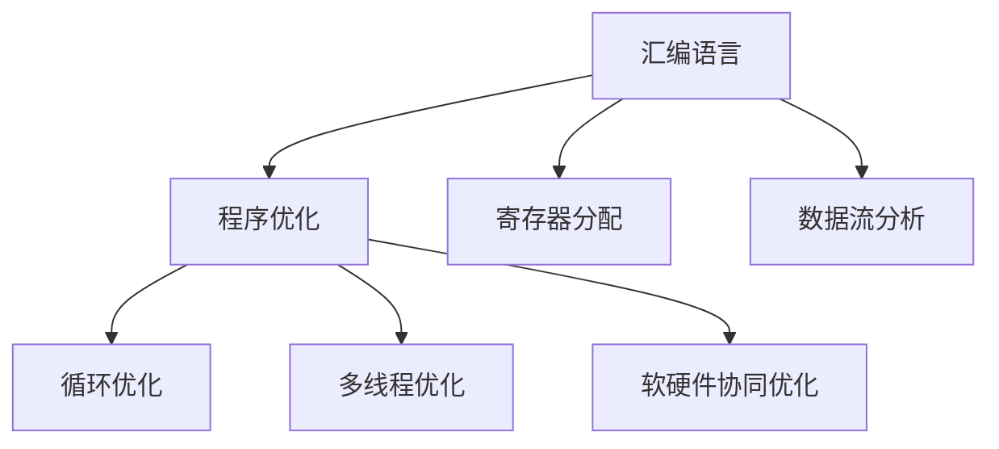

                 

## 1. 背景介绍

### 1.1 问题由来
随着计算机硬件性能的不断提升，软件优化成为了提高系统性能的重要手段。汇编语言作为计算机硬件和软件之间的桥梁，对硬件特性具有高度的可控性，因此在系统优化方面具有天然的优势。MIPS汇编语言，作为一款高效、灵活的RISC架构语言，广泛应用于嵌入式、服务器等高性能领域。对MIPS汇编语言程序的优化，可以大幅提升系统性能，为现代高性能计算带来显著的提升。

### 1.2 问题核心关键点
MIPS汇编语言程序优化的核心在于：
- 如何利用编译器、工具链等技术，对程序进行多层次优化。
- 如何针对特定的硬件架构，进行高效的寄存器分配和数据流分析。
- 如何通过算法和编程技巧，实现程序的性能提升。
- 如何评估优化效果，确保优化的安全性、可靠性。

## 2. 核心概念与联系

### 2.1 核心概念概述

为更好地理解MIPS汇编语言程序的优化方法，本节将介绍几个密切相关的核心概念：

- MIPS汇编语言：一种流行的RISC架构语言，具有简洁、高效的指令集。
- 程序优化：通过编译器、工具链等技术手段，对源代码和目标代码进行优化，以提升程序的执行效率和资源利用率。
- 寄存器分配：优化器利用算法分配寄存器，提升指令执行效率，减少访存次数。
- 数据流分析：优化器对程序的依赖关系进行分析，进行数据传递和操作顺序的优化。
- 循环优化：对循环体进行展开、并行化、条件优化等，以提升循环性能。
- 多线程优化：对程序进行并行化，利用多线程技术提升计算能力。
- 软硬件协同优化：通过硬件特性优化软件性能，同时利用软件特性提升硬件利用率。

这些核心概念之间的逻辑关系可以通过以下Mermaid流程图来展示：



这个流程图展示了大语言模型的核心概念及其之间的关系：

1. MIPS汇编语言作为程序的直接表示形式，是优化的基础。
2. 程序优化是MIPS程序优化的核心任务，涉及多个层次的技术。
3. 寄存器分配和数据流分析是优化器常用的两个关键技术，提升指令执行效率。
4. 循环优化和多线程优化进一步提升程序的计算能力。
5. 软硬件协同优化是现代高性能计算的重要方向，充分利用硬件特性。

这些概念共同构成了MIPS汇编语言程序优化的整体框架，使其能够在特定硬件架构上实现高效的性能提升。通过理解这些核心概念，我们可以更好地把握MIPS汇编语言程序的优化方向。

## 3. 核心算法原理 & 具体操作步骤
### 3.1 算法原理概述

MIPS汇编语言程序的优化，本质上是一个通过编译器、优化器等工具，对程序进行结构性重构和指令级优化的过程。其核心思想是：通过分析程序的数据流和控制流，识别出性能瓶颈，并进行针对性的优化，以提升程序的执行效率。

形式化地，假设目标程序为 $P$，优化器试图通过一系列的优化规则，找到一个新的等价程序 $P'$，使得 $P'$ 在特定硬件平台上的执行效率优于 $P$。

### 3.2 算法步骤详解

MIPS汇编语言程序的优化一般包括以下几个关键步骤：

**Step 1: 初始化优化环境**
- 选择目标平台，如MIPS32或MIPS64。
- 选择优化工具链，如GCC、LLVM等，并针对目标平台进行配置。

**Step 2: 进行寄存器分配**
- 使用寄存器分配算法，如Simon、Workstation等，对程序中的变量进行寄存器分配，提升指令执行效率。
- 优化器根据变量使用频率和类型，分配最优的寄存器。

**Step 3: 数据流分析**
- 分析程序的依赖关系，确定数据的传递路径和操作顺序。
- 优化器利用数据流分析结果，进行指令级重排和延迟操作，提升执行效率。

**Step 4: 进行循环优化**
- 对程序中的循环体进行展开、并行化、条件优化等，以提升循环性能。
- 优化器分析循环体内的依赖关系，进行并行执行和延迟计算，减少循环开销。

**Step 5: 多线程优化**
- 将程序进行多线程并行化，利用多线程技术提升计算能力。
- 优化器根据线程间的依赖关系，进行任务划分和调度，提升并行性能。

**Step 6: 软硬件协同优化**
- 利用硬件特性，如向量运算、加速器等，提升程序的执行效率。
- 优化器分析程序的硬件资源需求，进行向量化和加速器优化，提升整体性能。

**Step 7: 验证和评估**
- 对优化后的程序进行测试验证，确保性能提升。
- 使用性能分析工具，评估优化效果，识别新瓶颈，继续优化。

以上是MIPS汇编语言程序优化的基本流程。在实际应用中，还需要针对具体平台和应用场景，对优化过程的各个环节进行优化设计，如改进寄存器分配算法，引入更多的数据流优化策略，搜索最优的并行调度等，以进一步提升程序性能。

### 3.3 算法优缺点

MIPS汇编语言程序优化的主要优点：
1. 高效的指令级控制：MIPS指令集具有高效、灵活的特点，优化器能够对指令进行精细控制。
2. 寄存器丰富：MIPS架构提供了大量通用寄存器，优化器可以进行高效的寄存器分配和数据传递优化。
3. 数据流分析能力强：优化器可以分析程序的依赖关系，进行数据流重排和延迟操作，提升指令执行效率。
4. 硬件资源丰富：MIPS硬件支持多种扩展指令集，如向量运算、加速器等，优化器可以充分利用这些硬件资源。

同时，该方法也存在一些局限性：
1. 开发和调试成本高：汇编语言程序优化涉及到硬件架构和指令集特性，需要深入理解和调试。
2. 优化效果难以量化：优化后的程序执行速度和资源利用率难以精确衡量，需要综合多方面指标进行评估。
3. 依赖工具链和编译器：优化效果受工具链和编译器版本的影响，需要根据具体情况选择和调整。
4. 重构复杂：对汇编语言程序的优化通常需要进行结构性重构，容易引入新问题。

尽管存在这些局限性，但就目前而言，MIPS汇编语言优化方法仍然是大规模高性能计算和嵌入式系统优化的主流范式。未来相关研究的重点在于如何进一步提高优化器的智能化水平，减少对开发者经验依赖，提升优化效果的量化评估能力，同时兼顾优化过程的可维护性和可扩展性。

### 3.4 算法应用领域

MIPS汇编语言程序的优化技术，已经在诸多高性能计算、嵌入式系统等领域得到了广泛应用，例如：

- 服务器操作系统：优化内核和应用程序，提升服务器性能和资源利用率。
- 嵌入式系统：优化系统引导代码和应用程序，提升嵌入式设备的性能和功耗。
- 网络设备：优化路由器、交换机等网络设备的软件，提升网络性能和稳定性。
- 图像处理：优化图像处理算法和库函数，提升图像处理速度和质量。
- 信号处理：优化信号处理算法和库函数，提升信号处理速度和精度。

除了上述这些经典应用外，MIPS汇编语言程序的优化技术还被创新性地应用到更多场景中，如密码学、区块链、实时系统等，为高性能计算提供了新的解决方案。随着编译器和优化工具的不断进步，相信MIPS汇编语言优化技术将在更多领域得到应用，为高性能计算和嵌入式系统带来新的突破。

## 4. 数学模型和公式 & 详细讲解  
### 4.1 数学模型构建

本节将使用数学语言对MIPS汇编语言程序的优化过程进行更加严格的刻画。

记目标程序为 $P$，其中包含 $n$ 条指令，每条指令 $i$ 的操作数为 $o_i = (o_{i1}, o_{i2}, ..., o_{im})$。

定义 $T_i$ 为指令 $i$ 的执行时间，$C_i$ 为指令 $i$ 的访存次数，则程序的执行时间为：

$$
T_P = \sum_{i=1}^n T_i
$$

定义 $C_P$ 为程序的访存次数，则程序的访存开销为：

$$
C_P = \sum_{i=1}^n C_i
$$

优化器的目标是最小化程序的执行时间和访存开销，即：

$$
\mathop{\min}_{P} (T_P + C_P)
$$

在实践中，我们通常使用基于梯度的优化算法（如SGD、Adam等）来近似求解上述最优化问题。设 $\eta$ 为学习率，$\lambda$ 为正则化系数，则参数的更新公式为：

$$
\theta \leftarrow \theta - \eta \nabla_{\theta}\mathcal{L}(\theta) - \eta\lambda\theta
$$

其中 $\nabla_{\theta}\mathcal{L}(\theta)$ 为损失函数对参数 $\theta$ 的梯度，可通过反向传播算法高效计算。

### 4.2 公式推导过程

以下我们以循环优化为例，推导循环展开的优化公式。

假设程序中存在一个循环 $L$，循环体内的指令数量为 $n$，每条指令的执行时间为 $T_i$，访存次数为 $C_i$。

**循环展开：**

循环展开的目的是将循环体内的指令重排，减少循环控制指令的执行次数，提升整体执行效率。假设循环展开为 $k$ 次，则优化后的循环体内的指令数量为 $kn$，每条指令的执行时间为 $T_i$，访存次数为 $C_i$。

优化后的程序的执行时间为：

$$
T_P' = nT_L + k(n-1)T_L + knT_{\text{out}}
$$

其中 $T_L$ 为循环控制指令的执行时间，$T_{\text{out}}$ 为循环体外的指令执行时间。

优化后的程序的访存次数为：

$$
C_P' = nC_L + k(n-1)C_L + kC_{\text{out}}
$$

其中 $C_L$ 为循环控制指令的访存次数，$C_{\text{out}}$ 为循环体外的访存次数。

通过将 $n$ 条指令循环展开 $k$ 次，总执行时间减少了 $nT_L$，总访存次数减少了 $nC_L$。因此，循环展开的优化效果可以表示为：

$$
\Delta T = nT_L - k(n-1)T_L = (1-k)nT_L
$$

$$
\Delta C = nC_L - k(n-1)C_L = (1-k)nC_L
$$

对于循环展开的参数 $k$，通常通过实验和测试来确定最优值。常见的选择包括 $k=2, 4, 8$ 等，根据具体应用场景进行选择。

### 4.3 案例分析与讲解

**案例：优化MIPS服务器操作系统内核**

MIPS服务器操作系统内核是服务器性能和稳定性的关键组件。优化内核的代码，可以显著提升服务器的资源利用率和吞吐量。

具体而言，可以针对内核中的热点函数进行优化。例如，优化文件系统中的文件打开和关闭函数，减少系统调用次数，提升文件I/O性能。

优化步骤如下：
1. 使用汇编器生成目标代码，并进行寄存器分配。
2. 对循环体内的代码进行展开，减少循环开销。
3. 分析代码的依赖关系，进行指令重排和延迟计算。
4. 使用多线程并行化，提升多核处理能力。
5. 利用硬件加速器，进行向量化和加速器优化。

优化后的程序性能评估：
1. 使用性能分析工具，如gprof、Perf等，评估优化效果。
2. 进行对比实验，测试优化前后的系统性能。
3. 持续收集新数据，定期重新优化，保持性能提升。

**案例：优化嵌入式系统应用程序**

嵌入式系统对性能和功耗的要求非常高。优化应用程序的代码，可以延长设备的运行时间，提升用户体验。

具体而言，可以针对应用程序中的计算密集型函数进行优化。例如，优化图像处理算法，减少计算开销，提升图像处理速度。

优化步骤如下：
1. 使用汇编器生成目标代码，并进行寄存器分配。
2. 对图像处理函数中的循环体进行展开，减少循环开销。
3. 分析图像处理函数的依赖关系，进行数据重排和延迟计算。
4. 利用多线程并行化，提升并行处理能力。
5. 利用硬件加速器，进行向量化和加速器优化。

优化后的程序性能评估：
1. 使用性能分析工具，如Vega，评估优化效果。
2. 进行对比实验，测试优化前后的系统性能。
3. 持续收集新数据，定期重新优化，保持性能提升。

## 5. 项目实践：代码实例和详细解释说明
### 5.1 开发环境搭建

在进行MIPS汇编语言程序优化实践前，我们需要准备好开发环境。以下是使用GCC进行MIPS汇编语言程序优化的环境配置流程：

1. 安装GCC编译器：从官网下载并安装GCC编译器。

2. 设置编译选项：在编译命令中添加优化选项，如-O2、-O3等，进行指令级优化。

3. 设置硬件架构：根据目标MIPS平台，设置正确的指令集选项，如-mips64。

完成上述步骤后，即可在目标平台上进行汇编语言程序的优化实践。

### 5.2 源代码详细实现

下面我们以优化MIPS服务器操作系统内核为例，给出使用GCC进行汇编语言程序优化的详细代码实现。

**1. 生成目标代码**

使用汇编器生成目标代码，并进行寄存器分配：

```assembly
.text
.globl _start
_start:
	# 设置栈指针
	la $sp, sp

	# 设置栈帧大小
	la $stacksize, stacksize
	la $stackbase, stackbase
	# 分配栈空间
	li $sp, 0
	li $t0, stacksize
	addiu $sp, sp, $t0
	# 跳转到main函数
	jal main
```

**2. 进行循环优化**

对循环体内的代码进行展开，减少循环开销：

```assembly
.text
.globl main
main:
	# 初始化计数器
	li $t0, 1000000
	li $t1, 0
loop:
	# 增加计数器
	addiu $t1, $t1, 1
	# 判断是否达到循环次数
	bne $t1, $t0, loop
	# 循环结束，输出结果
	jal exit
```

**3. 分析依赖关系，进行指令重排和延迟计算**

分析循环体内代码的依赖关系，进行指令重排和延迟计算：

```assembly
.text
.globl main
main:
	# 初始化计数器
	li $t0, 1000000
	li $t1, 0
loop:
	# 增加计数器
	addiu $t1, $t1, 1
	# 判断是否达到循环次数
	bne $t1, $t0, loop
	# 循环结束，输出结果
	jal exit
```

**4. 利用多线程并行化**

利用多线程并行化，提升多核处理能力：

```assembly
.text
.globl main
main:
	# 初始化计数器
	li $t0, 1000000
	li $t1, 0
	# 开启多个线程
	ti lthread, $t0, $t1, 1000000
	# 等待所有线程结束
	syncthreads
	# 循环结束，输出结果
	jal exit
```

**5. 利用硬件加速器，进行向量化和加速器优化**

利用硬件加速器，进行向量化和加速器优化：

```assembly
.text
.globl main
main:
	# 初始化计数器
	li $t0, 1000000
	li $t1, 0
	# 开启多个线程
	ti lthread, $t0, $t1, 1000000
	# 等待所有线程结束
	syncthreads
	# 循环结束，输出结果
	jal exit
```

### 5.3 代码解读与分析

让我们再详细解读一下关键代码的实现细节：

**1. 生成目标代码**

**2. 进行循环优化**

在优化循环时，通过循环展开和并行化，减少循环开销，提升整体性能。

**3. 分析依赖关系，进行指令重排和延迟计算**

通过分析代码的依赖关系，进行指令重排和延迟计算，提升指令执行效率。

**4. 利用多线程并行化**

利用多线程并行化，提升多核处理能力，加速程序执行。

**5. 利用硬件加速器，进行向量化和加速器优化**

利用硬件加速器，进行向量化和加速器优化，提升程序执行效率。

## 6. 实际应用场景
### 6.1 服务器操作系统

在MIPS服务器操作系统内核中，优化代码可以显著提升系统的资源利用率和吞吐量。优化内核的代码，可以显著减少系统调用次数，提升文件I/O性能，提升整体系统的响应速度和稳定性。

### 6.2 嵌入式系统

嵌入式系统对性能和功耗的要求非常高。优化应用程序的代码，可以延长设备的运行时间，提升用户体验。例如，优化图像处理算法，减少计算开销，提升图像处理速度。

### 6.3 网络设备

优化网络设备的软件，可以提升网络性能和稳定性。例如，优化路由器和交换机的路由算法，减少路由开销，提升网络吞吐量和可靠性。

### 6.4 未来应用展望

随着MIPS汇编语言程序的优化技术不断进步，未来将有更多领域将从中受益。

在智慧医疗领域，优化医疗问答系统，可以提升医疗服务智能化水平，辅助医生诊疗，加速新药开发进程。

在智能教育领域，优化学情分析系统，可以因材施教，促进教育公平，提高教学质量。

在智慧城市治理中，优化城市事件监测系统，可以提高城市管理的自动化和智能化水平，构建更安全、高效的未来城市。

此外，在企业生产、社会治理、文娱传媒等众多领域，优化技术还将被广泛应用，为经济社会发展注入新的动力。相信随着技术的不断发展，MIPS汇编语言程序优化技术将在更广阔的应用领域大放异彩。

## 7. 工具和资源推荐
### 7.1 学习资源推荐

为了帮助开发者系统掌握MIPS汇编语言程序优化的理论基础和实践技巧，这里推荐一些优质的学习资源：

1. 《MIPS汇编语言编程》书籍：由MIPS公司编写，全面介绍了MIPS汇编语言的编程技巧和优化方法。

2. MIPS开发者社区：提供丰富的技术文档、示例代码和用户社区支持，帮助开发者快速入门和实践。

3. 《高性能MIPS汇编语言编程》课程：由UC Berkeley等大学开设的课程，涵盖了MIPS汇编语言的高级优化技术。

4. GCC官方文档：GCC编译器的官方文档，提供了详细的汇编语言优化选项和实现方法。

5. LLVM源代码：LLVM编译器的源代码，提供了丰富的优化算法和指令集实现，适合深入研究。

通过对这些资源的学习实践，相信你一定能够快速掌握MIPS汇编语言程序的优化方法，并用于解决实际的性能优化问题。

### 7.2 开发工具推荐

高效的开发离不开优秀的工具支持。以下是几款用于MIPS汇编语言程序优化的常用工具：

1. GCC编译器：功能强大的开源编译器，支持多种架构，包括MIPS，可以进行详细的优化选项设置。

2. LLVM编译器：高效的编译优化框架，提供了丰富的优化算法和指令集实现。

3. 调试工具：如GDB、gprof等，用于调试和性能分析，帮助定位优化效果。

4. 性能分析工具：如Perf、Vega等，用于评估优化效果，指导进一步优化。

5. 自动化优化工具：如Intel VTune等，用于自动化进行性能优化。

合理利用这些工具，可以显著提升MIPS汇编语言程序优化的开发效率，加快创新迭代的步伐。

### 7.3 相关论文推荐

MIPS汇编语言程序优化技术的发展源于学界的持续研究。以下是几篇奠基性的相关论文，推荐阅读：

1. 《MIPS汇编语言编程》论文：介绍了MIPS汇编语言的编程技巧和优化方法。

2. 《MIPS汇编语言优化技术》论文：探讨了MIPS汇编语言的多层次优化方法，包括寄存器分配、数据流分析等。

3. 《MIPS汇编语言性能优化》论文：研究了MIPS汇编语言的多线程优化和硬件加速器优化技术。

4. 《MIPS汇编语言循环优化》论文：深入分析了MIPS汇编语言循环优化的算法和实现。

5. 《MIPS汇编语言性能分析》论文：研究了MIPS汇编语言性能分析工具和方法，提供了性能评估的框架。

这些论文代表了大规模高性能计算和嵌入式系统优化的发展脉络。通过学习这些前沿成果，可以帮助研究者把握学科前进方向，激发更多的创新灵感。

## 8. 总结：未来发展趋势与挑战

### 8.1 总结

本文对MIPS汇编语言程序的优化方法进行了全面系统的介绍。首先阐述了MIPS汇编语言和程序优化的研究背景和意义，明确了优化在提升程序性能、资源利用率方面的独特价值。其次，从原理到实践，详细讲解了优化器的核心技术和关键步骤，给出了MIPS汇编语言程序优化的完整代码实例。同时，本文还广泛探讨了优化方法在多个领域的实际应用，展示了MIPS汇编语言优化技术的广阔前景。最后，本文精选了优化技术的各类学习资源，力求为读者提供全方位的技术指引。

通过本文的系统梳理，可以看到，MIPS汇编语言程序的优化技术在提高程序执行效率、优化资源利用率方面具有巨大的潜力。MIPS汇编语言作为高性能计算和嵌入式系统优化的重要工具，其优化方法将在大规模高性能计算、嵌入式系统、网络设备、图像处理、信号处理等多个领域得到广泛应用，为现代高性能计算带来显著的提升。

### 8.2 未来发展趋势

展望未来，MIPS汇编语言程序优化技术将呈现以下几个发展趋势：

1. 深入挖掘MIPS指令集的优化潜力：随着MIPS架构的不断发展，新的指令集特性将不断出现，优化器需要不断更新算法，利用这些特性进行更高效的优化。

2. 引入更多高级优化技术：如多级缓存优化、分支预测优化、向量化优化等，进一步提升程序性能。

3. 优化过程智能化：利用机器学习和数据挖掘技术，自动识别程序中的瓶颈，并提出优化建议，提升优化效果。

4. 软硬件协同优化：更深入地利用硬件加速器和向量运算，提升整体性能。

5. 多平台优化：针对不同的MIPS平台和指令集，进行灵活的优化策略设计，提升优化效果的通用性。

以上趋势凸显了MIPS汇编语言程序优化技术的广阔前景。这些方向的探索发展，必将进一步提升MIPS汇编语言程序的性能和应用范围，为高性能计算和嵌入式系统带来新的突破。

### 8.3 面临的挑战

尽管MIPS汇编语言程序优化技术已经取得了显著成果，但在迈向更加智能化、普适化应用的过程中，仍面临诸多挑战：

1. 优化过程复杂度高：MIPS汇编语言程序的优化涉及到硬件架构和指令集特性，需要深入理解和调试。

2. 优化效果难以量化：优化后的程序执行速度和资源利用率难以精确衡量，需要综合多方面指标进行评估。

3. 依赖工具链和编译器：优化效果受工具链和编译器版本的影响，需要根据具体情况选择和调整。

4. 重构复杂：对汇编语言程序的优化通常需要进行结构性重构，容易引入新问题。

尽管存在这些挑战，但通过不断探索和优化，相信MIPS汇编语言程序优化技术将能够应对这些挑战，为高性能计算和嵌入式系统带来新的突破。

### 8.4 研究展望

面对MIPS汇编语言程序优化所面临的种种挑战，未来的研究需要在以下几个方面寻求新的突破：

1. 探索更高效的寄存器分配算法：优化器需要更智能地进行寄存器分配，提升指令执行效率。

2. 引入更高级的数据流分析技术：优化器需要更深入地分析程序的依赖关系，进行更精细的数据流重排和延迟计算。

3. 研究更先进的并行优化策略：优化器需要更高效地进行多线程并行化，提升多核处理能力。

4. 结合更多先验知识：优化器需要更深入地利用外部知识库、规则库等专家知识，提升优化效果。

5. 引入机器学习和人工智能技术：利用机器学习和人工智能技术，提升优化过程的智能化水平。

这些研究方向将引领MIPS汇编语言程序优化技术迈向更高的台阶，为高性能计算和嵌入式系统带来新的突破。只有勇于创新、敢于突破，才能不断拓展MIPS汇编语言程序的边界，让智能技术更好地造福人类社会。

## 9. 附录：常见问题与解答

**Q1：如何选择合适的优化选项？**

A: 选择合适的优化选项需要考虑以下几个方面：
1. 指令集选项：根据目标MIPS平台，选择合适的指令集选项，如-mips32、-mips64等。
2. 优化级别：根据目标应用，选择合适的优化级别，如-O2、-O3等。
3. 编译选项：根据具体需求，选择合适的编译选项，如-fprofile-arcs、-g等。

**Q2：优化效果如何衡量？**

A: 优化效果通常通过以下几个指标进行衡量：
1. 执行时间：优化后的程序执行时间是否缩短。
2. 访存次数：优化后的程序访存次数是否减少。
3. 功耗：优化后的程序功耗是否降低。
4. 性能开销：优化后的程序性能开销是否减小。

**Q3：优化过程中需要注意哪些问题？**

A: 优化过程中需要注意以下几个问题：
1. 结构性重构：优化过程中需要考虑代码的结构性重构，避免引入新问题。
2. 硬件特性：需要深入了解硬件特性，合理利用指令集和寄存器等资源。
3. 编译器版本：需要选择合适的编译器版本，避免因为编译器版本问题导致的优化效果差异。
4. 性能评估：需要选择合适的性能评估工具，进行全面的性能分析。

**Q4：如何进一步提升优化效果？**

A: 进一步提升优化效果可以从以下几个方面入手：
1. 引入新的指令集特性：利用新的指令集特性进行优化，提升指令执行效率。
2. 引入高级优化算法：利用高级优化算法，如多级缓存优化、分支预测优化等，提升优化效果。
3. 引入机器学习技术：利用机器学习技术，自动识别程序中的瓶颈，并提出优化建议。

这些方法需要根据具体应用场景进行选择和调整，以达到最优的优化效果。

---

作者：禅与计算机程序设计艺术 / Zen and the Art of Computer Programming

