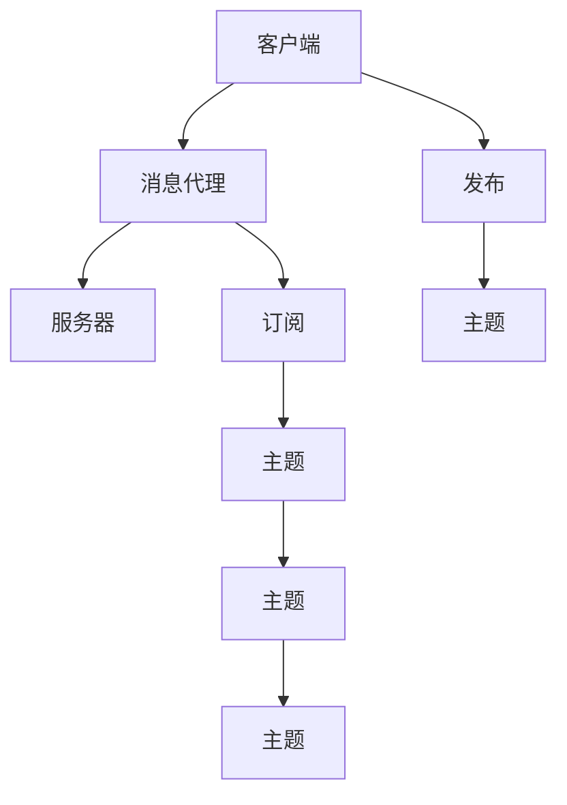

                 

# MQTT物联网通信协议详解

## 1. 背景介绍

### 1.1 问题由来

随着物联网（IoT）设备的快速普及，如何高效、可靠地管理这些设备，使其能够互相通信、共享数据，成为一个迫切需要解决的问题。传统的通信协议如HTTP、TCP/IP等，由于其复杂的通信流程和高开销，不适合物联网设备间的实时通信需求。因此，基于发布/订阅（Publish/Subscribe）模式的 MQTT（Message Queuing Telemetry Transport）协议应运而生，成为了物联网设备间通信的理想选择。

### 1.2 问题核心关键点

MQTT协议的核心关键点在于其轻量级、高效、可靠的发布/订阅通信机制。其主要优势包括：

- 轻量级：MQTT协议的消息格式简单，仅需32字节，可以降低网络传输的带宽和能耗。
- 高效：MQTT协议采用短连接和发布/订阅模式，避免了不必要的握手和连接建立，提高了通信效率。
- 可靠：MQTT协议支持多种可靠传输机制，包括断点续传、消息确认等，确保数据传输的可靠性。

### 1.3 问题研究意义

MQTT协议在物联网领域的应用具有重要意义：

1. 降低设备间通信成本：轻量级的数据格式和高效的消息传输机制，使得物联网设备的通信成本显著降低。
2. 提高通信效率：通过发布/订阅模式，物联网设备可以实时接收感兴趣的发布信息，避免了不必要的通信开销。
3. 增强数据可靠性：多种可靠传输机制确保了数据传输的可靠性，即使在网络条件不佳的情况下，也能保证消息的完整传输。
4. 简化设备管理：通过中心化的消息代理（Broker），物联网设备可以更方便地进行管理和配置。

## 2. 核心概念与联系

### 2.1 核心概念概述

为更好地理解MQTT协议的工作原理和优化方向，本节将介绍几个密切相关的核心概念：

- MQTT协议：基于发布/订阅模式的轻量级通信协议，适合物联网设备间的实时通信。
- 消息代理（Broker）：MQTT协议的中心节点，负责接收、转发和存储消息。
- 客户端（Client）：连接消息代理的物联网设备，可以是传感器、智能家居设备等。
- 发布（Publish）：客户端向消息代理发送消息的行为。
- 订阅（Subscribe）：客户端向消息代理订阅感兴趣的主题（Topic）的行为。
- 主题（Topic）：MQTT协议中用于标识消息内容的字符串。
- 保留消息（Retained Message）：在客户端订阅之前，就存在服务器上的消息，可以直接下发到订阅客户端。
- 遗嘱消息（Will Message）：客户端断开连接时发送的最后一条消息，用于传递客户端的状态信息。

这些核心概念之间的逻辑关系可以通过以下Mermaid流程图来展示：



这个流程图展示了大语言模型的核心概念及其之间的关系：

1. 客户端通过连接消息代理（Broker），建立与服务器的通信连接。
2. 客户端可以发布（Publish）消息到特定主题（Topic）。
3. 客户端可以订阅（Subscribe）感兴趣的主题（Topic），从而接收相关消息。
4. 主题可以是一个或多个，用于标识不同的消息内容和类别。
5. 保留消息和遗嘱消息是两个特殊主题，用于在特定条件下进行特定的消息处理。

这些概念共同构成了MQTT协议的基本框架，使其能够高效、可靠地支持物联网设备间的实时通信。

## 3. MQTT协议核心算法原理 & 具体操作步骤
### 3.1 算法原理概述

MQTT协议的核心算法原理基于发布/订阅模式，其主要流程如下：

1. 客户端连接消息代理（Broker），建立通信连接。
2. 客户端可以发布（Publish）消息到特定主题（Topic）。
3. 客户端可以订阅（Subscribe）感兴趣的主题（Topic），从而接收相关消息。
4. 主题可以是一个或多个，用于标识不同的消息内容和类别。
5. 保留消息和遗嘱消息是两个特殊主题，用于在特定条件下进行特定的消息处理。

MQTT协议的通信过程主要涉及以下关键算法：

- 连接建立与保持（Connect and Keep-Alive）：客户端通过连接消息代理（Broker），建立通信连接。消息代理返回连接确认消息，并在后续连接保持过程中定期发送心跳消息。
- 发布（Publish）消息：客户端向消息代理发送消息，消息代理将消息转发到感兴趣的主题上。
- 订阅（Subscribe）消息：客户端向消息代理订阅感兴趣的主题，消息代理将感兴趣的主题订阅到客户端上。
- 保留消息处理（Retained Message）：消息代理将之前存在的保留消息直接下发到订阅客户端。
- 遗嘱消息处理（Will Message）：客户端断开连接时发送的最后一条消息，用于传递客户端的状态信息。

### 3.2 算法步骤详解

以下详细讲解MQTT协议的核心算法步骤：

**Step 1: 连接建立与保持（Connect and Keep-Alive）**

- 客户端通过TCP/IP协议连接到消息代理（Broker）的指定端口（默认1883）。
- 客户端发送连接请求（Connect Packet），包括客户端ID、连接保持时间（Keep-Alive Interval）、会话过期时间（Will Flag）等信息。
- 消息代理返回连接确认消息（Connect Ack Packet），表示连接成功。
- 在连接保持过程中，客户端定期发送心跳消息（Ping Request Packet），消息代理返回心跳响应（Ping Reply Packet）。

**Step 2: 发布（Publish）消息**

- 客户端发送发布请求（Publish Packet），包括主题（Topic）、QoS（Quality of Service）级别和消息体（Payload）。
- 消息代理根据主题将消息转发到所有订阅该主题的客户端上。
- 如果需要保留消息，消息代理将之前存在的保留消息直接下发到订阅客户端。

**Step 3: 订阅（Subscribe）消息**

- 客户端发送订阅请求（Subscribe Packet），包括订阅的主题（Topic）和QoS级别。
- 消息代理将订阅的主题与QoS级别对应，并将订阅请求保存。
- 消息代理收到发布请求后，根据主题将消息转发到所有订阅该主题的客户端上。

**Step 4: 保留消息处理（Retained Message）**

- 消息代理将之前存在的保留消息直接下发到订阅客户端，无需客户端主动订阅。
- 保留消息的标识符为特定主题下的QoS为0的消息。

**Step 5: 遗嘱消息处理（Will Message）**

- 客户端发送遗嘱消息（Will Packet），包括主题（Topic）、QoS级别和消息体（Payload）。
- 消息代理在客户端断开连接时，将遗嘱消息转发到所有订阅该主题的客户端上。

### 3.3 算法优缺点

MQTT协议具有以下优点：

- 轻量级：消息格式简单，仅需32字节，可以降低网络传输的带宽和能耗。
- 高效：发布/订阅模式避免了不必要的握手和连接建立，提高了通信效率。
- 可靠：支持多种可靠传输机制，包括断点续传、消息确认等，确保数据传输的可靠性。

同时，MQTT协议也存在一些局限性：

- 处理能力有限：由于消息代理需要保存所有订阅和发布请求，因此可能会面临高并发场景下的处理瓶颈。
- 安全性不足：默认情况下MQTT协议的通信不加密，容易被窃听和篡改。
- 插件支持有限：MQTT协议的扩展性不足，内置的插件和功能相对有限。

### 3.4 算法应用领域

MQTT协议在物联网领域的应用广泛，例如：

- 智能家居：智能灯泡、智能门锁等设备通过MQTT协议进行通信，实现远程控制和设备管理。
- 农业物联网：传感器设备通过MQTT协议将实时数据传输到云端，实现智能灌溉、精准施肥等。
- 医疗物联网：医疗设备通过MQTT协议将健康数据传输到医疗平台，实现远程监控和诊断。
- 工业物联网：设备通过MQTT协议实现设备间的通信和数据共享，优化生产流程。
- 车联网：车载设备通过MQTT协议实现车辆与云端、车辆间的通信，提升驾驶安全和智能化。

除了上述这些典型应用外，MQTT协议还在智慧城市、智慧交通、智能制造等多个领域得到了广泛的应用，为物联网设备的互联互通提供了坚实的技术保障。

## 4. MQTT协议数学模型和公式 & 详细讲解

### 4.1 数学模型构建

MQTT协议的通信过程可以通过以下数学模型进行描述：

- 连接建立与保持（Connect and Keep-Alive）：

  - 连接请求（Connect Packet）：
    $$
    Connect Packet = ClientID | Keep-Alive Interval | Session Expiry Interval | Will Flag | Will Topic | Will Message | Password | UserName
    $$
  - 连接确认（Connect Ack Packet）：
    $$
    Connect Ack Packet = Connection Accepted | Session Present | Session Expiry Interval | Will Flag | Will Topic | Will Message | Will Retain Flag
    $$
  - 心跳请求（Ping Request Packet）：
    $$
    Ping Request Packet = Variable Header | Payload
    $$
  - 心跳响应（Ping Reply Packet）：
    $$
    Ping Reply Packet = Variable Header | Payload
    $$

- 发布（Publish）消息：

  - 发布请求（Publish Packet）：
    $$
    Publish Packet = Fixed Header | Topic | Payload | QoS | Payload Format Indicator | Additional Information | Payload User Data | Payload Data
    $$
  - 发布确认（Publish Ack Packet）：
    $$
    Publish Ack Packet = Variable Header | Payload
    $$

- 订阅（Subscribe）消息：

  - 订阅请求（Subscribe Packet）：
    $$
    Subscribe Packet = Fixed Header | Topic Array | QoS Array | Payload
    $$
  - 订阅确认（Subscribe Ack Packet）：
    $$
    Subscribe Ack Packet = Variable Header | Payload
    $$

- 保留消息处理（Retained Message）：

  - 保留消息（Retained Message）：
    $$
    Retained Message = Payload | QoS
    $$

- 遗嘱消息处理（Will Message）：

  - 遗嘱消息请求（Will Packet）：
    $$
    Will Packet = Fixed Header | Topic | Payload | QoS | Payload Format Indicator | Additional Information | Payload User Data | Payload Data
    $$
  - 遗嘱消息确认（Will Ack Packet）：
    $$
    Will Ack Packet = Variable Header | Payload
    $$

### 4.2 公式推导过程

MQTT协议的通信过程可以通过以下公式推导进行详细讲解：

- 连接建立与保持（Connect and Keep-Alive）：

  - 连接请求（Connect Packet）：
    $$
    Connect Packet = ClientID | Keep-Alive Interval | Session Expiry Interval | Will Flag | Will Topic | Will Message | Password | UserName
    $$

  - 连接确认（Connect Ack Packet）：
    $$
    Connect Ack Packet = Connection Accepted | Session Present | Session Expiry Interval | Will Flag | Will Topic | Will Message | Will Retain Flag
    $$

  - 心跳请求（Ping Request Packet）：
    $$
    Ping Request Packet = Variable Header | Payload
    $$

  - 心跳响应（Ping Reply Packet）：
    $$
    Ping Reply Packet = Variable Header | Payload
    $$

- 发布（Publish）消息：

  - 发布请求（Publish Packet）：
    $$
    Publish Packet = Fixed Header | Topic | Payload | QoS | Payload Format Indicator | Additional Information | Payload User Data | Payload Data
    $$

  - 发布确认（Publish Ack Packet）：
    $$
    Publish Ack Packet = Variable Header | Payload
    $$

- 订阅（Subscribe）消息：

  - 订阅请求（Subscribe Packet）：
    $$
    Subscribe Packet = Fixed Header | Topic Array | QoS Array | Payload
    $$

  - 订阅确认（Subscribe Ack Packet）：
    $$
    Subscribe Ack Packet = Variable Header | Payload
    $$

- 保留消息处理（Retained Message）：

  - 保留消息（Retained Message）：
    $$
    Retained Message = Payload | QoS
    $$

- 遗嘱消息处理（Will Message）：

  - 遗嘱消息请求（Will Packet）：
    $$
    Will Packet = Fixed Header | Topic | Payload | QoS | Payload Format Indicator | Additional Information | Payload User Data | Payload Data
    $$

  - 遗嘱消息确认（Will Ack Packet）：
    $$
    Will Ack Packet = Variable Header | Payload
    $$

### 4.3 案例分析与讲解

以智能家居场景为例，分析MQTT协议的应用过程：

1. 智能灯泡通过MQTT协议连接家庭网络路由器，建立通信连接。
2. 智能灯泡通过MQTT协议发布当前亮度和颜色信息到主题“brightness”和“color”上。
3. 智能窗帘通过MQTT协议订阅主题“brightness”和“color”，接收智能灯泡发布的消息并根据消息调整亮度和颜色。
4. 智能音箱通过MQTT协议订阅主题“brightness”和“color”，接收智能灯泡发布的消息并播报当前亮度和颜色信息。
5. 当智能灯泡断电时，发送遗嘱消息到主题“status”上，通知其他设备该设备状态。

## 5. 项目实践：代码实例和详细解释说明
### 5.1 开发环境搭建

在进行MQTT实践前，我们需要准备好开发环境。以下是使用Python进行Paho MQTT库开发的环境配置流程：

1. 安装Anaconda：从官网下载并安装Anaconda，用于创建独立的Python环境。

2. 创建并激活虚拟环境：
```bash
conda create -n mqtt-env python=3.8 
conda activate mqtt-env
```

3. 安装Paho MQTT库：
```bash
pip install paho-mqtt
```

4. 安装各类工具包：
```bash
pip install numpy pandas scikit-learn matplotlib tqdm jupyter notebook ipython
```

完成上述步骤后，即可在`mqtt-env`环境中开始MQTT实践。

### 5.2 源代码详细实现

下面我们以智能家居系统为例，给出使用Paho MQTT库对MQTT协议进行实现的PyTorch代码实现。

首先，定义MQTT客户端：

```python
import paho.mqtt.client as mqtt

class MQTTClient:
    def __init__(self, broker, client_id):
        self.broker = broker
        self.client_id = client_id
        self.client = mqtt.Client(self.client_id)
        self.client.on_connect = self.on_connect
        self.client.on_publish = self.on_publish
        self.client.on_subscribe = self.on_subscribe
        self.client.on_message = self.on_message

    def on_connect(self, client, userdata, flags, rc):
        print("Connected with result code "+str(rc))
        # 订阅主题
        self.client.subscribe("brightness")
        self.client.subscribe("color")

    def on_publish(self, client, userdata, mid):
        print("Message published to broker")
        # 发布消息
        self.client.publish("status", "Device is offline")

    def on_subscribe(self, client, userdata, mid, granted_qos):
        print("Subscribed to broker")

    def on_message(self, client, userdata, message):
        print("Received message: " + str(message.payload.decode()))
```

然后，定义MQTT服务器：

```python
import paho.mqtt.client as mqtt

class MQTTServer:
    def __init__(self, broker):
        self.broker = broker
        self.client = mqtt.Client()
        self.client.on_connect = self.on_connect
        self.client.on_publish = self.on_publish
        self.client.on_subscribe = self.on_subscribe
        self.client.on_message = self.on_message

    def on_connect(self, client, userdata, flags, rc):
        print("Connected with result code "+str(rc))
        # 处理发布请求
        self.client.subscribe("brightness")
        self.client.subscribe("color")

    def on_publish(self, client, userdata, mid):
        print("Message published to broker")
        # 处理订阅请求
        self.client.publish("status", "Device is offline")

    def on_subscribe(self, client, userdata, mid, granted_qos):
        print("Subscribed to broker")

    def on_message(self, client, userdata, message):
        print("Received message: " + str(message.payload.decode()))
```

最后，启动MQTT服务：

```python
broker = "mqtt.eclipse.org"

client = MQTTClient(broker, "client1")
server = MQTTServer(broker)

client.connect(broker, 1883, 60)
server.connect(broker, 1883, 60)

client.loop_start()
server.loop_start()

while True:
    pass
```

以上就是使用Paho MQTT库对MQTT协议进行实现的完整代码实现。可以看到，MQTT协议的通信过程非常简单，只需通过Python的Paho MQTT库，即可完成客户端和服务器的连接、发布和订阅等操作。

### 5.3 代码解读与分析

让我们再详细解读一下关键代码的实现细节：

**MQTTClient类**：
- `__init__`方法：初始化broker、client_id和MQTT客户端。
- `on_connect`方法：连接成功后执行的回调函数，订阅主题“brightness”和“color”。
- `on_publish`方法：发布消息后执行的回调函数。
- `on_subscribe`方法：订阅成功后执行的回调函数。
- `on_message`方法：接收消息后执行的回调函数。

**MQTTServer类**：
- `__init__`方法：初始化broker和MQTT服务器。
- `on_connect`方法：连接成功后执行的回调函数，处理发布请求。
- `on_publish`方法：发布消息后执行的回调函数。
- `on_subscribe`方法：订阅成功后执行的回调函数。
- `on_message`方法：接收消息后执行的回调函数。

**启动MQTT服务**：
- 定义broker地址，创建MQTT客户端和MQTT服务器实例。
- 启动MQTT客户端和服务器的循环连接。
- 无限循环保持连接状态。

可以看到，MQTT协议的实现非常简单，开发者只需关注数据包的处理和连接状态的维护。Paho MQTT库提供了完整的API支持，能够快速实现MQTT通信功能。

## 6. 实际应用场景
### 6.1 智能家居系统

MQTT协议在智能家居系统中得到了广泛应用。通过MQTT协议，智能设备可以实时通信，实现设备间的互联互通。

以智能灯泡为例，智能灯泡通过MQTT协议连接到家庭网络路由器，发布当前亮度和颜色信息到主题“brightness”和“color”上。智能窗帘和智能音箱订阅这两个主题，接收智能灯泡发布的消息并根据消息调整亮度和颜色。当智能灯泡断电时，发送遗嘱消息到主题“status”上，通知其他设备该设备状态。

### 6.2 农业物联网

MQTT协议在农业物联网中也得到了广泛应用。传感器设备通过MQTT协议将实时数据传输到云端，实现智能灌溉、精准施肥等。

以农田监测为例，传感器设备通过MQTT协议将土壤湿度、温度等数据发送到云端。农业管理平台订阅这些主题，接收传感器设备发布的数据，并根据数据进行灌溉、施肥等操作。当传感器设备异常时，发送遗嘱消息到主题“status”上，通知农业管理平台该设备状态。

### 6.3 医疗物联网

MQTT协议在医疗物联网中也得到了广泛应用。医疗设备通过MQTT协议将健康数据传输到云端，实现远程监控和诊断。

以可穿戴设备为例，可穿戴设备通过MQTT协议将心率、血压等数据发送到云端。医疗平台订阅这些主题，接收可穿戴设备发布的数据，并根据数据进行健康监测和诊断。当可穿戴设备异常时，发送遗嘱消息到主题“status”上，通知医疗平台该设备状态。

## 7. 工具和资源推荐
### 7.1 学习资源推荐

为了帮助开发者系统掌握MQTT协议的理论基础和实践技巧，这里推荐一些优质的学习资源：

1. MQTT协议官方文档：详细介绍了MQTT协议的各个部分，包括连接建立、发布、订阅、保留消息和遗嘱消息等。
2. MQTT协议教程：通过实例讲解MQTT协议的使用方法和注意事项。
3. MQTT协议实战教程：通过实际案例演示MQTT协议在物联网应用中的部署和优化。
4. MQTT协议书籍：深入解析MQTT协议的原理和应用场景，适合进一步学习和研究。

通过对这些资源的学习实践，相信你一定能够快速掌握MQTT协议的精髓，并用于解决实际的物联网问题。
###  7.2 开发工具推荐

高效的开发离不开优秀的工具支持。以下是几款用于MQTT协议开发的常用工具：

1. Paho MQTT：开源的MQTT客户端库，支持Python、C++、Java等语言。
2. Eclipse Paho：基于Paho MQTT的MQTT开发框架，提供完善的API支持。
3. ThingWorx：微软提供的物联网平台，支持MQTT协议的应用开发。
4. AWS IoT：亚马逊提供的物联网云平台，支持MQTT协议的云端和设备端开发。
5. Google Cloud IoT：谷歌提供的物联网云平台，支持MQTT协议的云端和设备端开发。

合理利用这些工具，可以显著提升MQTT协议的开发效率，加快创新迭代的步伐。

### 7.3 相关论文推荐

MQTT协议的研究源于学界的持续研究。以下是几篇奠基性的相关论文，推荐阅读：

1. MQTT协议设计：详细介绍了MQTT协议的设计思想和关键算法。
2. MQTT协议应用：通过实例分析MQTT协议在物联网中的应用。
3. MQTT协议优化：探讨MQTT协议的优化方法和性能改进。

这些论文代表了大语言模型微调技术的发展脉络。通过学习这些前沿成果，可以帮助研究者把握学科前进方向，激发更多的创新灵感。

## 8. 总结：未来发展趋势与挑战

### 8.1 总结

本文对MQTT协议进行了全面系统的介绍。首先阐述了MQTT协议的背景和研究意义，明确了其在物联网领域的重要地位。其次，从原理到实践，详细讲解了MQTT协议的核心算法和操作步骤，给出了MQTT协议任务开发的完整代码实例。同时，本文还广泛探讨了MQTT协议在智能家居、农业物联网、医疗物联网等多个领域的应用前景，展示了其在物联网设备间通信的巨大潜力。最后，本文精选了MQTT协议的学习资源，力求为读者提供全方位的技术指引。

通过本文的系统梳理，可以看到，MQTT协议在物联网设备间的通信中发挥了重要作用，其轻量级、高效、可靠的特点使其成为物联网设备通信的理想选择。未来，伴随MQTT协议的不断发展，其在物联网中的应用将更加广泛，为物联网设备的互联互通提供坚实的技术保障。

### 8.2 未来发展趋势

展望未来，MQTT协议的发展趋势将呈现以下几个方向：

1. 增强安全性：MQTT协议将逐步引入更多的安全机制，包括加密传输、数字证书等，确保数据传输的安全性。
2. 扩展性增强：MQTT协议将逐步支持更多的插件和功能，增强其扩展性，适应更多应用场景。
3. 性能优化：MQTT协议将进一步优化其性能，提升其在大规模部署和高并发场景下的处理能力。
4. 跨平台支持：MQTT协议将支持更多平台和语言，促进其在更多领域的广泛应用。

### 8.3 面临的挑战

尽管MQTT协议已经取得了瞩目成就，但在迈向更加智能化、普适化应用的过程中，它仍面临着诸多挑战：

1. 处理能力有限：由于消息代理需要保存所有订阅和发布请求，因此可能会面临高并发场景下的处理瓶颈。
2. 安全性不足：默认情况下MQTT协议的通信不加密，容易被窃听和篡改。
3. 插件支持有限：MQTT协议的扩展性不足，内置的插件和功能相对有限。

### 8.4 研究展望

未来的研究需要在以下几个方面寻求新的突破：

1. 优化数据传输机制：通过改进数据传输机制，降低网络传输的带宽和能耗，提高数据传输效率。
2. 增强安全性：引入更多的安全机制，确保数据传输的安全性。
3. 支持更多应用场景：支持更多平台和语言，适应更多应用场景。
4. 提高扩展性：增强MQTT协议的扩展性，支持更多的插件和功能。

这些研究方向的探索，必将引领MQTT协议走向更高的台阶，为物联网设备的互联互通提供更坚实的基础。相信随着学界和产业界的共同努力，MQTT协议必将在构建智能互联的世界中发挥更大的作用。

## 9. 附录：常见问题与解答

**Q1：MQTT协议与HTTP/HTTPS协议有何不同？**

A: MQTT协议与HTTP/HTTPS协议的主要区别在于其通信模式。HTTP/HTTPS协议采用客户端请求-服务器响应的模式，而MQTT协议采用发布/订阅模式。MQTT协议的通信模式更加灵活，客户端可以主动发布消息，服务器可以主动订阅消息，实时性更强。

**Q2：MQTT协议支持哪些QoS级别？**

A: MQTT协议支持三种QoS级别：

1. QoS 0：最多一次发布，服务器不保证数据传输的可靠性。
2. QoS 1：至少一次发布，服务器保证消息传输的可靠性，但可能存在数据丢失。
3. QoS 2：确保消息传输的可靠性，服务器通过确认机制保证消息的完整传输。

**Q3：MQTT协议如何处理遗嘱消息？**

A: MQTT协议中的遗嘱消息在客户端断开连接时发送，用于传递客户端的状态信息。服务器在收到遗嘱消息后，将消息下发到所有订阅该主题的客户端。

**Q4：MQTT协议的通信模式是如何实现的？**

A: MQTT协议的通信模式通过订阅/发布机制实现。客户端订阅感兴趣的主题，服务器收到发布消息后，将消息下发到所有订阅该主题的客户端。

**Q5：MQTT协议的保留消息和遗嘱消息有何不同？**

A: MQTT协议的保留消息和遗嘱消息的区别在于触发条件和处理方式：

1. 保留消息：在客户端订阅之前，就存在服务器上的消息，直接下发到订阅客户端。
2. 遗嘱消息：在客户端断开连接时发送，用于传递客户端的状态信息，服务器在收到遗嘱消息后，将消息下发到所有订阅该主题的客户端。

---

作者：禅与计算机程序设计艺术 / Zen and the Art of Computer Programming

