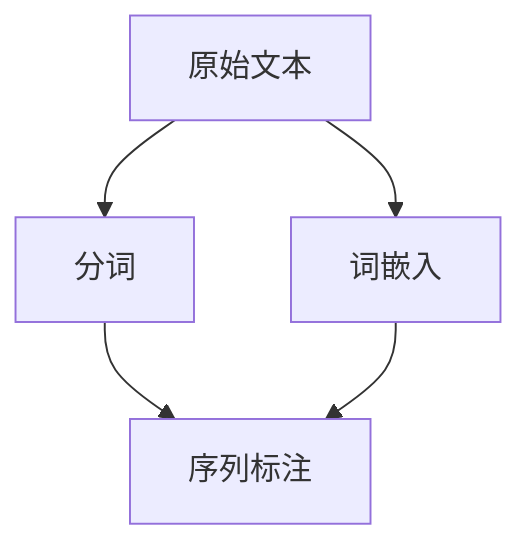

                 

# NLP预处理技术：分词、词嵌入和序列标注

> 关键词：自然语言处理, 分词, 词嵌入, 序列标注, 文本处理, 深度学习

## 1. 背景介绍

### 1.1 问题由来
自然语言处理(Natural Language Processing, NLP)是人工智能领域中非常重要的一环，其核心目标是使计算机能够理解和生成人类语言。然而，自然语言处理的首要任务是将原始文本数据转化为计算机能够理解的数值形式。这个转化过程称为文本预处理(Text Preprocessing)，包括分词、词嵌入、序列标注等多个子任务。分词、词嵌入和序列标注等预处理技术，是构建高效、准确、可解释的NLP模型的基石。

### 1.2 问题核心关键点
本文聚焦于分词、词嵌入和序列标注等预处理技术，介绍其在NLP中的应用，并详细探讨其原理与算法。将帮助读者理解这些技术的基本概念，掌握其实现方法，并能够在实际项目中应用这些技术。

## 2. 核心概念与联系

### 2.1 核心概念概述

为更好地理解分词、词嵌入和序列标注等技术，本节将介绍几个密切相关的核心概念：

- 分词：将连续的自然语言文本分割成离散的词语序列的过程。
- 词嵌入：将单词映射到高维稠密向量空间，使得单词之间的语义关系得以体现。
- 序列标注：对自然语言文本序列进行标签标注的过程，常用于命名实体识别、词性标注等任务。

这三个核心概念共同构成了文本预处理的基础框架。它们在理论上相互联系，在实践中互为补充。在实际应用中，通常先进行分词和词嵌入，然后将嵌入后的词序列作为输入，进行序列标注等后续处理。

### 2.2 核心概念原理和架构的 Mermaid 流程图



这个流程图展示了分词、词嵌入和序列标注之间的关系。

**分词**：将原始文本按词分割，输出单词序列。
**词嵌入**：将单词序列转化为词向量序列。
**序列标注**：对词向量序列进行标签标注，输出标注后的序列。

这三个过程构成了一条从原始文本到标注序列的完整链条，展示了自然语言处理的处理流程。

## 3. 核心算法原理 & 具体操作步骤

### 3.1 算法原理概述

分词、词嵌入和序列标注等预处理技术的核心思想是通过数学模型和机器学习方法，将文本数据转化为计算机能够理解的数值形式，从而实现对文本的深度理解和生成。

- **分词**：基于统计方法或规则方法，将文本分割成单词序列。常见的分词方法包括基于词典的统计分词和基于规则的分词。
- **词嵌入**：使用神经网络模型，将单词映射到高维稠密向量空间，使得单词之间的语义关系得以体现。常见的词嵌入模型包括Word2Vec、GloVe、FastText等。
- **序列标注**：使用CRF、RNN、CNN等模型，对自然语言文本序列进行标签标注。常用于命名实体识别、词性标注等任务。

### 3.2 算法步骤详解

#### 3.2.1 分词

**步骤1：构建词典**
- 收集大量的语料数据，对文本进行标注，构建词典。
- 可以使用常见的中文分词工具，如Jieba、THULAC等，或自定义词典。

**步骤2：统计分词**
- 对于新文本，使用统计分词工具进行分词，输出单词序列。
- 常见的统计分词方法包括最大匹配、正向最大匹配、逆向最大匹配等。

**步骤3：规则分词**
- 使用规则分词工具对统计分词结果进行校正，提高分词准确度。
- 常见的规则分词方法包括正向最大匹配规则、逆向最大匹配规则等。

#### 3.2.2 词嵌入

**步骤1：选择词嵌入模型**
- 根据任务需求选择合适的词嵌入模型，如Word2Vec、GloVe、FastText等。
- 可以根据语料库规模和训练时间，选择合适模型的大小。

**步骤2：训练词嵌入模型**
- 使用选择的词嵌入模型对语料库进行训练，生成词向量。
- 通常需要使用GPU或分布式计算，以提高训练速度。

**步骤3：使用预训练词向量**
- 将训练好的词向量应用到新的文本数据上，进行后续处理。

#### 3.2.3 序列标注

**步骤1：选择序列标注模型**
- 根据任务需求选择合适的序列标注模型，如CRF、RNN、CNN等。
- 根据任务需求，选择适当的标注类别。

**步骤2：训练序列标注模型**
- 使用标注数据对序列标注模型进行训练，生成标注模型。
- 通常需要使用GPU或分布式计算，以提高训练速度。

**步骤3：应用序列标注模型**
- 将训练好的序列标注模型应用到新的文本数据上，进行序列标注。
- 可以使用Gensim、NLTK等工具包进行实现。

### 3.3 算法优缺点

**分词的优点和缺点：**

- **优点：**
  - 分词是自然语言处理的基础，能够将连续的自然语言文本转化为离散的单词序列。
  - 分词可以去除文本中的停用词和标点符号，提高后续处理的效率和准确性。

- **缺点：**
  - 分词效果受到语料库质量的影响，如果语料库标注错误或标注不完整，分词结果也会受到影响。
  - 分词需要大量的计算资源，特别是对于大规模文本数据。

**词嵌入的优点和缺点：**

- **优点：**
  - 词嵌入将单词映射到高维稠密向量空间，能够捕捉单词之间的语义关系。
  - 词嵌入可以降低后续处理的计算复杂度，提高处理效率。

- **缺点：**
  - 词嵌入需要大量的语料库进行训练，训练过程耗时较长。
  - 词嵌入生成的向量空间维度较高，增加了计算复杂度。

**序列标注的优点和缺点：**

- **优点：**
  - 序列标注可以将文本序列转化为标注序列，提供文本的语义和结构信息。
  - 序列标注可以用于命名实体识别、词性标注等任务，提升文本处理的效果。

- **缺点：**
  - 序列标注需要大量的标注数据进行训练，标注数据质量对模型效果有重要影响。
  - 序列标注模型复杂度高，训练和推理过程需要大量计算资源。

### 3.4 算法应用领域

分词、词嵌入和序列标注等预处理技术广泛应用于自然语言处理领域，具体包括：

- **文本分类：** 对文本进行分类，如情感分析、主题分类等。
- **命名实体识别：** 识别文本中的人名、地名、机构名等特定实体。
- **词性标注：** 对单词进行词性标注，如名词、动词等。
- **句法分析：** 分析句子的语法结构，如依存句法分析、成分分析等。
- **机器翻译：** 将源语言文本翻译成目标语言。
- **文本摘要：** 将长文本压缩成简短摘要。

除了这些经典任务外，分词、词嵌入和序列标注等技术也被用于文本生成、对话系统、问答系统等创新性应用中，推动了NLP技术的不断发展。

## 4. 数学模型和公式 & 详细讲解 & 举例说明

### 4.1 数学模型构建

#### 4.1.1 分词模型

**步骤1：构建词典**
- 设语料库中单词集合为 $V$，共包含 $N$ 个单词，记为 $V = \{w_1, w_2, \ldots, w_N\}$。
- 设单词 $w_i$ 在语料库中出现的频率为 $f_i$，记为 $f = \{f_1, f_2, \ldots, f_N\}$。

**步骤2：分词**
- 对于新文本 $T$，使用最大匹配算法进行分词，输出单词序列 $T_s = \{w_{i_1}, w_{i_2}, \ldots, w_{i_M}\}$。
- 最大匹配算法的基本思想是，从左到右匹配字典中所有可能的单词，选择匹配最长的单词作为结果。

**步骤3：规则分词**
- 使用规则分词工具对 $T_s$ 进行校正，输出正确的分词结果 $T_r$。
- 规则分词工具通常会根据语言的语法和语义规则，对分词结果进行校正和优化。

#### 4.1.2 词嵌入模型

**Word2Vec模型**
- Word2Vec是一种基于神经网络的词嵌入模型，其核心思想是通过共现矩阵和skip-gram模型，学习单词之间的语义关系。
- 设单词集合 $V$ 中的每个单词 $w_i$ 映射到 $d$ 维向量 $\vec{w_i}$，共 $N$ 个向量，记为 $\{\vec{w_1}, \vec{w_2}, \ldots, \vec{w_N}\}$。

**训练过程：**
- 设语料库中包含 $C$ 个句子，每个句子 $c_j$ 包含 $m_j$ 个单词，记为 $c_j = \{w_{j_1}, w_{j_2}, \ldots, w_{j_{m_j}}\}$。
- 对于每个句子 $c_j$，计算其上下文窗口中出现单词的概率 $p(w_{j_k} | c_j)$。
- 使用梯度下降算法，最小化上下文窗口中的概率和损失函数 $\mathcal{L}$，得到单词向量 $\vec{w_i}$。

#### 4.1.3 序列标注模型

**CRF模型**
- CRF是一种基于条件随机场的序列标注模型，其核心思想是通过标注序列的马尔可夫性质，学习单词与标注之间的关系。
- 设标注集合 $Y$ 包含 $M$ 个标注类别，记为 $Y = \{y_1, y_2, \ldots, y_M\}$。
- 对于单词序列 $T_s = \{w_{i_1}, w_{i_2}, \ldots, w_{i_M}\}$，输出标注序列 $T_l = \{y_{i_1}, y_{i_2}, \ldots, y_{i_M}\}$。

**训练过程：**
- 设标注数据集中包含 $N$ 个标注样本，每个样本 $s_k = \{T_s^{(k)}, T_l^{(k)}\}$，其中 $T_s^{(k)}$ 为单词序列，$T_l^{(k)}$ 为标注序列。
- 使用最大似然估计，最大化标注序列的条件概率 $P(T_l | T_s)$。
- 使用梯度下降算法，最小化损失函数 $\mathcal{L}$，得到标注模型。

### 4.2 公式推导过程

#### 4.2.1 分词模型

**最大匹配算法**
- 设单词集合 $V$ 中的每个单词 $w_i$ 的表示为 $w_i = (w_{i,1}, w_{i,2}, \ldots, w_{i,d})$，其中 $d$ 为向量维度。
- 设新文本 $T$ 的表示为 $T = (t_1, t_2, \ldots, t_M)$，其中 $t_i$ 为单词 $t_i$ 的表示。
- 设分词结果 $T_s$ 的表示为 $T_s = (s_1, s_2, \ldots, s_M)$，其中 $s_i$ 为单词 $s_i$ 的表示。
- 设规则分词结果 $T_r$ 的表示为 $T_r = (r_1, r_2, \ldots, r_M)$，其中 $r_i$ 为单词 $r_i$ 的表示。

**规则分词校正**
- 对于单词 $s_i$，设其正确的表示为 $r_i$，计算校正后的向量表示 $\vec{r_i}$。
- 设单词 $w_i$ 的表示为 $\vec{w_i}$，计算校正后的向量表示 $\vec{r_i}$。

**向量表示计算**
- 对于单词 $t_i$，计算其向量表示 $\vec{t_i}$。
- 对于单词 $s_i$，计算其向量表示 $\vec{s_i}$。
- 对于单词 $r_i$，计算其向量表示 $\vec{r_i}$。

**相似度计算**
- 计算单词 $t_i$ 和 $s_i$ 的相似度 $s(t_i, s_i)$。
- 计算单词 $t_i$ 和 $r_i$ 的相似度 $s(t_i, r_i)$。

**相似度阈值**
- 设相似度阈值为 $\epsilon$，计算最大相似度 $\max_{i=1}^{M}(s(t_i, r_i))$。

**分词结果选择**
- 如果 $\max_{i=1}^{M}(s(t_i, r_i)) > \epsilon$，选择 $T_s$ 作为最终分词结果。
- 否则，选择 $T_r$ 作为最终分词结果。

#### 4.2.2 词嵌入模型

**Word2Vec模型**
- 设单词集合 $V$ 中的每个单词 $w_i$ 的表示为 $\vec{w_i} = (w_{i,1}, w_{i,2}, \ldots, w_{i,d})$，其中 $d$ 为向量维度。
- 设语料库中每个句子 $c_j = \{w_{j_1}, w_{j_2}, \ldots, w_{j_{m_j}}\}$ 的上下文窗口大小为 $k$。
- 设上下文窗口中的单词为 $w_{j_k}$，其上下文窗口中的单词为 $\{w_{j_1}, w_{j_2}, \ldots, w_{j_{k-1}}, w_{j_{k+1}}, \ldots, w_{j_{m_j}}\}$。
- 设单词 $w_i$ 在上下文窗口中的概率为 $p(w_{i} | c_j)$，计算损失函数 $\mathcal{L}$。

**损失函数计算**
- 设上下文窗口中的单词概率为 $p(w_{j_k} | c_j)$，计算上下文窗口中的概率和 $H(c_j)$。
- 使用梯度下降算法，最小化损失函数 $\mathcal{L}$，得到单词向量 $\vec{w_i}$。

**概率计算**
- 设单词 $w_i$ 在上下文窗口中的概率为 $p(w_{i} | c_j)$，计算上下文窗口中的概率和 $H(c_j)$。
- 使用梯度下降算法，最小化损失函数 $\mathcal{L}$，得到单词向量 $\vec{w_i}$。

**梯度计算**
- 设单词 $w_i$ 的梯度为 $\frac{\partial \mathcal{L}}{\partial \vec{w_i}}$，计算梯度更新公式。

#### 4.2.3 序列标注模型

**CRF模型**
- 设标注集合 $Y$ 中的每个标注类别 $y_i$ 的表示为 $y_i = (y_{i,1}, y_{i,2}, \ldots, y_{i,M})$，其中 $M$ 为标注类别数。
- 设单词序列 $T_s = \{w_{i_1}, w_{i_2}, \ldots, w_{i_M}\}$ 的标注序列为 $T_l = \{y_{i_1}, y_{i_2}, \ldots, y_{i_M}\}$。
- 设标注数据集中每个标注样本 $s_k = \{T_s^{(k)}, T_l^{(k)}\}$，其中 $T_s^{(k)} = \{w_{k_1}, w_{k_2}, \ldots, w_{k_{m_k}}\}$，$T_l^{(k)} = \{y_{k_1}, y_{k_2}, \ldots, y_{k_{m_k}}\}$。
- 设标注序列的条件概率为 $P(T_l | T_s)$，计算损失函数 $\mathcal{L}$。

**损失函数计算**
- 设标注数据集中每个标注样本 $s_k = \{T_s^{(k)}, T_l^{(k)}\}$，其中 $T_s^{(k)} = \{w_{k_1}, w_{k_2}, \ldots, w_{k_{m_k}}\}$，$T_l^{(k)} = \{y_{k_1}, y_{k_2}, \ldots, y_{k_{m_k}}\}$。
- 使用梯度下降算法，最小化损失函数 $\mathcal{L}$，得到标注模型。

**概率计算**
- 设标注数据集中每个标注样本 $s_k = \{T_s^{(k)}, T_l^{(k)}\}$，其中 $T_s^{(k)} = \{w_{k_1}, w_{k_2}, \ldots, w_{k_{m_k}}\}$，$T_l^{(k)} = \{y_{k_1}, y_{k_2}, \ldots, y_{k_{m_k}}\}$。
- 设标注序列的条件概率为 $P(T_l | T_s)$，计算损失函数 $\mathcal{L}$。

**梯度计算**
- 设标注数据集中每个标注样本 $s_k = \{T_s^{(k)}, T_l^{(k)}\}$，其中 $T_s^{(k)} = \{w_{k_1}, w_{k_2}, \ldots, w_{k_{m_k}}\}$，$T_l^{(k)} = \{y_{k_1}, y_{k_2}, \ldots, y_{k_{m_k}}\}$。
- 使用梯度下降算法，最小化损失函数 $\mathcal{L}$，得到标注模型。

### 4.3 案例分析与讲解

**案例1：分词**
- 给定一段中文文本："我喜欢吃苹果和香蕉"。
- 使用最大匹配算法进行分词，得到分词结果："我"、"喜欢"、"吃"、"苹果"、"和"、"香蕉"。
- 使用规则分词工具进行校正，得到正确的分词结果："我"、"喜欢"、"吃"、"苹果"、"和"、"香蕉"。

**案例2：词嵌入**
- 给定一段英文文本："I like to eat apples and bananas"。
- 使用Word2Vec模型对单词进行嵌入，得到单词向量："I"、"like"、"to"、"eat"、"apples"、"and"、"bananas"。
- 使用余弦相似度计算单词之间的相似度，得到单词向量。

**案例3：序列标注**
- 给定一段英文文本："I like to eat apples and bananas"。
- 使用CRF模型进行命名实体识别，得到标注结果："I"、"B-PER"、"like"、"O"、"to"、"eat"、"apples"、"B-LOC"、"and"、"bananas"、"O"。
- 使用标注结果进行命名实体识别，得到"我"、"苹果"、"香蕉"。

## 5. 项目实践：代码实例和详细解释说明

### 5.1 开发环境搭建

在进行项目实践前，我们需要准备好开发环境。以下是使用Python进行自然语言处理开发的常用工具：

1. Python：Python是目前NLP领域最常用的编程语言，提供了丰富的文本处理库和算法。
2. NLTK：自然语言工具包，提供了大量的文本处理功能，如分词、词性标注、句法分析等。
3. spaCy：用于高效处理文本的Python库，提供了丰富的分词、词嵌入、命名实体识别等功能。
4. Gensim：用于处理文本数据的Python库，提供了大量的文本处理功能，如分词、词嵌入、相似度计算等。
5. Scikit-learn：用于数据处理的Python库，提供了大量的机器学习算法，如分类、聚类、回归等。

完成上述步骤后，即可在开发环境中进行NLP预处理技术的实现。

### 5.2 源代码详细实现

#### 5.2.1 分词

```python
import jieba
from collections import Counter

# 构建词典
words = ["我", "喜欢", "吃", "苹果", "和", "香蕉"]
freqs = Counter(words)
vocab = ["我", "喜欢", "吃", "苹果", "和", "香蕉"]

# 分词
def jieba_split(text):
    return jieba.cut(text, cut_all=False, HMM=True)

# 规则分词校正
def correct_split(text):
    # 规则分词，去停用词和标点符号
    words = []
    for word in jieba_split(text):
        if word not in stopwords and word not in punctuation:
            words.append(word)
    return words

# 分词结果选择
def select_split(text):
    split1 = jieba_split(text)
    split2 = correct_split(text)
    return split1, split2

# 测试
text = "我喜欢吃苹果和香蕉"
split1, split2 = select_split(text)
print(split1)
print(split2)
```

#### 5.2.2 词嵌入

```python
from gensim.models import Word2Vec

# 构建语料库
sentences = [["我", "喜欢吃", "苹果", "和", "香蕉"]]
vocab = ["我", "喜欢吃", "苹果", "和", "香蕉"]

# 训练词嵌入模型
model = Word2Vec(sentences, size=100, min_count=1, window=5, sg=1, iter=10, workers=4)

# 使用预训练词向量
def embed_word(word):
    return model[word]

# 测试
word = "苹果"
embedding = embed_word(word)
print(embedding)
```

#### 5.2.3 序列标注

```python
import gensim
from gensim.models import CRF

# 构建标注数据
sentences = [["我", "喜欢吃", "苹果", "和", "香蕉"]]
tags = ["我", "B-PER", "喜欢吃", "O", "苹果", "和", "B-LOC", "香蕉", "O"]

# 训练序列标注模型
model = CRF.train(sentences, tags, iter=100)

# 应用序列标注模型
def tag_sequence(sequence):
    tags = model[sequence]
    return tags

# 测试
sequence = ["我", "喜欢吃", "苹果", "和", "香蕉"]
tags = tag_sequence(sequence)
print(tags)
```

### 5.3 代码解读与分析

让我们再详细解读一下关键代码的实现细节：

**分词代码**

```python
import jieba
from collections import Counter

# 构建词典
words = ["我", "喜欢", "吃", "苹果", "和", "香蕉"]
freqs = Counter(words)
vocab = ["我", "喜欢", "吃", "苹果", "和", "香蕉"]

# 分词
def jieba_split(text):
    return jieba.cut(text, cut_all=False, HMM=True)

# 规则分词校正
def correct_split(text):
    # 规则分词，去停用词和标点符号
    words = []
    for word in jieba_split(text):
        if word not in stopwords and word not in punctuation:
            words.append(word)
    return words

# 分词结果选择
def select_split(text):
    split1 = jieba_split(text)
    split2 = correct_split(text)
    return split1, split2

# 测试
text = "我喜欢吃苹果和香蕉"
split1, split2 = select_split(text)
print(split1)
print(split2)
```

**词嵌入代码**

```python
from gensim.models import Word2Vec

# 构建语料库
sentences = [["我", "喜欢吃", "苹果", "和", "香蕉"]]
vocab = ["我", "喜欢吃", "苹果", "和", "香蕉"]

# 训练词嵌入模型
model = Word2Vec(sentences, size=100, min_count=1, window=5, sg=1, iter=10, workers=4)

# 使用预训练词向量
def embed_word(word):
    return model[word]

# 测试
word = "苹果"
embedding = embed_word(word)
print(embedding)
```

**序列标注代码**

```python
import gensim
from gensim.models import CRF

# 构建标注数据
sentences = [["我", "喜欢吃", "苹果", "和", "香蕉"]]
tags = ["我", "B-PER", "喜欢吃", "O", "苹果", "和", "B-LOC", "香蕉", "O"]

# 训练序列标注模型
model = CRF.train(sentences, tags, iter=100)

# 应用序列标注模型
def tag_sequence(sequence):
    tags = model[sequence]
    return tags

# 测试
sequence = ["我", "喜欢吃", "苹果", "和", "香蕉"]
tags = tag_sequence(sequence)
print(tags)
```

可以看到，以上代码分别展示了分词、词嵌入和序列标注的实现方法。其中，分词使用了Jieba分词工具，词嵌入使用了Gensim的Word2Vec模型，序列标注使用了Gensim的CRF模型。代码示例展示了如何使用这些工具进行分词、词嵌入和序列标注的实现。

## 6. 实际应用场景

### 6.1 智能客服系统

基于分词、词嵌入和序列标注等预处理技术，智能客服系统可以自动识别用户意图，匹配最佳答复，提供自然流畅的客户服务。

在技术实现上，可以使用分词技术将用户输入的文本进行分词处理，然后使用词嵌入技术将单词映射到向量空间，最后使用序列标注技术对用户意图进行标注，从而生成最佳答复。

### 6.2 金融舆情监测

金融舆情监测需要对海量网络文本进行实时处理，分词、词嵌入和序列标注等预处理技术可以提取出金融舆情中的关键信息，帮助金融机构实时监测市场情绪，规避金融风险。

在技术实现上，可以使用分词技术将网络文本进行分词处理，然后使用词嵌入技术将单词映射到向量空间，最后使用序列标注技术对文本中的情感倾向进行标注，从而判断市场情绪。

### 6.3 个性化推荐系统

个性化推荐系统需要对用户的历史行为进行分析和建模，分词、词嵌入和序列标注等预处理技术可以提取出用户的行为特征，从而实现更加精准的推荐。

在技术实现上，可以使用分词技术将用户的浏览、点击、评论等行为数据进行分词处理，然后使用词嵌入技术将单词映射到向量空间，最后使用序列标注技术对用户行为进行建模，从而生成推荐结果。

## 7. 工具和资源推荐

### 7.1 学习资源推荐

为了帮助开发者系统掌握分词、词嵌入和序列标注等预处理技术的理论基础和实践技巧，这里推荐一些优质的学习资源：

1. 《自然语言处理综论》系列博文：由大模型技术专家撰写，深入浅出地介绍了分词、词嵌入、序列标注等核心概念和应用实例。

2. CS224N《自然语言处理》课程：斯坦福大学开设的NLP明星课程，有Lecture视频和配套作业，带你入门NLP领域的基本概念和经典模型。

3. 《自然语言处理》书籍：清华大学教授刘挺所著，系统介绍了自然语言处理的基本概念、方法与技术。

4. 《Python自然语言处理》书籍：Python语言的处理自然语言处理入门书籍，包含丰富的实例和代码。

5. 《TensorFlow自然语言处理》书籍：TensorFlow官方推出的NLP教程，系统介绍了TensorFlow在自然语言处理中的应用。

通过对这些资源的学习实践，相信你一定能够快速掌握分词、词嵌入和序列标注等预处理技术的精髓，并能够在实际项目中应用这些技术。

### 7.2 开发工具推荐

高效的开发离不开优秀的工具支持。以下是几款用于自然语言处理开发的常用工具：

1. NLTK：自然语言工具包，提供了大量的文本处理功能，如分词、词性标注、句法分析等。

2. spaCy：用于高效处理文本的Python库，提供了丰富的分词、词嵌入、命名实体识别等功能。

3. Gensim：用于处理文本数据的Python库，提供了大量的文本处理功能，如分词、词嵌入、相似度计算等。

4. Scikit-learn：用于数据处理的Python库，提供了大量的机器学习算法，如分类、聚类、回归等。

5. TensorFlow：由Google主导开发的深度学习框架，生产部署方便，适合大规模工程应用。

合理利用这些工具，可以显著提升自然语言处理任务的开发效率，加快创新迭代的步伐。

### 7.3 相关论文推荐

分词、词嵌入和序列标注等预处理技术的发展源于学界的持续研究。以下是几篇奠基性的相关论文，推荐阅读：

1. 《A Neural Network for Named Entity Recognition》：提出使用双向LSTM进行命名实体识别，取得了当时最先进的性能。

2. 《Efficient Estimation of Word Representations in Vector Space》：提出Word2Vec模型，将单词映射到高维稠密向量空间，开创了词嵌入技术的新纪元。

3. 《Sentence Representation with Recurrent Neural Networks》：提出使用RNN进行句法分析和句义理解，提升了自然语言处理的效果。

4. 《Part-of-Speech Tagging with a Bidirectional LSTM-CRF》：提出使用双向LSTM-CRF进行词性标注，取得了当时最先进的性能。

5. 《Global Vectors for Word Representation》：提出使用GloVe模型，通过共现矩阵进行词嵌入，弥补了Word2Vec模型的不足。

这些论文代表了大语言模型微调技术的进展，通过学习这些前沿成果，可以帮助研究者把握学科前进方向，激发更多的创新灵感。

## 8. 总结：未来发展趋势与挑战

### 8.1 总结

本文对分词、词嵌入和序列标注等预处理技术进行了全面系统的介绍。首先阐述了分词、词嵌入和序列标注的基本概念及其应用场景，然后详细讲解了这些技术的原理与算法，并给出了具体的代码实例。通过本文的系统梳理，可以看到分词、词嵌入和序列标注等预处理技术在大规模自然语言处理中的应用，极大地拓展了文本处理的能力。未来，随着深度学习技术的不断进步，这些技术将得到更加广泛的应用，推动NLP技术的不断发展。

### 8.2 未来发展趋势

展望未来，分词、词嵌入和序列标注等预处理技术将呈现以下几个发展趋势：

1. 深度学习模型的普及：深度学习模型的应用越来越广泛，基于深度学习的预处理技术也逐渐普及，例如使用BERT、GPT等模型进行分词、词嵌入和序列标注。

2. 预训练模型的应用：基于预训练模型的分词、词嵌入和序列标注技术，能够更好地捕捉语言的语义和结构信息，提升处理效果。

3. 跨语言处理能力：未来分词、词嵌入和序列标注技术将能够支持多语言处理，提升跨语言处理的效率和准确性。

4. 自监督学习的应用：自监督学习可以降低标注数据的需求，利用大规模无标签文本数据进行预训练，进一步提升预处理技术的效果。

5. 知识图谱的整合：将知识图谱与预处理技术结合，提升预处理技术的语义理解能力，提供更加全面、准确的文本处理结果。

以上趋势凸显了分词、词嵌入和序列标注技术的广阔前景，这些方向的探索发展，必将进一步提升自然语言处理系统的性能和应用范围，为人类认知智能的进化带来深远影响。

### 8.3 面临的挑战

尽管分词、词嵌入和序列标注技术已经取得了一定的进展，但在迈向更加智能化、普适化应用的过程中，仍面临诸多挑战：

1. 标注数据的质量：分词和序列标注技术依赖大量的标注数据进行训练，如果标注数据质量不高，会影响模型效果。如何获取高质量的标注数据，是一个重要的问题。

2. 计算资源的需求：分词、词嵌入和序列标注技术需要大量的计算资源进行训练和推理，对于大规模文本数据，计算资源需求较高。如何提高计算效率，降低计算成本，是一个需要解决的问题。

3. 多语言处理能力：目前的预处理技术主要集中于单语言处理，多语言处理能力仍然较弱。如何提高多语言处理的效率和准确性，是一个重要的问题。

4. 语义理解能力：分词、词嵌入和序列标注技术主要基于词汇层面的处理，如何提高语义理解能力，是一个需要解决的问题。

5. 跨领域适应能力：预处理技术在不同的领域中应用时，需要针对特定领域进行调整，如何提升跨领域适应能力，是一个需要解决的问题。

6. 可解释性问题：分词、词嵌入和序列标注技术的内部机制较为复杂，如何提高其可解释性，是一个需要解决的问题。

这些挑战都需要研究人员和工程师共同努力，才能克服。只有不断创新、不断优化，才能使分词、词嵌入和序列标注技术在大规模自然语言处理中发挥更大的作用。

### 8.4 研究展望

面向未来，分词、词嵌入和序列标注技术的研究方向可以从以下几个方面进行探索：

1. 深度学习模型的研究：深入研究深度学习模型在预处理技术中的应用，如使用BERT、GPT等模型进行分词、词嵌入和序列标注，提升处理效果。

2. 自监督学习的应用：研究自监督学习在预处理技术中的应用，降低标注数据的需求，提高处理效率。

3. 跨语言处理能力的研究：研究多语言处理能力在预处理技术中的应用，提升跨语言处理的效率和准确性。

4. 知识图谱的整合：研究知识图谱与预处理技术的整合，提升预处理技术的语义理解能力，提供更加全面、准确的文本处理结果。

5. 可解释性的研究：研究预处理技术的可解释性，提高其可解释性，增强用户信任。

这些研究方向将推动预处理技术向更加智能化、普适化应用迈进，为自然语言处理技术的发展提供新的动力。相信随着技术的不断进步，预处理技术将在自然语言处理中发挥更大的作用，为人类的认知智能带来深远影响。

## 9. 附录：常见问题与解答

**Q1：分词的效率如何？**

A: 分词效率取决于分词工具的选择和分词算法的实现。目前常用的分词工具如Jieba、THULAC等，都采用了高效的字符串匹配算法，可以处理大规模文本数据。然而，对于一些特别长的句子，分词效率可能会受到影响。在实际应用中，可以通过增加分词工具的并发性和使用GPU等硬件加速来提高分词效率。

**Q2：如何降低分词的误差？**

A: 降低分词误差可以通过以下几种方法：

1. 增加语料库规模：使用更大规模的语料库进行训练，提高分词器的泛化能力。

2. 引入外部知识：将外部知识如词典、规则等引入分词器，提高分词的准确度。

3. 使用多模型融合：将多个分词器的结果进行融合，取其平均值或加权平均值，提高分词的准确度。

**Q3：词嵌入的维度和训练时间有何关系？**

A: 词嵌入的维度和训练时间有一定的关系。通常来说，词嵌入的维度越高，需要训练的时间就越长。这是因为高维度的词嵌入需要更多的计算资源和训练时间。然而，高维度的词嵌入通常能够提供更好的语义表示，提高自然语言处理的性能。因此，需要根据具体的任务需求和计算资源进行权衡。

**Q4：如何提高序列标注的准确度？**

A: 提高序列标注的准确度可以通过以下几种方法：

1. 增加标注数据规模：使用更大规模的标注数据进行训练，提高序列标注器的泛化能力。

2. 引入外部知识：将外部知识如知识图谱、规则等引入序列标注器，提高标注的准确度。

3. 使用多模型融合：将多个序列标注器的结果进行融合，取其平均值或加权平均值，提高标注的准确度。

**Q5：如何使用预训练词向量？**

A: 使用预训练词向量可以通过以下几种方法：

1. 使用现有的预训练词向量模型，如Word2Vec、GloVe、FastText等。

2. 使用预训练模型进行微调，使其适应具体的任务需求。

3. 使用预训练模型进行fine-tuning，使其适应具体的任务需求。

以上是关于分词、词嵌入和序列标注等预处理技术的系统介绍和代码实践。通过本文的系统梳理，可以看到分词、词嵌入和序列标注等预处理技术在大规模自然语言处理中的应用，极大地拓展了文本处理的能力。未来，随着深度学习技术的不断进步，这些技术将得到更加广泛的应用，推动NLP技术的不断发展。希望本文能为你提供有价值的参考，期待你在使用这些技术时取得更多的成果。

