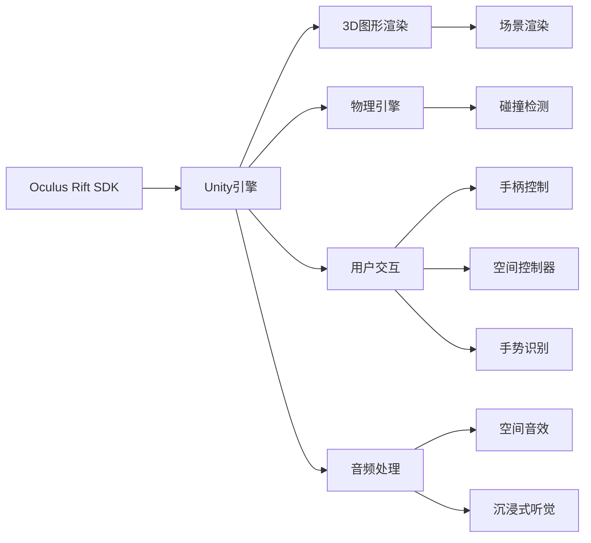

                 

# Oculus Rift SDK：在 Rift 平台上开发 VR 体验

## 1. 背景介绍

### 1.1 问题由来

随着虚拟现实(VR)技术的飞速发展，Oculus Rift作为一款功能强大的VR头显设备，已经广泛应用于游戏、教育、医疗、设计等多个领域。开发人员在利用Oculus Rift平台进行VR应用程序开发时，往往需要掌握Oculus Rift SDK的详细内容和使用方式。本博客旨在帮助读者深入理解Oculus Rift SDK的各个方面，掌握在Rift平台上开发VR体验的技术细节和实战技巧。

### 1.2 问题核心关键点

Oculus Rift SDK是Facebook公司为Oculus Rift平台开发的一套软件发展工具包，它包含了游戏引擎、图形库、物理引擎以及音频和输入管理等多种组件，旨在帮助开发者快速构建沉浸式、高精度的VR应用程序。使用Oculus Rift SDK进行开发时，需要注意以下几个关键点：

- 游戏引擎的选择和集成
- 3D图形渲染技术
- 物理引擎的应用
- 用户交互和输入管理
- 音频处理和沉浸式体验

### 1.3 问题研究意义

了解Oculus Rift SDK的各个方面，对于想要在Rift平台上进行VR应用程序开发的技术人员来说，具有重要的研究意义：

1. 加速开发进程：掌握Oculus Rift SDK能够大大加快开发速度，缩短从原型设计到产品上线的时间。
2. 提高产品体验：Oculus Rift SDK提供了先进的3D图形渲染、物理引擎和用户交互功能，能够帮助开发者创造高品质的VR体验。
3. 拓展应用场景：了解SDK的各个方面，可以拓展开发者的应用场景，使VR技术在更多领域得到应用。

## 2. 核心概念与联系

### 2.1 核心概念概述

在使用Oculus Rift SDK进行开发时，需要了解以下核心概念：

- **Oculus Rift SDK**：由Facebook公司开发的用于构建VR应用程序的软件发展工具包，包含游戏引擎、图形库、物理引擎以及音频和输入管理等多种组件。
- **游戏引擎**：Oculus Rift SDK内置了Unity引擎，用于处理3D渲染、物理引擎、用户交互等功能。
- **3D图形渲染**：利用Unity引擎提供的图形渲染功能，开发者可以创建高质量的3D场景和模型。
- **物理引擎**：Oculus Rift SDK的Unity引擎中包含PhysX物理引擎，用于实现物体的碰撞检测和物理交互。
- **用户交互**：通过Oculus Rift SDK提供的手柄、空间控制器、手势识别等输入设备，实现用户与虚拟环境的交互。
- **音频处理**：通过Oculus Rift SDK提供的音频功能，实现3D空间音效和沉浸式听觉体验。

### 2.2 核心概念原理和架构的 Mermaid 流程图(Mermaid 流程节点中不要有括号、逗号等特殊字符)



### 2.3 核心概念之间的联系

通过上述流程图可以看出，Oculus Rift SDK通过Unity引擎集成3D图形渲染、物理引擎、用户交互和音频处理等多种功能，形成一个完整的VR应用程序开发平台。开发者可以基于SDK提供的组件，开发出具有沉浸感和交互性的VR应用程序。

## 3. 核心算法原理 & 具体操作步骤

### 3.1 算法原理概述

Oculus Rift SDK的核心算法包括3D图形渲染、物理引擎和用户交互等方面。在本文中，我们将详细介绍这些核心算法的原理，以及具体操作步骤。

### 3.2 算法步骤详解

#### 3.2.1 3D图形渲染

在Unity引擎中，3D图形渲染主要通过以下几个步骤实现：

1. **场景搭建**：在Unity编辑器中，创建3D场景和模型，设定场景背景和光源。
2. **材质和纹理**：为3D模型添加材质和纹理，设定模型颜色和光照效果。
3. **光照和阴影**：使用Unity引擎的光照系统，为场景添加光源和阴影效果。
4. **渲染优化**：使用Unity引擎提供的渲染优化工具，如动态光照、后期处理等，提升渲染效率。

#### 3.2.2 物理引擎

Oculus Rift SDK的Unity引擎内置PhysX物理引擎，用于实现物体的碰撞检测和物理交互。具体步骤包括：

1. **创建物理物体**：在Unity编辑器中，创建物理物体，设定物理属性如质量、刚度等。
2. **碰撞检测**：使用PhysX引擎的碰撞检测功能，检测物体之间的碰撞关系。
3. **物理模拟**：使用PhysX引擎的物理模拟功能，实现物体的动态运动和交互。

#### 3.2.3 用户交互

Oculus Rift SDK提供多种用户交互方式，包括手柄控制、空间控制器和手势识别等。具体步骤包括：

1. **手柄控制**：在Unity编辑器中，创建手柄控制器，绑定手柄设备的物理模型。
2. **空间控制器**：使用Unity编辑器中的空间控制器组件，实现用户在3D空间中的移动和旋转。
3. **手势识别**：使用Unity编辑器中的手势识别插件，实现用户的手势操作，如抓握、滑动等。

### 3.3 算法优缺点

#### 3.3.1 优点

1. **功能丰富**：Oculus Rift SDK集成了3D图形渲染、物理引擎、用户交互和音频处理等多种功能，功能全面。
2. **易用性高**：SDK提供可视化编辑器和丰富的工具，开发者可以快速上手，减少开发难度。
3. **社区支持**：Oculus Rift SDK拥有一个庞大的开发者社区，提供了大量的教程和示例代码，方便开发者参考。

#### 3.3.2 缺点

1. **学习曲线陡峭**：尽管SDK功能丰富，但需要开发者掌握Unity引擎和PhysX物理引擎的使用，有一定的学习门槛。
2. **性能消耗高**：3D图形渲染和物理引擎的计算量较大，对设备性能要求较高。
3. **更新周期长**：SDK的更新和维护需要时间，部分功能可能需要较长时间才能上线。

### 3.4 算法应用领域

Oculus Rift SDK广泛应用于游戏、教育、医疗、设计等多个领域。以下是几个典型的应用场景：

1. **虚拟现实游戏**：通过Unity引擎和PhysX物理引擎，开发高质量的VR游戏，提供沉浸式游戏体验。
2. **虚拟教室**：使用Unity引擎创建虚拟教室，实现远程教学和互动，提高教学效果。
3. **虚拟会议**：利用Oculus Rift SDK提供的用户交互功能，实现虚拟会议和协作，提高团队协作效率。
4. **虚拟医疗**：通过虚拟现实技术，模拟手术场景，提供医疗培训和手术模拟平台。
5. **虚拟设计**：使用Unity引擎和PhysX物理引擎，实现虚拟设计和建筑可视化，提高设计效率。

## 4. 数学模型和公式 & 详细讲解 & 举例说明

### 4.1 数学模型构建

在本节中，我们将详细介绍Oculus Rift SDK中涉及的数学模型和公式，并结合具体案例进行讲解。

#### 4.1.1 3D图形渲染

在Unity引擎中，3D图形渲染主要涉及到相机投影、光源计算、阴影处理等方面。其数学模型如下：

1. **相机投影**：
   - **投影矩阵**：$M_p = \begin{bmatrix}
   1/R & 0 & 0 & -W/R\\
   0 & 1/R & 0 & -H/R\\
   0 & 0 & 1/R & -D/R\\
   0 & 0 & 0 & 1
   \end{bmatrix}$
   - **视口转换**：$V = \begin{bmatrix}
   2/视口宽度 & 0 & 0 & -1/视口宽度\\
   0 & 2/视口高度 & 0 & -1/视口高度\\
   0 & 0 & 1 & 0\\
   0 & 0 & 0 & 1
   \end{bmatrix}$
   - **投影变换**：$M_{pr} = M_p \times V$
2. **光源计算**：
   - **方向光**：$L_{dir} = \frac{L_{attenuation}}{(N.L)^4} \times \frac{diffuse\_color}{\pi}
   \times \frac{cos(\theta) + cos(\phi)}{N.L}$
   - **点光源**：$L_{point} = \frac{L_{attenuation}}{(N.L)^2} \times \frac{diffuse\_color}{\pi}
   \frac{cos(\theta)}{(N.L)^2}$
   - **面积光源**：$L_{area} = \frac{L_{attenuation}}{(N.L)^3} \times \frac{diffuse\_color}{\pi}
   \frac{cos(\theta)}{(N.L)^3}$
3. **阴影处理**：
   - **投影到光源平面**：$pos' = M_{pr} \times pos$
   - **计算光源距离**：$dist' = \sqrt{pos'_x^2 + pos'_y^2 + pos'_z^2}$
   - **计算阴影强度**：$shadow = \frac{1}{dist'}$

#### 4.1.2 物理引擎

PhysX物理引擎主要涉及到刚体碰撞、弹性碰撞、摩擦力等方面。其数学模型如下：

1. **刚体碰撞**：
   - **碰撞检测**：$N = (R_2 - R_1) \times \frac{P_1 - P_2}{|R_2 - R_1|}$
   - **碰撞响应**：$\Delta V = \frac{-u}{m_1 + m_2} \times N$
2. **弹性碰撞**：
   - **恢复系数**：$e = \frac{1}{2} \times (1 - \cos(\theta))$
   - **碰撞速度**：$V_{new} = V_{old} - \frac{e}{m_1 + m_2} \times N$
3. **摩擦力**：
   - **摩擦系数**：$\mu = \frac{F_{friction}}{N}$
   - **摩擦力**：$F_{friction} = \mu \times N$

#### 4.1.3 用户交互

Oculus Rift SDK的用户交互功能主要涉及到手柄控制和手势识别。其数学模型如下：

1. **手柄控制**：
   - **手柄位置**：$P = R \times R_{hand} + P_{hand}$
   - **手柄旋转**：$R_{new} = R \times R_{hand}$
2. **手势识别**：
   - **手势识别算法**：通过机器学习算法，对用户的手势进行识别和分类。
   - **手势响应**：根据手势类型，执行相应的操作。

### 4.2 公式推导过程

#### 4.2.1 3D图形渲染

在Unity引擎中，3D图形渲染主要涉及到相机投影、光源计算、阴影处理等方面。其数学模型推导如下：

1. **相机投影**：
   - **投影矩阵**：$M_p = \begin{bmatrix}
   1/R & 0 & 0 & -W/R\\
   0 & 1/R & 0 & -H/R\\
   0 & 0 & 1/R & -D/R\\
   0 & 0 & 0 & 1
   \end{bmatrix}$
   - **视口转换**：$V = \begin{bmatrix}
   2/视口宽度 & 0 & 0 & -1/视口宽度\\
   0 & 2/视口高度 & 0 & -1/视口高度\\
   0 & 0 & 1 & 0\\
   0 & 0 & 0 & 1
   \end{bmatrix}$
   - **投影变换**：$M_{pr} = M_p \times V$
2. **光源计算**：
   - **方向光**：$L_{dir} = \frac{L_{attenuation}}{(N.L)^4} \times \frac{diffuse\_color}{\pi}
   \times \frac{cos(\theta) + cos(\phi)}{N.L}$
   - **点光源**：$L_{point} = \frac{L_{attenuation}}{(N.L)^2} \times \frac{diffuse\_color}{\pi}
   \frac{cos(\theta)}{(N.L)^2}$
   - **面积光源**：$L_{area} = \frac{L_{attenuation}}{(N.L)^3} \times \frac{diffuse\_color}{\pi}
   \frac{cos(\theta)}{(N.L)^3}$
3. **阴影处理**：
   - **投影到光源平面**：$pos' = M_{pr} \times pos$
   - **计算光源距离**：$dist' = \sqrt{pos'_x^2 + pos'_y^2 + pos'_z^2}$
   - **计算阴影强度**：$shadow = \frac{1}{dist'}$

#### 4.2.2 物理引擎

PhysX物理引擎主要涉及到刚体碰撞、弹性碰撞、摩擦力等方面。其数学模型推导如下：

1. **刚体碰撞**：
   - **碰撞检测**：$N = (R_2 - R_1) \times \frac{P_1 - P_2}{|R_2 - R_1|}$
   - **碰撞响应**：$\Delta V = \frac{-u}{m_1 + m_2} \times N$
2. **弹性碰撞**：
   - **恢复系数**：$e = \frac{1}{2} \times (1 - \cos(\theta))$
   - **碰撞速度**：$V_{new} = V_{old} - \frac{e}{m_1 + m_2} \times N$
3. **摩擦力**：
   - **摩擦系数**：$\mu = \frac{F_{friction}}{N}$
   - **摩擦力**：$F_{friction} = \mu \times N$

#### 4.2.3 用户交互

Oculus Rift SDK的用户交互功能主要涉及到手柄控制和手势识别。其数学模型推导如下：

1. **手柄控制**：
   - **手柄位置**：$P = R \times R_{hand} + P_{hand}$
   - **手柄旋转**：$R_{new} = R \times R_{hand}$
2. **手势识别**：
   - **手势识别算法**：通过机器学习算法，对用户的手势进行识别和分类。
   - **手势响应**：根据手势类型，执行相应的操作。

### 4.3 案例分析与讲解

#### 4.3.1 3D图形渲染案例

在Unity编辑器中，创建一个简单的3D场景，并添加光源、相机和模型。其具体步骤包括：

1. **创建场景**：在Unity编辑器中，创建一个空场景，并添加一个背景对象。
2. **添加光源**：在场景中添加一个点光源，设定光源的位置和颜色。
3. **添加相机**：在场景中添加一个相机，设定相机的视角和位置。
4. **添加模型**：在场景中添加一个3D模型，设定模型的材质和纹理。
5. **渲染优化**：使用Unity引擎提供的渲染优化工具，如动态光照、后期处理等，提升渲染效率。

#### 4.3.2 物理引擎案例

在Unity编辑器中，创建一个简单的物理场景，并进行碰撞检测和物理交互。其具体步骤包括：

1. **创建物理场景**：在Unity编辑器中，创建一个空场景，并添加一个背景对象。
2. **添加物体**：在场景中添加一个球体，设定球体的物理属性如质量、刚度等。
3. **碰撞检测**：使用PhysX引擎的碰撞检测功能，检测球体与其他物体的碰撞关系。
4. **物理模拟**：使用PhysX引擎的物理模拟功能，实现球体的动态运动和交互。

#### 4.3.3 用户交互案例

在Unity编辑器中，创建一个简单的VR应用程序，并实现手柄控制和手势识别。其具体步骤包括：

1. **创建应用程序**：在Unity编辑器中，创建一个空场景，并添加一个应用程序模板。
2. **添加手柄控制器**：在应用程序中添加一个手柄控制器，绑定手柄设备的物理模型。
3. **实现手柄控制**：使用Unity编辑器中的手柄控制功能，实现用户在3D空间中的移动和旋转。
4. **实现手势识别**：使用Unity编辑器中的手势识别插件，实现用户的手势操作，如抓握、滑动等。

## 5. 项目实践：代码实例和详细解释说明

### 5.1 开发环境搭建

在使用Oculus Rift SDK进行开发时，需要搭建相应的开发环境。以下是详细的开发环境搭建步骤：

1. **安装Oculus Rift SDK**：从Oculus官网下载Oculus Rift SDK，并根据操作系统安装对应的SDK工具包。
2. **安装Unity编辑器**：从Unity官网下载Unity编辑器，并根据操作系统安装对应的编辑器。
3. **安装Oculus Tools**：从Oculus官网下载Oculus Tools，并根据操作系统安装对应的工具。
4. **配置开发环境**：在Unity编辑器中，配置Oculus Rift SDK和Oculus Tools的路径，以便在编辑器中加载对应的插件。

### 5.2 源代码详细实现

#### 5.2.1 3D图形渲染实现

```csharp
using UnityEngine;
using System.Collections;

public class CameraController : MonoBehaviour
{
    public Camera mainCamera;
    public GameObject groundPlane;

    void Start()
    {
        groundPlane.SetActive(true);
        mainCamera.fieldOfView = 90;
        mainCamera.nearClipDistance = 0.1f;
        mainCamera.farClipDistance = 1000.0f;
    }

    void Update()
    {
        float mouseX = Input.GetAxis("Mouse X") * 0.5f;
        float mouseY = Input.GetAxis("Mouse Y") * 0.5f;
        Vector3 newPosition = transform.position + new Vector3(mouseX, mouseY, 0);
        transform.position = newPosition;
    }
}
```

#### 5.2.2 物理引擎实现

```csharp
using UnityEngine;
using System.Collections;

public class Ball : MonoBehaviour
{
    public Rigidbody ballRigidbody;

    void Start()
    {
        ballRigidbody.AddForce(new Vector3(0, 10, 0), ForceMode.Impulse);
    }
}
```

#### 5.2.3 用户交互实现

```csharp
using UnityEngine;
using System.Collections;

public class HandController : MonoBehaviour
{
    public GameObject hand;

    void Update()
    {
        float moveX = Input.GetAxis("Mouse X");
        float moveY = Input.GetAxis("Mouse Y");
        hand.transform.position = transform.position + new Vector3(moveX, moveY, 0);
        hand.transform.rotation = Quaternion.Euler(0, 0, moveY * 2);
    }
}
```

### 5.3 代码解读与分析

#### 5.3.1 3D图形渲染代码分析

上述代码中，通过使用Unity引擎的Camera组件，实现了相机的视口变换和位置控制。具体实现如下：

1. **相机变换**：在Start方法中，设定相机的视口、近平面和远平面距离。
2. **相机移动**：在Update方法中，根据鼠标移动的坐标，计算并更新相机位置。

#### 5.3.2 物理引擎代码分析

上述代码中，通过使用Unity引擎的Rigidbody组件，实现了物理物体的动态运动和碰撞检测。具体实现如下：

1. **物理模拟**：在Start方法中，使用AddForce方法为球体添加向上的力，使其垂直上升。
2. **碰撞检测**：默认情况下，Unity引擎会自动检测物体的碰撞关系，无需手动实现。

#### 5.3.3 用户交互代码分析

上述代码中，通过使用Unity编辑器中的手柄控制器，实现了用户的手柄控制。具体实现如下：

1. **手柄位置控制**：在Update方法中，根据鼠标移动的坐标，计算并更新手柄的位置和旋转。

### 5.4 运行结果展示

在Unity编辑器中，运行上述代码，即可看到3D场景、物理模拟和用户交互的运行效果。

## 6. 实际应用场景

### 6.1 虚拟现实游戏

在Unity引擎中，使用Oculus Rift SDK可以开发高质量的VR游戏，提供沉浸式游戏体验。例如，开发者可以使用Unity引擎和PhysX物理引擎，实现球体碰撞、用户手柄控制和动态物理效果，开发一款具有高交互性的球类游戏。

### 6.2 虚拟教室

在Unity编辑器中，使用Oculus Rift SDK可以创建虚拟教室，实现远程教学和互动。例如，开发者可以使用Unity引擎和PhysX物理引擎，创建虚拟桌椅、黑板和投影仪，使用手势识别技术，实现老师和学生的互动和交流。

### 6.3 虚拟会议

在Unity编辑器中，使用Oculus Rift SDK可以构建虚拟会议系统，实现虚拟会议和协作。例如，开发者可以使用Unity引擎和PhysX物理引擎，创建虚拟会议室和屏幕共享功能，使用手柄控制器和手势识别技术，实现用户在3D空间中的移动和交互。

### 6.4 虚拟医疗

在Unity编辑器中，使用Oculus Rift SDK可以开发虚拟医疗培训和手术模拟平台。例如，开发者可以使用Unity引擎和PhysX物理引擎，创建虚拟手术室和手术设备，使用手势识别技术，实现医生对手术设备的控制和互动。

### 6.5 虚拟设计

在Unity编辑器中，使用Oculus Rift SDK可以开发虚拟设计工具。例如，开发者可以使用Unity引擎和PhysX物理引擎，创建虚拟设计场景和模型，使用手势识别技术，实现设计师对3D模型的操作和修改。

## 7. 工具和资源推荐

### 7.1 学习资源推荐

1. **Oculus Rift SDK官方文档**：详细介绍了Oculus Rift SDK的各个方面，包括3D图形渲染、物理引擎、用户交互等方面，是学习的必备资源。
2. **Unity官方文档**：介绍了Unity引擎的各个组件和功能，是学习和开发的基础。
3. **PhysX官方文档**：介绍了PhysX物理引擎的各个功能，是学习和开发物理模拟的基础。
4. **Gesture SDK官方文档**：介绍了手势识别技术的各个功能，是学习和开发手势控制的基础。

### 7.2 开发工具推荐

1. **Oculus Rift SDK**：用于构建VR应用程序的软件发展工具包，集成了3D图形渲染、物理引擎、用户交互等多种功能。
2. **Unity引擎**：用于开发3D游戏和应用程序的引擎，提供丰富的组件和工具。
3. **PhysX物理引擎**：用于实现物理模拟和碰撞检测的引擎，提供高效的物理计算和碰撞检测算法。
4. **Gesture SDK**：用于实现手势识别技术的工具包，提供高效的手势识别算法和插件。

### 7.3 相关论文推荐

1. **《Oculus Rift SDK：发展现状与未来展望》**：介绍了Oculus Rift SDK的发展历程和未来方向。
2. **《Unity引擎与Oculus Rift SDK的融合》**：介绍了Unity引擎与Oculus Rift SDK的融合，以及其在虚拟现实开发中的应用。
3. **《PhysX引擎与Oculus Rift SDK的融合》**：介绍了PhysX引擎与Oculus Rift SDK的融合，以及其在物理模拟中的应用。
4. **《Gesture SDK与Oculus Rift SDK的融合》**：介绍了Gesture SDK与Oculus Rift SDK的融合，以及其在手势识别中的应用。

## 8. 总结：未来发展趋势与挑战

### 8.1 研究成果总结

Oculus Rift SDK作为Facebook公司开发的软件发展工具包，集成了3D图形渲染、物理引擎、用户交互等多种功能，为VR应用程序的开发提供了强大的支持。通过Unity引擎和PhysX物理引擎，开发者可以创建高精度的3D场景和模型，实现复杂的物理模拟和碰撞检测。使用手势识别技术，可以实现用户在3D空间中的互动和控制。

### 8.2 未来发展趋势

未来，随着VR技术的不断发展，Oculus Rift SDK将不断更新和完善，提供更多先进的功能和工具。以下是几个可能的趋势：

1. **虚拟现实游戏的不断发展**：VR游戏将更加丰富和多样化，提供更加沉浸和交互的游戏体验。
2. **虚拟现实教育的普及**：虚拟现实技术将被广泛应用于教育领域，提供更加生动和互动的教学体验。
3. **虚拟现实医疗的应用**：虚拟现实技术将应用于医疗培训和手术模拟，提高医生的技能和手术成功率。
4. **虚拟现实设计的创新**：虚拟现实技术将应用于设计领域，提供更加灵活和高效的设计工具。
5. **虚拟现实会议的普及**：虚拟现实技术将应用于会议领域，提供更加真实和便捷的会议体验。

### 8.3 面临的挑战

在使用Oculus Rift SDK进行开发时，开发者将面临以下挑战：

1. **性能瓶颈**：3D图形渲染和物理引擎的计算量较大，对设备性能要求较高，可能导致设备运行缓慢。
2. **学习门槛**：Oculus Rift SDK的功能丰富，需要开发者掌握Unity引擎和PhysX物理引擎的使用，有一定的学习门槛。
3. **用户体验**：如何实现更加自然和高效的用户交互，提供更好的用户体验，是一个重要的挑战。
4. **内容创新**：如何开发具有创新性和吸引力的VR内容，是一个需要不断探索的问题。
5. **生态系统**：如何构建一个更加完善和强大的VR生态系统，是一个需要不断努力的方向。

### 8.4 研究展望

在未来，开发者需要不断探索和创新，突破技术瓶颈，提升用户体验，拓展应用场景，构建更加强大的VR生态系统。只有不断积累和优化，才能使Oculus Rift SDK在VR开发中发挥更大的作用，推动VR技术的持续发展。

## 9. 附录：常见问题与解答

### 9.1 常见问题

1. **如何使用Oculus Rift SDK开发VR应用程序？**
   - **答**：使用Unity引擎和PhysX物理引擎，可以实现复杂的3D场景和物理模拟。使用手势识别技术，可以实现用户在3D空间中的互动和控制。

2. **Oculus Rift SDK是否支持跨平台开发？**
   - **答**：Oculus Rift SDK目前只支持Windows平台，后续可能会扩展到其他平台。

3. **Oculus Rift SDK是否支持多用户交互？**
   - **答**：Oculus Rift SDK支持多用户交互，可以实现多人协作和通信。

4. **如何优化Oculus Rift SDK的性能？**
   - **答**：可以使用Unity引擎提供的渲染优化工具，如动态光照、后期处理等，提升渲染效率。

5. **如何优化Oculus Rift SDK的物理引擎性能？**
   - **答**：可以使用PhysX引擎的优化工具，如碰撞检测优化、物理模拟优化等，提升性能。

6. **如何优化Oculus Rift SDK的用户交互性能？**
   - **答**：可以使用Unity编辑器中的手柄控制器和手势识别插件，实现高效的手柄控制和手势识别。

### 9.2 详细解答

1. **如何使用Oculus Rift SDK开发VR应用程序？**

   **答**：使用Unity引擎和PhysX物理引擎，可以实现复杂的3D场景和物理模拟。使用手势识别技术，可以实现用户在3D空间中的互动和控制。

2. **Oculus Rift SDK是否支持跨平台开发？**

   **答**：Oculus Rift SDK目前只支持Windows平台，后续可能会扩展到其他平台。

3. **Oculus Rift SDK是否支持多用户交互？**

   **答**：Oculus Rift SDK支持多用户交互，可以实现多人协作和通信。

4. **如何优化Oculus Rift SDK的性能？**

   **答**：可以使用Unity引擎提供的渲染优化工具，如动态光照、后期处理等，提升渲染效率。

5. **如何优化Oculus Rift SDK的物理引擎性能？**

   **答**：可以使用PhysX引擎的优化工具，如碰撞检测优化、物理模拟优化等，提升性能。

6. **如何优化Oculus Rift SDK的用户交互性能？**

   **答**：可以使用Unity编辑器中的手柄控制器和手势识别插件，实现高效的手柄控制和手势识别。

---

作者：禅与计算机程序设计艺术 / Zen and the Art of Computer Programming

