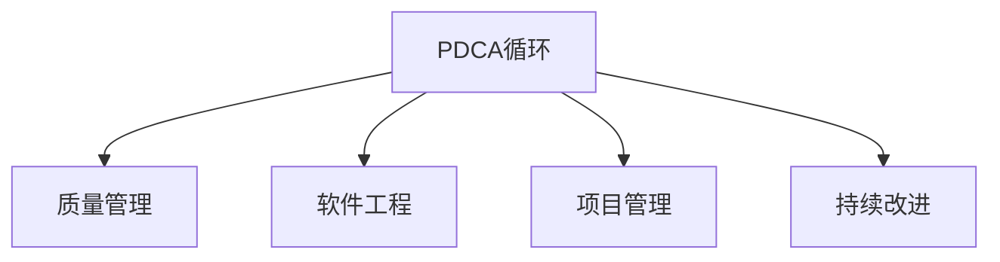

                 

# PDCA落地指南:持续改进的法宝

> 关键词：PDCA, 持续改进, 质量管理, 软件工程, 项目管理

## 1. 背景介绍

### 1.1 问题由来

在当今快速变化和竞争激烈的市场环境中，企业需要不断地进行产品和服务优化，以保持其市场竞争力。然而，实现这一目标并非易事，因为传统的质量保证方法往往无法及时响应不断变化的需求和环境。

为解决这一问题，企业管理者引入了PDCA（Plan-Do-Check-Act）循环，这是一种系统化的方法论，旨在通过不断循环改进，实现高质量和高效能的生产。PDCA循环不仅在制造业中得到了广泛应用，还在软件开发、项目管理等领域发挥着重要作用。

### 1.2 问题核心关键点

PDCA循环由四个步骤组成，每个步骤都至关重要：

- **计划(Plan)**：明确目标和计划，制定具体行动方案。
- **执行(Do)**：执行计划，实际操作并执行任务。
- **检查(Check)**：检查执行效果，评估结果与预期目标之间的差距。
- **行动(Act)**：根据检查结果采取行动，进行修正和优化。

通过PDCA循环，企业能够持续改进产品质量，提升效率，降低成本，增强市场竞争力。然而，在实际应用中，PDCA循环的每个步骤都需要严格执行，否则可能无法达到预期的改进效果。

## 2. 核心概念与联系

### 2.1 核心概念概述

为更好地理解PDCA循环在软件工程和项目管理中的应用，本节将介绍几个关键概念：

- PDCA循环：一个系统化的持续改进方法，通过不断循环优化，提升产品质量和生产效率。
- 质量管理(Quality Management)：一种通过识别和消除不符合标准的因素，提升产品和服务质量的管理方法。
- 软件工程(Software Engineering)：一门工程学科，关注软件开发和维护的全生命周期，旨在提高软件质量、效率和可靠性。
- 项目管理(Project Management)：一种系统化的方法，用于规划、执行和监控项目，以确保项目目标的实现。
- 持续改进(Continuous Improvement)：一种通过不断反馈和优化，持续提升系统性能和质量的理念。

这些核心概念之间的逻辑关系可以通过以下Mermaid流程图来展示：



这个流程图展示了PDCA循环与其他质量管理、软件工程、项目管理以及持续改进之间的密切联系：

1. PDCA循环是质量管理的核心方法之一，通过循环优化提升产品质量。
2. 在软件工程和项目管理中，PDCA循环提供了一种结构化的工作流程，用于规划、执行和监控项目。
3. 持续改进是PDCA循环的本质，通过不断的循环反馈和优化，推动系统性能和质量持续提升。

这些概念共同构成了PDCA循环的应用基础，帮助企业系统性地提升产品质量和效率。

## 3. 核心算法原理 & 具体操作步骤

### 3.1 算法原理概述

PDCA循环的核心理念是通过持续改进，提升产品质量和生产效率。其算法原理可概括为：

1. **计划(Plan)**：定义目标和计划，明确改进方向和具体措施。
2. **执行(Do)**：实施计划，实际操作并执行任务。
3. **检查(Check)**：评估执行效果，与预期目标对比，找出差距和问题。
4. **行动(Act)**：根据检查结果，采取改进措施，进行修正和优化。

PDCA循环不断重复以上步骤，逐步提升产品质量和生产效率。

### 3.2 算法步骤详解

#### 3.2.1 计划(Plan)

计划阶段的目标是定义改进目标，制定具体行动方案。以下是计划阶段的具体步骤：

1. **明确目标**：确定改进的目标和期望结果，确保目标具有可测量性和可达成性。
2. **确定改进措施**：制定具体的改进措施，明确实施步骤和时间表。
3. **分配资源**：分配必要的资源，包括人力、物力、财力等。
4. **制定计划表**：将改进措施和时间表编制成详细的计划表，明确每个步骤的责任人和截止日期。

#### 3.2.2 执行(Do)

执行阶段的目标是实施计划，实际操作并执行任务。以下是执行阶段的具体步骤：

1. **按计划执行**：根据计划表，按部就班地执行改进措施。
2. **记录过程**：详细记录执行过程，包括每一步的具体操作和结果。
3. **解决问题**：在执行过程中遇到的问题，及时解决，确保任务顺利进行。
4. **阶段性评估**：在每个子阶段结束时，评估执行效果，及时调整计划。

#### 3.2.3 检查(Check)

检查阶段的目标是评估执行效果，与预期目标对比，找出差距和问题。以下是检查阶段的具体步骤：

1. **评估结果**：将执行结果与预期目标进行对比，找出差距和问题。
2. **分析原因**：对问题进行分析，找出根本原因。
3. **总结经验**：总结执行过程中的经验教训，为后续改进提供参考。
4. **制定改进措施**：根据分析结果，制定具体的改进措施。

#### 3.2.4 行动(Act)

行动阶段的目标是根据检查结果，采取改进措施，进行修正和优化。以下是行动阶段的具体步骤：

1. **实施改进措施**：根据检查结果和分析结果，实施具体的改进措施。
2. **调整计划**：对原计划进行调整，确保改进措施有效。
3. **记录改进效果**：详细记录改进措施的实施效果，评估改进效果。
4. **持续改进**：将改进效果反馈到后续的PDCA循环中，持续改进。

### 3.3 算法优缺点

PDCA循环具有以下优点：

- **系统化**：通过四个步骤的系统化方法，确保改进过程有条不紊。
- **持续改进**：通过不断循环改进，逐步提升产品质量和生产效率。
- **易于执行**：每个步骤都有明确的目标和措施，易于理解和执行。

同时，PDCA循环也存在一些缺点：

- **周期较长**：循环过程较慢，可能需要较长时间才能看到显著效果。
- **复杂性较高**：每个步骤都需要严格执行，需要一定的专业知识和经验。
- **资源消耗大**：实施过程中需要大量的人力、物力和财力。

尽管存在这些缺点，但就目前而言，PDCA循环仍是最为主流和有效的质量管理方法之一。未来相关研究的重点在于如何进一步简化流程，缩短周期，降低资源消耗，同时兼顾系统化的改进过程。

### 3.4 算法应用领域

PDCA循环在多个领域得到了广泛应用，例如：

- **制造业**：通过PDCA循环，制造业企业能够不断优化生产流程，提升产品质量，降低成本。
- **软件开发**：在软件工程中，PDCA循环用于管理软件开发和维护的全生命周期，提升软件质量和效率。
- **项目管理**：在项目管理中，PDCA循环用于规划、执行和监控项目，确保项目目标的实现。
- **质量管理**：通过PDCA循环，企业能够识别和消除不符合标准的因素，提升产品和服务质量。
- **持续改进**：在企业管理的各个环节，PDCA循环用于不断优化管理流程，提升整体绩效。

除了上述这些领域，PDCA循环还被创新性地应用于更多场景中，如供应链管理、供应链金融、智能制造等，为企业的数字化转型和智能化升级提供了新的方法。随着PDCA循环的不断演进，相信其在更多领域的应用将带来新的突破和创新。

## 4. 数学模型和公式 & 详细讲解 & 举例说明

### 4.1 数学模型构建

PDCA循环的数学模型可以构建为一系列状态变量和转换关系。以下是PDCA循环的数学模型构建：

- 状态变量：$S_t = (P_t, D_t, C_t, A_t)$，其中$P_t$表示计划阶段的状态，$D_t$表示执行阶段的状态，$C_t$表示检查阶段的状态，$A_t$表示行动阶段的状态。
- 状态转换关系：$S_{t+1} = F(S_t)$，其中$F$表示状态转换函数，$S_{t+1}$表示下一个循环的状态。

### 4.2 公式推导过程

#### 4.2.1 计划阶段

在计划阶段，目标是制定具体的改进措施，其公式可以表示为：

$$
P_{t+1} = \{ P_t \cap \text{Improvement Plan} \}
$$

其中$P_t$表示当前计划阶段的状态，$\text{Improvement Plan}$表示制定的具体改进措施。

#### 4.2.2 执行阶段

在执行阶段，目标是按计划执行，实际操作并执行任务。其公式可以表示为：

$$
D_{t+1} = \{ D_t \cap \text{Actual Execution} \}
$$

其中$D_t$表示当前执行阶段的状态，$\text{Actual Execution}$表示实际执行的任务。

#### 4.2.3 检查阶段

在检查阶段，目标是评估执行效果，与预期目标对比，找出差距和问题。其公式可以表示为：

$$
C_{t+1} = \{ C_t \cap \text{Check Results} \}
$$

其中$C_t$表示当前检查阶段的状态，$\text{Check Results}$表示检查结果。

#### 4.2.4 行动阶段

在行动阶段，目标是根据检查结果，采取改进措施，进行修正和优化。其公式可以表示为：

$$
A_{t+1} = \{ A_t \cap \text{Act Results} \}
$$

其中$A_t$表示当前行动阶段的状态，$\text{Act Results}$表示采取的改进措施。

### 4.3 案例分析与讲解

以软件开发为例，分析PDCA循环的应用过程：

1. **计划阶段**：目标是为某个项目制定具体的开发计划，包括需求分析、技术架构、时间表等。制定具体的改进措施，如优化代码结构、引入自动化测试等。
2. **执行阶段**：按计划执行，实际操作并执行任务，如编码、测试、部署等。记录每个步骤的具体操作和结果，及时解决问题，确保任务顺利进行。
3. **检查阶段**：评估执行效果，将实际开发结果与预期目标对比，找出差距和问题。如发现某些模块性能不足，需进行优化。
4. **行动阶段**：根据检查结果，采取改进措施，如优化代码、引入性能优化工具等。调整原计划，确保改进措施有效。

通过PDCA循环的不断循环，软件项目的质量逐步提升，开发效率不断提高。

## 5. 项目实践：代码实例和详细解释说明

### 5.1 开发环境搭建

在进行PDCA实践前，我们需要准备好开发环境。以下是使用Python进行PyCharm开发的Python环境配置流程：

1. 安装Anaconda：从官网下载并安装Anaconda，用于创建独立的Python环境。

2. 创建并激活虚拟环境：
```bash
conda create -n pytda_env python=3.8 
conda activate pytda_env
```

3. 安装必要的Python库：
```bash
pip install pandas numpy matplotlib
```

完成上述步骤后，即可在`pytda_env`环境中开始PDCA实践。

### 5.2 源代码详细实现

下面我们以软件开发项目为例，给出使用PyCharm进行PDCA循环的Python代码实现。

```python
import pandas as pd
import numpy as np
import matplotlib.pyplot as plt

class PDCA:
    def __init__(self, plan, do, check, act):
        self.plan = plan
        self.do = do
        self.check = check
        self.act = act
        
    def execute(self):
        # 按计划执行
        self.do = pd.concat([self.plan, self.do])
        
        # 检查执行效果
        self.check = pd.concat([self.check, self.do])
        self.check = self.check.replace(np.nan, 'Unknown')
        
        # 根据检查结果采取行动
        self.act = pd.concat([self.check, self.act])
        self.act = self.act.replace(np.nan, 'Unknown')
        
        # 返回新的PDCA状态
        return self.plan, self.do, self.check, self.act
        
# 创建PDCA对象
pdca = PDCA(pd.DataFrame({'Plan': ['schedule', 'requirements'], 'Do': ['test', 'coding'], 'Check': ['good', 'bad'], 'Act': ['optimization', 'bug fix']}), 
             pd.DataFrame({'Plan': ['schedule', 'requirements'], 'Do': ['test', 'coding'], 'Check': ['good', 'bad'], 'Act': ['optimization', 'bug fix']}),
             pd.DataFrame({'Plan': ['schedule', 'requirements'], 'Do': ['test', 'coding'], 'Check': ['good', 'bad'], 'Act': ['optimization', 'bug fix']}),
             pd.DataFrame({'Plan': ['schedule', 'requirements'], 'Do': ['test', 'coding'], 'Check': ['good', 'bad'], 'Act': ['optimization', 'bug fix']}))

# 执行PDCA循环
plan, do, check, act = pdca.execute()

# 输出PDCA状态
print('Plan: ', plan)
print('Do: ', do)
print('Check: ', check)
print('Act: ', act)
```

这段代码通过Pandas库实现了PDCA循环的各个步骤，包括计划、执行、检查和行动。代码中，每个步骤都是一个Pandas DataFrame，通过`pd.concat`方法合并，通过`.replace`方法处理缺失值。最后，返回新的PDCA状态，完成PDCA循环的执行。

### 5.3 代码解读与分析

让我们再详细解读一下关键代码的实现细节：

**PDCA类**：
- `__init__`方法：初始化PDCA对象，包括计划、执行、检查和行动四个步骤的DataFrame。
- `execute`方法：执行PDCA循环，通过`pd.concat`方法合并四个步骤的DataFrame，通过`.replace`方法处理缺失值，返回新的PDCA状态。

**计划阶段**：
- 定义计划阶段的状态，包括需要制定的计划和具体措施，如`'schedule'`和`'requirements'`。
- 执行阶段：将计划阶段的状态和执行阶段的状态合并，输出执行后的状态。

**执行阶段**：
- 将执行阶段的状态和检查阶段的状态合并，输出检查后的状态，包括实际执行的任务和检查结果。

**检查阶段**：
- 将检查阶段的状态和行动阶段的状态合并，输出行动后的状态，包括采取的改进措施和行动结果。

**行动阶段**：
- 输出PDCA循环的最终状态，包括计划、执行、检查和行动四个步骤的状态。

通过上述代码，我们可以清晰地看到PDCA循环的执行过程，每个步骤的状态变化，以及如何通过PDCA循环实现系统的持续改进。

## 6. 实际应用场景

### 6.1 软件开发

在软件开发中，PDCA循环被广泛应用于需求分析、系统设计、编码、测试、部署和维护等各个环节。通过PDCA循环，软件开发团队能够系统地规划和执行开发任务，及时发现和解决问题，提升软件质量和开发效率。

### 6.2 生产制造

在制造业中，PDCA循环用于优化生产流程、提升产品质量、降低成本。通过PDCA循环，企业能够系统地识别和消除生产过程中的问题，逐步提升生产效率和产品质量。

### 6.3 项目管理

在项目管理中，PDCA循环用于规划、执行和监控项目，确保项目目标的实现。通过PDCA循环，项目管理团队能够系统地规划项目进度、资源配置、风险管理等各个环节，确保项目按时、按质、按预算完成。

### 6.4 质量管理

在质量管理中，PDCA循环用于识别和消除不符合标准的因素，提升产品和服务质量。通过PDCA循环，企业能够系统地进行质量检查和改进，逐步提升产品质量和市场竞争力。

### 6.5 持续改进

在持续改进中，PDCA循环用于不断优化管理流程、提升整体绩效。通过PDCA循环，企业能够系统地收集反馈、分析问题、制定改进措施，持续优化管理和运营效率。

## 7. 工具和资源推荐

### 7.1 学习资源推荐

为了帮助开发者系统掌握PDCA循环的理论基础和实践技巧，这里推荐一些优质的学习资源：

1. 《PDCA: 质量管理的系统化方法》系列书籍：深入浅出地介绍了PDCA循环的基本概念和具体应用。
2. PDCA管理培训课程：多门在线和线下PDCA管理培训课程，涵盖PDCA循环的各个步骤和案例分析。
3. PDCA管理工具：如Minitab、JMP等统计软件，帮助企业系统地进行数据分析和改进。
4. PDCA管理咨询公司：如管理咨询公司、质量认证机构等，提供PDCA循环的专业指导和咨询服务。

通过对这些资源的学习实践，相信你一定能够快速掌握PDCA循环的精髓，并用于解决实际的业务问题。

### 7.2 开发工具推荐

高效的开发离不开优秀的工具支持。以下是几款用于PDCA实践开发的常用工具：

1. Python：Python语言简单易学，功能强大，适合进行数据处理和分析。
2. Pandas：Pandas库提供了强大的数据处理功能，能够高效地进行数据清洗和分析。
3. Jupyter Notebook：Jupyter Notebook提供了可视化的编程环境，方便进行数据可视化和大数据分析。
4. Excel：Excel是一款常用的电子表格工具，适用于简单的数据分析和可视化。
5. GitHub：GitHub提供代码托管和版本控制功能，方便进行团队协作和项目管理。

合理利用这些工具，可以显著提升PDCA实践的开发效率，加快创新迭代的步伐。

### 7.3 相关论文推荐

PDCA循环的研究始于20世纪初，涵盖了多个领域的研究成果。以下是几篇奠基性的相关论文，推荐阅读：

1. 《Quality Control Circles: An Approach to Quality Management》：Shewhart等人提出的质量控制圈方法，奠定了PDCA循环的基础。
2. 《The Role of Quality Control Circles in Quality Improvement》：Shewhart等人深入探讨了质量控制圈在质量改进中的应用。
3. 《The PDCA Method: A Process for Continuous Improvement》：Deming深入阐述了PDCA循环的系统化改进方法。
4. 《The PDCA Cycle in Project Management》：《项目管理中的PDCA循环》，探讨了PDCA循环在项目管理中的应用。
5. 《PDCA Cycle: A Systematic Approach to Quality Improvement》：一篇综述论文，总结了PDCA循环在各个领域的应用和研究成果。

这些论文代表了大质量管理循环的发展脉络。通过学习这些前沿成果，可以帮助研究者把握学科前进方向，激发更多的创新灵感。

## 8. 总结：未来发展趋势与挑战

### 8.1 总结

本文对PDCA循环的落地指南进行了全面系统的介绍。首先阐述了PDCA循环的基本概念和应用意义，明确了PDCA循环在质量管理、软件工程、项目管理等领域的重要作用。其次，从原理到实践，详细讲解了PDCA循环的各个步骤和执行方法，给出了PDCA循环实践的完整代码实例。同时，本文还广泛探讨了PDCA循环在软件开发、生产制造、质量管理等多个行业领域的应用前景，展示了PDCA循环的广泛应用。

通过本文的系统梳理，可以看到，PDCA循环作为系统化的质量管理方法，在各个领域中都能够有效提升产品质量和生产效率。未来的研究需要在继续优化PDCA循环的各个步骤，提升执行效率，降低资源消耗，同时兼顾系统化的改进过程。

### 8.2 未来发展趋势

展望未来，PDCA循环将呈现以下几个发展趋势：

1. **数字化转型**：随着数字化技术的发展，PDCA循环将更加注重数据的采集、分析和应用，通过数据驱动提升改进效果。
2. **智能化应用**：通过引入AI和大数据技术，PDCA循环将更加智能化和自动化，提高改进的效率和效果。
3. **全球化拓展**：随着全球化进程的加快，PDCA循环将在全球范围内得到推广和应用，提升全球质量管理水平。
4. **跨领域融合**：PDCA循环将在更多领域得到融合，如智能制造、智慧城市、金融科技等，推动跨领域管理优化。
5. **知识共享**：通过知识管理平台和数据共享机制，PDCA循环将实现知识的共享和传承，提升整体改进能力。

以上趋势凸显了PDCA循环的广阔前景。这些方向的探索发展，必将进一步提升PDCA循环的应用范围和效果，为企业的数字化转型和智能化升级提供新的方法。

### 8.3 面临的挑战

尽管PDCA循环在多个领域得到了广泛应用，但在迈向更加智能化、普适化应用的过程中，它仍面临诸多挑战：

1. **数据质量问题**：数据的质量和完整性是PDCA循环的基础，数据偏差或缺失可能导致改进效果不佳。如何提升数据质量，确保数据可用性，将是未来的重要课题。
2. **系统复杂性**：PDCA循环涉及多个环节和步骤，系统复杂度较高。如何简化流程，提高执行效率，降低资源消耗，将是未来的研究方向。
3. **跨部门协作**：PDCA循环需要跨部门协作，资源协调难度较大。如何建立高效的沟通机制，实现协同工作，将是未来的挑战。
4. **文化差异**：不同企业和文化背景下的PDCA循环实施效果差异较大。如何根据企业特点，制定合适的PDCA策略，将是未来的重要任务。
5. **持续改进的可持续性**：PDCA循环的持续改进需要长期的投入和支持，如何保持持续改进的动力和资源，将是未来的挑战。

正视PDCA循环面临的这些挑战，积极应对并寻求突破，将使PDCA循环在未来的发展中更加高效和可靠。相信随着企业数字化转型的加速，PDCA循环必将在更多领域得到推广和应用，推动企业的持续改进和高质量发展。

### 8.4 研究展望

面对PDCA循环面临的这些挑战，未来的研究需要在以下几个方面寻求新的突破：

1. **数字化PDCA**：利用数字化技术，提升PDCA循环的数据采集、分析和应用能力，实现数据驱动的质量改进。
2. **智能化PDCA**：引入AI和大数据技术，提升PDCA循环的智能化和自动化水平，提高改进效率和效果。
3. **跨部门PDCA**：建立跨部门协作机制，实现资源共享和协同工作，提升PDCA循环的执行效率和效果。
4. **文化适应PDCA**：根据企业特点和文化背景，制定合适的PDCA策略，确保PDCA循环的适应性和效果。
5. **持续改进PDCA**：建立持续改进机制，确保PDCA循环的可持续性和长期效果。

这些研究方向的探索，必将引领PDCA循环迈向更高的台阶，为企业的持续改进和高质量发展提供新的方法和工具。面向未来，PDCA循环需要与其他管理工具和技术进行更深入的融合，多路径协同发力，共同推动企业的高质量发展。

## 9. 附录：常见问题与解答

**Q1：PDCA循环是否适用于所有质量管理场景？**

A: PDCA循环在大多数质量管理场景中都适用，但需要根据具体情况进行灵活应用。对于某些特定的质量管理问题，可能需要引入其他管理工具和方法，如六西格玛、精益管理等。

**Q2：PDCA循环的周期长短如何确定？**

A: PDCA循环的周期长短应根据具体问题进行确定，一般建议每次改进时间不超过一个月，以保证改进效果的持续性和可见性。

**Q3：PDCA循环的执行步骤是否必须按顺序执行？**

A: PDCA循环的执行步骤可以灵活调整，不必须按照严格的计划、执行、检查、行动的顺序执行。在实际应用中，根据具体问题和实际情况，可以进行适当的调整和优化。

**Q4：PDCA循环是否适用于软件开发项目管理？**

A: PDCA循环在软件开发项目管理中得到了广泛应用，特别是在敏捷开发和持续交付的实践中，PDCA循环提供了系统化的改进方法。

**Q5：PDCA循环如何与其他管理方法结合使用？**

A: PDCA循环可以与其他管理方法结合使用，如六西格玛、精益管理、价值流管理等。通过综合运用多种管理方法，可以提升质量管理的效果和效率。

这些问题的解答，帮助企业更好地理解和应用PDCA循环，确保其在高质量管理中的有效性和可靠性。

---

作者：禅与计算机程序设计艺术 / Zen and the Art of Computer Programming

